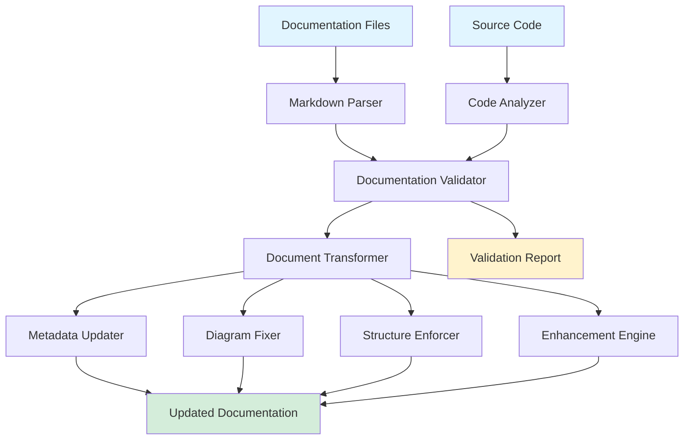

# Design Document: Documentation Standardization

**Version:** 1.0.0 | **Date:** 2026-01-20

## Overview

The Documentation Standardization system is a comprehensive documentation transformation pipeline that ensures consistency, accuracy, and professionalism across all VNRacing project documentation. The system operates through 8 sequential phases, processing markdown files, Mermaid diagrams, and cross-references while maintaining synchronization with the actual source code implementation.

This is fundamentally a document processing and validation system that:
- Parses and transforms markdown files with metadata updates
- Analyzes and restructures Mermaid diagram syntax
- Validates documentation against source code structure
- Generates navigation aids and quality enhancements
- Maintains referential integrity across documentation

## Architecture

### High-Level Architecture



**Legend:**
- Light Blue: Input sources
- Green: Output artifacts
- Yellow: Reports and logs
- White: Processing components

### Processing Pipeline

The system follows an 8-phase sequential pipeline:

1. **Phase 1: Foundation** - Process root-level and standards documentation
2. **Phase 2: Car Customization Merge** - Merge v2 into main customization docs
3. **Phase 3: Architecture** - Fix architecture documentation and diagrams
4. **Phase 4: Cross-Reference** - Synchronize cross-reference files
5. **Phase 5-6: Core Features** - Deep sync 11 core feature documentation
6. **Phase 7: Additional Features** - Process remaining features
7. **Phase 8: Final Polish** - Consistency check and validation

Each phase is independent and can be executed sequentially, with validation checkpoints between phases.

## Components and Interfaces

### 1. Markdown Parser

**Purpose:** Parse markdown files into structured AST for manipulation

**Interface:**
```cpp
class MarkdownParser {
public:
    // Parse markdown file into document structure
    MarkdownDocument Parse(const FString& FilePath);
    
    // Extract metadata from frontmatter or header
    FDocumentMetadata ExtractMetadata(const MarkdownDocument& Doc);
    
    // Extract all Mermaid diagram blocks
    TArray<FMermaidBlock> ExtractMermaidDiagrams(const MarkdownDocument& Doc);
    
    // Extract all links and cross-references
    TArray<FDocumentLink> ExtractLinks(const MarkdownDocument& Doc);
};
```

**Data Structures:**
```cpp
struct MarkdownDocument {
    FString FilePath;
    FString RawContent;
    TArray<FMarkdownSection> Sections;
    FDocumentMetadata Metadata;
    TArray<FMermaidBlock> Diagrams;
    TArray<FDocumentLink> Links;
};

struct FDocumentMetadata {
    FString Version;
    FString Date;
    FString Title;
    FString Status; // Complete/Development/Deprecated
};

struct FMermaidBlock {
    int32 StartLine;
    int32 EndLine;
    FString DiagramType; // graph, flowchart, sequenceDiagram, etc.
    FString Content;
};

struct FDocumentLink {
    FString LinkText;
    FString TargetPath;
    int32 LineNumber;
    bool bIsValid;
};
```

### 2. Code Analyzer

**Purpose:** Analyze source code structure to validate documentation accuracy

**Interface:**
```cpp
class CodeAnalyzer {
public:
    // Scan source directory and build code structure map
    FCodeStructure AnalyzeSourceCode(const FString& SourcePath);
    
    // Find class definition in source code
    TOptional<FClassInfo> FindClass(const FString& ClassName);
    
    // Find function signature in source code
    TOptional<FFunctionInfo> FindFunction(const FString& ClassName, const FString& FunctionName);
    
    // Verify file exists at specified path
    bool VerifyFilePath(const FString& RelativePath);
    
    // Get all classes in a specific module/plugin
    TArray<FClassInfo> GetClassesInModule(const FString& ModuleName);
};
```

**Data Structures:**
```cpp
struct FCodeStructure {
    TMap<FString, FClassInfo> Classes;
    TMap<FString, FModuleInfo> Modules;
    TMap<FString, FPluginInfo> Plugins;
};

struct FClassInfo {
    FString ClassName;
    FString FilePath;
    FString ModuleName;
    TArray<FFunctionInfo> Functions;
    TArray<FString> BaseClasses;
};

struct FFunctionInfo {
    FString FunctionName;
    FString ReturnType;
    TArray<FParameterInfo> Parameters;
    bool bIsVirtual;
    bool bIsConst;
};

struct FModuleInfo {
    FString ModuleName;
    FString ModulePath;
    TArray<FString> Classes;
};

struct FPluginInfo {
    FString PluginName;
    FString PluginPath;
    TArray<FString> Modules;
};
```

### 3. Documentation Validator

**Purpose:** Validate documentation against source code and internal consistency

**Interface:**
```cpp
class DocumentationValidator {
public:
    // Validate single document
    FValidationResult ValidateDocument(const MarkdownDocument& Doc, const FCodeStructure& CodeStructure);
    
    // Validate all cross-references in a document
    TArray<FValidationIssue> ValidateLinks(const MarkdownDocument& Doc);
    
    // Validate class references match source code
    TArray<FValidationIssue> ValidateClassReferences(const MarkdownDocument& Doc, const FCodeStructure& CodeStructure);
    
    // Validate function signatures match source code
    TArray<FValidationIssue> ValidateFunctionReferences(const MarkdownDocument& Doc, const FCodeStructure& CodeStructure);
    
    // Validate Mermaid diagrams render correctly
    TArray<FValidationIssue> ValidateMermaidDiagrams(const MarkdownDocument& Doc);
};
```

**Data Structures:**
```cpp
struct FValidationResult {
    bool bIsValid;
    TArray<FValidationIssue> Issues;
    TArray<FValidationWarning> Warnings;
};

struct FValidationIssue {
    EIssueType Type; // BrokenLink, ClassMismatch, FunctionMismatch, InvalidDiagram
    FString Message;
    int32 LineNumber;
    ESeverity Severity; // Error, Warning, Info
};

enum class EIssueType {
    BrokenLink,
    ClassMismatch,
    FunctionMismatch,
    InvalidDiagram,
    MissingMetadata,
    StructureViolation
};
```

### 4. Document Transformer

**Purpose:** Apply transformations to documentation (metadata updates, structure fixes, enhancements)

**Interface:**
```cpp
class DocumentTransformer {
public:
    // Update document metadata (version, date)
    MarkdownDocument UpdateMetadata(const MarkdownDocument& Doc, const FDocumentMetadata& NewMetadata);
    
    // Fix Mermaid diagram overlaps and layout
    MarkdownDocument FixMermaidDiagrams(const MarkdownDocument& Doc);
    
    // Enforce 5-phase structure for feature documentation
    MarkdownDocument EnforceStructure(const MarkdownDocument& Doc, const FString& FeatureName);
    
    // Add professional enhancements (TOC, badges, breadcrumbs)
    MarkdownDocument AddEnhancements(const MarkdownDocument& Doc);
    
    // Update cross-references after file moves/renames
    MarkdownDocument UpdateLinks(const MarkdownDocument& Doc, const TMap<FString, FString>& PathMappings);
    
    // Serialize document back to markdown string
    FString SerializeToMarkdown(const MarkdownDocument& Doc);
};
```

### 5. Diagram Fixer

**Purpose:** Analyze and fix Mermaid diagram layout issues

**Interface:**
```cpp
class DiagramFixer {
public:
    // Analyze diagram for overlapping nodes
    TArray<FDiagramIssue> AnalyzeDiagram(const FMermaidBlock& Diagram);
    
    // Fix node overlaps by adjusting layout
    FMermaidBlock FixNodeOverlaps(const FMermaidBlock& Diagram);
    
    // Minimize connection line crossings
    FMermaidBlock MinimizeLineCrossings(const FMermaidBlock& Diagram);
    
    // Add legend to diagram
    FMermaidBlock AddLegend(const FMermaidBlock& Diagram, const TArray<FLegendEntry>& Entries);
    
    // Split large diagram into multiple focused diagrams
    TArray<FMermaidBlock> SplitDiagram(const FMermaidBlock& Diagram, int32 MaxNodes);
};
```

**Data Structures:**
```cpp
struct FDiagramIssue {
    EDiagramIssueType Type; // NodeOverlap, LineCrossing, TooManyNodes
    FString Description;
    TArray<FString> AffectedNodes;
};

struct FLegendEntry {
    FString Symbol;
    FString Description;
    FString Color;
};
```

### 6. Enhancement Engine

**Purpose:** Add professional quality enhancements to documentation

**Interface:**
```cpp
class EnhancementEngine {
public:
    // Generate Table of Contents for document
    FString GenerateTableOfContents(const MarkdownDocument& Doc);
    
    // Add status badge to document
    FString GenerateStatusBadge(const FString& Status);
    
    // Add breadcrumb navigation
    FString GenerateBreadcrumbs(const FString& FilePath);
    
    // Standardize emoji usage
    FString StandardizeEmojis(const FString& Content);
    
    // Add diagram legend
    FString GenerateDiagramLegend(const TArray<FLegendEntry>& Entries);
};
```

### 7. Phase Executor

**Purpose:** Execute each of the 8 standardization phases

**Interface:**
```cpp
class PhaseExecutor {
public:
    // Execute specific phase
    FPhaseResult ExecutePhase(EPhase Phase);
    
    // Execute all phases sequentially
    TArray<FPhaseResult> ExecuteAllPhases();
    
    // Validate phase completion
    bool ValidatePhaseCompletion(EPhase Phase);
};
```

**Data Structures:**
```cpp
enum class EPhase {
    Foundation,
    CarCustomizationMerge,
    Architecture,
    CrossReference,
    CoreFeaturesSync,
    AdditionalFeaturesSync,
    FinalPolish
};

struct FPhaseResult {
    EPhase Phase;
    bool bSuccess;
    int32 FilesProcessed;
    int32 FilesModified;
    TArray<FValidationIssue> Issues;
    FString Summary;
};
```

## Data Models

### File System Structure

```
Docs/
├── README.md                          [Foundation]
├── CHANGELOG.md                       [Foundation]
├── _architecture/                     [Architecture Phase]
│   ├── system-overview.md
│   ├── module-dependencies.md
│   ├── data-flow.md
│   ├── plugin-architecture.md
│   ├── multiplayer-architecture.md
│   ├── ui-architecture.md
│   ├── physics-architecture.md
│   └── backend-architecture.md
├── _cross-reference/                  [Cross-Reference Phase]
│   ├── feature-dependencies.md
│   ├── class-index.md
│   ├── api-reference.md
│   └── glossary.md
├── _standards/                        [Foundation]
│   ├── coding-standards.md
│   ├── documentation-standards.md
│   ├── naming-conventions.md
│   └── git-workflow.md
├── _templates/                        [Foundation]
│   ├── requirements/
│   ├── design/
│   ├── planning/
│   ├── implementation/
│   ├── testing/
│   └── feature-template.md
└── features/                          [Feature Sync Phases]
    ├── car-physics/
    │   ├── requirements/
    │   ├── design/
    │   ├── planning/
    │   ├── implementation/
    │   └── testing/
    ├── car-customization/             [Merge Target]
    ├── progression-system/
    ├── profiles-inventory/
    ├── setting-system/
    ├── race-modes/
    ├── multiplayer/
    ├── shop-system/
    ├── racer-ai/
    ├── tutorials/
    └── minimap-system/
```

### Feature-to-Source Mapping

```cpp
struct FFeatureSourceMapping {
    FString FeatureName;
    TArray<FString> SourcePaths;
    TArray<FString> PluginPaths;
    FString PrimaryModule;
};

// Example mappings
TMap<FString, FFeatureSourceMapping> FeatureMappings = {
    {"car-physics", {
        SourcePaths: {},
        PluginPaths: {"Plugins/SimpleCarPhysics/"},
        PrimaryModule: "SimpleCarPhysics"
    }},
    {"car-customization", {
        SourcePaths: {"Source/PrototypeRacing/Private/CarCustomizationSystem/"},
        PluginPaths: {},
        PrimaryModule: "PrototypeRacing"
    }},
    {"progression-system", {
        SourcePaths: {"Source/PrototypeRacing/Private/ProgressionSystem/"},
        PluginPaths: {},
        PrimaryModule: "PrototypeRacing"
    }},
    // ... additional mappings
};
```

### Metadata Standard

All documentation files must include:

```markdown
# Document Title

**Version:** 1.0.0 | **Date:** 2026-01-20 | **Status:** Complete

**Breadcrumbs:** Docs > Features > Car Physics > Design

[Table of Contents - if > 100 lines]

## Content...
```

### Status Badge Format

```markdown


```

### Emoji Standards

- ✅ Complete
- 🔄 In Progress/Development
- ⏸️ Paused/On Hold
- ⚠️ Deprecated/Warning
- 📝 Documentation
- 🔧 Implementation
- 🧪 Testing
- 🎯 Planning

## Correctness Properties

*A property is a characteristic or behavior that should hold true across all valid executions of a system—essentially, a formal statement about what the system should do. Properties serve as the bridge between human-readable specifications and machine-verifiable correctness guarantees.*


### Property 1: Metadata Standardization

*For any* markdown file in the documentation system, after processing, the file should contain metadata formatted as "Version: 1.0.0 | Date: 2026-01-20"

**Validates: Requirements 1.1, 1.2, 1.3**

### Property 2: CHANGELOG Preservation

*For any* CHANGELOG.md file with existing version entries, after updating to version 1.0.0, all previous version entries should remain unchanged in content and order

**Validates: Requirements 1.4**

### Property 3: Five-Phase Structure Enforcement

*For any* feature folder in features/, after processing, the folder should contain exactly 5 subdirectories: requirements/, design/, planning/, implementation/, and testing/

**Validates: Requirements 2.1, 10.1**

### Property 4: Monitoring Folder Removal

*For any* feature folder containing a monitoring/ subdirectory, after processing, the monitoring/ subdirectory should not exist

**Validates: Requirements 2.2**

### Property 5: Phase Folder Population

*For any* phase folder (requirements/, design/, planning/, implementation/, testing/) in a feature, after processing, the folder should contain at least one markdown file

**Validates: Requirements 2.3**

### Property 6: Placeholder Creation

*For any* missing phase folder in a feature directory, after processing, the folder should exist and contain a placeholder file with text "To be documented"

**Validates: Requirements 2.4**

### Property 7: Naming Convention Consistency

*For any* set of phase folders within a feature, all folder names should follow lowercase hyphenated naming convention (e.g., "requirements" not "Requirements")

**Validates: Requirements 2.5**

### Property 8: Diagram Legend Addition

*For any* Mermaid diagram containing styled elements (colors, shapes, line types), after processing, the diagram should be followed by a legend section explaining the styling

**Validates: Requirements 3.3, 5.6**

### Property 9: Mermaid Syntax Validation

*For any* Mermaid diagram block in documentation, the diagram syntax should be valid and parseable by standard Mermaid parsers

**Validates: Requirements 3.4**

### Property 10: Large Diagram Splitting

*For any* Mermaid diagram containing more than 20 nodes, after processing, the diagram should be split into multiple diagrams, each containing 20 or fewer nodes

**Validates: Requirements 3.5**

### Property 11: Class Name Validation

*For any* class name referenced in documentation, the class should exist in the source code at the documented location

**Validates: Requirements 4.1**

### Property 12: Function Signature Validation

*For any* function signature documented in markdown, the signature (name, return type, parameters) should match the actual implementation in source code

**Validates: Requirements 4.2**

### Property 13: File Path Validation

*For any* source file path referenced in documentation, the file should exist at the specified path relative to the project root

**Validates: Requirements 4.3**

### Property 14: Documentation Update on Mismatch

*For any* class, function, or file reference in documentation that doesn't match source code, after processing, the documentation should be updated to match the actual source code structure

**Validates: Requirements 4.4**

### Property 15: Plugin Reference Validation

*For any* plugin name referenced in documentation, the plugin should exist in the Plugins/ directory

**Validates: Requirements 4.5**

### Property 16: Feature-Source Mapping Accuracy

*For any* feature in the feature-to-source mapping, all listed source paths and plugin paths should exist and contain code related to that feature

**Validates: Requirements 4.6**

### Property 17: Table of Contents Generation

*For any* markdown file exceeding 100 lines, after processing, the file should contain a Table of Contents section near the beginning

**Validates: Requirements 5.1**

### Property 18: Emoji Standardization

*For any* status indicator in documentation, the emoji used should match the standard mapping: ✅ for complete, 🔄 for in progress, ⏸️ for paused, ⚠️ for deprecated

**Validates: Requirements 5.2**

### Property 19: Status Badge Presence

*For any* feature documentation file, after processing, the file should contain a status badge indicating Complete, Development, or Deprecated

**Validates: Requirements 5.3**

### Property 20: Breadcrumb Navigation

*For any* feature documentation file, after processing, the file should contain breadcrumb navigation showing the file's location in the documentation hierarchy

**Validates: Requirements 5.4**

### Property 21: Link Validation

*For any* cross-reference link in documentation, the link target should point to an existing file in the documentation system

**Validates: Requirements 5.5, 9.1, 11.4**

### Property 22: Standards Formatting Consistency

*For any* pair of files in the _standards/ directory, both files should follow the same markdown formatting conventions (heading levels, list styles, code block formatting)

**Validates: Requirements 6.3**

### Property 23: Standards-Code Alignment

*For any* coding practice documented in _standards/, the practice should be observable in the actual source code

**Validates: Requirements 6.4**

### Property 24: Template Phase Structure

*For any* template file in _templates/, the template should reference all 5 phases: requirements, design, planning, implementation, testing

**Validates: Requirements 6.5**

### Property 25: Content Merge Completeness

*For any* file in features/car-customization-v2/, after merge processing, an equivalent file should exist in features/car-customization/ with the same or merged content

**Validates: Requirements 7.1**

### Property 26: Merge Conflict Resolution

*For any* file existing in both car-customization/ and car-customization-v2/, after merge processing, the resulting file should contain the content from the file with the most recent modification timestamp

**Validates: Requirements 7.2**

### Property 27: V2 Folder Removal

*After* car customization merge processing, the features/car-customization-v2/ directory should not exist

**Validates: Requirements 7.4**

### Property 28: Cross-Reference Update After Merge

*For any* link in documentation pointing to car-customization-v2/, after merge processing, the link should be updated to point to car-customization/

**Validates: Requirements 7.5, 9.3**

### Property 29: Broken Link Correction

*For any* broken cross-reference link in _cross-reference/ files, after processing, the link should be updated to point to the correct existing file path

**Validates: Requirements 9.2**

### Property 30: Core Feature Coverage

*For any* cross-reference index file, the file should contain references to all 11 core features: car-physics, car-customization, progression-system, profiles-inventory, setting-system, race-modes, multiplayer, shop-system, racer-ai, tutorials, minimap-system

**Validates: Requirements 9.4**

### Property 31: Markdown Formatting Consistency

*For any* pair of documentation files, both files should use consistent markdown formatting for equivalent elements (e.g., same heading style, same list marker style, same code fence style)

**Validates: Requirements 11.1**

### Property 32: Status Badge Validity

*For any* status badge in documentation, the badge value should be one of: Complete, Development, or Deprecated

**Validates: Requirements 11.5**

## Error Handling

### Validation Errors

**File Not Found Errors:**
- When a referenced source file doesn't exist, log a validation error with the file path and referencing documentation
- Continue processing other files
- Include in final validation report

**Class/Function Mismatch Errors:**
- When a class or function reference doesn't match source code, log the mismatch with details
- Attempt automatic correction if possible
- Flag for manual review if automatic correction is ambiguous

**Broken Link Errors:**
- When a cross-reference link is broken, attempt to find the correct target by filename
- If found, update the link automatically
- If not found, log error and flag for manual review

### Transformation Errors

**Mermaid Diagram Parsing Errors:**
- If a Mermaid diagram has invalid syntax, log the error with line numbers
- Do not attempt to fix syntax errors automatically (risk of breaking diagram)
- Flag for manual review

**Merge Conflict Errors:**
- If merge conflict resolution fails (e.g., both files modified at same time), log the conflict
- Preserve both versions with conflict markers
- Flag for manual review

**File System Errors:**
- If file write fails (permissions, disk space), log error and halt processing
- Ensure atomic writes (write to temp file, then rename)
- Rollback on failure

### Recovery Strategies

**Checkpoint System:**
- Save progress after each phase completion
- Allow resuming from last successful phase
- Store phase results in .kiro/specs/documentation-standardization/progress.json

**Dry Run Mode:**
- Support dry-run mode that validates without making changes
- Generate report of all planned changes
- Allow user review before applying changes

**Backup Strategy:**
- Create backup of Docs/ directory before processing
- Store backup in Docs_Backup_YYYYMMDD_HHMMSS/
- Allow rollback to backup if needed

## Testing Strategy

### Dual Testing Approach

This system requires both unit tests and property-based tests for comprehensive coverage:

**Unit Tests** focus on:
- Specific examples of metadata formatting
- Edge cases like empty files, malformed markdown
- Integration between components (parser → validator → transformer)
- Specific file operations (merge, split, rename)

**Property-Based Tests** focus on:
- Universal properties across all documentation files
- Validation rules that should hold for any input
- Transformation invariants (e.g., line count preservation where applicable)
- Comprehensive input coverage through randomization

### Property-Based Testing Configuration

**Testing Library:** Since this is a documentation processing system that could be implemented in multiple languages, the specific PBT library will depend on implementation language:
- Python: Hypothesis
- TypeScript/JavaScript: fast-check
- C++: RapidCheck or Catch2 with generators

**Test Configuration:**
- Minimum 100 iterations per property test
- Each property test references its design document property number
- Tag format: **Feature: documentation-standardization, Property {N}: {property_text}**

### Test Data Generation

**Markdown File Generators:**
- Generate random markdown files with varying:
  - Line counts (0-1000 lines)
  - Metadata formats (present/absent, various formats)
  - Link counts and targets
  - Mermaid diagram counts and complexity
  - Heading structures

**Source Code Structure Generators:**
- Generate mock source code structures with:
  - Random class names and hierarchies
  - Random function signatures
  - Random file paths
  - Random plugin structures

**Feature Folder Generators:**
- Generate random feature folder structures with:
  - Varying phase folder presence
  - Random file counts per phase
  - Random monitoring/ folder presence

### Unit Test Coverage

**Parser Tests:**
- Test parsing valid markdown files
- Test parsing malformed markdown
- Test metadata extraction from various formats
- Test Mermaid block extraction
- Test link extraction

**Validator Tests:**
- Test validation against mock source code
- Test broken link detection
- Test diagram syntax validation
- Test metadata validation

**Transformer Tests:**
- Test metadata updates
- Test structure enforcement
- Test enhancement addition (TOC, badges, breadcrumbs)
- Test link updates

**Phase Executor Tests:**
- Test each phase execution independently
- Test phase checkpoint and resume
- Test rollback on failure

### Integration Tests

**End-to-End Phase Tests:**
- Test complete Phase 1 (Foundation) execution
- Test complete Phase 2 (Car Customization Merge) execution
- Test complete Phase 3 (Architecture) execution
- Verify phase results match expected outcomes

**Cross-Component Tests:**
- Test parser → validator → transformer pipeline
- Test validation error propagation
- Test transformation result validation

### Property Test Examples

**Property 1 Test (Metadata Standardization):**
```python
# Feature: documentation-standardization, Property 1: Metadata standardization
@given(markdown_file=markdown_file_generator())
def test_metadata_standardization(markdown_file):
    result = process_document(markdown_file)
    metadata = extract_metadata(result)
    assert metadata.version == "1.0.0"
    assert metadata.date == "2026-01-20"
    assert "Version: 1.0.0 | Date: 2026-01-20" in result.content
```

**Property 3 Test (Five-Phase Structure):**
```python
# Feature: documentation-standardization, Property 3: Five-phase structure enforcement
@given(feature_folder=feature_folder_generator())
def test_five_phase_structure(feature_folder):
    result = enforce_structure(feature_folder)
    subdirs = get_subdirectories(result)
    assert len(subdirs) == 5
    assert "requirements" in subdirs
    assert "design" in subdirs
    assert "planning" in subdirs
    assert "implementation" in subdirs
    assert "testing" in subdirs
    assert "monitoring" not in subdirs
```

**Property 11 Test (Class Name Validation):**
```python
# Feature: documentation-standardization, Property 11: Class name validation
@given(doc=documentation_with_class_refs(), code=source_code_structure())
def test_class_name_validation(doc, code):
    validation_result = validate_document(doc, code)
    for class_ref in doc.class_references:
        if class_ref in code.classes:
            assert not has_error(validation_result, class_ref)
        else:
            assert has_error(validation_result, class_ref, "ClassNotFound")
```

### Manual Testing Checklist

Since some aspects are difficult to test automatically:

- [ ] Visually inspect Mermaid diagrams for overlaps (Requirements 3.1, 3.2)
- [ ] Verify breadcrumb navigation is readable and accurate
- [ ] Verify status badges render correctly in GitHub/GitLab
- [ ] Verify Table of Contents links work correctly
- [ ] Verify diagram legends are clear and complete
- [ ] Review merge results for car-customization to ensure no content loss
- [ ] Verify final documentation is professional and consistent

### Test Execution Strategy

1. **Run unit tests first** - Fast feedback on component functionality
2. **Run property tests** - Comprehensive validation of universal properties (100+ iterations each)
3. **Run integration tests** - Verify end-to-end phase execution
4. **Run dry-run mode** - Generate change report without applying changes
5. **Manual review** - Review change report and visual elements
6. **Execute phases** - Apply changes with checkpoint system
7. **Run validation suite** - Verify all properties hold after changes
8. **Manual verification** - Final visual inspection of critical documentation

This dual approach ensures both specific correctness (unit tests) and universal correctness (property tests) while acknowledging that some quality aspects require human judgment.
