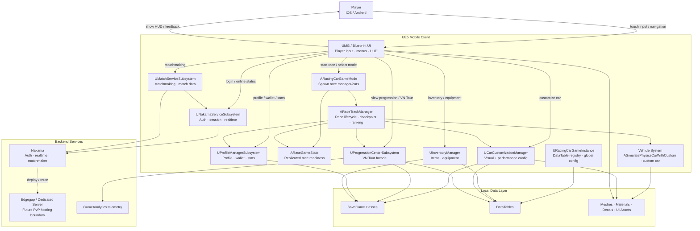
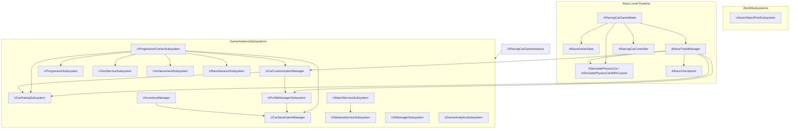
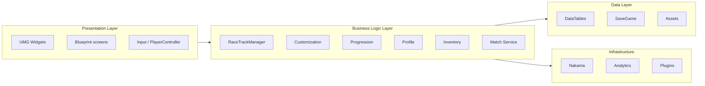
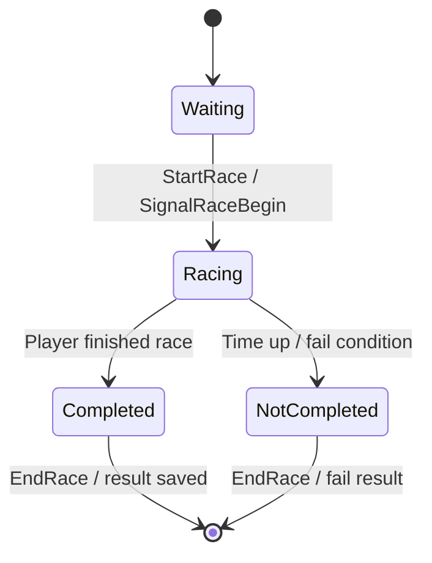
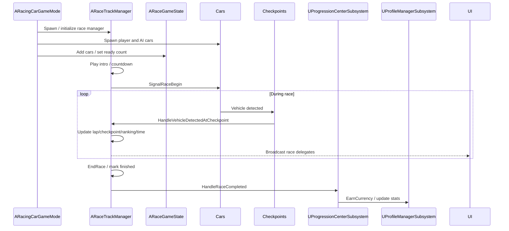
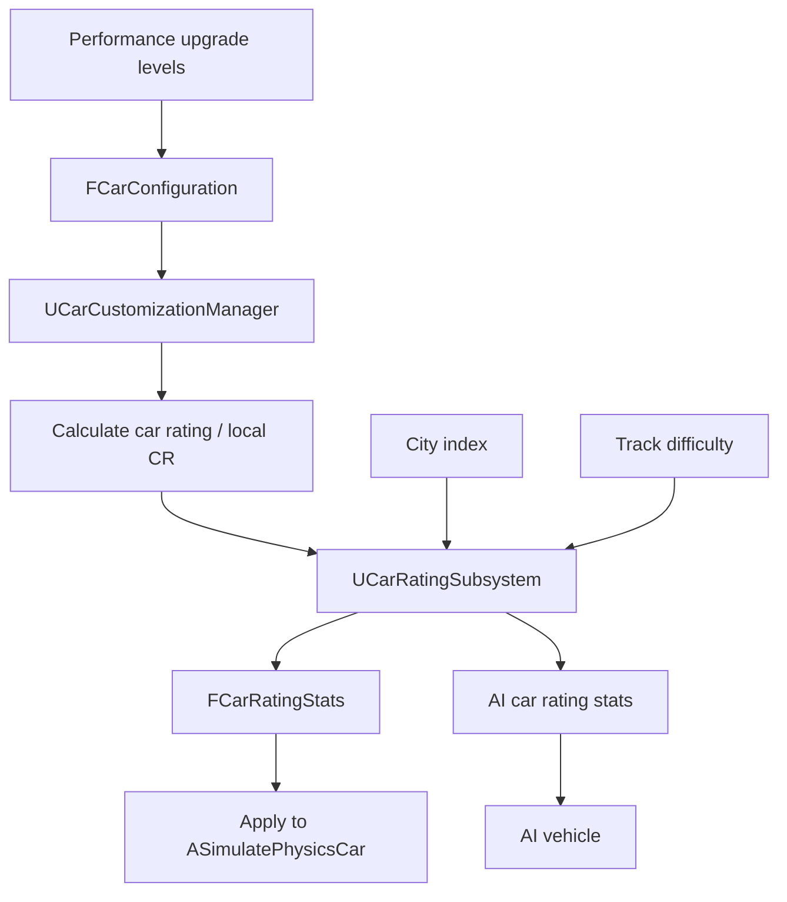
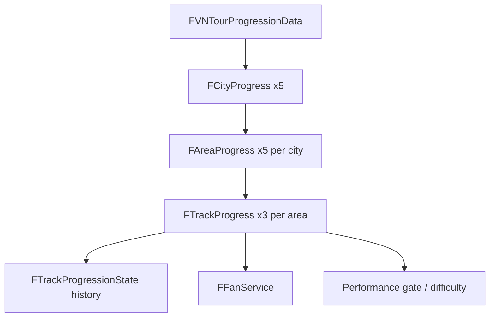
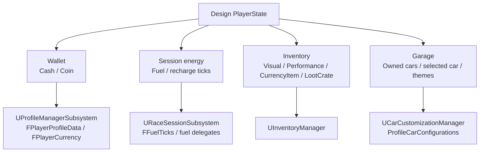
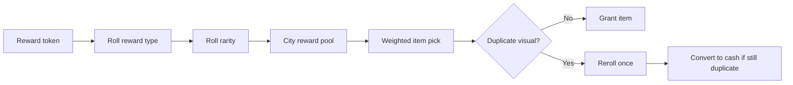
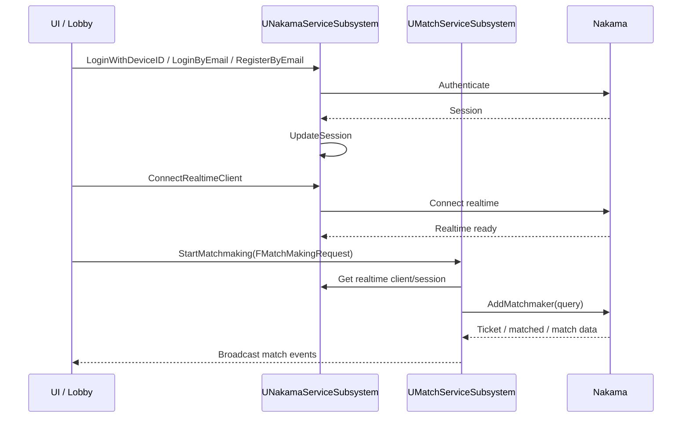

# High Level Design — VNRacing

> Tài liệu high-level design
>
> Game: Mobile racing game / VN Tour / customization / online multiplayer
>
> Engine: Unreal Engine 5.x project; exact local engine install is referenced by `PrototypeRacing.uproject` `EngineAssociation` GUID
>
> Backend: Nakama · Matchmaking: Nakama Realtime · Hosting target: Edgegap/dedicated-server path, chưa được source code xác nhận là luồng race server-authoritative
>
> Source module: `PrototypeRacing`
>
> Cập nhật: 2026-05-14

---

# 0. Mục Tiêu Tài Liệu

Tài liệu này tổng hợp kiến trúc cấp hệ thống của VNRacing từ tài liệu design mới, tài liệu kiến trúc cũ, và source code hiện tại. Mục tiêu là mô tả rõ kiến trúc chính thức của VNRacing theo đặc thù mobile racing game, VN Tour, customization, progression, economy, và online multiplayer.

| Mục tiêu | Nội dung |
| --- | --- |
| Runtime architecture | UE5 GameInstance, GameMode, GameState, RaceTrackManager, subsystem ownership |
| Race gameplay | Race lifecycle, checkpoint/lap/ranking, race mode, AI opponents, result flow |
| Vehicle system | Player/AI car spawning, physics plugin integration, car rating stat application |
| Meta-game | Car customization, progression, profile, wallet, inventory, rewards |
| Online service | Nakama auth/realtime/matchmaking, future dedicated-server boundary |
| Data architecture | DataTables, SaveGame classes, asset contracts, UI-facing subsystem APIs |
| Implementation reference | Map high-level domains to actual C++ classes/files |

### 0.1 Quy tắc ưu tiên nguồn tham chiếu

| Nguồn | Vai trò |
| --- | --- |
| `Racing/Source/PrototypeRacing/` | Nguồn ưu tiên cho hiện trạng kỹ thuật: tên class, quyền sở hữu subsystem, API hiện tại |
| `Docs/CarCustomize_V2.md` | Nguồn tham chiếu cho thiết kế visual/performance customization |
| `Docs/Progression_V8.md` | Nguồn tham chiếu cho thiết kế VN Tour, CR, economy, goals, rewards |
| `Docs/PlayerState_V1.md` | Nguồn tham chiếu cho thiết kế wallet, inventory, garage |
| `Docs/Item_Rewards_V2.md` | Nguồn tham chiếu cho thiết kế random reward/token flow |
| `VNRacing/Docs/` | Nguồn tham khảo kiến trúc cũ; không ưu tiên hơn source nếu conflict |

---

# 1. Tổng Quan Hệ Thống

VNRacing là mobile-first racing game xây dựng bằng Unreal Engine. Core loop gồm chọn track trong VN Tour, đua với AI/opponent, nhận thưởng, nâng cấp hoặc customize xe, rồi mở khóa city/track/reward mới.

### 1.1 Core pillars

| Pillar | High-level responsibility |
| --- | --- |
| Race runtime | Spawn cars, start/end race, track checkpoints, ranking, timers, fan service UI |
| Vehicle physics | Use vehicle actor/controller classes and physics plugin parameters for racing feel |
| Car customization | Manage garage car configurations, visual parts/materials/decals, performance upgrade, preview/apply/save |
| Car rating | Convert local upgrade levels and car type into CR/performance stats; map AI difficulty per city |
| Progression | VN Tour city/area/track hierarchy, race setup, race completion, goals, reward calculation |
| Player state | Profile, wallet currencies, inventory, garage ownership, stats |
| Online | Nakama auth/session/realtime/matchmaking; multiplayer lobby and future server deployment |
| Tooling | Debug modules, analytics, `UPerformanceMonitorSubsystem`, PSO helpers, world-scoped object pool |

---

# 2. Runtime Architecture

VNRacing uses UE5 framework classes plus long-lived `UGameInstanceSubsystem` services.

### 2.1 Lifecycle ownership

| Runtime object | Lifetime | Responsibility |
| --- | --- | --- |
| `URacingCarGameInstance` | App lifetime | Holds global DataTable references, tutorial config, inventory defaults, car rating tables, PSO flags |
| `UGameInstanceSubsystem`s | App lifetime | Business logic/data services shared across maps |
| `ARacingCarGameMode` | Race level server/runtime | Initializes race level, spawns race manager/cars, handles player readiness/login/logout |
| `ARaceGameState` | Race level replicated state | Replicates total car count and car list readiness |
| `ARaceTrackManager` | Race level actor | Main race lifecycle, AI setup, checkpoint/lap/ranking, race end, time attack, sequence flow |
| Vehicle actors/controllers | Race level | Player and AI car movement, physics, input/control |

---

# 3. UE5 Client Architecture

### 3.1 UI access pattern

UI reads and mutates game state through subsystem APIs and multicast delegates, not by directly editing SaveGame objects.

| UI domain | Primary API owner |
| --- | --- |
| Garage/customization | `UCarCustomizationManager` |
| VN Tour map/track select | `UProgressionCenterSubsystem` |
| Wallet/profile header | `UProfileManagerSubsystem` |
| Inventory screen | `UInventoryManager` |
| Matchmaking/lobby | `UMatchServiceSubsystem`, `UNakamaServiceSubsystem` |
| Race HUD | `ARaceTrackManager` delegates and race state |

---

# 4. Race Gameplay Architecture

`ARaceTrackManager` is the central runtime race orchestrator. It tracks player and AI race state, checkpoint progress, lap count, ranking, race timing, intro/outro sequence flow, and fan service hooks.

### 4.1 Race modes

| Concept | Source enum/class | Meaning |
| --- | --- | --- |
| Race state | `ERaceState` | Per-player race status: None, Waiting, Racing, Completed, NotCompleted |
| Race mode state | `ERaceModeState` | Race manager phase: None, Waiting, Running, End |
| Race info | `FRaceInfo` | Total laps, race mode, time attack duration/bonus, current players, track difficulty |
| Player race state | `FPlayerRaceState` | Vehicle id, player name, lap/checkpoint progress, time, ranking, AI flag, reward |

### 4.2 Race flow

---

# 5. Vehicle, Physics, and Car Rating Architecture

Vehicle runtime is actor-driven. Player and AI cars use physics-oriented vehicle classes and are configured from DataTables through customization and car rating systems.

| System | Responsibility |
| --- | --- |
| `ARacingCarGameMode` | Spawns player cars and PSO helpers |
| `ARaceTrackManager` | Adds cars to race state, sets up AI cars, applies AI performance/style |
| `UCarCustomizationManager` | Resolves car configuration and in-game performance stats |
| `UCarRatingSubsystem` | Maps CR levels/city/difficulty to `FCarRatingStats` |
| Physics plugins | Provide vehicle simulation implementation and async/performance behavior |

### 5.1 Car rating path

---

# 6. Car Customization Architecture

Customization is split into design-facing mechanics and implementation-facing manager APIs.

### 6.1 Design concepts

| Domain | Rule |
| --- | --- |
| Visual parts | FrontBumper, RearBumper, Sideboard, Spoiler, Roof, Wheel |
| Materials | Body Material, Wheel Material |
| Decals | Body Decals |
| Preview | Locked visual items can be previewed, but cannot be purchased/applied until unlocked |
| Apply | Purchased/unlocked item can be applied to current car configuration |
| Performance | Speed, Acceleration, Grip, Nitro; levels 0-6 |
| CR effect | Speed/Acceleration/Grip affect CR; Nitro does not directly affect CR in design docs |

### 6.2 Implementation owner

`UCarCustomizationManager` owns:

- Current and preview `FCarConfiguration`
- Garage map `ProfileCarConfigurations`
- DataTable references for base cars, parts, styles, colors, decals, materials, performance levels
- Visual apply APIs: part, color, material, style, decal
- Performance upgrade APIs and cost calculation
- Car rating recalculation and in-game performance stats
- Save/load through `UCarSaveGameManager`
- UI delegates for configuration changes, upgrade success/failure, save success/failure

---

# 7. Progression / VN Tour Architecture

VN Tour is the main single-player progression mode. Design docs define 5 cities, 15 tracks per city, 75 tracks total, 15 cars, and approximately 300 minutes target playtime.

### 7.1 Progression ownership

| Class | Responsibility |
| --- | --- |
| `UProgressionCenterSubsystem` | Facade for race setup, travel, result handling, reward calculation, analytics |
| `UProgressionSubsystem` | VN Tour city/area/track data and unlock state |
| `UFanServiceSubsystem` | In-race side mission/fan service progress |
| `UAchievementSubsystem` | Achievement progress and definitions |
| `UCarRatingSubsystem` | Performance gate and difficulty recommendation |
| `URaceSessionSubsystem` | Current race session data and player session state |

### 7.2 City difficulty model

| City | Target role |
| --- | --- |
| City 1 | Onboarding, high win rate, easy track bias |
| City 2-3 | Introduce medium/hard pressure and upgrade loop |
| City 4-5 | Long-tail challenge, high replay rate, deeper CR/economy demand |

---

# 8. PlayerState, Wallet, Inventory, and Garage Architecture

The design-level PlayerState consists of Wallet, Inventory, and Garage. Implementation currently splits these across profile, inventory, and customization systems.

### 8.1 Implementation mapping

| Design concept | Implementation owner |
| --- | --- |
| Wallet balance | `UProfileManagerSubsystem`, `FPlayerCurrency` for Cash/Coin |
| Fuel/session energy | `URaceSessionSubsystem`, `FFuelTicks`, fuel recharge delegates |
| Profile identity/stats | `UProfileManagerSubsystem`, `FPlayerProfileData` |
| Item collection | `UInventoryManager`, `FInventoryItem` |
| Item definition database | `UItemDatabase`, inventory DataTable |
| Garage car configs | `UCarCustomizationManager::ProfileCarConfigurations` |
| Current/preview car | `CarConfiguration`, `PreviewCarConfiguration` |

---

# 9. Rewards / Economy Architecture

Rewards come from race results, goals, achievements, loot crates, and random token pulls.

### 9.1 Reward channels

| Channel | Description | Typical output |
| --- | --- | --- |
| Post-race rewards | Reward after race completion | Cash, tokens, fan service reward |
| Goal rewards | Fixed city goal completion reward | Cash, item, car unlock, city unlock |
| City completion | Completing city milestones | Cash, item, car unlock |
| Achievement | Long-term progression reward | Cash, item, unlock |
| Loot crate | Random reward opening | Cash, visual/performance item |

### 9.2 Random reward flow

Design-defined flow; implementation owner/source mapping remains open until a dedicated reward service or equivalent source owner is confirmed.

---

# 10. Online / Backend Architecture

VNRacing currently has Nakama-facing services for authentication, session, realtime connection, matchmaking, match notifications, and match presence.

### 10.1 Online services

| Class | Responsibility |
| --- | --- |
| `UNakamaServiceSubsystem` | Create Nakama client, auth, session update, realtime client connection |
| `UMatchServiceSubsystem` | Build matchmaking query, start/cancel matchmaking, process match data/presence/ready payload |
| `FMatchMakingRequest` | MapId, MapName, RaceMode, MatchMakingRanking |
| `FMatchmakerNotificationPayload` | Ready/match notification payload parsed from match data |

### 10.2 Current coupling and authority boundary

Source code hiện tại xác nhận các luồng Nakama authentication, session/realtime connection, matchmaking, match data và presence handling. Luồng xác thực race server-authoritative vẫn là mục tiêu kiến trúc; tài liệu này không mặc định rằng Edgegap/dedicated-server race authority đã được triển khai.

`UMatchServiceSubsystem` currently uses `ERaceMode` from race runtime types for matchmaking requests, and `UNakamaServiceSubsystem` and `UMatchServiceSubsystem` hold references across the online flow. A future hardening pass should move shared matchmaking enums/contracts into a neutral shared module and keep dependency direction clear: matchmaking can depend on Nakama client/session access, while Nakama service should avoid depending on match orchestration details where possible.

---

# 11. SaveGame / DataTable / Asset Architecture

### 11.1 DataTables

`URacingCarGameInstance` acts as the top-level registry for major DataTables:

| Category | DataTables |
| --- | --- |
| Progression | Map default, VN Tour progression tables |
| Car rating | CR definition, base values, CR stats, city AI CR |
| Car customization | Base cars, parts, styles, colors, decals, materials, performance stat levels |
| Profile | Avatar, forbidden words, random names |
| Inventory | Inventory items and default settings |
| Tutorial | Tooltip and script step tables |

### 11.2 Save boundaries

Save architecture has three separate concepts:

| Concept | Meaning |
| --- | --- |
| Domain owner | Subsystem allowed to mutate business state, e.g. customization/profile/inventory/progression |
| Save facade/helper | Manager API used by domain owners to load/save data, mainly `UCarSaveGameManager` |
| Physical SaveGame class/slot | UE storage object such as `RacingSaveGame`, `ProfileInventorySaveGame`, `ProgressionSaveGame`, `CarSaveSetting`, or named fuel/profile slots |

| Data | Domain owner | Save facade / storage |
| --- | --- | --- |
| Car configurations | `UCarCustomizationManager` | `UCarSaveGameManager` → `RacingSaveGame` |
| Profile/wallet/stats | `UProfileManagerSubsystem` / `URaceSessionSubsystem` profile fields | `UCarSaveGameManager` / profile save slot |
| Fuel/session energy | `URaceSessionSubsystem` | `FFuelTicks`, `FuelTicksSaveName` |
| Inventory | `UInventoryManager` | `UCarSaveGameManager` → `ProfileInventorySaveGame` |
| Progression/achievements | `UProgressionSubsystem` / `UAchievementSubsystem` | progression save classes / save manager |
| Settings | `UCarSettingSubsystem` | `CarSaveSetting` |

---

# 12. Analytics, Debug, and Performance Architecture

| Area | Source systems |
| --- | --- |
| Race analytics | `UProgressionCenterSubsystem` race start/result/metrics methods, `UGameAnalyticsSubsystem` |
| Debug tooling | `DebugSystem` modules for camera, cheat, gameplay, overlay, progression, rendering, test maps, track logic, tutorial, vehicle |
| Performance monitor | `UPerformanceMonitorSubsystem`, lite significance manager/settings/station |
| PSO helpers | PSO camera drone, effect manager, precache save game, rest level manager |
| Object pooling | `UActorObjectPoolSubsystem : UWorldSubsystem`, `IPoolObjectInterface` |

---

# 13. Trust Boundaries and Validation

| Boundary | Rule |
| --- | --- |
| Local SaveGame | Convenient local persistence; should not be treated as secure economy authority for online modes |
| Nakama auth/session | Required for online identity and realtime/matchmaking |
| Matchmaking query | Built from controlled request fields: map, mode, ranking |
| Currency spend | Must go through `UProfileManagerSubsystem::SpendCurrency` and broadcast insufficient currency on failure |
| Inventory mutation | Must go through `UInventoryManager` add/remove/equip APIs |
| Car upgrade | Must go through `UCarCustomizationManager::UpgradePerformanceStat` and fail delegates |
| Race result | Race runtime should be computed by `ARaceTrackManager` and handed to progression/profile systems |

---

# 14. Technology Stack

| Layer | Technology |
| --- | --- |
| Engine | Unreal Engine 5.x project; `.uproject` uses an `EngineAssociation` GUID rather than a source-verifiable semantic version |
| Language | C++ / Blueprint; exact C++ standard follows the configured Unreal toolchain unless explicitly set in Build.cs |
| UI | UMG and Blueprint UI flow |
| Vehicle physics | SimpleCarPhysics, AsyncTickPhysics, ChaosVehicles dependency |
| Backend | Nakama Unreal SDK |
| Matchmaking | Nakama realtime/matchmaker |
| Hosting target | Edgegap plugin enabled and dedicated-server architecture path referenced; luồng race server-authoritative chưa được xác nhận trong source code ở lượt rà soát này |
| Analytics | GameAnalytics telemetry through `UGameAnalyticsSubsystem` |
| Data | UE DataTables, SaveGame classes, assets |
| Platforms | Android, iOS |

---

# 15. Risks, Assumptions, Open Questions

| Topic | Status |
| --- | --- |
| Old architecture docs | Some files are corrupted/incomplete; source should override them |
| Fuel/session energy | `ECurrencyType` covers Cash/Coin, while Fuel is implemented separately in `URaceSessionSubsystem` through `FFuelTicks` and fuel recharge APIs |
| Dedicated server | Edgegap plugin is enabled and architecture docs mention a dedicated-server path; current source shows Nakama realtime/matchmaking services, but server-authoritative race validation still needs deeper implementation design |
| Reward duplicate compensation | Design docs define behavior; implementation owner should be confirmed when reward system code is expanded/refined |
| UI state details | This HLD maps owners, not per-widget UX states |
| Security/economy authority | Current local SaveGame implementation is appropriate for offline/prototype; online economy needs server-authoritative Nakama rules if shipping competitive economy |

---

# 16. Related Low-Level Document

Implementation details are specified in `Docs/VNRacing_LLD.md`.
