# High Level Design — VNRacing

> Tài liệu high-level design
>
> Game: Mobile racing game / VN Tour / customization / online multiplayer
>
> Engine: Unreal Engine 5.x project; exact local engine install is referenced by `PrototypeRacing.uproject` `EngineAssociation` GUID
>
> Backend: Nakama · Matchmaking: Nakama Realtime · Hosting target: Edgegap/dedicated-server path, chưa được source code xác nhận là luồng race server-authoritative
>
> Source module: `PrototypeRacing`
>
> Cập nhật: 2026-05-19

---

# 0. Mục Tiêu Tài Liệu

Tài liệu này tổng hợp kiến trúc cấp hệ thống của VNRacing từ tài liệu design mới, tài liệu kiến trúc cũ, và source code hiện tại. Mục tiêu là mô tả rõ kiến trúc chính thức của VNRacing theo đặc thù mobile racing game, VN Tour, customization, progression, economy, và online multiplayer.

| Mục tiêu | Nội dung |
| --- | --- |
| Runtime architecture | UE5 GameInstance, GameMode, GameState, RaceTrackManager, subsystem ownership |
| Race gameplay | Race lifecycle, checkpoint/lap/ranking, race mode, AI opponents, result flow |
| Vehicle system | Player/AI car spawning, physics plugin integration, car rating stat application |
| Meta-game | Car customization, progression, profile, wallet, inventory, rewards |
| Online service | Nakama auth/realtime/matchmaking, future dedicated-server boundary |
| Data architecture | DataTables, SaveGame classes, asset contracts, UI-facing subsystem APIs |
| Implementation reference | Map high-level domains to actual C++ classes/files |

### 0.1 Quy tắc ưu tiên nguồn tham chiếu

| Nguồn | Vai trò |
| --- | --- |
| `Racing/Source/PrototypeRacing/` | Nguồn ưu tiên cho hiện trạng kỹ thuật: tên class, quyền sở hữu subsystem, API hiện tại |
| `Docs/CarCustomize_V2.md` | Nguồn tham chiếu cho thiết kế visual/performance customization |
| `Docs/Progression_V8.md` | Nguồn tham chiếu cho thiết kế VN Tour, CR, economy, goals, rewards |
| `Docs/PlayerState_V1.md` | Nguồn tham chiếu cho thiết kế wallet, inventory, garage |
| `Docs/Item_Rewards_V2.md` | Nguồn tham chiếu cho thiết kế random reward/token flow |
| `VNRacing/Docs/` | Nguồn tham khảo kiến trúc cũ; không ưu tiên hơn source nếu conflict |

---

# 1. Tổng Quan Hệ Thống

VNRacing là một mobile-first racing game xây dựng bằng Unreal Engine 5. Player chọn mode/track, đua với AI hoặc online opponent, nhận reward, nâng cấp/customize xe, tiến triển qua VN Tour, và có thể đi vào online multiplayer thông qua Nakama matchmaking.

Core loop ở mức hệ thống:

1. Player dùng UI mobile để chọn race mode, track hoặc VN Tour node.
2. Client chuẩn bị race setup: car config, progression requirement, track rule, AI/opponent setup.
3. Race runtime xử lý vehicle movement, checkpoint, lap, ranking, timer và race result.
4. Progression/Profile/Economy/Stats nhận kết quả race và cập nhật reward, currency, unlock, stats.
5. Telemetry được gửi sang GameAnalytics.
6. Với online flow, client đi qua Nakama auth/realtime/matchmaker. Dữ liệu đua được gửi lên Dedicated server (Edgegap) để xác minh một phần (non-competitive gameplay).

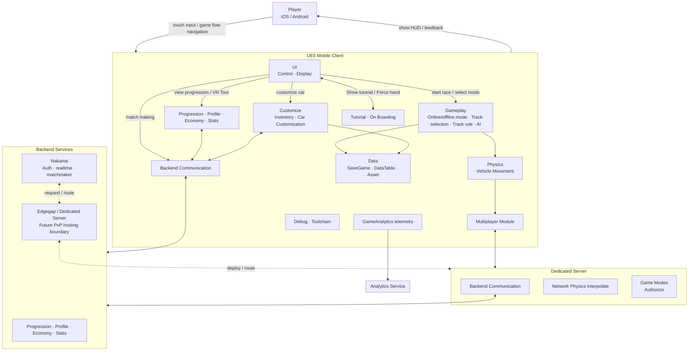

### 1.1 Core pillars

| Pillar | High-level responsibility |
| --- | --- |
| UI / Control / Display | Menu, HUD, control input, feedback, screen navigation |
| Race runtime | Offline/online race mode, track selection, track rule, AI, race flow |
| Vehicle physics | Use vehicle actor/controller classes and physics plugin parameters for racing feel |
| Car customization | Manage garage car configurations, inventory, visual/performance customization, visual parts/materials/decals, performance upgrade, preview/apply/save |
| Progression | VN Tour city/area/track hierarchy, race setup, race completion, goals, reward calculation, convert local upgrade levels and car type into CR/performance stats, map AI difficulty per city, profile, wallet currencies, inventory save, garage ownership, stats |
| Backend Communication | Auth/session/realtime/matchmaking/backend API gateway |
| Multiplayer Module | Client-side online race module and server connection | 
| Tutorial / Onboarding | Scripted tutorial, tooltip, forced hand/control lock |
| Analytics | GameAnalytics telemetry |
| Tooling | Debug modules, analytics, `UPerformanceMonitorSubsystem`, PSO helpers, world-scoped object pool |
| Backend | Nakama auth/session/realtime/matchmaking; multiplayer lobby and future server deployment, Edgegap setup |
| Dedicated Server | Authorize flow, network physics, communicate with backend |
---

# 2. Runtime Architecture

UE5 Mobile Client là runtime chính của game. Client hiện đang giữ cả gameplay runtime, local state/cache, UI, vehicle physics, debug toolchain và online client services.

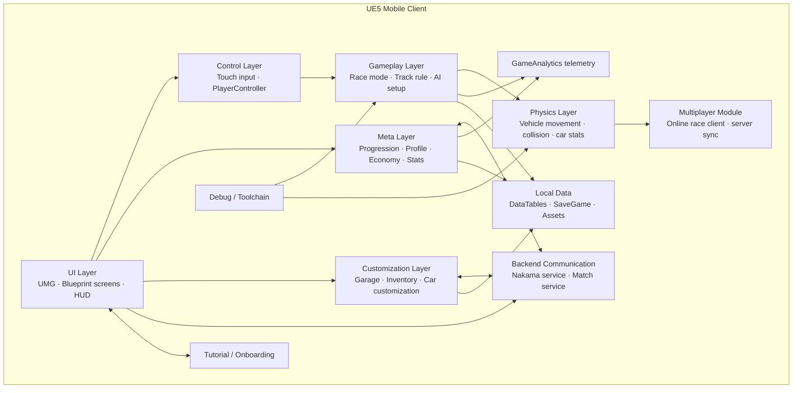

### 2.1 Lifecycle ownership

| Runtime object | Lifetime | Responsibility |
| --- | --- | --- |
| `URacingCarGameInstance` | App lifetime | Holds global DataTable references, tutorial config, inventory defaults, car rating tables, PSO flags |
| `UGameInstanceSubsystem`s | App lifetime | Business logic/data services shared across maps |
| `ARacingCarGameMode` | Race level server/runtime | Initializes race level, spawns race manager/cars, handles player readiness/login/logout |
| `ARaceGameState` | Race level replicated state | Replicates total car count and car list readiness |
| `ARaceTrackManager` | Race level actor | Main race lifecycle, AI setup, checkpoint/lap/ranking, race end, time attack, sequence flow |
| Vehicle actors/controllers | Race level | Player and AI car movement, physics, input/control |

---

### 2.2 UI access pattern

UI reads and mutates game state through subsystem APIs and multicast delegates, not by directly editing SaveGame objects.

| UI domain | Primary API owner |
| --- | --- |
| Garage/customization | `UCarCustomizationManager` |
| VN Tour map/track select | `UProgressionCenterSubsystem` |
| Wallet/profile header | `UProfileManagerSubsystem` |
| Inventory screen | `UInventoryManager` |
| Matchmaking/lobby | `UMatchServiceSubsystem`, `UNakamaServiceSubsystem` |
| Race HUD | `ARaceTrackManager` delegates and race state |

---

# 3. Race Gameplay Flow

Gameplay module trong sơ đồ mới gồm online/offline mode, track selection, track rule và AI. Trong codebase hiện tại, gameplay runtime chủ yếu nằm ở `RaceMode`, `RacingCarGameMode`, `RaceGameState`, `RacingCarController`, `RaceTrackManager`, checkpoint actors và AI subsystem. Trong đó `ARaceTrackManager` đóng vai trò trung tâm tổ chức cuộc đua. Nó theo dõi trạng thái của player/AI, checkpoint progress, lap count, ranking, race timing, intro/outro sequence flow, và fan service hooks.

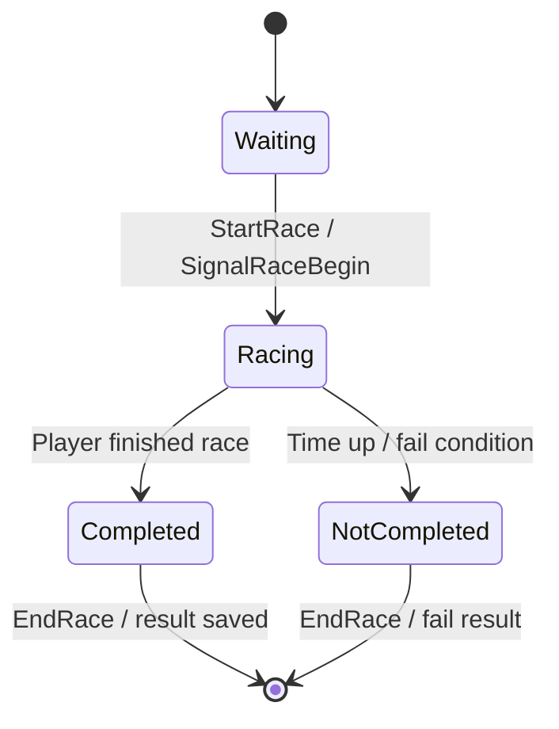

### 3.1 Race modes

| Concept | Source enum/class | Meaning |
| --- | --- | --- |
| Race state | `ERaceState` | Per-player race status: None, Waiting, Racing, Completed, NotCompleted |
| Race mode state | `ERaceModeState` | Race manager phase: None, Waiting, Running, End |
| Race info | `FRaceInfo` | Total laps, race mode, time attack duration/bonus, current players, track difficulty |
| Player race state | `FPlayerRaceState` | Vehicle id, player name, lap/checkpoint progress, time, ranking, AI flag, reward |

### 3.2 Race flow

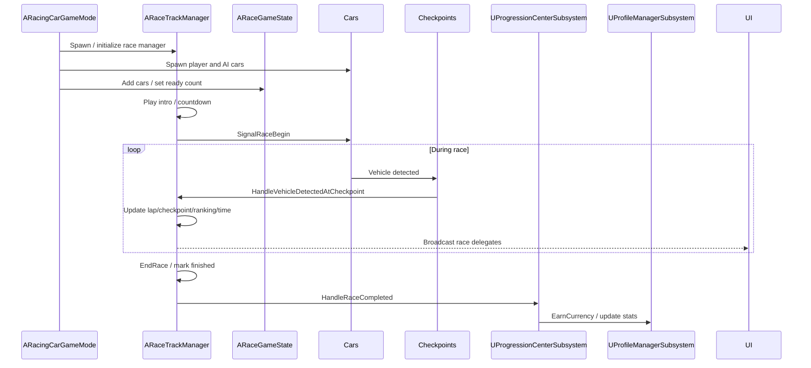

---

# 4. Vehicle Physics Architecture

Physics module handles vehicle movement, collision, vehicle stat application and, for online race, becomes a synchronization/interpolation boundary.

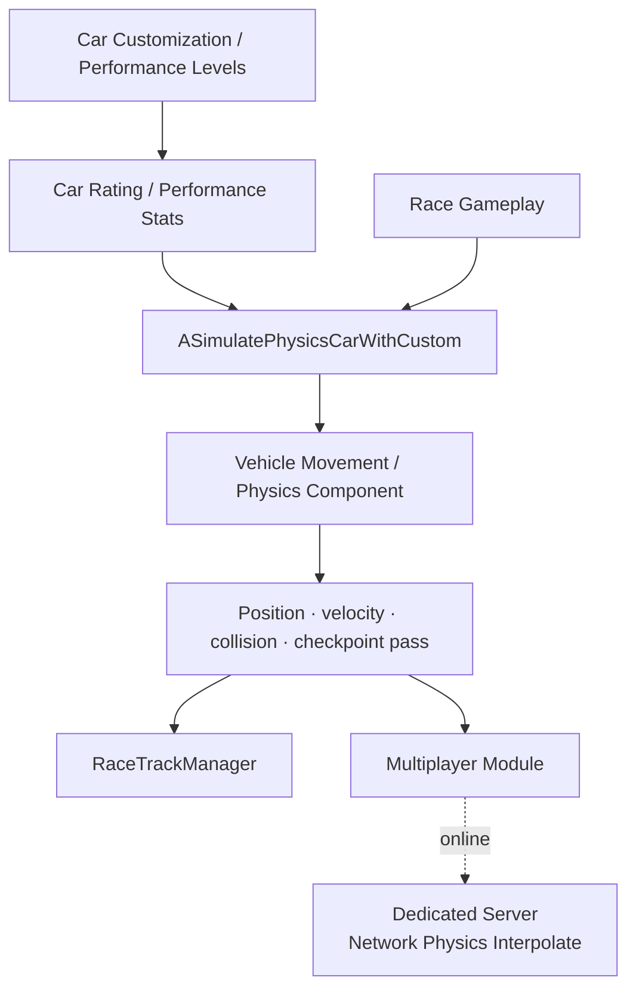

| System | Responsibility |
| --- | --- |
| `ASimulatePhysicsCarWithCustom` | Player/AI vehicle actor with customization/stat integration |
| `UCustomChaosWheeledVehicle` | Custom vehicle movement component based on Chaos wheeled vehicle movement |
| `UVehicleFactory` | Helper/factory for standardized vehicle creation/configuration |
| `UCarCustomizationManager` | Calculates performance stats from selected car/config/upgrades |
| `UCarRatingSubsystem` | Maps CR level/city/difficulty to runtime stats and AI difficulty |
| Physics plugins | Provide actual vehicle simulation behavior and async/performance behavior |

## 4.1 Network Physics Boundary

- Client-side vehicle movement remains responsible for local feedback and input feel.
- Dedicated server, if used for PvP, should own authoritative race/game mode decisions.
- `Network Physics Interpolate` on server/client boundary should smooth replicated movement while avoiding trusting client-only race results.
- The exact prediction/resimulation model is not defined in the current HLD and should be handled in a separate multiplayer LLD.

---

# 5. Customization / Inventory Architecture

Customization module covers both inventory and car customization. It is user-facing through garage/customization UI and also affects gameplay through vehicle performance stats.

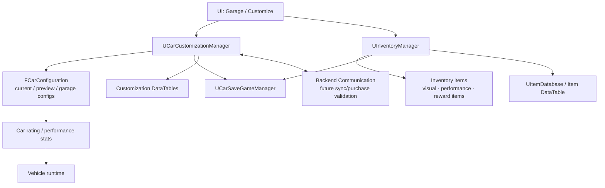

## 5.1 Customization Responsibilities

| Area | Responsibility | Code owner |
| --- | --- | --- |
| Visual config | Part, color, material, style, decal | `UCarCustomizationManager` |
| Performance upgrade | Upgrade TopSpeed/Acceleration/Grip/Nitro or equivalent performance stat | `UCarCustomizationManager` |
| Garage config | Current/preview/profile car configurations | `UCarCustomizationManager` |
| Inventory item ownership | Add/remove/equip/favorite/query items | `UInventoryManager` |
| Item definitions | Definition database from DataTable | `UItemDatabase` |
| Persistence | Save/load car config and inventory | `UCarSaveGameManager` |
| Runtime stat application | Convert config/upgrades to vehicle stats | `UCarCustomizationManager`, `UCarRatingSubsystem` |

## 5.2 Backend Sync Boundary

The new diagram connects `Customize` with `Backend Communication`. This should be interpreted as:

- Offline/prototype customization can be persisted locally by SaveGame.
- Online/shipping economy-sensitive actions should be validated through backend services.
- Purchase/unlock/spend operations should not rely solely on local SaveGame if they affect competitive or monetized inventory.
- Backend should eventually be the authority for inventory ownership, currency spend, and unlock state.

---

# 6. Progression / Profile / Economy / Stats Architecture

The new diagram shows this domain both inside client and backend service. Therefore, the HLD should treat client systems as presentation/cache/orchestration and backend systems as future or online source of truth for trusted state.

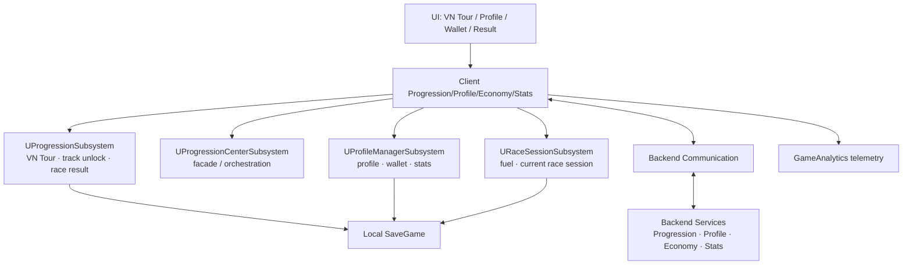

## 6.1 Domain Ownership

| Domain | Client owner | Backend/source-of-truth recommendation |
| --- | --- | --- |
| VN Tour unlock state | `UProgressionSubsystem`, `UProgressionCenterSubsystem` | Backend-authoritative for online account sync; local cache for offline/prototype |
| Profile identity/avatar/name | `UProfileManagerSubsystem` | Backend profile service or Nakama user metadata if integrated |
| Wallet/currency | `UProfileManagerSubsystem`, `URaceSessionSubsystem` for some session coin/fuel behavior | Backend-authoritative for spend/earn in online/shipping economy |
| Fuel/session energy | `URaceSessionSubsystem` | Backend-authoritative if monetized or cross-device synced |
| Race stats | `UProfileManagerSubsystem`, progression result flow | Backend stats service for leaderboard/account history |
| Rewards | Progression/reward flow | Backend validation for random reward, duplicate conversion, paid currency |

## 6.2 VN Tour / Progression Flow

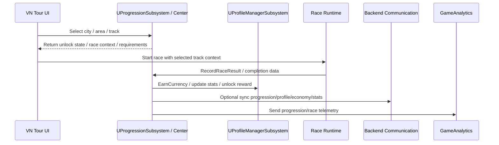

---

# 7. Backend Communication Architecture

Backend Communication is the client-side gateway between UE5 Mobile Client and external services. Current code confirms Nakama-facing services for auth/session/realtime/matchmaking. The diagram also includes progression/profile/economy/stats backend boundary, which should be treated as an architecture target or service integration boundary if not already implemented.

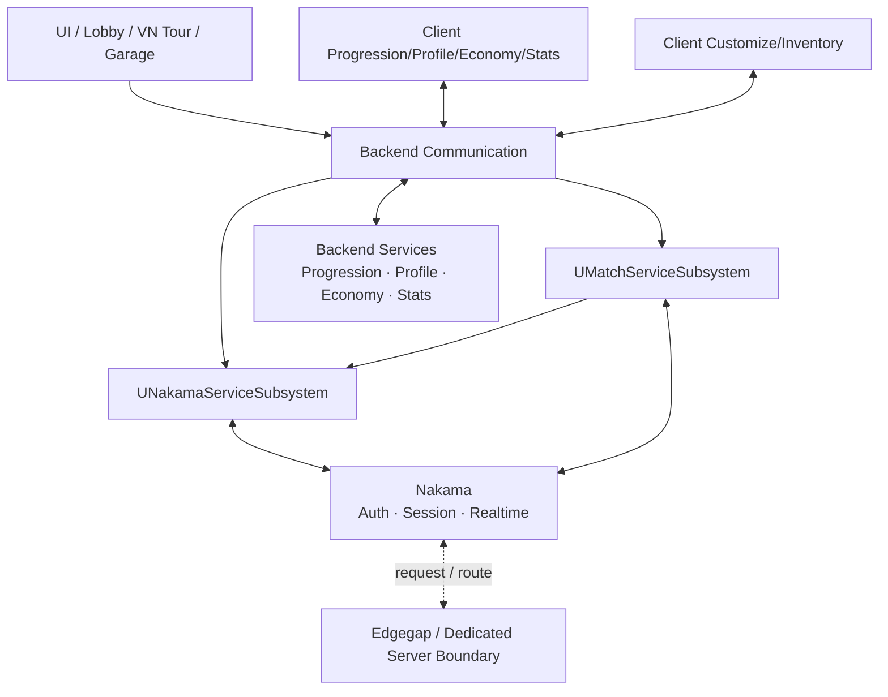

## 7.1 Current Nakama Services

| Class | Responsibility |
| --- | --- |
| `UNakamaServiceSubsystem` | Creates Nakama client, authenticates, stores/updates session, connects realtime client |
| `UMatchServiceSubsystem` | Builds matchmaking query, starts/cancels matchmaking, handles matchmaker/match/presence events |
| `FMatchMakingRequest` | Request payload with map/mode/ranking information |
| `FMatchmakerNotificationPayload` | Parsed ready/match notification data |

## 7.2 Backend Boundary Rules

| Boundary | Rule |
| --- | --- |
| Client ↔ Nakama | Auth, session, realtime, matchmaking. Client should not invent trusted identity state. |
| Client ↔ Progression/Profile/Economy backend | Use for account sync, currency/inventory validation, rewards and stats. |
| Nakama ↔ Edgegap | Route/deploy dedicated server or create match allocation when PvP flow requires server hosting. |
| Dedicated Server ↔ Backend Services | Server reports authorized match result, validates player/session, may update stats/economy. |
| Client local SaveGame | Cache/offline convenience, not secure authority for competitive online economy. |

---

# 8. Multiplayer / Dedicated Server Architecture

The new architecture introduces a clearer split between client multiplayer module and dedicated server runtime. This should be documented as a target boundary even if full race server-authoritative flow is not yet implemented.

```mermaid
sequenceDiagram
    participant UI as UI / Matchmaking Screen
    participant BE as Client Backend Communication
    participant NAK as Nakama
    participant EDGE as Edgegap
    participant DS as Dedicated Server
    participant MUL as Client Multiplayer Module
    participant BEX as Backend Services

    UI->>BE: Start matchmaking
    BE->>NAK: Auth/session/realtime/matchmaker request
    NAK-->>BE: Matchmaker ticket / matched data
    NAK-->>EDGE: Request/route dedicated server allocation
    EDGE-->>DS: Deploy or route to server instance
    BE-->>MUL: Server connection info / match data
    MUL<->>DS: Connect / synchronize online race
    DS<->>BEX: Validate session / report result / update stats
```

## 8.1 Dedicated Server Modules

| Dedicated server module | Responsibility |
| --- | --- |
| Backend Communication | Validate players/session with backend, send authorized result/stats/economy events |
| Network Physics Interpolate | Smooth or reconcile networked vehicle movement state; exact prediction model belongs in LLD |
| Game Modes / Authorize | Own server-side race mode, start/end race validation, anti-cheat-sensitive race authority |

## 8.2 Authority Model Recommendation

| System | Offline/local | Online PvP recommended authority |
| --- | --- | --- |
| Input | Client | Client sends input/state according to chosen netcode model |
| Vehicle feedback | Client local responsive simulation | Client prediction/interpolation allowed, server validates authoritative state/result |
| Race mode start/end | Local `GameMode`/`RaceTrackManager` | Dedicated server `GameMode` |
| Ranking/checkpoint/lap | Local `RaceTrackManager` | Server-authoritative checkpoint/lap/ranking |
| Economy reward | Local SaveGame acceptable for prototype | Backend-authoritative grant after server-approved result |
| Inventory/currency spend | Local for prototype/offline | Backend-authoritative validation |

---

# 9. Analytics Architecture

Analytics is represented as its own external service in the new diagram. Client sends telemetry to Analytics Service through GameAnalytics integration.

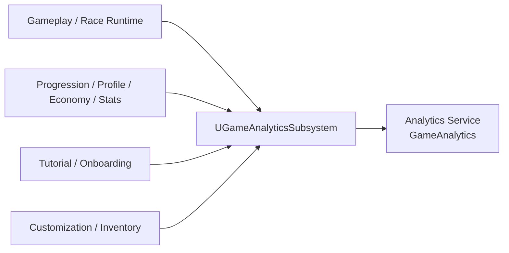

## 9.1 Recommended Event Categories

| Category | Example event |
| --- | --- |
| Race | race_start, race_end, track_id, race_mode, finish_position, total_time, fail_reason |
| Progression | city_unlock, track_unlock, goal_complete, VN Tour milestone |
| Economy | currency_earned, currency_spent, insufficient_currency, reward_claimed |
| Customization | car_selected, part_equipped, style_applied, performance_upgrade |
| Tutorial | tutorial_step_start, tutorial_step_complete, forced_hand_shown, control_locked |
| Performance/debug | FPS bucket, device tier, PSO warmup result, race load timing |

Analytics should be treated as observational, not authoritative. No game state should depend on successful telemetry delivery.

---

# 10. Tutorial / Onboarding Architecture

Tutorial is explicitly shown as `Tutorial · On Boarding` connected to UI with a two-way relationship: UI displays tutorial, while tutorial can force hand/control lock.

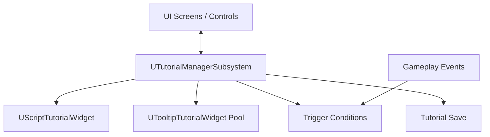

| System | Responsibility |
| --- | --- |
| `UTutorialManagerSubsystem` | Tutorial state, trigger, tooltip pool, script steps, control lock/unlock |
| `UScriptTutorialWidget` | Scripted tutorial UI |
| `UTooltipTutorialWidget` | Reusable tooltip tutorial UI |
| `UTriggerCondition` subclasses | Conditions such as checkpoint passed or other gameplay/UI events |
| UI controls | Must register with tutorial manager if they can be locked/forced by tutorial |

Rule: UI should cooperate with tutorial manager rather than implementing one-off forced hand logic inside each screen.

---

# 11. Debug / Toolchain Architecture

Debug/toolchain is present in the client architecture and should remain separated from player-facing runtime logic.

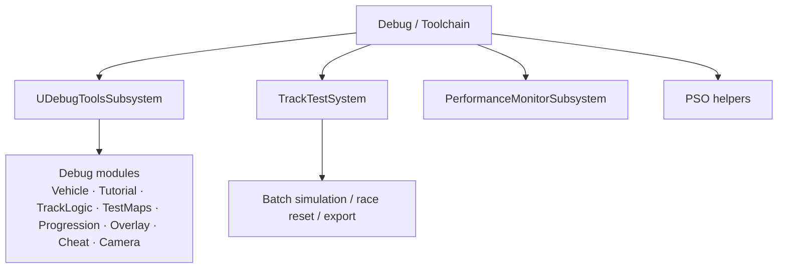

| Tool area | Code mapping | Use |
| --- | --- | --- |
| Debug panel/modules | `UDebugToolsSubsystem`, `UDebugModuleBase` subclasses | Internal debug commands and overlays |
| Track testing | `ATrackTestGameMode`, `UBatchSimulationManager`, `ATrackTestPlayerController`, `UMistakeDetector` | Track/vehicle/AI tuning and batch simulation |
| Race data collection | `URaceDataCollector`, `UDataExportManager` | Collect/export lap/section/race test data |
| Performance monitor | `UPerformanceMonitorSubsystem`, `ULiteSignificanceManager` | Runtime performance instrumentation/significance |
| PSO | `APSOEffectManager`, `ARestLevelManager`, `UPSOPrecacheSaveGame` | Shader/asset warmup and PSO support |

Rule: debug/toolchain code can depend on gameplay runtime for inspection, but gameplay runtime should not require debug modules to function.

---

# 12. Data, SaveGame, and Asset Architecture

Client currently uses DataTables, SaveGame and assets as its local data layer. This is still valid, but the new backend boundary means some data should eventually be synced or validated online.

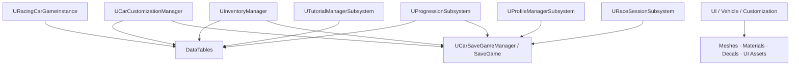

## 12.1 DataTable Registry

`URacingCarGameInstance` should remain the top-level registry for global DataTables and config references. DataTables typically cover:

| Category | Example data |
| --- | --- |
| Progression | Map defaults, VN Tour/city/area/track data |
| Car rating | CR definition, base values, CR stats, city AI CR |
| Customization | Base cars, parts, styles, colors, decals, materials, performance stat levels |
| Profile | Avatar, random names, forbidden words |
| Inventory | Item definitions and default resources |
| Tutorial | Tooltip definitions and script tutorial step tables |

## 12.2 Save Boundaries

| Data | Client owner | Persistence |
| --- | --- | --- |
| Car configurations | `UCarCustomizationManager` | `UCarSaveGameManager`, car config SaveGame |
| Inventory | `UInventoryManager` | `UCarSaveGameManager`, inventory SaveGame |
| Profile/wallet/stats | `UProfileManagerSubsystem` | `UCarSaveGameManager`, profile SaveGame |
| Fuel/session | `URaceSessionSubsystem` | fuel/session save slot |
| Progression/achievement | `UProgressionSubsystem`, `UAchievementSubsystem` | progression SaveGame |
| Settings | `UCarSettingSubsystem` | setting SaveGame |
| Tutorial | `UTutorialManagerSubsystem` | tutorial save |

For offline play, SaveGame can be the practical source of truth. For online account/economy, SaveGame should become a local cache only.

---

# 13. Technology Stack

| Layer | Technology / system |
| --- | --- |
| Client engine | Unreal Engine 5.x |
| Client language | C++ / Blueprint |
| UI | UMG / Blueprint screens / HUD widgets |
| Platforms | iOS / Android |
| Vehicle physics | ChaosVehicles/custom vehicle movement, physics plugins used by project |
| Runtime module | `PrototypeRacing` |
| Online identity/realtime/matchmaking | Nakama Unreal SDK/service subsystem |
| Hosting boundary | Edgegap / Dedicated Server path for future PvP hosting |
| Analytics | GameAnalytics telemetry via `UGameAnalyticsSubsystem` |
| Local data | DataTables, SaveGame classes, assets |
| Debug/testing | DebugSystem, TrackTestSystem, PerformanceMonitorSubsystem, PSO helpers |

---

# 14. Risks, Assumptions, and Open Questions

| Topic | Status / risk | Recommendation |
| --- | --- | --- |
| Dedicated server authority | Architecture boundary exists, but full implementation may not be confirmed by current code summary | Create a separate Multiplayer/Dedicated Server LLD before implementing PvP authority |
| Backend economy authority | Client currently has strong local SaveGame/subsystem ownership | Move currency, inventory ownership and reward grants to backend for shipping online economy |
| Progression sync | Client-side progression works for offline/prototype | Define source-of-truth policy for cross-device/account sync |
| Physics networking | Diagram mentions network physics interpolation, but exact model is not specified | Decide between server-authoritative movement, client prediction, or hybrid checkpoint validation |
| Nakama vs backend services responsibilities | Nakama currently handles auth/realtime/matchmaking; progression/economy service boundary is broader | Avoid mixing match orchestration with economy authority without clear contracts |
| Tutorial control lock | Tutorial can force UI hand/control lock | Standardize UI registration and avoid per-widget ad hoc locks |
| Debug dependency | Debug/toolchain is large and useful | Keep debug modules out of shipping-critical dependency paths |
| Analytics dependency | Telemetry is useful but external | Never block gameplay/reward flow on analytics delivery |

---
