# Low Level Design — VNRacing

> Tài liệu low-level design
>
> Game: Mobile racing game / VN Tour / customization / online multiplayer
>
> Engine: Unreal Engine 5.x project; exact local engine install is referenced by `PrototypeRacing.uproject` `EngineAssociation` GUID
>
> Source module: `PrototypeRacing`
>
> Cập nhật: 2026-05-14

---

# 0. Mục Tiêu Tài Liệu

Tài liệu này chuyển HLD của VNRacing xuống mức implementation. Nội dung tập trung vào class, struct, subsystem, ownership, lifecycle, data flow, và checklist triển khai.

| Mục tiêu | Nội dung |
| --- | --- |
| Runtime | GameInstance, GameMode, GameState, RaceTrackManager |
| Race implementation | Checkpoint, lap, ranking, race states, TimeAttack, race end |
| Vehicle implementation | Player/AI car spawn, physics stat application, car rating |
| Customization | `UCarCustomizationManager`, car config, visual/performance flow |
| Meta systems | Profile, wallet, fuel/session energy, inventory, progression, rewards |
| Online | Nakama auth/session/realtime/matchmaking |
| Data | DataTables, SaveGame, assets, event/delegate boundaries |

### 0.1 Design rules

| Rule | Implementation meaning |
| --- | --- |
| Subsystems own long-lived data | Game-wide services should be `UGameInstanceSubsystem` unless level-bound |
| Race manager owns race runtime | Race-specific checkpoint/lap/ranking/timing should flow through `ARaceTrackManager` |
| UI does not own business state | UI reads subsystem state and subscribes to delegates |
| DataTable-driven tuning | Cars, parts, CR, tracks, rewards, profile assets should come from DataTables/assets |
| Save through managers | UI/gameplay should call subsystem APIs; subsystems handle save manager interaction |
| Source overrides old docs | If old docs conflict with current source, current source wins |

---

# 1. Module / File Layout

Current UE project root:

```markdown
Racing/
  PrototypeRacing.uproject
  Source/PrototypeRacing/
    PrototypeRacing.Build.cs

    Public/
      RacingCarGameInstance.h
      RacingCarGameMode.h
      RaceGameState.h
      RacingCarController.h
      SimulatePhysicsCarWithCustom.h
      VehicleFactory.h
      CustomizeCarSubsystem.h

      RaceMode/
        RaceTrackManager.h
        RaceCheckpoint.h
        RaceComponent.h

      CarCustomizationSystem/
        CarCustomizationManager.h
        CarDataProvider.h
        CarSaveGameManager.h
        CustomizableCar.h
        RacingSaveGame.h
        LevelReflectionSystem.h

      BackendSubsystem/
        ProfileManagerSubsystem.h
        RaceSessionSubsystem.h
        ProfileInventorySaveGame.h
        GameAnalyticsSubsystem.h

        Online/
          NakamaServiceSubsystem.h
          MatchServiceSubsystem.h
          NakamaServiceSettings.h

        Progression/
          ProgressionCenterSubsystem.h
          ProgressionSubsystem.h
          FanServiceSubsystem.h
          FanServiceSettings.h
          AchievementSubsystem.h
          CarRatingSubsystem.h

      InventorySystem/
        InventoryManager.h
        ItemDatabase.h

      ProgressionSystem/
        ProgressionDataProvider.h
        ProgressionSaveGame.h
        TrackAnimationSaveGame.h
        DataStructures/ProgressionData.h

      AISystem/
        AIManagerSubsystem.h

      SettingSystem/
        CarSettingSubsystem.h
        CarSaveSetting.h
        SettingDataProvider.h

      ObjectPool/
        ActorObjectPoolSubsystem.h
        PoolObjectInterface.h

      DebugSystem/
        DebugToolsSubsystem.h
        DebugModuleBase.h
        Modules/*.h

      PerformanceMonitorSubsystem/
        PerformanceMonitorSubsystem.h
        LiteSignificance*.h
```

---

# 2. Core Runtime Classes

## 2.1 `URacingCarGameInstance : UGameInstance`

### Responsibility

`URacingCarGameInstance` is the global configuration registry for DataTables and cross-map defaults.

| Category | Fields |
| --- | --- |
| Progression | `MapDefaultDataTable`, `ProgressionDataTable` |
| Car rating | `CarRatingDefine`, `CarBaseValueDefine`, `CarRatingStatsDataTable`, `CityAICarRatingDataTable`, `BasePerformanceBonus` |
| Car customization | `BaseCarsDataTable`, `CarPartsDataTable`, `CarStylesDataTable`, `CarColorsDataTable`, `CarDecalsDataTable`, `PerformanceStatLevelDataTable`, `CarMaterialDataTable`, `DecalCategoryDataTable`, `DecalDataTable` |
| Profile/session | `AvatarDataTable`, `ForbiddenWordDataTable`, `NameDataTable`, race/session data used by `URaceSessionSubsystem` |
| Inventory | `InventoryItemsDataTable`, `InventoryDefaultSettings` |
| Tutorial | `ScriptTutorialClass`, `TooltipClass`, tooltip/script DataTables, pool size |
| AI | `AITargetTicksPerSecond` |
| PSO | `bActivatePSODrone`, `bHasJustReturnedFromRestMap` |

### Lifecycle

```cpp
virtual void Init() override;
virtual void Shutdown() override;
```

### Contract

| Rule | Detail |
| --- | --- |
| DataTable registry only | GameInstance should expose configured assets, not execute race gameplay |
| Subsystem setup source | Subsystems can use these tables during initialization/setup |
| Persistent flags | Use for cross-map flags such as PSO/rest-map state |

---

## 2.2 `ARacingCarGameMode : AGameModeBase`

### Responsibility

Race-level authority for spawning/initializing race runtime.

| Responsibility | Detail |
| --- | --- |
| Race manager creation | Holds `RaceTrackManagerClass` and `RaceTrackManager` |
| Vehicle spawn | `SpawnPlayerCar`, player/AI car classes, car definition table |
| Player lifecycle | `PostLogin`, `Logout`, `PlayerIsReady` |
| Race setup | `InitGame`, `PostInitializeComponents`, current map name, race mode, lap count |
| PSO helpers | Spawn PSO camera drone/effect manager and handle precache completion |

### Key fields

```cpp
TSubclassOf<ASimulatePhysicsCar> PlayerControlCarClass;
TSubclassOf<ASimulatePhysicsCar> MachineControlCarClass;
TSubclassOf<ARaceTrackManager> RaceTrackManagerClass;
ARaceTrackManager* RaceTrackManager;
int32 TotalLaps;
ERaceMode RaceMode;
UDataTable* CarDefinitionTable;
TArray<APlayerStart*> PlayerStarts;
TArray<ARacingCarController*> PlayerList;
```

### Runtime flow

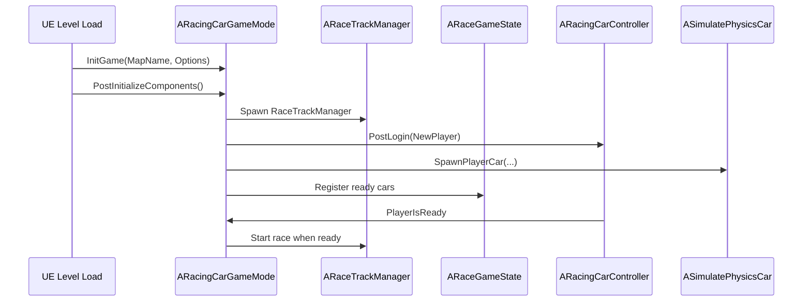

---

## 2.3 `ARaceGameState : AGameStateBase`

### Responsibility

Replicated readiness state for the race.

```cpp
UPROPERTY(BlueprintReadOnly, ReplicatedUsing=OnRep_TotalCarCount)
int TotalCarCount;

UPROPERTY(BlueprintReadOnly, ReplicatedUsing=OnRep_CarList)
TArray<ASimulatePhysicsCar*> CarsList;
```

### Key methods

| Method | Use |
| --- | --- |
| `SetReadyCarCount(int TotalCarList)` | Set expected number of cars |
| `AddCarIntoList(ASimulatePhysicsCar* CarToAdd, const int& Index)` | Replicate car list entry |
| `IsReadyForTheRace()` | Internal readiness check |
| `SignalingThatClientIsReadyLoop()` | Loop readiness signal |

---

## 2.4 `ARaceTrackManager : AActor`

### Responsibility

`ARaceTrackManager` is the central level-bound race orchestrator.

| Responsibility | Detail |
| --- | --- |
| Race state | Start/end race, race mode state, player completion state |
| Checkpoint/lap | Validate next checkpoint, lap completion, checkpoint visibility |
| Ranking | Calculate/update ranking by checkpoint progress and distance |
| Timing | Total race timer, TimeAttack timer, race-end countdown |
| AI setup | Spawn/setup AI cars, assign AI difficulty, names, style, performance |
| Result integration | Notify progression/profile systems when race finishes |
| Sequence/UI | Intro/outro/car sequences, loading/countdown UI hooks |
| Delegates | Broadcast race updates to UI/Blueprint listeners |

### Core state structs/enums

```cpp
enum class ERaceState : uint8
{
    None,
    Waiting,
    Racing,
    Completed,
    NotCompleted
};

enum class ERaceModeState : uint8
{
    None,
    Waiting,
    Running,
    End
};
```

```cpp
struct FPlayerRaceState
{
    FString VehicleId;
    FString PlayerName;
    FText CarName;
    FName AvatarId;
    int32 LapCount;
    int32 NextExpectedCheckpoint;
    int32 TotalCheckpointPassed;
    float TotalRaceCompletionTime;
    ERaceState RaceState;
    FRaceTime RaceTime;
    int32 Ranking;
    float DistanceToNextCheckpoint;
    FName CarTypeId;
    bool bIsAI;
    FPlayerRaceReward PlayerRaceReward;
    FAIDifficultyProfile AIDifficultyProfile;
};
```

```cpp
struct FRaceInfo
{
    int32 TotalLap;
    ERaceMode RaceMode;
    float AttackTimeDuration;
    float TimeBonus;
    int32 CurrentNumberPlayers;
    ETrackDifficulty TrackDifficulty;
};
```

### Important delegates

| Delegate | Purpose |
| --- | --- |
| `OnCheckpointPassed` | Player/AI checkpoint progress changed |
| `OnRankingUpdate` | Ranking updated |
| `OnPlayerStartRace` | Race started for players |
| `OnPlayerFinishedRace` | A player finished |
| `OnRaceEnded` | Race ended |
| `OnLapCompleted` | A vehicle completed lap |
| `OnLapChanged` | Player lap changed |
| `OnTotalRaceTimeUpdate` | Total race timer update |
| `OnTimeAttackUpdate` | TimeAttack timer update |
| `OnTimeBonusAdded` | Time bonus added |
| `OnCreateFanServiceUI` | Trigger fan service UI |

### RaceTrackManager dependencies

```cpp
UCarCustomizationManager* CarCustomizationManager;
UProfileManagerSubsystem* ProfileManagerSubsystem;
UCarRatingSubsystem* CarRatingSubsystem;
UGuideLineSubsystem* GuideLineSubsystem;
```

---

# 3. Race Lifecycle

## 3.1 State machine

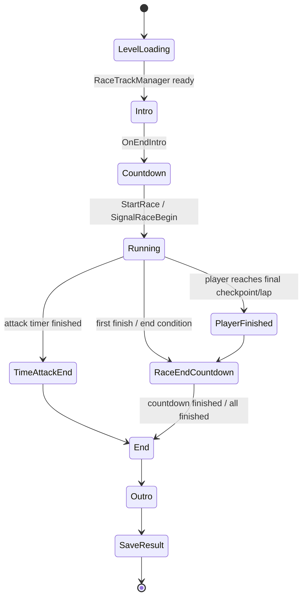

## 3.2 Checkpoint flow

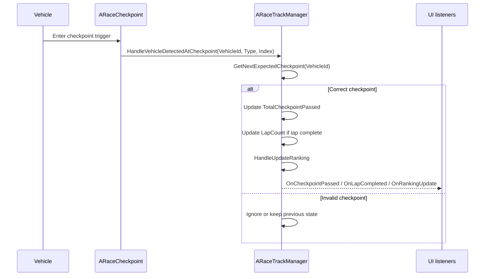

## 3.3 Ranking rule

Race ranking should be derived from:

1. `RaceState` priority: finished cars rank by completion time.
2. `TotalCheckpointPassed` descending.
3. `DistanceToNextCheckpoint` ascending.
4. Stable fallback by vehicle id or existing order if needed.

Current manager stores ranking in `FPlayerRaceState::Ranking` and race state maps:

```cpp
TMap<FString, FPlayerRaceState> ManagerPlayerInfo;
TMap<FString, ASimulatePhysicsCar*> ManagerCar;
TMap<FString, ASimulatePhysicsCar*> ManagerAICar;
```

## 3.4 Race completion flow

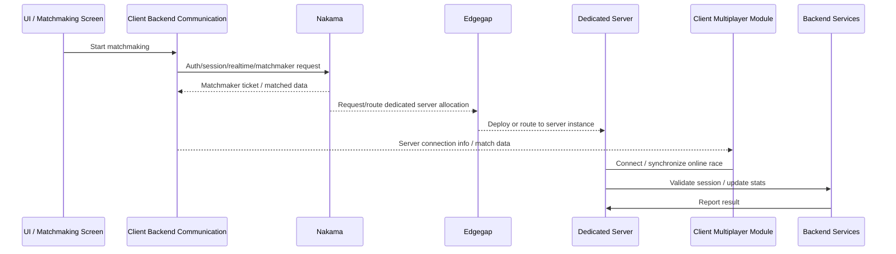

---

# 4. Vehicle and AI Details

## 4.1 Vehicle spawn

`ARacingCarGameMode` owns player car spawn entry points:

```cpp
ASimulatePhysicsCar* SpawnPlayerCar(
    TSubclassOf<ASimulatePhysicsCar> CarClass,
    const FTransform& Transform,
    APlayerController* Controller,
    ARoadGuide* RoadGuide
);
```

`ARaceTrackManager` owns registration into race state:

```cpp
void AddCar(const FString& CarId, ASimulatePhysicsCarWithCustom* NewSimulatePhysicsCar, const bool& bIsAICar = false);
void InitializePlayerRaceState(...);
```

## 4.2 AI setup

AI generation uses track difficulty and configured distribution.

```cpp
TMap<ETrackDifficulty, FTrackAIDistribution> AIDistribution;
FAIDifficultyProfile EasyAIProfile;
FAIDifficultyProfile MediumAIProfile;
FAIDifficultyProfile HardAIProfile;
```

Key methods:

| Method | Purpose |
| --- | --- |
| `SetupAICar` | Spawn/setup AI cars from player starts |
| `GenerateAIDifficulties` | Convert track difficulty and count into AI difficulty list |
| `GetAIPerformanceScale` | Resolve scalar by AI difficulty |
| `ConvertTrackDifficultyToAIDifficulty` | Map track difficulty to AI difficulty |
| `AICarApplyPerformance` | Apply `FPerformanceStats` to AI car |
| `AICarApplyPerformanceExtended` | Apply `FCarRatingStats` to AI car |
| `ApplyAIDifficultyTuning` | Apply behavior tuning to `UAIDecisionComponent` |
| `AICarApplyStyle` | Apply generated car visual config to AI car |

## 4.3 AI difficulty design mapping

Design docs define three meaningful AI skill axes for current implementation scope:

| Behavior | Easy | Medium | Hard |
| --- | --- | --- | --- |
| Racing line selection | Lower optimal-line probability | Medium probability | Higher optimal-line probability |
| Overtake/defense | More passive | Balanced | More proactive |
| NOS use | Chance-based | Higher chance | Always use when full |

---

# 5. Car Rating System

## 5.1 `UCarRatingSubsystem : UGameInstanceSubsystem`

### Responsibility

| Responsibility | Detail |
| --- | --- |
| CR table setup | Load CR value table, base car value table, CR stats table, city AI CR table |
| Player car rating | Calculate car performance from upgrade levels and car type |
| Performance gate | Compare car performance against location/track requirement |
| AI rating | Resolve AI CR by city and track difficulty |
| Stat output | Provide `FCarRatingStats` to runtime vehicle application |

### Key data

```cpp
TMap<int32, int32> CarRatingPerLevel;
TMap<ECarType, int32> CarBaseValues;
TMap<int32, FCarRatingStats> CarRatingStatsPerLevel;
TMap<int32, FCityAICarRating> CityAICarRatingPerCityIndex;
int32 BasePerformanceBonus;
```

### `FCarRatingStats`

`FCarRatingStats` contains physics/tuning output for a CR level:

| Group | Example fields |
| --- | --- |
| Speed/accel | `TopSpeed`, `Acceleration` |
| Drift/steer | `ToggleDriftButtonTime`, `TurnAngle`, `SteerSpeedMin`, `SteerSpeedMax`, lateral values |
| Nitro | `NitroBoostForce`, `NitroDuration`, fill rates |
| Suspension | max roll/pitch, spring stiffness, anti-roll/pitch/airborne forces |
| Brake/handling | `BrakeOnSteerDelaySeconds`, `BrakeForceMinRatio` |

### CR lookup flow

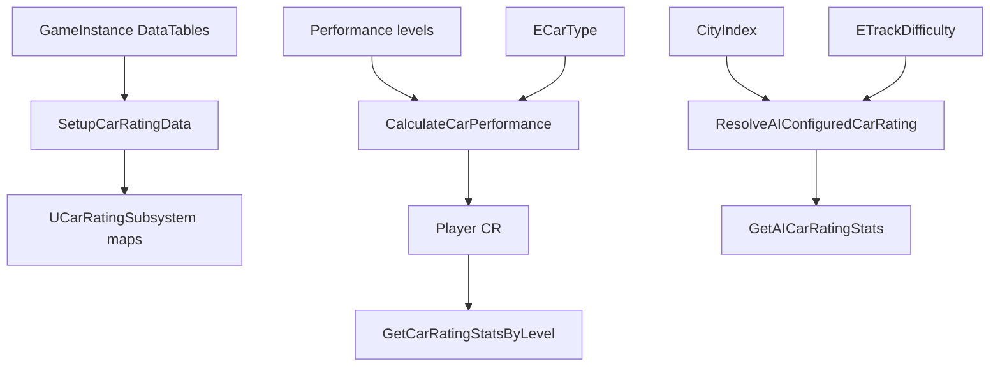

---

# 6. Car Customization System

## 6.1 `UCarCustomizationManager : UGameInstanceSubsystem, ICarDataProvider`

### Responsibility

| Area | Responsibility |
| --- | --- |
| Config state | Current config, preview config, all owned profile car configs |
| Data setup | Initialize and validate car customization DataTables |
| Visual customization | Apply part, color, material, style, decal |
| Performance upgrade | Upgrade stat levels, calculate next cost/value, broadcast success/fail |
| Asset resolution | Return meshes/materials/decals for current or preview config |
| Car rating | Calculate CR and in-game performance stats |
| Save/load | Persist and restore car configs |
| UI events | Broadcast config change, switch, save, upgrade events |

### Core fields

```cpp
TMap<FString, FCarConfiguration> ProfileCarConfigurations;
FCarConfiguration CarConfiguration;
FCarConfiguration PreviewCarConfiguration;

UDataTable* BaseCarsDataTable;
UDataTable* CarPartsDataTable;
UDataTable* CarStylesDataTable;
UDataTable* CarColorsDataTable;
UDataTable* CarDecalsDataTable;
UDataTable* PerformanceStatLevelDataTable;
UDataTable* CarMaterialDataTable;
UDataTable* DecalCategoryDataTable;
UDataTable* DecalDataTable;
```

### Performance config constants

```cpp
float UpgradeBasePrice = 200.f;
float UpgradeCarScaling = 1.5f;
float UpgradeLevelScale = 2.f;
float SpeedCarRatingWeight = 0.49f;
float GripCarRatingWeight = 0.41f;
float AccelerationCarRatingWeight = 0.1f;
float StatDeviationCarRatingFactor = 0.3f;
```

### Important delegates

| Delegate | Trigger |
| --- | --- |
| `OnCarConfigurationChanged` | Config changed |
| `OnNewCarConfigurationSwitched` | Current car switched |
| `OnCarConfigurationFailed` | General customization failure |
| `OnPerformanceStatUpgraded` | Upgrade applied |
| `OnPerformanceStatUpgradeFailed` | Upgrade failed |
| `OnPerformanceStatPreUpgraded` | Preview of current/next upgrade values |
| `OnCarConfigurationSavedSuccess/Failed` | Save result |
| `OnCarConfigurationInitialized` | Initial configuration loaded/created |

## 6.2 Visual customization flow

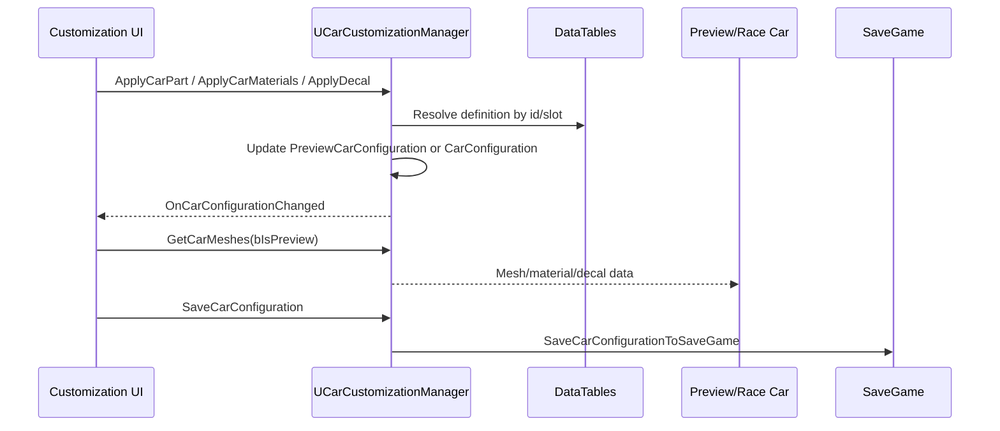

## 6.3 Performance upgrade flow

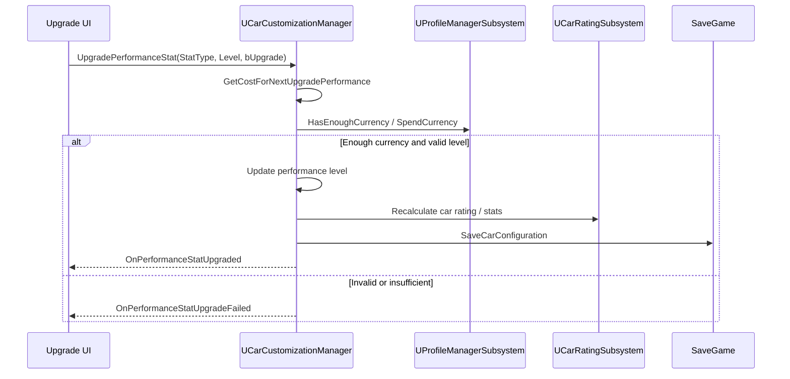

## 6.4 `UCustomizeCarSubsystem`

This is a lighter mesh/material application subsystem.

```cpp
TMap<FString, FCarPartCustomization> CustomizationMap;
TMap<FString, FCarPartCustomization> ChildrenComponentsMap;
```

| Method | Purpose |
| --- | --- |
| `SetPartMeshAndMaterials` | Store mesh/material data by part name |
| `SetChildrentMesh` | Store child component customization |
| `GetPartCustomization` | Query stored customization |
| `ApplyMeshAndMaterialToActor` | Apply customization to actor components |
| `CompareCarPart` | Compare customization structs |

---

# 7. Progression System

## 7.1 `UProgressionCenterSubsystem : UGameInstanceSubsystem, IProgressionDataProvider`

### Responsibility

Progression facade that coordinates progression, fan service, achievement, car rating, session, save, customization, and analytics.

| Area | Methods |
| --- | --- |
| Race setup | `SetupRaceData`, `SetupDefaultRaceData`, `TravelToCurrentRace`, `TravelByLevelId` |
| Query | `GetTrackById`, `GetAllCities`, `GetAllAreasByCityId`, `GetAllTracksByAreaId`, `GetVNTourProgressionData` |
| Result | `HandleRaceCompleted`, `HandleRecordRaceResult`, `ForceUnlockTrack` |
| Rewards | `HandleCalculateReward`, `HandleCalculateAdsReward`, `ReceiveReward` |
| Fan service | `InRaceFindFanService`, `InRaceHandlerStartCheckFanServiceProgress` |
| Gate | `IsPerformanceGatePassed` |
| Analytics | `RecordRaceStartAnalytics`, `RecordRaceMetricsAnalytics`, `RecordRaceResultAnalytics` |

### Dependencies

```cpp
UProgressionSubsystem* ProgressionSubsystem;
UFanServiceSubsystem* FanServiceSubsystem;
UAchievementSubsystem* AchievementSubsystem;
UCarSaveGameManager* CarSaveGameManager;
URaceSessionSubsystem* RaceSessionSubsystem;
UCarCustomizationManager* CarCustomizationManager;
UCarRatingSubsystem* CarRatingSubsystem;
UGameAnalyticsSubsystem* GameAnalyticsSubsystem;
```

## 7.2 VN Tour hierarchy

Design docs define:

| Parameter | Value |
| --- | --- |
| Target playtime | 300 minutes |
| Race duration | 1.5 minutes |
| Cities | 5 |
| Tracks per city | 15 |
| Total tracks | 75 |
| Cars | 15 |
| Areas per city | 5 |
| Tracks per area | 3 |

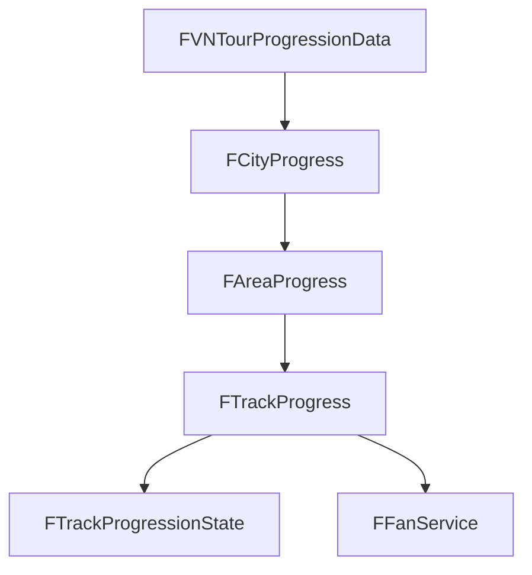

## 7.3 Race setup flow

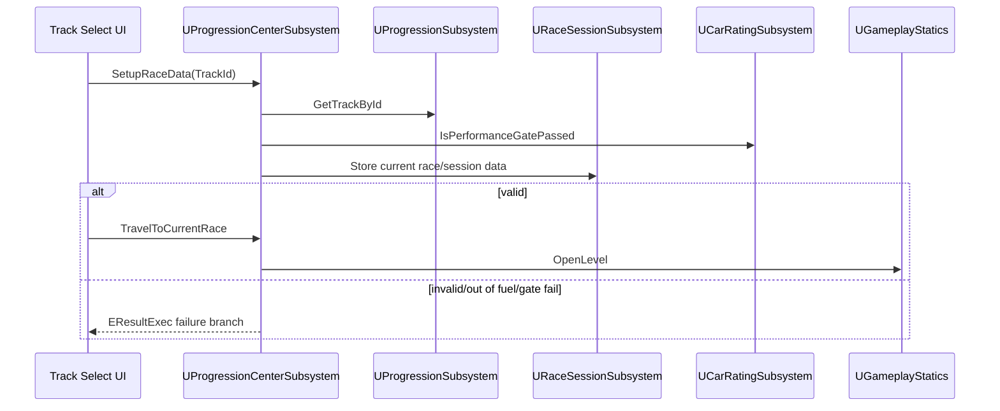

## 7.4 Race completion flow

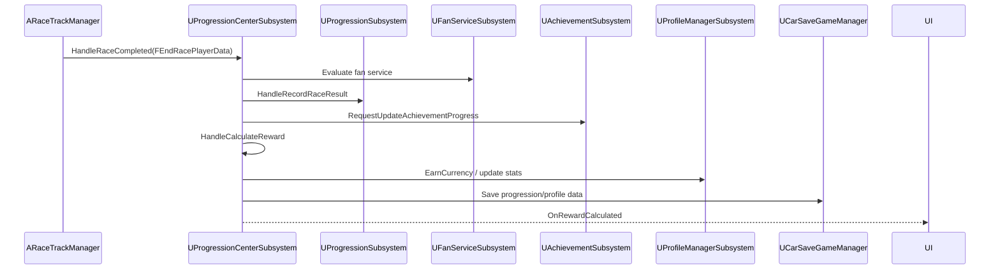

---

# 8. Profile / Wallet System

## 8.1 `UProfileManagerSubsystem : UGameInstanceSubsystem`

### Responsibility

| Area | Responsibility |
| --- | --- |
| Identity | Player name, player id, avatar, VIP status |
| Validation | Name length, special chars, forbidden words, random suggested names |
| Wallet | Cash/Coin values, earn/spend, insufficient currency event |
| Stats | Online time, race time, top speed, race counts, win rate, placements |
| Unlock progress | Car/track/city progress counters |
| Persistence | Save profile data through save manager |

### Data structs

```cpp
enum class ECurrencyType : uint8
{
    Cash,
    Coin
};
```

```cpp
struct FPlayerCurrency
{
    TMap<ECurrencyType, int32> Values;
};
```

```cpp
struct FPlayerProfileData
{
    FText PlayerName;
    FName PlayerID;
    FName AvatarID;
    int32 PlayerLevel;
    FPlayerCurrency PlayerCurrency;
    EVIPStatus VIPStatus;
    float OnlineTime;
    float TopSpeed;
    float TotalRaceTime;
    int32 TotalRaces;
    float WinRate;
    int32 FirstPlaceCount;
    int32 SecondPlaceCount;
    int32 ThirdPlaceCount;
    int32 OtherPlaceCount;
    FUnlockProgress UnlockedCarProgress;
    FUnlockProgress UnlockedTrackProgress;
    FUnlockProgress UnlockedCityProgress;
    int32 TotalCashEarned;
    int32 TotalCashSpent;
    int32 Version;
};
```

### Currency flow

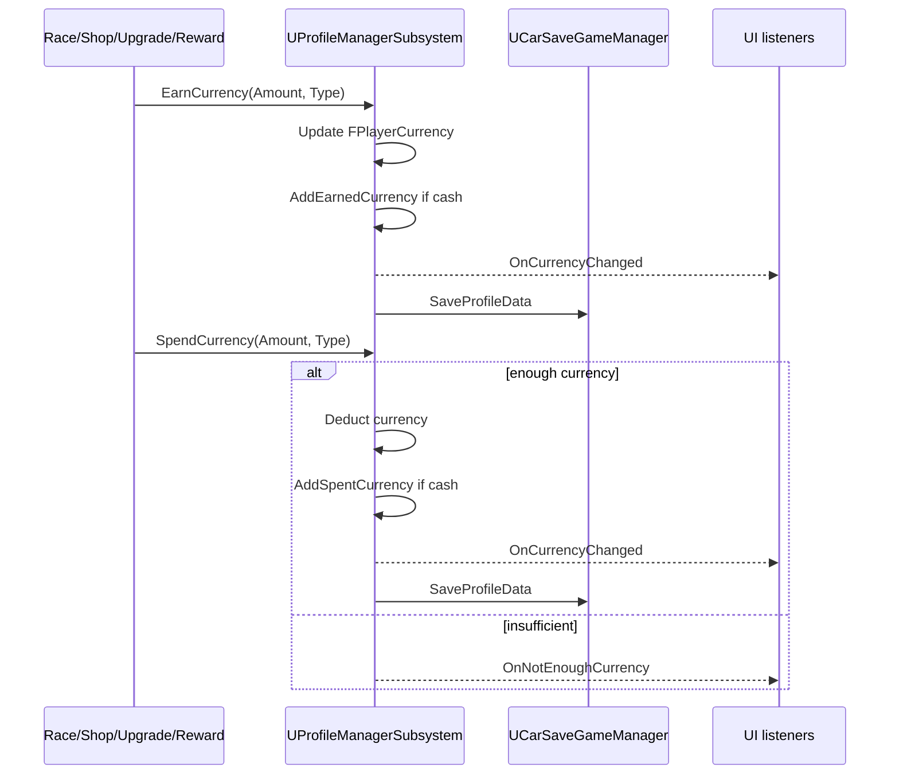

### Currency/session mapping note

`PlayerState_V1.md` mentions Cash, Click, and Fuel. Current profile wallet enum has Cash and Coin. Fuel is not part of `ECurrencyType`; it is implemented separately by `URaceSessionSubsystem` with `FFuelTicks`, `OnFuelChange`, recharge timers, `AddFuel`, `RemoveFuel`, `RemoveAllFuel`, and `IsOutOfFuel`.

---

# 9. Inventory System

## 9.1 `UInventoryManager : UGameInstanceSubsystem`

### Responsibility

| Responsibility | Detail |
| --- | --- |
| Initialization | Setup item database and default inventory settings |
| Query | Get all items, by type, by id, definition, count |
| Mutation | Add/remove item, equip, favorite, bulk add |
| Persistence | Save/load inventory items to SaveGame |
| Events | Broadcast inventory/item add/remove changes |
| Limits | Max stack/quantity and unique item count |

### Key fields

```cpp
UDataTable* InventoryItemsDataTable;
FInventoryDefaultSettings InventoryDefaultSettings;
TMap<FString, FInventoryItem> InventoryItems;
UItemDatabase* ItemDatabase;
UCarSaveGameManager* SaveManager;
static constexpr int32 Max_Items = 999;
static constexpr int32 Max_Unique_Items = 200;
```

### Events

| Delegate | Trigger |
| --- | --- |
| `OnInventoryUpdated` | Any inventory mutation |
| `OnItemAdded` | Item added, includes updated item |
| `OnItemRemoved` | Item removed, includes updated item |

### Add item flow

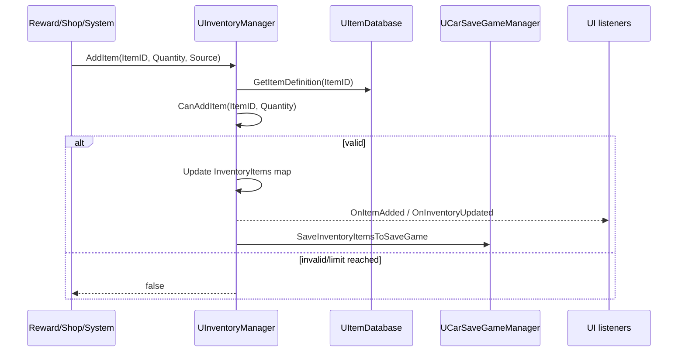

---

# 10. Rewards and Token System

Design docs define reward tokens as random pull opportunities. Implementation should map final reward outputs to `UProfileManagerSubsystem` and `UInventoryManager`.

## 10.1 Reward token algorithm

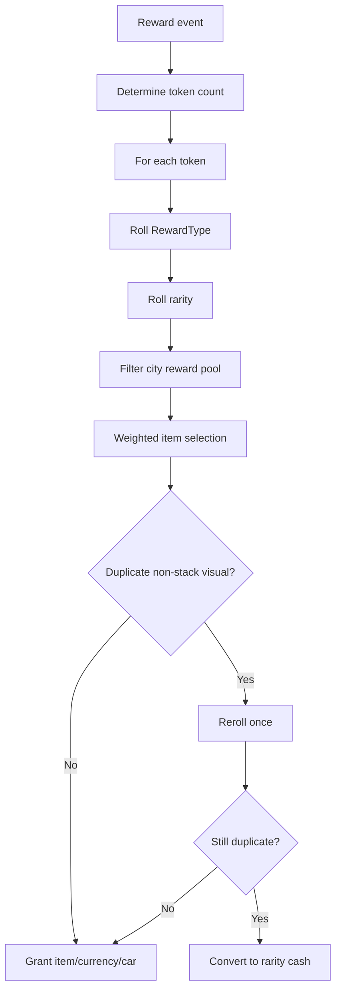

## 10.2 Reward output owner

| Reward type | Owner |
| --- | --- |
| Cash/Coin | `UProfileManagerSubsystem::EarnCurrency` |
| Fuel | `URaceSessionSubsystem` through `FFuelTicks` and fuel recharge APIs |
| Visual item | `UInventoryManager::AddItem` |
| Performance item | `UInventoryManager::AddItem` |
| Currency item | `UInventoryManager::AddItem`, then use action converts to wallet |
| Car unlock | `UCarCustomizationManager::AddNewCarConfiguration` |
| City/track unlock | `UProgressionSubsystem` via `UProgressionCenterSubsystem` |

---

# 11. Online System

## 11.1 `UNakamaServiceSubsystem : UGameInstanceSubsystem`

### Responsibility

| Responsibility | API |
| --- | --- |
| Client access | `GetNakamaClient`, `GetNakamaRealtimeClient` |
| Session access | `UpdateSession`, `GetSession` |
| Realtime readiness | `ConnectRealtimeClient`, `IsRealtimeClientReady` |
| Authentication | `LoginByEmail`, `LoginByUserName`, `RegisterByEmail`, `LoginWithDeviceID` |
| Delegate handling | auth success/error, realtime success/error |

### Key fields

```cpp
URaceSessionSubsystem* RaceSessionSubsystem;
UMatchServiceSubsystem* MatchServiceSubsystem;
UNakamaClient* NakamaClient;
UNakamaSession* Session;
UNakamaRealtimeClient* RealtimeClient;
bool bBoundOnRealtimeClient;
bool bRealtimeClientReady;
```

`UNakamaServiceSubsystem` currently keeps references to race session and match service. This is functional for the current online flow, but a stricter dependency direction would keep Nakama focused on client/session/realtime access and let match orchestration depend on Nakama instead of bidirectional service knowledge.

## 11.2 `UMatchServiceSubsystem : UGameInstanceSubsystem`

### Responsibility

| Responsibility | API |
| --- | --- |
| Matchmaking | `StartMatchmaking`, `CancelMatchmaking` |
| Query building | `BuildMatchMakingQuery` |
| Time limit | `OnMatchFindingTimeUpdate`, `MatchmakingTimeLimit` |
| Realtime events | matchmaker matched, match data, presence, ready payload |
| Payload parsing | `JsonPayloadStringToMatchData` |

### Request/payload structs

```cpp
struct FMatchMakingRequest
{
    int32 MapId;
    FString MapName;
    ERaceMode RaceMode;
    int MatchMakingRanking;
};
```

`FMatchMakingRequest` depends on `ERaceMode` from race runtime types. If online contracts are hardened later, move shared race-mode identifiers for matchmaking into a neutral shared contract/header so online service code does not need to couple directly to race manager implementation details.

```cpp
struct FMatchmakerNotificationPayload
{
    FString Reason;
    FString Message;
    int32 PlayerCount;
    int32 MaxPlayers;
    TArray<FPlayerInfo> Players;
    FString MatchId;
    int32 MapId;
    FString RacingMode;
};
```

### Current online authority boundary

Source code hiện tại xác nhận các luồng Nakama auth/session/realtime và matchmaking. Edgegap đang được bật dưới dạng plugin và xuất hiện trong định hướng kiến trúc, nhưng lượt rà soát này chưa tìm thấy luồng xác thực race server-authoritative trong source code. Vì vậy, quyền xử lý race trên dedicated server nên được xem là ranh giới thiết kế/triển khai trong tương lai cho đến khi code path này được đặc tả rõ.

### Matchmaking flow

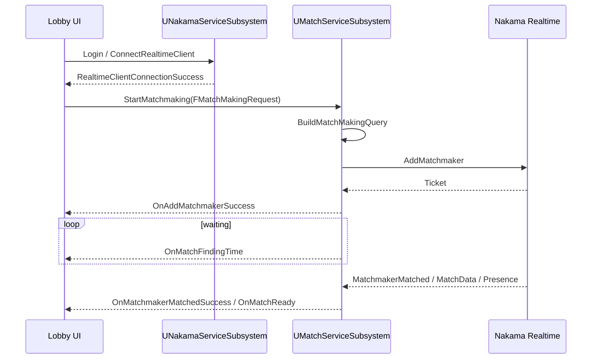

---

# 12. SaveGame and Data Boundaries

## 12.1 Save owners

Save boundaries should distinguish the domain owner, the save facade/helper, and the physical UE `SaveGame` class or slot.

| Data | Domain owner | Save facade / physical storage |
| --- | --- | --- |
| Car configs | `UCarCustomizationManager` | `UCarSaveGameManager`, `RacingSaveGame` |
| Profile/wallet/stats | `UProfileManagerSubsystem` / `URaceSessionSubsystem` profile fields | `UCarSaveGameManager`, profile save slot |
| Fuel/session energy | `URaceSessionSubsystem` | `FFuelTicks`, `FuelTicksSaveName` |
| Inventory | `UInventoryManager` | `UCarSaveGameManager`, `ProfileInventorySaveGame` |
| Progression | `UProgressionSubsystem` / `UProgressionCenterSubsystem` | `ProgressionSaveGame` |
| Settings | `UCarSettingSubsystem` | `CarSaveSetting` |
| Track animation | Progression system | `TrackAnimationSaveGame` |

## 12.2 DataTable setup order

Recommended initialization order:

1. `URacingCarGameInstance` exposes configured table references.
2. `UCarRatingSubsystem::SetupCarRatingData` loads CR tables.
3. `UCarCustomizationManager::InitializeDataTable` loads car customization tables.
4. `UProfileManagerSubsystem::SetupProfileData` loads avatar/name/forbidden-word tables.
5. `UInventoryManager::SetInventoryDefaultResource` and `InitializeItemDatabase` load inventory tables.
6. `UProgressionSubsystem` loads VN Tour progression tables.
7. `UProgressionCenterSubsystem` coordinates facade access.

---

# 13. UI / Delegate Boundary

UI should use delegates rather than polling every frame when possible.

| UI area | Delegate/source |
| --- | --- |
| Race HUD ranking/checkpoint | `ARaceTrackManager::OnRankingUpdate`, `OnCheckpointPassed` |
| Race timer | `OnTotalRaceTimeUpdate`, `OnTimeAttackUpdate` |
| Lap UI | `OnLapCompleted`, `OnLapChanged` |
| Result screen | `OnRaceEnded`, `UProgressionCenterSubsystem::OnRewardCalculated` |
| Wallet header | `UProfileManagerSubsystem::OnCurrencyChanged` |
| Profile UI | `OnProfileUpdated`, `OnAvatarChange`, name update delegates |
| Inventory UI | `UInventoryManager::OnInventoryUpdated`, `OnItemAdded`, `OnItemRemoved` |
| Customization UI | `UCarCustomizationManager::OnCarConfigurationChanged`, upgrade/save delegates |
| Matchmaking UI | `UMatchServiceSubsystem` success/error/time/match delegates |

---

# 14. Debug, Analytics, Performance Tools

## 14.1 Debug system

Debug modules are separated by concern:

| Module | Purpose |
| --- | --- |
| `DebugModule_Camera` | Camera debug controls |
| `DebugModule_Cheat` | Cheat/debug actions |
| `DebugModule_Gameplay` | Gameplay debug |
| `DebugModule_Overlay` | Overlay display |
| `DebugModule_Progression` | Progression debug |
| `DebugModule_Rendering` | Rendering debug |
| `DebugModule_TestMaps` | Test map tools |
| `DebugModule_TrackLogic` | Track/race logic debug |
| `DebugModule_Tutorial` | Tutorial debug |
| `DebugModule_Vehicle` | Vehicle debug |

## 14.2 Analytics

`UProgressionCenterSubsystem` has race analytics methods:

| Method | Event |
| --- | --- |
| `RecordRaceStartAnalytics` | Track race start |
| `RecordRaceMetricsAnalytics` | Track race metrics |
| `RecordRaceResultAnalytics` | Track race result |

## 14.3 Performance systems

| System | Purpose |
| --- | --- |
| `UPerformanceMonitorSubsystem` | Runtime performance monitoring |
| `LiteSignificanceManager` | Significance-based optimization |
| `LiteSignificanceAutoRegister` | Auto-register actors/components |
| `PSOEffectManager` / `PSOPrecacheSaveGame` | Shader/effect precache flow |
| `UActorObjectPoolSubsystem : UWorldSubsystem` | World-scoped reusable actor pooling |

---

# 15. Future Implementation Audit Checklist

Các checkbox dưới đây là danh sách kiểm chứng cho các pass implementation/refinement sau, không phải trạng thái hoàn thành của việc tạo tài liệu HLD/LLD hiện tại.

## 15.1 Runtime / race

- [ ] Confirm `ARacingCarGameMode` spawns exactly one `ARaceTrackManager` per race level.
- [ ] Ensure `ARaceGameState` replicates car readiness before `StartRace`.
- [ ] Ensure `ARaceTrackManager::InitializePlayerRaceState` is called for player and all AI cars.
- [ ] Ensure checkpoint index validation prevents skipped/duplicate checkpoint progress.
- [ ] Ensure ranking updates after checkpoint pass and at configured distance update interval.
- [ ] Ensure `EndRace` is idempotent and does not double-grant rewards.
- [ ] Ensure TimeAttack path uses `AttackTimeDuration`, `TimeBonus`, and `OnTimeBonusAdded` consistently.

## 15.2 Vehicle / AI

- [ ] Confirm AI difficulty distribution sums and fallback behavior for each `ETrackDifficulty`.
- [ ] Ensure `FCarRatingStats` is applied consistently to player and AI vehicles through shared wrapper where possible.
- [ ] Ensure AI names are unique per race when `AINameDataTable` is configured.
- [ ] Ensure AI visual style generation respects `PartRules` and material pool availability.

## 15.3 Customization

- [ ] Validate all customization DataTables before UI opens garage/customization screens.
- [ ] Ensure locked visual items can preview only if design requires preview, but cannot apply/save.
- [ ] Ensure preview config reverts when user exits without apply/purchase.
- [ ] Ensure body material and decal exclusivity follows `CarCustomize_V2.md`.
- [ ] Ensure performance upgrade checks currency and item requirements before mutating config.
- [ ] Ensure upgrade failure routes to `OnPerformanceStatUpgradeFailed` with specific reason.
- [ ] Ensure save/load restores all owned car configs and selected current car.

## 15.4 Progression / rewards

- [ ] Ensure VN Tour hierarchy matches 5 cities, 5 areas per city, 3 tracks per area where production data requires it.
- [ ] Ensure city unlock checks Tier 3 goal completion or accepted design condition.
- [ ] Ensure performance gate uses `UCarRatingSubsystem` and returns recommendation.
- [ ] Ensure race result updates track history and first-time/first-win bonuses once only.
- [ ] Ensure token random reward flow handles duplicate visual item reroll/compensation.
- [ ] Ensure reward outputs route through profile/inventory/customization/progression owners.

## 15.5 Profile / inventory

- [ ] Confirm currency enum and UI labels: source currently has Cash/Coin while design mentions Cash/Click/Fuel.
- [ ] Ensure `SpendCurrency` cannot underflow and always broadcasts insufficient currency on failure.
- [ ] Ensure inventory respects `Max_Items = 999` and `Max_Unique_Items = 200`.
- [ ] Ensure non-stack visual items do not create duplicate inventory entries.
- [ ] Ensure equipped/favorite states save and restore correctly.

## 15.6 Online

- [ ] Ensure Nakama client/session/realtime lifecycle handles auth failure and reconnect.
- [ ] Ensure `UMatchServiceSubsystem::StartMatchmaking` requires realtime-ready state.
- [ ] Ensure matchmaking timeout calls cancel flow and broadcasts timeout result.
- [ ] Ensure match data JSON parsing handles invalid/missing fields safely.
- [ ] Ensure future dedicated server travel path validates match token/server assignment when implemented.

## 15.7 Save / data

- [ ] Ensure SaveGame version fields migrate or reset invalid old saves.
- [ ] Ensure DataTable missing-row behavior returns explicit failure reason, not silent default success.
- [ ] Ensure all subsystem setup functions are called before dependent UI can use them.
- [ ] Ensure analytics events do not block race completion or reward grant.

---
# 16. Network gameplay:
## 16.1 Network design:
- Với việc không cần xử lí cho các xe va chạm nhau (vấn đề rất khó và nằm ngoài khả năng giải quyết), hệ thống network chỉ cần xử lí phần như sau: phần đầu là gửi các thông số bao gồm vị trí, góc xoay, vận tốc tuyến tính và vận tốc góc từ client lên server, phần sau là lưu trữ các thông số này trong 1 bộ nhớ ngắn hạn trên server (5 frame), tính toán đơn giản hoặc kiểm tra giới hạn mức thông số có thể (ví dụ không có chuyện frame trước xe chạy 100km/h, frame sau chạy 200km/h), sau đó gửi lại thông số đã qua sàn lọc cho các player khác để xử lí. Những player không phải owner sẽ interpolate kết quả và hiển thị trên màn hình. Đồng thời, client phải xử lí không cho các xe va chạm như ở chế độ offline
## 16.2 Network collision:
- Các xe vẫn có khả năng va chạm với các vật thể trên đường, ví dụ như đường cái, nhà cửa, pick-up và interactable actors. Các xe không va chạm với nhau.
- Khi một xe ở quá gần xe của owner client, xe đó sẽ bị làm mờ đi để không vướng tầm nhìn.
---

# 17. Open Issues

| Issue | Detail | Suggested next step |
| --- | --- | --- |
| Currency naming split | Design uses Cash/Click/Fuel; source wallet enum currently Cash/Coin and Fuel is owned by `URaceSessionSubsystem` | Decide whether UI/design wording should rename Coin/Click and document Fuel as session energy |
| Reward implementation owner | Thuật toán token đã được mô tả trong tài liệu thiết kế nhưng chưa được ánh xạ đầy đủ tới một source class chuyên trách ở lượt rà soát này | Tạo hoặc xác định reward service trước khi triển khai |
| Online authority | Source code hiện có Nakama auth/realtime/matchmaking và Edgegap plugin đang bật; luồng xác thực race server-authoritative chưa được xác nhận trong lượt rà soát này | Xác định kế hoạch PvP server-authoritative nếu online racing thuộc milestone hiện tại |
| Old docs corruption | Some files in `VNRacing/Docs/_architecture` contain corrupted snippets | Prefer source + new design docs for future refinements |
| UI detailed states | This LLD defines owners/events, not per-widget loading/error/empty/disabled states | Add UI LLD per screen if UI implementation is next |

---

# 18. Related Documents

| Document | Purpose |
| --- | --- |
| `Docs/VNRacing_HLD.md` | High-level architecture |
| `Docs/CarCustomize_V2.md` | Customization design |
| `Docs/Progression_V8.md` | Progression/economy design |
| `Docs/PlayerState_V1.md` | Player wallet/inventory/garage design |
| `Docs/Item_Rewards_V2.md` | Reward token design |
| `VNRacing/Docs/_architecture/system-overview.md` | Tài liệu tổng quan kiến trúc cũ |
