# Data Flow Architecture - VNRacing

**Breadcrumbs:** Docs > Architecture > Data Flow

**Version:** 1.1.0 | **Date:** 2026-01-26


---

## Table of Contents

1. [Overview](#overview)
2. [Subsystem Access Pattern](#1-subsystem-access-pattern)
   - [Global Subsystem Access](#global-subsystem-access)
   - [Subsystem Dependencies](#subsystem-dependencies)
3. [Car Customization Data Flow](#2-car-customization-data-flow)
   - [Configuration Update Flow](#configuration-update-flow)
   - [Performance Calculation Flow](#performance-calculation-flow)
   - [Upgrade Cost Formula](#upgrade-cost-formula)
4. [Progression Data Flow](#3-progression-data-flow)
   - [Race Setup Flow](#race-setup-flow)
   - [Race Completion Flow](#race-completion-flow)
   - [VN-Tour Data Hierarchy](#vn-tour-data-hierarchy)
5. [Profile & Inventory Data Flow](#4-profile--inventory-data-flow)
   - [Currency Flow](#currency-flow)
   - [Inventory Update Flow](#inventory-update-flow)
6. [Settings Data Flow](#5-settings-data-flow)
   - [Setting Update Flow](#setting-update-flow)
   - [Auto Graphic Detection Flow](#auto-graphic-detection-flow)
7. [Save/Load Data Flow](#6-saveload-data-flow)
   - [Centralized Save System](#centralized-save-system)
   - [Save Slot Mapping](#save-slot-mapping)
8. [Minimap Data Flow](#7-minimap-data-flow)
   - [Entity Registration Flow](#entity-registration-flow)
   - [Path Drawing Flow](#path-drawing-flow)
9. [Tutorial Data Flow](#8-tutorial-data-flow)
   - [Tutorial Trigger Flow](#tutorial-trigger-flow)
10. [AI Data Flow](#9-ai-data-flow)
    - [AI Spawning Flow](#ai-spawning-flow)
11. [Event-Driven Communication](#10-event-driven-communication)
    - [Key Delegates](#key-delegates)
    - [UI Binding Pattern](#ui-binding-pattern)
12. [Data Flow Best Practices](#data-flow-best-practices)
13. [Related Documentation](#related-documentation)

---

## Overview

This document describes the data flow patterns in VNRacing, synchronized with the actual source code. It covers game state management, player progression, customization, settings, and persistence.

---

## 1. Subsystem Access Pattern

### Global Subsystem Access

```cpp
// Access any GameInstanceSubsystem from anywhere
UCarCustomizationManager* CustomManager = GetGameInstance()->GetSubsystem<UCarCustomizationManager>();
UProgressionCenterSubsystem* ProgressionCenter = GetGameInstance()->GetSubsystem<UProgressionCenterSubsystem>();
UCarSettingSubsystem* SettingSubsystem = GetGameInstance()->GetSubsystem<UCarSettingSubsystem>();
UProfileManagerSubsystem* ProfileManager = GetGameInstance()->GetSubsystem<UProfileManagerSubsystem>();
```

### Subsystem Dependencies

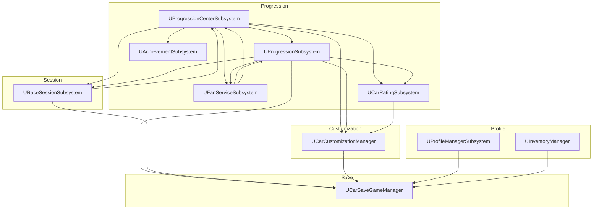

**Legend:**
- **Boxes**: GameInstance Subsystems
- **Grouped Boxes**: Related subsystem categories
- **Arrows**: Direct dependencies (subsystem A depends on subsystem B)

---

## 2. Car Customization Data Flow

### Configuration Update Flow

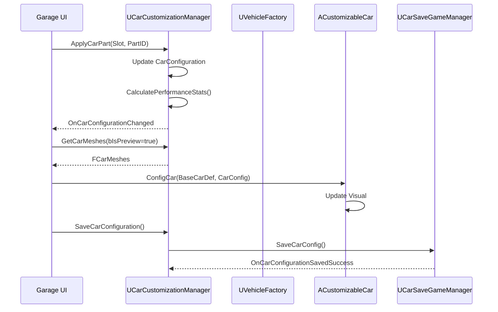

**Legend:**
- **Solid Arrows (→)**: Synchronous function calls
- **Dashed Arrows (⇢)**: Asynchronous callbacks/events
- **Participants**: System components involved in the flow

### Performance Calculation Flow

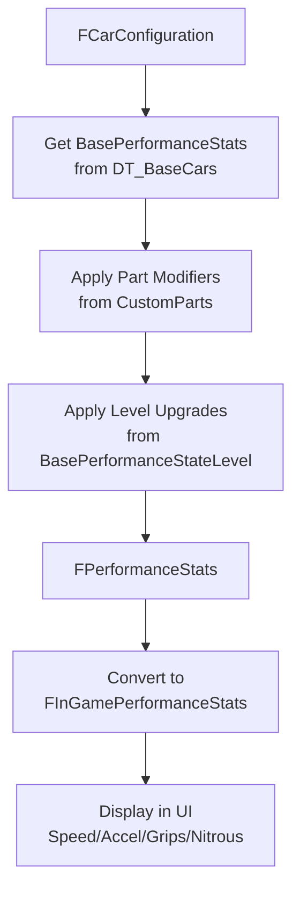

**Legend:**
- **Boxes**: Data structures or processing steps
- **Arrows**: Data transformation flow
- **Multi-line Boxes**: Processing steps with data sources

### Upgrade Cost Formula

```cpp
// From UCarCustomizationManager::GetCostForNextUpgradePerformance
float Cost = UpgradeBasePrice * FMath::Pow(UpgradeCarScaling, CarScaleNumber) 
           * FMath::Pow(NextLevel, UpgradeLevelScale);

// Default values:
// UpgradeBasePrice = 200
// UpgradeCarScaling = 1.5
// UpgradeLevelScale = 2
```

---

## 3. Progression Data Flow

### Race Setup Flow

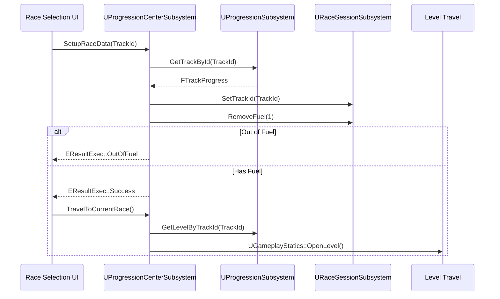

**Legend:**
- **Solid Arrows (→)**: Synchronous function calls
- **Dashed Arrows (⇢)**: Return values/callbacks
- **Alt Box**: Conditional branching logic

### Race Completion Flow

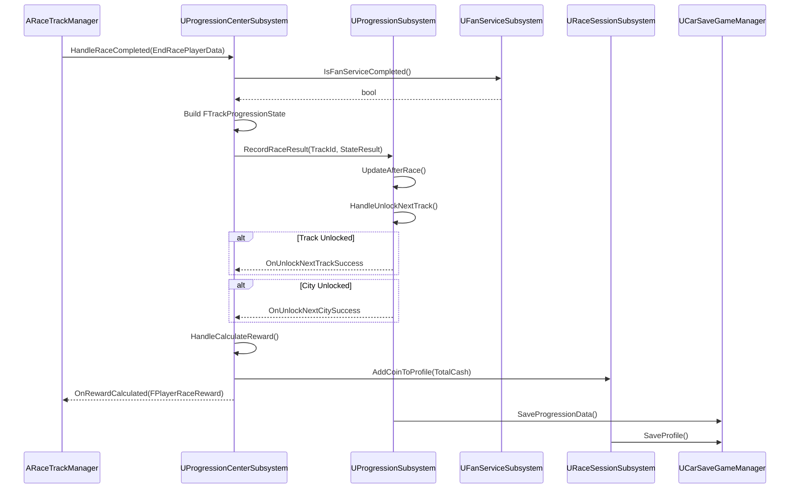

**Legend:**
- **Solid Arrows (→)**: Synchronous function calls
- **Dashed Arrows (⇢)**: Return values/callbacks
- **Alt Box**: Conditional events (track/city unlocks)

### VN-Tour Data Hierarchy

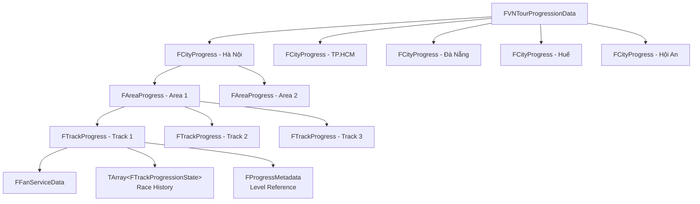

**Legend:**
- **Boxes**: Data structures in progression hierarchy
- **Arrows**: Containment relationship (parent contains child)
- **Top Level**: Campaign data
- **Middle Levels**: City and area groupings
- **Bottom Level**: Individual track data with mission/history

---

## 4. Profile & Inventory Data Flow

### Currency Flow

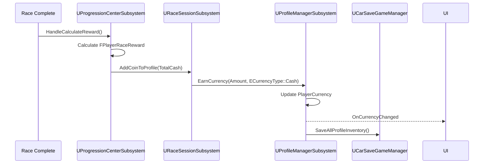

**Legend:**
- **Solid Arrows (→)**: Synchronous function calls
- **Dashed Arrows (⇢)**: Event broadcasts to UI
- **Flow**: Race reward → Currency update → UI notification → Save

### Inventory Update Flow

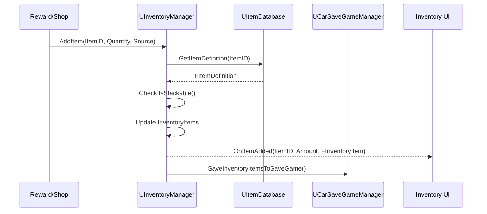

**Legend:**
- **Solid Arrows (→)**: Synchronous function calls
- **Dashed Arrows (⇢)**: Return values and event broadcasts
- **Flow**: Item addition → Database lookup → Inventory update → UI notification → Save

---

## 5. Settings Data Flow

### Setting Update Flow

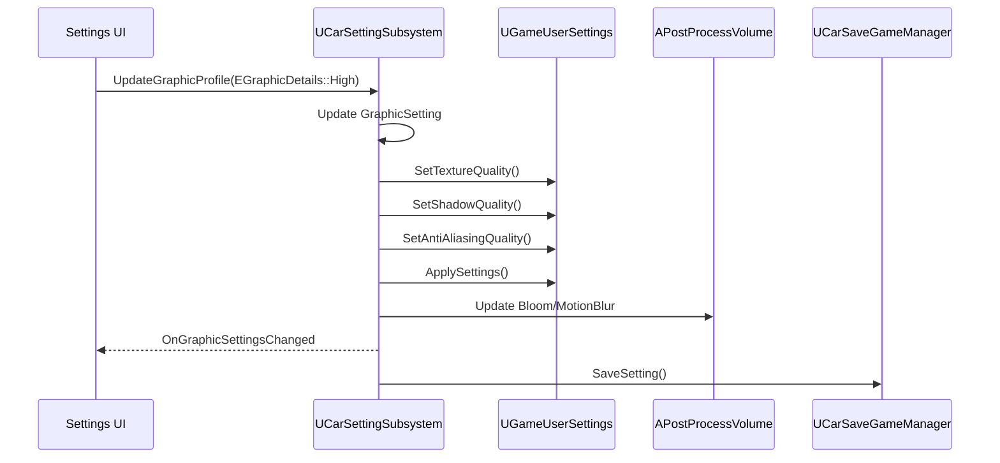

**Legend:**
- **Solid Arrows (→)**: Synchronous function calls
- **Dashed Arrows (⇢)**: Event broadcasts
- **Flow**: UI input → Settings update → Engine settings → Post-process → Save

### Auto Graphic Detection Flow

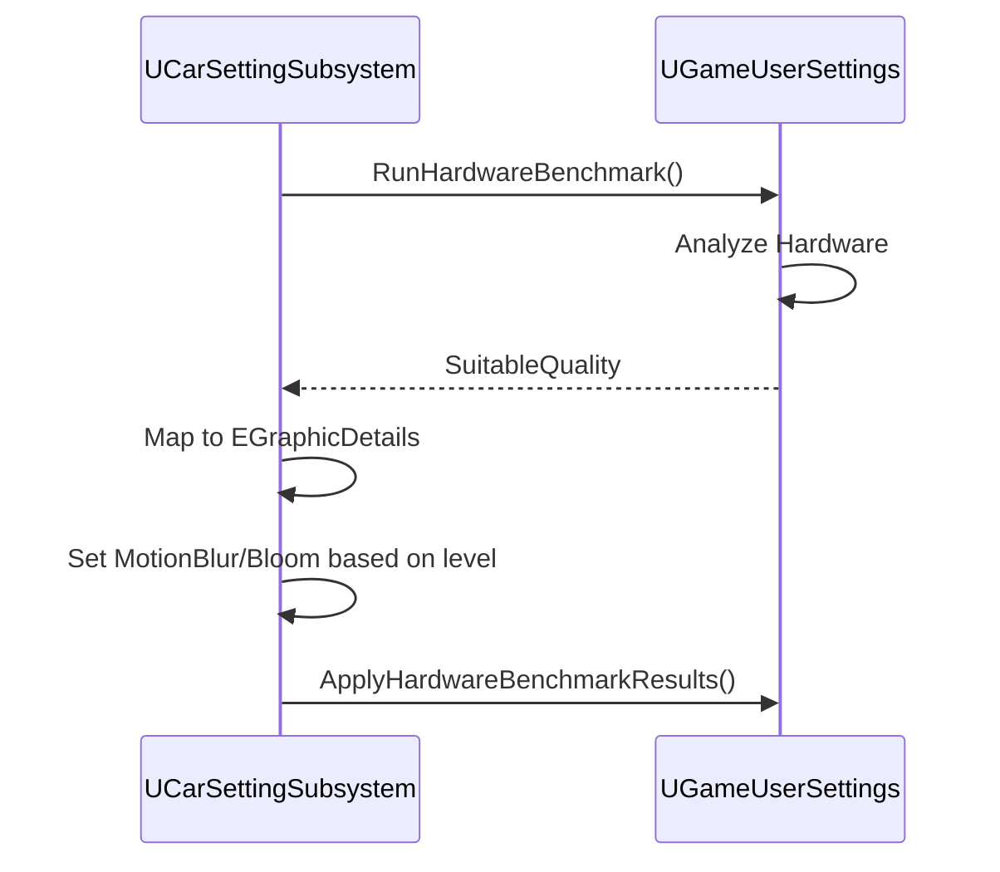

**Legend:**
- **Solid Arrows (→)**: Synchronous function calls
- **Dashed Arrows (⇢)**: Return values
- **Flow**: Benchmark request → Hardware analysis → Quality mapping → Apply settings

---

## 6. Save/Load Data Flow

### Centralized Save System

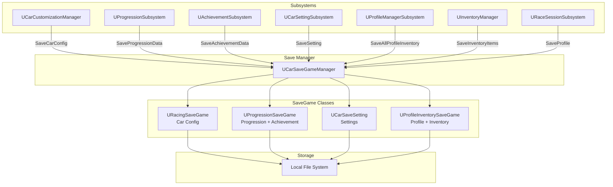

**Legend:**
- **Boxes**: System components
- **Grouped Boxes**: Related component categories
- **Arrows with Labels**: Save operations with method names
- **Flow**: Subsystems → Save Manager → SaveGame Classes → File System

### Save Slot Mapping

| Subsystem | Save Name | SaveGame Class |
|-----------|-----------|----------------|
| UCarCustomizationManager | `CarConfig` | URacingSaveGame |
| UProgressionSubsystem | `ProgressionSystem` | UProgressionSaveGame |
| UAchievementSubsystem | `AchievementSystem` | UProgressionSaveGame |
| UCarSettingSubsystem | `GameSettings` | UCarSaveSetting |
| UProfileManagerSubsystem | `ProfileInventory` | UProfileInventorySaveGame |
| UInventoryManager | `ProfileInventory` | UProfileInventorySaveGame |
| URaceSessionSubsystem | `Profile`, `FuelTicks` | UProgressionSaveGame |

---

## 7. Minimap Data Flow

### Entity Registration Flow

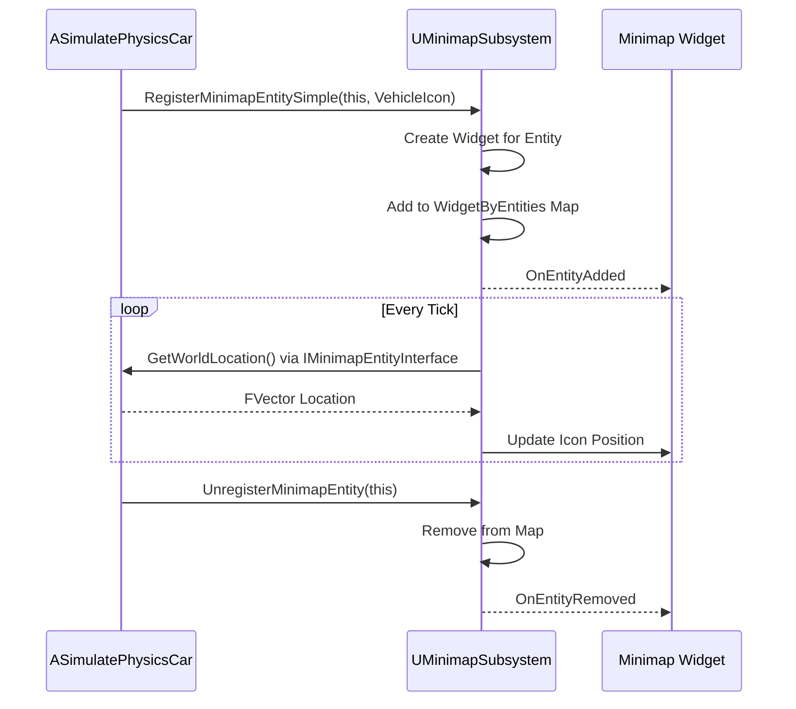

**Legend:**
- **Solid Arrows (→)**: Synchronous function calls
- **Dashed Arrows (⇢)**: Return values and events
- **Loop Box**: Continuous update cycle during gameplay

### Path Drawing Flow

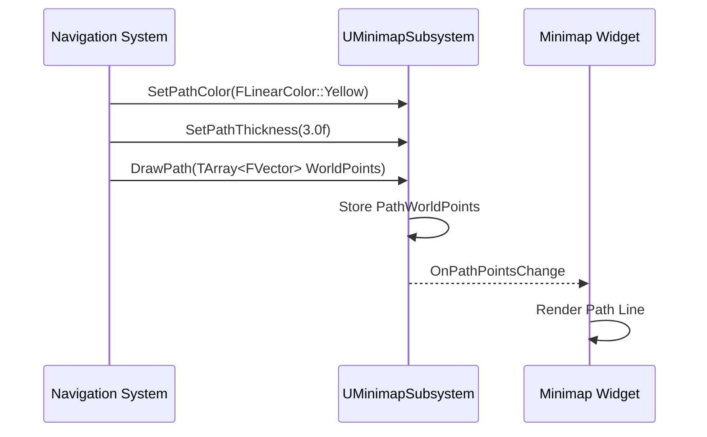

**Legend:**
- **Solid Arrows (→)**: Synchronous function calls
- **Dashed Arrows (⇢)**: Event notifications
- **Flow**: Path configuration → Draw request → Store data → UI update

---

## 8. Tutorial Data Flow

### Tutorial Trigger Flow

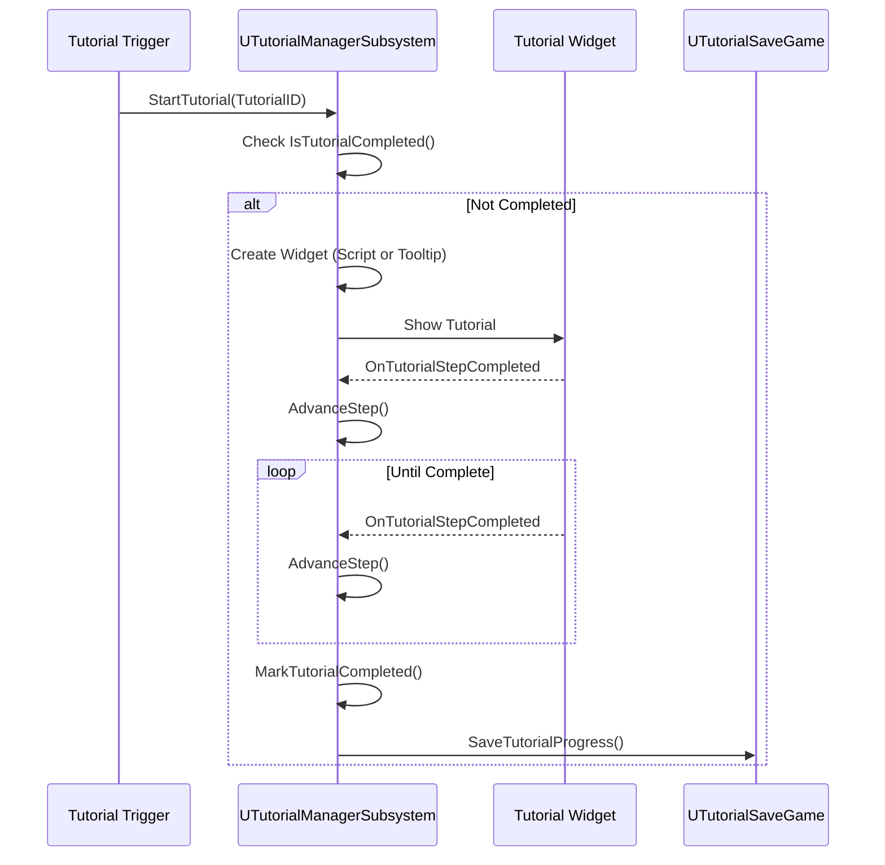

**Legend:**
- **Solid Arrows (→)**: Synchronous function calls
- **Dashed Arrows (⇢)**: Event callbacks
- **Alt Box**: Conditional execution (only if not completed)
- **Loop Box**: Step progression until tutorial complete

---

## 9. AI Data Flow

### AI Spawning Flow

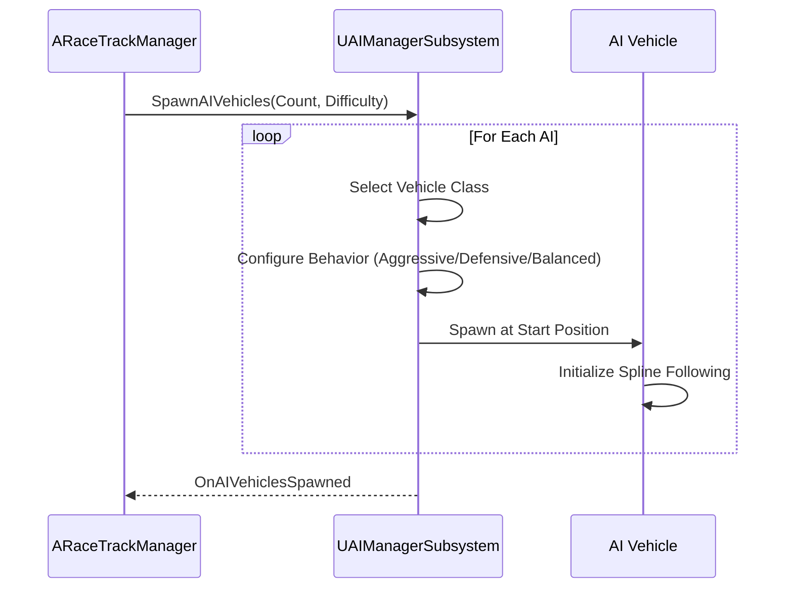

**Legend:**
- **Solid Arrows (→)**: Synchronous function calls
- **Dashed Arrows (⇢)**: Completion callback
- **Loop Box**: Repeated spawning for each AI vehicle
- **Flow**: Race manager requests → AI manager spawns → Vehicles initialize

---

## 10. Event-Driven Communication

### Key Delegates

| Subsystem | Delegate | Purpose |
|-----------|----------|---------|
| UCarCustomizationManager | `OnCarConfigurationChanged` | Config updated |
| UCarCustomizationManager | `OnPerformanceStatUpgraded` | Upgrade success |
| UProgressionCenterSubsystem | `OnRewardCalculated` | Race reward ready |
| UProgressionCenterSubsystem | `OnUnlockNextTrackSuccess` | Track unlocked |
| UProgressionSubsystem | `OnProgressionUpdated` | Progression changed |
| UFanServiceSubsystem | `OnFanServiceProgressUpdate` | Mission progress |
| UProfileManagerSubsystem | `OnCurrencyChanged` | Currency updated |
| UInventoryManager | `OnItemAdded` | Item added |
| UCarSettingSubsystem | `OnGraphicSettingsChanged` | Graphics changed |
| URaceSessionSubsystem | `OnFuelChange` | Fuel updated |
| UMinimapSubsystem | `OnEntityAdded` | Entity registered |

### UI Binding Pattern

```cpp
// Widget binds to subsystem events
void UMyWidget::NativeConstruct()
{
    Super::NativeConstruct();
    
    if (UCarCustomizationManager* CCM = GetGameInstance()->GetSubsystem<UCarCustomizationManager>())
    {
        CCM->OnCarConfigurationChanged.AddDynamic(this, &UMyWidget::OnConfigChanged);
    }
}

void UMyWidget::NativeDestruct()
{
    if (UCarCustomizationManager* CCM = GetGameInstance()->GetSubsystem<UCarCustomizationManager>())
    {
        CCM->OnCarConfigurationChanged.RemoveDynamic(this, &UMyWidget::OnConfigChanged);
    }
    
    Super::NativeDestruct();
}
```

---

## Data Flow Best Practices

### 1. Unidirectional Data Flow
- Data flows from authoritative source (subsystem) to consumers (UI)
- Avoid circular dependencies
- Clear ownership of data

### 2. Event-Driven Updates
- Use Event Dispatchers for loose coupling
- Subsystems broadcast changes
- UI listens and updates

### 3. Centralized Persistence
- All save/load through `UCarSaveGameManager`
- Consistent save slot naming
- Validation on load

### 4. Interface Abstraction
- `ICarDataProvider`, `IProgressionDataProvider`, `ISettingDataProvider`
- Clean API contracts
- Testability

---

## Related Documentation

- [System Overview](./system-overview.md)
- [Integration Patterns](./integration-patterns.md)
- [Technology Stack](./technology-stack.md)
