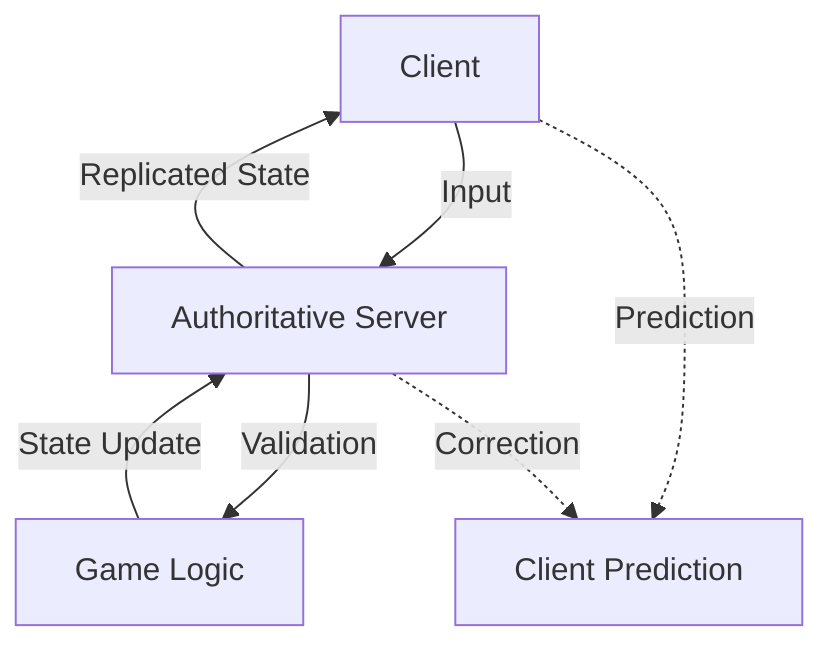

# Security Architecture - VNRacing

**Breadcrumbs:** Docs > Architecture > Security Architecture

**Version:** 1.0.0 | **Date:** 2026-01-20


---

## Table of Contents

1. [Overview](#overview)
2. [Client-Server Security Model](#1-client-server-security-model)
   - [Server-Authoritative Architecture](#server-authoritative-architecture)
   - [Authority Validation](#authority-validation)
3. [Anti-Cheat Measures](#2-anti-cheat-measures)
   - [Movement Validation](#movement-validation)
   - [Input Validation](#input-validation)
   - [Race Time Validation](#race-time-validation)
4. [Data Encryption](#3-data-encryption)
   - [Save Game Encryption](#save-game-encryption)
   - [Network Encryption](#network-encryption)
5. [User Data Protection](#4-user-data-protection)
   - [GDPR Compliance](#gdpr-compliance)
   - [Data Minimization](#data-minimization)
6. [Secure Communication](#5-secure-communication)
   - [API Request Signing](#api-request-signing)
   - [Rate Limiting](#rate-limiting)
7. [Payment Security](#6-payment-security)
   - [In-App Purchase Validation](#in-app-purchase-validation)
8. [Logging and Monitoring](#7-logging-and-monitoring)
   - [Security Event Logging](#security-event-logging)
9. [Security Checklist](#security-checklist)
10. [Conclusion](#conclusion)

---

## Overview

This document describes the security architecture, anti-cheat measures, data protection strategies, and secure communication patterns employed in PrototypeRacing to ensure fair gameplay and protect user data.

---

## 1. Client-Server Security Model

### Server-Authoritative Architecture



**Legend:**
- **Solid Arrows**: Authoritative data flow (server validates all actions)
- **Dashed Arrows**: Client-side prediction and server corrections
- **Boxes**: System components in client-server architecture
- **Flow**: Client sends input → Server validates → Server updates state → Client receives authoritative state

### Authority Validation

```cpp
// Server-side validation example
void APlayerVehicle::ServerFireWeapon_Implementation()
{
    // Validate on server
    if (!HasAuthority())
    {
        UE_LOG(LogSecurity, Warning, TEXT("Client attempted to fire weapon without authority"));
        return;
    }
    
    // Validate Cooldown
    float CurrentTime = GetWorld()->GetTimeSeconds();
    if (CurrentTime - LastFireTime < FireCooldown)
    {
        UE_LOG(LogSecurity, Warning, TEXT("Client attempted to fire weapon too quickly"));
        return;
    }
    
    // Validate ammo
    if (CurrentAmmo <= 0)
    {
        UE_LOG(LogSecurity, Warning, TEXT("Client attempted to fire weapon without ammo"));
        return;
    }
    
    // Validate distance to target
    if (FVector::Dist(GetActorLocation(), TargetLocation) > MaxFireRange)
    {
        UE_LOG(LogSecurity, Warning, TEXT("Client attempted to fire weapon beyond max range"));
        return;
    }
    
    // All validations passed, execute action
    FireWeapon();
    LastFireTime = CurrentTime;
    CurrentAmmo--;
}

bool APlayerVehicle::ServerFireWeapon_Validate()
{
    // Basic validation before implementation
    return true;
}
```

---

## 2. Anti-Cheat Measures

### Movement Validation

```cpp
// Server-side movement validation
void APlayerVehicle::ServerMove_Implementation(FVector NewLocation, FRotator NewRotation, float DeltaTime)
{
    if (!HasAuthority())
        return;
    
    // Validate movement distance
    float Distance = FVector::Dist(GetActorLocation(), NewLocation);
    float MaxDistance = MaxSpeed * DeltaTime * 1.1f; // 10% tolerance
    
    if (Distance > MaxDistance)
    {
        // Potential speed hack detected
        UE_LOG(LogSecurity, Warning, TEXT("Player %s moved too far: %f > %f"), 
            *GetName(), Distance, MaxDistance);
        
        // Reject movement, send correction
        ClientCorrectPosition(GetActorLocation(), GetActorRotation());
        
        // Log suspicious activity
        LogSuspiciousActivity(ESuspiciousActivity::SpeedHack);
        return;
    }
    
    // Validate location (not out of bounds)
    if (!IsLocationValid(NewLocation))
    {
        UE_LOG(LogSecurity, Warning, TEXT("Player %s attempted to move out of bounds"), *GetName());
        ClientCorrectPosition(GetActorLocation(), GetActorRotation());
        LogSuspiciousActivity(ESuspiciousActivity::OutOfBounds);
        return;
    }
    
    // Movement is valid
    SetActorLocationAndRotation(NewLocation, NewRotation);
}

// Client correction
void APlayerVehicle::ClientCorrectPosition_Implementation(FVector CorrectLocation, FRotator CorrectRotation)
{
    SetActorLocationAndRotation(CorrectLocation, CorrectRotation);
}
```

### Input Validation

```cpp
// Validate input values
void APlayerVehicle::ServerProcessInput_Implementation(float Steering, float Throttle, float Brake)
{
    // Validate input ranges
    if (FMath::Abs(Steering) > 1.0f || FMath::Abs(Throttle) > 1.0f || FMath::Abs(Brake) > 1.0f)
    {
        UE_LOG(LogSecurity, Warning, TEXT("Player %s sent invalid input values"), *GetName());
        LogSuspiciousActivity(ESuspiciousActivity::InvalidInput);
        return;
    }
    
    // Validate input frequency
    float CurrentTime = GetWorld()->GetTimeSeconds();
    if (CurrentTime - LastInputTime < MinInputInterval)
    {
        UE_LOG(LogSecurity, Warning, TEXT("Player %s sending inputs too frequently"), *GetName());
        LogSuspiciousActivity(ESuspiciousActivity::InputSpam);
        return;
    }
    
    // Process valid input
    ProcessInput(Steering, Throttle, Brake);
    LastInputTime = CurrentTime;
}
```

### Race Time Validation

```cpp
// Validate race completion time
void AGameMode::ValidateRaceCompletion(APlayerState* Player, float CompletionTime)
{
    // Calculate theoretical minimum time
    float TheoreticalMinTime = CalculateTheoreticalMinTime(CurrentTrack);
    
    if (CompletionTime < TheoreticalMinTime * 0.95f) // 5% tolerance
    {
        // Impossible time detected
        UE_LOG(LogSecurity, Warning, TEXT("Player %s completed race in impossible time: %f < %f"),
            *Player->GetPlayerName(), CompletionTime, TheoreticalMinTime);
        
        // Reject result
        RejectRaceResult(Player, TEXT("Impossible completion time"));
        
        // Flag for review
        FlagPlayerForReview(Player, ESuspiciousActivity::ImpossibleTime);
        return;
    }
    
    // Validate checkpoint times
    if (!ValidateCheckpointTimes(Player))
    {
        UE_LOG(LogSecurity, Warning, TEXT("Player %s has invalid checkpoint times"), *Player->GetPlayerName());
        RejectRaceResult(Player, TEXT("Invalid checkpoint progression"));
        FlagPlayerForReview(Player, ESuspiciousActivity::InvalidCheckpoints);
        return;
    }
    
    // Time is valid
    AcceptRaceResult(Player, CompletionTime);
}
```

---

## 3. Data Encryption

### Save Game Encryption

```cpp
// Encrypted save game
UCLASS()
class UEncryptedSaveGame : public USaveGame
{
    GENERATED_BODY()

public:
    // Encrypted data
    UPROPERTY()
    TArray<uint8> EncryptedData;
    
    // Encryption key (stored securely, not in save file)
    static FString GetEncryptionKey();
    
    // Encrypt data before saving
    void EncryptData(const TArray<uint8>& PlainData);
    
    // Decrypt data after loading
    bool DecryptData(TArray<uint8>& OutPlainData);
};

// Save with encryption
void USaveGameManager::SaveGame(const FSaveGameData& Data)
{
    // Serialize data
    TArray<uint8> PlainData;
    FMemoryWriter Writer(PlainData);
    Writer << const_cast<FSaveGameData&>(Data);
    
    // Encrypt
    UEncryptedSaveGame* SaveGame = Cast<UEncryptedSaveGame>(
        UGameplayStatics::CreateSaveGameObject(UEncryptedSaveGame::StaticClass())
    );
    SaveGame->EncryptData(PlainData);
    
    // Save to disk
    UGameplayStatics::SaveGameToSlot(SaveGame, TEXT("SaveSlot"), 0);
}

// Load with decryption
bool USaveGameManager::LoadGame(FSaveGameData& OutData)
{
    UEncryptedSaveGame* SaveGame = Cast<UEncryptedSaveGame>(
        UGameplayStatics::LoadGameFromSlot(TEXT("SaveSlot"), 0)
    );
    
    if (!SaveGame)
        return false;
    
    // Decrypt
    TArray<uint8> PlainData;
    if (!SaveGame->DecryptData(PlainData))
    {
        UE_LOG(LogSecurity, Error, TEXT("Failed to decrypt save game"));
        return false;
    }
    
    // Deserialize
    FMemoryReader Reader(PlainData);
    Reader << OutData;
    
    return true;
}
```

### Network Encryption

```cpp
// Nakama uses TLS by default
void UNakamaClientWrapper::Initialize()
{
    // Create client with TLS enabled
    NakamaClient = UNakamaClient::CreateDefaultClient(
        ServerKey,
        Host,
        Port,
        true // Use TLS
    );
}
```

---

## 4. User Data Protection

### GDPR Compliance

```cpp
// User data manager
UCLASS()
class UUserDataManager : public UGameInstanceSubsystem
{
    GENERATED_BODY()

public:
    // Request user data export (GDPR right to access)
    UFUNCTION(BlueprintCallable, Category = "Privacy")
    void RequestDataExport(TFunction<void(const FString&)> Callback);
    
    // Request user data deletion (GDPR right to erasure)
    UFUNCTION(BlueprintCallable, Category = "Privacy")
    void RequestDataDeletion(TFunction<void(bool)> Callback);
    
    // Get privacy policy
    UFUNCTION(BlueprintPure, Category = "Privacy")
    FString GetPrivacyPolicyURL() const;
    
    // Check consent
    UFUNCTION(BlueprintPure, Category = "Privacy")
    bool HasUserConsent(EConsentType Type) const;
    
    // Request consent
    UFUNCTION(BlueprintCallable, Category = "Privacy")
    void RequestConsent(EConsentType Type, TFunction<void(bool)> Callback);
};

// Consent types
UENUM(BlueprintType)
enum class EConsentType : uint8
{
    Analytics,
    Personalization,
    Marketing,
    DataSharing
};
```

### Data Minimization

```cpp
// Only collect necessary data
struct FAnalyticsEvent
{
    FString EventName;
    TMap<FString, FString> Parameters;
    
    // Do NOT include:
    // - Personal identifiable information (PII)
    // - Device identifiers (unless anonymized)
    // - Location data (unless necessary and consented)
    // - Contact information
};

// Anonymize user IDs
FString AnonymizeUserID(const FString& UserID)
{
    // Hash the user ID
    return FMD5::HashAnsiString(*UserID);
}
```

---

## 5. Secure Communication

### API Request Signing

```cpp
// Sign API requests to prevent tampering
FString SignRequest(const FString& Endpoint, const FString& Payload, const FString& Timestamp)
{
    // Create signature string
    FString SignatureString = Endpoint + Payload + Timestamp + SecretKey;
    
    // Hash with SHA256
    FSHA256 Hash;
    Hash.Update((uint8*)TCHAR_TO_ANSI(*SignatureString), SignatureString.Len());
    
    uint8 Digest[32];
    Hash.Final(Digest);
    
    // Convert to hex string
    return BytesToHex(Digest, 32);
}

// Verify signature on server
bool VerifyRequestSignature(const FString& Endpoint, const FString& Payload, 
    const FString& Timestamp, const FString& Signature)
{
    FString ExpectedSignature = SignRequest(Endpoint, Payload, Timestamp);
    return Signature.Equals(ExpectedSignature);
}
```

### Rate Limiting

```cpp
// Rate limiter to prevent abuse
UCLASS()
class URateLimiter : public UObject
{
    GENERATED_BODY()

public:
    // Check if action is allowed
    bool IsActionAllowed(const FString& UserID, const FString& Action);
    
private:
    struct FRateLimitInfo
    {
        int32 Count;
        float LastResetTime;
    };
    
    TMap<FString, FRateLimitInfo> RateLimits;
    
    // Limits per action
    TMap<FString, int32> ActionLimits = {
        {TEXT("SubmitScore"), 10},      // 10 per minute
        {TEXT("PurchaseItem"), 5},      // 5 per minute
        {TEXT("SendMessage"), 20},      // 20 per minute
        {TEXT("JoinMatch"), 10}         // 10 per minute
    };
};

bool URateLimiter::IsActionAllowed(const FString& UserID, const FString& Action)
{
    FString Key = UserID + TEXT("_") + Action;
    float CurrentTime = FPlatformTime::Seconds();
    
    FRateLimitInfo& Info = RateLimits.FindOrAdd(Key);
    
    // Reset if minute has passed
    if (CurrentTime - Info.LastResetTime > 60.0f)
    {
        Info.Count = 0;
        Info.LastResetTime = CurrentTime;
    }
    
    // Check limit
    int32 Limit = ActionLimits.FindRef(Action);
    if (Info.Count >= Limit)
    {
        UE_LOG(LogSecurity, Warning, TEXT("Rate limit exceeded for user %s action %s"), *UserID, *Action);
        return false;
    }
    
    Info.Count++;
    return true;
}
```

---

## 6. Payment Security

### In-App Purchase Validation

```cpp
// Validate IAP receipt on server
void UShopSubsystem::ValidatePurchase(const FString& Receipt, const FString& ProductID)
{
    // Send receipt to platform for validation
    #if PLATFORM_IOS
        ValidateAppleReceipt(Receipt, ProductID);
    #elif PLATFORM_ANDROID
        ValidateGoogleReceipt(Receipt, ProductID);
    #endif
}

void UShopSubsystem::ValidateAppleReceipt(const FString& Receipt, const FString& ProductID)
{
    // Send to Apple's verification server
    FString URL = TEXT("https://buy.itunes.apple.com/verifyReceipt");
    
    TSharedRef<IHttpRequest> Request = FHttpModule::Get().CreateRequest();
    Request->SetURL(URL);
    Request->SetVerb(TEXT("POST"));
    Request->SetHeader(TEXT("Content-Type"), TEXT("application/json"));
    
    FString Payload = FString::Printf(TEXT("{\"receipt-data\":\"%s\"}"), *Receipt);
    Request->SetContentAsString(Payload);
    
    Request->OnProcessRequestComplete().BindLambda([this, ProductID](
        FHttpRequestPtr Request, FHttpResponsePtr Response, bool bSuccess)
    {
        if (bSuccess && Response->GetResponseCode() == 200)
        {
            // Parse response and verify
            TSharedPtr<FJsonObject> JsonObject;
            TSharedRef<TJsonReader<>> Reader = TJsonReaderFactory<>::Create(Response->GetContentAsString());
            
            if (FJsonSerializer::Deserialize(Reader, JsonObject))
            {
                int32 Status = JsonObject->GetIntegerField(TEXT("status"));
                if (Status == 0)
                {
                    // Receipt is valid, grant item
                    GrantPurchasedItem(ProductID);
                }
                else
                {
                    UE_LOG(LogSecurity, Error, TEXT("Invalid receipt: status %d"), Status);
                }
            }
        }
    });
    
    Request->ProcessRequest();
}
```

---

## 7. Logging and Monitoring

### Security Event Logging

```cpp
// Log security events
void LogSecurityEvent(ESecurity EventType, const FString& UserID, const FString& Details)
{
    FSecurityEvent Event;
    Event.Timestamp = FDateTime::UtcNow();
    Event.EventType = EventType;
    Event.UserID = AnonymizeUserID(UserID);
    Event.Details = Details;
    Event.IPAddress = GetClientIPAddress();
    
    // Log locally
    UE_LOG(LogSecurity, Warning, TEXT("[SECURITY] %s: User %s - %s"),
        *UEnum::GetValueAsString(EventType), *Event.UserID, *Details);
    
    // Send to analytics
    AnalyticsManager->TrackSecurityEvent(Event);
    
    // Store for review
    SecurityEventDatabase->StoreEvent(Event);
}

// Security event types
UENUM()
enum class ESecurityEventType : uint8
{
    SpeedHack,
    InvalidInput,
    OutOfBounds,
    ImpossibleTime,
    InvalidCheckpoints,
    SuspiciousActivity,
    RateLimitExceeded,
    InvalidReceipt,
    UnauthorizedAccess
};
```

---

## Security Checklist

### Server-Side Validation
- [ ] All gameplay actions validated on server
- [ ] Movement validation implemented
- [ ] Input validation implemented
- [ ] Race time validation implemented
- [ ] Checkpoint validation implemented

### Anti-Cheat
- [ ] Speed hack detection
- [ ] Teleport detection
- [ ] Impossible time detection
- [ ] Input spam detection
- [ ] Suspicious activity logging

### Data Protection
- [ ] Save game encryption
- [ ] Network communication encrypted (TLS)
- [ ] User data anonymized
- [ ] GDPR compliance implemented
- [ ] Privacy policy available

### Secure Communication
- [ ] API request signing
- [ ] Rate limiting implemented
- [ ] Input sanitization
- [ ] SQL injection prevention (if applicable)
- [ ] XSS prevention (if applicable)

### Payment Security
- [ ] IAP receipt validation
- [ ] Server-side purchase verification
- [ ] Duplicate purchase prevention
- [ ] Refund handling

### Monitoring
- [ ] Security event logging
- [ ] Suspicious activity alerts
- [ ] Regular security audits
- [ ] Incident response plan

---

## Conclusion

The PrototypeRacing security architecture ensures:
- **Fair Gameplay**: Server-authoritative validation and anti-cheat
- **Data Protection**: Encryption and GDPR compliance
- **Secure Communication**: TLS, signing, rate limiting
- **Payment Security**: Receipt validation and server verification

Security is an ongoing process. Regular audits, monitoring, and updates are essential to maintain a secure gaming environment.

