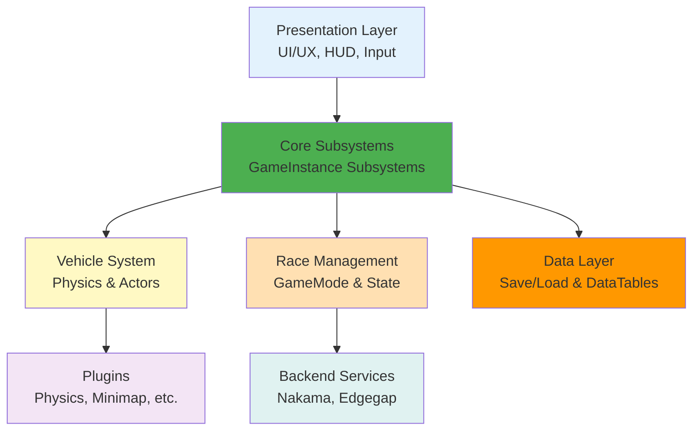
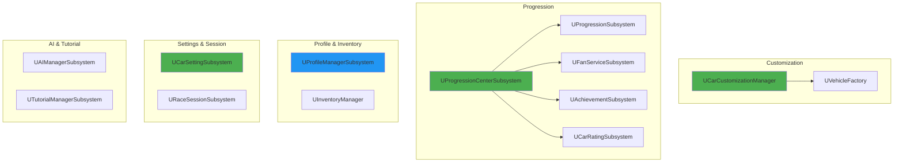
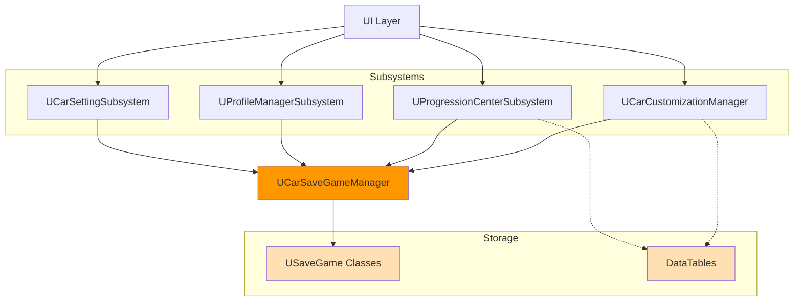
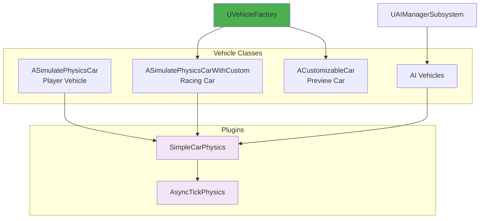
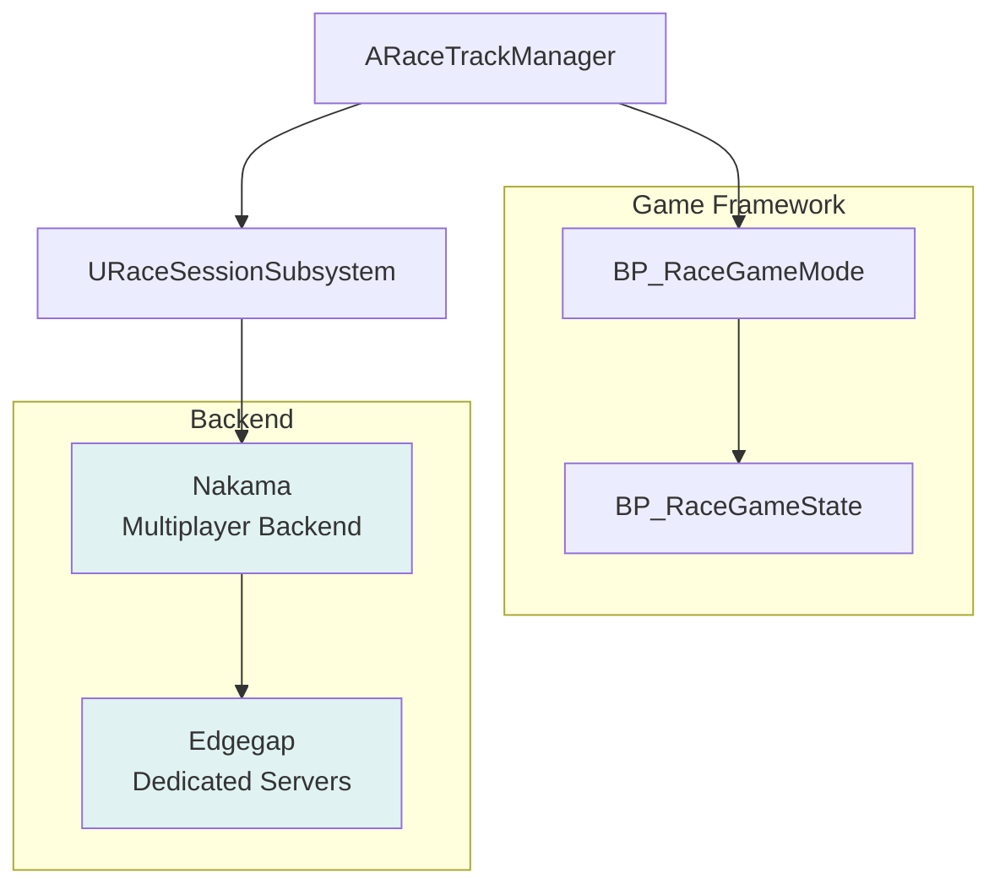

# System Overview - VNRacing

**Breadcrumbs:** Docs > Architecture > System Overview

**Version:** 1.1.0 | **Date:** 2026-01-26


---

## Table of Contents

1. [Overview](#overview)
2. [System Architecture Diagrams](#system-architecture-diagrams)
   - [High-Level System Layers](#high-level-system-layers)
   - [Core Subsystems Detail](#core-subsystems-detail)
   - [Data Flow Architecture](#data-flow-architecture)
   - [Vehicle and Physics Integration](#vehicle-and-physics-integration)
   - [Multiplayer Architecture](#multiplayer-architecture)
3. [Core Subsystems](#core-subsystems)
   - [Car Customization System](#1-car-customization-system)
   - [Progression System](#2-progression-system)
   - [Profile & Inventory System](#3-profile--inventory-system)
   - [Setting System](#4-setting-system)
   - [Race Session System](#5-race-session-system)
   - [AI System](#6-ai-system)
   - [Tutorial System](#7-tutorial-system)
   - [Minimap System](#8-minimap-system)
4. [Data Layer](#data-layer)
5. [Plugin Integration](#plugin-integration)
6. [System Layers](#system-layers)
7. [Design Patterns](#design-patterns)
8. [Performance Targets](#performance-targets)
9. [Related Documentation](#related-documentation)
10. [Feature Documentation](#feature-documentation)

---

## Overview

VNRacing is a mobile-first racing game built on Unreal Engine 5.4+, featuring deep Vietnamese cultural integration, robust multiplayer capabilities, and an extensive vehicle customization system. This document provides a high-level overview of the system architecture, synchronized with the actual source code.

---

## System Architecture Diagrams

### High-Level System Layers



**Legend:**
- **Light Blue**: Presentation/UI layer
- **Green**: Core business logic subsystems
- **Light Yellow**: Vehicle and physics systems
- **Light Orange**: Race management systems
- **Orange**: Data persistence layer
- **Light Purple**: Plugin integrations
- **Light Teal**: External backend services
- **Solid Lines**: Direct dependencies

---

### Core Subsystems Detail



**Legend:**
- **Green**: Primary subsystems with interfaces
- **Blue**: Profile management subsystems
- **White**: Supporting subsystems
- **Solid Lines**: Direct subsystem dependencies

---

### Data Flow Architecture



**Legend:**
- **Orange**: Save/Load manager
- **Light Orange**: Storage systems
- **Solid Lines**: Write/Save operations
- **Dashed Lines**: Read/Query operations

---

### Vehicle and Physics Integration



**Legend:**
- **Green**: Factory/Manager components
- **Light Purple**: Plugin systems
- **White**: Vehicle actor classes
- **Solid Lines**: Creation or usage dependencies

---

### Multiplayer Architecture



**Legend:**
- **Light Teal**: External backend services
- **White**: Game framework components
- **Solid Lines**: Communication flow

---

## Core Subsystems

Tất cả core subsystems kế thừa từ `UGameInstanceSubsystem` để automatic lifecycle management và global access.

### 1. Car Customization System

#### UCarCustomizationManager
**File**: `Source/PrototypeRacing/Public/CarCustomizationSystem/CarCustomizationManager.h`  
**Interface**: `ICarDataProvider`

**Responsibilities**:
- Quản lý car configurations (visual + performance)
- Multi-car garage management
- Performance stats calculation
- Upgrade system với cost formula

**Key Data**:
```cpp
TMap<FString, FCarConfiguration> ProfileCarConfigurations;  // Garage
FCarConfiguration CarConfiguration;                          // Current config
FCarConfiguration PreviewCarConfiguration;                   // Preview mode
```

**Key Methods**:
- `ApplyCarPart()`, `ApplyCarColor()`, `ApplyCarMaterials()`
- `CalculatePerformanceStats()`, `GetInGamePerformanceStats()`
- `UpgradePerformanceStat()`, `GetCostForNextUpgradePerformance()`
- `ChangeCarConfigByCarID()`, `AddNewCarConfiguration()`

#### UVehicleFactory
**Purpose**: Spawn vehicles cho racing và preview

**Vehicle Classes**:
- `ASimulatePhysicsCarWithCustom` - Racing car với customization
- `ACustomizableCar` - Preview car trong garage

---

### 2. Progression System

#### UProgressionCenterSubsystem (Facade)
**File**: `Source/PrototypeRacing/Public/BackendSubsystem/Progression/ProgressionCenterSubsystem.h`  
**Interface**: `IProgressionDataProvider`

**Responsibilities**:
- Central access point cho progression
- Race setup và travel
- Reward calculation
- Coordinate between subsystems

**Key Methods**:
- `SetupRaceData()`, `TravelToCurrentRace()`
- `HandleRaceCompleted()`, `HandleCalculateReward()`
- `GetAllCities()`, `GetAllAreasByCityId()`, `GetAllTracksByAreaId()`

#### UProgressionSubsystem
**Purpose**: VN-Tour campaign data management

**Data Structure**:
```cpp
FVNTourProgressionData VNTourProgressionData;
// Contains: TArray<FCityProgress> → TArray<FAreaProgress> → TArray<FTrackProgress>
```

#### UFanServiceSubsystem
**Purpose**: In-race mission tracking (DriftMaster, CleanRacer, SpeedDemon, etc.)

#### UAchievementSubsystem
**Purpose**: Achievement definitions và progress

#### UCarRatingSubsystem
**Purpose**: Performance gate calculation

---

### 3. Profile & Inventory System

#### UProfileManagerSubsystem
**File**: `Source/PrototypeRacing/Public/BackendSubsystem/ProfileManagerSubsystem.h`

**Responsibilities**:
- Player profile management (name, avatar, level)
- Currency management (Cash/Coin)
- Player statistics tracking
- Name validation với profanity filter

**Key Data**:
```cpp
FPlayerProfileData PlayerProfileData;
// Contains: PlayerName, PlayerID, AvatarID, PlayerLevel, PlayerCurrency, Stats
```

#### UInventoryManager
**File**: `Source/PrototypeRacing/Public/InventorySystem/InventoryManager.h`

**Responsibilities**:
- Item management (add, remove, equip)
- Item database queries
- Inventory persistence

**Limits**:
- Max Items per stack: 999
- Max Unique Items: 200

---

### 4. Setting System

#### UCarSettingSubsystem
**File**: `Source/PrototypeRacing/Public/SettingSystem/CarSettingSubsystem.h`  
**Interface**: `ISettingDataProvider`

**Setting Categories**:
| Category | Data Structure | Options |
|----------|---------------|---------|
| Volume | `FVolumeConfig` | General, Engine, Music, SFX |
| Controls | `FPlayerControl` | ControlType, DriftMode |
| Display | `FDisplaySettings` | CameraView, SpeedUnit |
| Graphics | `FGraphicSetting` | Profile, FrameRate, Textures, Bloom, etc. |
| Language | `FLanguageSettings` | English, Vietnamese, Chinese, Japanese |

**Features**:
- Auto graphic detection via hardware benchmark
- Quality warning system
- Integration với `UGameUserSettings`

---

### 5. Race Session System

#### URaceSessionSubsystem
**File**: `Source/PrototypeRacing/Public/BackendSubsystem/RaceSessionSubsystem.h`

**Responsibilities**:
- Current race session management
- Player profile (Level, Coin)
- Fuel system management

**Key Data**:
```cpp
int TrackId;
int SessionRanking;
FPlayerProfile PlayerProfile;
FFuelTicks FuelTicks;
```

---

### 6. AI System

#### UAIManagerSubsystem
**File**: `Source/PrototypeRacing/Public/AISystem/AIManagerSubsystem.h`

**Responsibilities**:
- AI vehicle spawning và management
- Difficulty-based behavior configuration
- Spline-based pathfinding

**AI Behavior Types**:
- `EAIBehaviorType::Aggressive` - Competitive, blocks player
- `EAIBehaviorType::Defensive` - Maintains position
- `EAIBehaviorType::Balanced` - Mixed behavior

---

### 7. Tutorial System

#### UTutorialManagerSubsystem
**File**: `Source/PrototypeRacing/Public/TutorialSystem/TutorialManagerSubsystem.h`

**Responsibilities**:
- Tutorial state management
- Script-based và tooltip tutorials
- Progress persistence

**Tutorial Types**:
- `UScriptTutorialWidget` - Step-by-step guided tutorials
- `UTooltipTutorialWidget` - Contextual tooltips

---

### 8. Minimap System

#### UMinimapSubsystem (Plugin)
**File**: `Plugins/Minimap/Source/Minimap/Public/MinimapSubsystem.h`

**Responsibilities**:
- Real-time minimap rendering
- Entity registration và tracking
- Path drawing
- Zoom và rotation control

**Key Methods**:
- `SetLookActor()` - Set center actor
- `RegisterMinimapEntitySimple()` - Register entity với icon
- `DrawPath()` - Draw path on minimap

---

## Data Layer

### UCarSaveGameManager
**File**: `Source/PrototypeRacing/Public/CarCustomizationSystem/CarSaveGameManager.h`

**Central save/load manager cho**:
- Car configurations
- Progression data
- Achievement data
- Settings
- Profile & Inventory

**Save Slots**:
| Data | Save Name |
|------|-----------|
| Car Config | `CarConfig` |
| Progression | `ProgressionSystem` |
| Achievement | `AchievementSystem` |
| Settings | `GameSettings` |
| Profile/Inventory | `ProfileInventory` |

### DataTables

| DataTable | Purpose |
|-----------|---------|
| DT_BaseCars | Base car definitions |
| DT_CarParts | Part definitions per slot |
| DT_CarColors | Color definitions |
| DT_CarMaterials | Material definitions |
| DT_Cities | VN-Tour cities |
| DT_Areas | Areas per city |
| DT_Tracks | Tracks per area |
| DT_Maps | Level references |
| DT_Avatars | Avatar definitions |
| DT_Items | Item definitions |

---

## Plugin Integration

### SimpleCarPhysics
**Purpose**: Mobile-optimized vehicle physics

**Integration**:
- Replaces Chaos Vehicle Plugin
- `USimpleCarPhysicsComponent` attached to vehicles
- Simplified suspension và tire model

### Minimap Plugin (by Radoshaka)
**Purpose**: Real-time minimap rendering

**Features**:
- Dynamic minimap với rotation và zoom
- Actor following
- Markers/icons
- Path drawing

### AsyncTickPhysics
**Purpose**: Asynchronous physics updates

**Benefits**:
- Decouples physics from game thread
- Improved mobile performance

---

## System Layers

### Presentation Layer
- **Components**: UMG Widgets, HUD, Rive Animations, Enhanced Input
- **Responsibility**: User interaction và visual feedback

### Business Logic Layer
- **Components**: GameInstanceSubsystems, GameMode, GameState
- **Responsibility**: Game rules, progression, customization

### Data Layer
- **Components**: SaveGame classes, DataTables, DataAssets
- **Responsibility**: Data persistence và configuration

### Infrastructure Layer
- **Components**: Nakama, Edgegap, Firebase
- **Responsibility**: Backend services và platform integration

---

## Design Patterns

### 1. Subsystem Pattern
- `UGameInstanceSubsystem` cho global services
- Automatic lifecycle management
- Dependency injection via subsystem access

### 2. Interface Pattern
- `ICarDataProvider` - Car customization interface
- `IProgressionDataProvider` - Progression interface
- `ISettingDataProvider` - Settings interface
- `IMinimapEntityInterface` - Minimap entity interface

### 3. Facade Pattern
- `UProgressionCenterSubsystem` - Central access cho progression subsystems

### 4. Factory Pattern
- `UVehicleFactory` - Vehicle spawning

### 5. Observer Pattern
- Event Dispatchers cho UI updates
- Delegate-based communication

---

## Performance Targets

| Metric | Target |
|--------|--------|
| Frame Rate | 60 FPS (high-end), 30 FPS (low-end) |
| Memory | <2 GB |
| Loading Time | <5s (level), <10s (initial) |
| Network Latency | <100ms |

---

## Related Documentation

- [Data Flow](./data-flow.md)
- [Integration Patterns](./integration-patterns.md)
- [Technology Stack](./technology-stack.md)
- [Mobile Optimization](./mobile-optimization.md)
- [Performance Targets](./performance-targets.md)
- [Security Architecture](./security-architecture.md)

---

## Feature Documentation

| Feature | Design Doc |
|---------|------------|
| Car Customization | [design/README.md](../features/car-customization/design/README.md) |
| Progression System | [design/progression-system-architecture.md](../features/progression-system/design/progression-system-architecture.md) |
| Profiles & Inventory | [design/README.md](../features/profiles-inventory/design/README.md) |
| Setting System | [design/setting-system-architecture.md](../features/setting-system/design/setting-system-architecture.md) |
| Minimap System | [design/README.md](../features/minimap-system/design/README.md) |
| Racer AI | [design/racer-ai-architecture.md](../features/racer-ai/design/racer-ai-architecture.md) |
| Tutorials | [design/tutorials-architecture.md](../features/tutorials/design/tutorials-architecture.md) |
