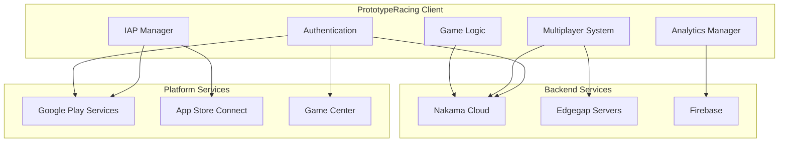

# API Integration Map - VNRacing

**Breadcrumbs:** [Docs](../README.md) > [Cross-Reference](./) > API Integration Map

**Project**: VNRacing - Mobile Racing Game  
**Document**: External API and Service Integration Reference  
**Version**: 1.0.0 | **Date**: 2026-01-20  
**Status**: 🔄 Development

## Overview

This document maps all external API integrations, backend services, platform SDKs, and third-party services used in PrototypeRacing.

## Table of Contents

1. [Integration Architecture](#1-integration-architecture)
2. [Nakama Cloud Integration](#2-nakama-cloud-integration)
3. [Edgegap Integration](#3-edgegap-integration)
4. [Firebase Integration](#4-firebase-integration)
5. [Google Play Services (Android)](#5-google-play-services-android)
6. [App Store Connect / Game Center (iOS)](#6-app-store-connect--game-center-ios)
7. [Integration Wrapper Classes](#7-integration-wrapper-classes)
8. [Error Handling](#8-error-handling)
9. [Integration Checklist](#integration-checklist)
10. [Conclusion](#conclusion)

---

## 1. Integration Architecture



---

## 2. Nakama Cloud Integration

### Overview
- **Purpose**: Backend services (authentication, matchmaking, leaderboards, cloud save)
- **Protocol**: gRPC, WebSocket
- **Authentication**: Device ID, Google Play, Game Center
- **Hosting**: Nakama Cloud (managed service)

### Features Using Nakama
- **Multiplayer**: Matchmaking, lobby management
- **Progression System**: Cloud save, leaderboards
- **Profiles & Inventory**: Cloud profile storage
- **Shop System**: Purchase validation, transaction history
- **Race Modes**: Leaderboard integration
- **Racer AI**: Cloud-based AI difficulty tuning (future)

### API Endpoints

#### Authentication
```cpp
// Device authentication
NakamaClient->AuthenticateDevice(
    DeviceID,
    "username",
    true, // Create account if not exists
    SuccessCallback,
    ErrorCallback
);

// Google Play authentication
NakamaClient->AuthenticateGoogle(
    GoogleToken,
    "username",
    true,
    SuccessCallback,
    ErrorCallback
);

// Game Center authentication (iOS)
NakamaClient->AuthenticateGameCenter(
    PlayerID,
    BundleID,
    TimestampSeconds,
    Salt,
    Signature,
    PublicKeyURL,
    "username",
    true,
    SuccessCallback,
    ErrorCallback
);
```

#### Matchmaking
```cpp
// Add to matchmaking queue
NakamaClient->AddMatchmaker(
    Session,
    2, // Min players
    8, // Max players
    "+properties.mode:time_trial +properties.region:asia",
    StringProperties,
    NumericProperties,
    SuccessCallback,
    ErrorCallback
);

// Remove from matchmaking
NakamaClient->RemoveMatchmaker(
    Session,
    Ticket,
    SuccessCallback,
    ErrorCallback
);
```

#### Leaderboards
```cpp
// Submit score
NakamaClient->WriteLeaderboardRecord(
    Session,
    "hanoi_time_trial",
    Score,
    Subscore,
    Metadata,
    SuccessCallback,
    ErrorCallback
);

// Get leaderboard
NakamaClient->ListLeaderboardRecords(
    Session,
    "hanoi_time_trial",
    OwnerIDs,
    100, // Limit
    Cursor,
    SuccessCallback,
    ErrorCallback
);
```

#### Cloud Storage
```cpp
// Write storage object
NakamaClient->WriteStorageObjects(
    Session,
    StorageObjectWrites,
    SuccessCallback,
    ErrorCallback
);

// Read storage objects
NakamaClient->ReadStorageObjects(
    Session,
    StorageObjectIds,
    SuccessCallback,
    ErrorCallback
);
```

### Rate Limits
- **Authentication**: 10 requests/minute per device
- **Matchmaking**: 5 requests/minute per user
- **Leaderboards**: 10 writes/minute per user
- **Storage**: 20 requests/minute per user

---

## 3. Edgegap Integration

### Overview
- **Purpose**: Dedicated server deployment and orchestration
- **Protocol**: REST API
- **Authentication**: API Token
- **Regions**: Global edge locations

### Features Using Edgegap
- **Multiplayer**: Dedicated server hosting
- **Race Modes**: Online race server management

### API Endpoints

#### Deploy Server
```cpp
POST https://api.edgegap.com/v1/deploy
Headers:
    Authorization: token YOUR_API_TOKEN
    Content-Type: application/json

Body:
{
    "app_name": "prototyperacing",
    "version_name": "1.0.0",
    "ip_list": ["player1_ip", "player2_ip"],
    "webhook_url": "https://your-webhook.com/edgegap"
}

Response:
{
    "request_id": "req_123456",
    "fqdn": "server.edgegap.net",
    "ports": {
        "7777": {
            "external": 12345,
            "protocol": "UDP"
        }
    }
}
```

#### Get Server Status
```cpp
GET https://api.edgegap.com/v1/status/{request_id}
Headers:
    Authorization: token YOUR_API_TOKEN

Response:
{
    "request_id": "req_123456",
    "status": "Ready",
    "fqdn": "server.edgegap.net",
    "public_ip": "1.2.3.4"
}
```

#### Stop Server
```cpp
DELETE https://api.edgegap.com/v1/stop/{request_id}
Headers:
    Authorization: token YOUR_API_TOKEN
```

### Rate Limits
- **Deploy**: 10 requests/minute
- **Status**: 60 requests/minute
- **Stop**: 10 requests/minute

---

## 4. Firebase Integration

### Overview
- **Purpose**: Analytics, crash reporting, remote config
- **Platform**: Android, iOS
- **SDK**: Firebase C++ SDK

### Features Using Firebase
- **All Features**: Analytics event tracking
- **Progression System**: Milestone analytics
- **Race Modes**: Race completion analytics
- **Multiplayer**: Matchmaking analytics
- **Shop System**: Purchase analytics
- **Tutorial System**: Tutorial completion tracking
- **Car Customization**: Customization usage analytics
- **Racer AI**: AI difficulty analytics
- **Setting System**: Settings usage analytics

### Services Used

#### Firebase Analytics
```cpp
// Log event
firebase::analytics::LogEvent(
    "race_completed",
    "mode", "time_trial",
    "track", "hanoi_downtown",
    "time", 125.5f
);

// Set user property
firebase::analytics::SetUserProperty("player_level", "15");
```

#### Firebase Crashlytics
```cpp
// Log crash
firebase::crashlytics::Log("Critical error in race logic");

// Set custom key
firebase::crashlytics::SetCustomKey("race_mode", "time_trial");

// Record exception
firebase::crashlytics::RecordException("NullPointerException", "Vehicle was null");
```

#### Firebase Remote Config
```cpp
// Fetch config
firebase::remote_config::Fetch(
    CacheExpiration,
    [](const firebase::Future<void>& future) {
        if (future.error() == 0) {
            firebase::remote_config::ActivateFetched();
        }
    }
);

// Get value
int64_t MaxPlayers = firebase::remote_config::GetLong("max_players");
bool FeatureEnabled = firebase::remote_config::GetBoolean("new_feature_enabled");
```

### Rate Limits
- **Analytics**: Unlimited events
- **Remote Config**: 5 fetches/hour per device
- **Crashlytics**: Unlimited reports

---

## 5. Google Play Services (Android)

### Overview
- **Purpose**: Authentication, achievements, leaderboards, IAP
- **SDK**: Google Play Games Services SDK

### API Integration

#### Authentication
```cpp
// Sign in
GooglePlayServices::SignIn(
    [](bool Success, FString PlayerID) {
        if (Success) {
            // Authenticated
        }
    }
);
```

#### Achievements
```cpp
// Unlock achievement
GooglePlayServices::UnlockAchievement("achievement_first_win");

// Increment achievement
GooglePlayServices::IncrementAchievement("achievement_100_races", 1);
```

#### Leaderboards
```cpp
// Submit score
GooglePlayServices::SubmitScore("leaderboard_hanoi", 12550); // Time in centiseconds
```

#### In-App Purchases
```cpp
// Query products
GooglePlayServices::QueryProducts(
    {"coins_1000", "coins_5000", "coins_10000"},
    [](TArray<FProductInfo> Products) {
        // Display products
    }
);

// Purchase product
GooglePlayServices::PurchaseProduct(
    "coins_1000",
    [](bool Success, FString Receipt) {
        if (Success) {
            // Validate receipt on server
        }
    }
);
```

---

## 6. App Store Connect / Game Center (iOS)

### Overview
- **Purpose**: Authentication, achievements, leaderboards, IAP
- **SDK**: StoreKit, GameKit

### API Integration

#### Game Center Authentication
```cpp
// Authenticate
GameCenter::Authenticate(
    [](bool Success, FString PlayerID) {
        if (Success) {
            // Authenticated
        }
    }
);
```

#### Achievements
```cpp
// Report achievement
GameCenter::ReportAchievement("first_win", 100.0f);
```

#### Leaderboards
```cpp
// Submit score
GameCenter::SubmitScore("hanoi_time_trial", 12550);
```

#### In-App Purchases
```cpp
// Request products
StoreKit::RequestProducts(
    {"coins_1000", "coins_5000", "coins_10000"},
    [](TArray<SKProduct> Products) {
        // Display products
    }
);

// Purchase product
StoreKit::PurchaseProduct(
    Product,
    [](bool Success, FString TransactionID, FString Receipt) {
        if (Success) {
            // Validate receipt
        }
    }
);
```

---

## 7. Integration Wrapper Classes

### Nakama Wrapper
```cpp
UCLASS()
class UNakamaClientWrapper : public UObject
{
    GENERATED_BODY()

public:
    void Initialize(const FString& ServerKey, const FString& Host, int32 Port);
    void AuthenticateDevice(const FString& DeviceID, TFunction<void(UNakamaSession*)> Success, TFunction<void(const FNakamaError&)> Error);
    void FindMatch(const FString& Query, TFunction<void(const FNakamaMatchmakerMatched&)> Success, TFunction<void(const FNakamaError&)> Error);
    void SubmitScore(const FString& LeaderboardID, int64 Score, TFunction<void()> Success, TFunction<void(const FNakamaError&)> Error);
    void SaveToCloud(const FString& Collection, const FString& Key, const FString& Value, TFunction<void()> Success, TFunction<void(const FNakamaError&)> Error);
    void LoadFromCloud(const FString& Collection, const FString& Key, TFunction<void(const FString&)> Success, TFunction<void(const FNakamaError&)> Error);

private:
    UNakamaClient* NakamaClient;
    UNakamaSession* CurrentSession;
};
```

### Edgegap Wrapper
```cpp
UCLASS()
class UEdgegapServerManager : public UObject
{
    GENERATED_BODY()

public:
    void Initialize(const FString& APIKey, const FString& AppName, const FString& AppVersion);
    void RequestServer(const FServerRequest& Request, TFunction<void(const FServerInfo&)> Success, TFunction<void(const FString&)> Error);
    void GetServerStatus(const FString& RequestID, TFunction<void(const FServerStatus&)> Success, TFunction<void(const FString&)> Error);
    void StopServer(const FString& RequestID, TFunction<void()> Success, TFunction<void(const FString&)> Error);

private:
    FString APIKey;
    FString AppName;
    FString AppVersion;
    
    void MakeAPIRequest(const FString& Endpoint, const FString& Method, const FString& Payload, TFunction<void(const FString&)> Callback);
};
```

### Analytics Wrapper
```cpp
UCLASS()
class UAnalyticsManager : public UGameInstanceSubsystem
{
    GENERATED_BODY()

public:
    void TrackEvent(const FString& EventName, const TMap<FString, FString>& Parameters);
    void SetUserProperty(const FString& PropertyName, const FString& Value);
    void LogCrash(const FString& Message, const TMap<FString, FString>& CustomData);

private:
    void SendToFirebase(const FString& EventName, const TMap<FString, FString>& Parameters);
    void SendToCustomAnalytics(const FString& EventName, const TMap<FString, FString>& Parameters);
};
```

---

## 8. Error Handling

### Retry Strategy
```cpp
void RetryWithBackoff(TFunction<void()> Operation, int32 MaxRetries, float InitialDelay)
{
    int32 Attempt = 0;
    float Delay = InitialDelay;
    
    TFunction<void()> AttemptOperation = [=]() mutable {
        Operation();
        
        // If failed and retries remaining
        if (Attempt < MaxRetries)
        {
            Attempt++;
            Delay *= 2.0f; // Exponential backoff
            
            FTimerHandle RetryTimer;
            GetWorld()->GetTimerManager().SetTimer(RetryTimer, AttemptOperation, Delay, false);
        }
    };
    
    AttemptOperation();
}
```

### Fallback Strategy
```cpp
void LoadPlayerData()
{
    // Try cloud first
    NakamaWrapper->LoadFromCloud("player_data", "save_game",
        [this](const FString& CloudData) {
            // Cloud load success
            ApplyCloudData(CloudData);
        },
        [this](const FNakamaError& Error) {
            // Cloud load failed, fallback to local
            UE_LOG(LogGame, Warning, TEXT("Cloud load failed, using local save"));
            LoadLocalSave();
        }
    );
}
```

---

## Integration Checklist

### Pre-Production
- [ ] Nakama server configured
- [ ] Edgegap account created
- [ ] Firebase project created
- [ ] Google Play Console configured
- [ ] App Store Connect configured
- [ ] API keys secured

### Development
- [ ] Wrapper classes implemented
- [ ] Error handling implemented
- [ ] Retry logic implemented
- [ ] Fallback strategies implemented
- [ ] Rate limiting respected

### Testing
- [ ] Integration tests written
- [ ] Network failure scenarios tested
- [ ] Rate limit handling tested
- [ ] Authentication flows tested
- [ ] IAP validation tested

### Production
- [ ] Production API keys configured
- [ ] Monitoring and alerts set up
- [ ] Analytics tracking verified
- [ ] Crash reporting verified
- [ ] Performance metrics tracked

---

## Conclusion

This API integration map provides a comprehensive reference for all external services used in PrototypeRacing. Refer to this document when:
- Implementing new integrations
- Debugging API issues
- Planning feature development
- Reviewing security practices
- Optimizing network usage

