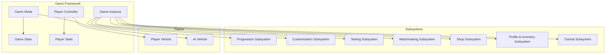
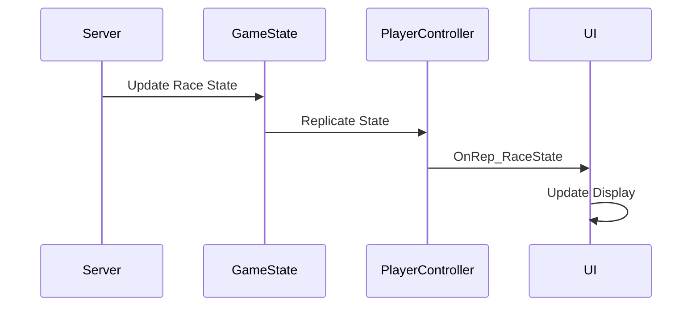
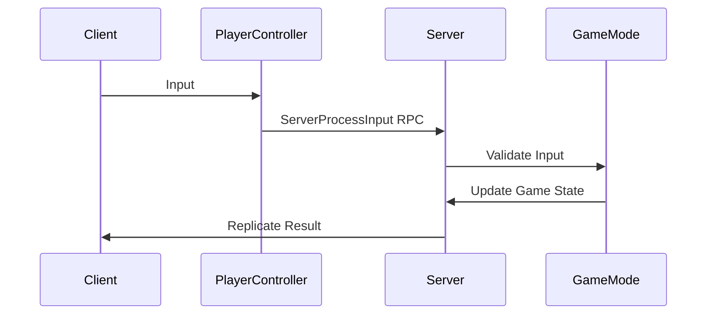

# Component Interaction Map - VNRacing

**Breadcrumbs:** [Docs](../README.md) > [Cross-Reference](./) > Component Interaction Map

**Project**: VNRacing - Mobile Racing Game  
**Document**: UE Component and Actor Interaction Reference  
**Version**: 1.0.0 | **Date**: 2026-01-20  
**Status**: 🔄 Development

## Overview

This document maps the interactions between Unreal Engine components, actors, and subsystems in PrototypeRacing, showing how different parts of the system communicate and collaborate.

**Core Features Covered:**
- Car Physics
- Car Customization
- Progression System
- Profiles & Inventory
- Setting System
- Race Modes
- Multiplayer
- Shop System
- Racer AI
- Tutorial System
- Minimap System

## Table of Contents

1. [Core Actor Hierarchy](#1-core-actor-hierarchy)
2. [Game Instance and Subsystems](#2-game-instance-and-subsystems)
3. [Game Mode and Game State](#3-game-mode-and-game-state)
4. [Player Controller and Player State](#4-player-controller-and-player-state)
5. [Vehicle Components](#5-vehicle-components)
   - [AI Racer Components](#51-ai-racer-components)
   - [Tutorial System Components](#52-tutorial-system-components)
   - [Minimap System Components](#53-minimap-system-components)
6. [UI Widget Interactions](#6-ui-widget-interactions)
7. [Event Dispatcher Communication](#7-event-dispatcher-communication)
8. [Multiplayer Replication Flow](#8-multiplayer-replication-flow)
9. [Component Lifecycle](#9-component-lifecycle)
10. [Common Interaction Patterns](#10-common-interaction-patterns)
11. [Component Interaction Best Practices](#component-interaction-best-practices)
12. [Conclusion](#conclusion)

---

## 1. Core Actor Hierarchy



---

## 2. Game Instance and Subsystems

### Game Instance
```cpp
UCLASS()
class UPrototypeRacingGameInstance : public UGameInstance
{
    GENERATED_BODY()

public:
    virtual void Init() override;
    virtual void Shutdown() override;
    
    // Subsystem access helpers
    UFUNCTION(BlueprintPure, Category = "Subsystems")
    UProgressionSubsystem* GetProgressionSubsystem() const;
    
    UFUNCTION(BlueprintPure, Category = "Subsystems")
    UCarCustomizationSubsystem* GetCustomizationSubsystem() const;
};
```

### Subsystem Interactions
```cpp
// Progression Subsystem interacts with:
// - Shop Subsystem (currency transactions)
// - Customization Subsystem (unlock notifications)
// - Matchmaking Subsystem (skill rating)

void UProgressionSubsystem::AwardXP(int32 Amount)
{
    CurrentXP += Amount;
    
    // Notify other subsystems
    OnXPGained.Broadcast(Amount, CurrentXP);
    
    // Check level up
    if (CheckLevelUp())
    {
        // Notify customization subsystem of new unlocks
        UCarCustomizationSubsystem* CustomSub = GetGameInstance()->GetSubsystem<UCarCustomizationSubsystem>();
        CustomSub->RefreshUnlockedContent();
    }
}
```

---

## 3. Game Mode and Game State

### Game Mode (Server Only)
```cpp
UCLASS()
class APrototypeRacingGameMode : public AGameModeBase
{
    GENERATED_BODY()

public:
    // Spawn AI vehicles
    void SpawnAIVehicles(int32 Count);
    
    // Handle race events
    void OnRaceStart();
    void OnRaceFinish(APlayerState* Player, float CompletionTime);
    void OnCheckpointReached(APlayerState* Player, int32 CheckpointIndex);
    
protected:
    UPROPERTY()
    TArray<AAIVehicle*> AIVehicles;
    
    UPROPERTY()
    APrototypeRacingGameState* RacingGameState;
};
```

### Game State (Replicated)
```cpp
UCLASS()
class APrototypeRacingGameState : public AGameStateBase
{
    GENERATED_BODY()

public:
    // Replicated race state
    UPROPERTY(ReplicatedUsing = OnRep_RaceState)
    ERaceState CurrentRaceState;
    
    UPROPERTY(Replicated)
    float RaceTime;
    
    UPROPERTY(Replicated)
    TArray<FPlayerRanking> PlayerRankings;
    
    UFUNCTION()
    void OnRep_RaceState();
    
    // Update rankings
    void UpdateRankings();
};
```

### Interaction Flow
```cpp
// Game Mode → Game State → Player Controller → UI
void APrototypeRacingGameMode::OnRaceStart()
{
    // Update game state
    RacingGameState->SetRaceState(ERaceState::Racing);
    RacingGameState->StartRaceTimer();
    
    // Game state replicates to all clients
    // Player controllers receive OnRep_RaceState
    // UI updates based on new state
}
```

---

## 4. Player Controller and Player State

### Player Controller
```cpp
UCLASS()
class APrototypeRacingPlayerController : public APlayerController
{
    GENERATED_BODY()

public:
    // Input handling
    virtual void SetupInputComponent() override;
    
    // UI management
    UFUNCTION(BlueprintCallable, Category = "UI")
    void ShowHUD();
    
    UFUNCTION(BlueprintCallable, Category = "UI")
    void ShowPauseMenu();
    
    // Server RPCs
    UFUNCTION(Server, Reliable, WithValidation)
    void ServerProcessInput(float Steering, float Throttle, float Brake);
    
protected:
    UPROPERTY()
    UPrototypeRacingHUD* HUDWidget;
    
    UPROPERTY()
    APlayerVehicle* ControlledVehicle;
};
```

### Player State
```cpp
UCLASS()
class APrototypeRacingPlayerState : public APlayerState
{
    GENERATED_BODY()

public:
    // Replicated player data
    UPROPERTY(Replicated)
    int32 CurrentLap;
    
    UPROPERTY(Replicated)
    int32 CurrentPosition;
    
    UPROPERTY(Replicated)
    float CurrentLapTime;
    
    UPROPERTY(Replicated)
    TArray<float> LapTimes;
    
    UPROPERTY(Replicated)
    FCustomizationData VehicleCustomization;
};
```

---

## 5. Vehicle Components

### Player Vehicle
```cpp
UCLASS()
class APlayerVehicle : public APawn
{
    GENERATED_BODY()

public:
    APlayerVehicle();
    
protected:
    // Components
    UPROPERTY(VisibleAnywhere, BlueprintReadOnly, Category = "Components")
    USkeletalMeshComponent* VehicleMesh;
    
    UPROPERTY(VisibleAnywhere, BlueprintReadOnly, Category = "Components")
    USimpleCarPhysicsComponent* PhysicsComponent;
    
    UPROPERTY(VisibleAnywhere, BlueprintReadOnly, Category = "Components")
    UCameraComponent* Camera;
    
    UPROPERTY(VisibleAnywhere, BlueprintReadOnly, Category = "Components")
    USpringArmComponent* SpringArm;
    
    UPROPERTY(VisibleAnywhere, BlueprintReadOnly, Category = "Components")
    UAudioComponent* EngineAudio;
    
    UPROPERTY(VisibleAnywhere, BlueprintReadOnly, Category = "Components")
    UParticleSystemComponent* ExhaustVFX;
    
    // Component interactions
    void UpdateEngineAudio(float Speed);
    void UpdateExhaustVFX(float Throttle);
    void ApplyCustomization(const FCustomizationData& Data);
};
```

### Component Interaction Example
```cpp
void APlayerVehicle::Tick(float DeltaTime)
{
    Super::Tick(DeltaTime);
    
    // Get speed from physics component
    float CurrentSpeed = PhysicsComponent->GetCurrentSpeed();
    
    // Update audio component
    UpdateEngineAudio(CurrentSpeed);
    
    // Update camera based on speed
    float TargetFOV = FMath::Lerp(90.0f, 110.0f, CurrentSpeed / MaxSpeed);
    Camera->SetFieldOfView(TargetFOV);
    
    // Update VFX based on throttle
    float Throttle = PhysicsComponent->GetThrottleInput();
    UpdateExhaustVFX(Throttle);
}
```

---

## 5.1. AI Racer Components

### AI Vehicle
```cpp
UCLASS()
class AAIVehicle : public APlayerVehicle
{
    GENERATED_BODY()

public:
    AAIVehicle();
    
protected:
    // AI-specific components
    UPROPERTY(VisibleAnywhere, BlueprintReadOnly, Category = "AI")
    UAIBehaviorComponent* BehaviorComponent;
    
    UPROPERTY(VisibleAnywhere, BlueprintReadOnly, Category = "AI")
    UPathFollowingComponent* PathFollowing;
    
    // AI logic
    void UpdateAIBehavior(float DeltaTime);
    void CalculateSteeringInput();
    void CalculateThrottleInput();
    void HandleOvertaking();
};
```

### AI Behavior Component Interaction
```cpp
void AAIVehicle::Tick(float DeltaTime)
{
    Super::Tick(DeltaTime);
    
    // Update AI behavior based on race state
    BehaviorComponent->UpdateBehavior(DeltaTime);
    
    // Get AI inputs
    float AISteer = BehaviorComponent->GetSteeringInput();
    float AIThrottle = BehaviorComponent->GetThrottleInput();
    
    // Apply to physics
    PhysicsComponent->SetSteeringInput(AISteer);
    PhysicsComponent->SetThrottleInput(AIThrottle);
}
```

---

## 5.2. Tutorial System Components

### Tutorial Manager
```cpp
UCLASS()
class UTutorialManager : public UGameInstanceSubsystem
{
    GENERATED_BODY()

public:
    // Start tutorial sequence
    void StartTutorial(const FString& TutorialID);
    
    // Progress to next step
    void CompleteCurrentStep();
    
    // Skip tutorial
    void SkipTutorial();
    
    // Event dispatchers
    UPROPERTY(BlueprintAssignable, Category = "Events")
    FOnTutorialStepChanged OnStepChanged;
    
protected:
    UPROPERTY()
    TArray<FTutorialStep> CurrentTutorialSteps;
    
    UPROPERTY()
    int32 CurrentStepIndex;
};
```

### Tutorial UI Interaction
```cpp
// Tutorial manager broadcasts step changes
TutorialManager->OnStepChanged.Broadcast(NewStep);

// Tutorial widget listens and displays
void UTutorialWidget::OnTutorialStepChanged(const FTutorialStep& Step)
{
    TitleText->SetText(Step.Title);
    DescriptionText->SetText(Step.Description);
    IconImage->SetBrushFromTexture(Step.Icon);
    PlayStepAnimation();
}
```

---

## 5.3. Minimap System Components

### Minimap Component
```cpp
UCLASS()
class UMinimapComponent : public UActorComponent
{
    GENERATED_BODY()

public:
    // Update minimap markers
    void UpdateMarkers();
    
    // Add/remove markers
    void AddMarker(const FMinimapMarker& Marker);
    void RemoveMarker(const FString& MarkerID);
    
    // Get minimap texture
    UTexture2D* GetMinimapTexture() const;
    
protected:
    UPROPERTY()
    TArray<FMinimapMarker> Markers;
    
    UPROPERTY()
    USceneCaptureComponent2D* CaptureComponent;
};
```

### Minimap Update Flow
```cpp
void UMinimapComponent::Tick(float DeltaTime)
{
    // Update player marker
    if (PlayerVehicle)
    {
        FMinimapMarker PlayerMarker;
        PlayerMarker.WorldLocation = PlayerVehicle->GetActorLocation();
        PlayerMarker.MarkerType = EMarkerType::Player;
        UpdateMarker("player", PlayerMarker);
    }
    
    // Update opponent markers
    for (AAIVehicle* AI : AIVehicles)
    {
        FMinimapMarker OpponentMarker;
        OpponentMarker.WorldLocation = AI->GetActorLocation();
        OpponentMarker.MarkerType = EMarkerType::Opponent;
        UpdateMarker(AI->GetName(), OpponentMarker);
    }
    
    // Broadcast update to UI
    OnMinimapUpdated.Broadcast();
}
```

---

## 6. UI Widget Interactions

### HUD Widget
```cpp
UCLASS()
class UPrototypeRacingHUD : public UUserWidget
{
    GENERATED_BODY()

public:
    virtual void NativeConstruct() override;
    virtual void NativeTick(const FGeometry& MyGeometry, float InDeltaTime) override;
    
protected:
    // Bind to game state
    void BindToGameState();
    
    // Update functions
    void UpdateSpeed(float Speed);
    void UpdateLapInfo(int32 CurrentLap, int32 TotalLaps);
    void UpdatePosition(int32 Position, int32 TotalPlayers);
    void UpdateRaceTime(float Time);
    
    // Event handlers
    UFUNCTION()
    void OnRaceStateChanged(ERaceState NewState);
    
private:
    UPROPERTY()
    APrototypeRacingGameState* GameState;
    
    UPROPERTY()
    APlayerVehicle* PlayerVehicle;
};
```

### Widget Binding Pattern
```cpp
void UPrototypeRacingHUD::NativeConstruct()
{
    Super::NativeConstruct();
    
    // Get game state
    GameState = Cast<APrototypeRacingGameState>(GetWorld()->GetGameState());
    
    // Get player vehicle
    APlayerController* PC = GetOwningPlayer();
    PlayerVehicle = Cast<APlayerVehicle>(PC->GetPawn());
    
    // Bind to subsystem events
    UProgressionSubsystem* ProgSub = GetGameInstance()->GetSubsystem<UProgressionSubsystem>();
    ProgSub->OnLevelUp.AddDynamic(this, &UPrototypeRacingHUD::OnLevelUp);
}

void UPrototypeRacingHUD::NativeTick(const FGeometry& MyGeometry, float InDeltaTime)
{
    Super::NativeTick(MyGeometry, InDeltaTime);
    
    if (PlayerVehicle)
    {
        // Update speed display
        float Speed = PlayerVehicle->GetCurrentSpeed();
        UpdateSpeed(Speed);
    }
    
    if (GameState)
    {
        // Update race time
        UpdateRaceTime(GameState->GetRaceTime());
    }
}
```

---

## 7. Event Dispatcher Communication

### Subsystem Events
```cpp
// Progression Subsystem broadcasts events
DECLARE_DYNAMIC_MULTICAST_DELEGATE_OneParam(FOnLevelUp, int32, NewLevel);
UPROPERTY(BlueprintAssignable, Category = "Events")
FOnLevelUp OnLevelUp;

// UI Widget listens
void UProgressionWidget::NativeConstruct()
{
    UProgressionSubsystem* ProgSub = GetGameInstance()->GetSubsystem<UProgressionSubsystem>();
    ProgSub->OnLevelUp.AddDynamic(this, &UProgressionWidget::OnLevelUp);
}

void UProgressionWidget::OnLevelUp(int32 NewLevel)
{
    // Update UI
    LevelText->SetText(FText::AsNumber(NewLevel));
    PlayLevelUpAnimation();
}
```

---

## 8. Multiplayer Replication Flow

### Server → Client Replication


### Client → Server RPC


---

## 9. Component Lifecycle

### Initialization Order
```cpp
// 1. Game Instance Init
void UPrototypeRacingGameInstance::Init()
{
    Super::Init();
    // Subsystems auto-initialize here
}

// 2. Game Mode BeginPlay (Server)
void APrototypeRacingGameMode::BeginPlay()
{
    Super::BeginPlay();
    // Spawn AI, setup race
}

// 3. Player Controller BeginPlay
void APrototypeRacingPlayerController::BeginPlay()
{
    Super::BeginPlay();
    // Setup input, create UI
}

// 4. Pawn BeginPlay
void APlayerVehicle::BeginPlay()
{
    Super::BeginPlay();
    // Initialize physics, apply customization
}

// 5. Widget Construct
void UPrototypeRacingHUD::NativeConstruct()
{
    Super::NativeConstruct();
    // Bind to events, get references
}
```

---

## 10. Common Interaction Patterns

### Pattern 1: Subsystem → UI
```cpp
// Subsystem broadcasts event
ProgressionSubsystem->OnXPGained.Broadcast(Amount, NewTotal);

// UI listens and updates
void UProgressionWidget::OnXPGained(int32 Amount, int32 NewTotal)
{
    XPBar->SetPercent(NewTotal / RequiredXP);
}
```

### Pattern 2: Player Controller → Server → Game Mode
```cpp
// Client input
PlayerController->ServerProcessInput(Steering, Throttle, Brake);

// Server validates
void APlayerController::ServerProcessInput_Implementation(...)
{
    if (Validate(...))
    {
        GetPawn()->ProcessInput(...);
    }
}
```

### Pattern 3: Game State → All Clients
```cpp
// Server updates game state
GameState->SetRaceState(ERaceState::Countdown);

// Replicates to all clients
void AGameState::OnRep_RaceState()
{
    // All clients receive this
    OnRaceStateChanged.Broadcast(CurrentRaceState);
}
```

---

## Component Interaction Best Practices

### 1. Use Event Dispatchers
- Loose coupling between systems
- Multiple listeners supported
- Easy to debug

### 2. Respect Authority
- Server validates all gameplay actions
- Clients predict, server corrects
- Use HasAuthority() checks

### 3. Minimize Replication
- Only replicate necessary data
- Use RepNotify for client updates
- Adjust NetUpdateFrequency

### 4. Clear Ownership
- Game Mode owns game logic (server)
- Player Controller owns player input
- Subsystems own persistent data

### 5. Lifecycle Awareness
- Initialize in correct order
- Clean up in reverse order
- Unbind events in Destruct

---

## Conclusion

This component interaction map provides a comprehensive reference for understanding how different parts of PrototypeRacing communicate. Refer to this document when:
- Implementing new features
- Debugging interaction issues
- Planning architecture changes
- Onboarding new developers
- Reviewing code

