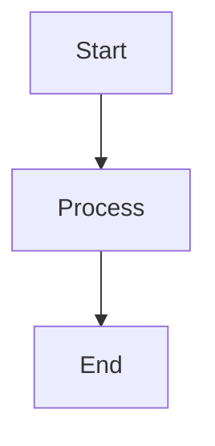
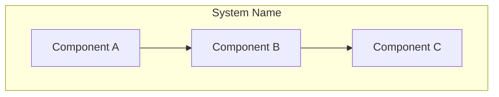
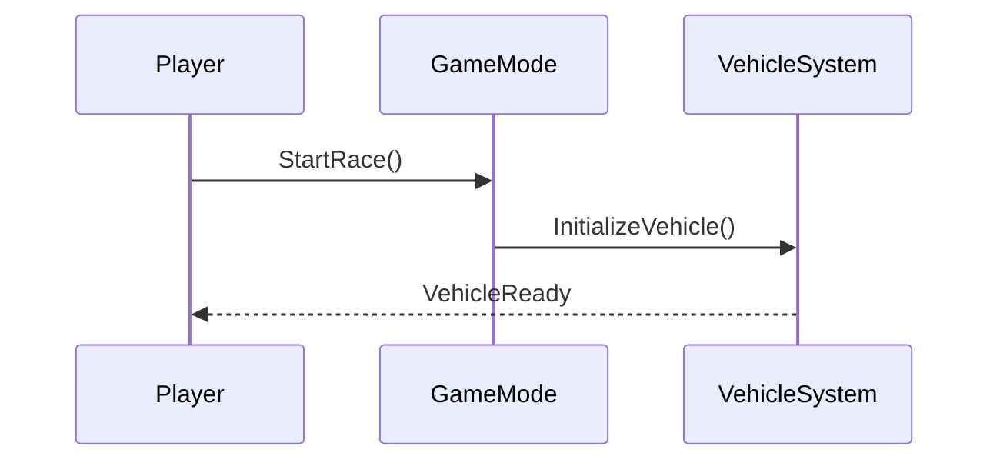
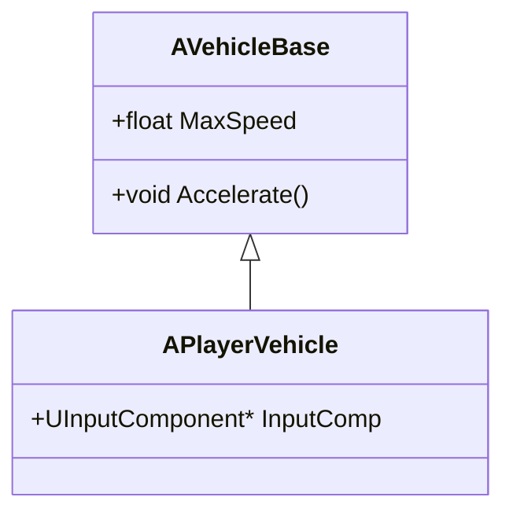

# Documentation Standards - VNRacing

**Project**: VNRacing - Mobile Racing Game  
**Document**: Documentation Standards and Guidelines  
**Version**: 1.0.0  
**Date**: 2026-01-20  
**Status**: Official Standard

---

## Table of Contents

- [Overview](#overview)
- [Documentation Structure Standards](#documentation-structure-standards)
- [Terminology Standards](#terminology-standards)
- [Formatting Standards](#formatting-standards)
- [Visual Standards](#visual-standards)
- [Version Control Standards](#version-control-standards)
- [Cross-Reference Standards](#cross-reference-standards)
- [Quality Assurance Standards](#quality-assurance-standards)
- [Tools and Resources](#tools-and-resources)
- [Language Professionalization Standards](#language-professionalization-standards)
- [Conclusion](#conclusion)
- [Related Standards](#related-standards)

---

## Overview

This document establishes formatting guidelines, terminology standards, and structural conventions for all VNRacing documentation to ensure consistency, clarity, and professional quality across the entire documentation suite.

## Documentation Structure Standards

### Document Phase Organization

All project documentation follows a **5-phase structure** located in `Docs/_templates/`:

1. **Requirements** (`requirements/`) - Problem understanding and requirements gathering
2. **Design** (`design/`) - System architecture and technical design
3. **Planning** (`planning/`) - Task breakdown and project planning
4. **Implementation** (`implementation/`) - Development notes and knowledge capture
5. **Testing** (`testing/`) - Test plans and verification strategies

**⚠️ Important**: The **monitoring phase has been removed** from the template structure. Do not create monitoring documentation.

### YAML Frontmatter (Required for Phase Documents)

All phase documents must include YAML frontmatter:

```markdown
---
phase: requirements|design|planning|implementation|testing
title: Brief descriptive title
description: One-line description of the document purpose
---
```

### Standard Header Format

All documents must use this standardized header format:

```markdown
# [Document Title] - [System/Component Name]

**Project**: PrototypeRacing - Mobile Racing Game
**Document**: [Document Type and Specific Name]
**Version**: [Major.Minor.Patch]
**Date**: YYYY-MM-DD
**Status**: [Draft | Review | Complete | Deprecated]
```

### Section Hierarchy

Use consistent markdown hierarchy:
- `#` - Document Title
- `##` - Main Sections
- `###` - Subsections
- `####` - Detail Sections
- `#####` - Minor Details
- `######` - Specific Items

### Table of Contents

For documents longer than 100 lines, include a table of contents after the header.

## Terminology Standards

### Core Game Terms

| Term | Definition | Usage Guidelines |
|------|------------|------------------|
| **Car Rating (CR)** | Vehicle performance rating system | Use CR abbreviation after first mention |
| **Track** | Individual race track | Lowercase unless proper name |
| **Customization** | Vehicle modification system | Use full term, no abbreviation |
| **Performance** | Vehicle performance characteristics | Distinguish from "visual" customization |

### Technical Terms

| Term | Definition | Usage Guidelines |
|------|------------|------------------|
| **Mobile-First** | Design approach prioritizing mobile platform | Use when discussing optimization strategy |
| **Cross-Platform** | Multi-platform support (Android, iOS, PC) | Specify supported platforms when relevant |
| **Asset Streaming** | On-demand asset loading | Use for memory optimization discussions |
| **Cultural Integration** | Cultural elements in gameplay | Use for culturally-themed content and features |
| **System Integration** | How different game systems interact | Use for architecture and technical discussions |

## Formatting Standards

### Code Blocks

Use appropriate language syntax highlighting:

**C++ Examples**:
```cpp
// C++ code examples with proper syntax highlighting
UCLASS(BlueprintType)
class PROTOTYPERACING_API UCustomizationSystem : public UObject
{
    GENERATED_BODY()

public:
    UFUNCTION(BlueprintCallable, Category = "Customization")
    void ApplyCustomization(const FCustomizationData& Data);

private:
    UPROPERTY()
    TObjectPtr<UVehicleComponent> VehicleComponent;
};
```

**Mermaid Diagrams**:


**Blueprint/JSON Examples**:
```json
{
  "vehicleType": "sedan",
  "performanceRating": 85,
  "customizations": []
}
```

### Tables
Use consistent table formatting:

| Column 1 | Column 2 | Column 3 |
|----------|----------|----------|
| Data 1   | Data 2   | Data 3   |
| Data 4   | Data 5   | Data 6   |

### Lists

**Unordered Lists**:
- Use hyphens (-) for primary level
  - Use spaces and hyphens for sub-levels
    - Maximum 3 levels deep recommended

**Ordered Lists**:
1. Use numbers for sequential items
2. Use consistent numbering format
3. Restart numbering for new sections

**Task Lists** (for planning/implementation docs):
- [ ] Incomplete task
- [x] Completed task
- [/] In-progress task

### Emphasis

- **Bold** for important terms and concepts
- *Italic* for emphasis and foreign terms
- `Code` for technical terms, file names, and class names
- **Vietnamese terms** should be bold on first mention
- ~~Strikethrough~~ for deprecated features

### Code Comments

**Standard Practice**:
```cpp
// English comments for technical implementation
void CalculatePerformance()
{
    // Calculate base performance rating
    float BaseRating = CalculateBaseRating();

    // Vietnamese comments for cultural elements when relevant
    float CulturalBonus = 0.0f; // Bonus văn hóa Việt Nam (Cultural bonus)

    return BaseRating + CulturalBonus;
}
```

**Doxygen-Style Documentation** (see code-standards.md for full details):
```cpp
/**
 * @brief Calculates vehicle performance rating
 *
 * @param BaseStats Vehicle base statistics
 * @param Modifications Applied modifications
 * @return Performance rating (0-100)
 */
float CalculatePerformanceRating(
    const FVehicleStats& BaseStats,
    const TArray<FModification>& Modifications
);
```

## Visual Standards

### Diagrams

**Use Mermaid for all system diagrams** (required for design phase docs):

**Architecture Diagrams**:


**Sequence Diagrams**:


**Class Diagrams**:


### Screenshots and Images

- **High resolution** (minimum 1920x1080 for desktop, appropriate mobile resolutions)
- **Consistent UI theme** across all screenshots
- **Annotations** in English with Vietnamese translations where relevant
- **File naming**: `[System]_[Feature]_[Description].png`
- **Location**: Store in `Docs/images/` or feature-specific subdirectories

## Version Control Standards

### Change Tracking

Include change log section for documents with multiple versions:

```markdown
## Change Log

### Version 1.0.0 (2025-11-12)
- Aligned with Docs/_templates structure (5 phases)
- Removed monitoring phase
- Added YAML frontmatter requirements

### Version 0.0.2 (2025-09-07)
- Updated system integration diagrams
- Standardized terminology usage
- Improved cultural integration guidelines

### Version 0.0.1 (2025-09-06)
- Major restructuring of document organization
- Added mobile optimization guidelines
- Integrated VN-Tour system specifications
```

## Cross-Reference Standards

### Internal References

- Use relative paths for internal document links
- Format: `[Document Name](../phase/document-name.md)`
- Include section anchors: `[Section Name](document-name.md#section-anchor)`

**Examples**:
```markdown
See [Requirements](../requirements/feature-vn-tour.md) for details.
Refer to [Design Overview](../design/feature-vn-tour.md#architecture-overview).
Check [Code Standards](../_standards/code-standards.md) for naming conventions.
```

### External References

- Include full URLs for external resources
- Use descriptive link text, not raw URLs
- Verify links are accessible and current
- Reference Epic documentation when applicable

**Examples**:
```markdown
See [Epic C++ Coding Standard](https://dev.epicgames.com/documentation/en-us/unreal-engine/epic-cplusplus-coding-standard-for-unreal-engine)
Refer to [Unreal Engine 5 Documentation](https://docs.unrealengine.com/5.0/en-US/)
```

## Quality Assurance Standards

### Review Process

Before publishing any document, complete this review:

1. **Technical Accuracy**: Verify all technical specifications and code examples
2. **Cultural Sensitivity**: Ensure respectful representation of any cultural elements
3. **Consistency Check**: Confirm terminology and formatting standards
4. **Cross-Reference Validation**: Verify all internal links work correctly
5. **Mobile Compatibility**: Ensure all features work on mobile platforms
6. **Template Compliance**: Verify document follows phase template structure
7. **YAML Frontmatter**: Check phase documents have correct frontmatter

### Maintenance Schedule

- **Weekly**: Review active feature documentation for updates
- **Monthly**: Review for outdated content and broken links
- **Quarterly**: Comprehensive consistency and accuracy review
- **With Feature Updates**: Update related documentation immediately
- **Annual**: Complete documentation suite review and standardization

### Documentation Phases Checklist

For each feature, ensure all 5 phases are documented:

- [ ] **Requirements**: Problem statement, goals, success criteria defined
- [ ] **Design**: Architecture diagrams, data models, API design complete
- [ ] **Planning**: Tasks broken down, dependencies identified, timeline estimated
- [ ] **Implementation**: Development notes, knowledge captured, decisions documented
- [ ] **Testing**: Test plans written, coverage targets defined, verification complete

**⚠️ Note**: Monitoring phase has been removed from template structure.

## Tools and Resources

### Recommended Tools

- **Markdown Editor**: Visual Studio Code with Markdown All in One extension
- **Diagram Creation**: Mermaid Live Editor (https://mermaid.live) for diagram creation

### Style Resources

- **Epic C++ Coding Standard**: https://dev.epicgames.com/documentation/en-us/unreal-engine/epic-cplusplus-coding-standard-for-unreal-engine
- **Unreal Engine Documentation**: https://docs.unrealengine.com/5.0/en-US/
- **Technical Writing**: Follow established technical writing best practices
- **Mobile Gaming Standards**: Reference mobile gaming industry standards

### Template References

All phase templates are located in `Docs/_templates/`:
- `requirements/README.md` - Requirements template
- `design/README.md` - Design template
- `planning/README.md` - Planning template
- `implementation/README.md` - Implementation template
- `testing/README.md` - Testing template

---

## Language Professionalization Standards

### Overview

All documentation must maintain professional language quality. This section defines standards for eliminating informal expressions and ensuring consistent terminology.

**Reference**: See [Terminology Glossary](./terminology-glossary.md) for complete term mappings.

### Key Principles

1. **No Informal Language**: Avoid casual Vietnamese expressions
2. **Consistent Terminology**: Use standardized technical terms
3. **Professional Placeholders**: Use [PENDING] format for incomplete content
4. **Standard Approximations**: Use "approximately" or "≈" instead of "~"

### Informal Language Patterns to Avoid

| Pattern Type | Example (❌) | Replacement (✅) |
|--------------|--------------|------------------|
| Casual Vietnamese | "húc văng", "đập hộp" | "đẩy ra", "mở hộp quà" |
| Informal approximation | "~50%", "khoảng 3 giây" | "approximately 50%", "≈3s" |
| Incomplete placeholders | "TBD", "sẽ bổ sung sau..." | [PENDING] block format |
| Inconsistent terms | "rubberband", "A.I" | "Rubber Banding", "AI" |

### Placeholder Format

When content is incomplete, use this standardized format:

```markdown
> **[PENDING]** Description of pending content.
> **Owner**: [Team/Role]
> **Target Date**: [Date or TBD]
```

### Validation

Run the validation script to check for informal language:

```powershell
# Validate all docs
.\scripts\validate-doc-language.ps1

# Validate specific folder
.\scripts\validate-doc-language.ps1 -Path "Docs/features/car-physics"

# Generate report
.\scripts\validate-doc-language.ps1 -OutputFile "validation-report.txt"
```

### Related Resources

- [Terminology Glossary](./terminology-glossary.md) - Complete term mappings
- [Validation Script](../../scripts/validate-doc-language.ps1) - Automated checking

## Conclusion

Documentation standards have been **fully standardized** to ensure:

- **Template Alignment**: 100% compliance with 5-phase structure (requirements, design, planning, implementation, testing)
- **No Monitoring Phase**: Removed from template structure as per project decision
- **Professional Quality**: Consistent formatting, terminology, and structure
- **Cultural Sensitivity**: Respectful representation of cultural elements when applicable
- **Technical Accuracy**: Aligned with Epic C++ Coding Standard and UE5 best practices
- **Team Collaboration**: Clear, consistent, and comprehensive documentation

Adherence to these standards is **mandatory** for all project documentation to maintain high quality and professional standards.

---

## Related Standards

- [Code Standards](code-standards.md) - C++ and Blueprint coding standards
- [Naming Conventions](naming-conventions.md) - Asset and code naming conventions
- [Asset Organization](asset-organization.md) - Asset folder structure and organization
