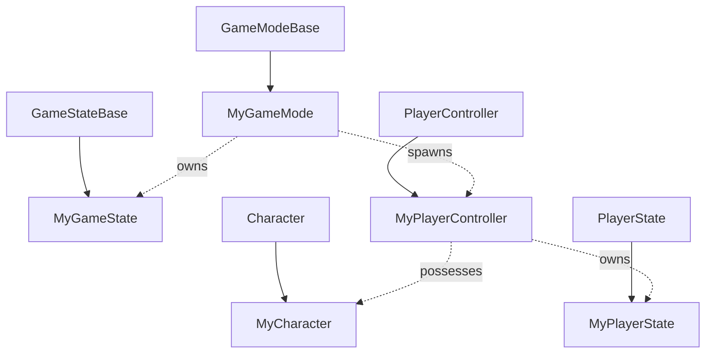
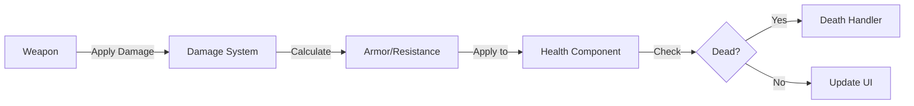

# System Design & Architecture

## Architecture Overview
**What is the high-level system structure?**

- Include a mermaid diagram that captures the main components and their relationships. Example:
  ```mermaid
  graph TD
    Client -->|HTTPS| API
    API --> ServiceA
    API --> ServiceB
    ServiceA --> Database[(DB)]
  ```
- Key components and their responsibilities
- Technology stack choices and rationale

## Data Models
**What data do we need to manage?**

- Core entities and their relationships
- Data schemas/structures
- Data flow between components

## API Design
**How do components communicate?**

- External APIs (if applicable)
- Internal interfaces
- Request/response formats
- Authentication/authorization approach

## Component Breakdown
**What are the major building blocks?**

- Frontend components (if applicable)
- Backend services/modules
- Database/storage layer
- Third-party integrations

## Design Decisions
**Why did we choose this approach?**

- Key architectural decisions and trade-offs
- Alternatives considered
- Patterns and principles applied

## Non-Functional Requirements
**How should the system perform?**

- Performance targets
- Scalability considerations
- Security requirements
- Reliability/availability needs

---

# Unreal Engine Architecture & Design

## Game Framework Architecture

### Core Game Classes

#### GameMode
**Purpose**: Defines game rules, win/loss conditions, and manages game state
**Implementation**: [Blueprint or C++]

```cpp
// Example C++ GameMode structure
class AMyGameMode : public AGameModeBase
{
    // Game rules
    // Player spawning logic
    // Match state management
};
```

**Key Responsibilities**:
- Player spawning and respawning
- Match flow (start, pause, end)
- Win/loss condition checking
- Score tracking

#### GameState
**Purpose**: Stores replicated game state accessible to all clients
**Implementation**: [Blueprint or C++]

**Replicated Data**:
- Match time remaining
- Team scores
- Game phase/state
- Global game settings

#### PlayerController
**Purpose**: Handles player input and client-side logic
**Implementation**: [Blueprint or C++]

**Key Responsibilities**:
- Input processing
- Camera management
- UI interaction
- Client-server communication

#### PlayerState
**Purpose**: Stores replicated player-specific data
**Implementation**: [Blueprint or C++]

**Replicated Data**:
- Player name
- Score/stats
- Team assignment
- Player status

#### Pawn/Character
**Purpose**: Physical representation of the player in the world
**Implementation**: [Blueprint or C++]

**Key Components**:
- Movement Component
- Mesh Component
- Collision
- Abilities/Actions

### Class Hierarchy Diagram



## Blueprint vs C++ Decision Matrix

| System/Feature | Implementation | Rationale |
|----------------|---------------|-----------|
| GameMode | C++ | Core logic, performance critical |
| GameState | C++ | Replication, data integrity |
| PlayerController | C++ | Input handling, performance |
| Character Movement | C++ | Performance critical |
| Weapon System | C++ | Complex logic, replication |
| UI Widgets | Blueprint | Rapid iteration, designer-friendly |
| Level Mechanics | Blueprint | Level-specific, easy to modify |
| Pickups/Items | Blueprint | Simple logic, many variants |
| AI Behavior Trees | Blueprint | Visual editing, iteration |
| Animation Blueprints | Blueprint | Visual state machines |

## System Architecture

### Movement System
**Type**: [Custom / Enhanced Input / Default]
**Components**:
- Character Movement Component
- Input handling
- Animation integration

**Key Features**:
- Walking/Running
- Jumping
- Crouching
- [Other movement modes]

### Combat System (if applicable)
**Architecture**: [Component-based / Actor-based]

**Components**:
- Weapon Component
- Health Component
- Damage System
- Hit Detection

**Damage Flow**:


### Inventory System (if applicable)
**Type**: [Slot-based / Weight-based / Hybrid]
**Implementation**: [C++ Core + Blueprint UI]

**Features**:
- Item pickup
- Item storage
- Item usage
- Item dropping

### Save System
**Type**: [SaveGame / Cloud Save / Both]
**Data to Save**:
- Player progress
- Inventory state
- Game settings
- Statistics

## Content Organization

### Folder Structure
```
Content/
├── Blueprints/
│   ├── Characters/
│   │   ├── Player/
│   │   │   ├── BP_PlayerCharacter
│   │   │   └── BP_PlayerController
│   │   └── NPCs/
│   ├── GameModes/
│   │   ├── BP_GameMode
│   │   └── BP_GameState
│   ├── Weapons/
│   ├── Items/
│   └── UI/
├── Materials/
│   ├── Characters/
│   ├── Environment/
│   └── VFX/
├── Meshes/
│   ├── Characters/
│   ├── Environment/
│   └── Weapons/
├── Textures/
│   ├── Characters/
│   ├── Environment/
│   └── UI/
├── Animations/
│   ├── Player/
│   └── NPCs/
├── VFX/
│   ├── Niagara/
│   └── Materials/
├── Audio/
│   ├── Music/
│   ├── SFX/
│   └── Voice/
├── UI/
│   ├── Widgets/
│   ├── Textures/
│   └── Fonts/
└── Maps/
    ├── Levels/
    ├── Sublevels/
    └── Persistent/
```

### Naming Conventions

#### Blueprints
- `BP_[Name]` - Blueprint classes
- `BPI_[Name]` - Blueprint Interfaces
- `BPF_[Name]` - Blueprint Function Libraries
- `E_[Name]` - Enumerations
- `S_[Name]` - Structures

#### Assets
- `T_[Name]` - Textures
- `M_[Name]` - Materials
- `MI_[Name]` - Material Instances
- `SM_[Name]` - Static Meshes
- `SK_[Name]` - Skeletal Meshes
- `A_[Name]` - Animations
- `AM_[Name]` - Animation Montages
- `ABP_[Name]` - Animation Blueprints
- `NS_[Name]` - Niagara Systems
- `WBP_[Name]` - Widget Blueprints

## Performance Considerations

### Optimization Strategy
- **Tick Optimization**: Minimize actors using Tick, use Timers instead
- **Object Pooling**: Pool frequently spawned/destroyed actors
- **LOD System**: Configure LODs for meshes and materials
- **Culling**: Use proper bounds and occlusion culling
- **Lighting**: Baked lighting where possible, dynamic where needed

### Memory Management
- **Asset Streaming**: Use level streaming for large worlds
- **Texture Streaming**: Configure texture streaming pool
- **Garbage Collection**: Proper object lifecycle management
- **Asset References**: Use soft references for large assets

### Blueprint Performance
- **Nativization**: Consider nativizing critical Blueprints
- **Pure Functions**: Use pure functions where possible
- **Event-Driven**: Prefer events over Tick
- **Macro vs Function**: Use macros for simple operations

## Multiplayer Architecture (if applicable)

### Network Topology
- **Type**: [Dedicated Server / P2P]
- **Max Players**: [Number]
- **Tick Rate**: [e.g., 30Hz, 60Hz]

### Replication Strategy

#### Replicated Actors
| Actor Type | Replication | Frequency | Relevancy |
|------------|-------------|-----------|-----------|
| Character | Full | High | Distance-based |
| Projectile | Movement only | Medium | Always relevant |
| Pickup | State only | Low | Distance-based |

#### RPCs (Remote Procedure Calls)
- **Server RPCs**: Client → Server (input, actions)
- **Client RPCs**: Server → Client (effects, feedback)
- **Multicast RPCs**: Server → All Clients (events)

### Client Prediction
- Movement prediction
- Ability activation
- Hit detection

## UI/UX Architecture

### Widget Hierarchy
```
Main HUD (WBP_MainHUD)
├── Health Bar (WBP_HealthBar)
├── Ammo Counter (WBP_AmmoCounter)
├── Minimap (WBP_Minimap)
└── Crosshair (WBP_Crosshair)

Menu System (WBP_MainMenu)
├── Start Menu
├── Settings Menu
├── Pause Menu
└── Game Over Screen
```

### UI Communication
- **Event-Driven**: Use Event Dispatchers
- **Data Binding**: Bind UI to game state
- **MVC Pattern**: Separate UI logic from game logic

## Plugin Architecture

### Required Plugins
- [ ] [Plugin Name]: [Purpose]
- [ ] Enhanced Input: Modern input system
- [ ] [Other plugins]

### Custom Plugins
- [ ] [Plugin Name]: [Purpose and architecture]

## Testing Strategy

### Unit Testing
- C++ unit tests for core systems
- Blueprint function testing

### Integration Testing
- System interaction testing
- Multiplayer testing (if applicable)

### Performance Testing
- Frame rate profiling
- Memory profiling
- Network profiling (if multiplayer)

