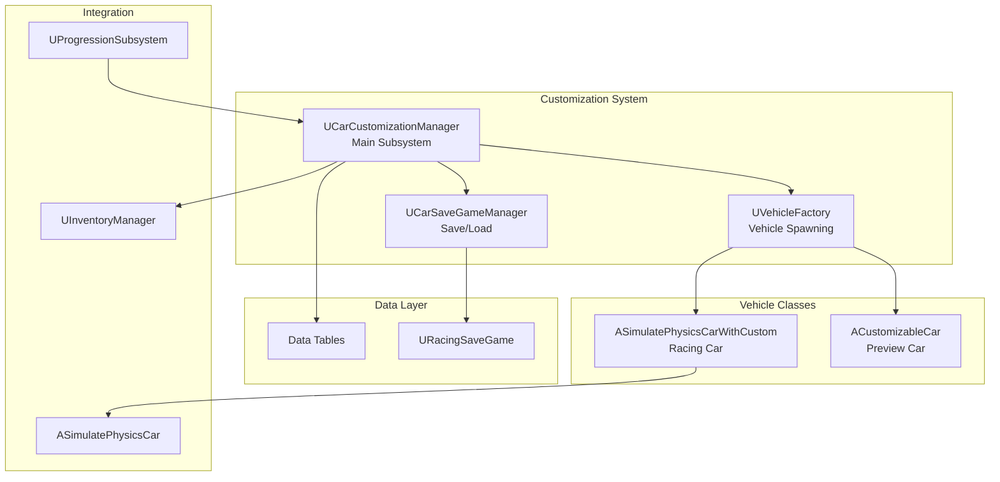

# Car Customization Feature

**Breadcrumbs:** [Docs](../../../) > [Features](../) > Car Customization

**Feature ID**: `car-customization`
**Status**: 🔄 Development
**Priority**: High
**Owner**: Customization Team
**Version**: 1.1.0
**Date**: 2026-01-26


## Overview

Hệ thống Car Customization cho phép người chơi tùy chỉnh xe cả về mặt hình ảnh và hiệu năng. Hệ thống hỗ trợ multi-vehicle garage, cho phép player sở hữu và customize nhiều xe khác nhau.

### Key Capabilities

- **Visual Customization**: Body parts (Front Bumper, Rear Bumper, Side Board, Spoiler, Wheels, Roof)
- **Color Customization**: Body và Wheel colors với nhiều material types (Glossy, Matte, Metallic, Chameleon, Pearlescent)
- **Performance Upgrades**: 4 stat categories (Speed, Acceleration, Grips, Nitrous) với multiple upgrade levels
- **Style Packages**: Quick transformation với coordinated part sets
- **Decal System**: Car-type specific decals
- **Multi-Vehicle Garage**: Sở hữu và quản lý nhiều xe (merged from V2)
- **Vehicle Type System**: ECarType enum với 6 types (Basic, Super, Sport, Sedan, Suv, Electric)
- **Inventory Integration**: Parts chỉ available nếu player owns trong inventory

> **📝 Migration Note (2026-01-20)**: This documentation consolidates all content from the previous `car-customization-v2/` folder. The V2 enhancements (multi-vehicle garage architecture, vehicle type system, enhanced save/load functionality) have been fully integrated into the main car-customization feature. The separate V2 folder has been removed to maintain a single source of truth. All cross-references have been updated to point to this unified documentation.


## Feature Structure

```
car-customization/
├── requirements/       # User stories, acceptance criteria
│   ├── README.md
│   ├── GDD-Car-Customization.md
│   └── GDD-Car-Performance.md
├── design/            # Architecture, data models, TDD (merged)
│   ├── README.md      # Technical Design Document (synced with code)
├── planning/          # Implementation roadmap
│   ├── README.md
│   └── detailed-plan.md
├── implementation/    # Code examples, best practices
│   └── README.md
└── testing/           # Test cases, validation
    └── README.md
```

---

## Core Components

### UCarCustomizationManager

Main subsystem quản lý toàn bộ customization state và operations.

```cpp
// Source: CarCustomizationSystem/CarCustomizationManager.h

UCLASS()
class UCarCustomizationManager : public UGameInstanceSubsystem, public ICarDataProvider
{
public:
    // Garage - tất cả car configurations của player
    UPROPERTY(BlueprintReadWrite)
    TMap<FString, FCarConfiguration> ProfileCarConfigurations;

    // Current active configuration
    UPROPERTY(BlueprintReadWrite)
    FCarConfiguration CarConfiguration;

    // Preview configuration (khi đang customize)
    UPROPERTY(BlueprintReadWrite)
    FCarConfiguration PreviewCarConfiguration;

    // Configuration management
    UFUNCTION(BlueprintCallable)
    void InitializeCarConfiguration(FName BaseCarID);
    
    UFUNCTION(BlueprintCallable)
    FCarConfiguration GetCarConfiguration() const;
    
    UFUNCTION(BlueprintCallable)
    void UpdateCarConfiguration(const FCarConfiguration& NewConfig);

    // Garage management
    UFUNCTION(BlueprintCallable)
    void ChangeCarConfigByCarID(FName CarID);
    
    UFUNCTION(BlueprintCallable)
    void ChangeToNextPreviousCarConfig(bool bNext);
    
    UFUNCTION(BlueprintCallable)
    void AddNewCarConfiguration(FName CarID);
    
    UFUNCTION(BlueprintCallable)
    void RemoveCarConfiguration(FName CarID);

    // Customization application
    UFUNCTION(BlueprintCallable)
    void ApplyCarPart(ECarPartSlot Slot, FName PartID);
    
    UFUNCTION(BlueprintCallable)
    void ApplyCarColor(ECarColorSlot Slot, FLinearColor Color);
    
    UFUNCTION(BlueprintCallable)
    void ApplyCarMaterials(ECarColorSlot Slot, FName MaterialID);
    
    UFUNCTION(BlueprintCallable)
    void ApplyStyle(FName StyleID);
    
    UFUNCTION(BlueprintCallable)
    void ApplyDecal(FName DecalID);

    // Performance
    UFUNCTION(BlueprintCallable)
    void UpgradePerformanceStat(EPerformanceStatType StatType, int32 Level);
    
    UFUNCTION(BlueprintCallable)
    FPerformanceStats CalculatePerformanceStats(FCarConfiguration Config) const;
    
    UFUNCTION(BlueprintCallable)
    FInGamePerformanceStats GetInGamePerformanceStats(FCarConfiguration Config) const;
};
```

---

## Data Structures

### FCarConfiguration

```cpp
// Cấu hình xe của player
USTRUCT(BlueprintType)
struct FCarConfiguration
{
    UPROPERTY(BlueprintReadWrite)
    FName BaseCarID;                                    // ID của base car

    UPROPERTY(BlueprintReadWrite)
    FName AppliedStyleID;                               // Style đã apply

    UPROPERTY(BlueprintReadWrite)
    TMap<ECarPartSlot, FName> CustomParts;              // Parts cho từng slot

    UPROPERTY(BlueprintReadWrite)
    TMap<ECarColorSlot, FLinearColor> CustomColors;     // Màu cho từng slot

    UPROPERTY(BlueprintReadWrite)
    TMap<ECarColorSlot, FName> CustomMaterials;         // Material cho từng slot

    UPROPERTY(BlueprintReadWrite)
    FName AppliedDecalID;                               // Decal đã apply

    UPROPERTY(BlueprintReadWrite)
    TMap<EPerformanceStatType, int32> BasePerformanceStateLevel;  // Upgrade levels

    UPROPERTY(BlueprintReadWrite)
    ECarType CarType;                                   // Loại xe

    UPROPERTY(BlueprintReadWrite)
    bool bIsCurrentConfig;                              // Đang active?
};
```

### Enumerations

```cpp
// Loại xe
enum class ECarType : uint8
{
    None, Basic, Super, Sport, Sedan, Suv, Electric
};

// Vị trí part
enum class ECarPartSlot : uint8
{
    FrontBumper, RearBumper, SideBoard, Spoiler, Wheels, Roof
};

// Vị trí màu
enum class ECarColorSlot : uint8
{
    Body, Wheels
};

// Loại material sơn
enum class ECarPaintMaterialType : uint8
{
    Glossy, Matte, Metallic, Chameleon, Pearlescent
};

// Stat có thể upgrade
enum class EPerformanceStatType : uint8
{
    Speed, Acceleration, Grips, Nitrous
};
```

---

## Customization Categories

### 1. Visual Customization

#### Part Slots
| Slot | Description |
|------|-------------|
| FrontBumper | Dè trước |
| RearBumper | Dè sau |
| SideBoard | Dè ngang |
| Spoiler | Cánh đuôi |
| Wheels | Mâm bánh xe |
| Roof | Nóc xe |

#### Color Slots
| Slot | Description |
|------|-------------|
| Body | Màu thân xe |
| Wheels | Màu mâm xe |

#### Material Types
- **Glossy**: Bóng láng
- **Matte**: Mờ
- **Metallic**: Ánh kim
- **Chameleon**: Đổi màu
- **Pearlescent**: Ngọc trai

### 2. Performance Tuning

#### Upgradeable Stats
| Stat | Affects |
|------|---------|
| Speed | TopSpeed |
| Acceleration | Acceleration, ThrottlePercentUponDriftFast |
| Grips | TurnAngle, SteerSpeed, DriftLateral |
| Nitrous | NitroBoostForce, NitroDuration, NitroFillRates |

#### Upgrade Formula
```
Cost = BasePrice × CarScaling^CarScaleNumber × NextLevel^LevelScale

Default values:
- BasePrice = 200
- CarScaling = 1.5
- LevelScale = 2
```

---

## Architecture Overview



---

## Data Tables

| Data Table | Row Struct | Purpose |
|------------|------------|---------|
| DT_BaseCars | FBaseCarDefinition | Base car definitions |
| DT_CarParts | FCarPartDefinition | Available parts |
| DT_CarStyles | FCarStyleDefinition | Style packages |
| DT_CarColors | FCarColorDefinition | Color options |
| DT_CarDecals | FCarDecalDefinition | Decal options |
| DT_CarMaterials | FCarMaterialDefinition | Paint materials |
| DT_PerformanceStatLevel | FInGamePerformanceStatLevel | Upgrade levels |

---

## Integration

### Inventory System
Parts chỉ available nếu player owns trong inventory:
```cpp
// GetCarPartsByCarSlot filters by inventory ownership
for (const FCarPartDefinition* PartPtr : AllParts)
{
    if (InventoryManager->HasItem(PartPtr->PartID.ToString(), 1))
    {
        CarPartDefinitions.Add(*PartPtr);
    }
}
```

### Physics System
VehicleFactory spawn đúng class và apply configuration:
```cpp
ASimulatePhysicsCarWithCustom* CreateRacingCar(...)
{
    UClass* CarClass = CarDef->RacingClass.Get();
    auto* Car = World->SpawnActor<ASimulatePhysicsCarWithCustom>(CarClass, ...);
    Car->ConfigCar(*CarDef, CarConfiguration);
    return Car;
}
```

### Save System
Multi-vehicle garage được save/load qua UCarSaveGameManager:
```cpp
// Save
SaveCarConfig(SaveName, Currency, ProfileCarConfigurations, UserIndex);

// Load
LoadCarConfig(SaveName, OutCurrency, OutPlayerGarage, UserIndex);
```

---

## Events

| Event | Description |
|-------|-------------|
| OnCarConfigurationChanged | Khi configuration thay đổi |
| OnNewCarConfigurationSwitched | Khi switch sang xe khác |
| OnCarConfigurationInitialized | Khi khởi tạo xong |
| OnCarConfigurationSavedSuccess | Save thành công |
| OnCarConfigurationSavedFailed | Save thất bại |
| OnPerformanceStatUpgraded | Upgrade stat thành công |
| OnPerformanceStatUpgradeFailed | Upgrade thất bại |

---

## Source Files

| File | Location |
|------|----------|
| CarDataProvider.h | `Public/CarCustomizationSystem/` |
| CarCustomizationManager.h/cpp | `Public/CarCustomizationSystem/`, `Private/CarCustomizationSystem/` |
| CarSaveGameManager.h/cpp | `Public/CarCustomizationSystem/`, `Private/CarCustomizationSystem/` |
| RacingSaveGame.h/cpp | `Public/CarCustomizationSystem/`, `Private/CarCustomizationSystem/` |
| CustomizableCar.h/cpp | `Public/CarCustomizationSystem/`, `Private/CarCustomizationSystem/` |
| VehicleFactory.h/cpp | `Public/`, `Private/` |
| SimulatePhysicsCarWithCustom.h/cpp | `Public/`, `Private/` |

---

## Related Features

- [Car Physics](../car-physics/README.md) - Physics integration
- [Profiles & Inventory](../profiles-inventory/README.md) - Item ownership
- [Progression System](../progression-system/README.md) - Unlock system
- [Shop System](../shop-system/README.md) - Purchase items

---

## Quick Links

- [Technical Design Document](design/README.md) - Detailed technical spec (merged TDD)
- [Requirements](requirements/README.md) - User stories
- [Testing Strategy](testing/README.md) - Test cases

---

---

## Implementation Status

> **Last synced with source code: 2026-01-26**

### ✅ Implemented Features

**Part Slots (ECarPartSlot)**:
- Body, Spoiler, Wheels, Bumper, SideSkirt, Mirrors, Roof, Fender, Grille, Headlights, Taillights, ExhaustTips, Diffuser, Splitter, WindowTint, Decals, LicensePlate, InteriorTrim, SteeringWheel, Seats

**Color Slots (ECarColorSlot)**:
- Body, Wheels, Interior, Decals, Neon

### ⏳ Planned - Not Yet Implemented

| Feature | Category | Notes |
|---------|----------|-------|
| Exhaust | Part Slot | Not in ECarPartSlot enum |
| Hood | Part Slot | Not in ECarPartSlot enum |
| Calipers | Color Slot | Commented out in ECarColorSlot enum |

---

**Last Updated**: 2026-01-26
**Synced With**: Source code in `PrototypeRacing/Source/PrototypeRacing/`
**Version**: 1.0.1
