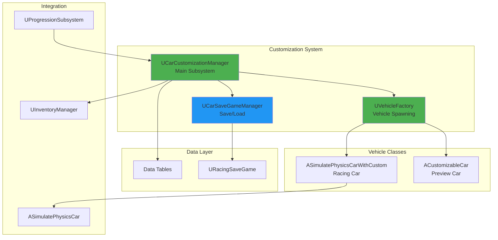
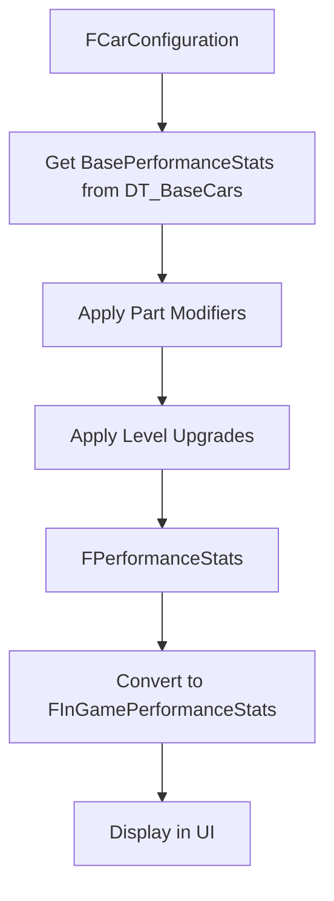

# Car Customization - Technical Design Document

**Breadcrumbs:** [Docs](../../../../) > [Features](../../../) > [Car Customization](../) > Design

**Feature ID**: `car-customization`
**Status**: 🔄 Development
**Version**: 1.1.0
**Date**: 2026-01-26

---

## Executive Summary

Tài liệu này mô tả kiến trúc kỹ thuật của hệ thống Car Customization, được đồng bộ hoàn toàn với code implementation thực tế trong `PrototypeRacing/Source/PrototypeRacing/`.

**Core Components:**
- `UCarCustomizationManager` - Main subsystem quản lý customization (UGameInstanceSubsystem)
- `ICarDataProvider` - Interface cung cấp data
- `UVehicleFactory` - Factory spawn vehicles
- `UCarSaveGameManager` - Quản lý save/load (UGameInstanceSubsystem)
- `ASimulatePhysicsCarWithCustom` - Racing car với customization
- `ACustomizableCar` - Preview car trong garage

---

## Architecture Overview




---

## Part 1: Core Data Structures

### 1.1. Enumerations

```cpp
// Source: CarDataProvider.h

// Loại xe - hỗ trợ multi-vehicle system
UENUM(BlueprintType)
enum class ECarType : uint8
{
    None     UMETA(DisplayName = "None"),
    Basic    UMETA(DisplayName = "Basic Car"),
    Super    UMETA(DisplayName = "Super Car"),
    Sport    UMETA(DisplayName = "Sport"),
    Sedan    UMETA(DisplayName = "Sedan"),
    Suv      UMETA(DisplayName = "SUV"),
    Electric UMETA(DisplayName = "Electric")
};

// Style của part
UENUM(BlueprintType)
enum class ECarPartStyle : uint8
{
    None   UMETA(DisplayName = "None"),
    Basic  UMETA(DisplayName = "Basic"),
    Sport  UMETA(DisplayName = "Sport"),
    Luxury UMETA(DisplayName = "Luxury"),
};

// Loại stat performance có thể upgrade
UENUM(BlueprintType)
enum class EPerformanceStatType : uint8
{
    Speed        UMETA(DisplayName="Speed"),
    Acceleration UMETA(DisplayName="Acceleration"),
    Grips        UMETA(DisplayName="Grips"),
    Nitrous      UMETA(DisplayName="Nitrous")
};

// Level upgrade performance
UENUM(BlueprintType)
enum class EPerformanceStatLevel : uint8
{
    Level1, Level2, Level3, Level4, Level5, Level6, Max
};

// Loại vật liệu sơn xe
UENUM(BlueprintType)
enum class ECarPaintMaterialType : uint8
{
    Glossy      UMETA(DisplayName="Glossy"),
    Matte       UMETA(DisplayName="Matte"),
    Metallic    UMETA(DisplayName="Metallic"),
    Chameleon   UMETA(DisplayName="Chameleon"),
    Pearlescent UMETA(DisplayName="Pearlescent")
};

// Vị trí màu sắc trên xe
UENUM(BlueprintType)
enum class ECarColorSlot : uint8
{
    Body   UMETA(DisplayName="Body"),
    Wheels UMETA(DisplayName="Wheels"),
};

// Vị trí part trên xe
UENUM(BlueprintType)
enum class ECarPartSlot : uint8
{
    FrontBumper UMETA(DisplayName="Front Bumper"),
    RearBumper  UMETA(DisplayName="Rear Bumper"),
    SideBoard   UMETA(DisplayName="Side Board"),
    Spoiler     UMETA(DisplayName="Spoiler"),
    Wheels      UMETA(DisplayName="Wheels"),
    Roof        UMETA(DisplayName="Roof"),
};

// Lý do lỗi customize
UENUM(BlueprintType)
enum class ECarCustomizeFailReason : uint8
{
    None, InvalidDataTable, RowNotFound, AddExistedRow, NotCompatibleSlot
};

// Lý do lỗi upgrade
UENUM(BlueprintType)
enum class ECarUpgradeFailReason : uint8
{
    None, LackOfItem, LackOfCoin
};
```


### 1.2. Performance Structures

```cpp
// Source: CarDataProvider.h

// Performance modifiers - áp dụng từ parts và upgrades
USTRUCT(BlueprintType)
struct FPerformanceModifiers
{
    GENERATED_BODY()

    // Speed modifiers
    float TopSpeedModifier = 0.f;

    // Acceleration modifiers
    float AccelerationModifier = 0.f;
    float ThrottlePercentUponDriftFastModifier = 0.f;

    // Grip/Handling modifiers
    float TurnAngleModifier = 0.f;
    float SteerSpeedMinModifier = 0.f;
    float SteerSpeedMaxModifier = 0.f;
    float SlowSpeedModifier = 0.f;
    float FastSpeedModifier = 0.f;
    float DriftTurnFastLateralFrontModifier = 0.f;
    float DriftTurnFastLateralRearModifier = 0.f;

    // Nitro modifiers
    float NitroBoostForceModifier = 0.f;
    float NitroDurationModifier = 0.f;
    float NitroFulfillDurationModifier = 0.f;
    float NitroFollowFillRateModifier = 0.f;
    float NitroAirborneFillRateModifier = 0.f;
    float NitroDriftFillRateModifier = 0.f;
};

// Performance stats thực tế của xe
USTRUCT(BlueprintType)
struct FPerformanceStats
{
    GENERATED_BODY()

    // Speed
    float TopSpeed = 210.f;

    // Acceleration
    float Acceleration = 850.f;
    float ThrottlePercentUponDriftFast = 15.f;

    // Grip/Handling
    float TurnAngle = 40.f;
    float SteerSpeedMin = 120.f;
    float SteerSpeedMax = 210.f;
    float SlowSpeed = 40.f;
    float FastSpeed = 162.f;
    float DriftTurnFastLateralFront = 520.f;
    float DriftTurnFastLateralRear = 1100.f;

    // Nitro
    float NitroBoostForce = 30.f;
    float NitroDuration = 3.f;
    float NitroFulfillDuration = 33.f;
    float NitroFollowFillRate = 0.06f;
    float NitroAirborneFillRate = 0.06f;
    float NitroDriftFillRate = 0.06f;
};

// In-game performance stats (simplified for UI display)
USTRUCT(BlueprintType)
struct FInGamePerformanceStats
{
    GENERATED_BODY()

    float Speed = 0.f;
    float Acceleration = 0.f;
    float Grips = 0.f;
    float Nitrous = 0.f;
};
```


### 1.3. Car Configuration Structure

```cpp
// Source: CarDataProvider.h

// Cấu hình xe của player - lưu trữ tất cả customization
USTRUCT(BlueprintType)
struct FCarConfiguration
{
    GENERATED_BODY()

    // ID của base car
    UPROPERTY(EditAnywhere, BlueprintReadWrite, Category="Car|Config")
    FName BaseCarID;

    // ID của style đã apply
    UPROPERTY(EditAnywhere, BlueprintReadWrite, Category="Car|Config")
    FName AppliedStyleID;

    // Parts đã chọn cho từng slot
    UPROPERTY(EditAnywhere, BlueprintReadWrite, Category="Car|Config")
    TMap<ECarPartSlot, FName> CustomParts;

    // Màu sắc cho từng slot (sử dụng FLinearColor trực tiếp)
    UPROPERTY(EditAnywhere, BlueprintReadWrite, Category="Car|Config")
    TMap<ECarColorSlot, FLinearColor> CustomColors;

    // Material cho từng slot
    UPROPERTY(EditAnywhere, BlueprintReadWrite, Category="Car|Config")
    TMap<ECarColorSlot, FName> CustomMaterials;

    // ID của decal đã apply
    UPROPERTY(EditAnywhere, BlueprintReadWrite, Category="Car|Config")
    FName AppliedDecalID;

    // Level upgrade cho từng stat
    UPROPERTY(EditAnywhere, BlueprintReadWrite, Category="Car|Base")
    TMap<EPerformanceStatType, int32> BasePerformanceStateLevel;

    // Loại xe
    UPROPERTY(EditAnywhere, BlueprintReadWrite, Category="Car|Base")
    ECarType CarType;

    // Đánh dấu config hiện tại đang active
    UPROPERTY(EditAnywhere, BlueprintReadWrite, Category="Car|Config")
    bool bIsCurrentConfig;

    // Số scale của xe (dùng cho tính giá upgrade)
    UPROPERTY(EditAnywhere, BlueprintReadWrite, Category="Car|Config")
    int32 CarScaleNumber;
};
```

---

## Part 2: Data Table Definitions

### 2.1. Base Car Definition

```cpp
// Source: CarDataProvider.h

USTRUCT(BlueprintType)
struct FBaseCarDefinition : public FTableRowBase
{
    GENERATED_BODY()

    FName CarID;
    FText DisplayName;
    TSoftObjectPtr<UStaticMesh> BaseMesh;

    // Class để spawn khi racing
    TSubclassOf<ASimulatePhysicsCarWithCustom> RacingClass;

    // Class để spawn khi customize/preview
    TSubclassOf<ACustomizableCar> CustomizeClass;

    TArray<TSoftObjectPtr<UMaterialInterface>> Materials;

    // Default parts cho xe này
    TMap<ECarPartSlot, FName> DefaultParts;

    // Data tables chứa parts cho từng slot
    TMap<ECarPartSlot, UDataTable*> NewDefaultParts;

    FPerformanceStats BasePerformanceStats;
    TMap<EPerformanceStatType, int32> PerformanceStateLevel;
    TMap<ECarColorSlot, FLinearColor> CustomColors;
    TMap<ECarColorSlot, FName> CustomMaterials;
    ECarType CarType;
    int32 CarScaleNumber;
};
```


### 2.2. Car Part Definition

```cpp
USTRUCT(BlueprintType)
struct FCarPartDefinition : public FTableRowBase
{
    GENERATED_BODY()

    FName PartID;
    FText DisplayName;
    FText Description;
    ECarPartStyle PartStype;
    TArray<ECarPartSlot> CompatibleSlots;
    TSoftObjectPtr<UStaticMesh> AssetReference;
    TArray<TSoftObjectPtr<UMaterialInterface>> Materials;
    FPerformanceModifiers PerformanceModifiers;
    int32 Cost = 0;
    TArray<FName> Prerequisites;
};
```

### 2.3. Car Style Definition

```cpp
USTRUCT(BlueprintType)
struct FCarStyleDefinition : public FTableRowBase
{
    GENERATED_BODY()

    FName StyleID;
    FText DisplayName;
    FText Description;
    TMap<ECarPartSlot, FName> PartOverrides;  // Parts override khi apply style
    int32 Cost = 0;
};
```

### 2.4. Car Color Definition

```cpp
USTRUCT(BlueprintType)
struct FCarColorDefinition : public FTableRowBase
{
    GENERATED_BODY()

    FName ColorID;
    FText DisplayName;
    FLinearColor ColorValue = FLinearColor::White;
    ECarPaintMaterialType MaterialType = ECarPaintMaterialType::Glossy;
    TArray<ECarColorSlot> CompatibleCarSlots;
    UMaterialInterface* Material = nullptr;
    int32 Cost = 0;
};
```

### 2.5. Car Material Definition

```cpp
USTRUCT(BlueprintType)
struct FCarMaterialDefinition : public FTableRowBase
{
    GENERATED_BODY()

    FName MaterialID;
    ECarPaintMaterialType MaterialType;
    FText DisplayName;
    FText Description;
    TArray<ECarColorSlot> CompatibleCarSlots;
    TSoftObjectPtr<UMaterialInterface> MaterialReference;
    int32 Cost = 0;
};
```

### 2.6. Car Decal Definition

```cpp
USTRUCT(BlueprintType)
struct FCarDecalDefinition : public FTableRowBase
{
    GENERATED_BODY()

    FName DecalID;
    FText DisplayName;
    TArray<ECarType> CompatibleCarTypes;  // Decal compatible với loại xe nào
    UMaterialInterface* MaterialReference;
    int32 Cost = 0;
};
```

### 2.7. Performance Stat Level Definition

```cpp
USTRUCT(BlueprintType)
struct FInGamePerformanceStatLevel : public FTableRowBase
{
    GENERATED_BODY()

    EPerformanceStatLevel Level;
    ECarType CarType;
    FPerformanceModifiers PerformanceValue;
    TArray<FName> RequiredItem;  // Items cần để upgrade
    int32 Cost;
};
```


---

## Part 3: Core Components

### 3.1. UCarCustomizationManager

Main subsystem quản lý toàn bộ customization system. Kế thừa `UGameInstanceSubsystem` và implement `ICarDataProvider`.

```cpp
// Source: CarCustomizationManager.h

UCLASS()
class PROTOTYPERACING_API UCarCustomizationManager : public UGameInstanceSubsystem, public ICarDataProvider
{
    GENERATED_BODY()

public:
    // Current user index (for multi-profile support)
    UPROPERTY(BlueprintReadWrite)
    int32 CurrentUserIndex = 0;

    // Garage chứa tất cả car configurations của player
    UPROPERTY(BlueprintReadWrite)
    TMap<FString, FCarConfiguration> ProfileCarConfigurations;

    // Configuration hiện tại đang active
    UPROPERTY(BlueprintReadWrite)
    FCarConfiguration CarConfiguration;

    // Configuration preview (khi đang customize)
    UPROPERTY(BlueprintReadWrite)
    FCarConfiguration PreviewCarConfiguration;

    // Data Tables
    UPROPERTY(EditAnywhere, BlueprintReadWrite)
    UDataTable* BaseCarsDataTable;
    UDataTable* CarPartsDataTable;
    UDataTable* CarStylesDataTable;
    UDataTable* CarColorsDataTable;
    UDataTable* CarDecalsDataTable;
    UDataTable* PerformanceStatLevelDataTable;
    UDataTable* CarMaterialDataTable;

    // Default parts data tables cho current car
    UPROPERTY(EditAnywhere, BlueprintReadWrite)
    TMap<ECarPartSlot, UDataTable*> DefaultParts;

    // Default car IDs khi khởi tạo lần đầu
    UPROPERTY(BlueprintReadWrite)
    TArray<FString> DefautConfigCarID = {"vin_vf8", "mer_amg", "vin_luxa"};

    // Upgrade pricing config
    float UpgradeBasePrice = 200.f;
    float UpgradeCarScaling = 1.5f;
    float UpgradeLevelScale = 2.f;

    // Car Rating factors
    float LargeFactor = 3.f;
    float SmallFactor = 1.f;

    // References to other subsystems
    URaceSessionSubsystem* RaceSessionSubsystem;
    UProfileManagerSubsystem* ProfileManagerSubsystem;

    // Inventory for upgrade items
    TArray<EPerformanceUpgradeItem> ItemInventory;
};
```

#### Events (Delegates)

```cpp
// Configuration events
FOnCarConfigurationChanged OnCarConfigurationChanged;
FOnNewCarConfigurationSwitched OnNewCarConfigurationSwitched;
FOnCarConfigurationFailed OnCarConfigurationFailed;
FOnCarConfigurationInitialized OnCarConfigurationInitialized;
FOnCarConfigurationSavedSuccess OnCarConfigurationSavedSuccess;
FOnCarConfigurationSavedFailed OnCarConfigurationSavedFailed;
FOnCarConfigurationRemoveSuccess OnCarConfigurationRemoveSuccess;
FOnCarConfigurationRemoveFailed OnCarConfigurationRemoveFailed;

// Data table events
FOnDataTableAddedSuccess OnDataTableAddedSuccess;
FOnDataTableAddedFailed OnDataTableAddedFailed;

// Performance upgrade events
FOnPerformanceStatUpgraded OnPerformanceStatUpgraded;
FOnPerformanceStatUpgradeFailed OnPerformanceStatUpgradeFailed;
FOnPerformanceStatPreUpgraded OnPerformanceStatPreUpgraded;
```


#### Key Methods

```cpp
// Lifecycle
virtual void Initialize(FSubsystemCollectionBase& Collection) override;
virtual void Deinitialize() override;

// Data Table initialization
UFUNCTION(BlueprintCallable)
void InitializeDataTable(UDataTable* InBaseCar, UDataTable* InCarParts, 
    UDataTable* InCarStyle, UDataTable* InCarColor, UDataTable* InCarDecal, 
    UDataTable* InPerformanceStatLevel, UDataTable* InCarMaterial);

bool IsDataTableValid() const;

// Save/Load
UFUNCTION(BlueprintCallable)
void GetCarConfigurationFromSaveGame();
void SaveCarConfigurationToSaveGame();
void SaveCarConfiguration();

// Configuration management
UFUNCTION(BlueprintCallable)
void InitializeCarConfiguration(FName BaseCarID);
FCarConfiguration GetCarConfiguration() const;
void UpdateCarConfiguration(const FCarConfiguration& NewConfig);
void SetCurrentConfig(FCarConfiguration CurrentConfig);
void ResetToDefaultConfiguration();

// Garage management
UFUNCTION(BlueprintCallable)
void ChangeCarConfigByCarID(FName CarID);
void ChangeToNextPreviousCarConfig(bool bNext);
void AddNewCarConfiguration(FName CarID);
void RemoveCarConfiguration(FName CarID);
void GetUnlockedCarProgress(int32& CountUnlocked, int32& Total);

// Customization application
UFUNCTION(BlueprintCallable)
void ApplyCarPart(ECarPartSlot Slot, FName PartID);
void ApplyCarColor(ECarColorSlot Slot, FLinearColor Color);
void ApplyCarMaterials(ECarColorSlot Slot, const FName MaterialID);
void ApplyStyle(FName StyleID);
void ApplyDecal(FName DecalID);
void AddNewStyleToDataTable(const FCarStyleDefinition& NewStyle);

// Performance calculation
UFUNCTION(BlueprintCallable)
FPerformanceStats CalculatePerformanceStats(FCarConfiguration Config) const;
FPerformanceStats CalculatePerformanceByRatio(const float& Ratio);
FInGamePerformanceStats GetInGamePerformanceStats(FCarConfiguration Config) const;
FInGamePerformanceStats GetMaxInGamePerformanceStats() const;
FInGamePerformanceStats GetInGamePerformanceStatsForMapRating(TMap<EPerformanceStatType, int32> RequiredPerformance);
float GetPerformanceStatsAverage(const TArray<float>& Stats) const;
TMap<EPerformanceStatType, int32> GetPerformanceStatsLevel() const;

// Performance stat value getters
UFUNCTION(BlueprintCallable, BlueprintPure)
float GetCurrentPerformanceStatValue(EPerformanceStatType StatType);
float GetNextPerformanceStatValue(EPerformanceStatType StatType);
float GetMinimumPerformanceStatValue(EPerformanceStatType StatType);
float GetMaximumPerformanceStatValue(EPerformanceStatType StatType);

// Upgrade system
UFUNCTION(BlueprintCallable)
void UpgradePerformanceStat(EPerformanceStatType StatType, int32 Level);
float GetCostForNextUpgradePerformance(EPerformanceStatType PerformanceStat);
float GetValueForNextUpgradePerformance(EPerformanceStatType PerformanceStat);
float GetRequiredCashForLevel(int32 Level);
bool CanUpgradeWithCoin(const int32 Coin);
float GetCarRating();

// Data getters
UFUNCTION(BlueprintCallable)
TArray<FCarPartDefinition> GetCarPartsByCarSlot(ECarPartSlot Slot) const;
TArray<FCarColorDefinition> GetCompatibleColorsByCarSlot(ECarColorSlot Slot, ECarPaintMaterialType MaterialType) const;
FCarColorDefinition GetColorByColorID(FName ColorID) const;
TArray<FCarMaterialDefinition> GetCarMaterialByCarSlot(ECarColorSlot Slot) const;
TSoftObjectPtr<UMaterialInterface> GetMaterialByMaterialID(FName MaterialID) const;
TArray<FCarDecalDefinition> GetCarDecalsByCarType(ECarType Type) const;
TArray<FCarStyleDefinition> GetAllStylesFromDataTable() const;
FCarStyleDefinition GetStyleFromDataTableByStyleID(const FName& StyleID) const;
FBaseCarDefinition GetCarInformation(FName CarID);
ECarType GetConfigurationCarType();

// State checks
bool IsPartApplied(const FCarPartDefinition& Part) const;
bool IsColorApplied(ECarColorSlot Slot, const FCarColorDefinition& Color) const;
bool IsNoSkinApplied();

// Mesh retrieval
UFUNCTION(BlueprintCallable)
FCarMeshes GetCarMeshes(bool bIsPreview) const;
FCarMeshes GetCarMeshesFromConfig(const FCarConfiguration& Config) const;
void LoadCarAssetsAsync();

// Utility
void GetDefaultPartData();
FName GetMaterialIDByType(const ECarPaintMaterialType Type) const;
FName GetPartID(const FName CarID, const ECarPartSlot CarPart, const ECarPartStyle PartStyle) const;
void SetCurrentUserIndex(const int32 NewIndex);
```


### 3.2. ICarDataProvider Interface

Interface định nghĩa contract cho car data providers.

```cpp
// Source: CarDataProvider.h

UINTERFACE(Blueprintable, BlueprintType)
class UCarDataProvider : public UInterface
{
    GENERATED_BODY()
};

class PROTOTYPERACING_API ICarDataProvider
{
    GENERATED_BODY()

public:
    // Data initialization
    virtual void InitializeDataTable(...) = 0;
    virtual bool IsDataTableValid() const = 0;

    // Configuration management
    virtual void GetCarConfigurationFromSaveGame() = 0;
    virtual void SaveCarConfigurationToSaveGame() = 0;
    virtual void InitializeCarConfiguration(FName BaseCarID) = 0;
    virtual FCarConfiguration GetCarConfiguration() const = 0;
    virtual void UpdateCarConfiguration(const FCarConfiguration& NewConfig) = 0;
    virtual void SaveCarConfiguration() = 0;

    // Performance
    virtual FPerformanceStats CalculatePerformanceStats(FCarConfiguration Config) const = 0;
    virtual FInGamePerformanceStats GetInGamePerformanceStats(FCarConfiguration Config) const = 0;
    virtual FInGamePerformanceStats GetMaxInGamePerformanceStats() const = 0;

    // Customization
    virtual void ApplyCarPart(ECarPartSlot Slot, FName PartID) = 0;
    virtual void ApplyCarColor(ECarColorSlot Slot, FLinearColor Color) = 0;
    virtual void ApplyCarMaterials(ECarColorSlot Slot, const FName MaterialID) = 0;
    virtual void ApplyStyle(FName StyleID) = 0;
    virtual void ApplyDecal(FName DecalID) = 0;

    // Garage management
    virtual void ChangeCarConfigByCarID(FName CarID) = 0;
    virtual void AddNewCarConfiguration(FName CarID) = 0;
    virtual void RemoveCarConfiguration(FName CarID) = 0;

    // ... và nhiều methods khác
};
```

### 3.3. Vehicle Classes

```cpp
// Source: CustomizableCar.h - Preview car trong garage

UCLASS()
class PROTOTYPERACING_API ACustomizableCar : public APawn
{
    GENERATED_BODY()

public:
    ACustomizableCar();

    // Blueprint implementable - configure car với definition và configuration
    UFUNCTION(BlueprintImplementableEvent)
    void ConfigCar(const FBaseCarDefinition& BaseCarDefinition, 
                   const FCarConfiguration& CarConfiguration);
};
```

### 3.4. Helper Structures

```cpp
// Mesh data cho rendering
USTRUCT(BlueprintType)
struct FCarMeshData
{
    GENERATED_BODY()

    UPROPERTY(BlueprintReadWrite)
    UStaticMesh* StaticMesh = nullptr;

    UPROPERTY(BlueprintReadWrite)
    TArray<UMaterialInterface*> Materials;
};

// Collection of meshes cho một car
USTRUCT(BlueprintType)
struct FCarMeshes
{
    GENERATED_BODY()

    UPROPERTY(BlueprintReadOnly)
    FCarMeshData BaseCar;

    UPROPERTY(BlueprintReadOnly)
    TMap<ECarPartSlot, FCarMeshData> PartMeshes;

    UPROPERTY(BlueprintReadOnly)
    UMaterialInterface* DecalMaterial = nullptr;
};
```


---

## Part 4: Save/Load System

### 4.1. UCarSaveGameManager

Subsystem quản lý save/load cho car customization và các hệ thống khác.

```cpp
// Source: CarSaveGameManager.h

UCLASS()
class PROTOTYPERACING_API UCarSaveGameManager : public UGameInstanceSubsystem
{
    GENERATED_BODY()

public:
    virtual void Initialize(FSubsystemCollectionBase& Collection) override;
    virtual void Deinitialize() override;

    UFUNCTION()
    void OnProfileUpdated(const FPlayerProfileData& PlayerProfileData);

    // Car Configuration
    UFUNCTION(BlueprintCallable, Category = "SaveGame|CarConfig")
    static bool SaveCarConfig(FString SaveName, int32 PlayerCurrency, 
        TMap<FString, FCarConfiguration> CarConfiguration, int UserIndex = 0);
    
    UFUNCTION(BlueprintCallable, Category = "SaveGame|CarConfig")
    bool LoadCarConfig(FString SaveName, int32& OutPlayerCurrency, 
        TMap<FString, FCarConfiguration>& OutPlayerGarage, int UserIndex = 0);
    
    UFUNCTION(BlueprintCallable, Category = "SaveGame|CarConfig")
    static bool DeleteSpecifiedConfig(FString SaveName, FString CarIdDeleted, int UserIndex = 0);

    // Progression
    UFUNCTION(BlueprintCallable, Category = "SaveGame|TourProgression")
    static bool SaveProgressionData(FString SaveName, const FVNTourProgressionData& TourProgressionData, int UserIndex = 0);
    static bool LoadProgressionData(FString SaveName, FVNTourProgressionData& OutTourProgressionData, int UserIndex = 0);

    // Achievement
    static bool SaveAchievementData(FString SaveName, const FAchievementData& AchievementData, int UserIndex = 0);
    static bool LoadAchievementData(FString SaveName, FAchievementData& OutAchievementData, int UserIndex = 0);

    // Settings
    static bool SaveSetting(FString SaveName, TArray<FVolumeConfig> VolumeConfigs, 
        FPlayerControl PlayerControl, FDisplaySettings DisplaySettings,
        FGraphicSetting GraphicSetting, ELanguage LanguageSettings, int UserIndex = 0);
    static bool LoadSetting(FString SaveName, TArray<FVolumeConfig>& OutVolumeConfigs, 
        FPlayerControl& OutPlayerControl, FDisplaySettings& OutDisplaySettings,
        FGraphicSetting& OutGraphicSetting, FLanguageSettings& OutLanguageSettings, int UserIndex = 0);

    // Profile & Inventory
    UFUNCTION(BlueprintCallable, Category = "SaveGame|ProfileInventory")
    static bool SaveAllProfileInventory(const FPlayerProfileData& PlayerProfileData, 
        const TMap<FString, FInventoryItem>& Items, FString SaveName = "ProfileInventory", int UserIndex = 0);
    static bool LoadAllProfileInventory(FPlayerProfileData& OutPlayerProfileData, 
        TMap<FString, FInventoryItem>& OutPlayerItemInvetory, FString SaveName = "ProfileInventory", int UserIndex = 0);

    // Track Animation
    bool SaveTrackAnimation(const TMap<int, FTrackAnimation>& TrackAnimations, FString SaveName = "AnimTrack", int UserIndex = 0);
    bool LoadTrackAnimation(TMap<int, FTrackAnimation>& OutTrackAnimations, FString SaveName = "AnimTrack", int UserIndex = 0);

    // Utility
    UFUNCTION(BlueprintCallable, Category = "SaveGame")
    static bool HasSave(FString SaveName, int UserIndex = 0);
    static bool DeleteSave(FString SaveName, int UserIndex = 0);

private:
    UPROPERTY()
    UCarCustomizationManager* CarCustomization;

    FString SelectNewCurrentCar(TArray<FString> RemainingCarIDs, TArray<FString> RemovedCarIDs);
    void ValidateData(TMap<FString, FCarConfiguration>& OutPlayerGarage);
};
```

### 4.2. URacingSaveGame

SaveGame object chứa car configuration data.

```cpp
// Source: RacingSaveGame.h

UCLASS()
class PROTOTYPERACING_API URacingSaveGame : public USaveGame
{
    GENERATED_BODY()

public:
    URacingSaveGame();

    // Setters
    void SetCurrentSelectCarName(const FName& InSelectedCarName);
    void AddPlayerGarage(FString CarID, FCarConfiguration CarConfiguration);
    void SetPlayerGarage(TMap<FString, FCarConfiguration> PlayerGarageMap);
    void SetPlayerCurrency(int32 NewPlayerCurrency);
    void SetSaveTimestamp(const FDateTime& NewTimestamp);

    // Getters
    FName GetCurrentSelectCarName() const;
    TMap<FString, FCarConfiguration> GetPlayerGarage();
    int32 GetPlayerCurrency();
    FDateTime GetSaveTimestamp();

private:
    UPROPERTY()
    FName CurrentSelectCarName;
    
    UPROPERTY()
    TMap<FString, FCarConfiguration> PlayerGarage;
    
    UPROPERTY()
    int32 PlayerCurrency;
    
    UPROPERTY()
    FDateTime SaveTimestamp;
};
```


---

## Part 5: Performance Calculation System

### 5.1. Calculation Flow



### 5.2. Performance Calculation Formula

```cpp
FPerformanceStats CalculatePerformanceStats(FCarConfiguration Config)
{
    // 1. Lấy base stats từ car definition
    FPerformanceStats CurrentStats = CarDefinition->BasePerformanceStats;

    // 2. Apply modifiers từ custom parts
    for (const auto& PartPair : Config.CustomParts)
    {
        FCarPartDefinition* PartDef = GetPartDefinition(PartPair.Value);
        CurrentStats.TopSpeed += PartDef->PerformanceModifiers.TopSpeedModifier;
        CurrentStats.Acceleration += PartDef->PerformanceModifiers.AccelerationModifier;
        // ... apply all modifiers
    }

    // 3. Apply level upgrades
    CalculatePerformanceStatsByLevel(&CurrentStats, EPerformanceStatType::Speed, 
        Config.BasePerformanceStateLevel[EPerformanceStatType::Speed]);
    CalculatePerformanceStatsByLevel(&CurrentStats, EPerformanceStatType::Acceleration, 
        Config.BasePerformanceStateLevel[EPerformanceStatType::Acceleration]);
    CalculatePerformanceStatsByLevel(&CurrentStats, EPerformanceStatType::Grips, 
        Config.BasePerformanceStateLevel[EPerformanceStatType::Grips]);
    CalculatePerformanceStatsByLevel(&CurrentStats, EPerformanceStatType::Nitrous, 
        Config.BasePerformanceStateLevel[EPerformanceStatType::Nitrous]);

    return CurrentStats;
}
```

### 5.3. In-Game Stats Conversion

```cpp
FInGamePerformanceStats GetInGamePerformanceStats(FCarConfiguration Config)
{
    FPerformanceStats CarStats = CalculatePerformanceStats(Config);
    FInGamePerformanceStats InGameStats;

    // Speed = TopSpeed
    InGameStats.Speed = CarStats.TopSpeed;

    // Acceleration = Average of acceleration-related stats
    InGameStats.Acceleration = Average({
        CarStats.Acceleration, 
        CarStats.ThrottlePercentUponDriftFast
    });

    // Grips = Average of handling-related stats
    InGameStats.Grips = Average({
        CarStats.TurnAngle,
        CarStats.SteerSpeedMin,
        CarStats.SteerSpeedMax,
        CarStats.SlowSpeed,
        CarStats.FastSpeed,
        CarStats.DriftTurnFastLateralFront,
        CarStats.DriftTurnFastLateralRear
    });

    // Nitrous = Sum of nitro stats (minus fulfill duration)
    InGameStats.Nitrous = CarStats.NitroBoostForce
        + CarStats.NitroDuration
        + CarStats.NitroFollowFillRate
        + CarStats.NitroAirborneFillRate
        + CarStats.NitroDriftFillRate
        - CarStats.NitroFulfillDuration;

    return InGameStats;
}
```

### 5.4. Upgrade Cost Formula

```cpp
float GetCostForNextUpgradePerformance(EPerformanceStatType PerformanceStat)
{
    int32 NextLevel = CarConfiguration.BasePerformanceStateLevel[PerformanceStat] + 1;
    
    // BasePrice * CarScaling^CarScaleNumber * NextLevel^LevelScale
    float BasePrice = UpgradeBasePrice * FMath::Pow(UpgradeCarScaling, CarConfiguration.CarScaleNumber);
    float Cost = BasePrice * FMath::Pow(NextLevel, UpgradeLevelScale);
    
    return FMath::RoundToFloat(Cost);
}

// Default values:
// UpgradeBasePrice = 200
// UpgradeCarScaling = 1.5
// UpgradeLevelScale = 2
```


---

## Part 6: Data Tables Structure

### Required Data Tables

| Data Table | Row Struct | Purpose |
|------------|------------|---------|
| `DT_BaseCars` | `FBaseCarDefinition` | Base car definitions với default parts và stats |
| `DT_CarParts` | `FCarPartDefinition` | Available parts với performance modifiers |
| `DT_CarStyles` | `FCarStyleDefinition` | Style packages với part overrides |
| `DT_CarColors` | `FCarColorDefinition` | Color options với material types |
| `DT_CarDecals` | `FCarDecalDefinition` | Decal options per car type |
| `DT_CarMaterials` | `FCarMaterialDefinition` | Paint material types |
| `DT_PerformanceStatLevel` | `FInGamePerformanceStatLevel` | Upgrade levels với modifiers và costs |

### Per-Car Part Data Tables

Mỗi xe có thể có data tables riêng cho parts:

```cpp
// Trong FBaseCarDefinition
UPROPERTY(EditAnywhere, BlueprintReadWrite)
TMap<ECarPartSlot, UDataTable*> NewDefaultParts;

// Ví dụ:
// vin_vf8:
//   FrontBumper -> DT_VF8_FrontBumpers
//   RearBumper -> DT_VF8_RearBumpers
//   Spoiler -> DT_VF8_Spoilers
```

---

## Part 7: Key Design Decisions

1. **UGameInstanceSubsystem**: `UCarCustomizationManager` và `UCarSaveGameManager` persistent across levels, automatic lifecycle management

2. **Multi-Vehicle Garage**: `TMap<FString, FCarConfiguration> ProfileCarConfigurations` cho phép player sở hữu nhiều xe

3. **Per-Car Part Tables**: `NewDefaultParts` map cho phép mỗi xe có parts riêng biệt

4. **Preview System**: `PreviewCarConfiguration` tách biệt với `CarConfiguration` để preview changes trước khi save

5. **Event-Driven**: Delegates cho UI updates, không dùng Tick-based polling (mobile performance)

6. **Inventory Integration**: Parts chỉ available nếu player owns trong inventory

7. **Flexible Color System**: Sử dụng `FLinearColor` trực tiếp thay vì ColorID lookup

8. **Async Asset Loading**: `TSoftObjectPtr` cho tất cả asset references để tránh frame drops trên mobile

---

## Part 8: Source Files

| File | Location |
|------|----------|
| CarDataProvider.h | `Public/CarCustomizationSystem/` |
| CarCustomizationManager.h/cpp | `Public/CarCustomizationSystem/`, `Private/CarCustomizationSystem/` |
| CarSaveGameManager.h/cpp | `Public/CarCustomizationSystem/`, `Private/CarCustomizationSystem/` |
| RacingSaveGame.h/cpp | `Public/CarCustomizationSystem/`, `Private/CarCustomizationSystem/` |
| CustomizableCar.h/cpp | `Public/CarCustomizationSystem/`, `Private/CarCustomizationSystem/` |

---

## Related Documents

- [Feature README](../README.md) - Feature overview
- [Requirements](../requirements/README.md) - User stories
- [Planning](../planning/detailed-plan.md) - Implementation plan
- [Racing Car Physics](../../racing-car-physics/README.md) - Physics integration
- [Profiles & Inventory](../../profiles-inventory/README.md) - Item ownership

---

**Last Updated**: 2026-01-26
**Synced With**: Source code in `PrototypeRacing/Source/PrototypeRacing/Public/CarCustomizationSystem/`
**Version**: 1.1.0
