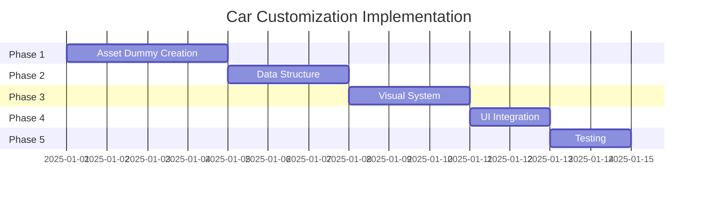

# Car Customization Implementation Plan

**Breadcrumbs:** [Docs](../../../../) > [Features](../../../) > [Car Customization](../) > Planning

**Feature ID**: `car-customization`
**Status**: 🔄 Development
**Version**: 1.1.0
**Date**: 2026-01-26

---

## Overview

Kế hoạch triển khai hệ thống Car Customization trên Unreal Engine 5 Mobile, sử dụng asset dummy cho prototype và kiến trúc mở rộng để tích hợp vào project chính.

**Thời gian ước lượng**: 12-15 ngày làm việc (96-120 giờ) cho 2 developer

---

## Implementation Phases

### Phase 1: Asset Dummy Creation (28 giờ)

| Task ID | Mô tả | Thời gian | Owner | Milestone |
|---------|-------|-----------|-------|-----------|
| 1.1 | Tạo base car model dummy | 8h | DevB | 1 xe cơ bản với tỷ lệ đúng |
| 1.2 | Tạo các loại car parts dummy (2-3 variants mỗi loại) | 16h | DevB | Parts đơn giản hoàn chỉnh |
| 1.3 | Basic materials và textures | 4h | DevA | Materials có thể tái sử dụng |

**Milestone**: Asset library dummy hoàn chỉnh, import UE5 thành công

---

### Phase 2: Data Structure & Core Logic (20 giờ)

| Task ID | Mô tả | Thời gian | Owner | Milestone |
|---------|-------|-----------|-------|-----------|
| 2.1 | Tạo Enum, Struct và Data Tables structure | 6h | DevA | Compile thành công |
| 2.2 | Setup Data Tables với asset references | 8h | DevA | Data Tables hoàn chỉnh |
| 2.3 | Performance calculation engine | 4h | DevA | Logic tính toán chính xác |
| 2.4 | Configuration management (Save/Load) | 2h | DevA | USaveGame hoạt động |

**Milestone**: Core logic hoạt động với asset dummy

---

### Phase 3: Asset Loading & Visual System (20 giờ)

| Task ID | Mô tả | Thời gian | Owner | Milestone |
|---------|-------|-----------|-------|-----------|
| 3.1 | Asset loading system (TSoftObjectPtr, async) | 6h | DevB | Loading không lag |
| 3.2 | Car assembly logic (socket attachment) | 6h | DevA | Parts gắn đúng vị trí |
| 3.3 | Material system & color customization | 8h | DevB | Real-time color change |

**Milestone**: Visual customization hoạt động

---

### Phase 4: UI Integration & Polish (16 giờ)

| Task ID | Mô tả | Thời gian | Owner | Milestone |
|---------|-------|-----------|-------|-----------|
| 4.1 | Car preview system (orbit, zoom) | 4h | DevB | 360° preview mượt mà |
| 4.2 | Customization UI workflow | 8h | DevA | UI functional |
| 4.3 | Performance stats integration | 4h | DevA | Real-time stats display |

**Milestone**: Complete workflow end-to-end

---

### Phase 5: Testing & Optimization (12 giờ)

| Task ID | Mô tả | Thời gian | Owner | Milestone |
|---------|-------|-----------|-------|-----------|
| 5.1 | Performance testing và optimization | 6h | DevA | 30+ FPS trên mobile |
| 5.2 | Bug fixes và end-to-end testing | 4h | Both | System ổn định |
| 5.3 | Documentation & handover | 2h | DevB | Ready for integration |

**Milestone**: Production-ready prototype

---

## Task Dependencies

---

## Resource Allocation

### Developer Assignment

| Developer | Total Hours | Asset Creation | Logic Development | Testing |
|-----------|-------------|----------------|-------------------|---------|
| DevA | 48h | 4h | 36h | 8h |
| DevB | 48h | 24h | 18h | 6h |
| **Total** | **96h** | **28h** | **54h** | **14h** |

### Weekly Schedule

| Week | DevA Tasks | DevB Tasks |
|------|------------|------------|
| Week 1 | 1.3, 2.1, 2.2 | 1.1, 1.2 |
| Week 2 | 2.3, 2.4, 3.2 | 3.1, 3.3, 4.1 |
| Week 3 | 4.2, 4.3, 5.1 | 5.2, 5.3 |

---

## Risk Assessment

### High Risk
- **Mobile Performance**: Async loading và memory management critical
- **Mitigation**: Early performance testing, TSoftObjectPtr usage

### Medium Risk
- **Asset Integration**: Dummy assets may not match final art style
- **Mitigation**: Modular design, clear asset specifications

### Low Risk
- **Save System Compatibility**: Integration with existing save system
- **Mitigation**: Use existing UCarSaveGameManager patterns

---

## Success Criteria

### Phase Completion Criteria

| Phase | Criteria |
|-------|----------|
| Phase 1 | All dummy assets import successfully into UE5 |
| Phase 2 | Data structures compile, performance calculation accurate |
| Phase 3 | Parts attach correctly, colors change in real-time |
| Phase 4 | Complete customization workflow functional |
| Phase 5 | 30+ FPS on mobile, no crashes, no memory leaks |

### Final Acceptance Criteria

- [ ] All 6 part slots functional (Front Bumper, Rear Bumper, Side Board, Spoiler, Exhaust, Wheels)
- [ ] All 3 color slots functional (Body, Wheel, Caliper)
- [ ] Style packages apply correctly
- [ ] Performance stats calculate and display correctly
- [ ] Save/Load works across sessions
- [ ] 30+ FPS maintained on target mobile devices
- [ ] Memory usage < 20MB per vehicle

---

## Post-Prototype Integration

### Timeline
1. **Asset Quality Upgrade**: 2-3 days (if needed)
2. **Main Project Integration**: 2-3 days
3. **Final Testing**: 1-2 days

**Total Timeline**: 17-20 days

---

## References

- [Requirements](../requirements/README.md)
- [Design](../design/README.md)
- [Detailed Planning](detailed-plan.md)
