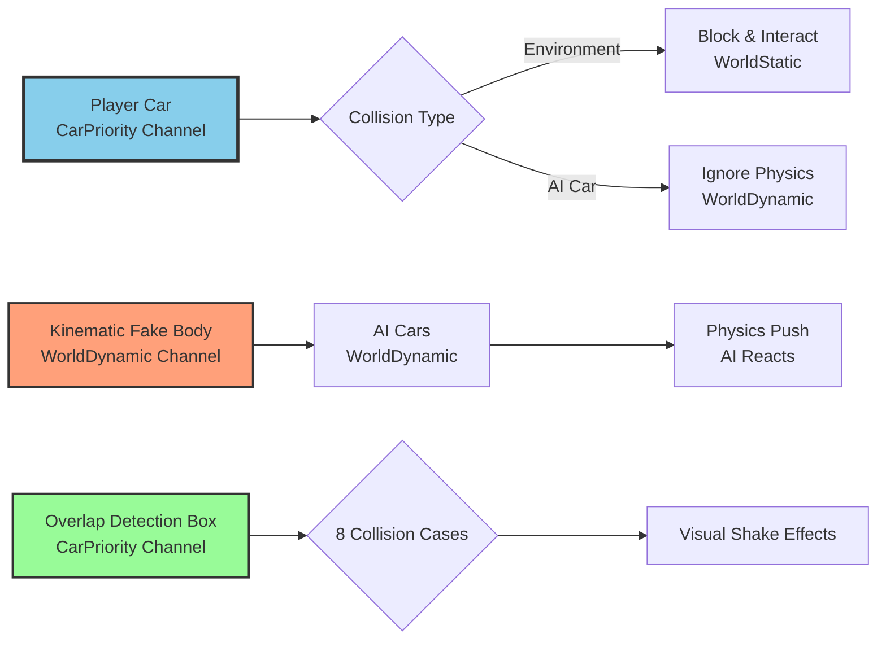
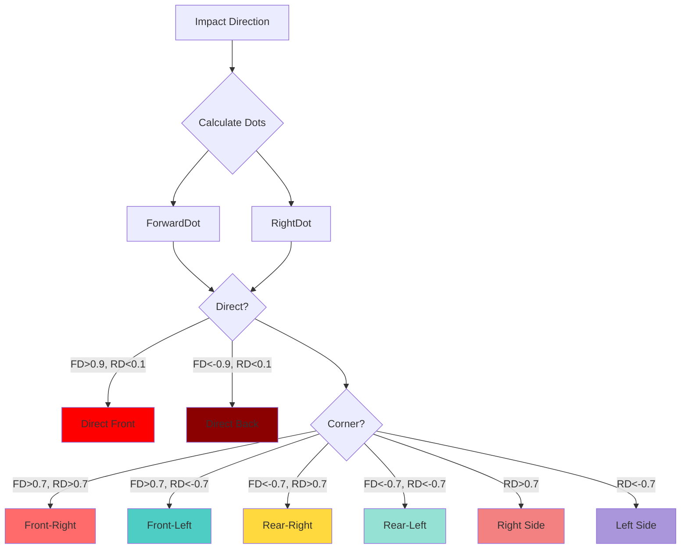

# ME07: Car Collision Mechanic Design

**Feature ID**: `car-physics`  
**Status**: 🔄 Development  
**Version**: 1.0.0  
**Last Updated**: 2026-01-20


## Feature Overview

Give the player a significant advantage in car-to-car collisions, allowing them to push AI cars off track while remaining largely unaffected by AI car impacts. This creates a power fantasy and reduces frustration from AI interference.

**Technical Approach**: Use a three-layer collision system with custom collision channels and a hidden kinematic body.

## System Architecture



## Three-Layer System Design

### Layer 1: Player Car (CarPriority Channel)

**Purpose**: Player car interacts with environment but ignores AI cars

**Configuration**:
```cpp
// Player car collision setup
void ASimulatePhysicsCar::SetupPlayerCarCollision()
{
    PrimitiveComponent->SetCollisionObjectType(ECC_GameTraceChannel1); // CarPriority
    PrimitiveComponent->SetCollisionEnabled(ECollisionEnabled::QueryAndPhysics);
    
    // Collision responses
    PrimitiveComponent->SetCollisionResponseToChannel(ECC_WorldStatic, ECR_Block);
    PrimitiveComponent->SetCollisionResponseToChannel(ECC_WorldDynamic, ECR_Ignore); // Ignore AI cars
    PrimitiveComponent->SetCollisionResponseToChannel(ECC_GameTraceChannel1, ECR_Block); // CarPriority
}
```

**Collision Matrix Entry**:

|                  | WorldStatic | WorldDynamic | CarPriority |
|------------------|-------------|--------------|-------------|
| **Player Car**   | Block       | **Ignore**   | Block       |

### Layer 2: Kinematic Fake Body (WorldDynamic Channel)

**Purpose**: Hidden mesh that follows player car exactly and pushes AI cars

**Architecture**:
```cpp
UCLASS()
class AFakeCarBody : public AActor
{
    GENERATED_BODY()
    
public:
    // Kinematic body mesh (hidden)
    UPROPERTY(VisibleAnywhere, Category = "Collision")
    UStaticMeshComponent* KinematicBodyMesh;
    
    // Overlap detection box (visible effects only)
    UPROPERTY(VisibleAnywhere, Category = "Collision")
    UBoxComponent* CollisionDetectionBox;
    
    // Reference to owner car
    UPROPERTY()
    ASimulatePhysicsCar* OwnerCar;
    
protected:
    virtual void BeginPlay() override;
    virtual void AsyncPhysicsTick(float DeltaTime);
    
private:
    void SyncWithOwnerCar();
    void OnCarOverlap(UPrimitiveComponent* OverlappedComp, AActor* OtherActor, ...);
    ECollisionCase DetermineCollisionCase(const FVector& ImpactDirection);
    void ApplyVisualShake(ECollisionCase CollisionCase);
};
```

**Kinematic Body Setup**:
```cpp
void AFakeCarBody::BeginPlay()
{
    Super::BeginPlay();
    
    // Create kinematic body mesh
    KinematicBodyMesh = NewObject<UStaticMeshComponent>(this, TEXT("KinematicBody"));
    KinematicBodyMesh->SetupAttachment(RootComponent);
    
    // Copy mesh from owner car
    if (OwnerCar)
    {
        UStaticMeshComponent* OwnerMesh = OwnerCar->GetCarMesh();
        KinematicBodyMesh->SetStaticMesh(OwnerMesh->GetStaticMesh());
    }
    
    // Collision setup
    KinematicBodyMesh->SetCollisionObjectType(ECC_WorldDynamic);
    KinematicBodyMesh->SetCollisionEnabled(ECollisionEnabled::QueryAndPhysics);
    KinematicBodyMesh->SetCollisionResponseToAllChannels(ECR_Ignore);
    KinematicBodyMesh->SetCollisionResponseToChannel(ECC_WorldDynamic, ECR_Block); // AI cars
    
    // Physics setup (kinematic)
    KinematicBodyMesh->SetSimulatePhysics(true);
    KinematicBodyMesh->SetEnableGravity(false);
    
    // Lock all constraints (kinematic movement)
    KinematicBodyMesh->BodyInstance.bLockXTranslation = true;
    KinematicBodyMesh->BodyInstance.bLockYTranslation = true;
    KinematicBodyMesh->BodyInstance.bLockZTranslation = true;
    KinematicBodyMesh->BodyInstance.bLockXRotation = true;
    KinematicBodyMesh->BodyInstance.bLockYRotation = true;
    KinematicBodyMesh->BodyInstance.bLockZRotation = true;
    
    // Hidden in game
    KinematicBodyMesh->SetVisibility(false);
    KinematicBodyMesh->SetHiddenInGame(true);
}
```

**Synchronization**:
```cpp
void AFakeCarBody::AsyncPhysicsTick(float DeltaTime)
{
    if (!OwnerCar) return;
    
    // Sync position and rotation with owner car
    FTransform OwnerTransform = OwnerCar->GetActorTransform();
    
    SetActorLocationAndRotation(
        OwnerTransform.GetLocation(),
        OwnerTransform.GetRotation()
    );
    
    // Update kinematic body transform
    KinematicBodyMesh->SetWorldLocationAndRotation(
        OwnerTransform.GetLocation(),
        OwnerTransform.GetRotation()
    );
}
```

**Collision Matrix Entry**:

|                  | WorldStatic | WorldDynamic | CarPriority |
|------------------|-------------|--------------|-------------|
| **Fake Body**    | Ignore      | **Block**    | Ignore      |

### Layer 3: Overlap Detection Box (CarPriority Channel)

**Purpose**: Detect collision cases for visual effects only (no physics)

**Setup**:
```cpp
void AFakeCarBody::BeginPlay()
{
    // ... (previous code)
    
    // Create overlap detection box
    CollisionDetectionBox = NewObject<UBoxComponent>(this, TEXT("OverlapBox"));
    CollisionDetectionBox->SetupAttachment(RootComponent);
    
    // Size to match car bounds
    FVector CarExtent = OwnerCar->GetCarMesh()->Bounds.BoxExtent;
    CollisionDetectionBox->SetBoxExtent(CarExtent * 1.1f); // Slightly larger
    
    // Collision setup (overlap only)
    CollisionDetectionBox->SetCollisionObjectType(ECC_GameTraceChannel1); // CarPriority
    CollisionDetectionBox->SetCollisionEnabled(ECollisionEnabled::QueryOnly);
    CollisionDetectionBox->SetCollisionResponseToAllChannels(ECR_Ignore);
    CollisionDetectionBox->SetCollisionResponseToChannel(ECC_WorldDynamic, ECR_Overlap); // AI cars
    
    // Bind overlap event
    CollisionDetectionBox->OnComponentBeginOverlap.AddDynamic(
        this,
        &AFakeCarBody::OnCarOverlap
    );
}
```

## Eight Collision Cases

**Collision Case Enumeration**:
```cpp
UENUM(BlueprintType)
enum class ECollisionCase : uint8
{
    FrontLeft,
    FrontRight,
    RearLeft,
    RearRight,
    LeftSide,
    RightSide,
    DirectFront,
    DirectBack
};
```

**Detection Algorithm**:
```cpp
ECollisionCase AFakeCarBody::DetermineCollisionCase(const FVector& ImpactDirection)
{
    FVector LocalImpact = GetActorTransform().InverseTransformVector(ImpactDirection);

    // Normalize to local space
    FVector Forward = FVector::ForwardVector;
    FVector Right = FVector::RightVector;

    // Calculate dot products
    float ForwardDot = FVector::DotProduct(LocalImpact, Forward);
    float RightDot = FVector::DotProduct(LocalImpact, Right);

    // Thresholds
    const float CornerThreshold = 0.7f; // ~45 degrees
    const float DirectThreshold = 0.9f; // ~25 degrees (nearly straight)

    // Check for direct front/back collision first
    if (FMath::Abs(ForwardDot) > DirectThreshold && FMath::Abs(RightDot) < (1.0f - DirectThreshold))
    {
        return (ForwardDot > 0) ? ECollisionCase::DirectFront : ECollisionCase::DirectBack;
    }

    // Check for corner collision
    if (FMath::Abs(ForwardDot) > CornerThreshold && FMath::Abs(RightDot) > CornerThreshold)
    {
        if (ForwardDot > 0 && RightDot > 0)
            return ECollisionCase::FrontRight;
        else if (ForwardDot > 0 && RightDot < 0)
            return ECollisionCase::FrontLeft;
        else if (ForwardDot < 0 && RightDot > 0)
            return ECollisionCase::RearRight;
        else
            return ECollisionCase::RearLeft;
    }
    else
    {
        // Side collision
        if (FMath::Abs(RightDot) > FMath::Abs(ForwardDot))
        {
            return (RightDot > 0) ? ECollisionCase::RightSide : ECollisionCase::LeftSide;
        }
        else
        {
            // Default to front/rear based on forward dot
            return (ForwardDot > 0) ? ECollisionCase::FrontRight : ECollisionCase::RearRight;
        }
    }
}
```

**Collision Case Diagram**:


## Visual Shake Effects

**Shake Data Structure**:
```cpp
USTRUCT(BlueprintType)
struct FCollisionShakeSettings
{
    GENERATED_BODY()

    UPROPERTY(EditAnywhere, Category = "Shake")
    TSubclassOf<UCameraShakeBase> DirectFrontShake;

    UPROPERTY(EditAnywhere, Category = "Shake")
    TSubclassOf<UCameraShakeBase> DirectBackShake;

    UPROPERTY(EditAnywhere, Category = "Shake")
    TSubclassOf<UCameraShakeBase> FrontCornerShake;

    UPROPERTY(EditAnywhere, Category = "Shake")
    TSubclassOf<UCameraShakeBase> RearCornerShake;

    UPROPERTY(EditAnywhere, Category = "Shake")
    TSubclassOf<UCameraShakeBase> SideShake;

    UPROPERTY(EditAnywhere, Category = "Shake")
    float ShakeIntensityMultiplier = 1.0f;
};
```

**Apply Shake**:
```cpp
void AFakeCarBody::ApplyVisualShake(ECollisionCase CollisionCase)
{
    if (!OwnerCar || !OwnerCar->GetController()) return;

    APlayerController* PC = Cast<APlayerController>(OwnerCar->GetController());
    if (!PC) return;

    TSubclassOf<UCameraShakeBase> ShakeClass = nullptr;

    switch (CollisionCase)
    {
        case ECollisionCase::DirectFront:
            ShakeClass = ShakeSettings.DirectFrontShake;
            break;

        case ECollisionCase::DirectBack:
            ShakeClass = ShakeSettings.DirectBackShake;
            break;

        case ECollisionCase::FrontLeft:
        case ECollisionCase::FrontRight:
            ShakeClass = ShakeSettings.FrontCornerShake;
            break;

        case ECollisionCase::RearLeft:
        case ECollisionCase::RearRight:
            ShakeClass = ShakeSettings.RearCornerShake;
            break;

        case ECollisionCase::LeftSide:
        case ECollisionCase::RightSide:
            ShakeClass = ShakeSettings.SideShake;
            break;
    }

    if (ShakeClass)
    {
        PC->ClientStartCameraShake(ShakeClass, ShakeSettings.ShakeIntensityMultiplier);
    }
}
```

## Collision Channel Setup

**Project Settings Configuration**:

1. **Create CarPriority Channel**:
   - Edit → Project Settings → Collision
   - New Object Channel: `CarPriority`
   - Default Response: Block

2. **Collision Presets**:

**PlayerCarPreset**:
```
Object Type: CarPriority
Collision Enabled: Query and Physics
Responses:
  - WorldStatic: Block
  - WorldDynamic: Ignore
  - CarPriority: Block
```

**FakeBodyPreset**:
```
Object Type: WorldDynamic
Collision Enabled: Query and Physics
Responses:
  - WorldStatic: Ignore
  - WorldDynamic: Block
  - CarPriority: Ignore
```

**OverlapBoxPreset**:
```
Object Type: CarPriority
Collision Enabled: Query Only
Responses:
  - WorldStatic: Ignore
  - WorldDynamic: Overlap
  - CarPriority: Ignore
```

## Design Decisions

### 1. Kinematic vs Dynamic Fake Body
**Decision**: Use kinematic body with locked constraints

**Rationale**:
- Kinematic: Follows player exactly, no lag or desync
- Dynamic would introduce physics simulation errors
- Locked constraints prevent unwanted movement

**Trade-offs**:
- Kinematic: More predictable, easier to debug
- Dynamic: More realistic but harder to control

### 2. Three-Layer vs Two-Layer System
**Decision**: Use three layers (player car + fake body + overlap box)

**Rationale**:
- Player car: Environment interaction
- Fake body: AI car physics
- Overlap box: Visual effects only
- Clean separation of concerns

**Trade-offs**:
- More complex than two-layer
- Better control and flexibility

### 3. Eight Collision Cases vs Simplified
**Decision**: Detect eight specific collision cases (including direct front/back)

**Rationale**:
- Provides detailed feedback to player
- Different shake effects for different impacts
- Direct front/back collisions are common and need distinct feedback
- Enhances immersion

**Trade-offs**:
- More complex detection logic
- More assets (shake effects)

## Performance Considerations

### Mobile Optimization

**Synchronization Frequency**:
```cpp
// Sync fake body in Async Physics Tick (60 Hz)
// No additional overhead beyond physics tick
void AFakeCarBody::AsyncPhysicsTick(float DeltaTime)
{
    SyncWithOwnerCar(); // ~0.01ms
}
```

**Overlap Detection**:
```cpp
// Overlap events are efficient (engine-optimized)
// Only triggers when AI car enters/exits box
// No per-frame cost when not overlapping
```

### Memory Impact
- Fake body actor: ~500 bytes
- Kinematic mesh: Shares mesh asset with player car (no duplication)
- Overlap box: ~100 bytes
- **Total**: ~600 bytes per player car

### CPU Impact
- Synchronization: ~0.01ms per frame
- Overlap detection: ~0.02ms per overlap event
- Shake effects: ~0.05ms per shake trigger
- **Total**: <0.1ms per frame (negligible)

## Testing Strategy

### Unit Tests
- [ ] CarPriority channel blocks environment
- [ ] CarPriority ignores WorldDynamic (AI cars)
- [ ] Kinematic body syncs position/rotation accurately
- [ ] Eight collision cases detected correctly (including direct front/back)
- [ ] Shake effects trigger for each case

### Integration Tests
- [ ] Player car pushes AI cars consistently
- [ ] AI cars cannot push player car
- [ ] No physics glitches or desyncs
- [ ] Works during airborne state
- [ ] Performance meets mobile targets

### Manual Testing
- [ ] Player feels powerful (can push AI)
- [ ] AI resistance feels appropriate (not weightless)
- [ ] Visual shake communicates impact
- [ ] No unfair AI advantage
- [ ] Works on all track types

## Open Questions

1. Should fake body have mass/friction properties?
2. Should collision strength scale with relative velocity?
3. Should there be audio cues for each collision case?
4. Should AI cars have different "weights" (some harder to push)?
5. Should collision detection be disabled during certain states (e.g., respawn)?

## Related Documentation

- **Requirements**: `ME07.md`, `racing-car-physics-overview.md`
- **Technical Guidance**: `Hướng dẫn kỹ thuật về va chạm giữa xe người chơi và xe của hệ thống.md`
- **Architecture**: `racing-car-physics-architecture.md`
- **Implementation**: `racing-car-physics-implementation-guide.md` (to be created)
- **Testing**: `racing-car-physics-testing-strategy.md` (to be created)

