# Car Physics - System Architecture

**Breadcrumbs:** [Docs](../../../../) > [Features](../../../) > [Car Physics](../) > [Design](./) > Architecture

**Feature ID**: `car-physics`  
**Status**: 🔄 Development  
**Version**: 1.0.0  
**Date**: 2026-01-20

## Architecture Overview

Hệ thống car physics được xây dựng trên Chaos Physics của Unreal Engine với các component tùy chỉnh cho gameplay arcade-style. Kiến trúc theo mô hình component-based với async physics tick để tối ưu hiệu năng mobile.


## Core Components (Verified from Source Code)

### ASimulatePhysicsCar (Main Actor)
**File**: `Plugins/SimpleCarPhysics/Source/SimpleCarPhysics/Public/PhysicsSimulateCar/SimulatePhysicsCar.h`

**Purpose**: Primary physics-based car pawn với async tick support

**Key Properties** (verified from source):
```cpp
// Engine Configuration
UPROPERTY(EditAnywhere, BlueprintReadWrite, Category = "SimulateCar|Engine")
float EngineTorque = 850.f;

UPROPERTY(EditAnywhere, BlueprintReadWrite, Category = "SimulateCar|Engine")
float MaxSpeed = 210.f;

UPROPERTY(EditAnywhere, BlueprintReadWrite, Category = "SimulateCar|Brakes")
float BrakeForce = 15000.f;

// Handling - Drift
UPROPERTY(EditAnywhere, BlueprintReadWrite, Category = "SimulateCar|Handling|Drift")
float SlipAngleToConsiderDrifting = 20.0f;

UPROPERTY(EditAnywhere, BlueprintReadWrite, Category = "SimulateCar|Handling|Drift")
float DriftTorque = 0.f;

UPROPERTY(EditAnywhere, BlueprintReadWrite, Category = "SimulateCar|Handling|Drift")
float DriftLimitAngle = 89.0f;
```

**Key Methods** (verified):
```cpp
// Input handling
void SetThrottleInput(float value);
void SetBrakeInput(float Value);
void SetSteeringInput(float Value);
void ApplyHandbrakeInput(bool value);

// Nitro system
void BoostNitro();
void ReceiveBoostNitro(float ValueToReceive);

// Drift system
bool IsDrifting();
void AffectCoreElementToDrift(AActor* ObjectIssued, float NewDriftLimitAngle);

// Airborne
void SetAirPitchInput(float value);
void SetAirYawInput(float value);
void SetAirRollInput(float value);
void TriggerAllowFlying();

// State management
void ResetState(const FVector& Position, const FRotator& Rotation);
```

**Responsibilities**:
- Async physics tick coordination
- Suspension force application
- Input handling (steering, throttle, brake)
- Collision response
- Airborne state management
- Drift mechanics

### UCustomSuspensionComponent (ME03)
**File**: `Plugins/SimpleCarPhysics/Source/SimpleCarPhysics/Public/PhysicsSimulateCar/CustomSuspensionComponent.h`

**Purpose**: Individual wheel suspension simulation

**Algorithm**:
```
1. Raycast downward from wheel position
2. Calculate compression = (SuspensionLength - HitDistance)
3. Spring force = compression * SpringStiffness
4. Damper force = compressionVelocity * DamperStrength
5. Total force = Spring + Damper
6. Apply force to car body at wheel location
```

### AFollowCarCamera (ME05)
**File**: `Plugins/SimpleCarPhysics/Source/SimpleCarPhysics/Public/FollowCarCamera.h`

**Purpose**: Dynamic camera với FOV và distance adjustment

**Key Properties** (verified):
```cpp
USTRUCT(BlueprintType)
struct FInclineCameraSettings
{
    UPROPERTY(EditAnywhere, Category = "FOV")
    float InclineFOVMultiplier = 1.1f; // +10%
    
    UPROPERTY(EditAnywhere, Category = "FOV")
    float DeclineFOVMultiplier = 1.1f; // +10%
    
    UPROPERTY(EditAnywhere, Category = "Position")
    float InclineZOffset = 50.0f; // +50cm up
    
    UPROPERTY(EditAnywhere, Category = "Position")
    float InclineXOffset = -30.0f; // -30cm back
    
    UPROPERTY(EditAnywhere, Category = "Interpolation")
    float InterpolationSpeed = 5.0f;
    
    UPROPERTY(EditAnywhere, Category = "Detection")
    float InclineThreshold = 10.0f; // Degrees
};
```

**Functions** (verified):
```cpp
void RegisterFollowTarget(ASimulatePhysicsCar* TargetToFollow);
void AdjustDistance(float NewDistance, bool bSnap);
void AdjustFOV(float NewFOV, bool bSnap);
void AdjustRotationLag(float LagPercent, bool bSnap);
void StartCountdownActiveIncline();
```

### ARampZone (ME08)
**File**: `Source/PrototypeRacing/Public/RampZone.h`

**Purpose**: Ramp zone detection và boost application

**Implementation** (verified):
```cpp
UCLASS()
class ARampZone : public AActor
{
    UPROPERTY(EditAnywhere, Category = "Boost")
    float BoostForce = 50000.0f;
    
    UPROPERTY(VisibleAnywhere, Category = "Collision")
    UBoxComponent* RampTrigger;
    
    UPROPERTY(VisibleAnywhere, Category = "Mesh")
    UStaticMeshComponent* RampMeshComponent;
    
protected:
    void OnRampOverlapBegin(...);
    void OnRampOverlapEnd(...);
    FVector CalculateBoostDirection(const FVector& VehicleVelocity);
};
```

**Boost Logic** (from RampZone.cpp):
```cpp
void ARampZone::OnRampOverlapBegin(...)
{
    ASimulatePhysicsCar* Car = Cast<ASimulatePhysicsCar>(OtherActor);
    if (!Car) return;
    
    // Cancel drift if active
    if(Car->IsDrifting())
        Car->CancelDrift();
    
    // Calculate boost direction
    FVector BoostDirection = CalculateBoostDirection(Car->GetVelocity());
    FVector BoostVector = BoostDirection * BoostForce;
    
    // Apply impulse
    UAsyncTickFunctions::ATP_AddImpulse(Car->GetPrimitiveRoot(), BoostVector, true);
    
    // Trigger events
    Car->OnRampBoost(true);
    Car->OnVehicleSkillTriggered.Broadcast(FText::FromString("HangTime"));
}

FVector ARampZone::CalculateBoostDirection(const FVector& VehicleVelocity)
{
    FVector VelocityDirection = VehicleVelocity.GetSafeNormal();
    FVector Up = FVector::UpVector;
    float UpwardBoost = 1.f; // Adjustable
    
    FVector Direction = VelocityDirection + (Up * UpwardBoost);
    return Direction.GetSafeNormal();
}
```

## Data Models (Verified from Source Code)

### FInclineData (ME05)
```cpp
UENUM(BlueprintType)
enum class EInclineState : uint8
{
    Flat UMETA(DisplayName = "Flat"),
    Incline UMETA(DisplayName = "Incline"),
    Decline UMETA(DisplayName = "Decline")
};

USTRUCT(BlueprintType)
struct FInclineData
{
    UPROPERTY(BlueprintReadOnly, Category = "Incline")
    float InclineAngle;

    UPROPERTY(BlueprintReadOnly, Category = "Incline")
    EInclineState InclineState;

    UPROPERTY(BlueprintReadOnly, Category = "Incline")
    float AccelerationMultiplier;

    UPROPERTY(BlueprintReadOnly, Category = "Incline")
    FVector RoadNormal = FVector::UpVector;
};
```

### FInclineAccelerationSettings (ME05)
```cpp
USTRUCT(BlueprintType)
struct FInclineAccelerationSettings
{
    UPROPERTY(EditAnywhere, Category = "Acceleration", 
              meta = (ClampMin = "1.0", ClampMax = "10.0"))
    float UphillMultiplier = 1.3f;

    UPROPERTY(EditAnywhere, Category = "Acceleration", 
              meta = (ClampMin = "1.0", ClampMax = "10.0"))
    float DownhillMultiplier = 1.1f;

    UPROPERTY(EditAnywhere, Category = "Acceleration", 
              meta = (ClampMin = "1.0", ClampMax = "10.0"))
    float FlatMultiplier = 1.0f;
};
```

### FAirborneState (ME08)
```cpp
USTRUCT(BlueprintType)
struct FAirborneState
{
    UPROPERTY(BlueprintReadOnly, Category = "Airborne")
    bool bIsAirborne = false;

    UPROPERTY(BlueprintReadOnly, Category = "Airborne")
    float TimeInAir = 0.0f;

    UPROPERTY(BlueprintReadOnly, Category = "Airborne")
    int32 WheelsInAir = 0;

    UPROPERTY(BlueprintReadOnly, Category = "Airborne")
    FVector LaunchVelocity;

    UPROPERTY(BlueprintReadOnly, Category = "Airborne")
    float MaxHeight = 0.0f;
};
```

### FAirControlSettings (ME08)
```cpp
USTRUCT(BlueprintType)
struct FAirControlSettings
{
    UPROPERTY(EditAnywhere, Category = "Steering")
    float GroundSteeringSensitivity = 1.0f;

    UPROPERTY(EditAnywhere, Category = "Steering")
    float AirSteeringMultiplier = 0.5f; // 50% of ground

    UPROPERTY(EditAnywhere, Category = "Control")
    float YawStrength = 4.0f;

    UPROPERTY(EditAnywhere, Category = "Control")
    float RollStrength = 4.0f;

    UPROPERTY(EditAnywhere, Category = "Control")
    float PitchStrength = 4.0f;
};
```

### FAntiRollInAir (ME08)
```cpp
USTRUCT(BlueprintType)
struct FAntiRollInAir
{
    UPROPERTY(EditAnywhere, Category = "Thresholds", 
              meta = (ClampMin = "0.0", ClampMax = "90.0"))
    float MaxRollAngle = 45.0f;

    UPROPERTY(EditAnywhere, Category = "Thresholds", 
              meta = (ClampMin = "0.0", ClampMax = "90.0"))
    float MaxPitchAngle = 60.0f;

    UPROPERTY(EditAnywhere, Category = "Correction")
    float AntiRollPowerInAir = 3000.0;

    UPROPERTY(EditAnywhere, Category = "Correction")
    float AntiPitchPowerInAir = 2000.0f;
};
```

### FCollisionCorrectionSettings (ME06)
```cpp
USTRUCT(BlueprintType)
struct FCollisionCorrectionSettings
{
    UPROPERTY(EditAnywhere, BlueprintReadWrite, Category = "Wall Correction")
    bool bIsUseImpulse = true;

    UPROPERTY(EditAnywhere, BlueprintReadWrite, Category = "Wall Correction")
    float InterpolationSpeed = 2.0f;

    UPROPERTY(EditAnywhere, BlueprintReadWrite, Category = "Wall Correction")
    float MaxCorrectionTorque = 2000.0f;

    UPROPERTY(EditAnywhere, BlueprintReadWrite, Category = "Wall Correction")
    float AngleReductionFactor = 0.5f; // 50% reduction

    UPROPERTY(EditAnywhere, BlueprintReadWrite, Category = "Wall Correction")
    float TraceDistance = 500.0f;

    UPROPERTY(EditAnywhere, BlueprintReadWrite, Category = "Wall Correction")
    float SmallAngleThreshold = 15.0f;

    UPROPERTY(EditAnywhere, BlueprintReadWrite, Category = "Wall Correction")
    float LargeAngleThreshold = 45.0f;

    UPROPERTY(EditAnywhere, BlueprintReadWrite, Category = "Wall Correction")
    float OutwardImpulseStrength = 50.0f;

    UPROPERTY(EditAnywhere, BlueprintReadWrite, Category = "Wall Correction")
    TArray<TSubclassOf<AActor>> IgnoreActor;
};
```

### FWallCollisionData (ME06)
```cpp
UENUM(BlueprintType)
enum class ECollisionSeverity : uint8
{
    Small,   // < 15 degrees
    Medium,  // 15-45 degrees
    Large    // > 45 degrees
};

USTRUCT(BlueprintType)
struct FWallCollisionData
{
    UPROPERTY(BlueprintReadWrite)
    FVector ImpactPoint;

    UPROPERTY(BlueprintReadWrite)
    FVector ImpactNormal;

    UPROPERTY(BlueprintReadWrite)
    float CollisionAngle; // Degrees

    UPROPERTY(BlueprintReadWrite)
    ECollisionSeverity Severity;

    UPROPERTY(BlueprintReadWrite)
    bool bIsValid = false;
};
```

### FSuspensionPair
```cpp
USTRUCT()
struct FSuspensionPair
{
    UPROPERTY()
    UCustomSuspensionComponent* FirstSuspension;  // Left wheel

    UPROPERTY()
    UCustomSuspensionComponent* SecondSuspension; // Right wheel
};
```

## Data Flow

### Physics Update Flow (Async Tick)


### ME05: Incline Detection Flow


### ME06: Auto-Correction Flow


### ME08: Ramp & Airborne Flow

```mermaid
graph TD
    A[Ramp Zone Detection] --> B{Overlap Event}
    B -->|Enter Ramp| C[Cancel Drift]
    C --> D[Calculate Boost Direction]
    D --> E[Apply Impulse]
    E --> F[Trigger OnRampBoost]
    
    F --> G[Airborne State]
    G --> H[Air Control System]
    G --> I[Auto-Rotate System]
    
    H --> J[50% Steering<br/>Yaw/Roll/Pitch]
    I --> K{Tilt Check}
    
    K -->|> 45° Roll| L[Auto-Correct]
    K -->|> 60° Pitch| L
    K -->|Normal| M[Player Control]
    
    N[Landing Detection] --> O{Check Rotation}
    O -->|Upright| P[Normal Landing]
    O -->|Tilted| Q[Reset Car]
```



## Performance Targets

### Android
- **Frame Rate**: 30 FPS minimum, 60 FPS target
- **Physics Tick**: 60 Hz (16.67ms budget)
- **Suspension Update**: <0.5ms per wheel per frame
- **Camera Update**: <0.2ms per frame
- **Collision Detection**: <1ms per frame

### iOS
- **Frame Rate**: 60 FPS target
- **Physics Tick**: 60 Hz (16.67ms budget)
- **Suspension Update**: <0.3ms per wheel per frame
- **Camera Update**: <0.1ms per frame
- **Collision Detection**: <0.5ms per frame

## Mobile Optimization Strategy

### Distance-Based Updates
```cpp
void ASimulatePhysicsCar::NativeAsyncTick(float DeltaTime)
{
    if (bIsPlayerCar)
    {
        // High-priority continuous update for player
        UpdatePhysicsCore(DeltaTime);
    }
    else
    {
        // Distance-based conditional update for AI
        float DistanceToPlayer = (PlayerCar->GetActorLocation() - GetActorLocation()).Size();
        if (DistanceToPlayer < UpdateDistanceThreshold)
        {
            UpdatePhysicsCore(DeltaTime);
        }
    }
}
```

### Memory Management
- Object pooling for VFX widgets
- Soft references for large assets
- Texture streaming for track environments

### Battery Optimization
- Reduce physics tick rate when battery <20%
- Lower visual quality on thermal throttling
- Pause physics simulation when app backgrounded

## Plugin Architecture

```
PrototypeRacing/Plugins/SimpleCarPhysics/
├── Source/SimpleCarPhysics/
│   ├── Public/
│   │   ├── PhysicsSimulateCar/
│   │   │   ├── SimulatePhysicsCar.h
│   │   │   ├── CustomSuspensionComponent.h
│   │   │   ├── CustomVehicleWheel.h
│   │   │   ├── CarAnimateActor.h
│   │   │   └── AudioListenerActor.h
│   │   ├── FollowCarCamera.h
│   │   ├── FakeCarBody.h
│   │   ├── KinematicFakeCarBody.h
│   │   ├── RoadGuide.h
│   │   ├── GuideLineSubsystem.h
│   │   └── SimpleCarPhysics.h
│   └── Private/
│       └── (implementations)
└── SimpleCarPhysics.uplugin
```

## Related Documentation

- **Requirements**: `requirements/racing-car-physics-overview.md`
- **Planning**: `planning/racing-car-physics-master-plan.md`
- **Implementation**: `implementation/racing-car-physics-implementation-guide.md`
- **Testing**: `testing/racing-car-physics-testing-strategy.md`
