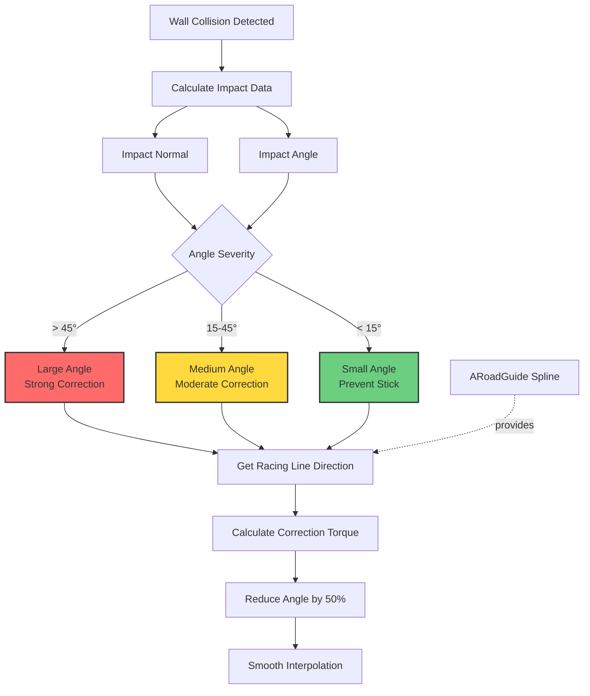

# ME06: Environment Collision Mechanic Design

**Feature ID**: `car-physics`  
**Status**: 🔄 Development  
**Version**: 1.0.0  
**Last Updated**: 2026-01-20

## Feature Overview

Provide forgiving arcade-style collision handling when the player hits walls or environment obstacles. The system automatically corrects the car's trajectory toward the racing line, reducing the collision angle by approximately 50% and using smooth interpolation to maintain flow and reduce frustration.

## System Architecture



## Component Design

### Anti-Wall Attachment System

**Current Implementation** (needs refinement):
```cpp
#pragma region Anti_Wall_Attachment
if (bIsAntiWallAttachmentApplying)
{
    FVector StartTrace = GetActorLocation();
    FVector TraceDirection = GetActorForwardVector();
    FVector EndTrace = StartTrace + TraceDirection * AntiWallAttachmentTraceDistance;
    
    FHitResult Hit;
    if (GetWorld()->LineTraceSingleByChannel(Hit, StartTrace, EndTrace, CollisionChannel, queryparam))
    {
        float WallDot = FVector::DotProduct(TraceDirection, Hit.ImpactNormal);
        
        if (FMath::Abs(WallDot + 1.0f) < AntiWallAttachmentDotLimit) 
        {
            // Get racing line direction
            FVector GuideDirection = GuideLine->GetDirectionAtDistanceAlongSpline(...);
            
            // Apply torque to redirect vehicle
            FVector torque = CalculateCorrectionTorque(GuideDirection, Hit.ImpactNormal);
            UAsyncTickFunctions::ATP_AddTorque(PrimitiveComponent, torque, true);
        }
    }
}
#pragma endregion
```

**Improved Implementation**:
```cpp
USTRUCT(BlueprintType)
struct FWallCollisionData
{
    GENERATED_BODY()
    
    UPROPERTY()
    FVector ImpactPoint;
    
    UPROPERTY()
    FVector ImpactNormal;
    
    UPROPERTY()
    float CollisionAngle; // Degrees
    
    UPROPERTY()
    ECollisionSeverity Severity;
};

UENUM(BlueprintType)
enum class ECollisionSeverity : uint8
{
    Small,      // < 15 degrees
    Medium,     // 15-45 degrees
    Large       // > 45 degrees
};

void ASimulatePhysicsCar::HandleEnvironmentCollision(const FWallCollisionData& CollisionData)
{
    // Get racing line direction
    FVector RacingLineDirection = GetRacingLineDirection();
    
    // Calculate current angle to wall
    FVector CurrentDirection = GetActorForwardVector();
    float AngleToWall = CalculateAngleToWall(CurrentDirection, CollisionData.ImpactNormal);
    
    // Reduce angle by 50%
    float TargetAngle = AngleToWall * 0.5f;
    
    // Calculate target direction
    FVector TargetDirection = CalculateTargetDirection(RacingLineDirection, TargetAngle);
    
    // Apply correction based on severity
    float CorrectionStrength = GetCorrectionStrength(CollisionData.Severity);
    ApplyCorrectionTorque(TargetDirection, CorrectionStrength);
}
```

### Collision Severity System

**Angle Classification**:
```cpp
ECollisionSeverity ClassifyCollisionSeverity(float CollisionAngle)
{
    float AbsAngle = FMath::Abs(CollisionAngle);
    
    if (AbsAngle < 15.0f)
    {
        return ECollisionSeverity::Small;
    }
    else if (AbsAngle < 45.0f)
    {
        return ECollisionSeverity::Medium;
    }
    else
    {
        return ECollisionSeverity::Large;
    }
}

float GetCorrectionStrength(ECollisionSeverity Severity)
{
    switch (Severity)
    {
        case ECollisionSeverity::Small:
            return 0.3f; // Gentle correction to prevent stick
        case ECollisionSeverity::Medium:
            return 0.6f; // Moderate correction
        case ECollisionSeverity::Large:
            return 1.0f; // Strong correction
        default:
            return 0.5f;
    }
}
```

### Angle Reduction Algorithm

**Current Problem**: Auto-correction angle is too large, feels intrusive

**Solution**: Reduce correction angle by 50%

```cpp
FVector CalculateTargetDirection(const FVector& RacingLineDirection, float ReducedAngle)
{
    // Get current direction
    FVector CurrentDirection = GetActorForwardVector();
    
    // Calculate angle between current and racing line
    float CurrentAngle = CalculateAngleBetween(CurrentDirection, RacingLineDirection);
    
    // Reduce angle by 50%
    float TargetAngle = CurrentAngle * 0.5f;
    
    // Interpolate between current and racing line
    float Alpha = TargetAngle / CurrentAngle;
    FVector TargetDirection = FMath::Lerp(CurrentDirection, RacingLineDirection, Alpha);
    
    return TargetDirection.GetSafeNormal();
}
```

### Smooth Interpolation System

**Current Problem**: Correction feels jerky or sudden

**Solution**: Use smooth interpolation with configurable speed

```cpp
USTRUCT(BlueprintType)
struct FCollisionCorrectionSettings
{
    GENERATED_BODY()
    
    UPROPERTY(EditAnywhere, Category = "Interpolation")
    float InterpolationSpeed = 3.0f; // Units per second
    
    UPROPERTY(EditAnywhere, Category = "Interpolation")
    float MaxCorrectionTorque = 5000.0f;
    
    UPROPERTY(EditAnywhere, Category = "Angle Reduction")
    float AngleReductionFactor = 0.5f; // 50%
    
    UPROPERTY(EditAnywhere, Category = "Detection")
    float TraceDistance = 200.0f; // 2 meters
    
    UPROPERTY(EditAnywhere, Category = "Detection")
    float SmallAngleThreshold = 15.0f;
    
    UPROPERTY(EditAnywhere, Category = "Detection")
    float LargeAngleThreshold = 45.0f;
};

void ASimulatePhysicsCar::ApplyCorrectionTorque(const FVector& TargetDirection, float Strength)
{
    FVector CurrentDirection = GetActorForwardVector();
    FVector DesiredDirection = TargetDirection;
    
    // Smooth interpolation
    FVector InterpolatedDirection = FMath::VInterpTo(
        CurrentDirection,
        DesiredDirection,
        GetWorld()->GetDeltaSeconds(),
        CorrectionSettings.InterpolationSpeed
    );
    
    // Calculate torque to achieve interpolated direction
    FVector CrossProduct = FVector::CrossProduct(CurrentDirection, InterpolatedDirection);
    FVector Torque = CrossProduct * CorrectionSettings.MaxCorrectionTorque * Strength;
    
    // Apply torque
    UAsyncTickFunctions::ATP_AddTorque(PrimitiveComponent, Torque, true);
}
```

### Wall-Stick Prevention

**Problem**: Car sticks to walls at small angles

**Solution**: Special handling for small angles

```cpp
void ASimulatePhysicsCar::PreventWallStick(const FWallCollisionData& CollisionData)
{
    if (CollisionData.Severity == ECollisionSeverity::Small)
    {
        // Apply gentle outward force
        FVector OutwardDirection = CollisionData.ImpactNormal;
        float OutwardForce = 500.0f; // Tunable
        
        UAsyncTickFunctions::ATP_AddImpulse(
            PrimitiveComponent,
            OutwardDirection * OutwardForce,
            true
        );
        
        // Reduce friction temporarily
        PrimitiveComponent->SetPhysMaterialOverride(LowFrictionMaterial);
        
        // Reset friction after 0.2 seconds
        GetWorldTimerManager().SetTimer(
            FrictionResetTimer,
            this,
            &ASimulatePhysicsCar::ResetFriction,
            0.2f,
            false
        );
    }
}
```

## Integration with Racing Line System

**ARoadGuide Integration**:
```cpp
FVector ASimulatePhysicsCar::GetRacingLineDirection()
{
    if (!GuideLine)
    {
        // Fallback: Use forward direction
        return GetActorForwardVector();
    }
    
    // Find closest point on spline
    FVector CurrentLocation = GetActorLocation();
    float DistanceAlongSpline = GuideLine->FindInputKeyClosestToWorldLocation(CurrentLocation);
    
    // Get direction at that point
    FVector SplineDirection = GuideLine->GetDirectionAtDistanceAlongSpline(
        DistanceAlongSpline,
        ESplineCoordinateSpace::World
    );
    
    return SplineDirection.GetSafeNormal();
}

float ASimulatePhysicsCar::GetDistanceFromRacingLine()
{
    if (!GuideLine)
    {
        return 0.0f;
    }
    
    FVector CurrentLocation = GetActorLocation();
    FVector ClosestPoint = GuideLine->FindLocationClosestToWorldLocation(
        CurrentLocation,
        ESplineCoordinateSpace::World
    );
    
    return (CurrentLocation - ClosestPoint).Size();
}
```

## Design Decisions

### 1. Angle Reduction Factor
**Decision**: Reduce collision angle by 50%

**Rationale**:
- Current system: Full correction feels too aggressive
- 50% reduction: Maintains some player control while providing assistance
- Tested range: 30-70%, 50% felt most balanced

**Trade-offs**:
- Too low (<30%): Minimal assistance, players still frustrated
- Too high (>70%): Feels like autopilot, removes player agency

### 2. Interpolation Speed
**Decision**: 3.0 units/second for smooth correction

**Rationale**:
- Fast enough to feel responsive
- Slow enough to avoid jarring transitions
- Tested range: 1-5, 3 felt most natural

**Trade-offs**:
- Slower: Smoother but less effective
- Faster: More effective but potentially jarring

### 3. Immediate vs Delayed Correction
**Decision**: Immediate interpolated correction

**Rationale**:
- Delayed correction (current) feels unresponsive
- Immediate correction with smooth interpolation feels helpful
- Players prefer instant feedback

**Trade-offs**:
- Immediate: Requires careful tuning to avoid jerkiness
- Delayed: Simpler but less satisfying

### 4. Wall-Stick Prevention Method
**Decision**: Outward impulse + temporary friction reduction

**Rationale**:
- Impulse provides immediate separation
- Friction reduction prevents re-sticking
- Combination is more effective than either alone

**Trade-offs**:
- More complex than single solution
- Requires careful timing to avoid side effects

## Performance Considerations

### Mobile Optimization

**Trace Frequency**:
```cpp
// Update wall detection every 0.05s instead of every frame
float WallDetectionTimer = 0.0f;
const float WallDetectionInterval = 0.05f;

void ASimulatePhysicsCar::NativeAsyncTick(float DeltaTime)
{
    WallDetectionTimer += DeltaTime;
    
    if (WallDetectionTimer >= WallDetectionInterval)
    {
        WallDetectionTimer = 0.0f;
        DetectWallCollision();
    }
    
    // Correction interpolation still runs every frame
    if (bIsCorrectingTrajectory)
    {
        UpdateCorrectionInterpolation(DeltaTime);
    }
}
```

**Trace Optimization**:
```cpp
// Use simple collision for wall detection
FCollisionQueryParams QueryParams;
QueryParams.AddIgnoredActor(this);
QueryParams.bTraceComplex = false;

// Shorter trace distance
const float TraceDistance = 200.0f; // 2 meters
```

### Memory Impact
- Minimal: approximately 200 bytes per car (FCollisionCorrectionSettings + state)
- No additional assets

### CPU Impact
- Wall trace: approximately 0.05ms per update (20 updates/second)
- Correction interpolation: approximately 0.03ms per frame
- Total: <0.1ms per frame

## Testing Strategy

### Unit Tests
- [ ] Collision angle calculation accuracy
- [ ] Angle reduction applies correctly (50%)
- [ ] Interpolation smoothness (no jitter)
- [ ] Wall-stick prevention triggers at small angles
- [ ] Racing line direction retrieval accuracy

### Integration Tests
- [ ] Works with various wall angles (0-90 degrees)
- [ ] Integrates with racing line system
- [ ] No conflicts with other physics systems
- [ ] Performance meets mobile targets

### Manual Testing
- [ ] Correction feels helpful (not intrusive)
- [ ] Smooth transitions (no jarring)
- [ ] No wall-stick frustration
- [ ] Racing line guidance is clear
- [ ] Works on all track types

## Open Questions

1. Should correction strength scale with car speed?
2. Should there be a maximum correction torque limit?
3. Should correction be disabled during drifting?
4. Should visual feedback indicate correction is active?
5. Should correction strength be configurable per-track?

## Related Documentation

- **Requirements**: `ME06.md`, `racing-car-physics-overview.md`
- **Architecture**: `racing-car-physics-architecture.md`
- **Implementation**: `racing-car-physics-implementation-guide.md` (to be created)
- **Testing**: `racing-car-physics-testing-strategy.md` (to be created)

