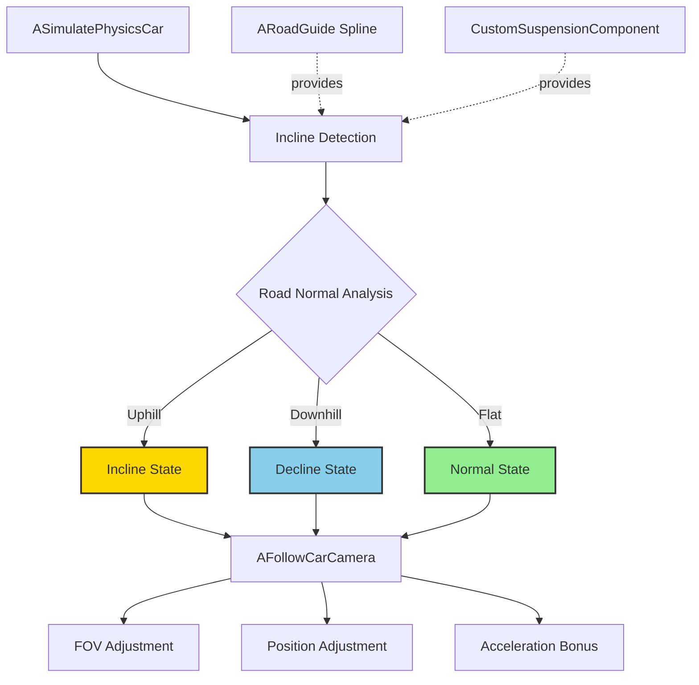

# ME05: Incline & Decline Camera System Design

**Feature ID**: `car-physics`  
**Status**: 🔄 Development  
**Version**: 1.0.0  
**Last Updated**: 2026-01-20

## Feature Overview

Enhance the racing experience on slopes by dynamically adjusting camera FOV and position when the player enters incline or decline zones, creating a sense of speed and drama while providing better visibility.

## System Architecture



## Component Design

### Incline Detection System

**Method 1: Road Normal (Recommended)**
```cpp
FVector GetRoadNormalAtLocation()
{
    FHitResult Hit;
    FVector Start = GetActorLocation();
    FVector End = Start - FVector::UpVector * 200.0f;
    
    if (GetWorld()->LineTraceSingleByChannel(Hit, Start, End, ECC_WorldStatic))
    {
        return Hit.ImpactNormal;
    }
    
    return FVector::UpVector; // Default flat
}

float CalculateInclineAngle(const FVector& RoadNormal)
{
    // Angle between road normal and world up
    float DotProduct = FVector::DotProduct(RoadNormal, FVector::UpVector);
    float Angle = FMath::Acos(DotProduct) * (180.0f / PI);
    
    // Determine direction (incline vs decline)
    FVector Forward = GetActorForwardVector();
    FVector RoadForward = FVector::CrossProduct(RoadNormal, GetActorRightVector());
    float DirectionDot = FVector::DotProduct(Forward, RoadForward);
    
    return (DirectionDot > 0) ? Angle : -Angle;
}
```

**Method 2: Spline Metadata (Alternative)**
```cpp
float GetInclineAngleFromSpline()
{
    if (!GuideLine) return 0.0f;
    
    float DistanceAlongSpline = GuideLine->FindInputKeyClosestToWorldLocation(GetActorLocation());
    FVector SplineDirection = GuideLine->GetDirectionAtDistanceAlongSpline(DistanceAlongSpline, ESplineCoordinateSpace::World);
    
    // Calculate pitch angle
    return FMath::Asin(SplineDirection.Z) * (180.0f / PI);
}
```

### Camera Adjustment System

**Data Structure**:
```cpp
USTRUCT(BlueprintType)
struct FInclineCameraSettings
{
    GENERATED_BODY()
    
    // FOV Settings
    UPROPERTY(EditAnywhere, Category = "FOV")
    float BaseFOV = 100.0f;
    
    UPROPERTY(EditAnywhere, Category = "FOV")
    float InclineFOVMultiplier = 1.1f; // +10%
    
    UPROPERTY(EditAnywhere, Category = "FOV")
    float DeclineFOVMultiplier = 1.1f; // +10%
    
    // Position Offsets
    UPROPERTY(EditAnywhere, Category = "Position")
    float InclineZOffset = 50.0f; // +50cm up
    
    UPROPERTY(EditAnywhere, Category = "Position")
    float InclineXOffset = -30.0f; // -30cm back
    
    UPROPERTY(EditAnywhere, Category = "Position")
    float DeclineZOffset = 50.0f; // +50cm up
    
    UPROPERTY(EditAnywhere, Category = "Position")
    float DeclineXOffset = -30.0f; // -30cm back
    
    // Interpolation
    UPROPERTY(EditAnywhere, Category = "Interpolation")
    float InterpolationSpeed = 5.0f;
    
    // Thresholds
    UPROPERTY(EditAnywhere, Category = "Detection")
    float InclineThreshold = 10.0f; // Degrees
    
    UPROPERTY(EditAnywhere, Category = "Detection")
    float DeclineThreshold = -10.0f; // Degrees
};
```

**Camera Update Logic**:
```cpp
void AFollowCarCamera::UpdateCameraOnIncline(float InclineAngle, float DeltaTime)
{
    FInclineCameraSettings Settings = GetInclineSettings();
    
    float TargetFOV = Settings.BaseFOV;
    FVector TargetOffset = FVector::ZeroVector;
    
    if (InclineAngle > Settings.InclineThreshold)
    {
        // Uphill
        TargetFOV = Settings.BaseFOV * Settings.InclineFOVMultiplier;
        TargetOffset = FVector(Settings.InclineXOffset, 0, Settings.InclineZOffset);
    }
    else if (InclineAngle < Settings.DeclineThreshold)
    {
        // Downhill
        TargetFOV = Settings.BaseFOV * Settings.DeclineFOVMultiplier;
        TargetOffset = FVector(Settings.DeclineXOffset, 0, Settings.DeclineZOffset);
    }
    
    // Smooth interpolation
    CurrentCameraFOV = FMath::FInterpTo(CurrentCameraFOV, TargetFOV, DeltaTime, Settings.InterpolationSpeed);
    CurrentCameraOffset = FMath::VInterpTo(CurrentCameraOffset, TargetOffset, DeltaTime, Settings.InterpolationSpeed);
    
    // Apply to camera
    CameraComponent->SetFieldOfView(CurrentCameraFOV);
    SpringArm->SocketOffset = CurrentCameraOffset;
}
```

### Acceleration Bonus System

**Data Structure**:
```cpp
USTRUCT(BlueprintType)
struct FInclineAccelerationSettings
{
    GENERATED_BODY()
    
    UPROPERTY(EditAnywhere, Category = "Acceleration")
    float UphillMultiplier = 1.3f; // 130%
    
    UPROPERTY(EditAnywhere, Category = "Acceleration")
    float DownhillMultiplier = 1.1f; // 110%
    
    UPROPERTY(EditAnywhere, Category = "Acceleration")
    float FlatMultiplier = 1.0f; // 100%
};
```

**Acceleration Application**:
```cpp
float ASimulatePhysicsCar::GetAccelerationMultiplier()
{
    float InclineAngle = CalculateInclineAngle(GetRoadNormalAtLocation());
    FInclineAccelerationSettings Settings = GetAccelerationSettings();
    
    if (InclineAngle > InclineThreshold)
    {
        return Settings.UphillMultiplier; // 1.3x on uphill
    }
    else if (InclineAngle < DeclineThreshold)
    {
        return Settings.DownhillMultiplier; // 1.1x on downhill
    }
    
    return Settings.FlatMultiplier; // 1.0x on flat
}

void ASimulatePhysicsCar::ApplyThrottle(float ThrottleInput)
{
    float BaseForce = ThrottleInput * MaxEngineForce;
    float Multiplier = GetAccelerationMultiplier();
    float FinalForce = BaseForce * Multiplier;
    
    UAsyncTickFunctions::ATP_AddForce(PrimitiveComponent, GetActorForwardVector() * FinalForce, true);
}
```

## Performance Testing Notes

**Note**: The suspension system (ME03) already handles smoothing for terrain bumps, so no additional smoothing is needed in the incline detection system.

**Performance Validation**:
```cpp
// Test for performance impact and lag only
void AFollowCarCamera::ValidateInclinePerformance()
{
    // Measure frame time impact
    double StartTime = FPlatformTime::Seconds();

    UpdateCameraOnIncline(CurrentInclineAngle, DeltaTime);

    double EndTime = FPlatformTime::Seconds();
    double ElapsedMs = (EndTime - StartTime) * 1000.0;

    // Should be < 0.1ms per frame
    ensure(ElapsedMs < 0.1);
}
```

## Design Decisions

### 1. Road Normal vs Spline Metadata
**Decision**: Use road normal raycast as primary method

**Rationale**:
- Works on any terrain (not just spline-based tracks)
- Real-time detection (no pre-authoring needed)
- More accurate for dynamic surfaces

**Trade-offs**:
- Raycast cost (mitigated by distance-based updates)
- Potential noise on bumpy terrain (smoothing needed)

### 2. FOV Boost Percentage
**Decision**: +10% FOV boost for both incline and decline

**Rationale**:
- Noticeable but not disorienting
- Matches NOS FOV boost for consistency
- Tested range: 5-15%, 10% felt best

**Trade-offs**:
- May cause motion sickness for sensitive players (add option to disable)

### 3. Camera Position Offset
**Decision**: Z +50cm, X -30cm for both incline and decline

**Rationale**:
- Higher camera provides better view of upcoming slope
- Backward offset increases sense of speed
- Symmetric for incline/decline simplifies tuning

**Trade-offs**:
- May obscure car body (acceptable for gameplay)

### 4. Interpolation Speed
**Decision**: 5.0 units/second for smooth transitions

**Rationale**:
- Fast enough to feel responsive
- Slow enough to avoid jarring transitions
- Tested range: 3-10, 5 felt most natural

**Trade-offs**:
- Slower = smoother but less responsive
- Faster = more responsive but potentially jarring

## Performance Considerations

### Mobile Optimization

**Update Frequency**:
```cpp
// Update incline detection every 0.1s instead of every frame
float InclineUpdateTimer = 0.0f;
const float InclineUpdateInterval = 0.1f;

void ASimulatePhysicsCar::NativeAsyncTick(float DeltaTime)
{
    InclineUpdateTimer += DeltaTime;
    
    if (InclineUpdateTimer >= InclineUpdateInterval)
    {
        InclineUpdateTimer = 0.0f;
        UpdateInclineState();
    }
    
    // Camera interpolation still runs every frame for smoothness
    FollowCamera->UpdateCameraOnIncline(CurrentInclineAngle, DeltaTime);
}
```

**Raycast Optimization**:
```cpp
// Use simple collision channel for road detection
FCollisionQueryParams QueryParams;
QueryParams.AddIgnoredActor(this);
QueryParams.bTraceComplex = false; // Use simple collision

// Shorter trace distance
FVector End = Start - FVector::UpVector * 100.0f; // 1m instead of 2m
```

### Memory Impact
- Minimal: Only adds approximately 100 bytes per car (FInclineCameraSettings + state variables)
- No additional assets loaded

### CPU Impact
- Raycast: approximately 0.05ms per update (10 updates/second)
- Camera interpolation: approximately 0.02ms per frame
- Total: <0.1ms per frame

## Testing Strategy

### Unit Tests
- [ ] Incline angle calculation accuracy (±1 degree)
- [ ] FOV adjustment applies correctly
- [ ] Position offset applies correctly
- [ ] Interpolation smoothness (no jitter)
- [ ] Acceleration multiplier applies correctly

### Integration Tests
- [ ] Performance impact testing (no lag)
- [ ] Incline detection on various terrain types
- [ ] Smooth transitions between incline/decline/flat

### Manual Testing
- [ ] FOV boost feels natural (not disorienting)
- [ ] Camera position enhances visibility
- [ ] Acceleration bonus feels rewarding
- [ ] No motion sickness reported
- [ ] Works on all track types

## Open Questions

1. Should FOV boost scale with incline angle (steeper = more boost)?
2. Should camera offset scale with car speed?
3. Should there be a maximum incline angle for safety?
4. Should acceleration bonus apply to AI cars?
5. Should there be audio cues when entering incline zones?

## Related Documentation

- **Requirements**: `ME05.md`, `racing-car-physics-overview.md`
- **Architecture**: `racing-car-physics-architecture.md`
- **Implementation**: `racing-car-physics-implementation-guide.md` (to be created)
- **Testing**: `racing-car-physics-testing-strategy.md` (to be created)

