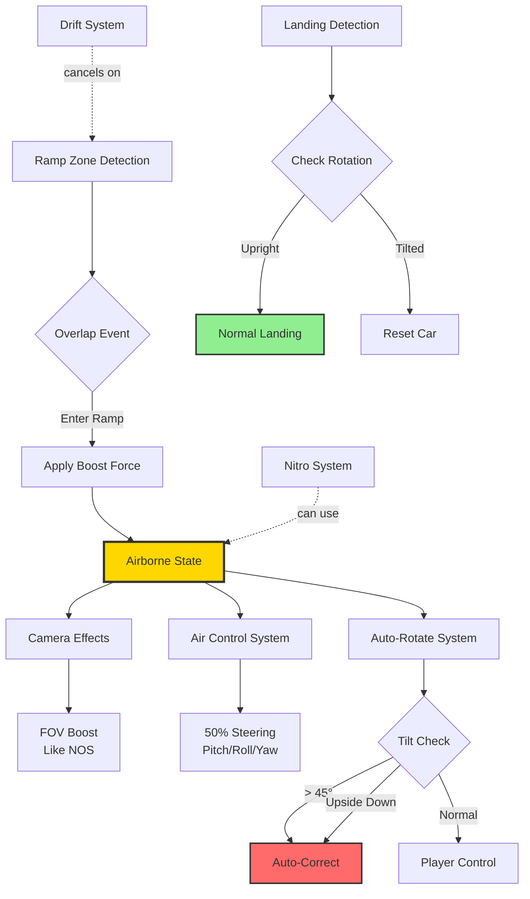

# ME08: Ramp & Airborne Mechanics Design

**Feature ID**: `car-physics`
**Status**: 🔄 Development
**Version**: 1.1.0
**Last Updated**: 2026-01-26

## Feature Overview

Create thrilling jump moments when players hit ramps, with fixed force boosts, camera effects, limited air control, and auto-recovery systems to ensure exciting but controllable airborne experiences.

## System Architecture



## Component Design

### Ramp Zone System

**Ramp Zone Actor**:
```cpp
UCLASS()
class ARampZone : public AActor
{
    GENERATED_BODY()

public:
    UPROPERTY(VisibleAnywhere, Category = "Collision")
    UBoxComponent* RampTrigger;

    UPROPERTY(EditAnywhere, Category = "Boost")
    float BoostForce = 800.0f; // Base boost force (scaled by speed curve) (Updated 2026-01-26: was 50000.0f)

    // Note: Boost angle follows vehicle's velocity direction (not a fixed property)
    // Boost height is determined by boost force, speed curve multiplier, and angle
    // The force angle can be adjusted higher than the ramp surface angle to increase height

protected:
    UFUNCTION()
    void OnRampOverlap(UPrimitiveComponent* OverlappedComp, AActor* OtherActor, ...);

    FVector CalculateBoostDirection(const FVector& VehicleVelocity);
};
```

**Speed-Based Boost Curve System**:

The boost force is dynamically scaled based on vehicle speed using a curve:

```cpp
// In ASimulatePhysicsCar
UPROPERTY(EditAnywhere, Category = "Ramp")
float MaxSpeedForBoostCurve = 200.0f; // KPH - speed at which curve reaches 1.0

UPROPERTY(EditAnywhere, Category = "Ramp")
UCurveFloat* BoostForceCurve; // Curve for dynamic boost multiplier

UPROPERTY(EditAnywhere, Category = "Ramp")
float RampBoostUpward = 0.3f; // Upward component of boost direction

UPROPERTY(EditAnywhere, Category = "Ramp")
float AntiAirBorneInRampMultiplier = 0.1f; // Reduces airborne detection sensitivity on ramp
```

**Boost Calculation with Speed Curve**:
```cpp
void ARampZone::ApplyBoost(ASimulatePhysicsCar* Car)
{
    // Get current speed
    float CurrentSpeed = Car->GetCurrentSpeedKPH();

    // Normalize speed (0.0 to 1.0 based on MaxSpeedForBoostCurve)
    float NormalizedSpeed = FMath::Clamp(CurrentSpeed / Car->MaxSpeedForBoostCurve, 0.0f, 1.0f);

    // Get multiplier from curve (allows non-linear boost scaling)
    float BoostMultiplier = Car->BoostForceCurve->GetFloatValue(NormalizedSpeed);

    // Calculate final boost force
    float FinalBoostForce = BoostForce * BoostMultiplier;

    // Apply boost with calculated force
    FVector BoostDirection = CalculateBoostDirection(Car->GetVelocity());
    UAsyncTickFunctions::ATP_AddImpulse(Car->GetPrimitiveRoot(), BoostDirection * FinalBoostForce, true);
}
```

**Boost Application**:
```cpp
void ARampZone::OnRampOverlap(UPrimitiveComponent* OverlappedComp, AActor* OtherActor, ...)
{
    ASimulatePhysicsCar* Car = Cast<ASimulatePhysicsCar>(OtherActor);
    if (!Car) return;

    // Cancel drift if active
    Car->CancelDrift();

    // Get vehicle velocity direction
    FVector VehicleVelocity = Car->GetVelocity();

    // Calculate boost direction (follows velocity direction)
    FVector BoostDirection = CalculateBoostDirection(VehicleVelocity);

    // Apply speed-based boost (see ApplyBoost above)
    ApplyBoost(Car);

    // Trigger camera effects
    Car->GetFollowCamera()->AdjustFOV(Car->GetNitroFOV(), false);

    // Set airborne state
    Car->SetAirborneState(true);
}

FVector ARampZone::CalculateBoostDirection(const FVector& VehicleVelocity)
{
    // Boost follows vehicle's velocity direction
    FVector VelocityDirection = VehicleVelocity.GetSafeNormal();

    // Add upward component
    FVector Up = FVector::UpVector;
    float UpwardBoost = 1.0f; // Upward boost multiplier (Updated 2026-01-26: was 0.5f)

    // Combine velocity direction with upward boost
    FVector Direction = VelocityDirection + (Up * UpwardBoost);

    return Direction.GetSafeNormal();
}
```

### Airborne Detection System

**Airborne State Management**:
```cpp
USTRUCT(BlueprintType)
struct FAirborneState
{
    GENERATED_BODY()
    
    UPROPERTY(BlueprintReadOnly)
    bool bIsAirborne = false;
    
    UPROPERTY(BlueprintReadOnly)
    float TimeInAir = 0.0f;
    
    UPROPERTY(BlueprintReadOnly)
    int32 WheelsInAir = 0;
    
    UPROPERTY(BlueprintReadOnly)
    FVector LaunchVelocity;
    
    UPROPERTY(BlueprintReadOnly)
    float MaxHeight = 0.0f;
};

void ASimulatePhysicsCar::UpdateAirborneState(float DeltaTime)
{
    // Count wheels in air
    int32 AirborneWheels = 0;
    for (UCustomSuspensionComponent* Suspension : SuspensionComponents)
    {
        if (!Suspension->IsGrounded())
        {
            AirborneWheels++;
        }
    }
    
    AirborneState.WheelsInAir = AirborneWheels;
    
    // Threshold: 3+ wheels in air = airborne
    const int32 AirborneThreshold = 3;
    
    if (AirborneWheels >= AirborneThreshold)
    {
        if (!AirborneState.bIsAirborne)
        {
            // Just became airborne
            AirborneState.bIsAirborne = true;
            AirborneState.TimeInAir = 0.0f;
            AirborneState.LaunchVelocity = GetVelocity();
            AirborneState.MaxHeight = GetActorLocation().Z;
        }
        else
        {
            // Still airborne
            AirborneState.TimeInAir += DeltaTime;
            AirborneState.MaxHeight = FMath::Max(AirborneState.MaxHeight, GetActorLocation().Z);
        }
    }
    else
    {
        if (AirborneState.bIsAirborne)
        {
            // Just landed
            OnLanding();
        }
        
        AirborneState.bIsAirborne = false;
        AirborneState.TimeInAir = 0.0f;
    }
}
```

### Air Control System

**Yaw-Only Control**:
```cpp
USTRUCT(BlueprintType)
struct FAirControlSettings
{
    GENERATED_BODY()

    UPROPERTY(EditAnywhere, Category = "Steering")
    float GroundSteeringSensitivity = 1.0f;

    UPROPERTY(EditAnywhere, Category = "Steering")
    float AirSteeringMultiplier = 0.5f; // 50% of ground

    UPROPERTY(EditAnywhere, Category = "Control")
    float YawStrength = 4.0f; // Yaw control strength in air (Updated 2026-01-26: was 1000.0f)

    UPROPERTY(EditAnywhere, Category = "Control")
    float RollStrength = 4.0f; // Roll control strength

    UPROPERTY(EditAnywhere, Category = "Control")
    float PitchStrength = 4.0f; // Pitch control strength
};

void ASimulatePhysicsCar::ApplyAirControl(float DeltaTime)
{
    if (!AirborneState.bIsAirborne) return;

    // Get steering input (only yaw control)
    float YawInput = GetInputAxisValue("Steering");

    // Calculate yaw torque only
    FVector Up = GetActorUpVector();
    FVector Torque = Up * AirControlSettings.YawStrength * YawInput;

    // Apply reduced steering (50%)
    Torque *= AirControlSettings.AirSteeringMultiplier;

    // Player can only control yaw (left/right rotation) in air, not pitch or roll
    UAsyncTickFunctions::ATP_AddTorque(PrimitiveComponent, Torque, true);
}
```

### Auto-Rotate System

**Tilt Detection**:
```cpp
USTRUCT(BlueprintType)
struct FAntiRollInAir
{
    GENERATED_BODY()

    UPROPERTY(EditAnywhere, Category = "Thresholds",
              meta = (ClampMin = "0.0", ClampMax = "90.0"))
    float MaxRollAngle = 45.0f; // Degrees

    UPROPERTY(EditAnywhere, Category = "Thresholds",
              meta = (ClampMin = "0.0", ClampMax = "90.0"))
    float MaxPitchAngle = 60.0f; // Auto-rotate threshold (Updated 2026-01-26: was 90.0f)

    UPROPERTY(EditAnywhere, Category = "Correction")
    float AntiRollPowerInAir = 3000.0f;

    UPROPERTY(EditAnywhere, Category = "Correction")
    float AntiPitchPowerInAir = 2000.0f;
};

bool ASimulatePhysicsCar::ShouldAutoRotate()
{
    if (!AirborneState.bIsAirborne) return false;

    FRotator CurrentRotation = GetActorRotation();

    // Check roll angle
    float AbsRoll = FMath::Abs(CurrentRotation.Roll);
    if (AbsRoll > AntiRollInAir.MaxRollAngle)
    {
        return true;
    }

    // Check pitch angle
    float AbsPitch = FMath::Abs(CurrentRotation.Pitch);
    if (AbsPitch > AntiRollInAir.MaxPitchAngle)
    {
        return true;
    }

    return false;
}

void ASimulatePhysicsCar::ApplyAutoRotate(float DeltaTime)
{
    if (!ShouldAutoRotate()) return;

    // Target rotation: upright with current yaw
    FRotator CurrentRotation = GetActorRotation();
    FRotator TargetRotation = FRotator(0.0f, CurrentRotation.Yaw, 0.0f);

    // Smooth interpolation
    FRotator NewRotation = FMath::RInterpTo(
        CurrentRotation,
        TargetRotation,
        DeltaTime,
        5.0f // RotationSpeed
    );

    // Calculate torque to achieve rotation
    FQuat CurrentQuat = CurrentRotation.Quaternion();
    FQuat TargetQuat = NewRotation.Quaternion();
    FQuat DeltaQuat = TargetQuat * CurrentQuat.Inverse();

    FVector Axis;
    float Angle;
    DeltaQuat.ToAxisAndAngle(Axis, Angle);

    FVector Torque = Axis * Angle * AntiRollInAir.AntiRollPowerInAir;

    UAsyncTickFunctions::ATP_AddTorque(PrimitiveComponent, Torque, true);
}
```

### Landing System

**Landing Detection**:
```cpp
void ASimulatePhysicsCar::OnLanding()
{
    // Check rotation on landing
    FRotator LandingRotation = GetActorRotation();
    
    bool bUprightLanding = CheckUprightLanding(LandingRotation);
    
    if (bUprightLanding)
    {
        // Normal landing
        ApplyLandingEffects();
        
        // Camera bounce effect
        FollowCamera->ApplyBounceEffect();
    }
    else
    {
        // Tilted landing - reset car
        ResetCarPosition();
    }
    
    // Reset airborne state
    AirborneState.bIsAirborne = false;
}

bool ASimulatePhysicsCar::CheckUprightLanding(const FRotator& Rotation)
{
    const float MaxLandingRoll = 30.0f;
    const float MaxLandingPitch = 45.0f;
    
    float AbsRoll = FMath::Abs(Rotation.Roll);
    float AbsPitch = FMath::Abs(Rotation.Pitch);
    
    return (AbsRoll < MaxLandingRoll) && (AbsPitch < MaxLandingPitch);
}

void ASimulatePhysicsCar::ResetCarPosition()
{
    // Find nearest road point
    FVector NearestRoadPoint = FindNearestRoadPoint();
    
    // Reset position and rotation
    FRotator UprightRotation = FRotator(0.0f, GetActorRotation().Yaw, 0.0f);
    
    SetActorLocationAndRotation(
        NearestRoadPoint + FVector(0, 0, 100.0f), // Slightly above road
        UprightRotation
    );
    
    // Reset velocity
    PrimitiveComponent->SetPhysicsLinearVelocity(FVector::ZeroVector);
    PrimitiveComponent->SetPhysicsAngularVelocityInDegrees(FVector::ZeroVector);
}
```

### Camera Effects

**NOS-Like FOV Boost**:
```cpp
void AFollowCarCamera::ApplyRampCameraEffects()
{
    // Same FOV boost as NOS
    float TargetFOV = NitroFOV; // e.g., 110 degrees
    AdjustFOV(TargetFOV, false);
    
    // Slightly increase distance
    float TargetDistance = MaxCameraDistance * 1.1f;
    AdjustDistance(TargetDistance, false);
}

void AFollowCarCamera::ApplyBounceEffect()
{
    // Camera bounce on landing
    FVector BounceOffset = FVector(0, 0, -20.0f); // Down 20cm
    
    // Animate back to normal over 0.3 seconds
    GetWorldTimerManager().SetTimer(
        BounceResetTimer,
        this,
        &AFollowCarCamera::ResetBounce,
        0.3f,
        false
    );
}
```

### Gravity and Height System

**Height-Based Gravity Curve**:
```cpp
// In ASimulatePhysicsCar
UPROPERTY(EditAnywhere, Category = "Airborne|Gravity")
UCurveFloat* GravityByHeightCurve; // Curve to adjust gravity based on height

UPROPERTY(EditAnywhere, Category = "Airborne|Landing")
float LandingResetHeightOffset = 100.0f; // Height offset when resetting car position

UPROPERTY(EditAnywhere, Category = "Airborne|Landing")
float LandingHeightThreshold = 150.0f; // Height threshold for landing detection

UPROPERTY(EditAnywhere, Category = "Airborne|Suspension")
float RemoveSuspensionForceTime = 0.2f; // Time to disable suspension force after launch
```

### Crash Landing System

**Crash Landing Parameters**:
```cpp
USTRUCT(BlueprintType)
struct FCrashLandingSettings
{
    GENERATED_BODY()

    UPROPERTY(EditAnywhere, Category = "Crash")
    float CrashLandingMaxTime = 1.2f; // Max time for crash landing animation

    UPROPERTY(EditAnywhere, Category = "Crash")
    float CrashSlideForce = 3500.0f; // Force applied during crash slide

    UPROPERTY(EditAnywhere, Category = "Crash")
    float TargetCrashSlideDistance = 900.0f; // Target distance for crash slide
};
```

**Crash Landing Detection and Handling**:
```cpp
void ASimulatePhysicsCar::OnLanding()
{
    // Check rotation on landing
    FRotator LandingRotation = GetActorRotation();

    bool bUprightLanding = CheckUprightLanding(LandingRotation);

    if (bUprightLanding)
    {
        // Normal landing
        ApplyLandingEffects();
        FollowCamera->ApplyBounceEffect();
    }
    else
    {
        // Check if crash landing should occur
        if (ShouldTriggerCrashLanding(LandingRotation))
        {
            StartCrashLanding();
        }
        else
        {
            // Tilted landing - reset car
            ResetCarPosition();
        }
    }

    // Reset airborne state
    AirborneState.bIsAirborne = false;
}

bool ASimulatePhysicsCar::ShouldTriggerCrashLanding(const FRotator& Rotation)
{
    // Crash landing triggers when car lands at extreme angles
    float AbsRoll = FMath::Abs(Rotation.Roll);
    float AbsPitch = FMath::Abs(Rotation.Pitch);

    // Crash if roll > 60° or pitch > 70°
    return (AbsRoll > 60.0f) || (AbsPitch > 70.0f);
}

void ASimulatePhysicsCar::StartCrashLanding()
{
    bIsCrashLanding = true;
    CrashLandingTimer = 0.0f;

    // Calculate slide direction (opposite to velocity)
    FVector SlideDirection = -GetVelocity().GetSafeNormal();

    // Apply crash slide force
    UAsyncTickFunctions::ATP_AddImpulse(
        GetPrimitiveRoot(),
        SlideDirection * CrashLandingSettings.CrashSlideForce,
        true
    );

    // Trigger crash effects (particles, sound, camera shake)
    OnCrashLanding.Broadcast();
}

void ASimulatePhysicsCar::UpdateCrashLanding(float DeltaTime)
{
    if (!bIsCrashLanding) return;

    CrashLandingTimer += DeltaTime;

    // Check if crash landing is complete
    if (CrashLandingTimer >= CrashLandingSettings.CrashLandingMaxTime)
    {
        EndCrashLanding();
    }

    // Check if slide distance reached
    float SlideDistance = (GetActorLocation() - CrashStartLocation).Size();
    if (SlideDistance >= CrashLandingSettings.TargetCrashSlideDistance)
    {
        EndCrashLanding();
    }
}

void ASimulatePhysicsCar::EndCrashLanding()
{
    bIsCrashLanding = false;

    // Reset car to upright position
    ResetCarPosition();
}
```

## Integration with Other Systems

### Nitro System Integration

**NOS During Airborne**:
```cpp
void ASimulatePhysicsCar::ActivateNitro()
{
    if (!bCanUseNitro) return;
    
    // NOS can be used while airborne
    if (AirborneState.bIsAirborne)
    {
        // Apply forward boost
        FVector BoostDirection = GetActorForwardVector();
        float AirborneNitroForce = NitroForce * 0.8f; // Slightly reduced
        
        UAsyncTickFunctions::ATP_AddForce(
            PrimitiveComponent,
            BoostDirection * AirborneNitroForce,
            true
        );
    }
    else
    {
        // Normal ground NOS
        ApplyGroundNitro();
    }
    
    // Camera effects
    FollowCamera->AdjustFOV(NitroFOV, false);
}
```

### Drift System Integration

**Cancel Drift on Ramp**:
```cpp
void ASimulatePhysicsCar::OnRampEntry()
{
    // Cancel drift when entering ramp
    if (bIsDrifting)
    {
        CancelDrift();
    }
    
    // Prevent drift activation while airborne
    bCanDrift = false;
}

void ASimulatePhysicsCar::OnLanding()
{
    // Re-enable drift after landing
    bCanDrift = true;
}
```

## Design Decisions

### 1. Speed-Based Boost with Curve System
**Decision**: Use speed-based boost with configurable curve multiplier

**Implementation**:
- Base `BoostForce = 800.0f` (scaled by speed curve) *(Updated 2026-01-26: was 50000.0f)*
- `MaxSpeedForBoostCurve = 200.0f` KPH for normalization
- `BoostForceCurve` (UCurveFloat*) for non-linear scaling
- `UpwardBoost = 1.0f` for vertical component *(Updated 2026-01-26: was 0.5f)*

**Rationale**:
- More realistic feel (faster cars get proportionally higher boosts)
- Curve allows fine-tuning of boost behavior at different speeds
- Designers can create custom boost profiles per ramp type
- Still achieves target height (4-6m) with proper curve tuning

**Trade-offs**:
- Slightly more complex to tune than fixed force
- Requires curve asset setup

### 2. Yaw-Only Air Control
**Decision**: 50% yaw control only (no pitch/roll)

**Implementation**:
- `YawStrength = 4.0f` *(Updated 2026-01-26: was 1000.0f)*
- `RollStrength = 4.0f`
- `PitchStrength = 4.0f`
- `AirSteeringMultiplier = 0.5f` (50% of ground)

**Rationale**:
- Yaw (left/right) is most intuitive for players
- Prevents complex aerial maneuvers that could break game balance
- Simpler to learn and master
- Auto-rotate handles pitch/roll recovery
- Tested range: 30-70%, 50% felt best

**Trade-offs**:
- Less freedom than full 3-axis control
- More arcade-like (acceptable for this game)
- Prevents advanced tricks (intentional design choice)

### 3. Auto-Rotate Threshold
**Decision**: Trigger at >45° roll or >60° pitch

**Implementation**:
- `MaxRollAngle = 45.0f`
- `MaxPitchAngle = 60.0f` *(Updated 2026-01-26: was 90.0f)*
- `AntiRollPowerInAir = 3000.0f`
- `AntiPitchPowerInAir = 2000.0f`

**Rationale**:
- 45° roll is point of no return for most players
- 60° pitch provides earlier intervention than upside down
- Prevents frustration from uncontrollable spins

**Trade-offs**:
- May feel like hand-holding for skilled players
- Could add option to disable for hardcore mode

### 4. Landing Reset vs Flip Recovery
**Decision**: Reset car if landing is not upright, with crash landing for extreme angles

**Implementation**:
- Normal landing: upright position
- Crash landing: `CrashLandingMaxTime = 1.2f`, `CrashSlideForce = 3500.0f`
- `TargetCrashSlideDistance = 900.0f`
- `LandingHeightThreshold = 150.0f`

**Rationale**:
- Simpler than complex flip recovery
- Crash landing adds dramatic effect for extreme landings
- Faster to get back in race
- Less frustrating than being stuck

**Trade-offs**:
- Less realistic
- Could be exploited (intentional resets)

## Performance Considerations

### Mobile Optimization

**Ramp Detection**:
```cpp
// Use overlap events (efficient)
// No per-frame cost when not near ramps
void ARampZone::BeginPlay()
{
    RampTrigger->OnComponentBeginOverlap.AddDynamic(this, &ARampZone::OnRampOverlap);
}
```

**Airborne Updates**:
```cpp
// Only update air control when airborne
void ASimulatePhysicsCar::NativeAsyncTick(float DeltaTime)
{
    if (AirborneState.bIsAirborne)
    {
        ApplyAirControl(DeltaTime);
        ApplyAutoRotate(DeltaTime);
    }
}
```

### Memory Impact
- Ramp zone: approximately 300 bytes per ramp
- Airborne state: approximately 100 bytes per car
- **Total**: Minimal impact

### CPU Impact
- Ramp boost: approximately 0.05 ms per activation (rare)
- Air control: approximately 0.1 ms per frame (only when airborne)
- Auto-rotate: approximately 0.05 ms per frame (only when needed)
- **Total**: <0.2 ms per frame when airborne

## Testing Strategy

### Unit Tests
- [ ] Ramp boost achieves 4-6m height with speed curve
- [ ] Speed-based boost curve scales correctly (0-200 KPH)
- [ ] Boost direction follows vehicle velocity with UpwardBoost = 1.0
- [ ] Air yaw control reduced to 50% (YawStrength = 4.0)
- [ ] Auto-rotate triggers at >45° roll
- [ ] Auto-rotate triggers at >60° pitch
- [ ] Landing detection accuracy (LandingHeightThreshold = 150.0)
- [ ] Reset triggers on tilted landing
- [ ] Crash landing triggers at extreme angles
- [ ] Crash slide distance reaches target (900.0)

### Integration Tests
- [ ] NOS works during airborne
- [ ] Drift cancels on ramp entry
- [ ] Camera effects apply correctly
- [ ] Landing bounce effect works
- [ ] Crash landing effects trigger correctly
- [ ] GravityByHeightCurve applies correctly
- [ ] RemoveSuspensionForceTime (0.2s) works on launch
- [ ] Performance meets mobile targets

### Manual Testing
- [ ] Ramp boost feels exciting
- [ ] Speed-based boost feels natural at different speeds
- [ ] Boost follows vehicle direction naturally
- [ ] Yaw-only air control feels intuitive
- [ ] Auto-rotate saves from frustration
- [ ] Landing feels satisfying
- [ ] Crash landing feels dramatic but fair
- [ ] Reset doesn't feel punishing
- [ ] Works on all ramp types

## Open Questions

1. ~~Should ramp boost force scale with car speed?~~ **RESOLVED**: Yes, implemented with BoostForceCurve
2. Should there be different ramp types (small/medium/large)?
3. Should air tricks be rewarded (e.g., bonus for flips)?
4. Should there be a maximum airborne time before forced reset?
5. Should camera effects vary based on jump height?
6. Should crash landing have different severity levels?

## Related Documentation

- **Requirements**: `ME08.md`, `racing-car-physics-overview.md`
- **Architecture**: `car-physics-architecture.md`
- **Implementation**: `car-physics-implementation-guide.md`
- **Testing**: `car-physics-testing-strategy.md`