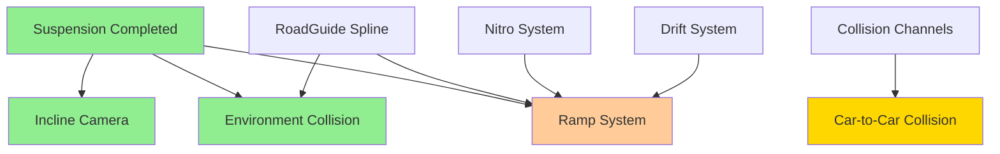

# Car Physics - Master Implementation Plan

**Breadcrumbs:** [Docs](../../../../) > [Features](../../../) > [Car Physics](../) > [Planning](./) > Master Plan

**Feature ID**: `car-physics`  
**Status**: 🔄 Development  
**Version**: 1.0.0  
**Date**: 2026-01-20

## Milestones

- [x] **Milestone 1: Foundation** - COMPLETED
  - ✅ Suspension physics system
  - ✅ Visual body tilt and roll
  - ✅ Performance optimization for mobile
  
- [x] **Milestone 2: Camera & Environment** - COMPLETED
  - ✅ Incline/decline camera effects
  - ✅ Environment collision refinement
  - ✅ Integration testing
  
- [ ] **Milestone 3: Car-to-Car Collision** - IN PROGRESS
  - [x] Collision channel setup
  - [x] Kinematic fake body implementation (AFakeCarBody exists)
  - [ ] Overlap detection refinement and visual effects
  
- [x] **Milestone 4: Airborne Mechanics** - PENDING
  - ✅ Ramp boost system (ARampZone implemented)
  - ✅ Air control (FAirControlSettings)
  - ✅ Auto-rotate and landing (FAntiRollInAir)
  - ⏸️ **Tạm ngưng sử dụng Ramp và nhảy xuống vực**

## Current Status Summary

| Feature | Status | Completion | Key Classes |
|---------|--------|------------|-------------|
| Suspension Physics | ✅ Done | 100% | UCustomSuspensionComponent |
| Incline Camera | ✅ Done | 100% | AFollowCarCamera, FInclineCameraSettings |
| Environment Collision | ✅ Done | 100% | FCollisionCorrectionSettings, FWallCollisionData |
| Car-to-Car Collision | 🔄 In Progress | 70% | AFakeCarBody, AKinematicFakeCarBody |
| Ramp & Airborne | ⏸️ Pending | 100% | ARampZone, FAirborneState (tạm ngưng) |

## Remaining Tasks: Car-to-Car Collision

### Task 1: Overlap Detection Refinement
**Estimated Effort**: 1-2 days  
**Priority**: High  
**Dependencies**: AFakeCarBody (exists)

- [ ] Refine 6 collision case detection
  - [ ] FrontLeft, FrontRight corners
  - [ ] RearLeft, RearRight corners
  - [ ] LeftSide, RightSide
  
- [ ] Implement DetermineCollisionCase
  - [ ] Calculate impact direction
  - [ ] Calculate forward/right dot products
  - [ ] Classify into one of 6 cases

- [ ] Test collision case accuracy (>95%)

### Task 2: Visual Shake Effects
**Estimated Effort**: 1 day  
**Priority**: Medium  
**Dependencies**: Task 1

- [ ] Create camera shake assets
  - [ ] Front corner shake (strong)
  - [ ] Rear corner shake (medium)
  - [ ] Side shake (light)
  
- [ ] Implement ApplyVisualShake
  - [ ] Select shake based on collision case
  - [ ] Apply to player controller
  - [ ] Scale intensity appropriately

### Task 3: Testing & Polish
**Estimated Effort**: 1 day  
**Priority**: High  
**Dependencies**: Tasks 1-2

- [ ] Unit tests
  - [ ] Collision case detection accuracy
  - [ ] Fake body sync accuracy
  
- [ ] Integration tests
  - [ ] Player pushes AI cars
  - [ ] AI cannot push player
  
- [ ] Manual testing
  - [ ] Feels powerful
  - [ ] Performance on mobile

## Verified Implementation Details

### Incline Camera System (Verified)

**FInclineCameraSettings** (from `FollowCarCamera.h`):
```cpp
float InclineFOVMultiplier = 1.1f;    // +10%
float DeclineFOVMultiplier = 1.1f;    // +10%
float InclineZOffset = 50.0f;          // +50cm up
float InclineXOffset = -30.0f;         // -30cm back
float InterpolationSpeed = 5.0f;
float InclineThreshold = 10.0f;        // Degrees
```

### Environment Collision (Verified)

**FCollisionCorrectionSettings** (from `SimulatePhysicsCar.h`):
```cpp
bool bIsUseImpulse = true;
float InterpolationSpeed = 2.0f;
float MaxCorrectionTorque = 2000.0f;
float AngleReductionFactor = 0.5f;     // 50% reduction
float TraceDistance = 500.0f;
float SmallAngleThreshold = 15.0f;
float LargeAngleThreshold = 45.0f;
float OutwardImpulseStrength = 50.0f;
```

### Ramp & Airborne (Verified - Pending)

**ARampZone** (from `RampZone.h/.cpp`):
```cpp
float BoostForce = 50000.0f;
// Boost direction follows vehicle velocity + upward component
// Cancels drift on entry
// Triggers OnRampBoost and OnVehicleSkillTriggered events
```

**FAirborneState** (from `SimulatePhysicsCar.h`):
```cpp
bool bIsAirborne = false;
float TimeInAir = 0.0f;
int32 WheelsInAir = 0;
FVector LaunchVelocity;
float MaxHeight = 0.0f;
```

**FAirControlSettings** (from `SimulatePhysicsCar.h`):
```cpp
float GroundSteeringSensitivity = 1.0f;
float AirSteeringMultiplier = 0.5f;    // 50% of ground
float YawStrength = 4.0f;
float RollStrength = 4.0f;
float PitchStrength = 4.0f;
```

**FAntiRollInAir** (from `SimulatePhysicsCar.h`):
```cpp
float MaxRollAngle = 45.0f;            // Degrees
float MaxPitchAngle = 60.0f;           // Upside down
float AntiRollPowerInAir = 3000.0;
float AntiPitchPowerInAir = 2000.0f;
```

## Dependencies



## Timeline & Estimates

| Phase | Feature | Estimated Days | Status |
|-------|---------|----------------|--------|
| 1 | Suspension Physics | - | ✅ Done |
| 2 | Incline Camera | - | ✅ Done |
| 3 | Environment Collision | - | ✅ Done |
| 4 | Ramp & Airborne | - | ⏸️ Pending |
| 5 | Car-to-Car Collision | 3-4 | 🔄 In Progress |

**Remaining**: 3-4 days for Car-to-Car Collision completion

## Risks & Mitigation

| Risk | Impact | Probability | Mitigation |
|------|--------|-------------|------------|
| Collision channel conflicts | High | Medium | Thorough testing, document matrix |
| Mobile performance degradation | High | Low | Already optimized, profile regularly |
| Kinematic body sync lag | Medium | Low | Async Physics Tick validated |

## Resources Needed

### Tools
- Unreal Engine 5.4+
- Android/iOS test devices
- Profiling tools (Unreal Insights)

### Assets
- Camera shake effects (Car Collision)
- Audio cues (optional)

## Related Documentation

- **Requirements**: `car-physics-overview.md`
- **Design**: `car-physics-architecture.md`
- **Implementation**: `car-physics-implementation-guide.md`
- **Testing**: `car-physics-testing-strategy.md`
