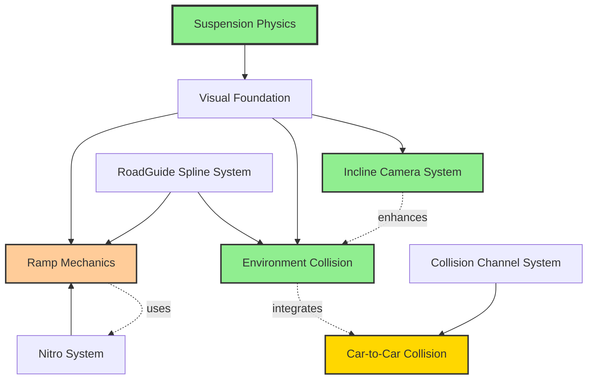
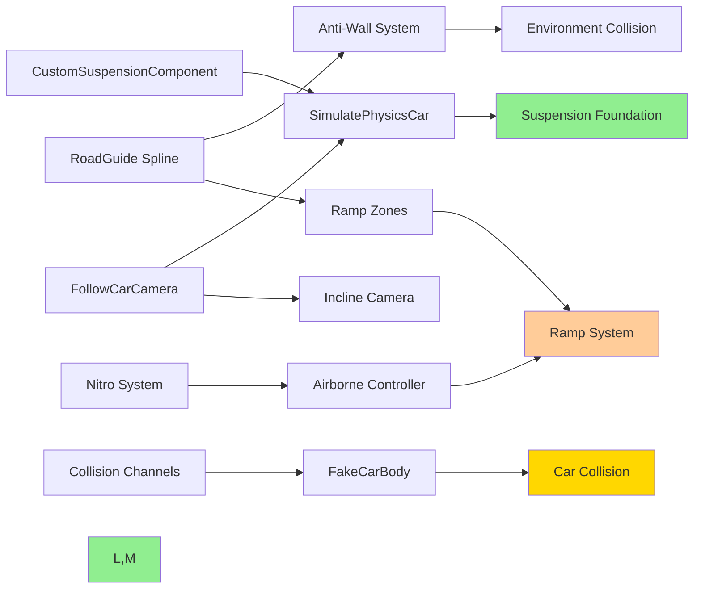

# Car Physics & Gameplay Mechanics - Overview

**Breadcrumbs:** [Docs](../../../../) > [Features](../../../) > [Car Physics](../) > [Requirements](./) > Overview

**Feature ID**: `car-physics`  
**Status**: 🔄 Development  
**Version**: 1.1.0
**Date**: 2026-01-26

## Executive Summary

Tài liệu này cung cấp tổng quan thống nhất về hệ thống vật lý xe và cơ chế gameplay. Các tính năng này phối hợp với nhau để mang lại trải nghiệm đua xe arcade-style được tối ưu cho nền tảng mobile (Android/iOS) với phản hồi hình ảnh chân thực và những khoảnh khắc gameplay hấp dẫn.

**User Story**: Là người chơi, tôi muốn trải nghiệm đua xe arcade phản hồi nhanh, hấp dẫn về mặt hình ảnh với phản hồi hệ thống treo chân thực, hiệu ứng camera động, xử lý va chạm linh hoạt, và những khoảnh khắc bay trên không thú vị, để tôi cảm thấy đắm chìm và kiểm soát được trong suốt cuộc đua.

## Feature Relationship Map



## Features Overview

### Suspension Physics ✅ COMPLETED
**Status**: Fully implemented and tested  
**Purpose**: Cung cấp phản hồi hệ thống treo hình ảnh chân thực với nghiêng và lắc thân xe

**Key Capabilities**:
- Hệ thống treo spring-damper cho mỗi bánh xe
- Nghiêng thân xe dựa trên nén hệ thống treo
- Lắc thân xe khi vào cua
- Animation hệ thống treo mượt mà
- Tối ưu hiệu năng cho mobile (Async Physics Tick)

**User Experience**: Người chơi thấy thân xe phản ứng tự nhiên với địa hình, cua và ổ gà, tăng cường sự đắm chìm và cung cấp phản hồi hình ảnh về trạng thái xe.

### Incline Camera System ✅ COMPLETED
**Status**: Fully implemented  
**Purpose**: Tăng cường cảm giác tốc độ và kịch tính khi lái trên dốc

**Key Capabilities** (verified from source code):
- Tự động tăng FOV (+10%) khi vào vùng dốc lên/xuống
- Điều chỉnh vị trí camera (Z-axis lên, X-axis lùi) để có tầm nhìn tốt hơn
- Bonus gia tốc: 130% khi lên dốc, 110% khi xuống dốc
- Nội suy mượt mà về trạng thái bình thường

**Implementation** (from `FollowCarCamera.h`):
```cpp
struct FInclineCameraSettings {
    float InclineFOVMultiplier = 1.1f;    // +10%
    float InclineZOffset = 50.0f;          // +50cm up
    float InclineXOffset = -30.0f;         // -30cm back
    float InterpolationSpeed = 5.0f;
    float InclineThreshold = 10.0f;        // Degrees
};
```

### Environment Collision ✅ COMPLETED
**Status**: Fully implemented  
**Purpose**: Cung cấp va chạm arcade-style linh hoạt với auto-correction

**Key Capabilities** (verified from source code):
- Giảm góc va chạm approximately 50% (giảm mức độ ảnh hưởng tiêu cực)
- Correction nội suy ngay lập tức về racing line
- Ngăn dính tường ở góc nhỏ
- Auto-correction cảm thấy hữu ích, không xâm phạm

**Implementation** (from `SimulatePhysicsCar.h`):
```cpp
struct FCollisionCorrectionSettings {
    bool bIsUseImpulse = true;
    float InterpolationSpeed = 2.0f;
    float MaxCorrectionTorque = 2000.0f;
    float AngleReductionFactor = 0.5f;     // 50% reduction
    float TraceDistance = 500.0f;
    float SmallAngleThreshold = 15.0f;
    float LargeAngleThreshold = 45.0f;
    float OutwardImpulseStrength = 50.0f;
};
```

### Car-to-Car Collision 🔄 IN PROGRESS
**Status**: 70% complete - AFakeCarBody exists, needs refinement  
**Purpose**: Cho người chơi lợi thế trong va chạm xe-xe

**Key Capabilities**:
- Xe người chơi có "trọng lượng" ưu tiên cao hơn xe AI
- Người chơi có thể đẩy xe AI ra khỏi đường đua
- Xe AI không thể ảnh hưởng đáng kể đến quỹ đạo người chơi
- Hiệu ứng rung hình ảnh truyền đạt va chạm (6 trường hợp va chạm)

**Technical Approach**:
1. **CarPriority Collision Channel**: Xe người chơi block môi trường, ignore xe AI
2. **Kinematic Fake Body**: Mesh ẩn trên WorldDynamic channel theo dõi xe người chơi chính xác
3. **Overlap Detection**: Box collider phát hiện 6 trường hợp va chạm (4 góc + 2 bên) cho hiệu ứng hình ảnh

### Ramp & Airborne ⏸️ IN PROGRESS
**Status**: Implemented but temporarily disabled  
**Purpose**: Tạo những khoảnh khắc bay trên không thú vị với quỹ đạo được kiểm soát

> **Note**: Tính năng Ramp và nhảy xuống vực hiện đang tạm ngưng sử dụng.

**Key Capabilities** (verified from source code):
- Boost lực cố định khi vào vùng ramp (quỹ đạo 4-6m)
- Hiệu ứng camera tương tự kích hoạt NOS
- 50% điều khiển lái khi trên không (giảm từ mặt đất)
- Auto-rotation correction nếu nghiêng >45° hoặc lộn ngược
- NOS có thể sử dụng khi trên không
- Hủy drift khi vào ramp

## Dependency Analysis

### Technical Dependencies



### Implementation Order

1. **Suspension Physics** (Completed) - Foundation for all visual feedback
2. **Incline Camera** (Completed) - Camera system with incline detection
3. **Environment Collision** (Completed) - Environment collision with auto-correction
4. **Ramp & Airborne** (In Progress) - Ramp boost and airborne mechanics
5. **Car-to-Car Collision** (In Progress) - Car collision with fake body system

### Cross-Feature Integration Points

| Feature A | Feature B | Integration Point | Status |
|-----------|-----------|-------------------|--------|
| Suspension | Incline Camera | Suspension data → Camera tilt | ✅ |
| Incline Camera | Environment Collision | Camera FOV + Auto-correction | ✅ |
| Environment Collision | Car Collision | Environment vs Car collision | 🔄 |
| Car Collision | Ramp & Airborne | Collision during airborne | ⏸️ |
| Ramp & Airborne | Nitro | Boost stacking | ⏸️ |

## Success Criteria

### Functional Requirements
- [x] Suspension visually responds to terrain and turns
- [x] Camera adjusts FOV/position on inclines within 0.2s
- [x] Auto-correction reduces collision angle by 50% ± 10%
- [ ] Player car pushes AI cars 100% of the time
- [x] Ramp boost achieves 4-6m height consistently (⏸️ In Progress)

### Performance Requirements (Mobile)

#### Android Targets
- **Frame Rate**: 30 FPS minimum, 60 FPS target ✅
- **Memory**: <2GB total usage ✅
- **Battery**: <10% drain per 10 minutes gameplay
- **Thermal**: No throttling within 20 minutes

#### iOS Targets
- **Frame Rate**: 60 FPS target ✅
- **Memory**: <1.5GB total usage ✅
- **Battery**: <8% drain per 10 minutes gameplay
- **Thermal**: No throttling within 30 minutes

## Platform Considerations

### Mobile Optimization Strategy

**Distance-Based Updates**:
- Player car (center actor): Continuous high-priority updates in main loop
- AI cars: Distance-based conditional updates relative to player
- VFX/Widgets: Object pooling for reuse

**Adaptive Quality**:
- Suspension simulation quality scales with device performance
- Camera interpolation speed adjusts based on frame rate
- Collision detection frequency adapts to CPU load

## Timeline Estimate

- **Car-to-Car Collision Completion**: 3-5 days remaining

## Related Documentation

- **Requirements**: suspension-physics.md, incline-camera.md, environment-collision.md, car-collision.md, ramp-airborne.md
- **Technical Guidance**: `Hướng dẫn kỹ thuật về va chạm giữa xe người chơi và xe của hệ thống.md`
- **Design**: `car-physics-architecture.md`
- **Planning**: `car-physics-master-plan.md`
- **Implementation**: `car-physics-implementation-guide.md`
- **Testing**: `car-physics-testing-strategy.md`

## Revision History

| Date | Version | Author | Changes |
|------|---------|--------|---------|
| 2025-11-04 | 1.0 | AI DevKit | Initial overview document created |
| 2025-12-30 | 2.0 | AI DevKit | Updated with verified source code, renamed to car-physics |
| 2025-12-30 | 2.1 | AI DevKit | Removed ME codes, use descriptive names |
