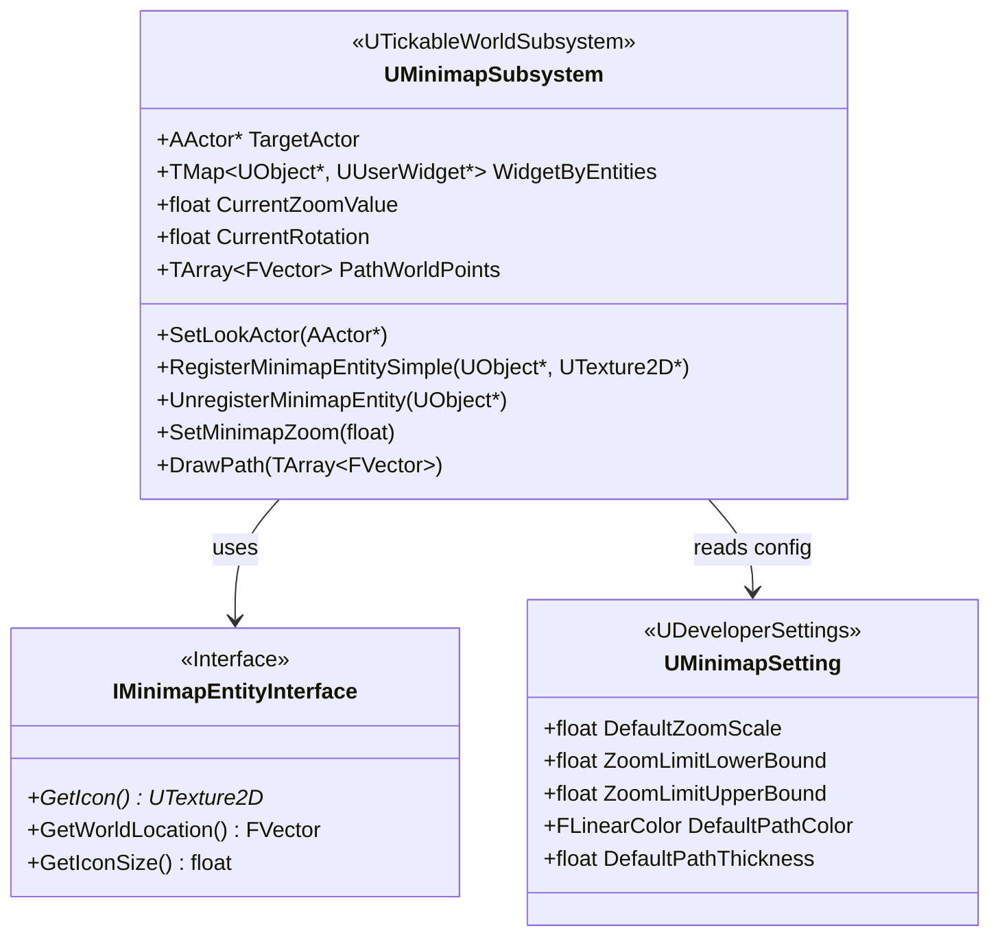

# Minimap System Design

**Feature ID**: `minimap-system`  
**Status**: 🔄 Development  
**Plugin**: Minimap by Radoshaka  
**Source of Truth**: `PrototypeRacing/Plugins/Minimap/Source/`

---

## 1. Overview

Minimap System là plugin third-party (by Radoshaka) cung cấp dynamic minimap cho VNRacing. Plugin được tích hợp sẵn tại `PrototypeRacing/Plugins/Minimap/`.

### Key Features
- Dynamic minimap với rotation và zoom
- Actor following (center of minimap)
- Markers/icons với hide/show
- Multi-segment line drawing (path)
- World map capture tool
- Fog of war support (optional)

---

## 2. Module Structure

```
PrototypeRacing/Plugins/Minimap/
├── Content/                    # Blueprint assets, widgets
├── Resources/                  # Plugin resources
├── Source/Minimap/
│   ├── Public/
│   │   ├── Minimap.h                    # Module definition
│   │   ├── MinimapSubsystem.h           # Core subsystem
│   │   ├── MinimapEntityInterface.h     # Entity interface
│   │   ├── MinimapDrawer.h              # Capture tool actor
│   │   ├── MinimapDefaultWidget.h       # Default icon widget
│   │   └── MinimapSetting.h             # Developer settings
│   └── Private/
│       └── [Implementation files]
└── Minimap.uplugin
```

---

## 3. Class Diagram



---

## 4. Core Classes

### 4.1 UMinimapSubsystem

**File**: `MinimapSubsystem.h`  
**Base Class**: `UTickableWorldSubsystem`

#### Properties

| Property | Type | Description |
|----------|------|-------------|
| `TargetActor` | `const AActor*` | Actor được follow làm center |
| `ManualCenterWorldLocation` | `FVector` | Manual center (khi không có TargetActor) |
| `WidgetByEntities` | `TMap<UObject*, UUserWidget*>` | Map entity → widget icon |
| `MapCenterLocation` | `FVector` | World center của map |
| `GameWorldSize` | `FVector2D` | Kích thước world map |
| `MapTexture` | `UTexture2D*` | Minimap texture |
| `CurrentZoomValue` | `float` | Current zoom (0-1) |
| `ZoomLowerLimit` | `float` | Min zoom (default 0.1) |
| `ZoomHigherLimit` | `float` | Max zoom (default 1.0) |
| `CurrentRotation` | `float` | Current rotation angle |
| `PathWorldPoints` | `TArray<FVector>` | Path points in world space |
| `PathColor` | `FLinearColor` | Path color |
| `PathThickness` | `float` | Path thickness (pixels) |

#### Delegates

| Delegate | Description |
|----------|-------------|
| `OnMinimapCenterActorRegister` | Fired khi set look actor |
| `OnMinimapCenterActorUnregister` | Fired khi clear look actor |
| `OnEntityAdded` | Fired khi entity được add |
| `OnEntityRemoved` | Fired khi entity bị remove |
| `OnZoomValueChange` | Fired khi zoom thay đổi |
| `OnRotationChange` | Fired khi rotation thay đổi |
| `OnPathPointsChange` | Fired khi path thay đổi |

#### Key Functions

```cpp
// === Center/Follow ===
void SetLookActor(const AActor* InTargetActor);
void ClearLookActor();
void UpdateCenterLocation(const FVector TargetLocation);

// === Entity Registration ===
void RegisterMinimapEntity(UObject* TargetObject, UUserWidget* EntryWidget);
void RegisterMinimapEntitySimple(UObject* TargetObject, UTexture2D* Icon);
void UnregisterMinimapEntity(UObject* TargetObject);
UUserWidget* GetWidgetOfThisEntity(UObject* TargetObject);

// === World Data ===
void RegisterGameWorldData(FVector InCenterLocation, FVector2D GameWorldMapSize, 
                           float Orientation, UTexture2D* MinimapTexture);

// === Zoom ===
void SetMinimapZoom(float Value);
void UpdateZoomValue(float IncrementalValue);
void UpdateZoomLimit(float InLowerLimit, float InHigherLimit);

// === Rotation ===
void SetMinimapRotation(float Angle);
void RotateMinimap(float IncrementalAngle);

// === Path Drawing ===
void DrawPath(const TArray<FVector>& WorldPoints);
void ClearPath();
void SetPathColor(FLinearColor Color);
void SetPathThickness(float Thickness);

// === Utility ===
FVector GetWorldPointFromMinimap(FVector2D MinimapPoint);
```

---

### 4.2 IMinimapEntityInterface

**File**: `MinimapEntityInterface.h`

```cpp
class IMinimapEntityInterface
{
public:
    // Get icon texture cho entity
    UFUNCTION(BlueprintNativeEvent, BlueprintCallable)
    UTexture2D* GetIcon();

    // Get world location của entity
    UFUNCTION(BlueprintNativeEvent, BlueprintCallable)
    FVector GetWorldLocation();

    // Get icon size
    UFUNCTION(BlueprintNativeEvent, BlueprintCallable)
    float GetIconSize();
};
```

---

### 4.3 UMinimapSetting

**File**: `MinimapSetting.h`  
**Base Class**: `UDeveloperSettings`  
**Location**: Project Settings → Plugins → Minimap

```cpp
UCLASS(Config=Game, defaultconfig, meta = (DisplayName="Minimap"))
class UMinimapSetting : public UDeveloperSettings
{
    float DefaultZoomScale = 0.25f;
    float ZoomLimitLowerBound = 0.1f;
    float ZoomLimitUpperBound = 1.0f;
    FLinearColor DefaultPathColor = FLinearColor::White;
    float DefaultPathThickness = 1.0f;
};
```

---

### 4.4 UMinimapDefaultWidget

**File**: `MinimapDefaultWidget.h`  
**Base Class**: `UUserWidget`

```cpp
UCLASS()
class UMinimapDefaultWidget : public UUserWidget
{
    UPROPERTY(VisibleAnywhere, BlueprintReadOnly, meta = (BindWidgetOptional))
    TObjectPtr<UImage> IconImage;
};
```

---

### 4.5 AMinimapDrawer

**File**: `MinimapDrawer.h`  
**Base Class**: `AActor`  
**Purpose**: Editor tool để capture world map texture

---

## 5. Integration Guide

### Setup World Map

1. Add `BP_MinimapDrawerAssistant` vào level
2. Position white quad để cover track area (uniform scale only)
3. Click "Capture" trong Details panel → Minimap category
4. Output: `Saved/Minimap/CaptureImage.jpg`
5. Edit image nếu cần, import vào project
6. Assign texture vào BP_MinimapDrawerAssistant

### Set Look Actor

```cpp
UMinimapSubsystem* MinimapSubsystem = GetWorld()->GetSubsystem<UMinimapSubsystem>();
MinimapSubsystem->SetLookActor(PlayerPawn);
```

### Register Entity

```cpp
// Entity phải implement IMinimapEntityInterface
// BeginPlay
MinimapSubsystem->RegisterMinimapEntitySimple(this, VehicleIcon);

// EndPlay - QUAN TRỌNG!
MinimapSubsystem->UnregisterMinimapEntity(this);
```

### Implement IMinimapEntityInterface

```cpp
class AMyVehicle : public APawn, public IMinimapEntityInterface
{
public:
    virtual UTexture2D* GetIcon_Implementation() override { return VehicleIcon; }
    virtual FVector GetWorldLocation_Implementation() override { return GetActorLocation(); }
    virtual float GetIconSize_Implementation() override { return 32.0f; }
};
```

### Draw Path

```cpp
TArray<FVector> PathPoints;
PathPoints.Add(FVector(0, 0, 0));
PathPoints.Add(FVector(1000, 500, 0));

MinimapSubsystem->SetPathColor(FLinearColor::Yellow);
MinimapSubsystem->SetPathThickness(3.0f);
MinimapSubsystem->DrawPath(PathPoints);

// Clear
MinimapSubsystem->ClearPath();
```

---

## 6. Configuration

### Project Settings

| Setting | Default | Description |
|---------|---------|-------------|
| `DefaultZoomScale` | 0.25 | Initial zoom level |
| `ZoomLimitLowerBound` | 0.1 | Minimum zoom |
| `ZoomLimitUpperBound` | 1.0 | Maximum zoom |
| `DefaultPathColor` | White | Default path color |
| `DefaultPathThickness` | 1.0 | Default path thickness (px) |

### Runtime

```cpp
MinimapSubsystem->SetMinimapZoom(0.5f);
MinimapSubsystem->UpdateZoomLimit(0.2f, 0.8f);
MinimapSubsystem->SetMinimapRotation(45.0f);
```

---

## 7. Performance

### Memory Budget

| Component | Size |
|-----------|------|
| Minimap Texture (1024x1024) | ~4 MB |
| Widget instances | ~0.5 MB |
| Entity data | ~0.2 MB |
| **Total** | **~5 MB** |

### Optimization
- Texture Size: Recommend 1024x1024
- Icon Pooling: Plugin tự quản lý
- Update Frequency: Subsystem tick mỗi frame

---

## 8. Dependencies

- **UMG**: Widget framework
- **RenderCore**: Render target capture
- None external (self-contained plugin)

---

## References

- [Plugin README](../../../../PrototypeRacing/Plugins/Minimap/README.md)
- [Requirements](../requirements/README.md)
- [Implementation](../implementation/README.md)
