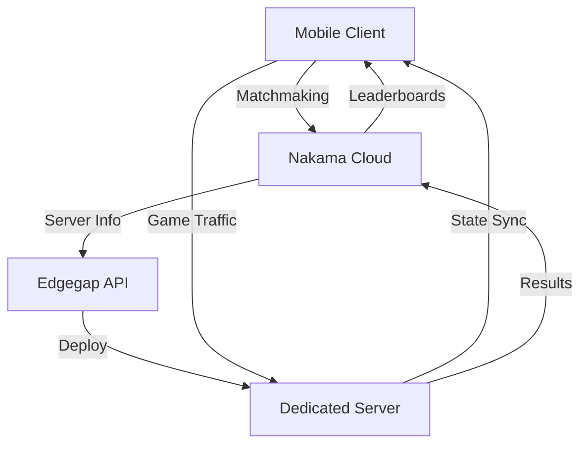
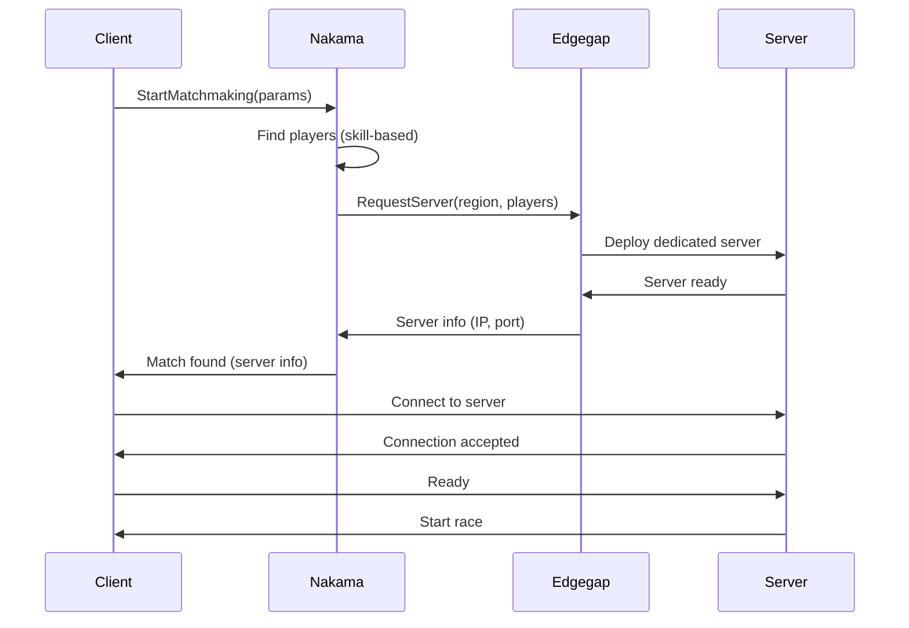

# Multiplayer Feature

**Version:** 1.0.0 | **Date:** 2026-01-20 | **Status:** Planned


**Breadcrumbs:** [Docs](../../) > [Features](../) > Multiplayer

**Feature ID**: `multiplayer`  
**Priority**: Critical  
**Owner**: Network Team

---

## Overview

The Multiplayer feature enables competitive online racing for PrototypeRacing, powered by **Nakama** for matchmaking and **Edgegap** for dedicated servers. Players can compete in real-time races, climb leaderboards, and participate in tournaments across the VN-Tour campaign.

### Key Capabilities

- **Matchmaking**: Skill-based matchmaking via Nakama
- **Dedicated Servers**: Low-latency Edgegap servers
- **Real-Time Racing**: 2-8 player races with network synchronization
- **Leaderboards**: Global and city-specific rankings
- **Tournaments**: Weekly and seasonal competitive events
- **Social Features**: Friends, clans, chat (future)

---

## Feature Structure

```
multiplayer/
├── requirements/       # Matchmaking, server, networking requirements
├── design/            # Network architecture, replication, anti-cheat
├── planning/          # Implementation plan, team assignments, timeline
├── implementation/    # UMatchServiceSubsystem, server code, replication
└── testing/           # Network testing, latency, stress testing
```

**Source Code Location:** `Source/PrototypeRacing/Private/BackendSubsystem/`

---

## Quick Links

### Requirements
- [Multiplayer Overview](requirements/multiplayer.md) - Feature overview
- [Multiplayer Breakdown](requirements/breakdown_multiplayer.md) - Detailed breakdown
- [README Multiplayer Plan](requirements/README_Multiplayer_Plan.md) - Planning overview
- [Implementation Plan (5 Devs)](requirements/Implementation_Plan_5_Devs.md) - Team plan
- [Implementation Summary V2](requirements/Implementation_Summary_v2.md) - Summary
- [Gantt Chart](requirements/Gantt_Chart_Optimized_Timeline.md) - Timeline
- [Quick Reference](requirements/Quick_Reference_Team_Assignments.md) - Team assignments
- [YouTrack Tasks](requirements/YouTrack_Tasks_Import.md) - Task breakdown

---

## Architecture

### Network Stack



### Components

1. **Nakama Cloud**: Matchmaking, authentication, leaderboards, cloud storage
2. **Edgegap**: Dedicated server deployment and orchestration
3. **UE5 Replication**: Server-authoritative game state synchronization
4. **Client Prediction**: Smooth local movement with server reconciliation

---

## Matchmaking System

### UMatchServiceSubsystem

**Purpose**: Manages matchmaking flow via Nakama

```cpp
UCLASS()
class UMatchServiceSubsystem : public UGameInstanceSubsystem
{
    GENERATED_BODY()

public:
    // Matchmaking
    UFUNCTION(BlueprintCallable)
    void StartMatchmaking(const FMatchMakingRequest& Params);

    UFUNCTION(BlueprintCallable)
    void CancelMatchmaking();

    UFUNCTION(BlueprintPure)
    EMatchmakingState GetMatchmakingState() const;

    // Server Connection
    UFUNCTION(BlueprintCallable)
    void ConnectToServer(const FServerInfo& ServerInfo);

    UFUNCTION(BlueprintCallable)
    void DisconnectFromServer();

    // Events
    UPROPERTY(BlueprintAssignable)
    FOnMatchFound OnMatchFound;

    UPROPERTY(BlueprintAssignable)
    FOnMatchmakingFailed OnMatchmakingFailed;

    UPROPERTY(BlueprintAssignable)
    FOnServerConnected OnServerConnected;
};
```

### Matchmaking Flow



---

## Matchmaking Parameters

### FMatchMakingRequest
```cpp
USTRUCT(BlueprintType)
struct FMatchMakingRequest
{
    GENERATED_BODY()

    UPROPERTY(BlueprintReadWrite)
    int32 MapId;

    UPROPERTY(BlueprintReadWrite)
    FString MapName;

    UPROPERTY(BlueprintReadWrite)
    ERaceMode RaceMode;

    UPROPERTY(BlueprintReadWrite)
    int MatchMakingRanking; // ELO-based ranking for matchmaking
};
```

### FPlayerInfo
```cpp
USTRUCT(BlueprintType)
struct FPlayerInfo
{
    GENERATED_BODY()

    UPROPERTY(BlueprintReadWrite)
    FString UserId;

    UPROPERTY(BlueprintReadWrite)
    FString Username;

    UPROPERTY(BlueprintReadWrite)
    FString SessionId;

    UPROPERTY(BlueprintReadWrite)
    bool IsReady;

    UPROPERTY(BlueprintReadWrite)
    bool IsHost;
};
```

### Skill-Based Matchmaking

**ELO Rating System**:
- Starting rating: 1000
- Win: +25 rating (adjusted by opponent rating)
- Loss: -25 rating (adjusted by opponent rating)
- Matchmaking range: ±150 rating (expands after 30s)

**Matchmaking Priority**:
1. Skill rating match (±150)
2. Region match (low latency)
3. Wait time (expand range after 30s)
4. Fill with AI if needed (after 60s)

---

## Server Architecture

### Edgegap Integration

**Server Deployment**:
```cpp
// Request server from Edgegap
POST /v1/deploy
{
    "app_name": "prototyperacing",
    "version": "1.0.0",
    "ip_list": ["player1_ip", "player2_ip", ...],
    "webhook_url": "https://api.prototyperacing.com/edgegap/webhook"
}

// Response
{
    "request_id": "abc123",
    "fqdn": "server.edgegap.net",
    "ports": {
        "game": {"external": 7777, "internal": 7777}
    },
    "public_ip": "1.2.3.4"
}
```

**Server Lifecycle**:
1. Match found → Deploy server
2. Players connect → Server ready
3. Race starts → Game loop
4. Race ends → Results to Nakama
5. Players disconnect → Server shutdown (after 60s)

---

## Network Replication

### Server-Authoritative Model

**Replicated Actors**:
- `AGameState`: Race state, lap counts, positions
- `APlayerState`: Player info, lap times, position
- `AVehiclePawn`: Vehicle transform, physics state

**Replication Strategy**:
```cpp
// Vehicle replication
void AVehiclePawn::GetLifetimeReplicatedProps(TArray<FLifetimeProperty>& OutLifetimeProps) const
{
    Super::GetLifetimeReplicatedProps(OutLifetimeProps);
    
    // Replicate to all clients
    DOREPLIFETIME(AVehiclePawn, VehicleTransform);
    DOREPLIFETIME(AVehiclePawn, VehicleVelocity);
    DOREPLIFETIME(AVehiclePawn, CurrentLap);
    
    // Replicate to owner only
    DOREPLIFETIME_CONDITION(AVehiclePawn, InputState, COND_OwnerOnly);
}
```

### Client Prediction

**Movement Prediction**:
- Client predicts own vehicle movement
- Server validates and corrects
- Smooth reconciliation on mismatch
- Other vehicles use interpolation

**Update Frequency**:
- Player vehicle: 60 Hz (server → client)
- Other vehicles: 30 Hz (interpolated to 60 Hz)
- Game state: 10 Hz

---

## Leaderboards

### Nakama Leaderboards

**Leaderboard Types**:
- **Global**: All players worldwide
- **City**: Per VN-Tour city
- **Track**: Per individual track
- **Weekly**: Reset every Monday
- **All-Time**: Permanent records

**Leaderboard Structure**:
```cpp
// Submit score to Nakama
POST /v2/leaderboard/{leaderboard_id}/record
{
    "score": 125000, // Race time in milliseconds
    "subscore": 3,   // Stars earned
    "metadata": {
        "vehicle_id": "car_001",
        "track_id": "hanoi_01"
    }
}
```

---

## Anti-Cheat Measures

### Server Validation

**Movement Validation**:
```cpp
// Server validates client movement
bool AServerVehicle::ValidateMovement(const FVector& NewLocation, float DeltaTime)
{
    float MaxDistance = MaxSpeed * DeltaTime * 1.1f; // 10% tolerance
    float ActualDistance = FVector::Dist(CurrentLocation, NewLocation);
    
    if (ActualDistance > MaxDistance)
    {
        // Reject movement, teleport back
        ClientCorrectPosition(CurrentLocation);
        return false;
    }
    
    return true;
}
```

**Race Time Validation**:
- Minimum lap time enforcement
- Checkpoint validation
- Speed limit checks
- Impossible time detection

**Input Validation**:
- Input rate limiting
- Input range validation
- Macro detection

---

## Performance Targets

| Metric | Target | Current |
|--------|--------|---------|
| **Matchmaking Time** | <30s | 🔄 Testing |
| **Server Deploy Time** | <15s | 🔄 Testing |
| **Network Latency** | <100ms | 🔄 Testing |
| **Tick Rate** | 60 Hz | ✅ 60 Hz |
| **Max Players** | 8 | 🔄 4 (testing) |

---

## Implementation Timeline

### Phase 1: Foundation (Weeks 1-2)
- Nakama integration
- Authentication system
- Basic matchmaking

### Phase 2: Server Infrastructure (Weeks 3-4)
- Edgegap integration
- Dedicated server setup
- Server deployment automation

### Phase 3: Replication (Weeks 5-6)
- Vehicle replication
- Game state synchronization
- Client prediction

### Phase 4: Features (Weeks 7-8)
- Leaderboards
- Tournaments
- Anti-cheat

### Phase 5: Polish (Weeks 9-10)
- Performance optimization
- Bug fixes
- Stress testing

---

## Dependencies

### Internal Dependencies
- **Racing Car Physics**: Vehicle replication
- **Progression System**: XP, rewards from multiplayer
- **Race Modes**: Multiplayer race modes
- **UI/UX System**: Matchmaking UI, lobby

### External Dependencies
- **Nakama Cloud**: Matchmaking, leaderboards, authentication
- **Edgegap**: Dedicated server deployment
- **UE5 Replication**: Network framework

---

## Testing Strategy

### Network Testing
- Latency simulation (50ms, 100ms, 200ms)
- Packet loss testing (1%, 5%, 10%)
- Disconnection recovery
- Reconnection handling

### Stress Testing
- 100+ concurrent matches
- Server scaling
- Matchmaking queue stress
- Database load

### Security Testing
- Anti-cheat validation
- Input validation
- Server authority enforcement

---

## Related Features

- [Racing Car Physics](../racing-car-physics/README.md) - Vehicle replication
- [Race Modes](../race-modes/README.md) - Multiplayer race modes
- [Progression System](../progression-system/README.md) - Multiplayer rewards

---

## References

### Architecture
- [API Integration Map](../../_cross-reference/api-integration-map.md)
- [Security Architecture](../../_architecture/security-architecture.md)

---

**Last Updated:** 2026-01-26

**Last synced with source code:** 2026-01-26

