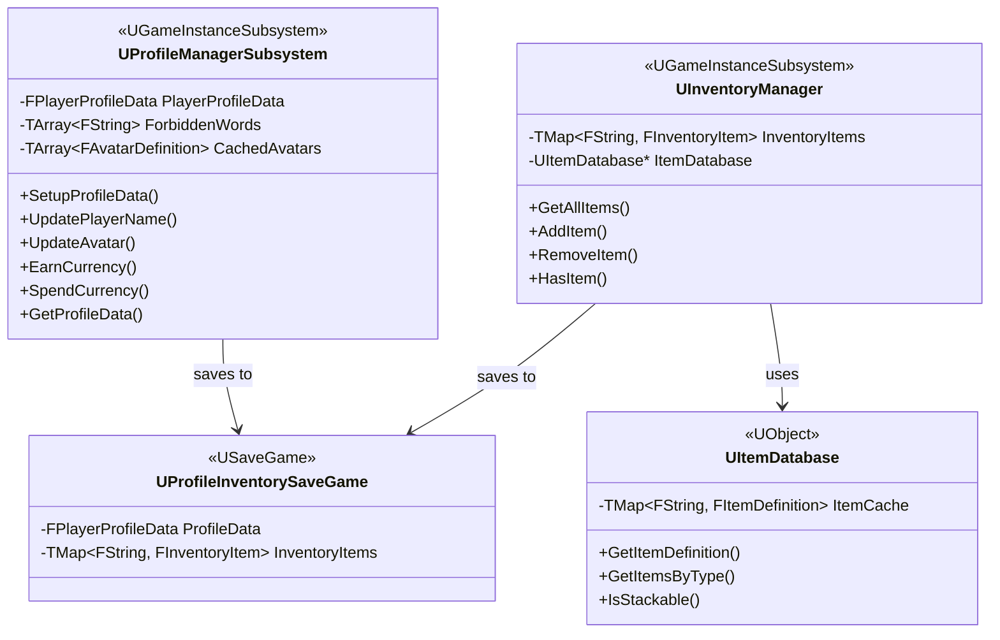

# Profiles & Inventory Design

**Feature ID**: `profiles-inventory`  
**Status**: 🔄 Development  
**Source of Truth**: `PrototypeRacing/Source/PrototypeRacing/Public/`

---

## 1. Architecture Overview

### Module Structure (Actual Implementation)

```
PrototypeRacing/Source/PrototypeRacing/
├── Public/
│   ├── BackendSubsystem/
│   │   ├── ProfileManagerSubsystem.h    # Core profile management
│   │   └── ProfileInventorySaveGame.h   # SaveGame class
│   └── InventorySystem/
│       ├── InventoryManager.h           # Inventory management
│       └── ItemDatabase.h               # Item definitions
└── Private/
    └── [Implementation files]
```

### Class Diagram



---

## 2. Core Classes

### 2.1 UProfileManagerSubsystem

**File**: `BackendSubsystem/ProfileManagerSubsystem.h`  
**Base Class**: `UGameInstanceSubsystem`

#### Enums

```cpp
enum class EVIPStatus : uint8 { Casual = 0, VIP = 1 };

enum class ERaceRank : uint8 { FirstPlace, SecondPlace, ThirdPlace, OtherPlace };

enum class EUpdateFailReason : uint8 {
    None, InvalidName, NameTooShort, NameTooLong,
    NameContainsSpecialChar, ServerError, InvalidFormat, ContainsForbiddenWord
};

enum class ECurrencyType : uint8 { Cash = 0, Coin = 0 };
```

#### Key Structs

```cpp
// Player Profile Data
USTRUCT(BlueprintType)
struct FPlayerProfileData
{
    FText PlayerName;
    FName PlayerID;
    FName AvatarID = FName(TEXT("1"));
    int32 PlayerLevel = 1;
    FPlayerCurrency PlayerCurrency;
    EVIPStatus VIPStatus = EVIPStatus::VIP;
    
    // Stats
    float OnlineTime = 0.f;
    float TopSpeed = 0.f;
    float TotalRaceTime = 0.f;
    int32 TotalRaces = 0;
    float WinRate = 0.f;
    int32 FirstPlaceCount, SecondPlaceCount, ThirdPlaceCount, OtherPlaceCount;
    
    // Unlock Progress
    FUnlockProgress UnlockedCarProgress, UnlockedTrackProgress, UnlockedCityProgress;
    
    // Economy
    int32 TotalCashEarned = 0;
    int32 TotalCashSpent = 0;
};

// Unlock Progress
USTRUCT(BlueprintType)
struct FUnlockProgress
{
    int32 Unlocked = 0;
    int32 Total = 0;
};

// Player Currency
USTRUCT(BlueprintType)
struct FPlayerCurrency
{
    TMap<ECurrencyType, int32> Values; // Cash=0, Coin=0
};
```

#### Key Functions

```cpp
// Setup
void SetupProfileData(UDataTable* InAvatarDataTable, UDataTable* InForbiddenWordDataTable);

// Profile Management
void UpdatePlayerName(const FText& NewName);
bool VerifyPlayerName(const FText InPlayerName);
void UpdateAvatar(const FName& NewAvatarID);
void UpdateVIPStatus(EVIPStatus NewStatus);

// Stats
void AddOnlineTime(const float Seconds);
void AddRaceTime(const float Seconds);
void UpdateTopSpeed(float NewSpeed);
void AddRaceRank(ERaceRank RaceRank, int Count = 1);
void AddTotalRaces(int32 Count = 1);

// Currency
void EarnCurrency(int32 Amount, const ECurrencyType Type = ECurrencyType::Cash);
bool SpendCurrency(int32 Amount, const ECurrencyType Type = ECurrencyType::Cash);
bool HasEnoughCurrency(int32 Amount, const ECurrencyType Type = ECurrencyType::Cash);
int32 GetCurrentCurrencyByType(const ECurrencyType Type) const;

// Data Access
FPlayerProfileData GetProfileData() const;

// Name Validation
bool IsValidPlayerName(const FString& PlayerName, TArray<EUpdateFailReason>& OutReasons);
bool ContainsBadWords(const FString& PlayerName);
static FString NormalizeForFilter(const FString& Name); // Leetspeak: a→4, e→3, i→1, o→0, s→5, t→7
```

#### Delegates

| Delegate | Signature |
|----------|-----------|
| `OnProfileUpdated` | `FPlayerProfileData` |
| `OnPlayerNameUpdateSuccess` | `void` |
| `OnPlayerNameUpdateFail` | `TArray<EUpdateFailReason>` |
| `OnCurrencyChanged` | `ECurrencyType, int32` |
| `OnNotEnoughCurrency` | `ECurrencyType, int32` |

---

### 2.2 UInventoryManager

**File**: `InventorySystem/InventoryManager.h`  
**Base Class**: `UGameInstanceSubsystem`

#### Constants

```cpp
static constexpr int32 Max_Items = 999;
static constexpr int32 Max_Unique_Items = 200;
```

#### Key Functions

```cpp
// Item Access
TArray<FInventoryItem> GetAllItems() const;
TArray<FInventoryItem> GetItemsByType(EItemType Type) const;
FInventoryItem GetItem(const FString& ItemID) const;
bool HasItem(const FString& ItemID, int32 MinQuantity = 1) const;
int32 GetItemCount(const FString& ItemID) const;

// Item Management
bool AddItem(const FString& ItemID, int32 Quantity = 1, const FString& Source = TEXT(""));
bool RemoveItem(const FString& ItemID, int32 Quantity = 1);
void SetItemEquipped(const FString& ItemID, bool bEquipped);
void SetItemFavorite(const FString& ItemID, bool bFavorite);
void AddItems(const TArray<FInventoryItem>& Items, const FString& Source = TEXT(""));

// Save/Load
void SaveInventoryItemsToSaveGame();
void LoadInventoryItemsFromSaveGame();
```

#### Delegates

| Delegate | Signature |
|----------|-----------|
| `OnInventoryUpdated` | `void` |
| `OnItemAdded` | `FString ItemID, int32 AddedAmount, FInventoryItem` |
| `OnItemRemoved` | `FString ItemID, int32 RemovedAmount, FInventoryItem` |

---

### 2.3 UItemDatabase

**File**: `InventorySystem/ItemDatabase.h`  
**Base Class**: `UObject`

#### Enums

```cpp
enum class EItemType : uint8 {
    CarVisual,        // CCV - Car Visual Customization
    CarPerformance,   // CCP - Car Performance Upgrade
    LootCrate,        // LC
    Ticket,
    Currency,
    Other
};

enum class EItemRarity : uint8 { Common, Uncommon, Rare };
```

#### Key Structs

```cpp
// Inventory Item
USTRUCT(BlueprintType)
struct FInventoryItem
{
    FString ItemID;
    int32 Quantity = 1;
    FDateTime AcquiredDate;
    FString AcquisitionSource = TEXT("Default");
    bool bIsEquipped = false;
    bool bIsFavorite = false;
    int32 UsageCount = 0;
};

// Item Definition (DataTable Row)
USTRUCT(BlueprintType)
struct FItemDefinition : public FTableRowBase
{
    // Basic
    FString ItemID;
    FText DisplayName;
    FText Description;
    
    // Classification
    EItemType ItemType = EItemType::Other;
    EItemRarity Rarity = EItemRarity::Common;
    bool bIsStackable = true;
    
    // Visual
    TSoftObjectPtr<UTexture2D> Icon;
    FLinearColor RarityColor;
    
    // Visual Item specific
    FString CarGroup;
    FString PartType;
    TSoftObjectPtr<UStaticMesh> MeshAsset;
    
    // Performance Item specific
    int32 UpgradeLevel = 0;
    FPerformanceModifiers StatModifications;
    
    // Economy
    int32 PurchasePrice = 0;
    int32 SellPrice = 0;
    float DropRate = 0.0f;
};

// Default Settings
USTRUCT(BlueprintType)
struct FInventoryDefaultSettings
{
    int32 CarVisualQuantity = 1;
    int32 CarPerformanceQuantity = 999;
    int32 LootCrateQuantity = 999;
};
```

#### Key Functions

```cpp
FItemDefinition GetItemDefinition(const FString& ItemID) const;
bool ItemExists(const FString& ItemID) const;
bool IsStackable(const FString& ItemID) const;
EItemType GetItemType(const FString& ItemID) const;
TArray<FItemDefinition> GetAllItems() const;
TArray<FItemDefinition> GetItemsByType(EItemType Type) const;
TArray<FItemDefinition> GetItemsByRarity(EItemRarity Rarity) const;
TArray<FItemDefinition> GetItemsForCar(const FString& CarGroup) const;
```

---

### 2.4 UProfileInventorySaveGame

**File**: `BackendSubsystem/ProfileInventorySaveGame.h`  
**Base Class**: `USaveGame`

```cpp
UCLASS()
class UProfileInventorySaveGame : public USaveGame
{
public:
    void SetProfileData(FPlayerProfileData InProfileData);
    FPlayerProfileData GetPlayerProfileData();
    
    void SetInventoryItemData(TMap<FString, FInventoryItem> InInventoryItems);
    TMap<FString, FInventoryItem> GetInventoryItems();
    
    void SetSyncTime(FDateTime InLastSyncTime);
    FDateTime GetSyncTime();
    
    int32 SaveVersion = 1;

private:
    FPlayerProfileData ProfileData;
    TMap<FString, FInventoryItem> InventoryItems;
    FDateTime LastSyncTime;
    bool bPendingSync = false;
    FString SyncChecksum;
};
```

---

## 3. Integration Guide

### Setup Profile System

```cpp
UProfileManagerSubsystem* ProfileManager = GetGameInstance()->GetSubsystem<UProfileManagerSubsystem>();
ProfileManager->SetupProfileData(AvatarDataTable, ForbiddenWordDataTable);

if (ProfileManager->GetProfileData().PlayerID.IsNone())
{
    ProfileManager->InitPlayerId(UProfileManagerSubsystem::GeneratePlayerId());
}
```

### Currency Management

```cpp
// Earn
ProfileManager->EarnCurrency(1000, ECurrencyType::Cash);

// Spend
if (ProfileManager->SpendCurrency(500, ECurrencyType::Cash)) { /* Success */ }

// Check
int32 Balance = ProfileManager->GetCurrentCurrencyByType(ECurrencyType::Cash);
```

### Inventory Management

```cpp
UInventoryManager* InventoryManager = GetGameInstance()->GetSubsystem<UInventoryManager>();

// Add
InventoryManager->AddItem(TEXT("CCP_LV4_001"), 5, TEXT("race_reward"));

// Check
if (InventoryManager->HasItem(TEXT("CCP_LV4_001"), 3)) { /* Has at least 3 */ }

// Remove
InventoryManager->RemoveItem(TEXT("CCP_LV4_001"), 2);

// Get by type
TArray<FInventoryItem> Items = InventoryManager->GetItemsByType(EItemType::CarPerformance);
```

---

## 4. Name Validation

### Rules

| Rule | Constraint | Error |
|------|------------|-------|
| Length | 3-20 chars | `NameTooShort` / `NameTooLong` |
| Format | Alphanumeric + spaces | `NameContainsSpecialChar` |
| Profanity | No bad words | `ContainsForbiddenWord` |

### Profanity Filter

- Case-insensitive matching
- Leetspeak detection (a→4, e→3, i→1, o→0, s→5, t→7)
- Partial word matching
- Vietnamese + English bad words từ DataTable

---

## 5. DataTables Required

| DataTable | Row Struct | Purpose |
|-----------|------------|---------|
| Avatar | `FAvatarDefinition` | Avatar ID + Texture |
| ForbiddenWords | `FForbiddenWordDefinition` | Bad words list |
| ItemDefinitions | `FItemDefinition` | Item database |

---

## 6. Limits & Performance

| Limit | Value |
|-------|-------|
| Max Items per stack | 999 |
| Max Unique Items | 200 |
| Name length | 3-20 chars |

---

## 7. Dependencies

### Internal
- **CarCustomizationSystem**: Car unlock progress
- **ProgressionSystem**: Track/City unlock progress
- **CarSaveGameManager**: Save management

### External
- **DataTables**: Avatar, ForbiddenWords, ItemDefinitions

---

## References

- [Requirements](../requirements/README.md)
- [Implementation](../implementation/README.md)
- [UserProfile_Inventory_V5.md](../requirements/UserProfile_Inventory_V5.md)
- [Items_V5.md](../requirements/Items_V5.md)
