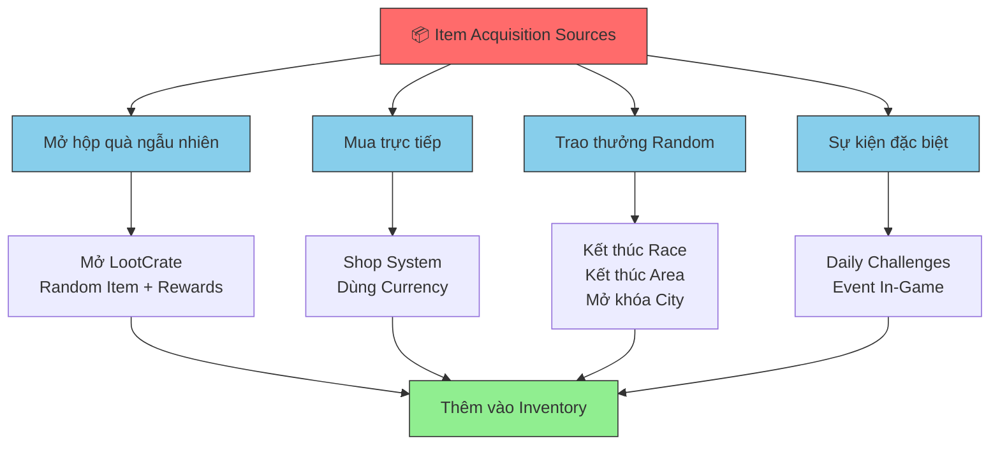
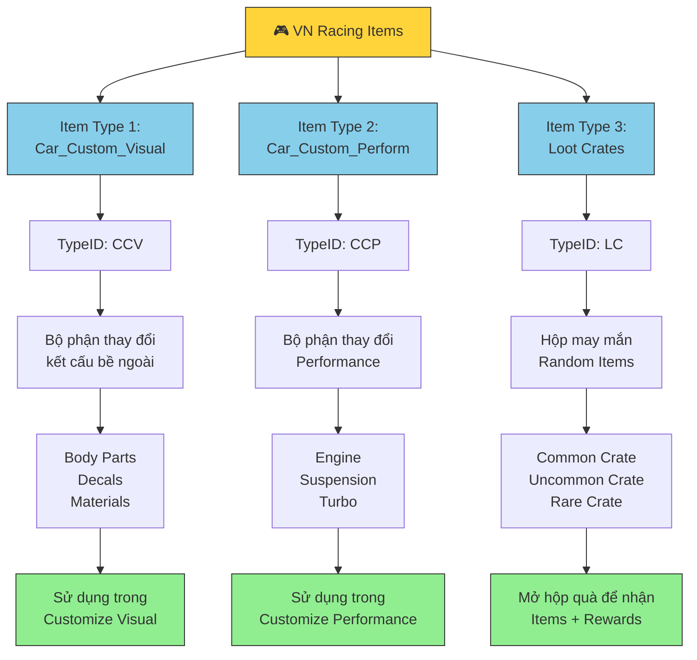
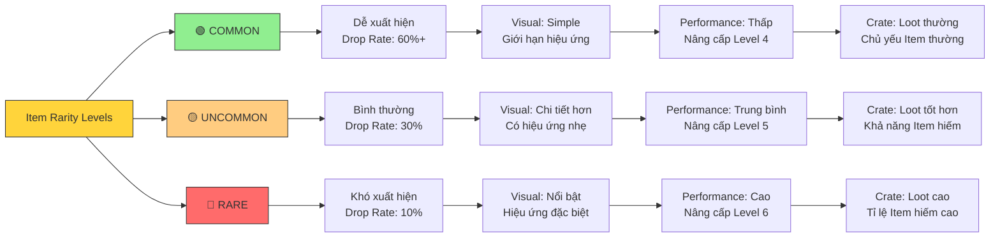
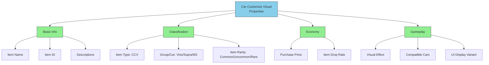
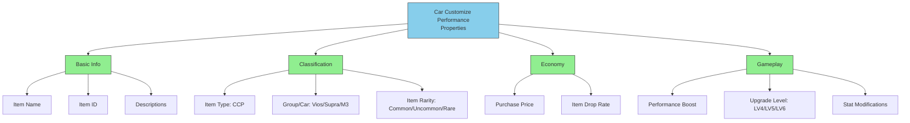
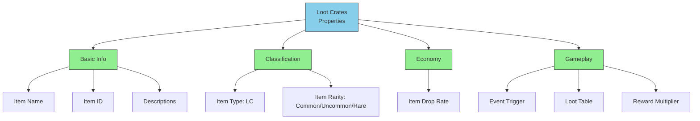
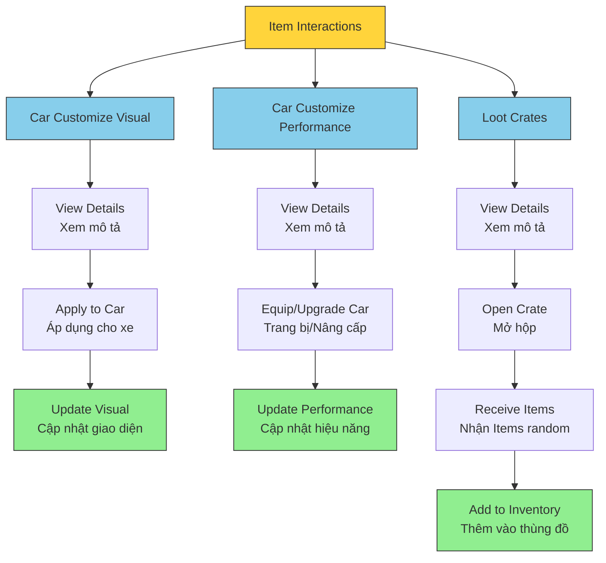
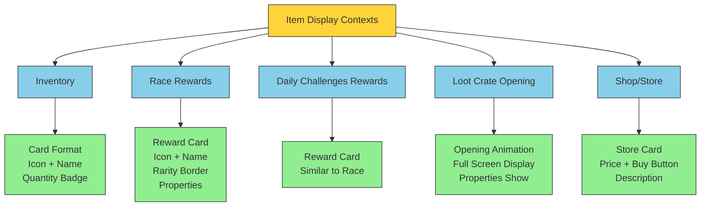
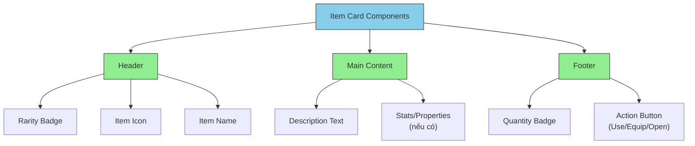

# VN RACING ITEMS

*GDD Overview định nghĩa Items trong VN Racing*

## Change Log

- **First Version (20250923)**

- **Ver 2 (20251111)**
  - Update các Categories Item sẽ có trong đợt Release 26/12/2025.
  - Update các Items trong các Categories.

- **Ver 5 (20251215)**
  - Chỉnh sửa cấu trúc văn bản theo format của UserProfile_Inventory_V5 và Racer_AI_V5.
  - Chuyển đổi hình ảnh thành mô tả chi tiết.
  - Thêm Mermaid diagrams cho dễ dàng nắm bắt thông tin.
  - Tổng hợp các tính năng chính thành bảng mechanics.
  - Thêm UI Brief chi tiết cho các đội.

---

# Gameplay Concepts

## Concepts

- Items là các Object mà người chơi có thể thu thập được trong quá trình chơi game và có giá trị nhất định về mặt Gameplay như cải thiện bề ngoài của xe, cải thiện Performance, tăng thu nhập từ các cuộc đua, v.v
- Item có thể được chủ động sử dụng bởi người chơi hoặc tự động tiêu hao trong quá trình chơi Game.
- Người dùng có thể xem các Item mà mình đang sở hữu và sử dụng một vài Item đó thông qua giao diện **Player Inventory**.
- **Item, Currency và Car được chia ra thành các Categories khác nhau.**
- Mỗi Item có các Properties riêng biệt giúp xác định giá trị, hình thức thể hiện, và cách sử dụng.
- Item được quản lý thông qua hệ thống Single Source of Truth cùng với Inventory.

## Goals & Non-goals

### Goals

- Cung cấp hệ thống Items phong phú để người chơi tùy chỉnh xe của mình.
- Đảm bảo mỗi Item có giá trị gameplay rõ ràng và hấp dẫn.
- Quản lý tất cả Items thông qua một Database thống nhất.
- Cân bằng Rarity của Items để tạo mục tiêu dài hạn cho người chơi.

### Non-Goals

- Không có hệ thống Trading giữa Players.
- Không có hệ thống Crafting/Disenchant (Đổi nhiều Item thành Item khác).
- Chưa hỗ trợ Cross-Platform Item sharing.

## Các Mechanics & Định nghĩa Liên quan cần phát triển

| Tên Mechanics | Phân loại |
|---|---|
| Phân loại Item | Item |
| Độ quý hiếm của Item | Item |
| Các Properties của một Item | Item |
| Tương tác với các loại Item | Item |
| Item và Currency | Currency |
| Tổng hợp thông tin của các loại Item | Item |
| Hiển thị Item trên UI | UI/Visual |
| Animation & Effects cho Item | Animation |
| Asset Concept cho Item | Visual |

---

# Game Mechanics

## Item Acquisition - Các cách nhận Items

Items được trao thưởng cho người chơi thông qua các hoạt động sau:



*Diagram các nguồn cấp phát Items trong game*

---

## Phân loại Item (Item Categories)

Các loại Item hiện tại trong VN Racing gồm 3 loại chính:

### Item Types Overview



*Sơ đồ phân loại 3 loại Item chính*

### Detailed Item Types Table

| Item Type | TypeID | Mô tả | Ví dụ | Sử dụng Cho |
|---|---|---|---|---|
| **Car_Custom_Visual** | CCV | Các bộ phận thay đổi kết cấu bề ngoài của xe hoặc dán lên thân xe | Front Bumper Sports, Material Matte, Racing Stripes | Customize Visual |
| **Car_Custom_Perform** | CCP | Các bộ phận thay đổi Performance của xe, sử dụng nâng cấp từ LV4 → LV6 | LV.4 Import Part, LV.5 Turbo Kit, LV.6 Engine Block | Customize Performance |
| **Loot Crates** | LC | Các hộp may mắn để đập, lấy Item và phần thưởng thêm | Common Crate, Uncommon Crate, Rare Crate | Mở hộp để nhận random Items |

---

## Độ quý hiếm của Items (Item Rarity)

Độ quý hiếm của các Item được chia làm 3 loại, mỗi loại có giá trị gameplay khác nhau:

### Rarity Tiers Diagram



*Diagram các mức độ quý hiếm và ảnh hưởng đến gameplay*

### Rarity Impact on Gameplay

| Rarity | Visual Items | Performance Items | Loot Crates | Khó xuất hiện | Giá trị |
|---|---|---|---|---|---|
| **Common** 🟢 | Nhìn bình thường | Nâng cấp LV4 | Loot thường | Dễ - 60%+ | Thấp |
| **Uncommon** 🟡 | Chi tiết hơn + Hiệu ứng nhẹ | Nâng cấp LV5 | Loot tốt | Bình thường - 30% | Trung bình |
| **Rare** 🔴 | Nổi bật + Hiệu ứng đặc biệt | Nâng cấp LV6 | Loot cao + Rewards | Khó - 10% | Cao |

---

## Các Properties của một Item

Mỗi Item có những thuộc tính (Properties) riêng biệt để định nghĩa giá trị và hành vi của nó:

### Item Properties - Car Customize Visual



*Cấu trúc Properties cho Item Customize Visual*

#### Table: Car Customize Visual Properties

| Property | Type | Mô tả | Ví dụ |
|---|---|---|---|
| **Item Name** | String | Tên hiển thị của Item | "Front Bumper Sports" |
| **Item ID** | String/Int | ID định danh duy nhất | "CCV_001" |
| **Item Type** | Enum | Loại Item | CCV |
| **Group/Car** | Enum | Item nằm trong nhóm phụ kiện của xe nào | "Vios", "Supra", "M3" |
| **Purchase Price** | Int | Giá mỗi lần nâng cấp/mua | 5000 |
| **Item Rarity** | Enum | Độ quý hiếm | Common/Uncommon/Rare |
| **Item Drop Rate** | Float | % cơ hội Drop khi nhận thưởng | 0.60 (60%) |
| **Descriptions** | String | Mô tả chi tiết của Item | "Bộ cản trước thể thao..." |
| **Visual Effect** | String | Loại hiệu ứng visual | "glossy", "matte", "neon" |

### Item Properties - Car Customize Performance



*Cấu trúc Properties cho Item Customize Performance*

#### Table: Car Customize Performance Properties

| Property | Type | Mô tả | Ví dụ |
|---|---|---|---|
| **Item Name** | String | Tên hiển thị của Item | "LV.4 Import Engine" |
| **Item ID** | String/Int | ID định danh duy nhất | "CCP_001" |
| **Item Type** | Enum | Loại Item | CCP |
| **Group/Car** | Enum | Item nằm trong nhóm của xe nào | "Vios", "Supra", "M3" |
| **Purchase Price** | Int | Giá mỗi lần nâng cấp | 15000 |
| **Item Rarity** | Enum | Độ quý hiếm | Common/Uncommon/Rare |
| **Item Drop Rate** | Float | % cơ hội Drop khi nhận thưởng | 0.30 (30%) |
| **Descriptions** | String | Mô tả chi tiết của Item | "Động cơ nhập khẩu..." |
| **Upgrade Level** | Enum | Mức nâng cấp có thể đạt được | LV4 / LV5 / LV6 |
| **Stat Modifications** | Object | Tăng cường các chỉ số (Acceleration, TopSpeed, Grip) | {Acceleration: +5%, TopSpeed: +3%} |

### Item Properties - Loot Crates



*Cấu trúc Properties cho Item Loot Crate*

#### Table: Loot Crates Properties

| Property | Type | Mô tả | Ví dụ |
|---|---|---|---|
| **Item Name** | String | Tên hiển thị của Item | "Common Treasure Crate" |
| **Item ID** | String/Int | ID định danh duy nhất | "LC_001" |
| **Item Type** | Enum | Loại Item | LC |
| **Item Rarity** | Enum | Độ quý hiếm của Crate | Common/Uncommon/Rare |
| **Item Drop Rates** | Float | % cơ hội Drop khi nhận thưởng | 0.50 (50%) |
| **Event Trigger** | String | Event mà nhận Crate | "race_complete", "area_complete" |
| **Descriptions** | String | Mô tả chi tiết của Item | "Hộp quà phổ biến..." |
| **Loot Table** | Array | Danh sách Items có thể lấy từ Crate | [CCV_001, CCV_002, CCP_001] |
| **Reward Multiplier** | Float | Nhân số cho lượng thưởng bổ sung | 1.0 / 1.5 / 2.0 |

---

## Tương tác với các loại Item (Item Interactions)

Mỗi loại Item có những tương tác (interactions) khác nhau trong game:

### Item Interaction Diagram



*Diagram các tương tác với từng loại Item*

### Detailed Interactions

#### 1. Car Customize Visual Items

- **View Details**: 
  - Người chơi có thể chạm vào Item trong Inventory để xem chi tiết.
  - Hiển thị: Tên, ảnh, mô tả, độ quý hiếm.

- **Apply to Car**: 
  - Chọn xe muốn áp dụng Item này.
  - Xác nhận thay đổi visual.

- **Remove/Replace**: 
  - Có thể thay thế bằng Item khác cùng loại.
  - Hoặc loại bỏ để xe trở về trạng thái mặc định.

#### 2. Car Customize Performance Items

- **View Details**: 
  - Xem chi tiết, mô tả, hiệu năng tăng cường.

- **Equip/Upgrade**: 
  - Trang bị Item để nâng cấp Performance của xe.
  - Chỉ có thể trang bị khi Car Level đạt yêu cầu.
  - Mỗi Part chỉ có thể trang bị 1 Item tại một thời điểm.

- **Remove/Replace**: 
  - Thay thế bằng Performance Item khác.
  - Hoặc loại bỏ để quay về bản gốc.

#### 3. Loot Crates

- **View Details**: 
  - Xem thông tin Crate, độ quý hiếm, mô tả.

- **Open Crate**: 
  - Animation mở hộp.
  - Hiển thị Items random được nhận.
  - Hiển thị Rewards bổ sung (Currency, Tickets, etc).

- **Add to Inventory**: 
  - Items tự động được thêm vào Inventory.
  - Crate bị xóa khỏi thùng đồ sau khi mở.

---

## UI Presentation - Cách thể hiện Item trên UI

### Item Display Contexts

Items xuất hiện ở nhiều nơi In-Game, dưới nhiều trường hợp khác nhau:



*Các ngữ cảnh hiển thị Items trong game*

### Rarity Visual Representation

Mỗi mức độ quý hiếm có những đặc điểm visual riêng:

#### Common (🟢) Visual

- **Border**: Khung đơn giản, màu xám hoặc bạc.
- **Background**: Nền nhạt, không có gradient phức tạp.
- **Icons/Effects**: Không có hiệu ứng đặc biệt.
- **Text**: Font chuẩn, không in đậm.
- **Animation**: Tĩnh hoặc animation nhẹ khi hover.

#### Uncommon (🟡) Visual

- **Border**: Khung có chi tiết, màu vàng/cam.
- **Background**: Nền có gradient nhẹ.
- **Icons/Effects**: Có glow nhẹ quanh Item.
- **Text**: Font in đậm hơn.
- **Animation**: Animation glow khi hover, spin nhẹ.

#### Rare (🔴) Visual

- **Border**: Khung chi tiết cao, màu đỏ/vàng ánh.
- **Background**: Gradient phức tạp, có particle effects.
- **Icons/Effects**: Có glow mạnh, particle flies, glitter effect.
- **Text**: Font nổi bật, có shadow.
- **Animation**: Animation mạnh khi hover, rotation, particle burst.

### Item Card Properties Display



*Cấu trúc một Item Card hiển thị trên UI*

---

## Animation & Effects

### UI Animations Required

| Animation | Context | Duration | Effect |
|---|---|---|---|
| **Hover Glow** | All Item Cards | 200ms | Glow quanh Item theo Rarity |
| **Reward Pop** | Reward Cards | 400ms | Pop-in animation khi hiển thị |
| **Crate Open** | Loot Crate Opening | 1-2s | Animation mở hộp + Items bay ra |
| **Item Fly** | Add to Inventory | 600ms | Item bay từ vị trí reward tới inventory |
| **Rarity Shine** | Rare Items | Loop | Shine effect chạy qua Item |

### Particle Effects

| Effect | Usage | Rarity Level | Intensity |
|---|---|---|---|
| **Glow** | Item Border | All | Common(light) / Uncommon(medium) / Rare(strong) |
| **Particles** | Around Item | Rare | Glitter, sparkles flying |
| **Shimmer** | Background | Uncommon+ | Subtle wave effect |
| **Light Ray** | Rare Item | Rare | Light rays radiating |

---

## Asset Production Planning

### Estimated Asset Volume for Release (26/12/2025)

Dự kiến sản xuất và cần thiết cho các đội Visual:

#### Item Customize Visual Assets

- **3 Xe** (Vios, Supra, M3)
- **Mỗi xe có 18 Parts riêng biệt**
- **Total: 3 × 18 = 54 hình minh họa**

Breakdown per car:
- Body/Bumpers: 3 items
- Windows/Glass: 2 items
- Lights: 2 items
- Decals/Paint: 4 items
- Wheels: 3 items
- Trim/Details: 4 items

#### Item Customize Performance Assets

- **3 Items** với mức độ Rarity tăng dần (Common, Uncommon, Rare)
- **Total: 3 hình minh họa**

Breakdown:
- Common Performance Item Icon
- Uncommon Performance Item Icon
- Rare Performance Item Icon

#### Item Loot Crates Assets

- **3 Items** với mức độ Rarity tăng dần
- **Total: 3 hình minh họa**

Breakdown:
- Common Crate Icon + 3D Model
- Uncommon Crate Icon + 3D Model
- Rare Crate Icon + 3D Model

#### Total Asset Summary

```
Item Customize Visual:    54 illustrations
Item Customize Perform:    3 illustrations
Item Loot Crates:          3 illustrations
────────────────────────────────────────
TOTAL:                    60 illustrations
```

---

## Production Requirements by Team

### UI Team Requirements

1. **Inventory Item Display**
   - [ ] Item Card component cho 3 loại Items
   - [ ] Rarity-based styling (Common/Uncommon/Rare)
   - [ ] Animation và hover effects
   - [ ] Responsive layout cho mobile

2. **Reward Screen Display**
   - [ ] Item Reward Card animation
   - [ ] Properties display format
   - [ ] Quantity notification
   - [ ] Next button interaction

3. **Loot Crate Opening UI**
   - [ ] Full-screen Crate opening animation
   - [ ] Item reveal sequence
   - [ ] Reward summary display
   - [ ] Collect/Continue button

4. **Shop Integration**
   - [ ] Item listing in Shop
   - [ ] Price display
   - [ ] Purchase confirmation
   - [ ] Inventory integration

### Concept/Visual Team Requirements

1. **Item Illustration Assets**
   - 54 × Item Customize Visual illustrations
   - 3 × Item Customize Performance illustrations
   - 3 × Loot Crate illustrations
   - **Total: 60 illustrations**

2. **Asset Quality Standards**
   - Clear, recognizable designs
   - Consistent art style across all items
   - Appropriate for target resolution (1080p+)
   - Rarity-level appropriate visuals

3. **Coordination with UI Team**
   - Regular check-ins to ensure assets fit UI designs
   - Verify size/scale requirements
   - Test asset display in various UI contexts

### Animation/Effects Team Requirements

1. **UI Animations**
   - Hover glow effects (3 variants for rarity levels)
   - Reward pop-in animations
   - Item fly transitions
   - Crate opening sequence

2. **Particle Effects**
   - Glow particles around items
   - Sparkle/glitter effects for rare items
   - Shimmer wave background effects
   - Light ray effects

3. **Integration Testing**
   - Ensure smooth animation timing
   - Verify performance on target devices
   - Test animation with various rarity levels

### Development Team Requirements

1. **Item Database**
   - [ ] Create Item data structure
   - [ ] Populate Item properties for all 60 items
   - [ ] Set up Rarity tiers and drop rates
   - [ ] Configure Loot Crate loot tables

2. **Item System Implementation**
   - [ ] Item Manager / Controller
   - [ ] Item acquisition logic
   - [ ] Item interaction handlers
   - [ ] Inventory integration

3. **UI Implementation**
   - [ ] Item display components
   - [ ] Animation integration
   - [ ] Event system for item interactions
   - [ ] Performance optimization

---

## Data Structure Summary

### Item Data Schema

```
Item {
  ItemID: String (unique)
  ItemName: String
  ItemType: Enum (CCV | CCP | LC)
  ItemRarity: Enum (Common | Uncommon | Rare)
  Description: String
  
  // For CCV (Visual Items)
  CarGroup: String (Vios | Supra | M3)
  PartType: String (Bumper | Window | Light | etc)
  VisualAssetRef: String
  CompatibleCars: String[]
  
  // For CCP (Performance Items)
  CarGroup: String
  PerformanceType: String (Engine | Suspension | Turbo)
  UpgradeLevel: Int (4 | 5 | 6)
  StatModifications: {
    Acceleration: Float
    TopSpeed: Float
    Grip: Float
    Boost: Float
  }
  
  // For LC (Loot Crates)
  LootTable: ItemID[]
  RewardMultiplier: Float
  EventTrigger: String
  
  // Common Properties
  PurchasePrice: Int
  DropRate: Float (0-1)
  UIIcon: String
  UIBorder: String (based on rarity)
  FirstAcquiredDate: DateTime
  Quantity: Int (for inventory)
  IsEquipped: Boolean
  IsFavorite: Boolean
}
```

---

## Summary Table - Item Features Checklist

| Feature | Type | Status | Notes |
|---|---|---|---|
| Car Customize Visual Items | CCV | ✓ Done | 54 items for 3 cars |
| Car Customize Performance Items | CCP | ✓ Done | 3 items (LV4/5/6) |
| Loot Crates | LC | ✓ Done | 3 crates (Common/Uncommon/Rare) |
| Item Database | Backend | - | To be implemented |
| Item Properties | Backend | - | To be configured |
| Inventory Integration | System | - | Connected with User Profile |
| UI Components | Frontend | - | Item Card + Animations |
| Rarity Visuals | UI/Visual | - | 3 variants per item type |
| Asset Production | Visual | - | 60 illustrations needed |
| Animation & Effects | Animation | - | Hover, pop, glow, particle |
| Shop Integration | System | - | Buy items with currency |
| Reward System | Backend | - | Drop rate calculations |
| Loot Table Configuration | Backend | - | Per crate setup |

---

*Document: VN RACING ITEMS - Game Design Document*

*Last Updated: 2025-12-15*

*Version: 5*
