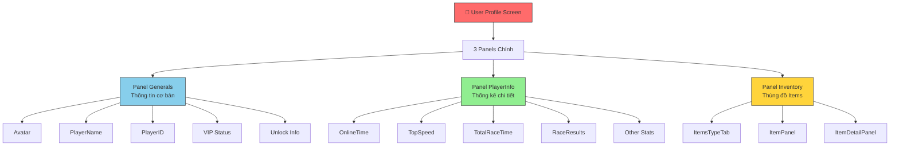
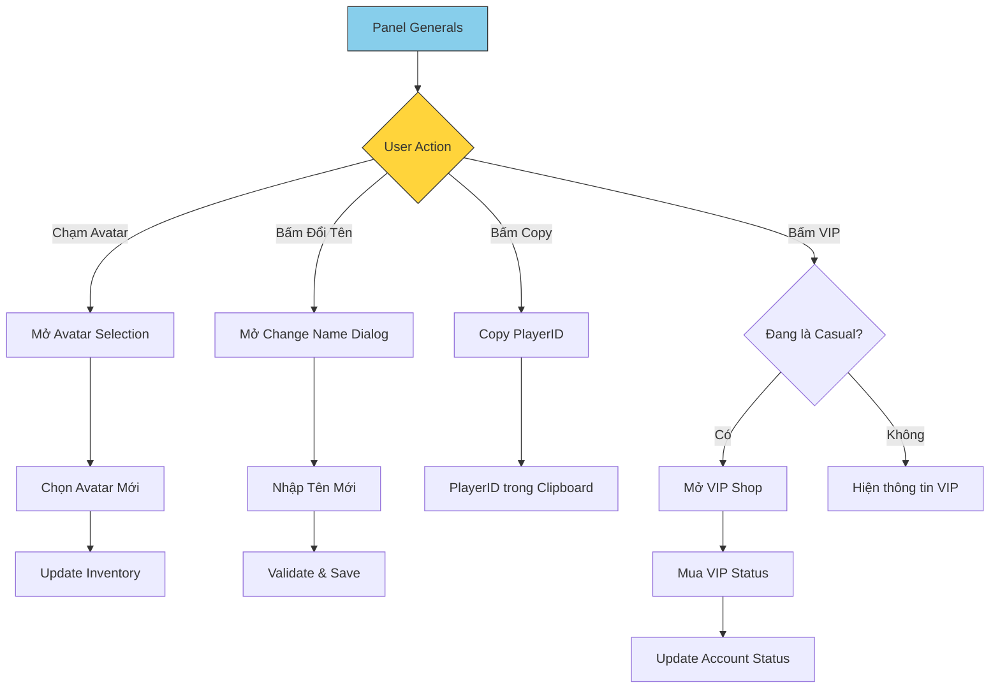
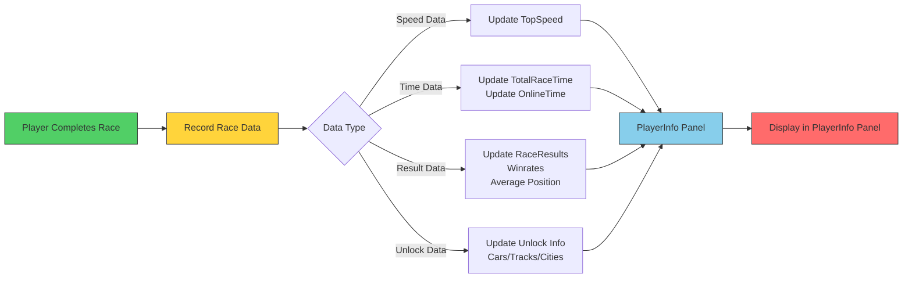
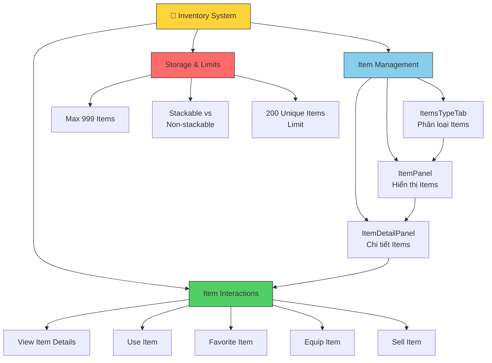
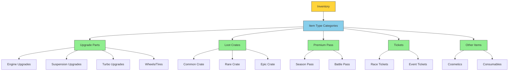
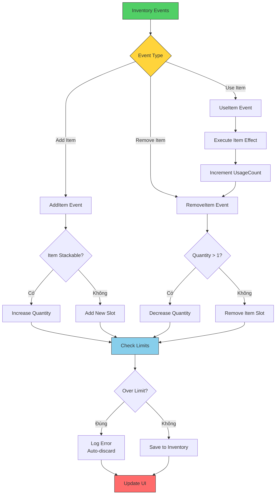
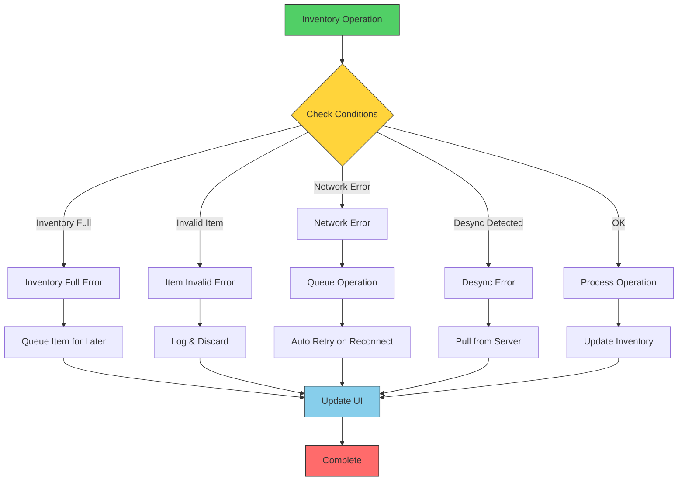
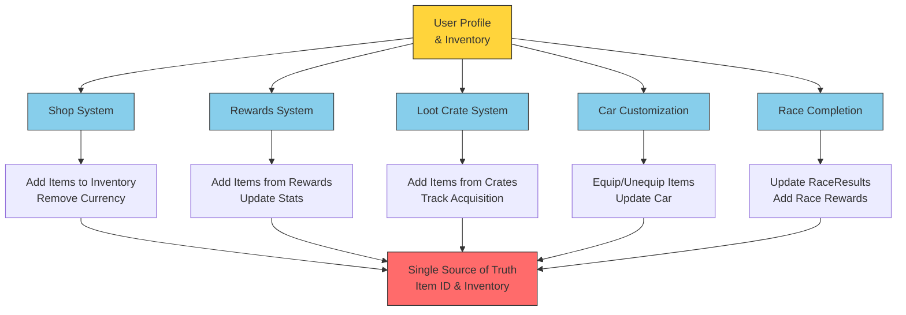

# USER PROFILE & INVENTORY

*GDD Overview các tính năng User Profile và User Inventory*

## Change Log

- **First Version (20251027)**

- **Ver 2 (20251120)**
  - Bổ sung thông tin từ Dev Feedback.
  - Bổ sung Goals & Non-goals.
  - Bổ sung Data Model & Storage Alignment.
  - Bổ sung Inventory Structure & Limits.
  - Bổ sung User Stories.
  - Bổ sung Edge Cases & Error Handling.

- **Ver 5 (20251215)**
  - Chỉnh sửa cấu trúc văn bản theo format của Racer_AI_V5.
  - Chuyển đổi hình ảnh thành mô tả chi tiết.
  - Thêm Mermaid diagrams cho dễ dàng nắm bắt thông tin.
  - Tổng hợp các tính năng chính thành bảng mechanics.

---

# Gameplay Concepts

## Concepts

- User Profile cho phép người chơi theo dõi các chỉ số như thông tin giờ chơi, tỉ lệ thắng thua, % Content đã được Unlock, v.v
- Thùng đồ (Inventory) cho phép người chơi xem được các Item mình đang sở hữu như Upgrade Parts, Loot Crates, PremiumPass, Tickets, v.v
- Người chơi có thể chọn xem và tương tác với các Item trong thùng đồ.
- Toàn bộ Items được quản lý bởi một hệ thống thống nhất (Single Source of Truth) để đảm bảo consistency giữa các hệ thống.
- Inventory có giới hạn tối đa **999 Item** (tính cả stackable items).
- Mỗi Player có 1 Profile và 1 Inventory tương ứng.

## Goals & Non-goals

### Goals

- Thống nhất (single source of truth) cho Items người chơi sở hữu - Data sẽ được lưu trữ ở 1 nơi duy nhất.
- Đảm bảo mọi hệ thống (Shop, Rewards, Loot Crates, Car Customization) đều dùng chung Item ID & Inventory.
- Cho phép người chơi theo dõi đầy đủ quá trình chơi game của mình.
- Cung cấp giao diện đơn giản và thân thiện để quản lý Items.

### Non-Goals

- Chưa xử lý Cross-Platform Economy, trước mắt chỉ xử lý trên iOS.
- Không có hệ thống Trading giữa Players.
- Không có hệ thống Crafting/Disenchant (Đổi nhiều Item thành Item khác).

## Các Mechanics & Định nghĩa Liên quan cần phát triển

| Tên Mechanics | Phân loại |
|---|---|
| Hiển thị thông tin cơ bản người chơi (Generals) | User Profile |
| Hiển thị thông tin chi tiết người chơi (PlayerInfo) | User Profile |
| Quản lý và hiển thị thùng đồ (Inventory) | Inventory |
| Phân loại Items theo loại (ItemsTypeTab) | Inventory |
| Xem chi tiết Items và tương tác | Inventory |
| Quản lý Items Stackable vs Non-stackable | Inventory |
| Đổi tên người chơi | User Profile |
| Đổi Avatar người chơi | User Profile |
| Copy PlayerID vào cache | User Profile |
| Mua VIP Status | User Profile |

---

# Game Mechanics

## Screen Overview - Cấu trúc chính của User Profile Screen

User Profile Screen được chia thành 3 Panel chính:
- **Panel Generals**: Hiển thị thông tin cơ bản của người chơi.
- **Panel PlayerInfo**: Hiển thị thông tin chi tiết hơn về quá trình chơi.
- **Panel Inventory**: Hiển thị thùng đồ với các Items người chơi đang sở hữu.

### Screen Layout Diagram

*Cấu trúc chính của User Profile Screen và các Panel thành phần*

---

## Panel Generals - Thông tin Cơ bản

Panel Generals hiển thị các thông tin cơ bản của người chơi trên một giao diện tập trung.

### Các Entity chính trong Panel Generals

- **Player Avatar**: 
  - Khu vực hiện Avatar của người chơi.
  - Có thể chạm vào để kích hoạt chức năng đổi Avatar.
  - Hiển thị ảnh đại diện hiện tại của tài khoản.

- **PlayerName**: 
  - Khu vực hiện tên của người chơi.
  - Có nút bên cạnh cho phép kích hoạt chức năng đổi tên.
  - Cho phép người chơi tùy chỉnh tên hiển thị của mình.

- **PlayerID**: 
  - Khu vực hiện ID duy nhất của người chơi.
  - Có thể Copy để dán vào tính năng tìm kiếm bạn bè.
  - Là định danh không thay đổi của tài khoản.

- **VIP Status**: 
  - Khu vực thể hiện trạng thái tài khoản của người chơi.
  - Có 2 loại tài khoản: **Casual** (bình thường) và **VIP** (cao cấp).
  - Có thể bấm vào để kích hoạt mua VIP nếu đang là tài khoản Casual.

- **Unlock Info** (Thông tin Mở khóa chung): 
  - **Cars Unlocked**: Số lượng xe đã mở khóa.
  - **Tracks Unlocked**: Số lượng đường đua đã mở khóa.
  - **Cities Unlocked**: Số lượng thành phố đã mở khóa.

### Panel Generals Interaction Diagram

*Diagram tương tác của Panel Generals với các chức năng chính*

### Các chức năng chính của Panel Generals

| Chức năng | Mô tả | Yêu cầu |
|---|---|---|
| **Đổi Avatar** | Cho phép người chơi chọn Avatar mới | Có Avatar có sẵn |
| **Đổi Tên Người Chơi** | Cho phép đổi tên hiển thị | Validation tên hợp lệ |
| **Copy PlayerID** | Sao chép ID vào clipboard | Để tìm kiếm bạn bè |
| **Mua VIP Status** | Nâng cấp từ Casual lên VIP | Có đủ tiền/đơn vị thanh toán |

---

## Panel PlayerInfo - Thông tin Chi tiết

Panel PlayerInfo hiển thị các thống kê chi tiết về quá trình chơi của người chơi.

### Các thông tin chính trong Panel PlayerInfo

- **OnlineTime**: 
  - Tổng thời gian Online In-Game.
  - Được tính từ lúc người chơi đăng nhập đến lúc đăng xuất.
  - Không tính thời gian ở Main Menu.

- **TopSpeed**: 
  - Tốc độ tối đa đã đạt được trong một cuộc đua.
  - Được ghi nhận từ cuộc đua gần đây nhất.
  - Đơn vị: km/h.

- **TotalRaceTime**: 
  - Tổng thời gian dành cho việc đua.
  - Không tính thời gian ở Main Menu hoặc màn hình sau khi đua.
  - Chỉ tính thời gian thực tế trong cuộc đua.

- **RaceResults**: 
  - Thống kê tổng số lượng các cuộc đua: Total Races.
  - Winrates (%): Tỉ lệ thắng trên tổng số lần đua.
  - Vị trí trung bình: Average Position.
  - Số lần về nhất, nhì, ba.

- **Các thông tin khác**: 
  - Số Cars đã Unlocked.
  - Số tiền đã Earn (kiếm được).
  - Số tiền đã Spent (tiêu xài).

### Panel PlayerInfo Statistics Flow Diagram

*Luồng cập nhật dữ liệu thống kê vào Panel PlayerInfo*

---

## Panel Inventory - Thùng Đồ Items

Panel Inventory là nơi quản lý toàn bộ Items mà người chơi sở hữu.

### Các Entity chính trong Panel Inventory

- **ItemsTypeTab (Tab phân loại)**: 
  - Cho phép chuyển đổi giữa các loại Item khác nhau.
  - Các loại Items chính:
    - **Upgrade Parts**: Các bộ phận nâng cấp xe.
    - **Loot Crates**: Những chiếc rương phần thưởng.
    - **Premium Pass**: Vé truy cập cao cấp.
    - **Tickets**: Vé để tham gia cuộc đua.
    - **Other Items**: Các Items khác.

- **ItemPanel (Hiển thị Items)**: 
  - Hiển thị danh sách các Items của loại được chọn.
  - Hiển thị tên, hình ảnh, và số lượng Items.
  - Sắp xếp theo thứ tự: Items được sắp xếp có thể là theo ngày nhận hoặc theo số lượng.

- **ItemDetailPanel (Chi tiết Items)**: 
  - Hiển thị chi tiết của Item được chọn khi người chơi bấm vào.
  - Hiển thị mô tả, số lượng, ngày nhận, nguồn nhận.
  - Cho phép tương tác (sử dụng, bán, yêu thích, trang bị) nếu có thể.

### Inventory System Architecture Diagram

*Kiến trúc hệ thống Inventory và các thành phần chính*

### Inventory Item Types Detail

*Phân loại các loại Items trong Inventory*

### Các chức năng chính của Panel Inventory

| Chức năng | Mô tả | Điều kiện |
|---|---|---|
| **Chuyển đổi Tab** | Chuyển giữa các loại Items | Có Items trong loại đó |
| **Xem Item Details** | Hiển thị thông tin chi tiết Item | Bấm vào Item |
| **Sử dụng Item** | Kích hoạt tác dụng của Item | Item hỗ trợ chức năng này |
| **Yêu thích Item** | Đánh dấu Item yêu thích | Item chưa được yêu thích |
| **Trang bị Item** | Trang bị Item cho xe | Item là loại có thể trang bị |
| **Bán Item** | Bán Item để nhận tiền | Item cho phép bán |

---

## Data Model & Storage Alignment

### Inventory Item Fields

Mỗi Item trong Inventory được quản lý với các trường thông tin sau:

| Trường | Kiểu dữ liệu | Mô tả |
|---|---|---|
| **ItemID** | String/Int | Định danh duy nhất của Item |
| **ItemName** | String | Tên của Item |
| **ItemType** | Enum | Loại Item (Parts, Crate, Pass, Ticket, Other) |
| **Quantity** | Int | Số lượng Item sở hữu |
| **AcquisitionDate** | DateTime | Thời điểm nhận Item |
| **AcquisitionSource** | String | Nguồn nhận ("race_reward", "loot_crate", "shop", etc) |
| **IsEquipped** | Boolean | Trạng thái trang bị |
| **IsFavorite** | Boolean | Trạng thái yêu thích |
| **UsageCount** | Int | Số lần đã sử dụng Item |
| **IsStackable** | Boolean | Có thể stack với nhau hay không |

### Player Profile Fields

Mỗi Player Profile được quản lý với các trường thông tin sau:

| Trường | Kiểu dữ liệu | Mô tả |
|---|---|---|
| **PlayerID** | String | Định danh duy nhất |
| **PlayerName** | String | Tên người chơi |
| **Avatar** | String | Avatar ID hiện tại |
| **VIPStatus** | Enum | Casual hoặc VIP |
| **OnlineTime** | TimeSpan | Tổng thời gian online |
| **TopSpeed** | Float | Tốc độ cao nhất đạt được |
| **TotalRaceTime** | TimeSpan | Tổng thời gian đua |
| **TotalRaces** | Int | Tổng số cuộc đua |
| **TotalWins** | Int | Tổng số lần thắng |
| **WinRate** | Float | Tỉ lệ thắng (%) |
| **AveragePosition** | Float | Vị trí trung bình |
| **CarsUnlocked** | Int | Số xe đã mở khóa |
| **TracksUnlocked** | Int | Số đường đua đã mở khóa |
| **CitiesUnlocked** | Int | Số thành phố đã mở khóa |
| **TotalEarned** | Double | Tổng tiền kiếm được |
| **TotalSpent** | Double | Tổng tiền tiêu xài |
| **InventoryRef** | Reference | Tham chiếu đến Inventory |

### Data Storage Flow Diagram

```mermaid
graph LR
    A["Game Events"] --> B["Data Collection"]
    B --> C["Data Validation"]
    C --> D["Local Queue<br/>(Client)"]
    D --> E{Player Online?}
    
    E -->|Có| F["Send to Backend<br/>(Nakama)"]
    E -->|Không| G["Queue for Next Login"]
    
    F --> H["Backend Processing"]
    H --> I["Database Storage"]
    I --> J["Sync Response to Client"]
    
    G --> K["Reconnect Trigger"]
    K --> F
    
    J --> L["Update Local Cache"]
    L --> M["UI Refresh"]
    
    style A fill:#51cf66,stroke:#333
    style B fill:#ffd43b,stroke:#333
    style F fill:#87ceeb,stroke:#333
    style I fill:#ff6b6b,stroke:#333
    style M fill:#90ee90,stroke:#333
```

*Luồng lưu trữ và đồng bộ dữ liệu giữa Client và Backend*

---

## Inventory Structure & Limits

### Giới hạn Inventory

- **Tổng giới hạn Items**: **999 Items** (tính cả stackable)
- **Giới hạn Unique Items**: **200 Items** (các loại Item khác nhau)
- **Mỗi Player có**: 1 Inventory duy nhất tương ứng với 1 Profile

### Item Stackability Rules

#### Stackable Items (có thể xếp chồng)
- **Performance & Loot Crates**: Có thể stack theo số lượng
- **Tickets**: Có thể stack
- **Consumables**: Có thể stack

**Ví dụ**: Nếu có 5 Race Tickets, chúng sẽ được hiển thị là "Race Ticket x5" trong thùng đồ.

#### Non-Stackable Items (không xếp chồng)
- **Visual Items (Cosmetics)**: Không stack
- **Upgrade Parts**: Mỗi bộ phận nâng cấp là một Item riêng lẻ
- **Premium Pass**: Không stack

**Ví dụ**: Nếu có 2 cái bánh xe giống nhau nhưng khác màu sắc, chúng sẽ được hiển thị riêng lẻ.

### Inventory State Diagram

*Sơ đồ trạng thái các sự kiện Inventory*

---

## User Stories & Features

### Designer / QA User Stories

- **US Chính**: 
  - *"Tôi muốn xem được thông tin giờ chơi và các Item tôi sở hữu."*

### User Stories Chi tiết

#### US1: Xem tổng quan thông tin chơi
- *"Là người dùng, tôi muốn có khả năng xem Overview tất cả các thông tin liên quan tới giờ chơi của tôi để nắm được tổng thể quá trình tham gia trò chơi."*

**Acceptance Criteria:**
- [ ] Có thể truy cập Panel PlayerInfo từ User Profile Screen
- [ ] Hiển thị đầy đủ: OnlineTime, TopSpeed, TotalRaceTime, RaceResults
- [ ] Thông tin được cập nhật thực tế sau mỗi cuộc đua
- [ ] Có thể xem unlock info (Cars, Tracks, Cities)

#### US2: Quản lý thùng đồ
- *"Là người dùng, tôi muốn có một hệ thống thùng đồ đơn giản để có khả năng xem được tất cả các Item mà tôi đang sở hữu một cách tiện dụng nhất."*

**Acceptance Criteria:**
- [ ] Có thể xem tất cả Items trong Inventory
- [ ] Có thể lọc Items theo loại (Tab)
- [ ] Có thể xem chi tiết từng Item
- [ ] Có thể tương tác với Items (use, favorite, equip, sell)

#### US3: Quản lý tài khoản cá nhân
- *"Là người dùng, tôi muốn có thể tùy chỉnh thông tin cá nhân (tên, avatar) của mình."*

**Acceptance Criteria:**
- [ ] Có thể đổi Player Name
- [ ] Có thể đổi Avatar
- [ ] Có thể copy Player ID
- [ ] Có thể xem và mua VIP Status

---

## Edge Cases & Error Handling

### Edge Case 1: Inventory Penuh

**Tình huống**: Người chơi nhận Item nhưng Inventory đã đầy (vượt 999 hoặc 200 unique items).

**Xử lý**:
- Không thể tiếp tục nhận Items.
- Hiển thị thông báo: *"Thùng đồ đã đầy. Vui lòng bán hoặc sử dụng một số Items."*
- Item sẽ không được thêm vào Inventory.
- Nếu Items đó quá quan trọng (ví dụ: Race Reward), sẽ được lưu trong một Queue chờ xử lý.

### Edge Case 2: Items Trùng Không Stack

**Tình huống**: Nhận Item non-stackable trùng với Item đã có (ví dụ: 2 chiếc bánh xe giống nhau).

**Xử lý**:
- Theo định nghĩa trong tài liệu Rewards, các Items trùng sẽ được xử lý riêng.
- Có thể hiển thị thông báo cho người chơi biết đã nhận Item trùng.
- Items sẽ được thêm vào Inventory riêng lẻ nếu còn chỗ.

### Edge Case 3: Mở Crate - Lỗi Mạng

**Tình huống**: Người chơi mở Loot Crate nhưng bị mất kết nối hoặc Nakama timeout.

**Xử lý**:
- Kích hoạt cơ chế **Idempotent**: Chỉ ghi nhận đã mở Crate khi phần thưởng đã được thêm vào Inventory.
- Nếu chưa được thêm (do lỗi), Crate được xem như chưa mở và tự động reset về trạng thái ban đầu.
- Người chơi có thể thử lại sau khi kết nối được phục hồi.

### Edge Case 4: Desync Client & Backend

**Tình huống**: Dữ liệu trên Client khác với dữ liệu trên Server.

**Xử lý**:
- **Luôn Sync theo Server** là nguồn dữ liệu chính.
- Khi phát hiện Desync, tự động pull dữ liệu từ Server.
- Yêu cầu người chơi Online để dễ xử lý đồng bộ hóa.

### Edge Case 5: Mất Kết Nối Giữa Chừng

**Tình huống**: Người chơi mất kết nối khi đang nhận Items hoặc tương tác với Inventory.

**Xử lý**:
- **AddItem Queue/Flush**: Nếu AddItem chưa được đánh dấu hoàn thành, tác vụ sẽ được lưu vào Queue.
- Khi người chơi Reconnect, Items sẽ tự động được thêm vào Inventory.
- Không cần hiện lại UI trao thưởng, chỉ cần cập nhật Inventory.

### Edge Case 6: Shop/Reward Logic Thay Đổi (Update Version)

**Tình huống**: Game được update, một số Items cũ không còn "hợp lệ" nữa.

**Xử lý**:
- Thực hiện **ValidateInventory** để kiểm tra các Items không hợp lệ.
- **CleanupInvalidItems**: Các Items không hợp lệ sẽ được xử lý theo quy định:
  - Auto-remove: Xóa bỏ Items không cần thiết.
  - Convert: Chuyển đổi Items sang Items mới tương ứng.
  - Compensation: Cấp phát Item bù trừ cho người chơi.
- Dev sẽ tư vấn hướng giải quyết cụ thể cho từng trường hợp khi gặp phải.

### Error Handling Flow Diagram

*Diagram xử lý lỗi trong các hoạt động Inventory*

---

## Integration Points

### Tích hợp với các hệ thống khác

*Các điểm tích hợp giữa User Profile-Inventory và các hệ thống khác*

---

## Summary Table - Kiểm tra QA

Bảng kiểm tra các tính năng chính cho QA:

| Tính năng | Panel | Mô tả | Trạng thái |
|---|---|---|---|
| Hiển thị Avatar | Generals | Hiển thị Avatar hiện tại | ☐ |
| Đổi Avatar | Generals | Mở Avatar Selection | ☐ |
| Hiển thị PlayerName | Generals | Hiển thị tên người chơi | ☐ |
| Đổi Tên | Generals | Mở Change Name Dialog | ☐ |
| Hiển thị PlayerID | Generals | Hiển thị ID duy nhất | ☐ |
| Copy PlayerID | Generals | Copy vào clipboard | ☐ |
| Hiển thị VIP Status | Generals | Hiển thị Casual/VIP | ☐ |
| Mua VIP | Generals | Mở VIP Shop | ☐ |
| Hiển thị Unlock Info | Generals | Hiển thị Cars/Tracks/Cities | ☐ |
| Hiển thị OnlineTime | PlayerInfo | Tổng giờ chơi | ☐ |
| Hiển thị TopSpeed | PlayerInfo | Tốc độ cao nhất | ☐ |
| Hiển thị TotalRaceTime | PlayerInfo | Tổng giờ đua | ☐ |
| Hiển thị RaceResults | PlayerInfo | Thống kê đua | ☐ |
| Hiển thị Other Stats | PlayerInfo | Earn/Spent/Unlock | ☐ |
| ItemsTypeTab | Inventory | Chuyển đổi Tab | ☐ |
| ItemPanel | Inventory | Hiển thị Items | ☐ |
| ItemDetailPanel | Inventory | Chi tiết Items | ☐ |
| Sử dụng Item | Inventory | Use Item | ☐ |
| Yêu thích Item | Inventory | Favorite Item | ☐ |
| Trang bị Item | Inventory | Equip Item | ☐ |
| Bán Item | Inventory | Sell Item | ☐ |
| Inventory Full | Inventory | Xử lý khi đầy | ☐ |
| Stackable Items | Inventory | Stack items tự động | ☐ |
| Network Error | General | Xử lý mất kết nối | ☐ |
| Desync Handling | General | Xử lý desync | ☐ |

---

*Document: USER PROFILE & INVENTORY - Game Design Document*

*Last Updated: 2025-12-15*

*Version: 5*
