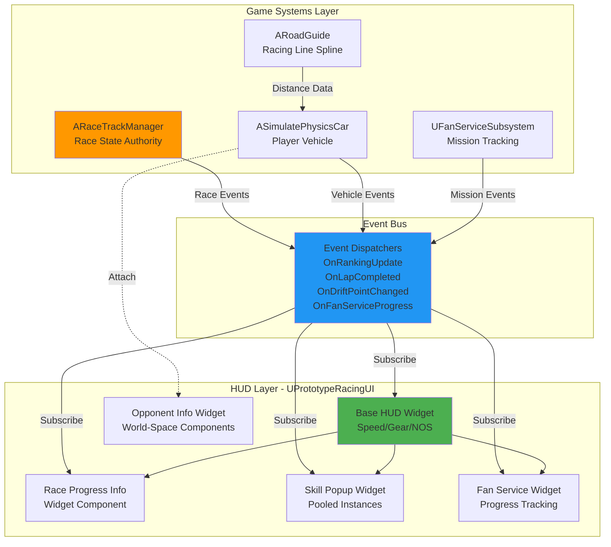
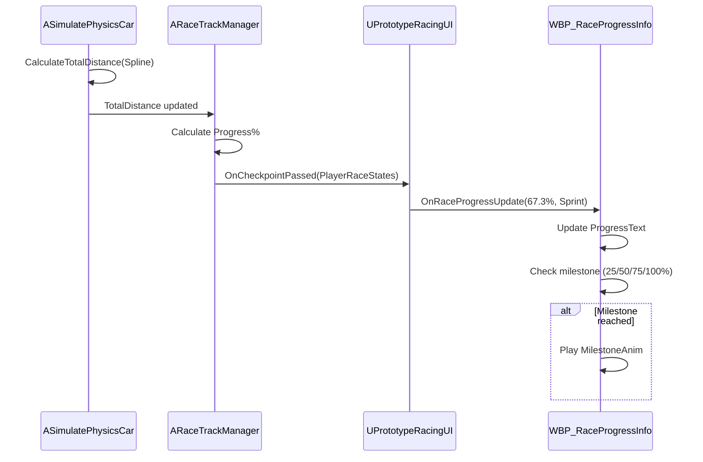
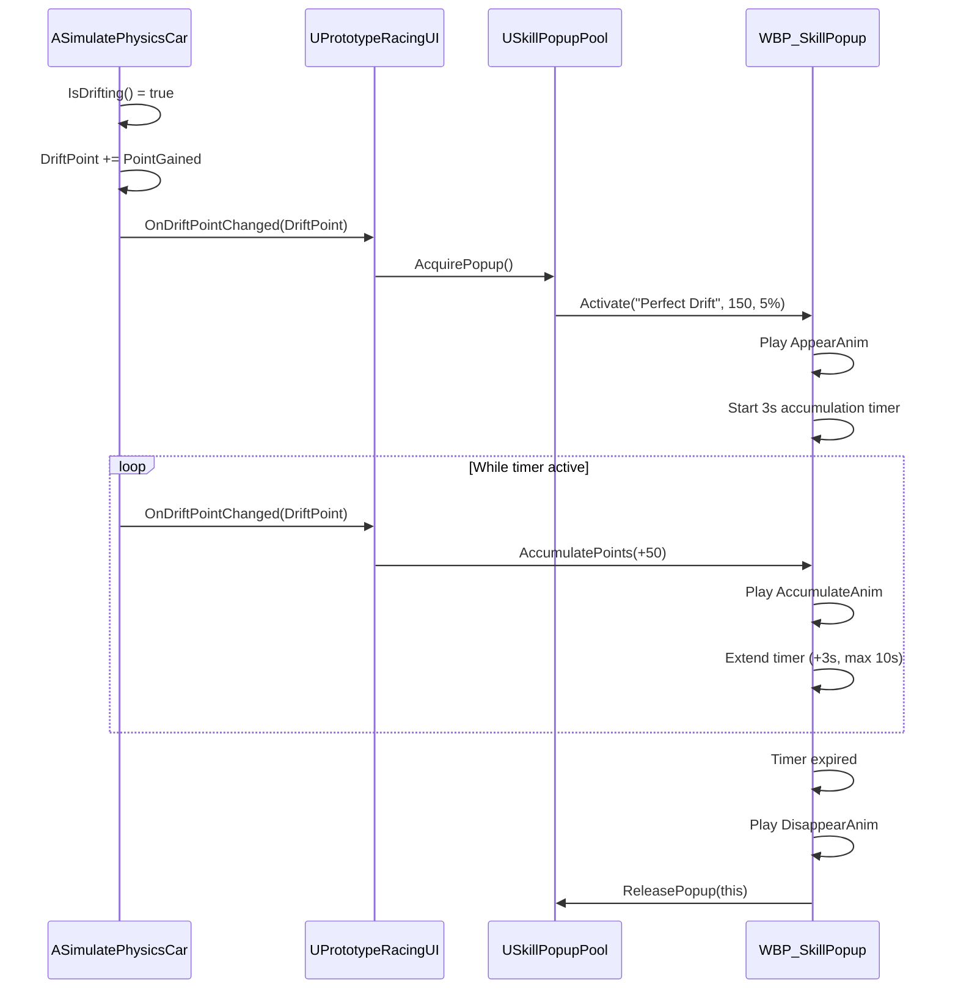
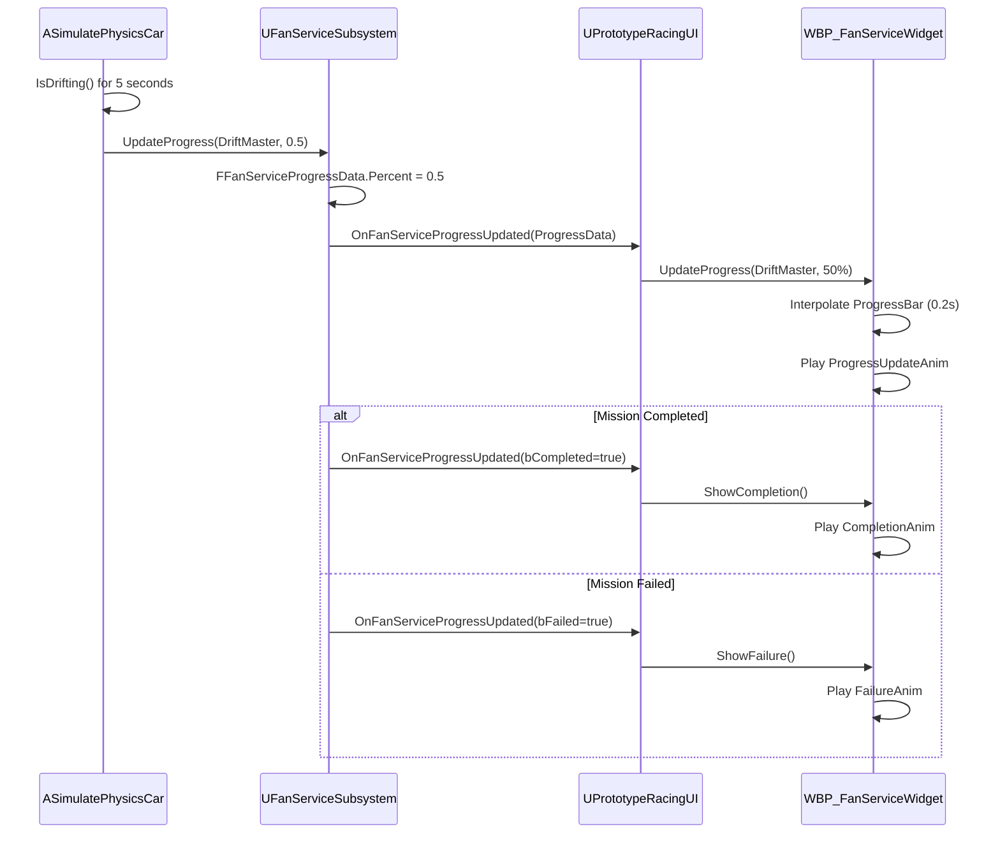

# Player Info HUD System - Architecture Design

## 1. System Architecture Overview

### High-Level Component Diagram



### Design Principles

1. **Event-Driven Architecture**: All UI updates triggered by events, zero tick-based updates
2. **Component Composition**: Extend `UPrototypeRacingUI` with child widget components
3. **Object Pooling**: Skill popups use pooled instances (max 5) to minimize allocations
4. **Separation of Concerns**: Game logic in C++, UI presentation in Blueprint
5. **Mobile-First Performance**: Distance-based updates, widget pooling, minimal draw calls

---

## 2. Component Specifications

### 2.1 Base HUD Widget (UPrototypeRacingUI)

**Responsibility**: Root widget container, manages child components, handles vehicle data updates

**Existing Implementation**:
```cpp
UCLASS(abstract)
class UPrototypeRacingUI : public UUserWidget {
    GENERATED_BODY()
    
    void UpdateSpeed(float NewSpeed);
    void UpdateGear(int32 NewGear);
    void UpdateNitrous(float NewNitrous);
    
protected:
    UFUNCTION(BlueprintImplementableEvent)
    void OnSpeedUpdate(float NewSpeed);
    
    UFUNCTION(BlueprintImplementableEvent)
    void OnGearUpdate(int32 NewGear);
    
    UFUNCTION(BlueprintImplementableEvent)
    void OnNitrousUpdate(float NewNitrous);
};
```

**New Extensions Required**:
```cpp
// Add to UPrototypeRacingUI.h
protected:
    UFUNCTION(BlueprintImplementableEvent, Category = "Race Info")
    void OnRaceProgressUpdate(float ProgressPercent, ERaceMode RaceMode);
    
    UFUNCTION(BlueprintImplementableEvent, Category = "Race Info")
    void OnPlayerPositionUpdate(int32 Position, int32 TotalRacers);
    
    UFUNCTION(BlueprintImplementableEvent, Category = "Race Info")
    void OnRaceTimerUpdate(float ElapsedTime, bool bIsCountdown);
    
    UFUNCTION(BlueprintImplementableEvent, Category = "Race Info")
    void OnLapChanged(int32 CurrentLap, int32 TotalLaps);

public:
    void BindToRaceEvents(ARaceTrackManager* RaceManager);
    void BindToVehicleEvents(ASimulatePhysicsCar* Vehicle);
    void BindToFanServiceEvents(UFanServiceSubsystem* FanService);
```

**Blueprint Implementation**: `WBP_PrototypeRacingUI` (existing Blueprint widget)

---

### 2.2 Race Progress Info Widget

**Responsibility**: Display mode-specific race progress (Sprint %, Time Attack countdown, Circuit laps)

**Widget Hierarchy**:
```
WBP_RaceProgressInfo (UUserWidget)
├── ProgressContainer (UCanvasPanel)
│   ├── ProgressText (UTextBlock) - "67.3%" or "02:15.45"
│   ├── ProgressLabel (UTextBlock) - "Distance" or "Time Remaining"
│   └── ProgressIcon (UImage) - Mode-specific icon
└── AnimationContainer (UOverlay)
    ├── MilestoneAnim (UWidgetAnimation) - 25/50/75/100% milestones
    └── WarningAnim (UWidgetAnimation) - <15s countdown warning
```

**Event Bindings**:
- `ARaceTrackManager::OnCheckpointPassed` → Update progress percentage
- `ARaceTrackManager::OnTimeAttackUpdate` → Update countdown timer
- `ARaceTrackManager::OnLapCompleted` → Update lap counter (Circuit mode)

**Data Flow**:


**Implementation Notes**:
- Progress calculation: `(TotalDistance / SplineLength) * 100`
- Countdown timer decrements at 1 Hz, updates UI at 60 Hz for smooth display
- Warning animation triggers when `TimeRemaining < 15.0f`

---

### 2.3 Skill Popup Widget (Pooled)

**Responsibility**: Display racing skill activation with points and NOS rewards

**Widget Hierarchy**:
```
WBP_SkillPopup (UUserWidget)
├── PopupContainer (UBorder)
│   ├── SkillIcon (UImage) - Skill type icon
│   ├── SkillName (UTextBlock) - "Perfect Drift"
│   ├── PointsText (UTextBlock) - "+150 pts"
│   └── NOSReward (UTextBlock) - "+5% NOS"
└── Animations
    ├── AppearAnim (UWidgetAnimation) - Slide in from right
    ├── AccumulateAnim (UWidgetAnimation) - Pulse on point add
    └── DisappearAnim (UWidgetAnimation) - Fade out
```

**Object Pool Manager**:
```cpp
UCLASS()
class USkillPopupPool : public UObject {
    GENERATED_BODY()
    
public:
    UPROPERTY()
    TArray<USkillPopupWidget*> AvailablePopups;
    
    UPROPERTY()
    TArray<USkillPopupWidget*> ActivePopups;
    
    UPROPERTY()
    int32 MaxPoolSize = 5;
    
    USkillPopupWidget* AcquirePopup();
    void ReleasePopup(USkillPopupWidget* Popup);
    void InitializePool(UUserWidget* ParentWidget);
};
```

**Event Flow**:


**Skill Type Mapping**:
```cpp
UENUM(BlueprintType)
enum class ESkillType : uint8 {
    PerfectDrift,
    AirborneBoost,
    NearMiss,
    CheckpointBonus,
    SpeedDemon
};

USTRUCT(BlueprintType)
struct FSkillReward {
    GENERATED_BODY()
    
    UPROPERTY(EditAnywhere)
    ESkillType SkillType;
    
    UPROPERTY(EditAnywhere)
    int32 BasePoints = 100;
    
    UPROPERTY(EditAnywhere)
    float NOSRewardPercent = 2.0f;
    
    UPROPERTY(EditAnywhere)
    UTexture2D* SkillIcon;
};
```

---

### 2.4 Fan Service Widget

**Responsibility**: Display Fan Service mission progress with Progress Bar or CheckBox variants

**Widget Hierarchy**:
```
WBP_FanServiceWidget (UUserWidget)
├── MissionContainer (UVerticalBox)
│   ├── ProgressBarVariant (UProgressBar)
│   │   ├── ProgressFill (UImage)
│   │   └── ProgressText (UTextBlock) - "67%"
│   └── CheckBoxVariant (UImage)
│       ├── CheckIcon (UImage) - Checkmark or X
│       └── StatusText (UTextBlock) - "In Progress"
└── Animations
    ├── ProgressUpdateAnim (UWidgetAnimation)
    ├── CompletionAnim (UWidgetAnimation)
    └── FailureAnim (UWidgetAnimation)
```

**Event Bindings**:
```cpp
// In UPrototypeRacingUI::BindToFanServiceEvents()
void UPrototypeRacingUI::BindToFanServiceEvents(UFanServiceSubsystem* FanService) {
    if (!FanService) return;
    
    FanService->OnFanServiceProgressUpdated.AddDynamic(
        this, &UPrototypeRacingUI::HandleFanServiceProgressUpdate
    );
}

void UPrototypeRacingUI::HandleFanServiceProgressUpdate(
    const FFanServiceProgressData& ProgressData
) {
    // Broadcast to Blueprint
    OnFanServiceProgressChanged(ProgressData);
}
```

**Data Flow**:


**Mission Type to UI Variant Mapping**:
| Mission Type | UI Variant | Update Frequency |
|--------------|-----------|------------------|
| Drift Master | Progress Bar | Every 0.5s |
| Clean Racer | CheckBox | On collision only |
| Fly Car | Progress Bar | Every 0.5s |
| Speed Demon | Progress Bar | Every 1s |
| Certain Expectation | CheckBox | On checkpoint |
| No Drift | CheckBox | On drift start |

---

### 2.5 Opponent Info Widget (World-Space)

**Responsibility**: Display opponent position/name above their vehicle based on distance

**Widget Hierarchy**:
```
WBP_OpponentInfo (UUserWidget)
├── InfoContainer (UBorder)
│   ├── PositionText (UTextBlock) - "2nd"
│   └── NameText (UTextBlock) - "AI Racer 1"
└── Animations
    ├── FadeInAnim (UWidgetAnimation)
    ├── TransitionAnim (UWidgetAnimation) - Position ↔ Name
    └── FadeOutAnim (UWidgetAnimation)
```

**Attachment System**:
```cpp
// In ASimulatePhysicsCar::BeginPlay()
void ASimulatePhysicsCar::BeginPlay() {
    Super::BeginPlay();
    
    if (bIsAICar) {
        OpponentInfoWidget = CreateWidget<UWidgetComponent>(
            GetWorld(), OpponentInfoWidgetClass
        );
        OpponentInfoWidget->AttachToComponent(
            GetRootComponent(), 
            FAttachmentTransformRules::KeepRelativeTransform
        );
        OpponentInfoWidget->SetRelativeLocation(FVector(0, 0, 150)); // Above vehicle
        OpponentInfoWidget->SetWidgetSpace(EWidgetSpace::Screen);
    }
}
```

**Distance-Based Visibility Logic**:
```cpp
// In ARacingCarController::Tick() or Timer-based update
void ARacingCarController::UpdateOpponentInfoVisibility() {
    ASimulatePhysicsCar* PlayerCar = GetPawn<ASimulatePhysicsCar>();
    if (!PlayerCar) return;
    
    for (auto& Opponent : OpponentVehicles) {
        float Distance = FVector::Distance(
            PlayerCar->GetActorLocation(), 
            Opponent->GetActorLocation()
        );
        
        if (Distance >= 20.0f * 100.0f) { // 20m in UE units (cm)
            Opponent->OpponentInfoWidget->SetVisibility(ESlateVisibility::Hidden);
        } else if (Distance >= 10.0f * 100.0f) {
            Opponent->OpponentInfoWidget->ShowPosition(Opponent->Ranking);
        } else if (Distance >= 5.0f * 100.0f) {
            Opponent->OpponentInfoWidget->TransitionToName(Opponent->PlayerName);
        } else {
            Opponent->OpponentInfoWidget->ShowName(Opponent->PlayerName);
        }
    }
}
```

**Performance Optimization**:
- Update frequency: 5 Hz (every 0.2s) instead of every frame
- Max concurrent displays: 8 (nearest opponents only)
- Frustum culling: Hide widgets outside camera view
- Distance culling: Pre-filter opponents >20m before distance calculation

---

## 3. Event System Architecture

### Event Dispatcher Definitions

```cpp
// ARaceTrackManager.h
DECLARE_DYNAMIC_MULTICAST_DELEGATE_OneParam(
    FOnRaceStateChanged, 
    const TArray<FPlayerRaceState>&, PlayerRaceStates
);

DECLARE_DYNAMIC_MULTICAST_DELEGATE_OneParam(
    FOnTimeUpdate, 
    const int&, TimeRemaining
);

DECLARE_DYNAMIC_MULTICAST_DELEGATE_TwoParams(
    FOnLapCompleted, 
    const FString&, VehicleId, 
    const int&, LapNumber
);

// ASimulatePhysicsCar.h
DECLARE_DYNAMIC_MULTICAST_DELEGATE_OneParam(
    FOnDriftPointChanged, 
    float, DriftPoint
);

// UFanServiceSubsystem.h
DECLARE_DYNAMIC_MULTICAST_DELEGATE_OneParam(
    FOnFanServiceProgressUpdated, 
    const FFanServiceProgressData&, ProgressData
);
```

### Event Subscription Pattern

```cpp
// In UPrototypeRacingUI::NativeConstruct()
void UPrototypeRacingUI::NativeConstruct() {
    Super::NativeConstruct();
    
    // Get references
    ARacingCarController* Controller = GetOwningPlayer<ARacingCarController>();
    if (!Controller) return;
    
    // Bind to controller events (which relay from RaceTrackManager)
    Controller->OnEmitRankingUpdate.AddDynamic(
        this, &UPrototypeRacingUI::HandleRankingUpdate
    );
    Controller->OnEmitLapCompleted.AddDynamic(
        this, &UPrototypeRacingUI::HandleLapCompleted
    );
    Controller->OnEmitTimeUpdate.AddDynamic(
        this, &UPrototypeRacingUI::HandleTimeUpdate
    );
    
    // Bind to vehicle events
    ASimulatePhysicsCar* PlayerCar = Controller->GetPawn<ASimulatePhysicsCar>();
    if (PlayerCar) {
        PlayerCar->OnDriftPointChanged.AddDynamic(
            this, &UPrototypeRacingUI::HandleDriftPointChanged
        );
    }
    
    // Bind to Fan Service events
    UFanServiceSubsystem* FanService = GetGameInstance()->GetSubsystem<UFanServiceSubsystem>();
    if (FanService) {
        FanService->OnFanServiceProgressUpdated.AddDynamic(
            this, &UPrototypeRacingUI::HandleFanServiceProgressUpdate
        );
    }
}
```

---

## 4. Data Structures

### Race Progress Data
```cpp
USTRUCT(BlueprintType)
struct FRaceProgressInfo {
    GENERATED_BODY()
    
    UPROPERTY(BlueprintReadOnly)
    ERaceMode RaceMode;
    
    UPROPERTY(BlueprintReadOnly)
    float ProgressPercent; // 0.0 to 100.0
    
    UPROPERTY(BlueprintReadOnly)
    int32 CurrentLap;
    
    UPROPERTY(BlueprintReadOnly)
    int32 TotalLaps;
    
    UPROPERTY(BlueprintReadOnly)
    float TimeRemaining; // For Time Attack countdown
    
    UPROPERTY(BlueprintReadOnly)
    float ElapsedTime; // For Sprint/Circuit
};
```

### Skill Popup Data
```cpp
USTRUCT(BlueprintType)
struct FSkillPopupData {
    GENERATED_BODY()
    
    UPROPERTY(BlueprintReadOnly)
    ESkillType SkillType;
    
    UPROPERTY(BlueprintReadOnly)
    int32 AccumulatedPoints;
    
    UPROPERTY(BlueprintReadOnly)
    float NOSRewardPercent;
    
    UPROPERTY(BlueprintReadOnly)
    float AccumulationTimeRemaining; // 0.0 to 10.0 seconds
    
    UPROPERTY(BlueprintReadOnly)
    int32 ActivationCount; // How many times skill triggered during accumulation
};
```

---

## 5. Performance Considerations

### Mobile Optimization Strategies

1. **Widget Pooling**: Skill popups use object pool (max 5 instances)
2. **Update Frequency Tiers**:
   - Critical (60 Hz): Speed, NOS gauge, countdown timer
   - High (30 Hz): Race progress percentage
   - Medium (10 Hz): Player position, lap counter
   - Low (5 Hz): Opponent info distance checks
3. **Draw Call Reduction**:
   - Use texture atlases for all UI icons (single material)
   - Batch text rendering (max 3 font materials)
   - Collapse widget hierarchy (max 3 levels deep)
4. **Memory Management**:
   - Pre-allocate all widgets at race start
   - No runtime widget creation (except from pool)
   - Clear skill popup pool on race end

### Profiling Targets
- UI frame time: <5ms on Samsung Galaxy S21
- Total draw calls: <50 per frame
- Memory footprint: <50MB for all HUD components

---

## 6. Integration Points

### Existing Systems
| System | Integration Point | Data Flow Direction |
|--------|------------------|---------------------|
| ARaceTrackManager | Event subscriptions | Manager → HUD |
| ASimulatePhysicsCar | Event subscriptions | Vehicle → HUD |
| UFanServiceSubsystem | Event subscriptions | Subsystem → HUD |
| ARoadGuide | Distance queries | HUD → Spline (read-only) |
| ARacingCarController | Event relay | Manager → Controller → HUD |

### New Systems Required
- **USkillPopupPool**: Object pool manager for skill popups
- **UOpponentInfoManager**: Manages opponent widget visibility and updates

---

## 7. Technical Decisions & Rationale

### Decision 1: Event-Driven vs Tick-Based Updates
**Choice**: Event-driven architecture  
**Rationale**: Mobile performance requires minimal CPU usage. Tick-based updates waste cycles checking for changes. Events fire only when state actually changes.  
**Trade-off**: Slightly more complex setup, but 10-20% better frame times on mobile.

### Decision 2: Widget Pooling for Skill Popups
**Choice**: Object pool with max 5 instances  
**Rationale**: Creating/destroying widgets at runtime causes GC pressure and frame hitches. Pooling eliminates allocations.  
**Trade-off**: Slightly higher base memory usage (approximately 2MB), but eliminates frame drops.

### Decision 3: Blueprint Implementable Events vs Direct C++ UI
**Choice**: C++ logic + Blueprint presentation  
**Rationale**: Follows existing `UPrototypeRacingUI` pattern. Allows designers to iterate on UI layout without C++ recompilation.  
**Trade-off**: Slight performance overhead from Blueprint VM, but negligible for UI updates.

### Decision 4: Distance-Based Opponent Info Updates
**Choice**: 5 Hz update frequency with distance-based visibility  
**Rationale**: Opponent info doesn't need frame-perfect accuracy. 5 Hz is imperceptible to players but saves 92% of distance calculations.  
**Trade-off**: Opponent info may lag by up to 200ms, but this is acceptable for non-critical UI.

---

## 8. Future Enhancements (Out of Scope)

1. **Multiplayer Support**: Replicate HUD state for spectators
2. **Customizable HUD Layouts**: Player-configurable widget positions
3. **Advanced Analytics**: Heatmaps showing skill activation locations
4. **VR Support**: World-space HUD for VR racing mode

---

**Document Status**: Draft - Ready for planning phase  
**Next Steps**: Create implementation plan with task breakdown and effort estimates

