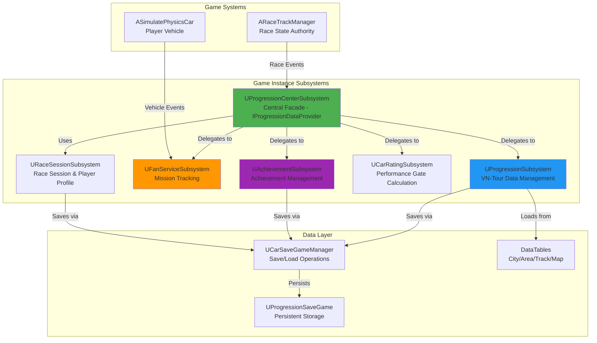
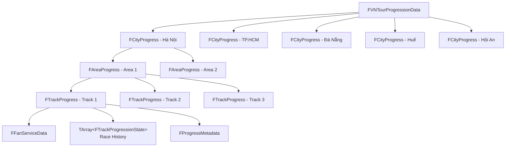
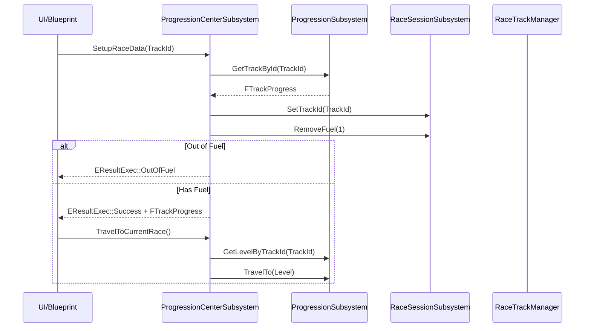
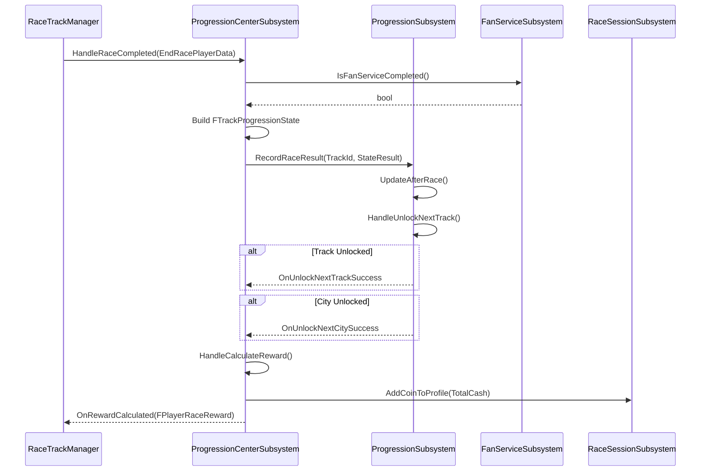

# Progression System - Architecture Design

> **Tài liệu này được đồng bộ với source code thực tế trong `PrototypeRacing/Source/`**

## 1. System Architecture Overview

### High-Level Component Diagram




### Design Principles

1. **Facade Pattern**: `UProgressionCenterSubsystem` implements `IProgressionDataProvider` interface, acting as central access point
2. **GameInstanceSubsystem**: All subsystems extend `UGameInstanceSubsystem` for game-wide persistence
3. **Event-Driven Architecture**: Delegates for UI updates (`OnRewardCalculated`, `OnProgressionUpdated`, etc.)
4. **DataTable-Driven**: City/Area/Track definitions loaded from DataTables for designer flexibility
5. **Separation of Concerns**: Each subsystem handles specific domain (VN-Tour, FanService, Achievement, CarRating)

---

## 2. Core Subsystems

### 2.1 UProgressionCenterSubsystem (Central Facade)

**File**: `BackendSubsystem/Progression/ProgressionCenterSubsystem.h`

**Purpose**: Central access point implementing `IProgressionDataProvider` interface

**Key Responsibilities**:
- Setup race data and travel to races
- Query VN-Tour progression (Cities, Areas, Tracks)
- Handle race completion and reward calculation
- Coordinate between subsystems

**Interface Implementation** (`IProgressionDataProvider`):
```cpp
// Race Setup
virtual void SetupRaceData(int TrackId, FTrackProgress& TrackInfo, EResultExec& Branches) override;
virtual void SetupDefaultRaceData() override;
virtual void TravelToCurrentRace() override;
virtual void TravelByLevelId(const int LevelId, ETravelResultExec& Branches) override;

// VN-Tour Queries
virtual FTrackProgress GetTrackById(int TrackId) override;
virtual TArray<FCityProgress> GetAllCities() override;
virtual TArray<FAreaProgress> GetAllAreasByCityId(int CityId) override;
virtual TArray<FTrackProgress> GetAllTracksByAreaId(int AreaId) override;
virtual FVNTourProgressionData GetVNTourProgressionData() override;

// Race Results
virtual void HandleRecordRaceResult(int TrackId, FTrackProgressionState StateResult) override;
virtual void HandleRaceCompleted(const FEndRacePlayerData& EndRacePlayerData) override;
virtual void HandleCalculateReward(float InBonus, const int32& TrackId, const int32& InRanking) override;

// Achievement
virtual TArray<FAchievementInfo> GetAllAchievementInfo() override;
virtual void RequestUpdateAchievementProgress(const FName AchievementId) override;

// FanService
virtual FFanService FindFanServiceByTrackId(int TrackId, EResultExec& Branches) override;
virtual void InRaceHandlerStartCheckFanServiceProgress() override;

// Performance Gate
virtual bool IsPerformanceGatePassed(const int32& LocationId, FPerformanceGateRecommendation& Recommendation, EResultExec& Branches) override;
```

**Event Dispatchers**:
```cpp
UPROPERTY(BlueprintAssignable)
FOnRewardCalculated OnRewardCalculated;

UPROPERTY(BlueprintAssignable)
FOnRewardCalculated OnAdsRewardCalculated;

UPROPERTY(BlueprintAssignable)
FOnProgressionUpdated OnUnlockNextTrackSuccess;

UPROPERTY(BlueprintAssignable)
FOnProgressionUpdated OnUnlockNextCitySuccess;

UPROPERTY(BlueprintAssignable)
FOnEndCheckFanService OnEndCheckFanService;

UPROPERTY(BlueprintAssignable)
FOnRaceTimeUpdate OnRaceTimeUpdate;

UPROPERTY(BlueprintAssignable)
FOnRacerFinishPosition OnRacerFinishPosition;
```


### 2.2 UProgressionSubsystem (VN-Tour Data Management)

**File**: `BackendSubsystem/Progression/ProgressionSubsystem.h`

**Purpose**: Manages VN-Tour campaign progression data

**Key Responsibilities**:
- Initialize progression data from DataTables
- Track/Area/City unlock logic
- Race result recording
- Reward calculation
- Save/Load progression state

**Data Structure**:
```cpp
UPROPERTY(EditAnywhere, BlueprintReadWrite)
FVNTourProgressionData VNTourProgressionData;

UPROPERTY()
FString SaveName = TEXT("ProgressionSystem");
```

**Key Functions**:
```cpp
// Setup
UFUNCTION(BlueprintCallable)
void SetupProgressionData(const FProgressionDataTable& ProgressionDataTable, 
                          const bool IsWantToUnlockAllLocations = false, 
                          const FString& LoadSaveName = "");

// Unlock Logic
UFUNCTION(BlueprintCallable)
void UnlockNext(int32 CurrentTrackID);

bool HandleUnlockNextTrack(const int32 CurrentTrackID, int32& OutCityId);
bool HandleUnlockNextCity(const int32 CurrentCityId);

// Race Results
UFUNCTION(BlueprintCallable)
void RecordRaceResult(int TrackId, FTrackProgressionState StateResult);

// Reward Calculation
UFUNCTION(BlueprintCallable)
void CalculateRaceReward(const float& InBonus, const int32& TrackId, 
                         const int32& InRanking, FPlayerRaceReward& OutPlayerRaceReward);

// Statistics
void GetUnlockedCityProgress(int32& CountUnlocked, int32& Total);
void GetUnlockedTrackProgress(int32& CountUnlocked, int32& Total);
int32 GetTotalRaces() const;
float GetRaceWinPercentage() const;
```

**DataTable Configuration**:
```cpp
USTRUCT(BlueprintType, Blueprintable)
struct FProgressionDataTable
{
    UPROPERTY(EditAnywhere, BlueprintReadOnly)
    UDataTable* CityDataTable = nullptr;

    UPROPERTY(EditAnywhere, BlueprintReadOnly)
    UDataTable* AreaDataTable = nullptr;

    UPROPERTY(EditAnywhere, BlueprintReadOnly)
    UDataTable* TrackDataTable = nullptr;

    UPROPERTY(EditAnywhere, BlueprintReadOnly)
    UDataTable* MapDataTable = nullptr;
};
```

---

### 2.3 UFanServiceSubsystem (Mission Tracking)

**File**: `BackendSubsystem/Progression/FanServiceSubsystem.h`

**Purpose**: Tracks in-race mission progress (Fan Service missions)

**Key Responsibilities**:
- Track mission progress during race
- Handle mission completion/failure
- Broadcast progress updates to UI

**Mission Types** (`EFanServiceTypeCheck`):
```cpp
enum class EFanServiceTypeCheck : uint8
{
    None,
    DriftMaster,      // Drift for extended time
    CleanRacer,       // No collisions
    FlyCar,           // Airborne time
    SpeedDemon,       // Maintain high speed
    CertainExpectation, // Achieve specific ranking
    NoDrift           // Complete without drifting
};
```

**Key Functions**:
```cpp
UFUNCTION(BlueprintCallable)
FFanService GetRandomFanService();

UFUNCTION(BlueprintCallable)
FFanService GetFanServiceByTypeCheck(EFanServiceTypeCheck FanServiceTypeCheck);

UFUNCTION(BlueprintCallable)
void StartProgressCheck(const EFanServiceTypeCheck& FanServiceTypeCheck);

UFUNCTION(BlueprintCallable)
void EndProgressCheck();

UFUNCTION(BlueprintCallable)
void InitPlayerForProgressCheck(ASimulatePhysicsCar* InSimulatePhysicsCar);

UFUNCTION(BlueprintCallable)
bool HandleCompleteFanService(const int32& TrackId);

UFUNCTION(BlueprintCallable)
bool IsFanServiceCompleted();
```

**Event Dispatcher**:
```cpp
UPROPERTY(BlueprintCallable, BlueprintAssignable)
FOnFanServiceProgressUpdate OnFanServiceProgressUpdate;
```

**Configuration** (`UFanServiceSettings`):
```cpp
UCLASS(Config = Game, DefaultConfig)
class UFanServiceSettings : public UDeveloperSettings
{
    UPROPERTY(Config, EditAnywhere, BlueprintReadOnly)
    TArray<FFanServiceConfigEntry> FanServiceList;
};
```


### 2.4 UAchievementSubsystem

**File**: `BackendSubsystem/Progression/AchievementSubsystem.h`

**Purpose**: Manages achievement definitions and progress

**Key Functions**:
```cpp
UFUNCTION(BlueprintCallable)
TArray<FAchievementInfo> GetAchievementsInfo() const;

FAchievementInfo* GetAchievementInfoById(const FName AchievementInfoId);

FAchievementData GetAchievementData();
```

**Data Structure**:
```cpp
UPROPERTY()
FAchievementData AchievementData;
```

---

### 2.5 UCarRatingSubsystem (Performance Gate)

**File**: `BackendSubsystem/Progression/CarRatingSubsystem.h`

**Purpose**: Calculates car performance rating and validates performance gates

**Key Functions**:
```cpp
UFUNCTION(BlueprintCallable)
int32 GetCarRatingByLevel(const int32 Level);

UFUNCTION(BlueprintCallable)
int32 GetCarBaseValue(ECarType CarType);

UFUNCTION(BlueprintCallable)
int32 CalculatePositionPerformance(const FInGamePerformanceStats& InGamePerformanceStats, 
                                   const float& LargerFactor = 3, 
                                   const float& SmallerFactor = 1);

UFUNCTION(BlueprintCallable)
int32 CalculatePerformanceGate(const TArray<FLevelPartCount>& InLevelPartCount);

UFUNCTION(BlueprintCallable)
int32 CalculateCarPerformance(const TMap<EPerformanceStatType, int32>& CarPerformanceStats, 
                              const ECarType& CarType);

static ETrackDifficulty GetTrackDifficultyByPerformance(const int32& PlayerPerformance, 
                                                        const int32& TrackPerformanceRequire, 
                                                        const float& InPercentTolerance = 2.f);
```

---

### 2.6 URaceSessionSubsystem

**File**: `BackendSubsystem/RaceSessionSubsystem.h`

**Purpose**: Manages current race session and player profile

**Key Data**:
```cpp
UPROPERTY(EditAnywhere, BlueprintReadWrite)
int TrackId = 0;

UPROPERTY(EditAnywhere, BlueprintReadWrite)
int SessionRanking = 0;

UPROPERTY(EditAnywhere, BlueprintReadWrite)
FPlayerProfile PlayerProfile;

UPROPERTY(BlueprintReadWrite)
FFuelTicks FuelTicks;
```

**Player Profile Structure**:
```cpp
USTRUCT(BlueprintType)
struct FPlayerProfile
{
    UPROPERTY(VisibleAnywhere, BlueprintReadWrite)
    int32 Level;

    UPROPERTY(VisibleAnywhere, BlueprintReadWrite)
    int32 Coin;

    UPROPERTY(VisibleAnywhere, BlueprintReadWrite)
    FDateTime LastExitTime;

    UPROPERTY(BlueprintReadWrite)
    int32 LastFuelRefillTime;

    UPROPERTY(BlueprintReadWrite)
    FString DeviceId;

    UPROPERTY()
    bool bIsVIP = false;
};
```

**Fuel System**:
```cpp
UFUNCTION()
void RemoveFuel(int32 InFuel = 1);

UFUNCTION()
bool IsOutOfFuel() const;

UFUNCTION()
void StartFuelRecharge();

UFUNCTION(BlueprintCallable)
void AddFuel(int32 InFuel);
```

**Event Dispatchers**:
```cpp
UPROPERTY(BlueprintCallable, BlueprintAssignable)
FOnCoinChange OnCoinChange;

UPROPERTY(BlueprintCallable, BlueprintAssignable)
FOnFuelChange OnFuelChange;

UPROPERTY(BlueprintCallable, BlueprintAssignable)
FOnFuelRechargeTimeUpdated OnFuelRechargeTimeUpdated;
```


---

## 3. Data Structures

### 3.1 VN-Tour Hierarchy



### 3.2 Core Data Structures

#### FVNTourProgressionData
```cpp
USTRUCT(BlueprintType)
struct FVNTourProgressionData
{
    UPROPERTY(EditAnywhere, BlueprintReadWrite)
    TArray<FCityProgress> CityProgress;

    UPROPERTY(EditAnywhere, BlueprintReadWrite)
    int32 CurrentPosition = 1;

    UPROPERTY(EditAnywhere, BlueprintReadWrite)
    float ProgressStats = 0.f;

    UPROPERTY(EditAnywhere, BlueprintReadWrite)
    int TotalRaces = 0;

    UPROPERTY(EditAnywhere, BlueprintReadWrite)
    int TotalWin = 0;

    // Key Methods
    bool UnlockNextTrack(int32 CurrentTrackID, int32& OutCityId);
    bool UnlockNextCity(const int32& OutCityId);
    FTrackProgress* GetTrackById(int32 TrackId);
    int32 GetDefaultTrackId() const;
    void GetLocationUnlockState(int32 LocationID, EUnlockResult& OutResult) const;
};
```

#### FCityProgress
```cpp
USTRUCT(BlueprintType)
struct FCityProgress
{
    UPROPERTY(BlueprintReadWrite)
    int32 CityIndex = 0;

    UPROPERTY(EditAnywhere, BlueprintReadWrite)
    FLocationInfo LocationInfo;

    UPROPERTY(BlueprintReadWrite)
    FCityUnlockData CityUnlockData;

    UPROPERTY(BlueprintReadWrite)
    int32 CurrentCup = 0;  // Cups earned from completing areas

    UPROPERTY(BlueprintReadWrite)
    TArray<FAreaProgress> Areas;

    // Key Methods
    int32 GetTotalTracks() const;
    int32 GetTotalAreas() const;
    bool CanUnlockNextCity() const;
    void UnlockCity();
    void AddEarnedCupToCity(int InCup = 1);
};
```

#### FAreaProgress
```cpp
USTRUCT(BlueprintType)
struct FAreaProgress
{
    UPROPERTY(BlueprintReadWrite)
    int32 AreaIndex = 0;

    UPROPERTY(EditAnywhere, BlueprintReadWrite)
    FLocationInfo LocationInfo;

    UPROPERTY(BlueprintReadWrite)
    TArray<FTrackProgress> Tracks;

    UPROPERTY(BlueprintReadWrite)
    FPerformanceGateRequirement PerformanceGateRequirement;

    UPROPERTY(BlueprintReadWrite)
    bool bHasEarnedCup = false;

    // Key Methods
    bool CanReceiveCup();  // All tracks must have BestRanking == 1
};
```

#### FTrackProgress
```cpp
USTRUCT(BlueprintType)
struct FTrackProgress
{
    UPROPERTY(BlueprintReadWrite)
    int32 TrackIndex = 0;

    UPROPERTY(EditAnywhere, BlueprintReadWrite)
    FLocationInfo LocationInfo;

    UPROPERTY(EditAnywhere, BlueprintReadWrite)
    FTrackUnlockData RequiredUnlockData;

    UPROPERTY(EditAnywhere, BlueprintReadWrite)
    ETrackDifficulty Difficulty = ETrackDifficulty::None;

    UPROPERTY(BlueprintReadWrite)
    FFanServiceData FanServiceData;

    UPROPERTY(BlueprintReadWrite)
    FRaceTime BestTime;

    UPROPERTY(BlueprintReadWrite)
    int BestRanking = 0;

    UPROPERTY(BlueprintReadWrite)
    TArray<FTrackProgressionState> RaceHistory;

    UPROPERTY(EditAnywhere, BlueprintReadWrite)
    bool bHasBoss = false;

    UPROPERTY(EditAnywhere, BlueprintReadWrite)
    FPerformanceGateRequirement PerformanceGateRequirement;

    UPROPERTY(EditAnywhere, BlueprintReadWrite)
    FProgressMetadata Metadata;

    // Key Methods
    void UpdateAfterRace(const FTrackProgressionState& NewResult);
    bool CanUnlockNext() const;
    FFanService* GetCurrentFanService();
    TSoftObjectPtr<UWorld> GetLevel();
    int32 GetLevelId() const;
};
```


### 3.3 Supporting Data Structures

#### FLocationInfo (Base for City/Area/Track)
```cpp
USTRUCT(BlueprintType)
struct FLocationInfo
{
    UPROPERTY(EditAnywhere, BlueprintReadWrite)
    int32 ID = 0;

    UPROPERTY(EditAnywhere, BlueprintReadWrite)
    FText Name;

    UPROPERTY(EditAnywhere, BlueprintReadWrite)
    FText Description;

    UPROPERTY(BlueprintReadWrite)
    int32 PerformanceGates = 0;

    UPROPERTY(BlueprintReadWrite)
    bool bIsUnlocked = false;

    UPROPERTY(EditAnywhere, BlueprintReadWrite)
    TSoftObjectPtr<UTexture2D> LocationImage;
};
```

#### FTrackProgressionState (Race Result)
```cpp
USTRUCT(BlueprintType)
struct FTrackProgressionState
{
    UPROPERTY(EditAnywhere, BlueprintReadWrite)
    int32 AchievedRank = 0;

    UPROPERTY(EditAnywhere, BlueprintReadWrite)
    FRaceTime CompletionTime;

    UPROPERTY(EditAnywhere, BlueprintReadWrite)
    FDateTime RaceDateTime = FDateTime::UtcNow();

    UPROPERTY(EditAnywhere, BlueprintReadWrite)
    FFanService FanService;
};
```

#### FRaceTime
```cpp
USTRUCT(BlueprintType)
struct FRaceTime
{
    UPROPERTY(EditAnywhere, BlueprintReadWrite)
    int32 Minutes = 0;

    UPROPERTY(EditAnywhere, BlueprintReadWrite)
    int32 Seconds = 0;

    UPROPERTY(EditAnywhere, BlueprintReadWrite)
    int32 Milliseconds = 0;

    // Factory Methods
    static FRaceTime FromTotalSeconds(int32 TotalSeconds);
    static FRaceTime FromSecondsFloat(float Seconds);
    static FRaceTime FromTotalMilliseconds(int32 TotalMs);

    // Conversion
    int32 ToTotalMilliseconds() const;
    float ToTotalSecondsFloat() const;
    FString ToString() const;  // "02:15.45"
};
```

#### FPlayerRaceReward
```cpp
USTRUCT(BlueprintType)
struct FPlayerRaceReward
{
    UPROPERTY(VisibleAnywhere, BlueprintReadOnly)
    int32 PositionCash = 0;

    UPROPERTY(VisibleAnywhere, BlueprintReadOnly)
    int32 FanServiceCash = 0;

    UPROPERTY(VisibleAnywhere, BlueprintReadOnly)
    int32 WatchAdsCash = 0;

    UPROPERTY(VisibleAnywhere, BlueprintReadOnly)
    int TotalCash = 0;

    // Original values before multipliers
    float OriginalPositionCash = 0;
    float OriginalFanServiceCash = 0;
    float OriginalWatchAdsCash = 0;
    int OriginalTotalCash = 0;
};
```

#### FFanService
```cpp
USTRUCT(BlueprintType)
struct FFanService
{
    UPROPERTY(EditAnywhere, BlueprintReadWrite)
    FText FanServiceName;

    UPROPERTY(EditAnywhere, BlueprintReadWrite)
    FText Description;

    UPROPERTY(EditAnywhere, BlueprintReadWrite)
    EFanServiceTaskType FanServiceTaskType = EFanServiceTaskType::None;

    UPROPERTY(EditAnywhere, BlueprintReadWrite)
    FFanServiceReward FanServiceReward;

    UPROPERTY(EditAnywhere, BlueprintReadWrite)
    EFanServiceTypeCheck FanServiceTypeCheck = EFanServiceTypeCheck::None;

    UPROPERTY(EditAnywhere, BlueprintReadWrite)
    bool bIsComplete = false;
};
```

#### FProgressMetadata
```cpp
USTRUCT(BlueprintType)
struct FProgressMetadata
{
    UPROPERTY(EditAnywhere, BlueprintReadWrite)
    int32 DefaultLapCount = 1;

    UPROPERTY(EditAnywhere, BlueprintReadWrite)
    float TrackLength = 0;

    UPROPERTY(EditAnywhere, BlueprintReadWrite)
    TSoftObjectPtr<UTexture2D> TrackOutlineImage;

    UPROPERTY(BlueprintReadWrite)
    bool bHasRacedOnTrack = false;

    UPROPERTY(BlueprintReadWrite)
    FInfoMap InfoMap;  // Level reference

    UPROPERTY(EditAnywhere, BlueprintReadWrite)
    ERaceMode RaceMode = ERaceMode::None;

    UPROPERTY(EditAnywhere, BlueprintReadWrite)
    FRewardData TrackReward;
};
```


### 3.4 Enumerations

```cpp
// Track Difficulty
UENUM(BlueprintType)
enum class ETrackDifficulty : uint8
{
    None, Easy, Medium, Hard
};

// Race Mode
UENUM(BlueprintType)
enum class ERaceMode : uint8
{
    None = 0,
    Circuit = 1,    // Multiple laps
    Sprint = 2,     // Point-to-point
    TimeAttack = 3  // Beat the clock
};

// Fan Service Task Type
UENUM(BlueprintType)
enum class EFanServiceTaskType : uint8
{
    None, Drift, Collision, HangTime, MaxSpeed, Performance
};

// Fan Service Check Type
UENUM(BlueprintType)
enum class EFanServiceTypeCheck : uint8
{
    None,
    DriftMaster,        // Drift for extended time
    CleanRacer,         // No collisions
    FlyCar,             // Airborne time
    SpeedDemon,         // Maintain high speed
    CertainExpectation, // Achieve specific ranking
    NoDrift             // Complete without drifting
};

// Unlock Result
UENUM(BlueprintType)
enum class EUnlockResult : uint8
{
    NotFound,
    LockedCity,
    LockedArea,
    LockedTrack,
    Unlocked
};

// Achievement Category
UENUM(BlueprintType)
enum class EAchievementCategory : uint8
{
    None, VNTour, Racing, CarRating, FanService
};
```

---

## 4. Save System

### 4.1 UProgressionSaveGame

**File**: `ProgressionSystem/ProgressionSaveGame.h`

```cpp
UCLASS()
class UProgressionSaveGame : public USaveGame
{
public:
    void SetTourProgression(FVNTourProgressionData NewTourProgressionData);
    FVNTourProgressionData GetTourProgression();

    void SetAchievementData(FAchievementData NewAchievementData);
    FAchievementData GetAchievementData();

    void SetPlayerProfile(FPlayerProfile NewPlayerProfile);
    FPlayerProfile GetPlayerProfile();

    void SetFuel(FFuelTicks NewFuelTicks);
    FFuelTicks GetFuel();

private:
    UPROPERTY()
    FVNTourProgressionData TourProgressionData;

    UPROPERTY()
    FAchievementData AchievementData;

    UPROPERTY()
    FPlayerProfile PlayerProfile;

    UPROPERTY()
    FFuelTicks FuelTicks;
};
```

### 4.2 Save Slots

| Subsystem | Save Name | Data |
|-----------|-----------|------|
| UProgressionSubsystem | `ProgressionSystem` | VN-Tour progression |
| UAchievementSubsystem | `AchievementSystem` | Achievement progress |
| URaceSessionSubsystem | `Profile` | Player profile (Level, Coin) |
| URaceSessionSubsystem | `FuelTicks` | Fuel system state |

---

## 5. DataTable Configuration

### 5.1 DataTable Row Structures

```cpp
// City DataTable Row
USTRUCT(BlueprintType)
struct FCityRow : public FTableRowBase
{
    UPROPERTY(EditAnywhere, BlueprintReadWrite)
    FCityProgress CityProgress;
};

// Area DataTable Row
USTRUCT(BlueprintType)
struct FAreaRow : public FTableRowBase
{
    UPROPERTY(EditAnywhere, BlueprintReadWrite)
    FDataTableRowHandle CityRef;  // Reference to parent city

    UPROPERTY(EditAnywhere, BlueprintReadWrite)
    FAreaProgress AreaProgress;
};

// Track DataTable Row
USTRUCT(BlueprintType)
struct FTrackRow : public FTableRowBase
{
    UPROPERTY(EditAnywhere, BlueprintReadWrite)
    FDataTableRowHandle AreaRef;  // Reference to parent area

    UPROPERTY(EditAnywhere, BlueprintReadWrite)
    FTrackProgress TrackProgress;

    UPROPERTY(EditAnywhere, BlueprintReadWrite)
    FDataTableRowHandle MapRef;  // Reference to level map
};

// Map DataTable Row
USTRUCT(BlueprintType)
struct FMapRow : public FTableRowBase
{
    UPROPERTY(EditAnywhere, BlueprintReadWrite)
    FInfoMap MapData;  // Contains LevelId and Level soft reference
};
```

### 5.2 DataTable Relationships

```
DT_Cities
  └── FCityRow (Hà Nội, TP.HCM, ...)

DT_Areas
  └── FAreaRow
      └── CityRef → DT_Cities

DT_Tracks
  └── FTrackRow
      ├── AreaRef → DT_Areas
      └── MapRef → DT_Maps

DT_Maps
  └── FMapRow (Level references)
```


---

## 6. Race Flow Integration

### 6.1 Race Setup Flow



### 6.2 Race Completion Flow



### 6.3 Reward Calculation

```cpp
// Formula from UProgressionSubsystem::CalculateRaceRewardByPosition
static float CalculateRaceRewardByPosition(
    const float& InAccumulateUpgradePrice,  // Total upgrade cost
    const float& InBonus,                    // Bonus multiplier
    const float& InTotalNoOfArea,            // Number of areas
    const float& InTracksPerArea,            // Tracks per area
    const int& RacePosition,                 // Player's finish position
    const int& InQuotientOfTotalAmount = 5   // Division factor
);

// Position-based multipliers (example)
// 1st place: 100% reward
// 2nd place: 75% reward
// 3rd place: 50% reward
// 4th+: 25% reward
```

---

## 7. Integration Points

### 7.1 Dependencies

| Subsystem | Depends On |
|-----------|------------|
| UProgressionCenterSubsystem | UProgressionSubsystem, UFanServiceSubsystem, UAchievementSubsystem, UCarRatingSubsystem, URaceSessionSubsystem, UCarCustomizationManager |
| UProgressionSubsystem | UCarSaveGameManager, UCarRatingSubsystem, UCarCustomizationManager, URaceSessionSubsystem, UFanServiceSubsystem |
| UFanServiceSubsystem | UProgressionSubsystem, UProgressionCenterSubsystem |
| UCarRatingSubsystem | UCarCustomizationManager |
| URaceSessionSubsystem | UCarSaveGameManager, UProgressionCenterSubsystem |

### 7.2 External System Integration

| System | Integration |
|--------|-------------|
| ARaceTrackManager | Calls `HandleRaceCompleted()` on race end |
| ASimulatePhysicsCar | Provides vehicle data to FanServiceSubsystem |
| UCarCustomizationManager | Provides car performance stats for rating calculation |
| UI Widgets | Subscribe to event dispatchers for updates |

---

## 8. Performance Considerations

### 8.1 Optimization Strategies

1. **Lazy Loading**: DataTables loaded on demand, not at startup
2. **Soft References**: Level assets use `TSoftObjectPtr<UWorld>` to avoid loading all maps
3. **Event-Driven Updates**: UI updates via delegates, not polling
4. **Cached Calculations**: Performance gate calculations cached per session

### 8.2 Memory Budget

| Component | Estimated Size |
|-----------|---------------|
| FVNTourProgressionData | ~50 KB (5 cities × 3 areas × 4 tracks) |
| FAchievementData | ~20 KB (100 achievements) |
| FPlayerProfile | ~1 KB |
| Total Runtime | <100 KB |

---

## 9. Related Documentation

- [Car Customization Architecture](../../car-customization/design/README.md)
- [Profiles & Inventory Architecture](../../profiles-inventory/design/README.md)
- [Racing Car Physics](../../racing-car-physics/README.md)

---

**Document Status**: Production - Synced with Source Code  
**Source Files**:
- `PrototypeRacing/Source/PrototypeRacing/Public/ProgressionSystem/`
- `PrototypeRacing/Source/PrototypeRacing/Public/BackendSubsystem/Progression/`
- `PrototypeRacing/Source/PrototypeRacing/Public/BackendSubsystem/RaceSessionSubsystem.h`
