# API Integration Guidelines - Enhanced Progression System

**Project**: PrototypeRacing  
**Document**: API Integration Guidelines  
**Version**: 1.0  
**Date**: 2025-09-07  
**Status**: Integration Ready

## 🔗 **Integration Architecture Overview**

### System Integration Map

```mermaid
graph TB
    subgraph "Progression System"
        PS[Progression Subsystem]
        AM[Achievement Manager]
        BPM[Battle Pass Manager]
        CM[Club Manager]
    end
    
    subgraph "Car Customization System"
        CCS[Car Customization Subsystem]
        PAL[Part Asset Loader]
        PerfCalc[Performance Calculator]
    end
    
    subgraph "Racing System"
        RS[Racing Subsystem]
        RTM[Race Track Manager]
        RC[Race Component]
    end
    
    subgraph "UI/UX System"
        UIS[UI Subsystem]
        HUD[Racing HUD]
        Menus[Menu System]
    end
    
    subgraph "Save System"
        SGM[Save Game Manager]
        CSM[Cloud Sync Manager]
        DS[Data Storage]
    end
    
    %% Integration connections
    PS --> CCS
    PS --> RS
    PS --> UIS
    PS --> SGM
    
    AM --> RS
    AM --> CCS
    AM --> UIS
    
    BPM --> UIS
    BPM --> SGM
    
    CM --> UIS
    CM --> SGM
    
    %% Styling
    classDef progressionSystem fill:#e1f5fe
    classDef customizationSystem fill:#f3e5f5
    classDef racingSystem fill:#e8f5e8
    classDef uiSystem fill:#fff3e0
    classDef saveSystem fill:#fce4ec
    
    class PS,AM,BPM,CM progressionSystem
    class CCS,PAL,PerfCalc customizationSystem
    class RS,RTM,RC racingSystem
    class UIS,HUD,Menus uiSystem
    class SGM,CSM,DS saveSystem
```


## 🎯 **Core Integration Points**

### 1. **Racing System Integration**

#### Race Completion Handler
```cpp
// In ARaceTrackManager
UCLASS()
class PROTOTYPERACING_API ARaceTrackManager : public AActor
{
    GENERATED_BODY()

public:
    // Existing race completion
    UFUNCTION(BlueprintCallable)
    void OnRaceCompleted(const FRaceResults& Results);

protected:
    // Enhanced with progression integration
    void ProcessProgressionRewards(const FRaceResults& Results);
    void UpdateAchievementProgress(const FRaceResults& Results);
    void CalculateSeasonalXP(const FRaceResults& Results);
    
    UPROPERTY()
    TObjectPtr<UProgressionSubsystem> ProgressionSubsystem;
};

// Implementation
void ARaceTrackManager::OnRaceCompleted(const FRaceResults& Results)
{
    // Existing race logic
    ProcessRaceResults(Results);
    
    // NEW: Progression integration
    ProcessProgressionRewards(Results);
    
    // Broadcast completion for other systems
    OnRaceCompletedDelegate.Broadcast(Results);
}

void ARaceTrackManager::ProcessProgressionRewards(const FRaceResults& Results)
{
    if (!ProgressionSubsystem)
    {
        ProgressionSubsystem = GetGameInstance()->GetSubsystem<UProgressionSubsystem>();
    }
    
    // Calculate XP based on performance
    int32 BaseXP = 100;
    int32 PerformanceBonus = CalculatePerformanceBonus(Results);
    int32 TotalXP = BaseXP + PerformanceBonus;
    
    // Award XP
    ProgressionSubsystem->AddExperience(TotalXP, EXPSource::RaceCompletion);
    
    // Update achievements
    UpdateAchievementProgress(Results);
    
    // Seasonal progression
    CalculateSeasonalXP(Results);
}
```

#### Achievement Integration
```cpp
void ARaceTrackManager::UpdateAchievementProgress(const FRaceResults& Results)
{
    auto* AchievementManager = ProgressionSubsystem->GetAchievementManager();
    
    // Race completion achievements
    AchievementManager->TrackProgress(TEXT("TOTAL_RACES"), 1);
    
    if (Results.bPlayerWon)
    {
        AchievementManager->TrackProgress(TEXT("RACE_WINS"), 1);
        AchievementManager->TrackProgress(TEXT("CONSECUTIVE_WINS"), 1);
    }
    else
    {
        // Reset consecutive wins
        AchievementManager->ResetProgress(TEXT("CONSECUTIVE_WINS"));
    }
    
    // Performance-based achievements
    if (Results.bPerfectRace)
    {
        AchievementManager->TrackProgress(TEXT("PERFECT_RACES"), 1);
    }
    
    if (Results.BestLapTime > 0)
    {
        AchievementManager->UpdateBestTime(Results.TrackID, Results.BestLapTime);
    }
    
    // Distance tracking
    AchievementManager->TrackProgress(TEXT("TOTAL_DISTANCE"), 
        FMath::RoundToInt(Results.TotalDistance));
}
```

### 2. **Car Customization Integration**

#### Progression-Locked Parts
```cpp
// Enhanced UCustomizeCarSubsystem
UCLASS()
class PROTOTYPERACING_API UCustomizeCarSubsystem : public UGameInstanceSubsystem
{
    GENERATED_BODY()

public:
    // Enhanced part availability check
    UFUNCTION(BlueprintCallable)
    bool IsPartAvailable(FName PartID) const;
    
    UFUNCTION(BlueprintCallable)
    FPartUnlockRequirement GetPartUnlockRequirement(FName PartID) const;
    
    // Progression integration
    UFUNCTION(BlueprintCallable)
    void CheckProgressionUnlocks();

protected:
    UPROPERTY()
    TObjectPtr<UProgressionSubsystem> ProgressionSubsystem;
    
    UPROPERTY()
    TMap<FName, FPartUnlockRequirement> PartUnlockRequirements;
    
    void LoadPartUnlockRequirements();
    bool CheckUnlockRequirement(const FPartUnlockRequirement& Requirement) const;
};

// Part unlock requirement structure
USTRUCT(BlueprintType)
struct PROTOTYPERACING_API FPartUnlockRequirement
{
    GENERATED_BODY()

    UPROPERTY(EditAnywhere, BlueprintReadWrite)
    int32 RequiredLevel = 1;
    
    UPROPERTY(EditAnywhere, BlueprintReadWrite)
    TArray<FName> RequiredAchievements;
    
    UPROPERTY(EditAnywhere, BlueprintReadWrite)
    int32 RequiredSeasonalTier = 0;
    
    UPROPERTY(EditAnywhere, BlueprintReadWrite)
    bool bRequiresPremiumPass = false;
    
    UPROPERTY(EditAnywhere, BlueprintReadWrite)
    ECurrencyType CurrencyCost = ECurrencyType::Coins;
    
    UPROPERTY(EditAnywhere, BlueprintReadWrite)
    int32 CurrencyAmount = 0;
};

// Implementation
bool UCustomizeCarSubsystem::IsPartAvailable(FName PartID) const
{
    const FPartUnlockRequirement* Requirement = PartUnlockRequirements.Find(PartID);
    if (!Requirement)
    {
        return true; // No requirement = always available
    }
    
    return CheckUnlockRequirement(*Requirement);
}

bool UCustomizeCarSubsystem::CheckUnlockRequirement(const FPartUnlockRequirement& Requirement) const
{
    // Level check
    if (ProgressionSubsystem->GetPlayerLevel() < Requirement.RequiredLevel)
    {
        return false;
    }
    
    // Achievement check
    for (const FName& AchievementID : Requirement.RequiredAchievements)
    {
        if (!ProgressionSubsystem->IsAchievementUnlocked(AchievementID))
        {
            return false;
        }
    }
    
    // Seasonal tier check
    if (Requirement.RequiredSeasonalTier > 0)
    {
        if (ProgressionSubsystem->GetSeasonalTier() < Requirement.RequiredSeasonalTier)
        {
            return false;
        }
    }
    
    // Premium pass check
    if (Requirement.bRequiresPremiumPass)
    {
        if (!ProgressionSubsystem->HasPremiumPass())
        {
            return false;
        }
    }
    
    return true;
}
```

### 3. **UI/UX System Integration**

#### Progress Display Integration
```cpp
// Enhanced UPrototypeRacingUI
UCLASS()
class PROTOTYPERACING_API UPrototypeRacingUI : public UUserWidget
{
    GENERATED_BODY()

public:
    // Existing racing UI functionality
    UFUNCTION(BlueprintCallable)
    void UpdateSpeedDisplay(float Speed);
    
    // NEW: Progression integration
    UFUNCTION(BlueprintCallable)
    void ShowXPGain(int32 XPAmount, EXPSource Source);
    
    UFUNCTION(BlueprintCallable)
    void ShowAchievementUnlock(FName AchievementID);
    
    UFUNCTION(BlueprintCallable)
    void UpdateProgressBar();

protected:
    // UI Components
    UPROPERTY(meta = (BindWidget))
    class UProgressBar* XPProgressBar;
    
    UPROPERTY(meta = (BindWidget))
    class UTextBlock* LevelText;
    
    UPROPERTY(meta = (BindWidget))
    class UWidget* AchievementNotification;
    
    // Progression integration
    UPROPERTY()
    TObjectPtr<UProgressionSubsystem> ProgressionSubsystem;
    
    // Animation handling
    UFUNCTION(BlueprintImplementableEvent)
    void PlayXPGainAnimation(int32 XPAmount);
    
    UFUNCTION(BlueprintImplementableEvent)
    void PlayLevelUpAnimation(int32 NewLevel);
    
    UFUNCTION(BlueprintImplementableEvent)
    void PlayAchievementAnimation(const FAchievementDefinition& Achievement);
};

// Implementation
void UPrototypeRacingUI::ShowXPGain(int32 XPAmount, EXPSource Source)
{
    // Update progress bar
    UpdateProgressBar();
    
    // Play animation
    PlayXPGainAnimation(XPAmount);
    
    // Check for level up
    static int32 LastKnownLevel = 0;
    int32 CurrentLevel = ProgressionSubsystem->GetPlayerLevel();
    
    if (CurrentLevel > LastKnownLevel && LastKnownLevel > 0)
    {
        PlayLevelUpAnimation(CurrentLevel);
    }
    
    LastKnownLevel = CurrentLevel;
}
```

#### Menu System Integration
```cpp
// Progression Menu Widget
UCLASS()
class PROTOTYPERACING_API UProgressionMenuWidget : public UUserWidget
{
    GENERATED_BODY()

public:
    virtual void NativeConstruct() override;
    
    UFUNCTION(BlueprintCallable)
    void RefreshProgressionData();
    
    UFUNCTION(BlueprintCallable)
    void ShowAchievements(EAchievementCategory Category = EAchievementCategory::Racing);
    
    UFUNCTION(BlueprintCallable)
    void ShowSeasonalProgress();

protected:
    // UI Components
    UPROPERTY(meta = (BindWidget))
    class UTextBlock* PlayerLevelText;
    
    UPROPERTY(meta = (BindWidget))
    class UProgressBar* LevelProgressBar;
    
    UPROPERTY(meta = (BindWidget))
    class UScrollBox* AchievementsList;
    
    UPROPERTY(meta = (BindWidget))
    class UWidget* SeasonalProgressPanel;
    
    // Data binding
    UPROPERTY()
    TObjectPtr<UProgressionSubsystem> ProgressionSubsystem;
    
    void PopulateAchievementsList(EAchievementCategory Category);
    void UpdateSeasonalDisplay();
};
```

### 4. **Save System Integration**

#### Enhanced Save Game
```cpp
// Enhanced save game with progression data
UCLASS()
class PROTOTYPERACING_API UPrototypeRacingSaveGame : public USaveGame
{
    GENERATED_BODY()

public:
    // Existing save data
    UPROPERTY(SaveGame)
    FPlayerProfile PlayerProfile;
    
    UPROPERTY(SaveGame)
    TArray<FCarConfiguration> SavedCars;
    
    // NEW: Progression data
    UPROPERTY(SaveGame)
    FPlayerProgressionData ProgressionData;
    
    UPROPERTY(SaveGame)
    FSeasonalProgressionData SeasonalData;
    
    UPROPERTY(SaveGame)
    TArray<FAchievementProgress> AchievementProgress;
    
    UPROPERTY(SaveGame)
    FString CurrentClubID;
    
    UPROPERTY(SaveGame)
    TMap<FName, int32> StatisticCounters;
    
    // Validation and migration
    UFUNCTION(BlueprintCallable)
    bool ValidateProgressionData();
    
    UFUNCTION(BlueprintCallable)
    void MigrateFromPreviousVersion(int32 PreviousVersion);
};
```

#### Cloud Sync Integration
```cpp
// Cloud sync for progression data
UCLASS()
class PROTOTYPERACING_API UProgressionCloudSync : public UObject
{
    GENERATED_BODY()

public:
    UFUNCTION(BlueprintCallable)
    void SyncProgressionToCloud();
    
    UFUNCTION(BlueprintCallable)
    void SyncProgressionFromCloud();
    
    UFUNCTION(BlueprintCallable)
    void ResolveProgressionConflicts(const FPlayerProgressionData& LocalData, 
                                   const FPlayerProgressionData& CloudData);

protected:
    // Conflict resolution strategies
    FPlayerProgressionData MergeProgressionData(const FPlayerProgressionData& Local, 
                                               const FPlayerProgressionData& Cloud);
    
    bool IsCloudDataNewer(const FPlayerProgressionData& CloudData) const;
    void BackupLocalData() const;
};
```

## 🔄 **Event System Integration**

### Progression Events
```cpp
// Global progression event system
UCLASS()
class PROTOTYPERACING_API UProgressionEventSystem : public UGameInstanceSubsystem
{
    GENERATED_BODY()

public:
    // Event declarations
    DECLARE_DYNAMIC_MULTICAST_DELEGATE_TwoParams(FOnPlayerLevelUp, int32, NewLevel, int32, PreviousLevel);
    DECLARE_DYNAMIC_MULTICAST_DELEGATE_OneParam(FOnAchievementUnlocked, FName, AchievementID);
    DECLARE_DYNAMIC_MULTICAST_DELEGATE_TwoParams(FOnSeasonalTierReached, int32, NewTier, bool, bPremium);
    DECLARE_DYNAMIC_MULTICAST_DELEGATE_TwoParams(FOnXPGained, int32, XPAmount, EXPSource, Source);
    
    // Event broadcasters
    UPROPERTY(BlueprintAssignable)
    FOnPlayerLevelUp OnPlayerLevelUp;
    
    UPROPERTY(BlueprintAssignable)
    FOnAchievementUnlocked OnAchievementUnlocked;
    
    UPROPERTY(BlueprintAssignable)
    FOnSeasonalTierReached OnSeasonalTierReached;
    
    UPROPERTY(BlueprintAssignable)
    FOnXPGained OnXPGained;
    
    // Event triggers
    void BroadcastLevelUp(int32 NewLevel, int32 PreviousLevel);
    void BroadcastAchievementUnlock(FName AchievementID);
    void BroadcastSeasonalTierReached(int32 NewTier, bool bPremium);
    void BroadcastXPGained(int32 XPAmount, EXPSource Source);
};
```

### System Event Bindings
```cpp
// Example: Racing system listening to progression events
void ARaceTrackManager::BeginPlay()
{
    Super::BeginPlay();
    
    // Bind to progression events
    auto* EventSystem = GetGameInstance()->GetSubsystem<UProgressionEventSystem>();
    if (EventSystem)
    {
        EventSystem->OnPlayerLevelUp.AddDynamic(this, &ARaceTrackManager::OnPlayerLevelUp);
        EventSystem->OnAchievementUnlocked.AddDynamic(this, &ARaceTrackManager::OnAchievementUnlocked);
    }
}

void ARaceTrackManager::OnPlayerLevelUp(int32 NewLevel, int32 PreviousLevel)
{
    // Unlock new tracks based on level
    CheckTrackUnlocks(NewLevel);
    
    // Show congratulations message
    ShowLevelUpRewards(NewLevel);
}

void ARaceTrackManager::OnAchievementUnlocked(FName AchievementID)
{
    // Check if achievement unlocks special races
    CheckSpecialRaceUnlocks(AchievementID);
}
```

## 📊 **Analytics Integration**

### Progression Analytics
```cpp
// Analytics integration for progression tracking
UCLASS()
class PROTOTYPERACING_API UProgressionAnalytics : public UObject
{
    GENERATED_BODY()

public:
    // Event tracking
    UFUNCTION(BlueprintCallable)
    void TrackLevelUp(int32 NewLevel, float TimeToLevel);
    
    UFUNCTION(BlueprintCallable)
    void TrackAchievementUnlock(FName AchievementID, float TimeToUnlock);
    
    UFUNCTION(BlueprintCallable)
    void TrackSeasonalProgress(int32 Tier, bool bPremium);
    
    // Funnel analysis
    UFUNCTION(BlueprintCallable)
    void TrackProgressionFunnel(EProgressionFunnelStep Step);

protected:
    void SendAnalyticsEvent(const FString& EventName, 
                           const TMap<FString, FString>& Parameters);
};

// Integration with existing systems
void UProgressionSubsystem::AddExperience(int32 Amount, EXPSource Source)
{
    int32 PreviousLevel = PlayerLevel;
    
    // Add XP logic here
    
    // Analytics tracking
    if (auto* Analytics = GetAnalytics())
    {
        Analytics->TrackXPGain(Amount, Source);
        
        if (PlayerLevel > PreviousLevel)
        {
            float TimeToLevel = CalculateTimeToLevel(PreviousLevel, PlayerLevel);
            Analytics->TrackLevelUp(PlayerLevel, TimeToLevel);
        }
    }
}
```

## 🧪 **Testing Integration**

### Integration Testing Framework
```cpp
// Testing utilities for progression integration
UCLASS()
class PROTOTYPERACING_API UProgressionIntegrationTests : public UObject
{
    GENERATED_BODY()

public:
    // Test race completion integration
    UFUNCTION(BlueprintCallable, CallInEditor = true)
    void TestRaceCompletionIntegration();
    
    // Test customization unlock integration
    UFUNCTION(BlueprintCallable, CallInEditor = true)
    void TestCustomizationUnlockIntegration();
    
    // Test UI update integration
    UFUNCTION(BlueprintCallable, CallInEditor = true)
    void TestUIUpdateIntegration();
    
    // Test save system integration
    UFUNCTION(BlueprintCallable, CallInEditor = true)
    void TestSaveSystemIntegration();

protected:
    void SimulateRaceCompletion(const FRaceResults& TestResults);
    void ValidateProgressionUpdates();
    void CheckUIResponses();
    void VerifySaveDataIntegrity();
};
```

## Conclusion

API Integration Guidelines cung cấp comprehensive framework cho integrating enhanced progression system với existing PrototypeRacing systems. Với detailed integration points, event systems, và testing frameworks, development team có clear guidance để implement seamless system integration.

**Integration Status**: ✅ **GUIDELINES COMPLETE - READY FOR IMPLEMENTATION**
