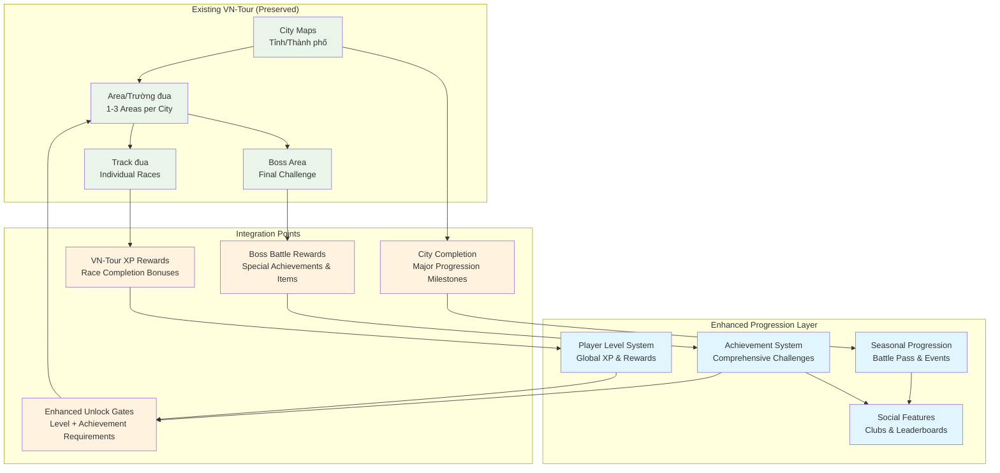

# Enhanced Progression System - Complete Documentation Summary

**Project**: PrototypeRacing  
**Document**: Enhanced Progression System Summary  
**Version**: 2.0  
**Date**: 2025-09-07  
**Status**: Development Documentation Suite

## 📋 **Documentation Overview**

This document provides a comprehensive summary of the Enhanced Progression System documentation suite, integrating with the existing VN-Tour game mode and expanding it with advanced progression features.

## 🎯 **System Integration with Existing VN-Tour**

### Current VN-Tour Structure (Preserved)
Based on the existing `GDD_Progression.md`, the current VN-Tour system includes:

- **City → Area → Track** hierarchy
- **Car Rating (CR)** system for performance gating
- **Race Track Ladder Base Progression**
- **Fan Service** mechanics during races
- **Monetization** integration

### Enhanced Integration
Our enhanced system **builds upon** the existing VN-Tour structure:

## 📚 **Complete Documentation Suite**

### 1. **Enhanced_Progression_System.md** ✅
**Purpose**: Main design document với comprehensive progression features
**Key Features**:
- Player Level System (1-100+)
- Enhanced Car Rating (CR) System với performance tiers
- VN-Tour Campaign integration với star rating system
- Advanced unlock mechanisms
- Seasonal progression tracks với battle pass
- Achievement-based rewards system
- Social progression elements (clubs, leaderboards)
- Mobile-specific optimizations

### 2. **Technical_Implementation_Specs.md** ✅
**Purpose**: Detailed technical specifications cho development team
**Key Components**:
- `UProgressionSubsystem` - Core progression management
- `UAchievementManager` - Achievement tracking và rewards
- `UBattlePassManager` - Seasonal progression handling
- `UClubManager` - Social features management
- Complete class definitions với mobile optimization
- Event system integration
- Performance monitoring systems

### 3. **Data_Structure_Definitions.md** ✅
**Purpose**: Comprehensive data structures cho all progression features
**Key Structures**:
- `FPlayerProgressionData` - Core player progression
- `FAchievementDefinition` - Achievement system data
- `FSeasonalProgressionData` - Battle pass và seasonal content
- `FClubData` - Social system structures
- `FLeaderboardEntry` - Ranking system data
- Mobile-specific data structures
- Validation và integrity checking

### 4. **API_Integration_Guidelines.md** ✅
**Purpose**: Integration guidelines với existing PrototypeRacing systems
**Integration Points**:
- Racing System integration với race completion rewards
- Car Customization integration với progression-locked parts
- UI/UX System integration với progress displays
- Save System integration với cloud sync
- Event system cho cross-system communication
- Analytics integration cho progression tracking

### 5. **Testing_Validation_Procedures.md** ✅
**Purpose**: Comprehensive testing framework cho quality assurance
**Testing Coverage**:
- Unit testing framework cho core components
- Integration testing cho system interactions
- Mobile-specific testing (performance, battery, network)
- Balance testing cho XP curves và reward distribution
- Automated CI pipeline với regression testing
- Device testing framework cho multiple platforms

## 🔗 **Integration với Existing Systems**

### VN-Tour Enhancement
The existing VN-Tour structure is **preserved và enhanced**:

#### Original VN-Tour Features (Maintained)
- City → Area → Track progression structure
- Car Rating (CR) system cho performance gating
- Boss battles at end of each city
- Vietnamese cultural themes và locations
- Fan service mechanics during races

#### New Enhanced Features (Added)
- **Star Rating System**: 1-3 stars per track based on performance
- **Perfect Run Challenges**: Special conditions cho 3-star completion
- **Story Integration**: Enhanced cutscenes và character development
- **Achievement Integration**: VN-Tour specific achievements
- **Seasonal Events**: Limited-time VN-Tour content
- **Social Features**: Club challenges based on VN-Tour progress

### Car Customization Integration
- **Progression-Locked Parts**: Parts unlock through VN-Tour progress
- **City-Specific Rewards**: Unique parts từ completing cities
- **Boss Battle Rewards**: Exclusive customization items
- **Achievement Rewards**: Special liveries và decals

### Mobile Optimization Integration
- **Offline VN-Tour**: Continue campaign progress offline
- **Cloud Sync**: Cross-device VN-Tour progress
- **Performance Adaptation**: Dynamic quality based on device
- **Battery Optimization**: Efficient VN-Tour gameplay

## 🎮 **Enhanced Player Experience**

### Short-Term Goals (Daily/Weekly)
- Complete daily VN-Tour races
- Earn daily login bonuses
- Progress through current city areas
- Complete daily achievements
- Participate in club challenges

### Medium-Term Goals (Monthly)
- Complete entire cities in VN-Tour
- Unlock new car customization parts
- Progress through seasonal battle pass
- Achieve higher club rankings
- Master specific racing skills

### Long-Term Goals (Seasonal/Yearly)
- Complete entire VN-Tour campaign
- Reach maximum player level
- Collect all achievements
- Lead successful racing clubs
- Participate in seasonal championships

## 📱 **Mobile-First Design Principles**

### Performance Optimization
- **Adaptive Quality**: Dynamic adjustment based on device performance
- **Memory Management**: Efficient resource usage < 2GB Android
- **Battery Optimization**: Power-conscious progression calculations
- **Thermal Management**: Heat-based quality reduction

### User Experience
- **Touch-Optimized**: Large touch targets, gesture support
- **Offline Capability**: Continue progression without internet
- **Quick Sessions**: Meaningful progress in short play sessions
- **Notification System**: Relevant, timely progression alerts

### Accessibility
- **Vietnamese Language**: Full Vietnamese localization support
- **Cultural Relevance**: Vietnamese themes throughout progression
- **Device Support**: Wide range of Android/iOS devices
- **Network Tolerance**: Graceful handling of poor connections

## 🚀 **Implementation Roadmap**

### Phase 1: Foundation (Weeks 1-4)
- Implement core progression subsystem
- Integrate với existing VN-Tour structure
- Basic achievement framework
- Mobile optimization foundation

### Phase 2: Enhanced Features (Weeks 5-8)
- Seasonal progression system
- Social features (clubs, leaderboards)
- Advanced achievement system
- UI/UX integration

### Phase 3: Polish & Launch (Weeks 9-12)
- Performance optimization
- Comprehensive testing
- Balance tuning
- Launch preparation

## 📊 **Success Metrics**

### Engagement Metrics
- **Daily Active Users**: Consistent player base growth
- **Session Length**: Average 15-20 minutes per session
- **Retention Rates**: 70% day-1, 40% day-7, 20% day-30
- **VN-Tour Completion**: 60% players complete first city

### Progression Metrics
- **Level Distribution**: Smooth progression curve
- **Achievement Unlock Rate**: 80% players unlock first achievements
- **Seasonal Participation**: 50% players engage với battle pass
- **Social Engagement**: 30% players join clubs

### Technical Metrics
- **Performance**: 60 FPS high-end, 30 FPS minimum mobile
- **Memory Usage**: < 2GB Android, < 3GB iOS
- **Crash Rate**: < 0.1% crash rate
- **Load Times**: < 3 seconds asset loading

## 🏆 **Conclusion**

The Enhanced Progression System documentation suite provides a comprehensive framework that:

✅ **Preserves** existing VN-Tour game mode structure  
✅ **Enhances** với advanced progression features  
✅ **Integrates** seamlessly với existing PrototypeRacing systems  
✅ **Optimizes** cho mobile-first experience  
✅ **Provides** complete technical implementation guidance  
✅ **Ensures** quality through comprehensive testing procedures  

The system is designed to create long-term player engagement while maintaining the cultural authenticity và racing excitement that makes PrototypeRacing unique.

**Documentation Status**: ✅ **COMPLETE & IMPLEMENTATION-READY**

---

**Next Steps**: Begin Phase 1 implementation following the technical specifications và integration guidelines provided in this documentation suite.
