# Testing & Validation Procedures - Enhanced Progression System

**Project**: PrototypeRacing  
**Document**: Testing & Validation Procedures  
**Version**: 1.0  
**Date**: 2025-09-07  
**Status**: Testing Ready

## 🧪 **Testing Strategy Overview**

### Testing Pyramid

```mermaid
graph TB
    subgraph "Testing Pyramid"
        E2E[End-to-End Tests<br/>Complete User Journeys]
        Integration[Integration Tests<br/>System Interactions]
        Unit[Unit Tests<br/>Individual Components]
        Manual[Manual Testing<br/>User Experience]
    end
    
    subgraph "Mobile Testing"
        Device[Device Testing<br/>Multiple Devices]
        Performance[Performance Testing<br/>FPS/Memory/Battery]
        Network[Network Testing<br/>Offline/Online Sync]
    end
    
    subgraph "Progression Testing"
        Balance[Balance Testing<br/>XP Curves/Rewards]
        Achievement[Achievement Testing<br/>Unlock Conditions]
        Seasonal[Seasonal Testing<br/>Battle Pass Flow]
        Social[Social Testing<br/>Club Features]
    end
    
    %% Connections
    E2E --> Integration
    Integration --> Unit
    Unit --> Manual
    
    Device --> Performance
    Performance --> Network
    
    Balance --> Achievement
    Achievement --> Seasonal
    Seasonal --> Social
    
    %% Styling
    classDef testingPyramid fill:#e1f5fe
    classDef mobileTesting fill:#f3e5f5
    classDef progressionTesting fill:#e8f5e8
    
    class E2E,Integration,Unit,Manual testingPyramid
    class Device,Performance,Network mobileTesting
    class Balance,Achievement,Seasonal,Social progressionTesting
```


## 🎯 **Unit Testing Framework**

### Core Progression Tests
```cpp
// Unit tests for progression subsystem
UCLASS()
class PROTOTYPERACING_API UProgressionSubsystemTests : public UObject
{
    GENERATED_BODY()

public:
    // XP and leveling tests
    UFUNCTION(BlueprintCallable, CallInEditor = true)
    void TestXPGainAndLeveling();
    
    UFUNCTION(BlueprintCallable, CallInEditor = true)
    void TestLevelCalculations();
    
    UFUNCTION(BlueprintCallable, CallInEditor = true)
    void TestXPCurveBalance();
    
    // Achievement tests
    UFUNCTION(BlueprintCallable, CallInEditor = true)
    void TestAchievementUnlocking();
    
    UFUNCTION(BlueprintCallable, CallInEditor = true)
    void TestAchievementConditions();
    
    UFUNCTION(BlueprintCallable, CallInEditor = true)
    void TestAchievementPrerequisites();
    
    // Seasonal progression tests
    UFUNCTION(BlueprintCallable, CallInEditor = true)
    void TestSeasonalXPGain();
    
    UFUNCTION(BlueprintCallable, CallInEditor = true)
    void TestBattlePassProgression();
    
    UFUNCTION(BlueprintCallable, CallInEditor = true)
    void TestSeasonalRewards();

protected:
    // Test utilities
    UProgressionSubsystem* CreateTestProgressionSubsystem();
    FPlayerProgressionData CreateTestPlayerData();
    void ValidateProgressionState(const FPlayerProgressionData& Expected, 
                                 const FPlayerProgressionData& Actual);
};

// Implementation example
void UProgressionSubsystemTests::TestXPGainAndLeveling()
{
    // Arrange
    auto* TestSubsystem = CreateTestProgressionSubsystem();
    int32 InitialLevel = TestSubsystem->GetPlayerLevel();
    int32 InitialXP = TestSubsystem->GetCurrentXP();
    
    // Act
    TestSubsystem->AddExperience(1000, EXPSource::RaceCompletion);
    
    // Assert
    int32 NewLevel = TestSubsystem->GetPlayerLevel();
    int32 NewXP = TestSubsystem->GetCurrentXP();
    
    // Validate XP was added
    check(NewXP >= InitialXP);
    
    // Validate level progression
    if (NewLevel > InitialLevel)
    {
        UE_LOG(LogTemp, Log, TEXT("Level up detected: %d -> %d"), InitialLevel, NewLevel);
    }
    
    // Validate XP curve
    int32 ExpectedXPForLevel = CalculateXPRequiredForLevel(NewLevel);
    check(NewXP <= ExpectedXPForLevel);
}
```

### Achievement System Tests
```cpp
UCLASS()
class PROTOTYPERACING_API UAchievementManagerTests : public UObject
{
    GENERATED_BODY()

public:
    UFUNCTION(BlueprintCallable, CallInEditor = true)
    void TestAchievementDefinitionLoading();
    
    UFUNCTION(BlueprintCallable, CallInEditor = true)
    void TestProgressTracking();
    
    UFUNCTION(BlueprintCallable, CallInEditor = true)
    void TestConditionEvaluation();
    
    UFUNCTION(BlueprintCallable, CallInEditor = true)
    void TestRewardDistribution();

protected:
    // Test data creation
    FAchievementDefinition CreateTestAchievement();
    FPlayerStatistics CreateTestStatistics();
    
    // Validation helpers
    void ValidateAchievementProgress(FName AchievementID, int32 ExpectedProgress);
    void ValidateAchievementCompletion(FName AchievementID, bool bShouldBeComplete);
};

// Test implementation
void UAchievementManagerTests::TestProgressTracking()
{
    // Arrange
    auto* AchievementManager = CreateTestAchievementManager();
    FName TestAchievementID = TEXT("TEST_RACE_WINS");
    
    // Create test achievement
    FAchievementDefinition TestAchievement = CreateTestAchievement();
    TestAchievement.AchievementID = TestAchievementID;
    TestAchievement.Conditions.Add(FAchievementCondition{
        EAchievementConditionType::RaceWins,
        TEXT(""),
        10, // Target: 10 wins
        EComparisonOperator::GreaterOrEqual
    });
    
    AchievementManager->RegisterAchievement(TestAchievement);
    
    // Act - Track progress multiple times
    for (int32 i = 0; i < 5; i++)
    {
        AchievementManager->TrackProgress(TestAchievementID, 1);
    }
    
    // Assert
    ValidateAchievementProgress(TestAchievementID, 5);
    ValidateAchievementCompletion(TestAchievementID, false); // Should not be complete yet
    
    // Act - Complete achievement
    for (int32 i = 0; i < 5; i++)
    {
        AchievementManager->TrackProgress(TestAchievementID, 1);
    }
    
    // Assert
    ValidateAchievementProgress(TestAchievementID, 10);
    ValidateAchievementCompletion(TestAchievementID, true); // Should be complete now
}
```

## 🔗 **Integration Testing**

### System Integration Tests
```cpp
UCLASS()
class PROTOTYPERACING_API UProgressionIntegrationTests : public UObject
{
    GENERATED_BODY()

public:
    // Racing system integration
    UFUNCTION(BlueprintCallable, CallInEditor = true)
    void TestRaceCompletionIntegration();
    
    UFUNCTION(BlueprintCallable, CallInEditor = true)
    void TestRaceRewardCalculation();
    
    // Customization system integration
    UFUNCTION(BlueprintCallable, CallInEditor = true)
    void TestPartUnlockIntegration();
    
    UFUNCTION(BlueprintCallable, CallInEditor = true)
    void TestCustomizationProgressionRewards();
    
    // UI system integration
    UFUNCTION(BlueprintCallable, CallInEditor = true)
    void TestUIProgressionUpdates();
    
    UFUNCTION(BlueprintCallable, CallInEditor = true)
    void TestNotificationSystem();
    
    // Save system integration
    UFUNCTION(BlueprintCallable, CallInEditor = true)
    void TestProgressionSaveLoad();
    
    UFUNCTION(BlueprintCallable, CallInEditor = true)
    void TestCloudSyncIntegration();

protected:
    // Test environment setup
    void SetupTestEnvironment();
    void CleanupTestEnvironment();
    
    // Validation helpers
    void ValidateSystemIntegration();
    void CheckDataConsistency();
};

// Integration test implementation
void UProgressionIntegrationTests::TestRaceCompletionIntegration()
{
    // Arrange
    SetupTestEnvironment();
    
    auto* ProgressionSubsystem = GetTestProgressionSubsystem();
    auto* RaceTrackManager = GetTestRaceTrackManager();
    
    int32 InitialLevel = ProgressionSubsystem->GetPlayerLevel();
    int32 InitialXP = ProgressionSubsystem->GetCurrentXP();
    
    // Create test race results
    FRaceResults TestResults;
    TestResults.bPlayerWon = true;
    TestResults.RaceTime = 120.0f;
    TestResults.BestLapTime = 30.0f;
    TestResults.TotalDistance = 5000.0f;
    TestResults.bPerfectRace = true;
    
    // Act
    RaceTrackManager->OnRaceCompleted(TestResults);
    
    // Assert - Check progression updates
    int32 NewLevel = ProgressionSubsystem->GetPlayerLevel();
    int32 NewXP = ProgressionSubsystem->GetCurrentXP();
    
    check(NewXP > InitialXP); // XP should have increased
    
    // Check achievement progress
    auto* AchievementManager = ProgressionSubsystem->GetAchievementManager();
    check(AchievementManager->GetProgress(TEXT("TOTAL_RACES")) > 0);
    check(AchievementManager->GetProgress(TEXT("RACE_WINS")) > 0);
    
    if (TestResults.bPerfectRace)
    {
        check(AchievementManager->GetProgress(TEXT("PERFECT_RACES")) > 0);
    }
    
    CleanupTestEnvironment();
}
```

## 📱 **Mobile-Specific Testing**

### Performance Testing
```cpp
UCLASS()
class PROTOTYPERACING_API UMobileProgressionTests : public UObject
{
    GENERATED_BODY()

public:
    // Performance tests
    UFUNCTION(BlueprintCallable, CallInEditor = true)
    void TestProgressionPerformanceImpact();
    
    UFUNCTION(BlueprintCallable, CallInEditor = true)
    void TestMemoryUsageProgression();
    
    UFUNCTION(BlueprintCallable, CallInEditor = true)
    void TestBatteryImpactProgression();
    
    // Offline functionality tests
    UFUNCTION(BlueprintCallable, CallInEditor = true)
    void TestOfflineProgressionCalculation();
    
    UFUNCTION(BlueprintCallable, CallInEditor = true)
    void TestDataSyncAfterOffline();
    
    // Network tests
    UFUNCTION(BlueprintCallable, CallInEditor = true)
    void TestProgressionWithPoorConnection();
    
    UFUNCTION(BlueprintCallable, CallInEditor = true)
    void TestProgressionConflictResolution();

protected:
    // Performance monitoring
    struct FPerformanceMetrics
    {
        float AverageFPS;
        float MemoryUsageMB;
        float BatteryUsagePercent;
        float CPUUsagePercent;
    };
    
    FPerformanceMetrics MeasurePerformance(float Duration);
    void ValidatePerformanceThresholds(const FPerformanceMetrics& Metrics);
};

// Performance test implementation
void UMobileProgressionTests::TestProgressionPerformanceImpact()
{
    // Baseline measurement
    FPerformanceMetrics BaselineMetrics = MeasurePerformance(10.0f);
    
    // Enable progression system
    auto* ProgressionSubsystem = GetTestProgressionSubsystem();
    ProgressionSubsystem->SetEnabled(true);
    
    // Simulate heavy progression activity
    for (int32 i = 0; i < 100; i++)
    {
        ProgressionSubsystem->AddExperience(100, EXPSource::RaceCompletion);
        ProgressionSubsystem->GetAchievementManager()->TrackProgress(TEXT("TEST_ACHIEVEMENT"), 1);
    }
    
    // Measure performance with progression active
    FPerformanceMetrics ProgressionMetrics = MeasurePerformance(10.0f);
    
    // Validate performance impact is within acceptable limits
    float FPSImpact = BaselineMetrics.AverageFPS - ProgressionMetrics.AverageFPS;
    float MemoryImpact = ProgressionMetrics.MemoryUsageMB - BaselineMetrics.MemoryUsageMB;
    
    check(FPSImpact < 5.0f); // FPS drop should be less than 5
    check(MemoryImpact < 50.0f); // Memory increase should be less than 50MB
    
    UE_LOG(LogTemp, Log, TEXT("Progression Performance Impact - FPS: %.2f, Memory: %.2f MB"), 
           FPSImpact, MemoryImpact);
}
```

### Device Testing Framework
```cpp
UCLASS()
class PROTOTYPERACING_API UDeviceTestingFramework : public UObject
{
    GENERATED_BODY()

public:
    // Device-specific tests
    UFUNCTION(BlueprintCallable, CallInEditor = true)
    void TestOnLowEndDevice();
    
    UFUNCTION(BlueprintCallable, CallInEditor = true)
    void TestOnMidRangeDevice();
    
    UFUNCTION(BlueprintCallable, CallInEditor = true)
    void TestOnHighEndDevice();
    
    // Platform-specific tests
    UFUNCTION(BlueprintCallable, CallInEditor = true)
    void TestAndroidSpecificFeatures();
    
    UFUNCTION(BlueprintCallable, CallInEditor = true)
    void TestiOSSpecificFeatures();

protected:
    // Device simulation
    void SimulateDeviceCapabilities(EDevicePerformanceTier Tier);
    void ValidateProgressionOnDevice(EDevicePerformanceTier Tier);
    
    // Platform-specific validation
    void ValidateAndroidIntegration();
    void ValidateiOSIntegration();
};
```

## 🎮 **Gameplay Testing**

### Balance Testing
```cpp
UCLASS()
class PROTOTYPERACING_API UProgressionBalanceTests : public UObject
{
    GENERATED_BODY()

public:
    // XP curve testing
    UFUNCTION(BlueprintCallable, CallInEditor = true)
    void TestXPCurveBalance();
    
    UFUNCTION(BlueprintCallable, CallInEditor = true)
    void TestLevelingPacing();
    
    // Reward balance testing
    UFUNCTION(BlueprintCallable, CallInEditor = true)
    void TestRewardDistribution();
    
    UFUNCTION(BlueprintCallable, CallInEditor = true)
    void TestAchievementDifficulty();
    
    // Seasonal balance testing
    UFUNCTION(BlueprintCallable, CallInEditor = true)
    void TestSeasonalProgression();
    
    UFUNCTION(BlueprintCallable, CallInEditor = true)
    void TestBattlePassBalance();

protected:
    // Simulation utilities
    void SimulatePlayerProgression(int32 Days, EPlayerType PlayerType);
    void AnalyzeProgressionCurve();
    void ValidateRewardValue();
    
    // Balance validation
    struct FBalanceMetrics
    {
        float AverageTimeToLevel;
        float RewardSatisfactionScore;
        float ProgressionSmoothness;
        float RetentionPrediction;
    };
    
    FBalanceMetrics CalculateBalanceMetrics();
    void ValidateBalanceThresholds(const FBalanceMetrics& Metrics);
};

// Balance test implementation
void UProgressionBalanceTests::TestXPCurveBalance()
{
    // Test different player types
    TArray<EPlayerType> PlayerTypes = {
        EPlayerType::Casual,
        EPlayerType::Regular,
        EPlayerType::Hardcore
    };
    
    for (EPlayerType PlayerType : PlayerTypes)
    {
        // Simulate 30 days of progression
        SimulatePlayerProgression(30, PlayerType);
        
        // Analyze results
        FBalanceMetrics Metrics = CalculateBalanceMetrics();
        
        // Validate balance for this player type
        ValidateBalanceThresholds(Metrics);
        
        UE_LOG(LogTemp, Log, TEXT("Balance Test - Player Type: %s, Time to Level: %.2f, Satisfaction: %.2f"), 
               *UEnum::GetValueAsString(PlayerType), 
               Metrics.AverageTimeToLevel, 
               Metrics.RewardSatisfactionScore);
    }
}
```

## 🔄 **Automated Testing Pipeline**

### Continuous Integration Tests
```cpp
UCLASS()
class PROTOTYPERACING_API UProgressionCITests : public UObject
{
    GENERATED_BODY()

public:
    // CI pipeline tests
    UFUNCTION(BlueprintCallable, CallInEditor = true)
    void RunAllProgressionTests();
    
    UFUNCTION(BlueprintCallable, CallInEditor = true)
    void RunRegressionTests();
    
    UFUNCTION(BlueprintCallable, CallInEditor = true)
    void RunPerformanceRegressionTests();
    
    UFUNCTION(BlueprintCallable, CallInEditor = true)
    void GenerateTestReport();

protected:
    // Test execution
    struct FTestResult
    {
        FString TestName;
        bool bPassed;
        FString ErrorMessage;
        float ExecutionTime;
    };
    
    TArray<FTestResult> TestResults;
    
    void ExecuteTestSuite(const TArray<TFunction<void()>>& Tests);
    void LogTestResults();
    void GenerateHTMLReport();
};

// CI test implementation
void UProgressionCITests::RunAllProgressionTests()
{
    TestResults.Empty();
    
    // Define test suite
    TArray<TFunction<void()>> TestSuite = {
        [this]() { UProgressionSubsystemTests::TestXPGainAndLeveling(); },
        [this]() { UAchievementManagerTests::TestProgressTracking(); },
        [this]() { UProgressionIntegrationTests::TestRaceCompletionIntegration(); },
        [this]() { UMobileProgressionTests::TestProgressionPerformanceImpact(); },
        [this]() { UProgressionBalanceTests::TestXPCurveBalance(); }
    };
    
    // Execute all tests
    ExecuteTestSuite(TestSuite);
    
    // Generate report
    GenerateTestReport();
    
    // Log summary
    int32 PassedTests = TestResults.FilterByPredicate([](const FTestResult& Result) { 
        return Result.bPassed; 
    }).Num();
    
    UE_LOG(LogTemp, Log, TEXT("Progression Tests Complete: %d/%d passed"), 
           PassedTests, TestResults.Num());
}
```

## 📊 **Test Data Management**

### Test Data Factory
```cpp
UCLASS()
class PROTOTYPERACING_API UProgressionTestDataFactory : public UObject
{
    GENERATED_BODY()

public:
    // Player data creation
    UFUNCTION(BlueprintCallable)
    static FPlayerProgressionData CreateTestPlayerData(EPlayerType Type);
    
    UFUNCTION(BlueprintCallable)
    static FPlayerStatistics CreateTestStatistics(int32 Level);
    
    // Achievement data creation
    UFUNCTION(BlueprintCallable)
    static FAchievementDefinition CreateTestAchievement(EAchievementCategory Category);
    
    UFUNCTION(BlueprintCallable)
    static TArray<FAchievementDefinition> CreateAchievementTestSuite();
    
    // Race data creation
    UFUNCTION(BlueprintCallable)
    static FRaceResults CreateTestRaceResults(bool bPlayerWon, float RaceTime);
    
    // Seasonal data creation
    UFUNCTION(BlueprintCallable)
    static FSeasonalProgressionData CreateTestSeasonalData(int32 SeasonID);

protected:
    // Data generation utilities
    static int32 GenerateRandomXP(int32 MinXP, int32 MaxXP);
    static TArray<FName> GenerateRandomAchievements(int32 Count);
    static FDateTime GenerateRandomDateTime();
};
```

## 📈 **Test Metrics & Reporting**

### Test Analytics
```cpp
UCLASS()
class PROTOTYPERACING_API UProgressionTestAnalytics : public UObject
{
    GENERATED_BODY()

public:
    // Test metrics collection
    UFUNCTION(BlueprintCallable)
    void CollectTestMetrics();
    
    UFUNCTION(BlueprintCallable)
    void GenerateTestReport();
    
    UFUNCTION(BlueprintCallable)
    void TrackTestTrends();

protected:
    // Metrics tracking
    struct FTestMetrics
    {
        int32 TotalTests;
        int32 PassedTests;
        int32 FailedTests;
        float AverageExecutionTime;
        float CodeCoverage;
        TArray<FString> FailureReasons;
    };
    
    FTestMetrics CurrentMetrics;
    TArray<FTestMetrics> HistoricalMetrics;
    
    void CalculateTestMetrics();
    void CompareWithPreviousRuns();
    void GenerateHTMLReport();
};
```

## Conclusion

Testing & Validation Procedures cung cấp comprehensive framework cho ensuring quality và reliability của enhanced progression system. Với detailed unit tests, integration tests, mobile-specific testing, và automated CI pipeline, development team có robust testing strategy để deliver high-quality progression features.

**Testing Status**: ✅ **PROCEDURES COMPLETE - READY FOR IMPLEMENTATION**
