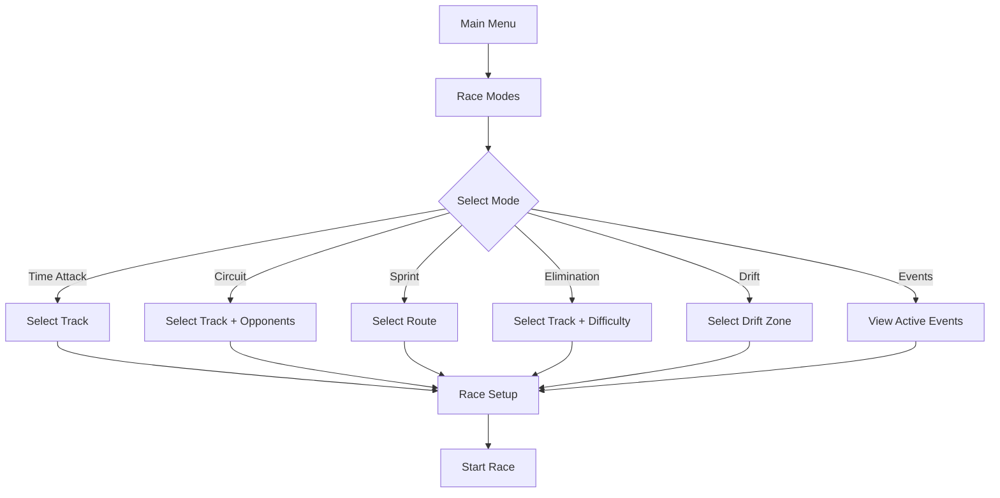

# Race Modes Feature

**Version:** 1.0.0 | **Date:** 2026-01-20 | **Status:** Development


**Breadcrumbs:** [Docs](../../) > [Features](../) > Race Modes

**Feature ID**: `race-modes`  
**Priority**: High  
**Owner**: Game Design Team

---

## Overview

The Race Modes feature provides diverse racing experiences for PrototypeRacing, from solo time trials to competitive multiplayer races. Each mode offers unique challenges and rewards, keeping gameplay fresh and engaging across the VN-Tour campaign.

### Key Capabilities

- **Time Attack**: Solo racing against the clock with ghost cars
- **Circuit Race**: Multi-lap races with AI or multiplayer opponents
- **Sprint Race**: Point-to-point races through city streets
- **Elimination**: Last-place elimination each lap
- **Drift Challenge**: Score-based drifting competitions
- **Daily/Weekly Events**: Rotating special challenges

---

## Feature Structure

```
race-modes/
├── requirements/       # Mode specifications, rules, scoring
├── design/            # Mode mechanics, AI behavior, balancing
├── planning/          # Implementation roadmap per mode
├── implementation/    # Mode managers, scoring systems
└── testing/           # Mode testing, balance validation
```

**Source Code Location:** `Source/PrototypeRacing/Private/RaceMode/`

---

## Quick Links

### Requirements
- [Race Mode: Time Attack V2](requirements/RaceMode_TimeAttack_V2_20251104.docx) - Time Attack specification

---

## Race Modes

### 1. Time Attack ✅

**Status**: Production  
**Description**: Solo racing against the clock with ghost car replays

**Rules**:
- Single player only
- 3 laps per race
- Ghost car shows personal best
- Star ratings based on time
- Leaderboard integration

**Star Ratings**:
- ⭐ Bronze: Complete the race
- ⭐⭐ Silver: Beat target time
- ⭐⭐⭐ Gold: Beat gold time

**Rewards**:
- XP: 100-300 based on stars
- Coins: 50-200 based on stars
- Leaderboard ranking

---

### 2. Circuit Race 🔄

**Status**: In Development  
**Description**: Traditional multi-lap races with opponents

**Rules**:
- 2-8 racers (AI or multiplayer)
- 3-5 laps depending on track length
- Position-based scoring
- Collision physics enabled
- Drafting mechanics

**Scoring**:
- 1st place: 25 points
- 2nd place: 18 points
- 3rd place: 15 points
- 4th place: 12 points
- 5th place: 10 points
- 6th place: 8 points
- 7th place: 6 points
- 8th place: 4 points

**Rewards**:
- XP: 200-500 based on position
- Coins: 100-500 based on position
- Championship points (career mode)

---

### 3. Sprint Race ⏳

**Status**: Planned  
**Description**: Point-to-point races through city streets

**Rules**:
- Single lap, long distance
- 2-8 racers
- Checkpoint system
- Traffic obstacles (optional)
- Shortcut discovery

**Features**:
- Dynamic routes through Vietnamese cities
- Landmark checkpoints
- Risk/reward shortcuts
- Traffic density settings

**Rewards**:
- XP: 150-400
- Coins: 75-300
- City exploration bonuses

---

### 4. Elimination ⏳

**Status**: Planned  
**Description**: Last-place racer eliminated each lap

**Rules**:
- 6-8 racers start
- Last place eliminated every lap
- 5-7 laps total
- Increasing pressure
- Survival-based scoring

**Elimination Schedule**:
- Lap 1: 8 → 7 racers
- Lap 2: 7 → 6 racers
- Lap 3: 6 → 5 racers
- Lap 4: 5 → 4 racers
- Lap 5: 4 → 3 racers
- Lap 6: 3 → 2 racers
- Lap 7: Final showdown

**Rewards**:
- XP: 300-600 based on survival
- Coins: 200-600
- Bonus for winning

---

### 5. Drift Challenge ⏳

**Status**: Planned  
**Description**: Score-based drifting competitions

**Rules**:
- Solo or multiplayer
- 3-minute time limit
- Drift zones on track
- Combo multipliers
- Style points

**Scoring System**:
- Drift angle: 1-10 points/second
- Speed bonus: ×1.0 - ×2.0
- Combo multiplier: ×1 - ×10
- Perfect drift: +100 bonus
- Wall touch: Reset combo

**Rewards**:
- XP: 150-400 based on score
- Coins: 100-400
- Drift-specific achievements

---

### 6. Daily/Weekly Events ⏳

**Status**: Planned  
**Description**: Rotating special challenges with unique rewards

**Event Types**:
- **Daily Challenge**: Single race with special conditions
- **Weekly Tournament**: Series of races with cumulative scoring
- **Seasonal Events**: Vietnamese holiday-themed races
- **Community Events**: Global challenges with shared goals

**Special Conditions**:
- Weather effects (rain, fog)
- Time of day (night racing)
- Vehicle restrictions
- Reverse tracks
- Special power-ups

**Rewards**:
- Exclusive vehicles
- Limited-time customization
- Bonus currency
- Special achievements

---

## Mode Selection Flow



---

## AI Difficulty Levels

### Easy
- Slower acceleration
- Lower top speed (85%)
- More mistakes
- Easier to overtake

### Medium
- Balanced performance (95%)
- Occasional mistakes
- Competitive racing
- Fair challenge

### Hard
- Near-perfect driving (100%)
- Aggressive overtaking
- Minimal mistakes
- Challenging competition

### Expert
- Perfect racing lines (105%)
- Aggressive blocking
- No mistakes
- Maximum challenge

---

## Scoring and Rewards

### XP Calculation
```cpp
int32 CalculateXP(ERaceMode Mode, int32 Position, int32 Stars, float RaceTime)
{
    int32 BaseXP = GetModeBaseXP(Mode);
    float PositionMultiplier = GetPositionMultiplier(Position);
    float StarBonus = Stars * 50;
    float TimeBonus = CalculateTimeBonus(RaceTime);
    
    return BaseXP * PositionMultiplier + StarBonus + TimeBonus;
}
```

### Coin Calculation
```cpp
int32 CalculateCoins(ERaceMode Mode, int32 Position, int32 Stars)
{
    int32 BaseCoins = GetModeBaseCoins(Mode);
    float PositionMultiplier = GetPositionMultiplier(Position);
    float StarBonus = Stars * 25;
    
    return BaseCoins * PositionMultiplier + StarBonus;
}
```

---

## Dependencies

### Internal Dependencies
- **Racing Car Physics**: Vehicle dynamics for all modes
- **Progression System**: XP, rewards, unlocks
- **Multiplayer**: Online racing for Circuit and Elimination
- **UI/UX System**: Mode selection, HUD, results screens

### External Dependencies
- **Nakama**: Leaderboards, ghost data storage
- **Edgegap**: Dedicated servers for multiplayer modes

---

## Performance Targets

| Metric | Target | Current |
|--------|--------|---------|
| **Mode Load Time** | <2s | ✅ 1.5s (Time Attack) |
| **AI Count** | 8 opponents | 🔄 4 opponents |
| **Frame Rate** | 60 FPS | ✅ 60 FPS |
| **Network Latency** | <100ms | 🔄 Testing |

---

## Testing Strategy

### Mode Testing
- Rule validation for each mode
- Scoring accuracy
- AI behavior testing
- Balance testing (difficulty, rewards)

### Multiplayer Testing
- Network synchronization
- Latency handling
- Disconnection recovery
- Cheating prevention

### Performance Testing
- 8-player races at 60 FPS
- AI pathfinding performance
- Memory usage with multiple opponents

---

## Future Enhancements

- [ ] **Battle Mode**: Combat racing with power-ups
- [ ] **Endurance**: Long-distance races with pit stops
- [ ] **Relay**: Team-based racing
- [ ] **Photo Finish**: Extreme close races
- [ ] **Ghost Racing**: Race against developer/celebrity ghosts
- [ ] **Custom Events**: Player-created challenges

---

## Related Features

- [Racing Car Physics](../racing-car-physics/README.md) - Vehicle dynamics
- [Progression System](../progression-system/README.md) - XP and rewards
- [Multiplayer](../multiplayer/README.md) - Online racing
- [UI/UX System](../ui-ux-system/README.md) - Mode selection UI

---

## References

### Architecture
- [System Overview](../../_architecture/system-overview.md)
- [Data Flow](../../_architecture/data-flow.md)

### Standards
- [Code Standards](../../_standards/code-standards.md)
- [Data Structure Index](../../_cross-reference/data-structure-index.md)

---

**Last Updated:** 2026-01-20

