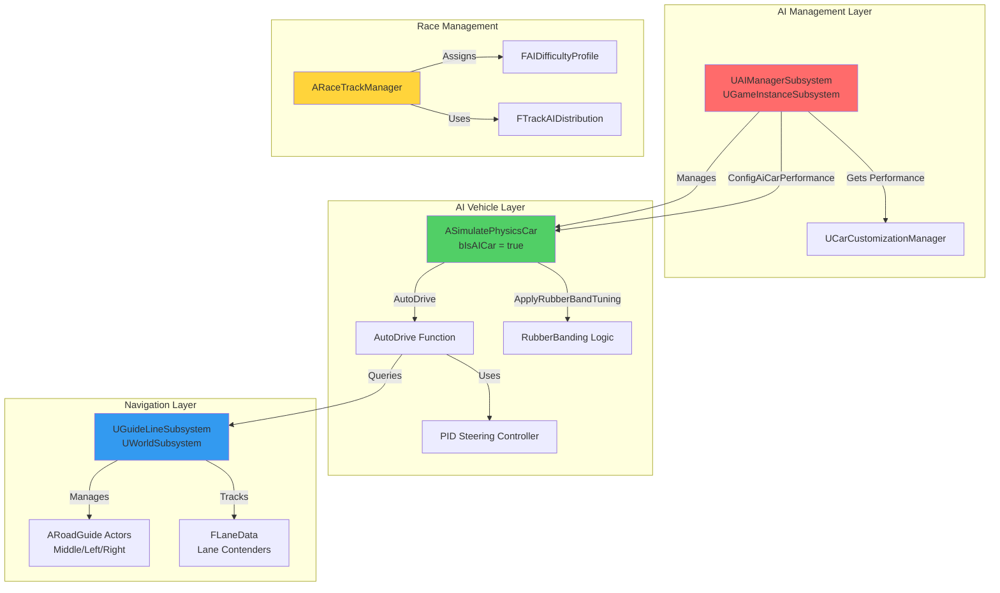
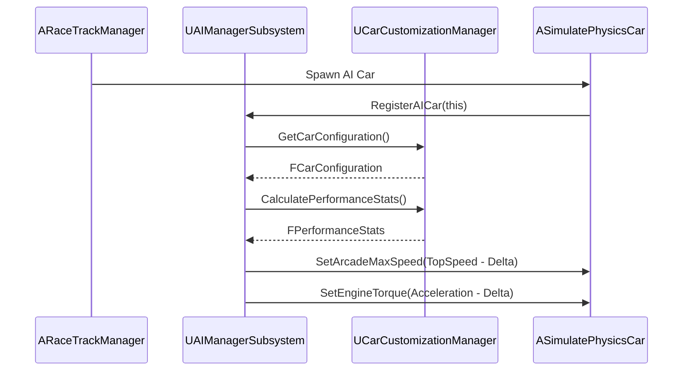
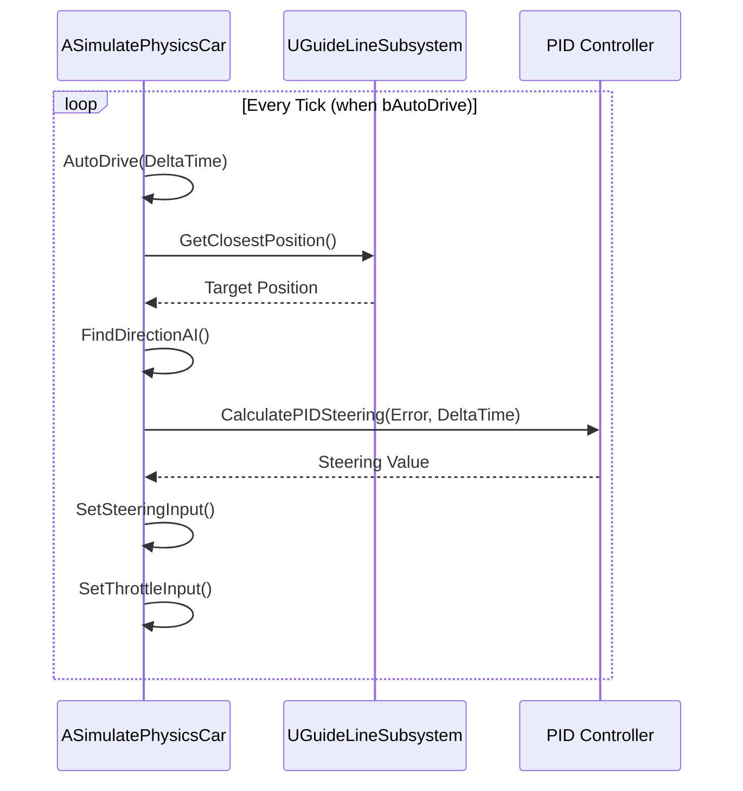
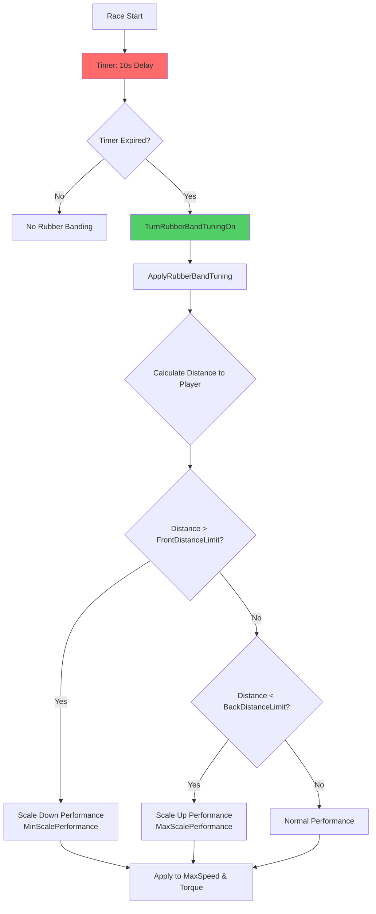

# Racer AI System Architecture - VNRacing

**Project**: PrototypeRacing - Mobile Racing Game

**Document**: Racer AI System Architecture

**Version**: 1.0.0

**Date**: 2026-01-20

**Status**: ✅ Synced with Source Code

---

## Implementation Status Overview

| Component | Status | Location |
|-----------|--------|----------|
| AIManagerSubsystem | ✅ Implemented | `Source/PrototypeRacing/Public/AISystem/AIManagerSubsystem.h` |
| GuideLineSubsystem | ✅ Implemented | `Plugins/SimpleCarPhysics/Source/SimpleCarPhysics/Public/GuideLineSubsystem.h` |
| SimulatePhysicsCar AI Functions | ✅ Implemented | `Plugins/SimpleCarPhysics/Source/SimpleCarPhysics/Public/PhysicsSimulateCar/SimulatePhysicsCar.h` |
| FAIDifficultyProfile | ✅ Implemented | `Source/PrototypeRacing/Public/RaceMode/RaceTrackManager.h` |
| EAIDifficulty Enum | ✅ Implemented | `Source/PrototypeRacing/Public/RaceMode/RaceTrackManager.h` |
| RubberBanding Logic | ✅ Implemented | Built into SimulatePhysicsCar |
| PID Steering Controller | ✅ Implemented | Built into SimulatePhysicsCar |
| Lane Management | ✅ Implemented | GuideLineSubsystem |
| AIDecisionComponent | ⏸️ In Progress | Planned as separate component |
| AIOvertakeController | ⏸️ In Progress | Planned as separate component |
| RacingLineManager | ⏸️ In Progress | Partially covered by GuideLineSubsystem |

---

## Architecture Overview

The Racer AI system uses a combination of subsystems and built-in vehicle functions to provide intelligent racing behavior. The current implementation integrates AI logic directly into `SimulatePhysicsCar` with management through `AIManagerSubsystem`.

### High-Level System Architecture (Actual Implementation)



---

## Implemented Components

### 1. UAIManagerSubsystem ✅

**Location**: `Source/PrototypeRacing/Public/AISystem/AIManagerSubsystem.h`

**Type**: `UGameInstanceSubsystem`

**Purpose**: Central manager for all AI racers in the game instance

**Actual Implementation**:
```cpp
UCLASS()
class PROTOTYPERACING_API UAIManagerSubsystem : public UGameInstanceSubsystem
{
    GENERATED_BODY()
public:
    // AI car registry
    UPROPERTY(BlueprintReadWrite, Category="AI Managers Subsystem")
    TArray<ASimulatePhysicsCar*> AICarsManager;

    // Reference to car customization for performance stats
    UPROPERTY(BlueprintReadWrite, Category="AI Managers Subsystem")
    UCarCustomizationManager* CarCustomizationManager;

    // Performance delta between AI cars
    UPROPERTY(BlueprintReadWrite, Category="AI Managers Subsystem")
    float DeltaPerformance = 10.f;

public:
    virtual void Initialize(FSubsystemCollectionBase& Collection) override;
    virtual void Deinitialize() override;

    // Register AI car and configure its performance
    UFUNCTION(BlueprintCallable, Category="AI Managers Subsystem")
    void RegisterAICar(ASimulatePhysicsCar* AICar);

    // Unregister AI car
    UFUNCTION(BlueprintCallable, Category="AI Managers Subsystem")
    void UnregisterAICar(ASimulatePhysicsCar* AICar);

    // Configure AI car performance based on player stats
    UFUNCTION(BlueprintCallable, Category="AI Managers Subsystem")
    void ConfigAiCarPerformance(ASimulatePhysicsCar* AICar);

    // Freeze/unfreeze all AI cars
    UFUNCTION(BlueprintCallable, Category="AI Managers Subsystem")
    void SetFreezeAiCar(bool bFreeze);
};
```

**Key Behaviors**:
- Initializes with dependency on `UCarCustomizationManager`
- Configures AI performance based on player's car stats minus delta
- Each subsequent AI gets progressively lower performance (`DeltaPerformance * AICarsManager.Num()`)

---

### 2. UGuideLineSubsystem ✅

**Location**: `Plugins/SimpleCarPhysics/Source/SimpleCarPhysics/Public/GuideLineSubsystem.h`

**Type**: `UWorldSubsystem`

**Purpose**: Manages virtual lanes on the track for AI navigation

**Actual Implementation**:
```cpp
USTRUCT()
struct FLaneData
{
    GENERATED_BODY()
    UPROPERTY()
    TArray<AActor*> LaneContenders;
};

UCLASS()
class SIMPLECARPHYSICS_API UGuideLineSubsystem : public UWorldSubsystem
{
    GENERATED_BODY()

public:
    virtual void Initialize(FSubsystemCollectionBase& Collection) override;

    bool HasMiddleGuideLine() const;

    // Distance queries
    UFUNCTION(BlueprintCallable)
    float GetCurrentDistanceAlongSplineAtPosition(const FVector& Location);

    UFUNCTION(BlueprintCallable)
    float GetMiddleSplineLength();

    // Position and rotation queries
    UFUNCTION(BlueprintCallable)
    void GetClosestPositionAndRotation(const FVector& WorldPosition, 
        FVector& OutPosition, FRotator& OutRotation, int LaneOffset = 0);

    UFUNCTION(BlueprintCallable)
    FVector GetClosestPosition(const FVector& WorldPosition, int LaneOffset = 0);

    UFUNCTION(BlueprintPure)
    bool GetClosestRotation(const FVector& WorldPosition, FRotator& OutRotator);

    UFUNCTION(BlueprintPure)
    bool GetDirection(const FVector& WorldPosition, FVector& OutDirection);

    // Lane management
    int GetLaneClosestToThisPosition(const FVector& WorldPosition);
    int GetLaneClosestToThisPositionAndLeastContender(const FVector& WorldPosition);
    int GetLaneClosestToThisPositionAndLeastContenderForMachine(const FVector& WorldPosition);
    int GetLaneWithLeastContender();
    void SwitchToNewLane(AActor* Contender, int LaneSelected);
    TArray<AActor*> GetContendersInLane(int32 LaneIndex) const;
    TArray<AActor*> GetAllContenders();

    // Force guide actors
    void ForceGuideActor(ARoadGuide* NewMiddleGuideActor, 
        ARoadGuide* InLeftGuideActor, ARoadGuide* InRightGuideActor);

protected:
    UPROPERTY()
    TArray<FLaneData> LanesData;

    UPROPERTY()
    ARoadGuide* MiddleGuideActor;

    UPROPERTY()
    ARoadGuide* LeftGuideActor;

    UPROPERTY()
    ARoadGuide* RightGuideActor;

    UPROPERTY()
    USplineComponent* CurrentGuideLine;

    UPROPERTY()
    float LaneWidth;
};
```

**Key Features**:
- Requires 3 `ARoadGuide` actors per track (Middle, Left, Right)
- Automatically calculates lane width from road configuration
- Tracks lane contenders to prevent clustering
- Provides lane selection algorithms for AI

---

### 3. ASimulatePhysicsCar AI Functions ✅

**Location**: `Plugins/SimpleCarPhysics/Source/SimpleCarPhysics/Public/PhysicsSimulateCar/SimulatePhysicsCar.h`

**AI-Related Properties**:
```cpp
#pragma region AI_Function

public:
    // AI identification
    UPROPERTY(EditAnywhere, Blueprintable, BlueprintReadWrite, Category = "SimulateCar|Racer AI")
    bool bIsAICar = false;

    UPROPERTY(EditAnywhere, Blueprintable, BlueprintReadWrite, Category = "SimulateCar|Racer AI")
    bool bAutoDrive = true;

    UPROPERTY(EditAnywhere, Blueprintable, BlueprintReadWrite, Category = "SimulateCar|Racer AI")
    bool bIsSlowDownAtNearlyFinishing = true;

    // Events
    UPROPERTY(BlueprintAssignable, BlueprintCallable, Category = "SimulateCar|AI Racer")
    FOnRaceNearlyFinished OnRaceNearlyFinished;

    // Freeze control
    UPROPERTY(BlueprintReadOnly, Category = "SimulateCar|AI Racer")
    bool bIsFreeze = false;

    UFUNCTION(BlueprintCallable, Category="SimulateCar")
    void SetFreeze(bool IsFreeze);

    UFUNCTION(BlueprintCallable, Category="SimulateCar|Racer AI")
    bool IsFreeze();

    // Performance configuration (Blueprint Implementable)
    UFUNCTION(BlueprintImplementableEvent, Category="SimulateCar|Racer AI")
    void SetGamePerformance(float NewTopSpeed, float NewAcceleration, 
        float NewThrottlePercentUponDriftFast, float NewTurnAngle, 
        float NewSteerSpeedMin, float NewSteerSpeedMax, 
        float NewSlowSpeed, float NewFastSpeed, 
        float NewDriftTurnFastLateralFront, float NewDriftTurnFastLateralRear, 
        float NewNitroBoostForce, float NewNitroDuration, 
        float NewNitroFollowFillRate, float NewNitroAirborneFillRate, 
        float NewNitroDriftFillRate, float NewNitroFullfillDuration);

protected:
    // Rubber banding configuration
    UPROPERTY(EditAnywhere, BlueprintReadWrite, Category = "SimulateCar|AI Racer")
    bool bIsRubberBandLogging = false;

    UPROPERTY(EditAnywhere, BlueprintReadWrite, Category = "SimulateCar|AI Racer")
    bool bIsRubberBandEnable = false;

    UPROPERTY(BlueprintReadWrite, Category = "SimulateCar|AI Racer")
    ASimulatePhysicsCar* RacingPlayer = nullptr;

    // Distance tracking
    UPROPERTY(BlueprintReadWrite, Category = "SimulateCar|AI Racer")
    int32 CurrentSplineLap = 0;

    UPROPERTY(BlueprintReadWrite, Category = "SimulateCar|AI Racer")
    float PrevSplineDistance = 0.0f;

    // Rubber band distance limits
    UPROPERTY(EditAnywhere, BlueprintReadWrite, Category = "SimulateCar|AI Racer")
    float FronDistanceLimit = 7000.0f;

    UPROPERTY(EditAnywhere, BlueprintReadWrite, Category = "SimulateCar|AI Racer")
    float BackDistanceLimit = -7000.0f;

    // Default performance values
    UPROPERTY(BlueprintReadWrite, Category = "SimulateCar|AI Racer")
    float DefaultMaxSpeed = MaxSpeed;

    UPROPERTY(BlueprintReadWrite, Category = "SimulateCar|AI Racer")
    float DefaultAcceleration = EngineTorque;

public:
    UPROPERTY(BlueprintReadWrite, Category = "SimulateCar|AI Racer")
    float TotalDistance = 0.0f;

protected:
    // Rubber band timing
    UPROPERTY(EditAnywhere, BlueprintReadWrite, Category = "SimulateCar|AI Racer")
    float TimeToStartRubberBandTuning = 10.0f;

    UPROPERTY(EditAnywhere, BlueprintReadWrite, Category = "SimulateCar|AI Racer")
    float AIBoostDuration = 4.0f;

    // Performance scaling
    UPROPERTY(EditAnywhere, BlueprintReadWrite, Category = "SimulateCar|AI Racer")
    float MaxScalePerformance = 1.5f;

    UPROPERTY(EditAnywhere, BlueprintReadWrite, Category = "SimulateCar|AI Racer")
    float MinScalePerformance = 0.5f;

    UPROPERTY(BlueprintReadWrite, Category = "SimulateCar|AI Racer")
    FTimerHandle StartRubberBandTuningTimer;

    // Path variation
    UPROPERTY(EditAnywhere, BlueprintReadWrite, Category = "SimulateCar|AI Racer")
    float MaxOffset = 0.0f;

    // PID Controller parameters
    UPROPERTY(EditAnywhere, BlueprintReadWrite, Category = "SimulateCar|AI Racer")
    float Kp = 1.0f;  // Proportional gain

    UPROPERTY(EditAnywhere, BlueprintReadWrite, Category = "SimulateCar|AI Racer")
    float Ki = 0.05f; // Integral gain

    UPROPERTY(EditAnywhere, BlueprintReadWrite, Category = "SimulateCar|AI Racer")
    float Kd = 0.1f;  // Derivative gain

    UPROPERTY(EditAnywhere, BlueprintReadWrite, Category = "SimulateCar|AI Racer")
    float PreviousError = 0.0f;

    UPROPERTY(EditAnywhere, BlueprintReadWrite, Category = "SimulateCar|AI Racer")
    float Integral = 0.0f;

    // PID output limits
    UPROPERTY(EditAnywhere, BlueprintReadWrite, Category = "SimulateCar|AI Racer")
    float UpperLimit = 1.0f;

    UPROPERTY(EditAnywhere, BlueprintReadWrite, Category = "SimulateCar|AI Racer")
    float LowerLimit = -1.0f;

    // Steering threshold
    UPROPERTY(EditAnywhere, BlueprintReadWrite, Category = "SimulateCar|AI Racer")
    float DistanceThreshold = 20.0f;

    // Slow down rate near finish
    UPROPERTY(EditAnywhere, BlueprintReadWrite, Category = "SimulateCar|AI Racer", 
        meta = (ClampMin = "0.0", ClampMax = "1.0"))
    float SlowDownRate = 0.8f;

    // Strategy Cooldown
    UPROPERTY(EditAnywhere, BlueprintReadWrite, Category = "SimulateCar|AI Racer", 
        meta = (ClampMin = "0.0", ClampMax = "1.0"))
    float ReconsiderStrategyCooldown = 3.0f;

    // AI Functions
    UFUNCTION(BlueprintCallable, Category = "SimulateCar|Racer AI")
    FRotator FindDirectionAI(float SampleDistance);

    UFUNCTION()
    void ReconsiderRaceStrategy();

    UFUNCTION(BlueprintCallable, Category = "SimulateCar|Racer AI")
    float CalculatePIDSteering(float Error, float DeltaTime);

    UFUNCTION(BlueprintCallable, Category = "SimulateCar|Racer AI")
    void AutoDrive(float DeltaTime);

public:
    UFUNCTION(BlueprintCallable, Category="SimulateCar|Racer AI")
    void CalculateTotalDistance();

protected:
    UFUNCTION(BlueprintCallable, Category="SimulateCar|Racer AI")
    void GetRacingPlayer();

    UFUNCTION(BlueprintCallable, Category="SimulateCar|Racer AI")
    void ApplyRubberBandTuning();

    UFUNCTION(BlueprintCallable, Category="SimulateCar|Racer AI")
    void TurnRubberBandTuningOn();

    UFUNCTION(BlueprintCallable, Category="SimulateCar|Racer AI")
    void AIBoostNitro();

    UFUNCTION(BlueprintCallable, Category="SimulateCar|Racer AI")
    void AISlowDown();

#pragma endregion AI_Function
```

---

### 4. FAIDifficultyProfile ✅

**Location**: `Source/PrototypeRacing/Public/RaceMode/RaceTrackManager.h`

**Actual Implementation**:
```cpp
UENUM(BlueprintType, Blueprintable)
enum class EAIDifficulty : uint8
{
    Easy = 0 UMETA(DisplayName = "Rookie"),
    Medium = 1 UMETA(DisplayName = "Racer"),
    Hard = 2 UMETA(DisplayName = "Pro")
};

USTRUCT(BlueprintType)
struct FAIDifficultyProfile
{
    GENERATED_BODY()

    UPROPERTY(EditAnywhere, BlueprintReadWrite, Category = "Profile")
    EAIDifficulty DifficultyLevel = EAIDifficulty::Easy;

    // Performance Scaling
    UPROPERTY(EditAnywhere, BlueprintReadWrite, Category = "Performance")
    float PerformanceScaleFactor = 1.0f; // 0.9 / 1.0 / 1.1

    // Skill Probabilities
    UPROPERTY(EditAnywhere, BlueprintReadWrite, Category = "Skills")
    float OvertakeProbability = 0.5f; // 0.2 / 0.5 / 0.8

    UPROPERTY(EditAnywhere, BlueprintReadWrite, Category = "Skills")
    float DefenceProbability = 0.7f; // 0.4 / 0.7 / 0.9

    UPROPERTY(EditAnywhere, BlueprintReadWrite, Category = "Skills")
    float NOSUsageFrequency = 0.5f;

    // Behavior Tuning
    UPROPERTY(EditAnywhere, BlueprintReadWrite, Category = "Behavior")
    float ReactionTime = 0.3f; // Seconds delay for decisions

    UPROPERTY(EditAnywhere, BlueprintReadWrite, Category = "Behavior")
    float SteeringPrecision = 0.8f; // PID tuning factor

    UPROPERTY(EditAnywhere, BlueprintReadWrite, Category = "Behavior")
    float RacingLineOffset = 200.0f; // Max offset from line (cm)

    FAIDifficultyProfile() = default;
};
```

---

### 5. Track AI Distribution ✅

**Location**: `Source/PrototypeRacing/Public/RaceMode/RaceTrackManager.h`

```cpp
USTRUCT(BlueprintType)
struct FTrackAIDistribution
{
    GENERATED_BODY()

    UPROPERTY(EditAnywhere, BlueprintReadWrite, 
        meta = (ClampMin = "0.0", ClampMax = "1.0"))
    float RookiePercent = 0.f;

    UPROPERTY(EditAnywhere, BlueprintReadWrite, 
        meta = (ClampMin = "0.0", ClampMax = "1.0"))
    float RacerPercent = 0.f;

    UPROPERTY(EditAnywhere, BlueprintReadWrite, 
        meta = (ClampMin = "0.0", ClampMax = "1.0"))
    float ProPercent = 0.f;
};
```

---

### 6. AI Name System ✅

**Location**: `Source/PrototypeRacing/Public/RaceMode/RaceTrackManager.h`

```cpp
USTRUCT(BlueprintType)
struct FAIName : public FTableRowBase
{
    GENERATED_BODY()

    UPROPERTY(EditAnywhere, BlueprintReadWrite)
    EAIDifficulty AIDifficulty = EAIDifficulty::Easy;

    UPROPERTY(EditAnywhere, BlueprintReadWrite)
    FText Name = FText();

    FAIName() = default;
};
```

---

## Data Flow

### AI Initialization Flow



### AI Driving Loop



### Rubber Banding Flow



---

## In Progress Components

### 1. AIDecisionComponent ⏸️

**Status**: Planned but not yet implemented as separate component

**Current State**: Decision logic is partially embedded in `AutoDrive()` function

**Planned Features**:
- State machine for AI behaviors (Normal, Overtaking, Defending, etc.)
- Global Cooldown management
- Probability-based skill activation

### 2. AIOvertakeController ⏸️

**Status**: Planned but not yet implemented

**Current State**: Basic lane switching exists in `GuideLineSubsystem`

**Planned Features**:
- Overtake initiation based on speed differential
- Lane selection for overtaking
- Temporary speed boost during overtake

### 3. RacingLineManager ⏸️

**Status**: Partially covered by `GuideLineSubsystem`

**Current State**: `GuideLineSubsystem` handles 3 racing lines (Middle, Left, Right)

**Planned Enhancements**:
- Tactical line selection for overtaking
- Defensive line selection
- Dynamic lane assignment optimization

---

## Configuration Reference

### Default AI Parameters

| Parameter | Default Value | Description |
|-----------|---------------|-------------|
| `bIsAICar` | `false` | Identifies vehicle as AI |
| `bAutoDrive` | `true` | Enables automatic driving |
| `TimeToStartRubberBandTuning` | `10.0f` | Delay before rubber banding activates |
| `FronDistanceLimit` | `7000.0f` | Distance ahead to slow down AI |
| `BackDistanceLimit` | `-7000.0f` | Distance behind to speed up AI |
| `MaxScalePerformance` | `1.5f` | Maximum performance multiplier |
| `MinScalePerformance` | `0.5f` | Minimum performance multiplier |
| `Kp` | `1.0f` | PID proportional gain |
| `Ki` | `0.05f` | PID integral gain |
| `Kd` | `0.1f` | PID derivative gain |
| `SlowDownRate` | `0.8f` | Speed reduction near finish |

### Difficulty Profile Defaults

| Difficulty | Performance Scale | Overtake Prob | Defence Prob |
|------------|-------------------|---------------|--------------|
| Easy (Rookie) | 0.9 | 0.2 | 0.4 |
| Medium (Racer) | 1.0 | 0.5 | 0.7 |
| Hard (Pro) | 1.1 | 0.8 | 0.9 |

---

## Integration Points

### With CarCustomizationManager

- `AIManagerSubsystem` depends on `CarCustomizationManager`
- AI performance is calculated relative to player's car stats
- Uses `CalculatePerformanceStats()` to get baseline values

### With RaceTrackManager

- `FPlayerRaceState` includes `FAIDifficultyProfile` for AI cars
- `FTrackAIDistribution` defines AI difficulty mix per track
- `FAIName` DataTable provides names by difficulty

### With GuideLineSubsystem

- Requires 3 `ARoadGuide` actors per track
- Provides lane management for AI navigation
- Tracks contenders per lane to prevent clustering

---

## Summary

The Racer AI system is partially implemented with core functionality working:

**✅ Implemented**:
- AI vehicle management via `UAIManagerSubsystem`
- Lane-based navigation via `UGuideLineSubsystem`
- PID steering controller in `SimulatePhysicsCar`
- Rubber banding with distance-based performance scaling
- Difficulty profiles and track distribution
- AI name generation system

**⏸️ In Progress**:
- Separate `AIDecisionComponent` for state machine
- `AIOvertakeController` for tactical overtaking
- Enhanced `RacingLineManager` for strategic line selection
- Full implementation of Overtake/Defence behaviors per GDD

**Next Steps**: Implement the in-progress components as separate `UActorComponent` classes to achieve the full design specified in `Racer_AI_V5.md`.
