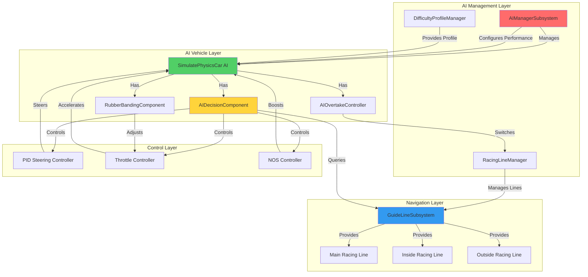
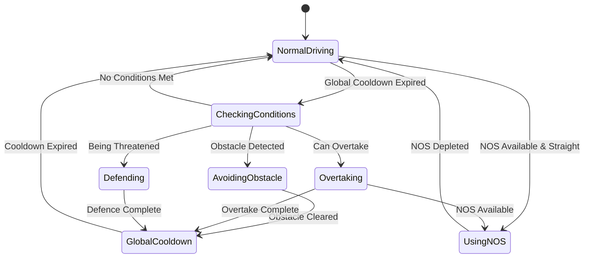
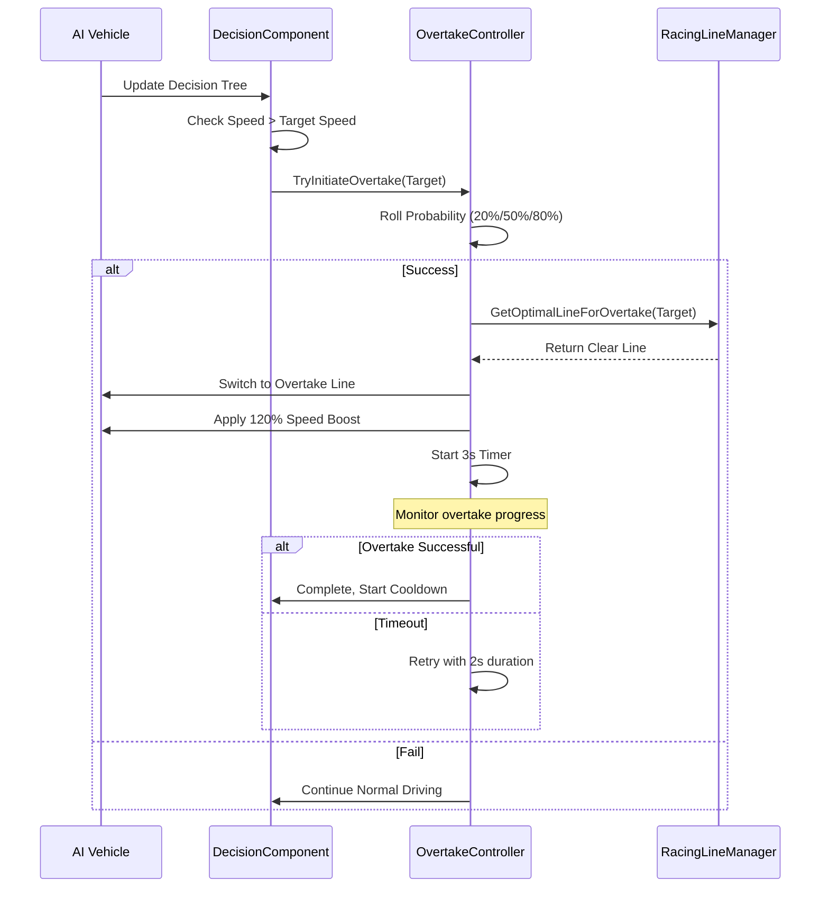
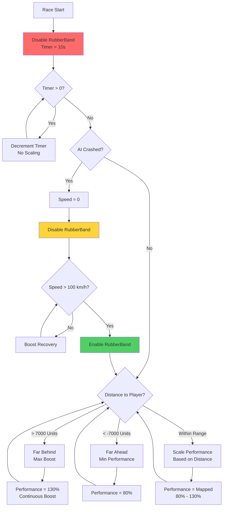
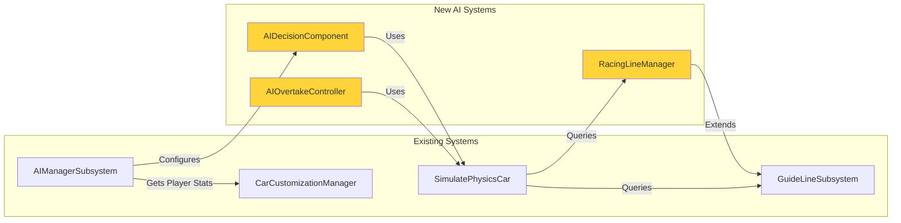

# Racer AI System Architecture - VNRacing

**Project**: PrototypeRacing - Mobile Racing Game

**Document**: Racer AI System Architecture

**Version**: 1.0

**Date**: 2025-11-12

**Status**: Complete

---

## Architecture Overview

The Racer AI system is a modular, performance-optimized architecture designed for mobile racing games. It integrates with existing vehicle physics while adding intelligent decision-making, strategic behaviors, and dynamic difficulty adjustment.

### High-Level System Architecture



### Key Architectural Principles

1. **Component-Based Design**: AI behaviors are modular components attached to vehicles
2. **Event-Driven Updates**: Minimize Tick usage, prefer timers and events
3. **Distance-Based Optimization**: Update frequency scales with distance to player
4. **Data-Driven Configuration**: All tuning parameters in Data Assets
5. **Separation of Concerns**: Navigation, decision-making, and control are separate layers

---

## Component Breakdown

### 1. AIManagerSubsystem (Existing - Enhanced)

**Purpose**: Central manager for all AI racers in the game instance

**Responsibilities**:
- Register/unregister AI vehicles
- Configure AI performance based on player stats
- Manage global AI settings (freeze, difficulty distribution)
- Coordinate rubber banding across all AI

**Key Functions**:
```cpp
class UAIManagerSubsystem : public UGameInstanceSubsystem
{
public:
    // Existing
    void RegisterAICar(ASimulatePhysicsCar* AICar);
    void UnregisterAICar(ASimulatePhysicsCar* AICar);
    void ConfigAiCarPerformance(ASimulatePhysicsCar* AICar);
    void SetFreezeAiCar(bool bFreeze);

    // New for V5
    void AssignDifficultyProfiles(ETrackDifficulty TrackDifficulty);
    void UpdateRubberBanding(float DeltaTime);
    FString GenerateAIName(EAIDifficulty Difficulty);

private:
    TArray<ASimulatePhysicsCar*> AICarsManager;
    UCarCustomizationManager* CarCustomizationManager;
    TMap<EAIDifficulty, TArray<FString>> AINameTables;
};
```

**Data Flow**:
- **Input**: Player performance stats, track difficulty
- **Output**: Configured AI vehicles with difficulty profiles
- **Updates**: Every frame for rubber banding, on-demand for configuration

---

### 2. RacingLineManager (New Component)

**Purpose**: Manages multiple racing lines per track and lane assignments

**Responsibilities**:
- Store references to Main/Inside/Outside racing lines
- Assign AI to specific lanes to prevent clustering
- Provide racing line queries for AI navigation
- Calculate optimal racing line based on situation

**Data Structure**:
```cpp
USTRUCT(BlueprintType)
struct FRacingLineSet
{
    GENERATED_BODY()

    UPROPERTY(EditAnywhere, BlueprintReadWrite)
    USplineComponent* MainLine;

    UPROPERTY(EditAnywhere, BlueprintReadWrite)
    USplineComponent* InsideLine;

    UPROPERTY(EditAnywhere, BlueprintReadWrite)
    USplineComponent* OutsideLine;

    UPROPERTY(EditAnywhere, BlueprintReadWrite)
    float LaneWidth = 400.0f; // cm
};

class URacingLineManager : public UActorComponent
{
public:
    USplineComponent* GetRacingLine(ERacingLineType LineType);
    USplineComponent* GetOptimalLineForOvertake(AActor* TargetVehicle);
    USplineComponent* GetDefensiveLine(AActor* ThreatVehicle);
    int32 AssignLaneOffset(AActor* Vehicle);

private:
    FRacingLineSet RacingLines;
    TMap<AActor*, int32> LaneAssignments;
};
```

---

### 3. AIDecisionComponent (New Component)

**Purpose**: Implements the AI decision tree and state machine

**State Machine**:


**Implementation**:
```cpp
UENUM(BlueprintType)
enum class EAIDecisionState : uint8
{
    NormalDriving,
    CheckingConditions,
    AvoidingObstacle,
    Overtaking,
    Defending,
    UsingNOS,
    GlobalCooldown
};

class UAIDecisionComponent : public UActorComponent
{
public:
    void UpdateDecisionTree(float DeltaTime);
    bool CanActivateSkill() const;
    void ActivateSkill(EAISkillType SkillType);

private:
    EAIDecisionState CurrentState;
    float GlobalCooldownRemaining;
    float SkillDuration;

    // Decision checks
    bool CheckObstacleAhead(float& OutDistance);
    bool CheckOvertakeOpportunity(AActor*& OutTarget);
    bool CheckDefenceNeed(AActor*& OutThreat);
    bool CheckNOSConditions();

    // Probability-based activation
    bool RollActivationChance(float Probability);
};
```

---

### 4. AIOvertakeController (New Component)

**Purpose**: Handles overtaking and defensive maneuvers

**Overtake Logic**:
```cpp
struct FOvertakeContext
{
    AActor* TargetVehicle;
    float SpeedDifferential;
    USplineComponent* CurrentLine;
    USplineComponent* OvertakeLine;
    float BoostMultiplier = 1.2f;
    float Duration = 3.0f;
    int32 RetryCount = 0;
};

class UAIOvertakeController : public UActorComponent
{
public:
    bool TryInitiateOvertake(AActor* TargetVehicle);
    void UpdateOvertake(float DeltaTime);
    void CancelOvertake();

    bool TryInitiateDefence(AActor* ThreatVehicle);
    void UpdateDefence(float DeltaTime);

private:
    FOvertakeContext ActiveOvertake;
    bool bIsOvertaking;
    bool bIsDefending;

    USplineComponent* SelectOvertakeLine(AActor* Target);
    USplineComponent* SelectDefenceLine(AActor* Threat);
};
```

**Overtake Flow**:


---

### 5. RubberBandingComponent (Enhanced Existing)

**Purpose**: Dynamic difficulty adjustment based on race position

**Enhanced Features**:
```cpp
USTRUCT(BlueprintType)
struct FRubberBandConfig
{
    GENERATED_BODY()

    UPROPERTY(EditAnywhere, BlueprintReadWrite)
    float BackDistanceLimit = -7000.0f; // Behind player

    UPROPERTY(EditAnywhere, BlueprintReadWrite)
    float FrontDistanceLimit = 7000.0f; // Ahead of player

    UPROPERTY(EditAnywhere, BlueprintReadWrite)
    float MinScalePerformance = 0.8f;

    UPROPERTY(EditAnywhere, BlueprintReadWrite)
    float MaxScalePerformance = 1.3f;

    UPROPERTY(EditAnywhere, BlueprintReadWrite)
    float DisableTime = 10.0f; // Disable for first 10s

    UPROPERTY(EditAnywhere, BlueprintReadWrite)
    float CrashRecoverySpeed = 100.0f; // km/h
};

class URubberBandingComponent : public UActorComponent
{
public:
    void UpdateRubberBanding(float DeltaTime);
    void DisableTemporarily(float Duration);
    bool ShouldApplyRubberBanding() const;

private:
    FRubberBandConfig Config;
    float DisableTimer;
    bool bIsEnabled;
    ASimulatePhysicsCar* PlayerVehicle;

    float CalculatePerformanceScale(float DistanceToPlayer);
    void ApplyPerformanceScale(float Scale);
};
```

**Rubber Banding Logic**:


---

## Data Models

### Difficulty Profile Structure

```cpp
UENUM(BlueprintType)
enum class EAIDifficulty : uint8
{
    Easy,    // Rookie
    Medium,  // Racer
    Hard     // Pro
};

USTRUCT(BlueprintType)
struct FAIDifficultyProfile
{
    GENERATED_BODY()

    UPROPERTY(EditAnywhere, BlueprintReadWrite, Category = "Profile")
    EAIDifficulty DifficultyLevel;

    UPROPERTY(EditAnywhere, BlueprintReadWrite, Category = "Profile")
    FString DisplayName;

    // Performance Scaling
    UPROPERTY(EditAnywhere, BlueprintReadWrite, Category = "Performance")
    float PerformanceScaleFactor = 1.0f; // 0.9 / 1.0 / 1.1

    // Skill Probabilities
    UPROPERTY(EditAnywhere, BlueprintReadWrite, Category = "Skills")
    float OvertakeProbability = 0.5f; // 0.2 / 0.5 / 0.8

    UPROPERTY(EditAnywhere, BlueprintReadWrite, Category = "Skills")
    float DefenceProbability = 0.7f; // 0.4 / 0.7 / 0.9

    UPROPERTY(EditAnywhere, BlueprintReadWrite, Category = "Skills")
    float NOSUsageFrequency = 0.5f; // How often to use NOS

    // Behavior Tuning
    UPROPERTY(EditAnywhere, BlueprintReadWrite, Category = "Behavior")
    float ReactionTime = 0.3f; // Seconds delay for decisions

    UPROPERTY(EditAnywhere, BlueprintReadWrite, Category = "Behavior")
    float SteeringPrecision = 0.8f; // PID tuning factor

    UPROPERTY(EditAnywhere, BlueprintReadWrite, Category = "Behavior")
    float RacingLineOffset = 200.0f; // Max offset from line (cm)
};
```


### Racing Line Offset Calculation

```cpp
// Formula: D = Random[-a, a]
// Where a = 0.5 * (Distance to nearest racing line)

float CalculateRacingLineOffset(USplineComponent* CurrentLine, URacingLineManager* Manager)
{
    float DistanceToNearestLine = Manager->GetDistanceToNearestLine(CurrentLine);
    float MaxOffset = DistanceToNearestLine * 0.5f;
    return FMath::RandRange(-MaxOffset, MaxOffset);
}
```

### AI Name Generation

```cpp
// Data Table: DT_AINames
USTRUCT(BlueprintType)
struct FAINameEntry : public FTableRowBase
{
    GENERATED_BODY()

    UPROPERTY(EditAnywhere, BlueprintReadWrite)
    EAIDifficulty Difficulty;

    UPROPERTY(EditAnywhere, BlueprintReadWrite)
    TArray<FString> Names;
};

// Easy AI Names
TArray<FString> EasyNames = {
    "Phuoc Razor", "Liam Dash", "Jake Sparks", "Ava Frost", "Ryan Jet",
    "Ella Blaze", "Leo Flash", "Nora Loop", "Evan Glide", "Sophie Boost"
};

// Medium AI Names
TArray<FString> MediumNames = {
    "Marcus Steel", "Lena Rogue", "Darius Fang", "Ivy Surge", "Noah Vector",
    "Kira Volt", "Ethan Comet", "Camila Torque", "Jaden Phantom", "Tara Axis"
};

// Hard AI Names
TArray<FString> HardNames = {
    "Rafael Wraith", "Naomi Lynx", "Phu Viper", "Aya Ignis", "Victor Razor",
    "Son Cyclone", "Damien Reaper", "Lucia Vector", "Owen Thunder", "Hana Zephyr"
};
```

---

## API Design

### AIDecisionComponent Interface

```cpp
// Public API for AI decision-making
class UAIDecisionComponent : public UActorComponent
{
public:
    // Main update function (called from vehicle Tick or Timer)
    UFUNCTION(BlueprintCallable, Category = "AI Decision")
    void UpdateDecisionTree(float DeltaTime);

    // State queries
    UFUNCTION(BlueprintPure, Category = "AI Decision")
    EAIDecisionState GetCurrentState() const { return CurrentState; }

    UFUNCTION(BlueprintPure, Category = "AI Decision")
    bool IsInCooldown() const { return GlobalCooldownRemaining > 0.0f; }

    // Configuration
    UFUNCTION(BlueprintCallable, Category = "AI Decision")
    void SetDifficultyProfile(const FAIDifficultyProfile& Profile);

    // Events
    UPROPERTY(BlueprintAssignable, Category = "AI Decision")
    FOnStateChanged OnStateChanged;

    UPROPERTY(BlueprintAssignable, Category = "AI Decision")
    FOnSkillActivated OnSkillActivated;
};
```

### RacingLineManager Interface

```cpp
class URacingLineManager : public UActorComponent
{
public:
    // Racing line queries
    UFUNCTION(BlueprintCallable, Category = "Racing Lines")
    USplineComponent* GetRacingLine(ERacingLineType LineType);

    UFUNCTION(BlueprintCallable, Category = "Racing Lines")
    TArray<USplineComponent*> GetAllRacingLines();

    // Lane management
    UFUNCTION(BlueprintCallable, Category = "Racing Lines")
    int32 AssignLaneOffset(AActor* Vehicle);

    UFUNCTION(BlueprintCallable, Category = "Racing Lines")
    void ReleaseLaneOffset(AActor* Vehicle);

    // Tactical queries
    UFUNCTION(BlueprintCallable, Category = "Racing Lines")
    USplineComponent* GetOptimalLineForOvertake(AActor* TargetVehicle);

    UFUNCTION(BlueprintCallable, Category = "Racing Lines")
    USplineComponent* GetDefensiveLine(AActor* ThreatVehicle);

    UFUNCTION(BlueprintPure, Category = "Racing Lines")
    float GetDistanceToNearestLine(USplineComponent* CurrentLine);
};
```

---

## Design Decisions

### 1. Component-Based Architecture
**Decision**: Use UActorComponent for AI behaviors instead of inheritance

**Rationale**:
- Modular: Easy to add/remove AI capabilities
- Reusable: Components can be attached to any vehicle
- Testable: Each component can be tested independently
- Flexible: Different AI can have different component combinations

**Trade-offs**:
- Slightly more complex setup (attach components)
- Small performance overhead (component iteration)
- **Benefit**: Much easier to maintain and extend

### 2. Event-Driven Decision Updates
**Decision**: Use timers and events instead of Tick for decision-making

**Rationale**:
- Performance: Reduces CPU usage on mobile
- Scalability: Can handle more AI without frame drops
- Tunable: Update frequency can be adjusted per AI

**Implementation**:
```cpp
// In BeginPlay
GetWorld()->GetTimerManager().SetTimer(
    DecisionUpdateTimer,
    this,
    &UAIDecisionComponent::UpdateDecisionTree,
    0.1f,  // Update every 100ms
    true   // Loop
);
```

### 3. Probability-Based Skill Activation
**Decision**: Use random probability checks for overtake/defence activation

**Rationale**:
- Variety: AI behavior is less predictable
- Difficulty Scaling: Easy AI fails more often, Hard AI succeeds more
- Realistic: Mimics human decision-making uncertainty

**Alternative Considered**: Deterministic activation based on thresholds
- **Rejected**: Too predictable, players can exploit patterns

### 4. Three Racing Lines Per Track
**Decision**: Require Main, Inside, Outside lines for each track

**Rationale**:
- Strategic Depth: AI can choose different lines for overtaking
- Visual Variety: Prevents all AI following same path
- Realistic: Mimics real racing where drivers take different lines

**Trade-offs**:
- Content Workload: Level designers must place 3 splines per track
- **Mitigation**: Create tools for automated line generation

### 5. Distance-Based Rubber Banding
**Decision**: Scale AI performance based on distance to player

**Rationale**:
- Balanced Races: Keeps AI competitive without being unfair
- Player Engagement: Close races are more exciting
- Adaptive: Works for both skilled and casual players

**Tuning Parameters**:
- Back Distance Limit: -7000 units (AI far behind)
- Front Distance Limit: +7000 units (AI far ahead)
- Scale Range: 80% - 130% performance

---

## Non-Functional Requirements

### Scalability Considerations

**Distance-Based LOD**:
```cpp
float GetAIUpdateFrequency(float DistanceToPlayer)
{
    if (DistanceToPlayer < 2000.0f)
        return 0.05f;  // 20 Hz (close to player)
    else if (DistanceToPlayer < 5000.0f)
        return 0.1f;   // 10 Hz (medium distance)
    else
        return 0.2f;   // 5 Hz (far from player)
}
```

### Reliability Requirements

- **Crash Recovery**: AI must recover gracefully from collisions
- **Stuck Detection**: Detect and resolve AI stuck in geometry
- **Failsafe**: If decision tree fails, fall back to basic racing line following
- **Logging**: Log AI decisions for debugging and balancing

---

## Integration Points

### Existing Systems Integration



### Modified Existing Components

**SimulatePhysicsCar** (Enhanced):
- Add component references (DecisionComponent, OvertakeController)
- Expose functions for component access
- Maintain backward compatibility

**GuideLineSubsystem** (Enhanced):
- Support multiple racing lines per track
- Add lane offset management
- Provide tactical line queries

**AIManagerSubsystem** (Enhanced):
- Assign difficulty profiles on spawn
- Generate AI names
- Coordinate global AI behaviors

---

## Summary

This architecture provides:
- **Modular Design**: Component-based for flexibility
- **Performance Optimized**: Event-driven, distance-based LOD
- **Data-Driven**: All tuning in Data Assets
- **Scalable**: Supports 8+ AI racers on mobile
- **Maintainable**: Clear separation of concerns

**Next Steps**: Proceed to Planning phase to break down implementation into tasks and milestones.

