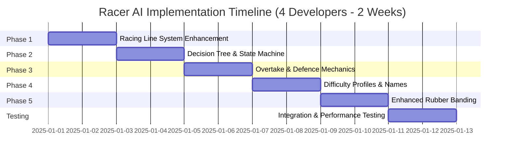

# Racer AI Implementation Plan - VNRacing

**Project**: PrototypeRacing - Mobile Racing Game

**Document**: Racer AI Implementation Plan

**Version**: 1.0

**Date**: 2025-11-12

**Status**: Ready for Implementation

---

## Overview

This plan breaks down the Racer AI V5 implementation into 5 major milestones with detailed tasks, optimized for rapid delivery with a 4-developer team.

**Timeline**: **10 working days (2 weeks)** with 4 developers working in parallel

**Team Size**: 4 developers + 1 designer + 1 level designer

**Delivery Target**: 2-week sprint from start to production-ready AI system

---

## Milestones & Timeline

**Total Duration**: 10 working days (2 weeks)

**Phase Breakdown**:
- **Week 1 (Days 1-5)**: Phase 1 (2d) + Phase 2 (2d) + Phase 3 Day 1 (1d)
- **Week 2 (Days 6-10)**: Phase 3 Day 2 (1d) + Phase 4 (2d) + Phase 5 (2d) + Testing (2d, overlapping)

---

## Phase 1: Racing Line System Enhancement (Days 1-2)

**Goal**: Implement multi-racing line support with lane management

**Duration**: 2 days

**Dependencies**: GuideLineSubsystem (existing)

**Parallelization Strategy**: 4 developers work on independent components simultaneously

### Tasks

#### 1.1 Create RacingLineManager Component
- [ ] **Task**: Create `URacingLineManager` class (C++)
  - **Files**: `RacingLineManager.h`, `RacingLineManager.cpp`
  - **Effort**: 1 day
  - **Owner**: Developer 1
  - **Details**:
    - Define `FRacingLineSet` struct (Main/Inside/Outside splines)
    - Implement `GetRacingLine(ERacingLineType)` function
    - Implement lane assignment system
    - Add lane offset tracking

#### 1.2 Extend GuideLineSubsystem
- [ ] **Task**: Add multi-line support to GuideLineSubsystem
  - **Files**: `GuideLineSubsystem.h`, `GuideLineSubsystem.cpp`
  - **Effort**: 1 day
  - **Owner**: Developer 2
  - **Details**:
    - Add `GetGuideLine(ERacingLineType)` overload
    - Implement `GetDistanceToNearestLine()` function
    - Add `GetTempLane(int32 LaneOffset)` support
    - Ensure backward compatibility with existing code

#### 1.3 Create Racing Line Placement Tools (Blueprint)
- [ ] **Task**: Create BP_RacingLineManager actor
  - **Files**: `Content/AI/Blueprints/BP_RacingLineManager.uasset`
  - **Effort**: 0.5 day
  - **Owner**: Developer 3
  - **Details**:
    - Visual editor for placing 3 racing lines
    - Auto-generate Inside/Outside from Main line (optional)
    - Validation tools (check line continuity, spacing)
    - Debug visualization (draw splines in-game)

#### 1.4 Implement Racing Line Offset Calculation
- [ ] **Task**: Add offset calculation to RacingLineManager
  - **Files**: `RacingLineManager.cpp`
  - **Effort**: 0.5 day
  - **Owner**: Developer 4
  - **Details**:
    - Implement formula: `D = Random[-a, a]` where `a = 0.5 * DistanceToNearestLine`
    - Add per-vehicle offset storage
    - Ensure offsets are recalculated on lane change

#### 1.5 Update Track Levels with Racing Lines
- [ ] **Task**: Place 3 racing lines in test track
  - **Files**: Track level assets
  - **Effort**: 1 day (parallel with tasks 1.1-1.4)
  - **Owner**: Level Designer
  - **Details**:
    - Place Main, Inside, Outside lines for 1 test track
    - Validate line spacing and continuity
    - Test with existing AI (should still work with Main line)

#### 1.6 Integration Testing
- [ ] **Task**: Test multi-line system with existing AI
  - **Effort**: 0.5 day
  - **Owner**: All Developers (1-4)
  - **Details**:
    - Verify AI can follow all 3 lines
    - Test lane switching
    - Validate offset calculations
    - Performance test (8 AI on different lines)

**Phase 1 Deliverables**:
- ✅ RacingLineManager component
- ✅ Multi-line support in GuideLineSubsystem
- ✅ Racing line placement tools
- ✅ 1 test track with 3 racing lines
- ✅ Integration tests passing

---

## Phase 2: Decision Tree & State Machine (Days 3-4)

**Goal**: Implement AI decision-making logic and state management

**Duration**: 2 days

**Dependencies**: Phase 1 (Racing Line System)

**Parallelization Strategy**: 4 developers split core component, decision checks, integration, and testing

### Tasks

#### 2.1 Create AIDecisionComponent & State Machine
- [ ] **Task**: Create `UAIDecisionComponent` class with full state machine
  - **Files**: `AIDecisionComponent.h`, `AIDecisionComponent.cpp`
  - **Effort**: 1.5 days
  - **Owner**: Developer 1
  - **Details**:
    - Define `EAIDecisionState` enum (NormalDriving, CheckingConditions, etc.)
    - Implement state machine logic
    - Add global cooldown timer (3-5s)
    - Implement `UpdateDecisionTree(float DeltaTime)` function
    - Implement all state transitions

#### 2.2 Implement Decision Checks
- [ ] **Task**: Add condition checking functions
  - **Files**: `AIDecisionComponent.cpp`
  - **Effort**: 1 day
  - **Owner**: Developer 2
  - **Details**:
    - `CheckObstacleAhead(float& OutDistance)` - raycast/sphere trace
    - `CheckOvertakeOpportunity(AActor*& OutTarget)` - speed differential check
    - `CheckDefenceNeed(AActor*& OutThreat)` - proximity check
    - `CheckNOSConditions()` - straight detection + gauge check

#### 2.3 Integrate with SimulatePhysicsCar & Debug Tools
- [ ] **Task**: Add DecisionComponent to AI vehicles and create debug visualizer
  - **Files**: `SimulatePhysicsCar.h`, `SimulatePhysicsCar.cpp`, `Content/AI/Blueprints/BP_AIDebugVisualizer.uasset`
  - **Effort**: 1 day
  - **Owner**: Developer 3
  - **Details**:
    - Add `UAIDecisionComponent* DecisionComponent` property
    - Create component in `BeginPlay()` for AI cars
    - Call `UpdateDecisionTree()` from timer (not Tick)
    - Expose Blueprint events for state changes
    - Display current AI state above vehicle
    - Show cooldown timer
    - Visualize decision checks (raycasts, proximity spheres)

#### 2.4 Unit Testing & Integration
- [ ] **Task**: Write unit tests and integration tests
  - **Files**: `AIDecisionComponent.spec.cpp`
  - **Effort**: 0.5 day
  - **Owner**: Developer 4
  - **Details**:
    - Test state transitions
    - Test cooldown timing
    - Test condition checks with mock data
    - Test edge cases (multiple conditions true)
    - Integration test with SimulatePhysicsCar

**Phase 2 Deliverables**:
- ✅ AIDecisionComponent with full state machine
- ✅ All decision check functions implemented
- ✅ Integration with SimulatePhysicsCar
- ✅ Debug visualization tools
- ✅ Unit tests passing

---

## Phase 3: Overtake & Defence Mechanics (Days 5-6)

**Goal**: Implement tactical maneuvers (overtaking and defending)

**Duration**: 2 days

**Dependencies**: Phase 1 (Racing Lines), Phase 2 (Decision Tree)

**Parallelization Strategy**: 4 developers split overtake, defence, probability, and testing

### Tasks

#### 3.1 Create AIOvertakeController Component & Line Selection
- [ ] **Task**: Create `UAIOvertakeController` class with line selection
  - **Files**: `AIOvertakeController.h`, `AIOvertakeController.cpp`
  - **Effort**: 1 day
  - **Owner**: Developer 1
  - **Details**:
    - Define `FOvertakeContext` struct
    - Implement `TryInitiateOvertake(AActor* Target)` function
    - Implement `UpdateOvertake(float DeltaTime)` function
    - Add retry logic (max 2 retries)
    - `SelectOvertakeLine(AActor* Target)` - choose Inside/Outside based on target position
    - Check if selected line is clear (no other vehicles)
    - Fall back to Main line if both blocked

#### 3.2 Implement Defence Mechanics
- [ ] **Task**: Add defensive maneuvers
  - **Files**: `AIOvertakeController.cpp`
  - **Effort**: 1 day
  - **Owner**: Developer 2
  - **Details**:
    - `TryInitiateDefence(AActor* Threat)` function
    - `SelectDefenceLine(AActor* Threat)` - block threat's overtake line
    - Apply slight speed reduction during defence
    - Duration: 2-3 seconds

#### 3.3 Implement Probability-Based Activation & Integration
- [ ] **Task**: Add skill activation probability and integrate with decision tree
  - **Files**: `AIOvertakeController.cpp`, `AIDecisionComponent.cpp`, `SimulatePhysicsCar.cpp`
  - **Effort**: 0.5 day
  - **Owner**: Developer 3
  - **Details**:
    - `RollActivationChance(float Probability)` function
    - Easy: 20% overtake, 40% defence
    - Medium: 50% overtake, 70% defence
    - Hard: 80% overtake, 90% defence
    - Call `TryInitiateOvertake()` when in Overtaking state
    - Call `TryInitiateDefence()` when in Defending state
    - Handle state transitions on success/failure

#### 3.4 Gameplay Testing & Tuning
- [ ] **Task**: Test overtake/defence in races
  - **Effort**: 0.5 day
  - **Owner**: All Developers (1-4) + Designer
  - **Details**:
    - Test with 8 AI racers
    - Validate overtake success rates per difficulty
    - Tune probabilities for balance
    - Fix edge cases (stuck in overtake, infinite retries)

**Phase 3 Deliverables**:
- ✅ AIOvertakeController component
- ✅ Overtake and defence mechanics working
- ✅ Probability-based activation
- ✅ Integration with decision tree
- ✅ Gameplay tests passing

---

## Phase 4: Difficulty Profiles & Name Generation (Days 7-8)

**Goal**: Implement AI difficulty profiles and name generation system

**Duration**: 2 days

**Dependencies**: Phase 2 (Decision Tree), Phase 3 (Overtake/Defence)

**Parallelization Strategy**: 4 developers work on data assets, assignment, names, and integration in parallel

### Tasks

#### 4.1 Create Difficulty Profile Data Assets & Assignment
- [ ] **Task**: Create Data Assets and implement assignment logic
  - **Files**: `Content/AI/Data/DA_AIProfile_*.uasset`, `AIManagerSubsystem.h`, `AIManagerSubsystem.cpp`
  - **Effort**: 1 day
  - **Owner**: Developer 1
  - **Details**:
    - Define `FAIDifficultyProfile` struct in C++
    - Create 3 Data Assets with values from Racer_AI_V5.md
    - Easy: 90% performance, 20% overtake, 40% defence
    - Medium: 100% performance, 50% overtake, 70% defence
    - Hard: 110% performance, 80% overtake, 90% defence
    - `AssignDifficultyProfiles(ETrackDifficulty)` function
    - Easy Track: 80% Rookie, 20% Racer
    - Medium Track: 50% Rookie, 25% Racer, 25% Pro
    - Hard Track: 50% Racer, 50% Pro

#### 4.2 Create AI Name Data Table & Generation
- [ ] **Task**: Create DT_AINames DataTable and name generation logic
  - **Files**: `Content/AI/Data/DT_AINames.uasset`, `AIManagerSubsystem.cpp`
  - **Effort**: 0.5 day
  - **Owner**: Developer 2
  - **Details**:
    - Define `FAINameEntry` struct
    - Populate with names from Racer_AI_V5.md
    - Easy: 10 names (Phuoc Razor, Liam Dash, etc.)
    - Medium: 10 names (Marcus Steel, Lena Rogue, etc.)
    - Hard: 10 names (Rafael Wraith, Naomi Lynx, etc.)
    - `GenerateAIName(EAIDifficulty)` function
    - Random selection from appropriate difficulty tier
    - Avoid duplicate names in same race

#### 4.3 Apply Difficulty Profiles to AI
- [ ] **Task**: Integrate profiles with AI components
  - **Files**: `AIDecisionComponent.cpp`, `AIOvertakeController.cpp`, `SimulatePhysicsCar.cpp`
  - **Effort**: 1 day
  - **Owner**: Developer 3
  - **Details**:
    - Apply performance scale to vehicle stats
    - Use profile probabilities in overtake/defence
    - Apply reaction time delays
    - Apply steering precision to PID controller

#### 4.4 Testing & Tuning
- [ ] **Task**: Test all 3 difficulty profiles
  - **Effort**: 0.5 day
  - **Owner**: All Developers (1-4)
  - **Details**:
    - Race against Easy/Medium/Hard AI
    - Validate performance differences are noticeable
    - Tune probabilities if needed
    - Verify name generation works correctly

**Phase 4 Deliverables**:
- ✅ 3 Difficulty Profile Data Assets
- ✅ AI Name DataTable with 30 names
- ✅ Difficulty assignment system
- ✅ Name generation system
- ✅ Profiles applied to all AI behaviors

---

## Phase 5: Enhanced Rubber Banding (Days 9-10)

**Goal**: Implement advanced rubber banding with crash recovery and distance-based scaling

**Duration**: 2 days

**Dependencies**: Phase 4 (Difficulty Profiles)

**Parallelization Strategy**: 4 developers split component, scaling, crash recovery, and integration

### Tasks

#### 5.1 Create RubberBandingComponent & Distance Scaling
- [ ] **Task**: Create `URubberBandingComponent` class with distance-based scaling
  - **Files**: `RubberBandingComponent.h`, `RubberBandingComponent.cpp`
  - **Effort**: 1 day
  - **Owner**: Developer 1
  - **Details**:
    - Define `FRubberBandConfig` struct
    - Implement `UpdateRubberBanding(float DeltaTime)` function
    - Add disable timer (first 10 seconds)
    - `CalculatePerformanceScale(float DistanceToPlayer)` function
    - Far behind (>7000): 130% performance
    - Far ahead (<-7000): 80% performance
    - Within range: Linear interpolation 80%-130%
    - Apply scale to speed and acceleration

#### 5.2 Implement Crash Recovery & Integration
- [ ] **Task**: Add crash detection and integrate with AIManagerSubsystem
  - **Files**: `RubberBandingComponent.cpp`, `AIManagerSubsystem.cpp`
  - **Effort**: 0.5 day
  - **Owner**: Developer 2
  - **Details**:
    - Detect crash (speed = 0 for >1 second)
    - Disable rubber banding during crash
    - Apply recovery boost until speed > 100 km/h
    - Re-enable rubber banding after recovery
    - `UpdateRubberBanding(float DeltaTime)` in AIManagerSubsystem
    - Update all AI rubber banding components
    - Track player position for distance calculations

#### 5.3 Create Rubber Banding Data Asset
- [ ] **Task**: Create BP_RubberBandConfig Data Asset
  - **Files**: `Content/AI/Data/DA_RubberBandConfig.uasset`
  - **Effort**: 0.25 day
  - **Owner**: Developer 3
  - **Details**:
    - Expose all tuning parameters
    - BackDistanceLimit, FrontDistanceLimit
    - MinScalePerformance, MaxScalePerformance
    - DisableTime, CrashRecoverySpeed

#### 5.4 Testing & Balancing
- [ ] **Task**: Test rubber banding in various scenarios
  - **Effort**: 0.25 day
  - **Owner**: All Developers (1-4)
  - **Details**:
    - Test with player far ahead
    - Test with player far behind
    - Test crash recovery
    - Test first 10 seconds (should be disabled)
    - Tune parameters for balanced races

**Phase 5 Deliverables**:
- ✅ RubberBandingComponent
- ✅ Distance-based performance scaling
- ✅ Crash recovery system
- ✅ Integration with AIManagerSubsystem
- ✅ Tunable Data Asset
- ✅ Balanced rubber banding

---

## Integration & Performance Testing (Days 9-10, overlapping with Phase 5)

**Goal**: Comprehensive testing and optimization

**Duration**: 2 days (overlapping with Phase 5)

**Dependencies**: All phases complete

**Parallelization Strategy**: 4 developers run integration, performance, mobile testing, and documentation in parallel

### Tasks

#### 6.1 Integration Testing & Performance Optimization
- [ ] **Task**: Test all AI systems and optimize for mobile
  - **Effort**: 1 day
  - **Owner**: Developer 1 + 2
  - **Details**:
    - Full race with 8 AI (mixed difficulties)
    - Verify all behaviors work (overtake, defence, NOS, rubber banding)
    - Test on multiple tracks
    - Fix integration bugs
    - Profile AI systems (CPU, memory)
    - Implement distance-based update frequency
    - Optimize decision tree checks
    - Reduce unnecessary calculations

#### 6.2 Mobile Device Testing
- [ ] **Task**: Test on target mobile devices
  - **Effort**: 1 day
  - **Owner**: Developer 3 + 4
  - **Details**:
    - Test on mid-range Android device (Developer 3)
    - Test on mid-range iOS device (Developer 4)
    - Measure FPS, memory, battery usage
    - Optimize if below targets

#### 6.3 Gameplay Balancing & Documentation
- [ ] **Task**: Final gameplay tuning and documentation
  - **Effort**: 0.5 day
  - **Owner**: All Developers (1-4)
  - **Details**:
    - Tune difficulty probabilities
    - Tune rubber banding parameters
    - Adjust racing line offsets
    - Balance AI competitiveness
    - Update implementation docs
    - Code review for all new components
    - Document tuning parameters

**Integration Testing Deliverables**:
- ✅ All AI systems integrated and working
- ✅ Performance targets met (30 FPS, <50MB memory)
- ✅ Mobile device testing complete
- ✅ Gameplay balanced and fun
- ✅ Documentation complete

---

## Dependencies & Risks

### Dependencies

| Task | Depends On | Blocker Risk |
|------|------------|--------------|
| Phase 2 | Phase 1 (Racing Lines) | Medium - Can prototype without multi-lines |
| Phase 3 | Phase 1, Phase 2 | High - Needs decision tree and racing lines |
| Phase 4 | Phase 2, Phase 3 | Medium - Can implement in parallel |
| Phase 5 | Phase 4 | Low - Independent system |
| Testing | All Phases | High - Needs complete system |

### Risks & Mitigation

#### Risk 1: Performance Below Target (30 FPS)
**Probability**: Medium
**Impact**: High
**Mitigation**:
- Implement distance-based LOD early
- Profile frequently during development
- Use timers instead of Tick
- Optimize decision checks (cache results)

#### Risk 2: Rubber Banding Too Aggressive/Weak
**Probability**: High
**Impact**: Medium
**Mitigation**:
- Make all parameters data-driven
- Extensive playtesting
- Designer-friendly tuning tools
- Multiple test scenarios

#### Risk 3: AI Behaviors Conflict (Overtake + Defence)
**Probability**: Medium
**Impact**: Medium
**Mitigation**:
- Clear state machine with priorities
- Global cooldown prevents spam
- Thorough state transition testing
- Debug visualization tools

#### Risk 4: Racing Line Content Workload
**Probability**: Medium
**Impact**: Medium
**Mitigation**:
- Create automated line generation tools
- Start with 1 test track
- Parallelize track work with code development
- Provide clear placement guidelines

#### Risk 5: Integration with Existing Code Breaks Features
**Probability**: Low
**Impact**: High
**Mitigation**:
- Maintain backward compatibility
- Comprehensive regression testing
- Feature flags to disable new AI
- Incremental integration

#### Risk 6: Team Coordination Overhead
**Probability**: Medium
**Impact**: Medium
**Mitigation**:
- Daily standup meetings (15 min)
- Clear task ownership and boundaries
- Shared coding standards and conventions
- Code review process for all merges
- Use feature branches to avoid conflicts
- Pair programming for complex integrations

---

## Resource Allocation

### Team Structure

| Role | Allocation | Responsibilities |
|------|------------|------------------|
| Developer 1 | 100% (2 weeks) | Core AI systems (Decision, Difficulty, Rubber Banding, Integration) |
| Developer 2 | 100% (2 weeks) | Tactical systems (Overtake, Racing Lines, Performance) |
| Developer 3 | 100% (2 weeks) | Supporting systems (Tools, Debug, Defence, Testing) |
| Developer 4 | 100% (2 weeks) | Quality assurance (Unit tests, Integration, Mobile testing) |
| Level Designer | 20% (1 week) | Racing line placement |

**Total Team Effort**: 4 Developers × 2 weeks = 8 Developer-weeks

### Milestone Ownership

| Milestone | Primary Owner | Support | Parallel Work |
|-----------|---------------|---------|---------------|
| Phase 1: Racing Lines | Developer 2 | Developer 1, 3, 4, Level Designer | D1: Component, D2: Subsystem, D3: Tools, D4: Tests |
| Phase 2: Decision Tree | Developer 1 | Developer 2, 3, 4 | D1: Core logic, D2: Checks, D3: Integration, D4: Tests |
| Phase 3: Overtake/Defence | Developer 1 | Developer 2, 3, 4 | D1: Overtake, D2: Defence, D3: Integration, D4: Tests |
| Phase 4: Difficulty Profiles | Developer 1 | Developer 2, 3, 4 | D1: Data assets, D2: Names, D3: Application, D4: Tests |
| Phase 5: Rubber Banding | Developer 1 | Developer 2, 3, 4 | D1: Component, D2: Integration, D3: Data, D4: Tests |
| Testing & Optimization | All Developers | - | D1-D2: Performance, D3-D4: Mobile devices |

---

## Success Criteria

### Technical Success
- [ ] All 5 phases complete and integrated
- [ ] 30 FPS on mid-range mobile with 8 AI racers
- [ ] <100ms decision latency
- [ ] No critical bugs or crashes

### Gameplay Success
- [ ] AI follows 3 racing lines with visible variety
- [ ] Overtake/defence behaviors trigger appropriately
- [ ] Difficulty differences are noticeable and balanced
- [ ] Rubber banding keeps races competitive but fair
- [ ] AI names display correctly per difficulty

### Code Quality
- [ ] All components follow project coding standards
- [ ] Unit tests for decision logic
- [ ] Integration tests for full AI system
- [ ] Code reviewed and approved
- [ ] Documentation complete

---

## Next Steps

1. **Review this plan** with team and stakeholders
2. **Set up project tracking** (Jira, Trello, etc.)
3. **Begin Phase 1** (Racing Line System Enhancement)
4. **Schedule weekly check-ins** to track progress
5. **Prepare test environment** (test track, debug tools)

**Ready to proceed to Implementation phase!**

