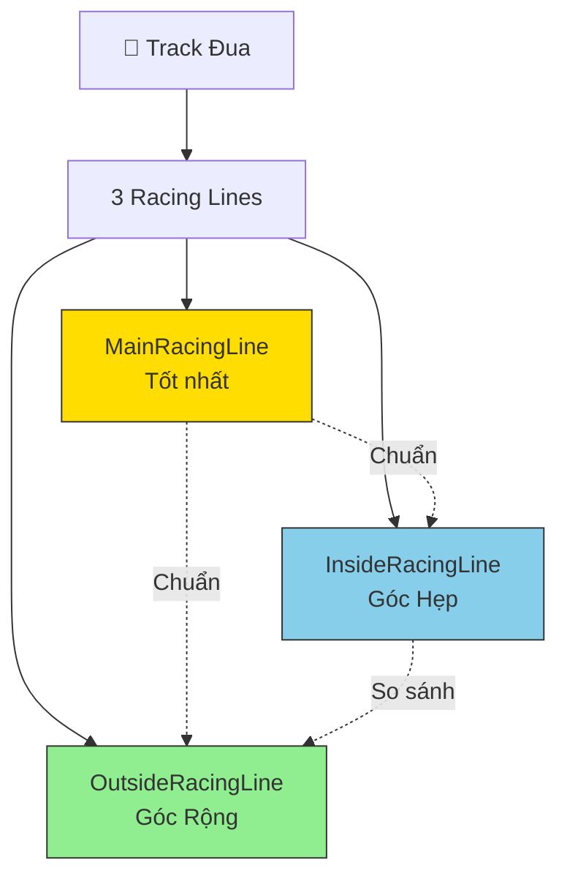
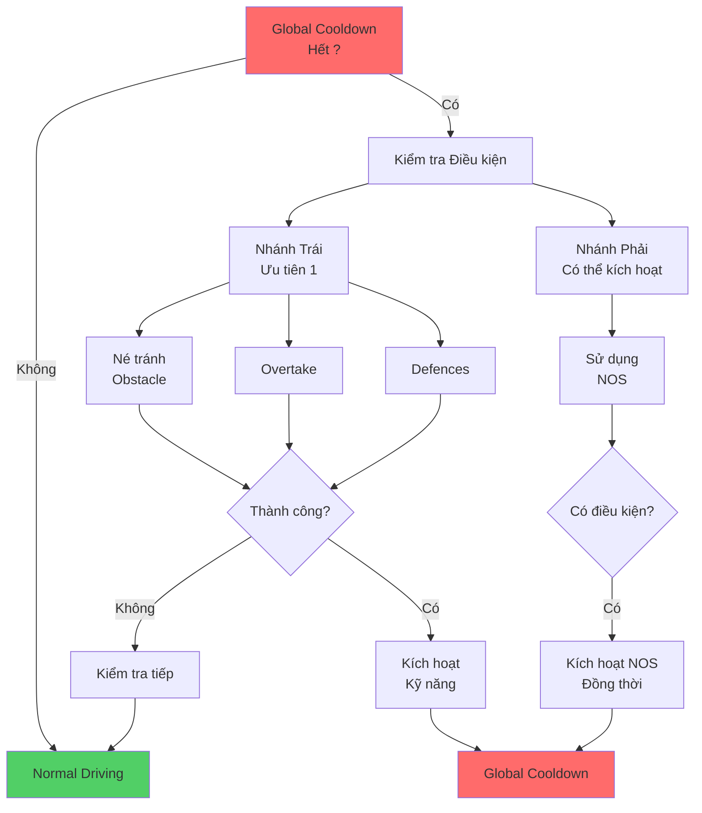
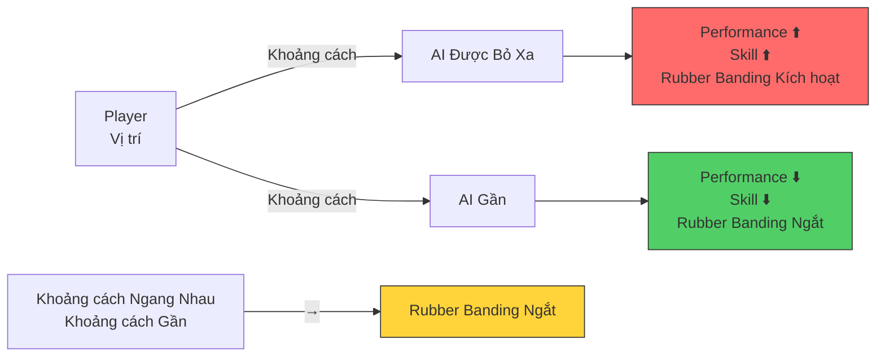
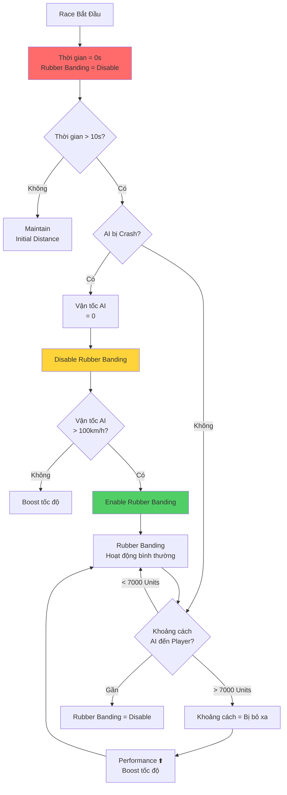

# RACER AI

*GDD Overview các hành vi của Racer AI.*

## Change Log

- **First Version (20250809)**

- **Ver2 (20250813)**
  - Điều chỉnh lại mô tả các hành vi của AI thông qua bốn kiểu hành động chính (Acceleration, Drift, Steer, NOS Use).

- **Ver3 (20250828)**
  - Thêm một số đặc điểm cho hành vi Rubber Banding của AI

- **Ver4 (20251105)**
  - Chỉnh sửa cấu trúc văn bản.
  - Thêm mục định hướng lấy Data cho AI.
  - Liệt kê 3 Profiles của AI.
  - Chia các State cho Racer AI.
  - Liệt kê các yếu tố ảnh hưởng tới hành vi AI
  - Liệt kê chức năng AI có thể thực hiện

- **Ver5 (20251110)**
  - Chỉnh sửa cấu trúc văn bản.
  - Thêm phần định nghĩa cho Racing Line của AI
  - Thêm tính năng AI Follow Racing Lines.
    - Tính năng AI Follow Racing Line Offset.
  - Chỉnh sửa khả năng dùng NOS của AI theo các Racing Lines.
  - Thêm khả năng Overtake và Defence của AI
  - Tích hợp Profiles của AI theo các phần đã chỉnh sửa.
  - Bổ sung Generate tên tự động cho AI theo Profiles.

- **Ver5.1 (20260126)**
  - Đồng bộ tài liệu với source code (SimulatePhysicsCar.h, AIManagerSubsystem.h).
  - Thêm các tham số FAIDifficultyProfile còn thiếu: NOSUsageFrequency, ReactionTime, SteeringPrecision.
  - Cập nhật Performance Scale Range từ 0.9-1.1 thành 0.5-1.5.
  - Cập nhật AIBoostDuration từ 3.0s thành 4.0s.
  - Thêm các tham số Rubber Banding: ReconsiderStrategyCooldown, DeltaPerformance, SlowDownRate.

---

# Gameplay Concepts

## Concepts

- AI được dẫn đường bởi các Racing Lines đặt sẵn trong Track đua.
- Trong quá trình đua, AI có thể đổi qua lại giữa các Racing Lines.
- AI biết xử lý va chạm riêng biệt khi:
  - Va chạm với người chơi.
  - Va chạm với AI khác.
  - Va chạm với môi trường.
- AI có thể tự đưa ra quyết định dùng NOS, Overtake và Defence.
- Performance của AI được xử lý linh hoạt thông qua cơ chế Rubber Banding.
- Các xử lý của AI trong cuộc đua phụ thuộc vào Profile mà nó được gán khi vào trận:
  - Easy
  - Medium
  - Hard
- Tùy theo Profile mà tên của chúng sẽ được Generate tự động.

## Các Mechanics & Định nghĩa Liên quan cần phát triển

| Tên Mechanics | Phân loại |
|---|---|
| Dẫn đường bằng Racing Lines cho AI. | Racer AI |
| Các hành vi của AI khi di chuyển trên Racing Line | Racer AI |
| Normal Driving và Offset cho AI di chuyển theo RacingLine | Racer AI |
| AI quyết định Overtake & Defence | Racer AI |
| Độ khó của Track đua và AI | Racer AI |
| Generates tên theo độ khó của AI | Racer AI |
| AI Rubber Banding | Racer AI |

---

# Game Mechanics

## Dẫn đường bằng Racing Lines cho AI.

- Trên Track đua có đặt sẵn các Racing Line.
- AI sử dụng các Racing Lines được sắp đặt sẵn trong Track đua, kết hợp với các chỉ số Performance để tham gia cuộc đua với người chơi.
- Nguyên tắc đặt Racing Line: *(Đẩy phần này qua tài liệu Level Design khi xong.)*
  - Trong Track đua sẽ có approximately 3 Racing Lines tùy theo tính chất và độ rộng trung bình của đường đua.
  - Lấy một Racing Line ở giữa làm chuẩn, gọi là **MainRacingLine**, đây là đường đua **tốt nhất có thể có trong Track.**
  - Tạo một Racing Line, gọi là **InsideRacingLine**, đây là đường đua khiến AI luôn cố cua ở góc hẹp hơn so với **MainRacingLine**.
  - Tạo một Racing Line, gọi là **OutsideRacingLine**, đây là đường đua khiến AI luôn cố cua ở góc rộng hơn so với **Main RacingLine**.

### Racing Line Layout Diagram

*Ví dụ các Racing Line đặt trên đường*

---

## Các hành vi của AI khi di chuyển trên Racing Line

- Tùy theo tình hình thực tế trong cuộc đua, AI có thể có các kỹ năng sau trong khi đua:
  - **Normal Driving**
  - **Né tránh Obstacle**
  - **Overtake**
  - **Defences**
  - **Sử dụng NOS**

- AI sẽ tự động kiểm tra tuần tự các điều kiện kích hoạt của các kỹ năng, được biểu diễn trong cây sơ đồ ở dưới.

### Decision Tree của AI

**Giải thích cây sơ đồ lựa chọn:**

- Sơ đồ các lựa chọn của AI gồm hai nhánh.
- Tới Node lựa chọn nào thì kiểm tra điều kiện của Node lựa chọn đó.
- Node **Normal Driving** luôn được kích hoạt theo mặc định, trừ khi có các Node ở nhánh bên trái được kích hoạt.
- AI kiểm tra cùng lúc cả hai nhánh, số thứ tự và mũi tên là mức độ ưu tiên kiểm tra:
  - **Ví dụ 1**: Cùng một lúc có thể kiểm tra cả hai Node **Sử dụng NOS** và **Né tránh Obstacle**.
  - **Ví dụ 2**: Kiểm tra tuần tự từ Node **Né tránh Obstacle** → Node **Overtake** → Node **Defences**
- Nếu nhánh bên trái có điều kiện thỏa mãn thì lập tức kích hoạt lựa chọn, không cần kiểm tra các điều kiện sau.
- Nhánh bên phải và nhánh bên trái có thể kích hoạt đồng thời cùng lúc:
  - **Ví dụ**: Sử dụng NOS khi đang né Obstacle.
- Nhánh bên trái khi có Node được kích hoạt thành công sẽ phải đợi **Global Cooldown** chạy hết mới có thể tiếp tục kích hoạt lại.

---

## Normal Driving và Offset cho AI di chuyển theo RacingLine

- Khi ở Mode Normal Driving, xe đi theo Main Racing Line.
- Để tránh tình trạng AI chạy nối đuôi khi đi cùng một Racing Line, AI sẽ cố tình điều chỉnh hướng chạy để hơi Offset ra khỏi Racing Line một chút.
- Gọi Khoảng cách Offset là **D**

**Công thức Offset:**

\[ D = \text{Random}[(-a) - a] \]

Với \(a = \frac{1}{2}\) (Khoảng cách từ RacingLine hiện tại tới RacingLine gần nhất).

- \(a\) dương thì xe Offset qua phải
- \(a\) âm thì xe Offset qua trái

- Chức năng **Offset** được kích hoạt tính toán lại từ đầu mỗi khi AI đổi Racing Line.
- Chức năng **Offset** bị Disable khi AI thực hiện các kỹ năng **Né tránh Obstacles**, **Overtake và Defences**.

---

## AI quyết định Overtake & Defence

### Overtake

#### Tình huống kích hoạt:

- **Xe A** chạy hết **Cooldown Global**.
- **Xe A** kiểm tra trong approximately 15 mét về phía trước, kiểm tra tốc độ xe gần nhất **(Xe B)**.
- Nếu **Xe A** có tốc độ hiện tại lớn hơn tốc độ hiện tại của xe **Xe B** thì **Xe A** kích hoạt tính xác suất kích hoạt.
- **Xe A** tính xác suất kích hoạt tùy theo độ khó của **AI Profiles** được gắn cho nó:
  - Easy: 20% kích hoạt thành công.
  - Normal: 50% kích hoạt thành công.
  - Hard: 80% kích hoạt thành công.
- Nếu **Xe A** tính xác suất kích hoạt thành công thì kích hoạt hiệu ứng Overtake.

#### Hiệu ứng khi kích hoạt (Kéo dài trong **4 giây**):

- **Xe A** kiểm tra các Racing Line và lọc ra Racing Line không có **Xe B**.
- **Xe A** di chuyển qua Racing Line gần nhất không có **Xe B**.
- **Xe A** được tạm thời Boost tốc độ lên approximately 120% Acceleration hiện tại.

> **Note:** AIBoostDuration = 4.0s (synced from code)

#### Kết quả tình huống:

- Nếu **Xe A** vượt qua được **Xe B** thì Overtake thành công.
- Nếu **Xe A** bị va chạm trong lúc đang Overtake thì vẫn tiếp tục giữ nguyên hiệu ứng kích hoạt cho tới khi hết thời gian kích hoạt.
- Nếu **Xe A** không thể vượt qua **Xe B** khi hiệu ứng kích hoạt kết thúc thì kích hoạt lại hiệu ứng đối với **Xe A** nhưng giảm thời gian kích hoạt xuống còn **2 giây**. Nếu Xe A vẫn không thể vượt được Xe B sau khi kích hoạt lại hiệu ứng thì kết thúc **Overtake**.

#### Hiệu ứng khi kết thúc kích hoạt:

- Hiệu ứng Boost tốc độ giảm dần về bình thường trong vòng 2 giây.
- Kết thúc hiệu ứng.
- Chạy **Cooldown Global** trong approximately **[3 - 5]** giây.

### Defences

#### Tình huống kích hoạt:

- **Xe A** chạy hết **Cooldown Global**.
- **Xe A** kiểm tra trong approximately 15 mét về phía sau, kiểm tra tốc độ xe gần nhất **(Xe B)**.
- Nếu **Xe A** có tốc độ hiện tại nhỏ hơn tốc độ hiện tại của xe **Xe B** thì **Xe A** kích hoạt tính xác suất kích hoạt.
- **Xe A** tính xác suất kích hoạt tùy theo độ khó của **AI Profiles** được gắn cho nó:
  - Easy: 40% kích hoạt thành công.
  - Normal: 70% kích hoạt thành công.
  - Hard: 90% kích hoạt thành công.
- Nếu **Xe A** tính xác suất kích hoạt thành công thì kích hoạt hiệu ứng Defences.

#### Hiệu ứng khi kích hoạt (Kéo dài trong **3 giây**):

- **Xe A** kiểm tra các Racing Line và lọc ra Racing Line có **Xe B**.
- **Xe A** di chuyển qua Racing Line có **Xe B**.

#### Kết quả tình huống:

- Nếu **Xe A** va chạm với **Xe B** thì Defence thành công, kết thúc kích hoạt.
- Nếu **Xe A** bị va chạm trong lúc đang Defences thì vẫn tiếp tục giữ nguyên hiệu ứng kích hoạt cho tới khi hết thời gian kích hoạt.

#### Hiệu ứng khi kết thúc kích hoạt:

- Kết thúc hiệu ứng.
- Chạy **Cooldown Global** trong approximately **[3 - 5]** giây.

---

## Độ khó của Track đua và AI

- Có ba loại độ khó của Track đua:
  - Easy (Dễ nhất)
  - Medium
  - Hard (Khó nhất)

- Có ba loại độ khó của AI:
  - Rookie (Dễ nhất)
  - Racer
  - Pro (Khó nhất)

- Độ khó của Track đua quyết định các yếu tố:
  - Có bao nhiêu AI ở độ khó cao được thêm vào trận đấu.

- Độ khó của AI quyết định:
  - Scale chỉ số Performance của AI đối với người chơi.
  - Tính xác suất thực hiện các kỹ năng trong lúc đua.

### Bảng phân chia độ khó của AI trong Track

| Độ khó của Track | Số lượng AI Rookie | Số lượng AI Racer | Số lượng AI Pro |
|---|---|---|---|
| **Easy** | 80% | 20% | 0% |
| **Medium** | 50% | 25% | 25% |
| **Hard** | 0% | 50% | 50% |

### Bảng Scale Performance của xe AI theo người chơi

| Độ khó của AI | Performance Scale Factor |
|---|---|
| **Easy** | 50% - 100% |
| **Medium** | 80% - 120% |
| **Hard** | 100% - 150% |

> **Note:** Performance Scale Range: 0.5 - 1.5 (MinScalePerformance - MaxScalePerformance)

### FAIDifficultyProfile Parameters

| Parameter | Easy | Medium | Hard | Mô tả |
|---|---|---|---|---|
| **PerformanceScaleFactor** | 0.9 | 1.0 | 1.1 | Hệ số scale performance cơ bản |
| **OvertakeProbability** | 0.2 | 0.5 | 0.8 | Xác suất kích hoạt Overtake |
| **DefenceProbability** | 0.4 | 0.7 | 0.9 | Xác suất kích hoạt Defence |
| **NOSUsageFrequency** | 0.3 | 0.5 | 0.7 | Tần suất sử dụng NOS (0.0 - 1.0) |
| **ReactionTime** | 0.5s | 0.3s | 0.1s | Thời gian phản ứng của AI |
| **SteeringPrecision** | 0.6 | 0.8 | 0.95 | Độ chính xác điều khiển (0.0 - 1.0) |
| **RacingLineOffset** | 300.0 | 200.0 | 100.0 | Khoảng cách offset khỏi Racing Line |

---

## Generates tên theo độ khó của AI

- Tùy theo độ khó của AI, tên hiển thị của các AI trong cuộc đua có thể khác nhau.
- Chọn một cái tên bất kỳ theo độ khó mỗi khi vào trận

| EASY AI | MEDIUM AI | HARD AI |
|---|---|---|
| Phuoc Razor | Marcus Steel | Rafael Wraith |
| Liam Dash | Lena Rogue | Naomi Lynx |
| Jake Sparks | Darius Fang | Phu Viper |
| Ava Frost | Ivy Surge | Aya Ignis |
| Ryan Jet | Noah Vector | Victor Razor |
| Ella Blaze | Kira Volt | Son Cyclone |
| Leo Flash | Ethan Comet | Damien Reaper |
| Nora Loop | Camila Torque | Lucia Vector |
| Evan Glide | Jaden Phantom | Owen Thunder |
| Sophie Boost | Tara Axis | Hana Zephyr |

---

## Cơ chế tự động cân bằng độ khó - Rubber Banding

- Cơ chế Tự động cân bằng (**Rubber Banding**) cho phép các AI Racers giữ được khoảng cách so với người chơi, khiến cuộc đua có cảm giác thú vị và cân bằng hơn.
- Cơ chế này được kích hoạt thông qua khoảng cách từ mỗi AI tới người chơi, về cơ bản có các điểm sau:
  - Càng bị người chơi bỏ xa thì Performance xe và Skill của Racer AI sẽ càng tăng.
  - Càng bỏ xa người chơi thì Performance xe và Skill của Racer AI sẽ càng giảm.
  - Nếu nằm trong khoảng cách gần với xe của người chơi thì hiệu ứng **Rubber Banding** sẽ bị ngắt.

### Rubber Banding Parameters

| Parameter | Giá trị | Mô tả |
|---|---|---|
| **FrontDistanceLimit** | 7000.0 units | Khoảng cách phía trước để kích hoạt Rubber Banding |
| **BackDistanceLimit** | -7000.0 units | Khoảng cách phía sau để kích hoạt Rubber Banding |
| **TimeToStartRubberBandTuning** | 10.0s | Thời gian chờ trước khi bắt đầu Rubber Banding |
| **MaxScalePerformance** | 1.5 | Hệ số performance tối đa khi AI bị bỏ xa |
| **MinScalePerformance** | 0.5 | Hệ số performance tối thiểu khi AI bỏ xa player |
| **ReconsiderStrategyCooldown** | 3.0s | Cooldown trước khi AI xem xét lại chiến thuật |
| **DeltaPerformance** | 10.0 | Mức giảm performance dần dần của AI |
| **bIsSlowDownAtNearlyFinishing** | true/false | Cho phép AI giảm tốc khi gần về đích |
| **SlowDownRate** | 0.8 | Tỷ lệ giảm tốc khi gần về đích |

### Biểu đồ Rubber Banding - Khoảng cách và Performance

- Biểu đồ ở dưới thể hiện mối quan hệ khoảng cách và cơ chế kích hoạt **Rubber Banding**

---

## Các trường hợp đặc biệt khi áp dụng cân bằng độ khó - Rubber Banding

### Các trường hợp Disable tạm **Rubber Banding**:

- Để đảm bảo các xe được phân tán đều và không bị dính chùm khi bắt đầu cuộc đua, cơ chế Rubber Banding sẽ bị tạm thời ngắt trong approximately 10s đầu tiên, điều này sẽ đảm bảo cho các xe AI có thể sử dụng tính chất vị trí và sức mạnh của mình để phân định rõ khoảng cách với các xe khác trong đoàn.

- Xe AI đang bỏ xa người chơi bị tông hay va chạm khiến xe bị Crash, lúc này cần Disable **Rubber Banding** tạm cho tới khi xe có thể đạt tới vận tốc an toàn (approximately 100km/h) mới bắt đầu áp dụng **Rubber Banding**.

- [PENDING: Bổ sung các trường hợp đặc biệt khác]

### Các trường hợp đặc biệt khác:

- Khi bị người chơi bỏ xa approximately 7000 Units, xe AI sẽ được liên tục Boost tốc độ cho tới khi đạt được khoảng cách 7000 Units so với người chơi.

### Flowchart Rubber Banding Logic

---

*Document: RACER AI - Game Design Document*

*Last Updated: 2026-01-26*

*Version: 5.1*

*Last synced with source code: 2026-01-26 (SimulatePhysicsCar.h, AIManagerSubsystem.h)*
