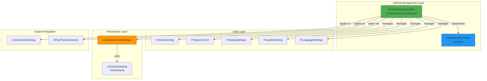
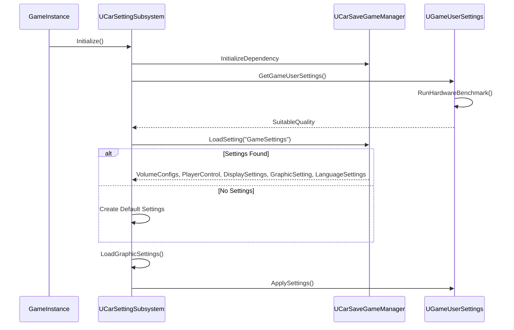
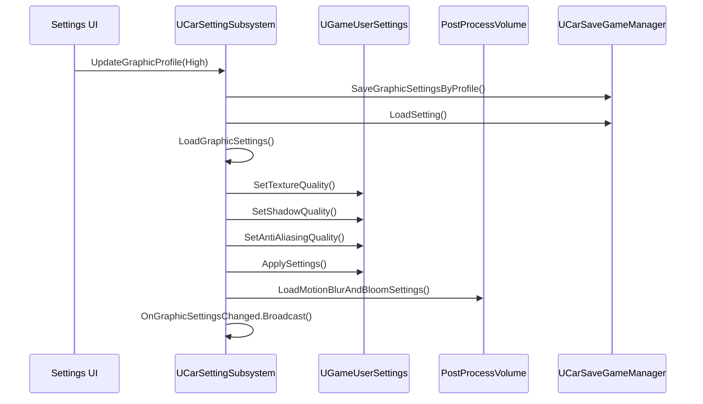

# Setting System Architecture - VNRacing

**Project**: PrototypeRacing - Mobile Racing Game

**Document**: Setting System Architecture

**Version**: 1.0.0

**Date**: 2026-01-20

**Status**: ✅ Synced with Source Code

---

## Implementation Status Overview

| Component | Status | Location |
|-----------|--------|----------|
| UCarSettingSubsystem | ✅ Implemented | `Source/PrototypeRacing/Public/SettingSystem/CarSettingSubsystem.h` |
| ISettingDataProvider | ✅ Implemented | `Source/PrototypeRacing/Public/SettingSystem/SettingDataProvider.h` |
| UCarSaveSetting | ✅ Implemented | `Source/PrototypeRacing/Public/SettingSystem/CarSaveSetting.h` |
| Volume Settings | ✅ Implemented | 4 volume types (General, Engine, Music, SFX) |
| Control Settings | ✅ Implemented | Control type + Drift mode |
| Display Settings | ✅ Implemented | Camera view + Speed unit |
| Graphic Settings | ✅ Implemented | Full profile system with individual options |
| Language Settings | ✅ Implemented | 4 languages supported |
| Auto Graphic Detection | ✅ Implemented | Hardware benchmark integration |

---

## Architecture Overview

The Setting System uses a subsystem-based architecture with interface abstraction for data access. Settings are persisted through `UCarSaveGameManager` and applied via Unreal's `UGameUserSettings`.

### High-Level System Architecture



---

## Core Components

### 1. UCarSettingSubsystem ✅

**Location**: `Source/PrototypeRacing/Public/SettingSystem/CarSettingSubsystem.h`

**Type**: `UGameInstanceSubsystem` implementing `ISettingDataProvider`

**Purpose**: Central manager for all game settings

**Actual Implementation**:
```cpp
UCLASS()
class PROTOTYPERACING_API UCarSettingSubsystem : public UGameInstanceSubsystem, public ISettingDataProvider
{
    GENERATED_BODY()

public:
    virtual void Initialize(FSubsystemCollectionBase& Collection) override;
    virtual void Deinitialize() override;

    // === Getters ===
    virtual TArray<FVolumeConfig> GetVolumeConfigs() override;
    virtual FPlayerControl GetPlayerControl() override;
    virtual FDisplaySettings GetDisplaySettings() override;
    virtual FGraphicSetting GetGraphicSettings() override;
    virtual FLanguageSettings GetLanguageSetting() override;

    // === Volume Updates ===
    virtual void UpdateVolumeConfig(FVolumeConfig NewVolumeConfig) override;

    // === Control Updates ===
    virtual void UpdateDrivingType(EControlType NewControlType) override;
    virtual void UpdateBrakeType(EDriftMode NewDriftMode) override;

    // === Display Updates ===
    virtual void UpdateCameraView(ECameraView CameraView) override;
    virtual void UpdateSpeedUnit(ESpeedUnit SpeedUnit) override;

    // === Graphic Updates ===
    virtual void UpdateGraphicProfile(EGraphicDetails GraphicDetails) override;
    virtual void UpdateFrameRateLimit(float FrameRateLimit) override;
    virtual void UpdateTextures(int TexturesQuality) override;
    virtual void UpdateBloom(bool bIsOn) override;
    virtual void UpdateMotionBlur(bool bIsOn) override;
    virtual void UpdateAntiAliasing(int AntiAliasing) override;
    virtual void UpdateLightQuality(int LightQuality) override;
    virtual void UpdateShadowResolutions(int ShadowResolutions) override;

    // === Language ===
    virtual void UpdateLanguage(ELanguage NewLanguage) override;

    // === Persistence ===
    virtual void SaveSettings() override;

    // === Auto Detection ===
    virtual void AutoUpdateGraphic() override;
    virtual void CheckGraphicSettings() override;

    UFUNCTION(BlueprintCallable, Category="SettingSubsystem|Graphic")
    void LoadGraphicSettings();

    // === Events ===
    UPROPERTY(BlueprintAssignable)
    FOnGraphicSettingsChanged OnGraphicSettingsChanged;

    UPROPERTY(BlueprintAssignable)
    FSettingWarnings SettingWarnings;

private:
    FString DefaultSettingName = "GameSettings";
    TArray<FVolumeConfig> CurrentVolumeConfigs;
    FPlayerControl PlayerControl;
    FDisplaySettings DisplaySettings;
    FGraphicSetting GraphicSetting;
    FLanguageSettings LanguageSettings;
    UGameUserSettings* GameUserSettings;
    UCarSaveGameManager* SaveGameManager;
    Scalability::FQualityLevels SuitableQuality;
};
```

**Delegates**:
```cpp
DECLARE_DYNAMIC_MULTICAST_DELEGATE_OneParam(FOnGraphicSettingsChanged, FGraphicSetting, NewGraphicSetting);
DECLARE_DYNAMIC_MULTICAST_DELEGATE_OneParam(FSettingWarnings, const TArray<FString>&, SettingWarningArray);
```

---

### 2. ISettingDataProvider Interface ✅

**Location**: `Source/PrototypeRacing/Public/SettingSystem/SettingDataProvider.h`

**Purpose**: Interface contract for setting data access

```cpp
UINTERFACE(NotBlueprintable)
class USettingDataProvider : public UInterface
{
    GENERATED_BODY()
};

class PROTOTYPERACING_API ISettingDataProvider
{
    GENERATED_BODY()

public:
    // Getters
    virtual TArray<FVolumeConfig> GetVolumeConfigs() = 0;
    virtual FPlayerControl GetPlayerControl() = 0;
    virtual FDisplaySettings GetDisplaySettings() = 0;
    virtual FGraphicSetting GetGraphicSettings() = 0;
    virtual FLanguageSettings GetLanguageSetting() = 0;

    // Volume
    virtual void UpdateVolumeConfig(FVolumeConfig NewVolumeConfig) = 0;

    // Control
    virtual void UpdateDrivingType(EControlType NewControlType = EControlType::Button) = 0;
    virtual void UpdateBrakeType(EDriftMode NewDriftMode = EDriftMode::Toggle) = 0;

    // Display
    virtual void UpdateCameraView(ECameraView CameraView = ECameraView::Default) = 0;
    virtual void UpdateSpeedUnit(ESpeedUnit SpeedUnit = ESpeedUnit::Kph) = 0;

    // Graphics
    virtual void UpdateGraphicProfile(EGraphicDetails GraphicDetails = EGraphicDetails::Balance) = 0;
    virtual void UpdateFrameRateLimit(float FrameRateLimit = 60.0f) = 0;
    virtual void UpdateTextures(int TexturesQuality = 1) = 0;
    virtual void UpdateBloom(bool bIsOn = true) = 0;
    virtual void UpdateMotionBlur(bool bIsOn = true) = 0;
    virtual void UpdateAntiAliasing(int AntiAliasing = 1) = 0;
    virtual void UpdateLightQuality(int LightQuality = 1) = 0;
    virtual void UpdateShadowResolutions(int ShadowResolutions = 1) = 0;

    // Language
    virtual void UpdateLanguage(ELanguage NewLanguage = ELanguage::English) = 0;

    // Persistence
    virtual void SaveSettings() = 0;

    // Auto Detection
    virtual void AutoUpdateGraphic() = 0;
    virtual void CheckGraphicSettings() = 0;
};
```

---

## Data Structures

### Enumerations

```cpp
// Control Type - Steering method
UENUM(BlueprintType)
enum class EControlType : uint8
{
    SteeringWheel   UMETA(DisplayName="Steering Wheel"),
    Button          UMETA(DisplayName="Left/Right Buttons"),
    TiltSteering    UMETA(DisplayName="Tilt Steering")
};

// Drift Mode - Brake/drift activation
UENUM(BlueprintType)
enum class EDriftMode : uint8
{
    Toggle UMETA(DisplayName = "Toggle"),  // Tap to drift, tap to cancel
    Press  UMETA(DisplayName = "Press")    // Hold to drift
};

// Camera View - Camera distance
UENUM(BlueprintType)
enum class ECameraView : uint8
{
    Default UMETA(DisplayName="Default"),
    Far     UMETA(DisplayName="Far"),
    Near    UMETA(DisplayName="Near")
};

// Speed Unit - Display unit
UENUM(BlueprintType)
enum class ESpeedUnit : uint8
{
    Kph UMETA(DisplayName="Km/h"),
    Mph UMETA(DisplayName="Mp/h")
};

// Language - Supported languages
UENUM(BlueprintType)
enum class ELanguage : uint8
{
    English    UMETA(DisplayName="English"),
    Vietnamese UMETA(DisplayName="Vietnamese"),
    Chinese    UMETA(DisplayName="Chinese"),
    Japanese   UMETA(DisplayName="Japanese")
};

// Graphic Profile - Quality presets
UENUM(BlueprintType)
enum class EGraphicDetails : uint8
{
    Performance UMETA(DisplayName="Performance"),  // Low quality, high FPS
    Balance     UMETA(DisplayName="Balance"),      // Medium quality
    High        UMETA(DisplayName="High"),         // High quality
    Ultra       UMETA(DisplayName="Ultra"),        // Maximum quality
    Custom      UMETA(DisplayName="Custom")        // User-defined
};
```

### Setting Structures

```cpp
// Volume Configuration
USTRUCT(BlueprintType)
struct FVolumeConfig
{
    GENERATED_BODY()

    UPROPERTY(EditAnywhere, BlueprintReadWrite, Category="Setting|Volume")
    FString VolumeType;  // "GENERALS", "Engine", "Music", "SFX"

    UPROPERTY(EditAnywhere, BlueprintReadWrite, Category="Setting|Volume")
    float CurrentVolume;  // 0.0 - 1.0

    FVolumeConfig(): VolumeType("GENERALS"), CurrentVolume(1.0f) {}
    FVolumeConfig(FString NewVolumeType, float NewVolume)
        : VolumeType(NewVolumeType), CurrentVolume(NewVolume) {}
};

// Player Control Settings
USTRUCT(BlueprintType)
struct FPlayerControl
{
    GENERATED_BODY()

    UPROPERTY(VisibleAnywhere, BlueprintReadWrite)
    EControlType ControlType;

    UPROPERTY(VisibleAnywhere, BlueprintReadWrite)
    EDriftMode DriftMode;

    FPlayerControl()
        : ControlType(EControlType::Button)
        , DriftMode(EDriftMode::Toggle) {}
};

// Display Settings
USTRUCT(BlueprintType)
struct FDisplaySettings
{
    GENERATED_BODY()

    UPROPERTY(VisibleAnywhere, BlueprintReadWrite)
    ECameraView ViewType;

    UPROPERTY(VisibleAnywhere, BlueprintReadWrite)
    ESpeedUnit SpeedUnit;

    FDisplaySettings()
        : ViewType(ECameraView::Default)
        , SpeedUnit(ESpeedUnit::Kph) {}
};

// Graphic Settings
USTRUCT(BlueprintType)
struct FGraphicSetting
{
    GENERATED_BODY()

    UPROPERTY(EditAnywhere, BlueprintReadWrite, Category="Graphics")
    EGraphicDetails GraphicProfile;

    UPROPERTY(EditAnywhere, BlueprintReadWrite, Category="Graphics")
    float FrameRateLimit;  // 30.0 or 60.0

    UPROPERTY(EditAnywhere, BlueprintReadWrite, Category="Graphics")
    int TextureQuality;  // 0-4 (Low to Ultra)

    UPROPERTY(EditAnywhere, BlueprintReadWrite, Category="Graphics")
    bool Bloom;

    UPROPERTY(EditAnywhere, BlueprintReadWrite, Category="Graphics")
    bool MotionBlur;

    UPROPERTY(EditAnywhere, BlueprintReadWrite, Category="Graphics")
    int AntiAliasing;  // 0-4 (Low to Ultra)

    UPROPERTY(EditAnywhere, BlueprintReadWrite, Category="Graphics")
    int LightQuality;  // 0-4 (Low to Ultra)

    UPROPERTY(EditAnywhere, BlueprintReadWrite, Category="Graphics")
    int ShadowResolution;  // 0-4 (Low to Ultra)

    FGraphicSetting()
        : GraphicProfile(EGraphicDetails::Balance)
        , FrameRateLimit(60.0f)
        , TextureQuality(1)
        , Bloom(true)
        , MotionBlur(true)
        , AntiAliasing(1)
        , LightQuality(1)
        , ShadowResolution(1) {}
};

// Language Settings
USTRUCT(BlueprintType)
struct FLanguageSettings
{
    GENERATED_BODY()

    UPROPERTY(EditAnywhere, BlueprintReadWrite, Category="Language")
    ELanguage CurrentLanguage = ELanguage::English;
};
```

---

## Save System

### UCarSaveSetting ✅

**Location**: `Source/PrototypeRacing/Public/SettingSystem/CarSaveSetting.h`

**Type**: `USaveGame`

```cpp
UCLASS()
class PROTOTYPERACING_API UCarSaveSetting : public USaveGame
{
    GENERATED_BODY()

public:
    TArray<FVolumeConfig> GetVolumeConfigs();
    void SetVolumeConfigs(TArray<FVolumeConfig> NewVolumeConfigs);

    FPlayerControl GetPlayerControl();
    void SetPlayerControl(FPlayerControl NewPlayerControl);

    FDisplaySettings GetDisplaySettings();
    void SetDisplaySettings(ECameraView NewCameraView, ESpeedUnit NewSpeedUnit);

    FGraphicSetting GetGraphicSetting();
    void SetGraphicSettings(FGraphicSetting NewGraphicSetting);

    FLanguageSettings GetLanguageSettings();
    void SetLanguageSetting(ELanguage NewLanguage);

private:
    TArray<FVolumeConfig> VolumeConfigs;
    FPlayerControl PlayerControl;
    FDisplaySettings DisplaySettings;
    FGraphicSetting GraphicSetting;
    FLanguageSettings LanguageSettings;
};
```

---

## Data Flow

### Initialization Flow



### Setting Update Flow



---

## Default Values

### Volume Defaults

| Volume Type | Default Value |
|-------------|---------------|
| GENERALS | 1.0 (100%) |
| Engine | 1.0 (100%) |
| Music | 1.0 (100%) |
| SFX | 1.0 (100%) |

### Control Defaults

| Setting | Default |
|---------|---------|
| ControlType | Button |
| DriftMode | Toggle |

### Display Defaults

| Setting | Default |
|---------|---------|
| ViewType | Default |
| SpeedUnit | Kph |

### Graphic Defaults

| Setting | Default |
|---------|---------|
| GraphicProfile | Balance |
| FrameRateLimit | 60.0 |
| TextureQuality | 1 (Medium) |
| Bloom | true |
| MotionBlur | true |
| AntiAliasing | 1 (Medium) |
| LightQuality | 1 (Medium) |
| ShadowResolution | 1 (Medium) |

### Language Default

| Setting | Default |
|---------|---------|
| CurrentLanguage | English |

---

## Auto Graphic Detection

The system uses Unreal's hardware benchmark to automatically detect suitable quality:

```cpp
void UCarSettingSubsystem::AutoUpdateGraphic()
{
    GameUserSettings->RunHardwareBenchmark();
    GameUserSettings->ApplyHardwareBenchmarkResults();
    
    switch (GameUserSettings->GetOverallScalabilityLevel())
    {
        case 0: // Low
            GraphicSetting.GraphicProfile = EGraphicDetails::Performance;
            GraphicSetting.MotionBlur = false;
            GraphicSetting.Bloom = false;
            break;
        case 1: // Medium
            GraphicSetting.GraphicProfile = EGraphicDetails::Balance;
            GraphicSetting.MotionBlur = false;
            GraphicSetting.Bloom = false;
            break;
        case 2: // High
            GraphicSetting.GraphicProfile = EGraphicDetails::High;
            GraphicSetting.MotionBlur = true;
            GraphicSetting.Bloom = true;
            break;
        case 3: // Ultra
        case 4: // Cinematic
            GraphicSetting.GraphicProfile = EGraphicDetails::Ultra;
            GraphicSetting.MotionBlur = true;
            GraphicSetting.Bloom = true;
            break;
    }
    // Sync other settings from GameUserSettings
    GraphicSetting.FrameRateLimit = GameUserSettings->GetFrameRateLimit();
    GraphicSetting.TextureQuality = GameUserSettings->GetTextureQuality();
    // ... etc
}
```

---

## Quality Warning System

The system can warn users when their settings exceed recommended hardware capabilities:

```cpp
void UCarSettingSubsystem::CheckGraphicSettings()
{
    TArray<FString> OverQualitiesArray;

    if (GraphicSetting.TextureQuality > SuitableQuality.TextureQuality)
        OverQualitiesArray.Add(TEXT("Textures"));
    
    if (GraphicSetting.ShadowResolution > SuitableQuality.ShadowQuality)
        OverQualitiesArray.Add(TEXT("Shadows"));
    
    if (GraphicSetting.LightQuality > SuitableQuality.GlobalIlluminationQuality)
        OverQualitiesArray.Add(TEXT("LightingQuality"));
    
    if (GraphicSetting.AntiAliasing > SuitableQuality.AntiAliasingQuality)
        OverQualitiesArray.Add(TEXT("AntiAliasing"));

    SettingWarnings.Broadcast(OverQualitiesArray);
}
```

---

## Integration Points

### With UCarSaveGameManager

- Settings saved via `SaveSetting()` method
- Settings loaded via `LoadSetting()` method
- Save slot name: `"GameSettings"`

### With UGameUserSettings

- Frame rate limit
- Texture quality
- Shadow quality
- Anti-aliasing quality
- Global illumination quality

### With APostProcessVolume

- Bloom intensity
- Motion blur (via RadialBlur material)

---

## Source Files

| File | Location |
|------|----------|
| CarSettingSubsystem.h | `Public/SettingSystem/` |
| CarSettingSubsystem.cpp | `Private/SettingSystem/` |
| SettingDataProvider.h | `Public/SettingSystem/` |
| CarSaveSetting.h | `Public/SettingSystem/` |

---

## Summary

The Setting System provides:

- **Unified Management**: Single subsystem for all settings
- **Interface Abstraction**: `ISettingDataProvider` for clean API
- **Persistent Storage**: Via `UCarSaveGameManager`
- **Engine Integration**: Direct integration with `UGameUserSettings`
- **Auto Detection**: Hardware benchmark for optimal defaults
- **Quality Warnings**: Alert users about performance-impacting settings
- **Event System**: Delegates for UI updates

**Next Steps**: Consider adding haptic feedback settings and network/data saver options for mobile optimization.


---

## Planned Extensions (From TDD)

> **Note**: Các phần dưới đây là thiết kế mở rộng cho tương lai, chưa được triển khai trong source code hiện tại.

### Extended Data Structures (Planned)

#### FControlsSettingData (Extended)
```cpp
USTRUCT(BlueprintType)
struct PROTOTYPERACING_API FControlsSettingData
{
    GENERATED_BODY()

    UPROPERTY(EditAnywhere, BlueprintReadWrite, Category = "Controls")
    EControlType SteeringType = EControlType::TapToSteer;

    UPROPERTY(EditAnywhere, BlueprintReadWrite, Category = "Controls")
    EDriftMode DriftMode = EDriftMode::Tap;

    // Extended: Input Sensitivity (0.1 - 2.0)
    UPROPERTY(EditAnywhere, BlueprintReadWrite, Category = "Controls", meta = (ClampMin = "0.1", ClampMax = "2.0"))
    float InputSensitivity = 1.0f;

    // Extended: Gyroscope Sensitivity (for Tilt steering)
    UPROPERTY(EditAnywhere, BlueprintReadWrite, Category = "Controls", meta = (ClampMin = "0.1", ClampMax = "3.0"))
    float GyroscopeSensitivity = 1.0f;

    bool IsValid() const
    {
        return InputSensitivity >= 0.1f && InputSensitivity <= 2.0f &&
               GyroscopeSensitivity >= 0.1f && GyroscopeSensitivity <= 3.0f;
    }
};
```

#### FAudioSettingData (Extended)
```cpp
USTRUCT(BlueprintType)
struct PROTOTYPERACING_API FAudioSettingData
{
    GENERATED_BODY()

    // Volume Settings (0-100, step 10)
    UPROPERTY(EditAnywhere, BlueprintReadWrite, Category = "Audio", meta = (ClampMin = "0", ClampMax = "100"))
    int32 GeneralVolume = 80;

    UPROPERTY(EditAnywhere, BlueprintReadWrite, Category = "Audio", meta = (ClampMin = "0", ClampMax = "100"))
    int32 EngineVolume = 80;

    UPROPERTY(EditAnywhere, BlueprintReadWrite, Category = "Audio", meta = (ClampMin = "0", ClampMax = "100"))
    int32 MusicVolume = 80;

    UPROPERTY(EditAnywhere, BlueprintReadWrite, Category = "Audio", meta = (ClampMin = "0", ClampMax = "100"))
    int32 SFXVolume = 80;

    // Extended: UI SFX Volume
    UPROPERTY(EditAnywhere, BlueprintReadWrite, Category = "Audio", meta = (ClampMin = "0", ClampMax = "100"))
    int32 UISFXVolume = 80;

    bool IsValid() const
    {
        return GeneralVolume >= 0 && GeneralVolume <= 100 &&
               EngineVolume >= 0 && EngineVolume <= 100 &&
               MusicVolume >= 0 && MusicVolume <= 100 &&
               SFXVolume >= 0 && SFXVolume <= 100 &&
               UISFXVolume >= 0 && UISFXVolume <= 100;
    }
};
```

#### FGameSettingConfiguration (Unified)
```cpp
USTRUCT(BlueprintType)
struct PROTOTYPERACING_API FGameSettingConfiguration
{
    GENERATED_BODY()

    UPROPERTY(EditAnywhere, BlueprintReadWrite, Category = "Settings")
    FControlsSettingData ControlsSettings;

    UPROPERTY(EditAnywhere, BlueprintReadWrite, Category = "Settings")
    FAudioSettingData AudioSettings;

    UPROPERTY(EditAnywhere, BlueprintReadWrite, Category = "Settings")
    FGraphicsSettingData GraphicsSettings;

    UPROPERTY(EditAnywhere, BlueprintReadWrite, Category = "Settings")
    FDisplaySettingData DisplaySettings;

    UPROPERTY(EditAnywhere, BlueprintReadWrite, Category = "Settings")
    FLanguageSettingData LanguageSettings;

    UPROPERTY(EditAnywhere, BlueprintReadWrite, Category = "Settings")
    bool bIsValid = true;

    UPROPERTY(EditAnywhere, BlueprintReadWrite, Category = "Settings")
    FDateTime LastModified;
};
```

---

### Planned Category Managers

> **Status**: ⏸️ Pending - Thiết kế cho tương lai khi cần tách biệt quản lý từng category

#### USettingManagerBase (Abstract)
```cpp
UCLASS(Abstract)
class PROTOTYPERACING_API USettingManagerBase : public UObject
{
    GENERATED_BODY()

public:
    virtual void ApplySettings() PURE_VIRTUAL(USettingManagerBase::ApplySettings, );
    virtual bool ValidateSettings() const PURE_VIRTUAL(USettingManagerBase::ValidateSettings, return false;);
    
    UPROPERTY(BlueprintAssignable)
    FOnSettingChanged OnSettingChanged;
};
```

#### Specialized Managers

| Manager | Purpose | Status |
|---------|---------|--------|
| UControlsSettingManager | Steering, drift, sensitivity | ⏸️ Planned |
| UAudioSettingManager | Volume controls per category | ⏸️ Planned |
| UGraphicsSettingManager | Quality profiles, individual settings | ⏸️ Planned |
| UDisplaySettingManager | Camera, speed unit, UI scale | ⏸️ Planned |
| ULanguageSettingManager | Localization, language selection | ⏸️ Planned |

---

### Extended Type Definitions

#### Additional Control Enums
```cpp
// Extended steering types
UENUM(BlueprintType)
enum class EControlType : uint8
{
    TapToSteer = 0      UMETA(DisplayName = "Tap To Steer"),
    WheelDrive = 1      UMETA(DisplayName = "Wheel Drive"),
    TiltToSteer = 2     UMETA(DisplayName = "Tilt To Steer")
};

// Extended drift modes
UENUM(BlueprintType)
enum class EDriftMode : uint8
{
    Hold = 0            UMETA(DisplayName = "Hold to Drift"),
    Tap = 1             UMETA(DisplayName = "Tap to Drift")
};
```

#### Graphics Quality Enums
```cpp
UENUM(BlueprintType)
enum class EQualityLevel : uint8
{
    Low = 0             UMETA(DisplayName = "Low"),
    Medium = 1          UMETA(DisplayName = "Medium"),
    High = 2            UMETA(DisplayName = "High"),
    Cinematic = 3       UMETA(DisplayName = "Cinematic")
};

UENUM(BlueprintType)
enum class EFrameRateLimit : uint8
{
    FPS30 = 0           UMETA(DisplayName = "30 FPS"),
    FPS60 = 1           UMETA(DisplayName = "60 FPS"),
    Unlimited = 2       UMETA(DisplayName = "Unlimited")
};
```

#### Mobile Optimization Enums (Future)
```cpp
UENUM(BlueprintType)
enum class EMobileQualityLevel : uint8
{
    Potato = 0          UMETA(DisplayName = "Potato"),
    Low = 1             UMETA(DisplayName = "Low"),
    Medium = 2          UMETA(DisplayName = "Medium"),
    High = 3            UMETA(DisplayName = "High")
};
```

#### Setting Constants
```cpp
namespace SettingConstants
{
    // Volume Settings
    static constexpr int32 MIN_VOLUME = 0;
    static constexpr int32 MAX_VOLUME = 100;
    static constexpr int32 VOLUME_STEP = 10;
    static constexpr int32 DEFAULT_VOLUME = 80;

    // Sensitivity Settings
    static constexpr float MIN_SENSITIVITY = 0.1f;
    static constexpr float MAX_SENSITIVITY = 2.0f;
    static constexpr float DEFAULT_SENSITIVITY = 1.0f;

    // UI Scale Settings
    static constexpr float MIN_UI_SCALE = 0.5f;
    static constexpr float MAX_UI_SCALE = 2.0f;
    static constexpr float DEFAULT_UI_SCALE = 1.0f;

    // Performance Thresholds (Future)
    static constexpr float THERMAL_WARNING_THRESHOLD = 60.0f;
    static constexpr float THERMAL_CRITICAL_THRESHOLD = 70.0f;
    static constexpr float MEMORY_WARNING_THRESHOLD = 80.0f;
    static constexpr float MEMORY_CRITICAL_THRESHOLD = 90.0f;
}
```

---

### Planned Save System Extensions

#### USettingSaveManager (Extended)
```cpp
UCLASS()
class PROTOTYPERACING_API USettingSaveManager : public UObject
{
    GENERATED_BODY()

public:
    // Core Save/Load
    UFUNCTION(BlueprintCallable)
    bool SaveConfiguration(const FGameSettingConfiguration& Configuration);

    UFUNCTION(BlueprintCallable)
    bool LoadConfiguration(FGameSettingConfiguration& OutConfiguration);

    UFUNCTION(BlueprintCallable)
    void ResetToDefaults();

    // Cloud Sync (Future)
    UFUNCTION(BlueprintCallable)
    void EnableCloudSync(bool bEnable);

    UFUNCTION(BlueprintCallable)
    void SyncToCloud();

    UFUNCTION(BlueprintCallable)
    void SyncFromCloud();

    // Data Validation
    UFUNCTION(BlueprintCallable)
    bool ValidateConfigurationData(const FGameSettingConfiguration& Configuration) const;

    UFUNCTION(BlueprintCallable)
    void RepairCorruptedData();

    // Events
    UPROPERTY(BlueprintAssignable)
    FOnSettingSaved OnSettingSaved;

    UPROPERTY(BlueprintAssignable)
    FOnSettingLoaded OnSettingLoaded;

protected:
    bool bCloudSyncEnabled = false;
    
    FString GetSettingSaveFilePath() const;
    bool SaveToFile(const FGameSettingConfiguration& Configuration);
    bool LoadFromFile(FGameSettingConfiguration& OutConfiguration);
    void CreateBackup(const FGameSettingConfiguration& Configuration);
    bool RestoreFromBackup(FGameSettingConfiguration& OutConfiguration);
};
```

#### JSON Save Format
```json
{
    "ControlsSettings": {
        "SteeringType": 0,
        "DriftMode": 1,
        "InputSensitivity": 1.0,
        "GyroscopeSensitivity": 1.0
    },
    "AudioSettings": {
        "GeneralVolume": 80,
        "EngineVolume": 80,
        "MusicVolume": 80,
        "SFXVolume": 80,
        "UISFXVolume": 80
    },
    "GraphicsSettings": {
        "GraphicsProfile": 1,
        "FrameRateLimit": 1,
        "TextureQuality": 1,
        "BloomEnabled": true,
        "MotionBlurEnabled": true
    },
    "DisplaySettings": {
        "CameraView": 0,
        "SpeedUnit": 0,
        "UIScale": 1.0
    },
    "LanguageSettings": {
        "CurrentLanguage": 0,
        "UseTextLocalization": true,
        "UseAudioLocalization": true
    },
    "IsValid": true,
    "LastModified": "2026-01-20T00:00:00"
}
```

---

### Implementation Roadmap

| Phase | Components | Status |
|-------|------------|--------|
| Phase 1 | Core subsystem, basic settings | ✅ Done |
| Phase 2 | Category managers, extended data | ⏸️ Planned |
| Phase 3 | Cloud sync, data validation | ⏸️ Future |
| Phase 4 | Mobile optimization, thermal management | ⏸️ Future |
