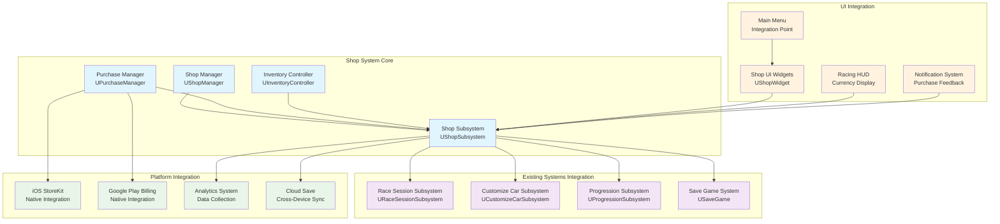

# API Integration Guidelines - Shop System

**Project**: PrototypeRacing  
**Document**: Shop System API Integration Guidelines  
**Version**: 1.0  
**Date**: 2025-09-07  
**Status**: Integration Ready

## 🔗 **Integration Architecture Overview**

### System Integration Map


## 🎯 **Race Session Subsystem Integration**

### Currency System Integration
```cpp
// Enhanced URaceSessionSubsystem integration
void UShopSubsystem::Initialize(FSubsystemCollectionBase& Collection)
{
    Super::Initialize(Collection);
    
    // Get existing race session subsystem
    RaceSessionSubsystem = GetGameInstance()->GetSubsystem<URaceSessionSubsystem>();
    if (!RaceSessionSubsystem)
    {
        UE_LOG(LogShop, Error, TEXT("Failed to get RaceSessionSubsystem"));
        return;
    }
    
    // Initialize currency manager with existing coin system
    CurrencyManager = NewObject<UCurrencyManager>(this);
    CurrencyManager->Initialize(RaceSessionSubsystem);
    
    // Sync existing coin data
    SyncWithExistingCoinSystem();
}

void UShopSubsystem::SyncWithExistingCoinSystem()
{
    if (!RaceSessionSubsystem || !CurrencyManager)
    {
        return;
    }
    
    // Get current coin amount from existing system
    int32 CurrentCoins = RaceSessionSubsystem->GetCoin();
    
    // Set in new currency system
    CurrencyManager->SetCurrency(ECurrencyType::Coins, CurrentCoins);
    
    // Bind to coin changes in existing system
    // Note: This would require adding delegates to URaceSessionSubsystem
    // RaceSessionSubsystem->OnCoinChanged.AddDynamic(this, &UShopSubsystem::OnExistingCoinChanged);
    
    UE_LOG(LogShop, Log, TEXT("Synced %d coins from existing system"), CurrentCoins);
}

UFUNCTION()
void UShopSubsystem::OnExistingCoinChanged(int32 NewCoinAmount)
{
    // Keep currency systems in sync
    if (CurrencyManager)
    {
        CurrencyManager->SetCurrency(ECurrencyType::Coins, NewCoinAmount);
        OnCurrencyChanged.Broadcast(ECurrencyType::Coins, NewCoinAmount);
    }
}

// Override currency spending to update both systems
bool UShopSubsystem::SpendCurrency(ECurrencyType CurrencyType, int32 Amount)
{
    if (CurrencyType == ECurrencyType::Coins)
    {
        // Use existing race session system for coins
        if (RaceSessionSubsystem && RaceSessionSubsystem->GetCoin() >= Amount)
        {
            RaceSessionSubsystem->RemoveCoinFromProfile(Amount);
            
            // Update our currency manager
            CurrencyManager->SetCurrency(ECurrencyType::Coins, RaceSessionSubsystem->GetCoin());
            
            return true;
        }
        return false;
    }
    else
    {
        // Use new currency system for other currencies
        return CurrencyManager->SpendCurrency(CurrencyType, Amount);
    }
}

void UShopSubsystem::AddCurrency(ECurrencyType CurrencyType, int32 Amount, ECurrencySource Source)
{
    if (CurrencyType == ECurrencyType::Coins)
    {
        // Add to existing race session system
        if (RaceSessionSubsystem)
        {
            RaceSessionSubsystem->AddCoinToProfile(Amount);
            
            // Update our currency manager
            CurrencyManager->SetCurrency(ECurrencyType::Coins, RaceSessionSubsystem->GetCoin());
        }
    }
    else
    {
        // Add to new currency system
        CurrencyManager->AddCurrency(CurrencyType, Amount, Source);
    }
    
    // Broadcast currency change
    OnCurrencyChanged.Broadcast(CurrencyType, GetCurrency(CurrencyType));
}
```

### Player Profile Integration
```cpp
// Integration with existing FPlayerProfile
void UShopSubsystem::IntegrateWithPlayerProfile()
{
    if (!RaceSessionSubsystem)
    {
        return;
    }
    
    // Get existing player profile
    FPlayerProfile& PlayerProfile = RaceSessionSubsystem->PlayerProfile;
    
    // Create shop-specific player data
    FShopPlayerData ShopData;
    ShopData.PlayerLevel = PlayerProfile.Level;
    ShopData.TotalCoins = PlayerProfile.Coin;
    ShopData.LastShopVisit = FDateTime::Now();
    
    // Initialize shop data
    InitializeShopPlayerData(ShopData);
}

// Enhanced player profile structure (suggestion for URaceSessionSubsystem)
USTRUCT(BlueprintType)
struct FEnhancedPlayerProfile : public FPlayerProfile
{
    GENERATED_BODY()

    // Shop-related data
    UPROPERTY(VisibleAnywhere, BlueprintReadWrite, SaveGame)
    TMap<ECurrencyType, int32> Currencies;
    
    UPROPERTY(VisibleAnywhere, BlueprintReadWrite, SaveGame)
    TArray<FTransactionData> PurchaseHistory;
    
    UPROPERTY(VisibleAnywhere, BlueprintReadWrite, SaveGame)
    FDateTime LastShopVisit;
    
    UPROPERTY(VisibleAnywhere, BlueprintReadWrite, SaveGame)
    int32 TotalPurchases = 0;
    
    UPROPERTY(VisibleAnywhere, BlueprintReadWrite, SaveGame)
    float TotalMoneySpent = 0.0f;
};
```

## 🚗 **Car Customization System Integration**

### Inventory to Customization Bridge
```cpp
// Integration with existing UCustomizeCarSubsystem
void UInventoryController::ApplyCarItem(FName ItemId)
{
    if (!HasItem(ItemId))
    {
        UE_LOG(LogShop, Warning, TEXT("Player doesn't own item: %s"), *ItemId.ToString());
        return;
    }
    
    // Get item data
    FShopItem ItemData = ShopManager->GetItemById(ItemId);
    if (ItemData.Category != EShopCategory::Cars)
    {
        UE_LOG(LogShop, Warning, TEXT("Item %s is not a car"), *ItemId.ToString());
        return;
    }
    
    // Get existing customization subsystem
    UCustomizeCarSubsystem* CustomizeSubsystem = GetGameInstance()->GetSubsystem<UCustomizeCarSubsystem>();
    if (!CustomizeSubsystem)
    {
        UE_LOG(LogShop, Error, TEXT("Failed to get CustomizeCarSubsystem"));
        return;
    }
    
    // Add car to player's garage (integration with existing system)
    AddCarToGarage(ItemId, ItemData, CustomizeSubsystem);
    
    // Mark item as applied
    MarkItemAsApplied(ItemId);
}

void UInventoryController::AddCarToGarage(FName ItemId, const FShopItem& ItemData, UCustomizeCarSubsystem* CustomizeSubsystem)
{
    // Create car configuration for existing system
    FCarPartCustomization CarConfig;
    
    // Load car mesh and materials from item data
    if (ItemData.ItemProperties.Contains(TEXT("MeshPath")))
    {
        FString MeshPath = ItemData.ItemProperties[TEXT("MeshPath")];
        CarConfig.Mesh = LoadObject<UStaticMesh>(nullptr, *MeshPath);
    }
    
    if (ItemData.ItemProperties.Contains(TEXT("MaterialPaths")))
    {
        FString MaterialPaths = ItemData.ItemProperties[TEXT("MaterialPaths")];
        TArray<FString> MaterialPathArray;
        MaterialPaths.ParseIntoArray(MaterialPathArray, TEXT(","));
        
        for (const FString& MaterialPath : MaterialPathArray)
        {
            UMaterialInterface* Material = LoadObject<UMaterialInterface>(nullptr, *MaterialPath);
            if (Material)
            {
                CarConfig.Materials.Add(Material);
            }
        }
    }
    
    // Set part style based on item rarity
    switch (ItemData.Rarity)
    {
        case EItemRarity::Common:
            CarConfig.Style = EPartStyle::Base;
            break;
        case EItemRarity::Uncommon:
        case EItemRarity::Rare:
            CarConfig.Style = EPartStyle::A;
            break;
        case EItemRarity::Epic:
        case EItemRarity::Legendary:
        case EItemRarity::Mythic:
            CarConfig.Style = EPartStyle::B;
            break;
    }
    
    // Add to existing customization system
    CustomizeSubsystem->SetPartMeshAndMaterials(ItemId.ToString(), CarConfig.Mesh, CarConfig.Materials);
    
    UE_LOG(LogShop, Log, TEXT("Added car %s to garage"), *ItemId.ToString());
}

void UInventoryController::ApplyCustomizationItem(FName ItemId)
{
    if (!HasItem(ItemId))
    {
        return;
    }
    
    FShopItem ItemData = ShopManager->GetItemById(ItemId);
    if (ItemData.Category != EShopCategory::Customization && ItemData.Category != EShopCategory::CarParts)
    {
        return;
    }
    
    UCustomizeCarSubsystem* CustomizeSubsystem = GetGameInstance()->GetSubsystem<UCustomizeCarSubsystem>();
    if (!CustomizeSubsystem)
    {
        return;
    }
    
    // Apply customization based on subcategory
    switch (ItemData.SubCategory)
    {
        case EShopSubCategory::PaintJobs:
            ApplyPaintJob(ItemId, ItemData, CustomizeSubsystem);
            break;
        case EShopSubCategory::Decals:
            ApplyDecal(ItemId, ItemData, CustomizeSubsystem);
            break;
        case EShopSubCategory::Engine:
        case EShopSubCategory::Wheels:
        case EShopSubCategory::Suspension:
            ApplyCarPart(ItemId, ItemData, CustomizeSubsystem);
            break;
        default:
            UE_LOG(LogShop, Warning, TEXT("Unsupported customization subcategory for item %s"), *ItemId.ToString());
            break;
    }
}
```

### Performance Integration
```cpp
// Integration with car performance system
void UInventoryController::ApplyCarPart(FName ItemId, const FShopItem& ItemData, UCustomizeCarSubsystem* CustomizeSubsystem)
{
    // Create part configuration
    FCarPartCustomization PartConfig;
    
    // Load part assets
    if (ItemData.ItemProperties.Contains(TEXT("PartMesh")))
    {
        FString MeshPath = ItemData.ItemProperties[TEXT("PartMesh")];
        PartConfig.Mesh = LoadObject<UStaticMesh>(nullptr, *MeshPath);
    }
    
    // Apply to existing system
    FString PartName = GetPartNameFromSubCategory(ItemData.SubCategory);
    CustomizeSubsystem->SetPartMeshAndMaterials(PartName, PartConfig.Mesh, PartConfig.Materials);
    
    // Apply performance modifications (if system exists)
    ApplyPerformanceModifications(ItemId, ItemData);
}

void UInventoryController::ApplyPerformanceModifications(FName ItemId, const FShopItem& ItemData)
{
    // Check if performance system exists
    // This would integrate with any existing performance modification system
    
    if (ItemData.ItemProperties.Contains(TEXT("SpeedBonus")))
    {
        float SpeedBonus = FCString::Atof(*ItemData.ItemProperties[TEXT("SpeedBonus")]);
        // Apply speed bonus to vehicle
        ApplySpeedModification(SpeedBonus);
    }
    
    if (ItemData.ItemProperties.Contains(TEXT("AccelerationBonus")))
    {
        float AccelBonus = FCString::Atof(*ItemData.ItemProperties[TEXT("AccelerationBonus")]);
        // Apply acceleration bonus to vehicle
        ApplyAccelerationModification(AccelBonus);
    }
    
    if (ItemData.ItemProperties.Contains(TEXT("HandlingBonus")))
    {
        float HandlingBonus = FCString::Atof(*ItemData.ItemProperties[TEXT("HandlingBonus")]);
        // Apply handling bonus to vehicle
        ApplyHandlingModification(HandlingBonus);
    }
}
```

## 📈 **Progression System Integration**

### Achievement and Level Integration
```cpp
// Integration with existing progression system
void UShopSubsystem::IntegrateWithProgressionSystem()
{
    ProgressionSubsystem = GetGameInstance()->GetSubsystem<UProgressionSubsystem>();
    if (!ProgressionSubsystem)
    {
        UE_LOG(LogShop, Warning, TEXT("Progression subsystem not found"));
        return;
    }
    
    // Bind to progression events
    ProgressionSubsystem->OnPlayerLevelUp.AddDynamic(this, &UShopSubsystem::OnPlayerLevelUp);
    ProgressionSubsystem->OnAchievementUnlocked.AddDynamic(this, &UShopSubsystem::OnAchievementUnlocked);
    ProgressionSubsystem->OnSeasonalTierReached.AddDynamic(this, &UShopSubsystem::OnSeasonalTierReached);
    
    // Initial sync
    SyncWithProgressionSystem();
}

UFUNCTION()
void UShopSubsystem::OnPlayerLevelUp(int32 NewLevel, int32 PreviousLevel)
{
    // Check for items that become available at this level
    TArray<FShopItem> NewlyAvailableItems = GetItemsUnlockedAtLevel(NewLevel);
    
    if (NewlyAvailableItems.Num() > 0)
    {
        // Notify player of newly available items
        ShowNewItemsNotification(NewlyAvailableItems);
        
        // Refresh shop display
        RefreshShopAvailability();
        
        // Analytics
        TrackLevelUnlocks(NewLevel, NewlyAvailableItems.Num());
    }
}

UFUNCTION()
void UShopSubsystem::OnAchievementUnlocked(FName AchievementID)
{
    // Check for items unlocked by this achievement
    TArray<FShopItem> UnlockedItems = GetItemsUnlockedByAchievement(AchievementID);
    
    if (UnlockedItems.Num() > 0)
    {
        // Show achievement unlock rewards
        ShowAchievementUnlockRewards(AchievementID, UnlockedItems);
        
        // Refresh shop
        RefreshShopAvailability();
        
        // Analytics
        TrackAchievementUnlocks(AchievementID, UnlockedItems.Num());
    }
}

UFUNCTION()
void UShopSubsystem::OnSeasonalTierReached(int32 NewTier, bool bPremium)
{
    // Check for seasonal items unlocked
    TArray<FShopItem> SeasonalItems = GetSeasonalItemsUnlockedAtTier(NewTier, bPremium);
    
    if (SeasonalItems.Num() > 0)
    {
        ShowSeasonalUnlockNotification(NewTier, bPremium, SeasonalItems);
        RefreshShopAvailability();
        TrackSeasonalUnlocks(NewTier, bPremium, SeasonalItems.Num());
    }
}

// Item availability checking
bool UShopSubsystem::IsItemAvailable(FName ItemId)
{
    FShopItem Item = ShopManager->GetItemById(ItemId);
    if (!Item.IsValid())
    {
        return false;
    }
    
    // Check basic availability
    if (!Item.IsAvailableNow())
    {
        return false;
    }
    
    // Check progression requirements
    if (ProgressionSubsystem)
    {
        FPlayerProgressionData PlayerData = ProgressionSubsystem->GetPlayerProgressionData();
        return Item.MeetsRequirements(PlayerData);
    }
    
    return true;
}
```

### VN-Tour Integration
```cpp
// Integration with VN-Tour progression
void UShopSubsystem::CheckVNTourUnlocks()
{
    if (!ProgressionSubsystem)
    {
        return;
    }
    
    // Get VN-Tour progress (this would need to be added to progression system)
    // FVNTourProgress TourProgress = ProgressionSubsystem->GetVNTourProgress();
    
    // Check for city-specific unlocks
    TArray<FName> CompletedCities; // = TourProgress.GetCompletedCities();
    
    for (const FName& CityName : CompletedCities)
    {
        TArray<FShopItem> CityItems = GetItemsUnlockedByCity(CityName);
        
        for (const FShopItem& Item : CityItems)
        {
            if (!IsItemUnlocked(Item.ItemId))
            {
                UnlockItem(Item.ItemId);
                ShowCityUnlockNotification(CityName, Item);
            }
        }
    }
}

TArray<FShopItem> UShopSubsystem::GetItemsUnlockedByCity(FName CityName)
{
    TArray<FShopItem> CityItems;
    
    // Get all shop items
    TArray<FShopItem> AllItems = ShopManager->GetAllItems();
    
    for (const FShopItem& Item : AllItems)
    {
        // Check if item has VN-Tour city requirement
        for (const FShopItemRequirement& Requirement : Item.Requirements)
        {
            if (Requirement.Type == ERequirementType::VNTourProgress && 
                Requirement.Parameter == CityName.ToString())
            {
                CityItems.Add(Item);
                break;
            }
        }
    }
    
    return CityItems;
}
```

## 💾 **Save Game System Integration**

### Save Data Integration
```cpp
// Enhanced save game integration
UCLASS()
class PROTOTYPERACING_API UEnhancedPrototypeRacingSaveGame : public USaveGame
{
    GENERATED_BODY()

public:
    // Existing save data
    UPROPERTY(SaveGame)
    FPlayerProfile PlayerProfile;
    
    UPROPERTY(SaveGame)
    TArray<FCarConfiguration> SavedCars;
    
    // NEW: Shop system data
    UPROPERTY(SaveGame)
    FCurrencyData PlayerCurrencies;
    
    UPROPERTY(SaveGame)
    FPlayerInventory PlayerInventory;
    
    UPROPERTY(SaveGame)
    TArray<FTransactionData> PurchaseHistory;
    
    UPROPERTY(SaveGame)
    FShopAnalyticsData ShopAnalytics;
    
    UPROPERTY(SaveGame)
    TMap<FName, bool> UnlockedItems;
    
    UPROPERTY(SaveGame)
    FDateTime LastShopSync;
    
    // Validation and migration
    UFUNCTION(BlueprintCallable)
    bool ValidateShopData();
    
    UFUNCTION(BlueprintCallable)
    void MigrateShopDataFromPreviousVersion(int32 PreviousVersion);
    
    UFUNCTION(BlueprintCallable)
    void RepairCorruptedShopData();
};

// Save/Load integration
void UShopSubsystem::SaveShopData()
{
    UEnhancedPrototypeRacingSaveGame* SaveGame = Cast<UEnhancedPrototypeRacingSaveGame>(
        UGameplayStatics::CreateSaveGameObject(UEnhancedPrototypeRacingSaveGame::StaticClass())
    );
    
    if (!SaveGame)
    {
        UE_LOG(LogShop, Error, TEXT("Failed to create save game object"));
        return;
    }
    
    // Save currency data
    SaveGame->PlayerCurrencies = CurrencyManager->GetCurrencyData();
    
    // Save inventory data
    SaveGame->PlayerInventory = InventoryController->GetInventoryData();
    
    // Save purchase history
    SaveGame->PurchaseHistory = PurchaseManager->GetPurchaseHistory();
    
    // Save analytics data
    SaveGame->ShopAnalytics = GetShopAnalyticsData();
    
    // Save unlocked items
    SaveGame->UnlockedItems = GetUnlockedItemsMap();
    
    // Save timestamp
    SaveGame->LastShopSync = FDateTime::Now();
    
    // Validate before saving
    if (SaveGame->ValidateShopData())
    {
        UGameplayStatics::SaveGameToSlot(SaveGame, TEXT("ShopSaveSlot"), 0);
        UE_LOG(LogShop, Log, TEXT("Shop data saved successfully"));
    }
    else
    {
        UE_LOG(LogShop, Error, TEXT("Shop data validation failed, not saving"));
    }
}

void UShopSubsystem::LoadShopData()
{
    UEnhancedPrototypeRacingSaveGame* SaveGame = Cast<UEnhancedPrototypeRacingSaveGame>(
        UGameplayStatics::LoadGameFromSlot(TEXT("ShopSaveSlot"), 0)
    );
    
    if (!SaveGame)
    {
        UE_LOG(LogShop, Log, TEXT("No shop save data found, using defaults"));
        InitializeDefaultShopData();
        return;
    }
    
    // Validate loaded data
    if (!SaveGame->ValidateShopData())
    {
        UE_LOG(LogShop, Warning, TEXT("Corrupted shop data detected, attempting repair"));
        SaveGame->RepairCorruptedShopData();
    }
    
    // Load currency data
    CurrencyManager->LoadCurrencyData(SaveGame->PlayerCurrencies);
    
    // Load inventory data
    InventoryController->LoadInventoryData(SaveGame->PlayerInventory);
    
    // Load purchase history
    PurchaseManager->LoadPurchaseHistory(SaveGame->PurchaseHistory);
    
    // Load analytics data
    LoadShopAnalyticsData(SaveGame->ShopAnalytics);
    
    // Load unlocked items
    LoadUnlockedItemsMap(SaveGame->UnlockedItems);
    
    UE_LOG(LogShop, Log, TEXT("Shop data loaded successfully"));
}
```

## 🔄 **Event System Integration**

### Cross-System Event Handling
```cpp
// Global event system for shop integration
UCLASS()
class PROTOTYPERACING_API UShopEventSystem : public UGameInstanceSubsystem
{
    GENERATED_BODY()

public:
    // Shop events
    DECLARE_DYNAMIC_MULTICAST_DELEGATE_TwoParams(FOnItemPurchased, FName, ItemId, ECurrencyType, CurrencyUsed);
    DECLARE_DYNAMIC_MULTICAST_DELEGATE_TwoParams(FOnCurrencyEarned, ECurrencyType, CurrencyType, int32, Amount);
    DECLARE_DYNAMIC_MULTICAST_DELEGATE_OneParam(FOnShopItemUnlocked, FName, ItemId);
    DECLARE_DYNAMIC_MULTICAST_DELEGATE_OneParam(FOnInventoryChanged, FName, ItemId);
    
    UPROPERTY(BlueprintAssignable)
    FOnItemPurchased OnItemPurchased;
    
    UPROPERTY(BlueprintAssignable)
    FOnCurrencyEarned OnCurrencyEarned;
    
    UPROPERTY(BlueprintAssignable)
    FOnShopItemUnlocked OnShopItemUnlocked;
    
    UPROPERTY(BlueprintAssignable)
    FOnInventoryChanged OnInventoryChanged;
    
    // Event broadcasting
    void BroadcastItemPurchased(FName ItemId, ECurrencyType CurrencyUsed);
    void BroadcastCurrencyEarned(ECurrencyType CurrencyType, int32 Amount);
    void BroadcastShopItemUnlocked(FName ItemId);
    void BroadcastInventoryChanged(FName ItemId);
};

// Integration with existing systems through events
void UShopSubsystem::SetupEventIntegration()
{
    UShopEventSystem* EventSystem = GetGameInstance()->GetSubsystem<UShopEventSystem>();
    if (!EventSystem)
    {
        return;
    }
    
    // Bind shop events to existing systems
    EventSystem->OnItemPurchased.AddDynamic(this, &UShopSubsystem::OnItemPurchasedEvent);
    EventSystem->OnCurrencyEarned.AddDynamic(this, &UShopSubsystem::OnCurrencyEarnedEvent);
    
    // Bind to race completion for currency rewards
    if (RaceSessionSubsystem)
    {
        // This would require adding delegates to URaceSessionSubsystem
        // RaceSessionSubsystem->OnRaceCompleted.AddDynamic(this, &UShopSubsystem::OnRaceCompleted);
    }
}

UFUNCTION()
void UShopSubsystem::OnItemPurchasedEvent(FName ItemId, ECurrencyType CurrencyUsed)
{
    // Handle post-purchase logic
    FShopItem Item = ShopManager->GetItemById(ItemId);
    
    // Apply item effects
    ApplyItemEffects(Item);
    
    // Update analytics
    TrackPurchase(ItemId, CurrencyUsed);
    
    // Show purchase confirmation
    ShowPurchaseConfirmation(Item);
}

UFUNCTION()
void UShopSubsystem::OnRaceCompleted(const FRaceResults& Results)
{
    // Award currency based on race performance
    int32 CoinReward = CalculateCoinReward(Results);
    int32 GemReward = CalculateGemReward(Results);
    
    if (CoinReward > 0)
    {
        AddCurrency(ECurrencyType::Coins, CoinReward, ECurrencySource::RaceReward);
    }
    
    if (GemReward > 0)
    {
        AddCurrency(ECurrencyType::Gems, GemReward, ECurrencySource::RaceReward);
    }
}
```

## Conclusion

The API Integration Guidelines provide comprehensive integration patterns for connecting the Shop System with all existing PrototypeRacing systems. The integration maintains backward compatibility while extending functionality seamlessly across currency management, car customization, progression tracking, và save game systems.

**Integration Status**: ✅ **API INTEGRATION GUIDELINES COMPLETE - READY FOR IMPLEMENTATION**
