# Analytics Integration - Shop System

**Project**: PrototypeRacing  
**Document**: Shop System Analytics Integration  
**Version**: 1.0  
**Date**: 2025-09-07  
**Status**: Analytics Ready

## 📊 **Analytics Architecture Overview**

### Shop Analytics System

```mermaid
graph TB
    subgraph "Shop Analytics Core"
        Analytics[Shop Analytics Manager<br/>UShopAnalyticsManager]
        EventTracker[Event Tracker<br/>UShopEventTracker]
        MetricsCollector[Metrics Collector<br/>UShopMetricsCollector]
        DataProcessor[Data Processor<br/>UAnalyticsDataProcessor]
    end
    
    subgraph "Data Collection Points"
        ShopVisits[Shop Visits<br/>Entry/Exit Tracking]
        ItemViews[Item Views<br/>Product Interaction]
        PurchaseFlow[Purchase Flow<br/>Funnel Analysis]
        CurrencyFlow[Currency Flow<br/>Earn/Spend Tracking]
    end
    
    subgraph "Analytics Platforms"
        Firebase[Firebase Analytics<br/>Google Analytics]
        Unity[Unity Analytics<br/>Game Analytics]
        Custom[Custom Backend<br/>Internal Analytics]
        Fabric[Fabric/Crashlytics<br/>Performance Monitoring]
    end
    
    subgraph "Business Intelligence"
        Revenue[Revenue Analytics<br/>Monetization Metrics]
        UserBehavior[User Behavior<br/>Engagement Patterns]
        Conversion[Conversion Analytics<br/>Purchase Funnels]
        Retention[Retention Analytics<br/>Player Lifecycle]
    end
    
    subgraph "Vietnamese Market Analytics"
        LocalPayments[Local Payment Methods<br/>Vietnamese Preferences]
        CulturalItems[Cultural Items<br/>Vietnamese Content Performance]
        RegionalTrends[Regional Trends<br/>City-Specific Data]
        LocalCurrency[Local Currency<br/>VND Conversion Tracking]
    end
    
    %% Core connections
    Analytics --> EventTracker
    Analytics --> MetricsCollector
    Analytics --> DataProcessor
    
    %% Data collection
    EventTracker --> ShopVisits
    EventTracker --> ItemViews
    EventTracker --> PurchaseFlow
    EventTracker --> CurrencyFlow
    
    %% Platform integration
    DataProcessor --> Firebase
    DataProcessor --> Unity
    DataProcessor --> Custom
    DataProcessor --> Fabric
    
    %% Business intelligence
    MetricsCollector --> Revenue
    MetricsCollector --> UserBehavior
    MetricsCollector --> Conversion
    MetricsCollector --> Retention
    
    %% Vietnamese market
    Analytics --> LocalPayments
    Analytics --> CulturalItems
    Analytics --> RegionalTrends
    Analytics --> LocalCurrency
    
    %% Styling
    classDef analyticsCore fill:#e1f5fe
    classDef dataCollection fill:#f3e5f5
    classDef platforms fill:#e8f5e8
    classDef businessIntel fill:#fff3e0
    classDef vietnameseMarket fill:#fce4ec
    
    class Analytics,EventTracker,MetricsCollector,DataProcessor analyticsCore
    class ShopVisits,ItemViews,PurchaseFlow,CurrencyFlow dataCollection
    class Firebase,Unity,Custom,Fabric platforms
    class Revenue,UserBehavior,Conversion,Retention businessIntel
    class LocalPayments,CulturalItems,RegionalTrends,LocalCurrency vietnameseMarket
```


## 🎯 **Core Analytics Manager**

### Shop Analytics Manager Implementation
```cpp
UCLASS()
class PROTOTYPERACING_API UShopAnalyticsManager : public UGameInstanceSubsystem
{
    GENERATED_BODY()

public:
    // Subsystem lifecycle
    virtual void Initialize(FSubsystemCollectionBase& Collection) override;
    virtual void Deinitialize() override;
    
    // Event tracking
    UFUNCTION(BlueprintCallable, Category = "Shop Analytics")
    void TrackShopVisit(const FString& EntryPoint);
    
    UFUNCTION(BlueprintCallable, Category = "Shop Analytics")
    void TrackShopExit(float TimeSpent);
    
    UFUNCTION(BlueprintCallable, Category = "Shop Analytics")
    void TrackItemView(FName ItemId, EShopCategory Category, float ViewDuration);
    
    UFUNCTION(BlueprintCallable, Category = "Shop Analytics")
    void TrackPurchaseAttempt(FName ItemId, ECurrencyType CurrencyType, int32 Price);
    
    UFUNCTION(BlueprintCallable, Category = "Shop Analytics")
    void TrackPurchaseComplete(FName ItemId, ECurrencyType CurrencyType, int32 Price, float CompletionTime);
    
    UFUNCTION(BlueprintCallable, Category = "Shop Analytics")
    void TrackPurchaseFailure(FName ItemId, const FString& FailureReason);
    
    UFUNCTION(BlueprintCallable, Category = "Shop Analytics")
    void TrackCurrencyEarned(ECurrencyType CurrencyType, int32 Amount, ECurrencySource Source);
    
    UFUNCTION(BlueprintCallable, Category = "Shop Analytics")
    void TrackCurrencySpent(ECurrencyType CurrencyType, int32 Amount, const FString& SpentOn);
    
    // Funnel tracking
    UFUNCTION(BlueprintCallable, Category = "Shop Analytics")
    void TrackPurchaseFunnelStep(FName ItemId, EPurchaseFunnelStep Step);
    
    // User behavior tracking
    UFUNCTION(BlueprintCallable, Category = "Shop Analytics")
    void TrackUserSegment(EUserSegment Segment);
    
    UFUNCTION(BlueprintCallable, Category = "Shop Analytics")
    void TrackSessionMetrics(const FShopSessionMetrics& Metrics);
    
    // Vietnamese market specific
    UFUNCTION(BlueprintCallable, Category = "Shop Analytics")
    void TrackVietnameseContentInteraction(FName ItemId, EVietnameseContentType ContentType);
    
    UFUNCTION(BlueprintCallable, Category = "Shop Analytics")
    void TrackLocalPaymentMethod(const FString& PaymentMethod, float Amount);
    
    UFUNCTION(BlueprintCallable, Category = "Shop Analytics")
    void TrackRegionalPreference(const FString& Region, FName ItemId);

protected:
    UPROPERTY()
    TObjectPtr<UShopEventTracker> EventTracker;
    
    UPROPERTY()
    TObjectPtr<UShopMetricsCollector> MetricsCollector;
    
    UPROPERTY()
    TObjectPtr<UAnalyticsDataProcessor> DataProcessor;
    
    // Analytics platforms
    UPROPERTY()
    TArray<TObjectPtr<UAnalyticsPlatformInterface>> AnalyticsPlatforms;
    
    // Session tracking
    UPROPERTY()
    FDateTime SessionStartTime;
    
    UPROPERTY()
    FShopSessionData CurrentSession;
    
    void InitializeAnalyticsPlatforms();
    void ProcessAnalyticsEvent(const FAnalyticsEvent& Event);
    void SendEventToAllPlatforms(const FAnalyticsEvent& Event);
};

// Analytics data structures
USTRUCT(BlueprintType)
struct PROTOTYPERACING_API FAnalyticsEvent
{
    GENERATED_BODY()

    UPROPERTY(BlueprintReadWrite)
    FString EventName;
    
    UPROPERTY(BlueprintReadWrite)
    TMap<FString, FString> Parameters;
    
    UPROPERTY(BlueprintReadWrite)
    FDateTime Timestamp;
    
    UPROPERTY(BlueprintReadWrite)
    FString UserId;
    
    UPROPERTY(BlueprintReadWrite)
    FString SessionId;
    
    UPROPERTY(BlueprintReadWrite)
    EAnalyticsEventPriority Priority = EAnalyticsEventPriority::Normal;
};

UENUM(BlueprintType)
enum class EPurchaseFunnelStep : uint8
{
    ShopEntry = 0 UMETA(DisplayName = "Shop Entry"),
    CategoryBrowse = 1 UMETA(DisplayName = "Category Browse"),
    ItemView = 2 UMETA(DisplayName = "Item View"),
    PurchaseIntent = 3 UMETA(DisplayName = "Purchase Intent"),
    PaymentMethod = 4 UMETA(DisplayName = "Payment Method"),
    PurchaseComplete = 5 UMETA(DisplayName = "Purchase Complete"),
    PurchaseFailure = 6 UMETA(DisplayName = "Purchase Failure")
};

UENUM(BlueprintType)
enum class EUserSegment : uint8
{
    NewPlayer = 0 UMETA(DisplayName = "New Player"),
    CasualSpender = 1 UMETA(DisplayName = "Casual Spender"),
    RegularSpender = 2 UMETA(DisplayName = "Regular Spender"),
    HighValueSpender = 3 UMETA(DisplayName = "High Value Spender"),
    VIPMember = 4 UMETA(DisplayName = "VIP Member"),
    ChurnRisk = 5 UMETA(DisplayName = "Churn Risk")
};

UENUM(BlueprintType)
enum class EVietnameseContentType : uint8
{
    VietnameseCar = 0 UMETA(DisplayName = "Vietnamese Car"),
    CulturalPaintJob = 1 UMETA(DisplayName = "Cultural Paint Job"),
    VNTourContent = 2 UMETA(DisplayName = "VN-Tour Content"),
    HolidayContent = 3 UMETA(DisplayName = "Holiday Content"),
    LocalBrand = 4 UMETA(DisplayName = "Local Brand")
};
```

## 📈 **Revenue and Monetization Analytics**

### Revenue Tracking Implementation
```cpp
UCLASS()
class PROTOTYPERACING_API URevenueAnalytics : public UObject
{
    GENERATED_BODY()

public:
    // Revenue tracking
    UFUNCTION(BlueprintCallable, Category = "Revenue Analytics")
    void TrackRevenue(float Amount, const FString& CurrencyCode, FName ItemId, const FString& TransactionId);
    
    UFUNCTION(BlueprintCallable, Category = "Revenue Analytics")
    void TrackInAppPurchase(const FIAPTransactionData& TransactionData);
    
    UFUNCTION(BlueprintCallable, Category = "Revenue Analytics")
    void TrackSubscriptionEvent(ESubscriptionEvent Event, const FString& SubscriptionId);
    
    // LTV tracking
    UFUNCTION(BlueprintCallable, Category = "Revenue Analytics")
    void UpdatePlayerLTV(const FString& PlayerId, float AdditionalRevenue);
    
    UFUNCTION(BlueprintCallable, Category = "Revenue Analytics")
    void TrackFirstPurchase(const FString& PlayerId, float Amount, int32 DaysToFirstPurchase);
    
    // Conversion tracking
    UFUNCTION(BlueprintCallable, Category = "Revenue Analytics")
    void TrackConversionEvent(EConversionEvent Event, const FString& PlayerId);
    
    // Vietnamese market revenue
    UFUNCTION(BlueprintCallable, Category = "Revenue Analytics")
    void TrackVietnameseMarketRevenue(float VNDAmount, const FString& PaymentMethod);

protected:
    // Revenue calculations
    float CalculateARPU(const TArray<FString>& PlayerIds, const FTimespan& Period);
    float CalculateARPPU(const TArray<FString>& PayingPlayerIds, const FTimespan& Period);
    float CalculateLTV(const FString& PlayerId);
    
    // Cohort analysis
    void TrackCohortRevenue(const FString& CohortId, float Revenue);
    void AnalyzeCohortPerformance();
};

USTRUCT(BlueprintType)
struct PROTOTYPERACING_API FIAPTransactionData
{
    GENERATED_BODY()

    UPROPERTY(BlueprintReadWrite)
    FString TransactionId;
    
    UPROPERTY(BlueprintReadWrite)
    FString ProductId;
    
    UPROPERTY(BlueprintReadWrite)
    float Revenue;
    
    UPROPERTY(BlueprintReadWrite)
    FString CurrencyCode;
    
    UPROPERTY(BlueprintReadWrite)
    FString Platform; // "iOS" or "Android"
    
    UPROPERTY(BlueprintReadWrite)
    FDateTime TransactionTime;
    
    UPROPERTY(BlueprintReadWrite)
    bool bIsFirstPurchase;
    
    UPROPERTY(BlueprintReadWrite)
    FString PaymentMethod;
};

UENUM(BlueprintType)
enum class ESubscriptionEvent : uint8
{
    Subscribe = 0 UMETA(DisplayName = "Subscribe"),
    Renew = 1 UMETA(DisplayName = "Renew"),
    Cancel = 2 UMETA(DisplayName = "Cancel"),
    Expire = 3 UMETA(DisplayName = "Expire"),
    Refund = 4 UMETA(DisplayName = "Refund")
};

UENUM(BlueprintType)
enum class EConversionEvent : uint8
{
    ShopVisit = 0 UMETA(DisplayName = "Shop Visit"),
    ItemView = 1 UMETA(DisplayName = "Item View"),
    AddToCart = 2 UMETA(DisplayName = "Add To Cart"),
    InitiatePurchase = 3 UMETA(DisplayName = "Initiate Purchase"),
    CompletePurchase = 4 UMETA(DisplayName = "Complete Purchase")
};
```

## 🎮 **User Behavior Analytics**

### Behavior Tracking Implementation
```cpp
UCLASS()
class PROTOTYPERACING_API UUserBehaviorAnalytics : public UObject
{
    GENERATED_BODY()

public:
    // Session tracking
    UFUNCTION(BlueprintCallable, Category = "Behavior Analytics")
    void StartShopSession(const FString& EntryPoint);
    
    UFUNCTION(BlueprintCallable, Category = "Behavior Analytics")
    void EndShopSession();
    
    UFUNCTION(BlueprintCallable, Category = "Behavior Analytics")
    void TrackUserAction(EUserAction Action, const TMap<FString, FString>& Parameters);
    
    // Engagement tracking
    UFUNCTION(BlueprintCallable, Category = "Behavior Analytics")
    void TrackEngagementMetrics(const FEngagementMetrics& Metrics);
    
    UFUNCTION(BlueprintCallable, Category = "Behavior Analytics")
    void TrackRetentionEvent(ERetentionEvent Event, int32 DaysSinceInstall);
    
    // Preference tracking
    UFUNCTION(BlueprintCallable, Category = "Behavior Analytics")
    void TrackItemPreference(FName ItemId, EPreferenceAction Action);
    
    UFUNCTION(BlueprintCallable, Category = "Behavior Analytics")
    void TrackCategoryPreference(EShopCategory Category, float TimeSpent);
    
    // Vietnamese player behavior
    UFUNCTION(BlueprintCallable, Category = "Behavior Analytics")
    void TrackVietnamesePlayerBehavior(const FVietnamesePlayerMetrics& Metrics);

protected:
    UPROPERTY()
    FShopSessionData CurrentSession;
    
    UPROPERTY()
    TMap<FString, FUserBehaviorProfile> UserProfiles;
    
    void UpdateUserProfile(const FString& UserId, const FUserAction& Action);
    void AnalyzeUserSegment(const FString& UserId);
    void PredictChurnRisk(const FString& UserId);
};

USTRUCT(BlueprintType)
struct PROTOTYPERACING_API FShopSessionData
{
    GENERATED_BODY()

    UPROPERTY(BlueprintReadWrite)
    FString SessionId;
    
    UPROPERTY(BlueprintReadWrite)
    FDateTime StartTime;
    
    UPROPERTY(BlueprintReadWrite)
    FDateTime EndTime;
    
    UPROPERTY(BlueprintReadWrite)
    FString EntryPoint;
    
    UPROPERTY(BlueprintReadWrite)
    TArray<FName> ViewedItems;
    
    UPROPERTY(BlueprintReadWrite)
    TArray<EShopCategory> VisitedCategories;
    
    UPROPERTY(BlueprintReadWrite)
    int32 PurchaseAttempts = 0;
    
    UPROPERTY(BlueprintReadWrite)
    int32 CompletedPurchases = 0;
    
    UPROPERTY(BlueprintReadWrite)
    float TotalSpent = 0.0f;
    
    UPROPERTY(BlueprintReadWrite)
    TMap<FString, int32> ActionCounts;
};

UENUM(BlueprintType)
enum class EUserAction : uint8
{
    ShopEntry = 0 UMETA(DisplayName = "Shop Entry"),
    CategorySwitch = 1 UMETA(DisplayName = "Category Switch"),
    ItemClick = 2 UMETA(DisplayName = "Item Click"),
    ItemPreview = 3 UMETA(DisplayName = "Item Preview"),
    PriceCheck = 4 UMETA(DisplayName = "Price Check"),
    PurchaseAttempt = 5 UMETA(DisplayName = "Purchase Attempt"),
    PurchaseCancel = 6 UMETA(DisplayName = "Purchase Cancel"),
    SearchUsed = 7 UMETA(DisplayName = "Search Used"),
    FilterApplied = 8 UMETA(DisplayName = "Filter Applied"),
    WishlistAdd = 9 UMETA(DisplayName = "Wishlist Add")
};

USTRUCT(BlueprintType)
struct PROTOTYPERACING_API FVietnamesePlayerMetrics
{
    GENERATED_BODY()

    UPROPERTY(BlueprintReadWrite)
    float VNTourContentEngagement = 0.0f;
    
    UPROPERTY(BlueprintReadWrite)
    float CulturalItemPreference = 0.0f;
    
    UPROPERTY(BlueprintReadWrite)
    FString PreferredPaymentMethod;
    
    UPROPERTY(BlueprintReadWrite)
    FString PreferredRegion;
    
    UPROPERTY(BlueprintReadWrite)
    bool bPrefersVietnameseContent = false;
    
    UPROPERTY(BlueprintReadWrite)
    TMap<FString, float> HolidayEngagement;
};
```

## 🔍 **A/B Testing Integration**

### A/B Testing Framework
```cpp
UCLASS()
class PROTOTYPERACING_API UShopABTestingManager : public UObject
{
    GENERATED_BODY()

public:
    // A/B test management
    UFUNCTION(BlueprintCallable, Category = "A/B Testing")
    void InitializeABTests();
    
    UFUNCTION(BlueprintCallable, Category = "A/B Testing")
    FString GetTestVariant(const FString& TestName, const FString& UserId);
    
    UFUNCTION(BlueprintCallable, Category = "A/B Testing")
    void TrackABTestEvent(const FString& TestName, const FString& Variant, const FString& Event);
    
    // Shop-specific A/B tests
    UFUNCTION(BlueprintCallable, Category = "A/B Testing")
    void TestShopLayout(const FString& UserId);
    
    UFUNCTION(BlueprintCallable, Category = "A/B Testing")
    void TestPricingStrategy(const FString& UserId, FName ItemId);
    
    UFUNCTION(BlueprintCallable, Category = "A/B Testing")
    void TestPromotionDisplay(const FString& UserId);

protected:
    UPROPERTY()
    TMap<FString, FABTestConfiguration> ActiveTests;
    
    UPROPERTY()
    TMap<FString, FString> UserTestAssignments;
    
    void AssignUserToTest(const FString& UserId, const FString& TestName);
    void AnalyzeTestResults(const FString& TestName);
};

USTRUCT(BlueprintType)
struct PROTOTYPERACING_API FABTestConfiguration
{
    GENERATED_BODY()

    UPROPERTY(BlueprintReadWrite)
    FString TestName;
    
    UPROPERTY(BlueprintReadWrite)
    TArray<FString> Variants;
    
    UPROPERTY(BlueprintReadWrite)
    TMap<FString, float> VariantWeights;
    
    UPROPERTY(BlueprintReadWrite)
    FDateTime StartDate;
    
    UPROPERTY(BlueprintReadWrite)
    FDateTime EndDate;
    
    UPROPERTY(BlueprintReadWrite)
    bool bIsActive = true;
    
    UPROPERTY(BlueprintReadWrite)
    FString SuccessMetric;
};
```

## 📊 **Analytics Dashboard Integration**

### Real-time Analytics Dashboard
```cpp
UCLASS()
class PROTOTYPERACING_API UShopAnalyticsDashboard : public UObject
{
    GENERATED_BODY()

public:
    // Dashboard data
    UFUNCTION(BlueprintCallable, Category = "Analytics Dashboard")
    FShopAnalyticsSummary GetRealTimeSummary();
    
    UFUNCTION(BlueprintCallable, Category = "Analytics Dashboard")
    TArray<FTopSellingItem> GetTopSellingItems(int32 Count = 10);
    
    UFUNCTION(BlueprintCallable, Category = "Analytics Dashboard")
    FRevenueMetrics GetRevenueMetrics(const FTimespan& Period);
    
    UFUNCTION(BlueprintCallable, Category = "Analytics Dashboard")
    TArray<FConversionFunnelData> GetConversionFunnel();
    
    // Vietnamese market dashboard
    UFUNCTION(BlueprintCallable, Category = "Analytics Dashboard")
    FVietnameseMarketMetrics GetVietnameseMarketMetrics();

protected:
    void UpdateDashboardData();
    void CacheFrequentlyAccessedData();
};

USTRUCT(BlueprintType)
struct PROTOTYPERACING_API FShopAnalyticsSummary
{
    GENERATED_BODY()

    UPROPERTY(BlueprintReadOnly)
    int32 ActiveUsers = 0;
    
    UPROPERTY(BlueprintReadOnly)
    int32 ShopVisits = 0;
    
    UPROPERTY(BlueprintReadOnly)
    int32 PurchasesCompleted = 0;
    
    UPROPERTY(BlueprintReadOnly)
    float TotalRevenue = 0.0f;
    
    UPROPERTY(BlueprintReadOnly)
    float ConversionRate = 0.0f;
    
    UPROPERTY(BlueprintReadOnly)
    float AverageOrderValue = 0.0f;
    
    UPROPERTY(BlueprintReadOnly)
    FDateTime LastUpdated;
};

USTRUCT(BlueprintType)
struct PROTOTYPERACING_API FVietnameseMarketMetrics
{
    GENERATED_BODY()

    UPROPERTY(BlueprintReadOnly)
    float VNTourContentEngagement = 0.0f;
    
    UPROPERTY(BlueprintReadOnly)
    TMap<FString, int32> RegionalPopularity;
    
    UPROPERTY(BlueprintReadOnly)
    TMap<FString, float> PaymentMethodUsage;
    
    UPROPERTY(BlueprintReadOnly)
    float CulturalContentRevenue = 0.0f;
    
    UPROPERTY(BlueprintReadOnly)
    int32 VietnameseActiveUsers = 0;
};
```

## 🔄 **Analytics Event Integration**

### Event Integration with Shop System
```cpp
// Integration with shop events
void UShopSubsystem::Initialize(FSubsystemCollectionBase& Collection)
{
    Super::Initialize(Collection);
    
    // Initialize analytics
    AnalyticsManager = GetGameInstance()->GetSubsystem<UShopAnalyticsManager>();
    
    // Bind to shop events for analytics
    OnPurchaseComplete.AddDynamic(this, &UShopSubsystem::OnPurchaseCompleteAnalytics);
    OnCurrencyChanged.AddDynamic(this, &UShopSubsystem::OnCurrencyChangedAnalytics);
    OnShopInitialized.AddDynamic(this, &UShopSubsystem::OnShopInitializedAnalytics);
}

UFUNCTION()
void UShopSubsystem::OnPurchaseCompleteAnalytics(FName ItemId, bool bSuccess)
{
    if (!AnalyticsManager)
    {
        return;
    }
    
    FShopItem Item = ShopManager->GetItemById(ItemId);
    
    if (bSuccess)
    {
        // Track successful purchase
        ECurrencyType CurrencyUsed = GetCurrencyTypeUsedForPurchase(ItemId);
        int32 Price = Item.GetEffectivePrice(CurrencyUsed);
        
        AnalyticsManager->TrackPurchaseComplete(ItemId, CurrencyUsed, Price, 0.0f);
        
        // Track revenue if real money purchase
        if (Item.PurchaseType == EPurchaseType::RealMoney)
        {
            float RealMoneyAmount = GetRealMoneyAmount(ItemId);
            AnalyticsManager->GetRevenueAnalytics()->TrackRevenue(
                RealMoneyAmount, TEXT("USD"), ItemId, GenerateTransactionId()
            );
        }
        
        // Track Vietnamese content interaction
        if (IsVietnameseContent(Item))
        {
            EVietnameseContentType ContentType = GetVietnameseContentType(Item);
            AnalyticsManager->TrackVietnameseContentInteraction(ItemId, ContentType);
        }
    }
    else
    {
        // Track purchase failure
        FString FailureReason = GetLastPurchaseFailureReason();
        AnalyticsManager->TrackPurchaseFailure(ItemId, FailureReason);
    }
}

UFUNCTION()
void UShopSubsystem::OnCurrencyChangedAnalytics(ECurrencyType CurrencyType, int32 NewAmount)
{
    if (!AnalyticsManager)
    {
        return;
    }
    
    // Track currency changes for analytics
    int32 PreviousAmount = GetPreviousCurrencyAmount(CurrencyType);
    int32 Delta = NewAmount - PreviousAmount;
    
    if (Delta > 0)
    {
        // Currency earned
        ECurrencySource Source = GetLastCurrencySource(CurrencyType);
        AnalyticsManager->TrackCurrencyEarned(CurrencyType, Delta, Source);
    }
    else if (Delta < 0)
    {
        // Currency spent
        FString SpentOn = GetLastCurrencySpendReason(CurrencyType);
        AnalyticsManager->TrackCurrencySpent(CurrencyType, FMath::Abs(Delta), SpentOn);
    }
}
```

## Conclusion

The Analytics Integration provides comprehensive tracking và analysis capabilities for the Shop System, covering revenue analytics, user behavior, Vietnamese market specifics, A/B testing, và real-time dashboard integration. This system enables data-driven decision making for shop optimization và monetization strategy.

**Analytics Status**: ✅ **ANALYTICS INTEGRATION COMPLETE - READY FOR IMPLEMENTATION**
