# Mobile In-App Purchase Integration - Technical Specification

**Project**: PrototypeRacing  
**Document**: Mobile IAP Integration Technical Specification  
**Version**: 1.0  
**Date**: 2025-09-07  
**Status**: Implementation Ready

## 🏗️ **Platform Integration Architecture**

### IAP System Overview

```mermaid
graph TB
    subgraph "PrototypeRacing IAP System"
        IAP[IAP Manager<br/>UInAppPurchaseManager]
        Queue[Purchase Queue<br/>UPurchaseQueue]
        Validator[Receipt Validator<br/>UReceiptValidator]
        Security[Security Manager<br/>USecurityManager]
    end
    
    subgraph "iOS Integration"
        StoreKit[StoreKit Framework<br/>Native iOS]
        AppStore[App Store Connect<br/>Product Configuration]
        Receipt[Receipt Validation<br/>Apple Servers]
        Sandbox[Sandbox Testing<br/>Development Environment]
    end
    
    subgraph "Android Integration"
        PlayBilling[Google Play Billing<br/>Billing Client API]
        PlayConsole[Google Play Console<br/>Product Configuration]
        PlayValidation[Play Validation<br/>Google Servers]
        TestTracks[Test Tracks<br/>Development Environment]
    end
    
    subgraph "Security Layer"
        Encryption[Data Encryption<br/>AES-256]
        AntiTamper[Anti-Tampering<br/>Integrity Checks]
        ServerValidation[Server Validation<br/>Backend Verification]
        FraudDetection[Fraud Detection<br/>Pattern Analysis]
    end
    
    subgraph "Offline Support"
        LocalQueue[Local Purchase Queue<br/>SQLite Storage]
        SyncManager[Sync Manager<br/>Network Recovery]
        ConflictResolver[Conflict Resolver<br/>Data Reconciliation]
        BackupSystem[Backup System<br/>Cloud Storage]
    end
    
    %% Core connections
    IAP --> Queue
    IAP --> Validator
    IAP --> Security
    
    %% Platform connections
    IAP --> StoreKit
    IAP --> PlayBilling
    StoreKit --> AppStore
    PlayBilling --> PlayConsole
    
    %% Security connections
    Validator --> Receipt
    Validator --> PlayValidation
    Security --> Encryption
    Security --> AntiTamper
    Security --> ServerValidation
    Security --> FraudDetection
    
    %% Offline connections
    Queue --> LocalQueue
    Queue --> SyncManager
    SyncManager --> ConflictResolver
    ConflictResolver --> BackupSystem
    
    %% Styling
    classDef coreSystem fill:#e1f5fe
    classDef iosSystem fill:#f3e5f5
    classDef androidSystem fill:#e8f5e8
    classDef securitySystem fill:#fff3e0
    classDef offlineSystem fill:#fce4ec
    
    class IAP,Queue,Validator,Security coreSystem
    class StoreKit,AppStore,Receipt,Sandbox iosSystem
    class PlayBilling,PlayConsole,PlayValidation,TestTracks androidSystem
    class Encryption,AntiTamper,ServerValidation,FraudDetection securitySystem
    class LocalQueue,SyncManager,ConflictResolver,BackupSystem offlineSystem
```


## 📱 **iOS App Store Integration**

### StoreKit Implementation
```cpp
#if PLATFORM_IOS

#include "StoreKit/StoreKit.h"

UCLASS()
class PROTOTYPERACING_API UiOSStoreKitManager : public UObject
{
    GENERATED_BODY()

public:
    // StoreKit initialization
    UFUNCTION(BlueprintCallable)
    void InitializeStoreKit();
    
    UFUNCTION(BlueprintCallable)
    bool IsStoreKitAvailable();
    
    // Product management
    UFUNCTION(BlueprintCallable)
    void RequestProductInformation(const TArray<FString>& ProductIdentifiers);
    
    UFUNCTION(BlueprintCallable)
    void PurchaseProduct(const FString& ProductIdentifier);
    
    UFUNCTION(BlueprintCallable)
    void RestorePurchases();
    
    // Receipt validation
    UFUNCTION(BlueprintCallable)
    void ValidateReceipt(const FString& ReceiptData);
    
    // Events
    DECLARE_DYNAMIC_MULTICAST_DELEGATE_OneParam(FOnStoreKitInitialized, bool, bSuccess);
    DECLARE_DYNAMIC_MULTICAST_DELEGATE_OneParam(FOnProductsReceived, const TArray<FiOSProduct>&, Products);
    DECLARE_DYNAMIC_MULTICAST_DELEGATE_TwoParams(FOnPurchaseCompleted, const FString&, ProductId, bool, bSuccess);
    DECLARE_DYNAMIC_MULTICAST_DELEGATE_TwoParams(FOnReceiptValidated, const FString&, TransactionId, bool, bValid);
    
    UPROPERTY(BlueprintAssignable)
    FOnStoreKitInitialized OnStoreKitInitialized;
    
    UPROPERTY(BlueprintAssignable)
    FOnProductsReceived OnProductsReceived;
    
    UPROPERTY(BlueprintAssignable)
    FOnPurchaseCompleted OnPurchaseCompleted;
    
    UPROPERTY(BlueprintAssignable)
    FOnReceiptValidated OnReceiptValidated;

protected:
    // Native StoreKit integration
    void* StoreKitDelegate; // SKPaymentTransactionObserver
    void* ProductsRequest;  // SKProductsRequest
    
    UPROPERTY()
    TMap<FString, FiOSProduct> AvailableProducts;
    
    UPROPERTY()
    bool bIsInitialized = false;
    
    // Native callbacks
    void OnProductsRequestCompleted(void* Products, void* InvalidIdentifiers);
    void OnTransactionUpdated(void* Transaction);
    void OnTransactionFailed(void* Transaction, void* Error);
    void OnTransactionRestored(void* Transaction);
    
    // Receipt processing
    FString GetAppStoreReceiptData();
    bool ValidateReceiptLocally(const FString& ReceiptData);
    void ValidateReceiptWithApple(const FString& ReceiptData);
};

USTRUCT(BlueprintType)
struct PROTOTYPERACING_API FiOSProduct
{
    GENERATED_BODY()

    UPROPERTY(BlueprintReadOnly)
    FString ProductIdentifier;
    
    UPROPERTY(BlueprintReadOnly)
    FString LocalizedTitle;
    
    UPROPERTY(BlueprintReadOnly)
    FString LocalizedDescription;
    
    UPROPERTY(BlueprintReadOnly)
    FString LocalizedPrice;
    
    UPROPERTY(BlueprintReadOnly)
    float Price;
    
    UPROPERTY(BlueprintReadOnly)
    FString CurrencyCode;
    
    UPROPERTY(BlueprintReadOnly)
    bool bIsValid = false;
};

// Native iOS implementation
void UiOSStoreKitManager::InitializeStoreKit()
{
    // Initialize StoreKit payment queue observer
    if (!bIsInitialized)
    {
        // Native Objective-C++ code would go here
        // Setting up SKPaymentQueue observer
        bIsInitialized = true;
        OnStoreKitInitialized.Broadcast(true);
    }
}

void UiOSStoreKitManager::RequestProductInformation(const TArray<FString>& ProductIdentifiers)
{
    if (!bIsInitialized)
    {
        UE_LOG(LogIAP, Warning, TEXT("StoreKit not initialized"));
        return;
    }
    
    // Create SKProductsRequest with product identifiers
    // Native implementation would create NSSet and SKProductsRequest
    
    UE_LOG(LogIAP, Log, TEXT("Requesting product information for %d products"), ProductIdentifiers.Num());
}

void UiOSStoreKitManager::PurchaseProduct(const FString& ProductIdentifier)
{
    if (!AvailableProducts.Contains(ProductIdentifier))
    {
        UE_LOG(LogIAP, Warning, TEXT("Product %s not available"), *ProductIdentifier);
        OnPurchaseCompleted.Broadcast(ProductIdentifier, false);
        return;
    }
    
    // Create SKPayment and add to payment queue
    // Native implementation would create SKPayment object
    
    UE_LOG(LogIAP, Log, TEXT("Initiating purchase for product: %s"), *ProductIdentifier);
}

#endif // PLATFORM_IOS
```

### iOS App Store Connect Configuration
```cpp
// iOS Product Configuration
struct FiOSProductConfiguration
{
    // Product identifiers must match App Store Connect
    static const TArray<FString> ProductIdentifiers;
    
    // Sandbox testing configuration
    static const bool bUseSandbox = true; // Set to false for production
    
    // Receipt validation endpoints
    static const FString SandboxReceiptURL = TEXT("https://sandbox.itunes.apple.com/verifyReceipt");
    static const FString ProductionReceiptURL = TEXT("https://buy.itunes.apple.com/verifyReceipt");
};

const TArray<FString> FiOSProductConfiguration::ProductIdentifiers = {
    TEXT("com.prototyperacing.coins.small"),      // Small Coin Pack
    TEXT("com.prototyperacing.coins.medium"),     // Medium Coin Pack
    TEXT("com.prototyperacing.coins.large"),      // Large Coin Pack
    TEXT("com.prototyperacing.coins.mega"),       // Mega Coin Pack
    TEXT("com.prototyperacing.gems.starter"),     // Starter Gems
    TEXT("com.prototyperacing.gems.bundle"),      // Gem Bundle
    TEXT("com.prototyperacing.gems.premium"),     // Premium Gems
    TEXT("com.prototyperacing.battlepass.season"), // Season Battle Pass
    TEXT("com.prototyperacing.vip.monthly"),      // Monthly VIP
    TEXT("com.prototyperacing.vip.annual"),       // Annual VIP
    TEXT("com.prototyperacing.car.lamborghini"),  // Lamborghini Huracán
    TEXT("com.prototyperacing.bundle.starter"),   // New Racer Bundle
    TEXT("com.prototyperacing.bundle.vietnamese"), // Vietnamese Racer Pack
    TEXT("com.prototyperacing.bundle.speed"),     // Speed Demon Pack
    TEXT("com.prototyperacing.bundle.offroad")    // Off-road Explorer
};
```

## 🤖 **Google Play Store Integration**

### Google Play Billing Implementation
```cpp
#if PLATFORM_ANDROID

#include "Android/AndroidJNI.h"
#include "Android/AndroidApplication.h"

UCLASS()
class PROTOTYPERACING_API UGooglePlayBillingManager : public UObject
{
    GENERATED_BODY()

public:
    // Google Play Billing initialization
    UFUNCTION(BlueprintCallable)
    void InitializePlayBilling();
    
    UFUNCTION(BlueprintCallable)
    bool IsPlayBillingAvailable();
    
    // Product management
    UFUNCTION(BlueprintCallable)
    void QuerySkuDetails(const TArray<FString>& SkuList);
    
    UFUNCTION(BlueprintCallable)
    void LaunchBillingFlow(const FString& Sku);
    
    UFUNCTION(BlueprintCallable)
    void QueryPurchases();
    
    UFUNCTION(BlueprintCallable)
    void ConsumePurchase(const FString& PurchaseToken);
    
    // Events
    DECLARE_DYNAMIC_MULTICAST_DELEGATE_OneParam(FOnBillingInitialized, bool, bSuccess);
    DECLARE_DYNAMIC_MULTICAST_DELEGATE_OneParam(FOnSkuDetailsReceived, const TArray<FAndroidSkuDetails>&, SkuDetails);
    DECLARE_DYNAMIC_MULTICAST_DELEGATE_TwoParams(FOnPurchaseCompleted, const FString&, Sku, bool, bSuccess);
    DECLARE_DYNAMIC_MULTICAST_DELEGATE_OneParam(FOnPurchasesQueried, const TArray<FAndroidPurchase>&, Purchases);
    
    UPROPERTY(BlueprintAssignable)
    FOnBillingInitialized OnBillingInitialized;
    
    UPROPERTY(BlueprintAssignable)
    FOnSkuDetailsReceived OnSkuDetailsReceived;
    
    UPROPERTY(BlueprintAssignable)
    FOnPurchaseCompleted OnPurchaseCompleted;
    
    UPROPERTY(BlueprintAssignable)
    FOnPurchasesQueried OnPurchasesQueried;

protected:
    // JNI integration
    jclass BillingClientClass;
    jobject BillingClientInstance;
    
    UPROPERTY()
    TMap<FString, FAndroidSkuDetails> AvailableSkus;
    
    UPROPERTY()
    bool bIsInitialized = false;
    
    // JNI method calls
    void CallJavaMethod(const char* MethodName, const char* Signature, ...);
    FString GetJavaStringResult(const char* MethodName);
    
    // Billing callbacks
    void OnBillingSetupFinished(int32 ResponseCode);
    void OnSkuDetailsResponse(int32 ResponseCode, const TArray<FString>& SkuDetailsJson);
    void OnPurchasesUpdated(int32 ResponseCode, const TArray<FString>& PurchasesJson);
};

USTRUCT(BlueprintType)
struct PROTOTYPERACING_API FAndroidSkuDetails
{
    GENERATED_BODY()

    UPROPERTY(BlueprintReadOnly)
    FString Sku;
    
    UPROPERTY(BlueprintReadOnly)
    FString Type; // "inapp" or "subs"
    
    UPROPERTY(BlueprintReadOnly)
    FString Title;
    
    UPROPERTY(BlueprintReadOnly)
    FString Description;
    
    UPROPERTY(BlueprintReadOnly)
    FString Price;
    
    UPROPERTY(BlueprintReadOnly)
    int64 PriceAmountMicros;
    
    UPROPERTY(BlueprintReadOnly)
    FString PriceCurrencyCode;
};

USTRUCT(BlueprintType)
struct PROTOTYPERACING_API FAndroidPurchase
{
    GENERATED_BODY()

    UPROPERTY(BlueprintReadOnly)
    FString OrderId;
    
    UPROPERTY(BlueprintReadOnly)
    FString PackageName;
    
    UPROPERTY(BlueprintReadOnly)
    FString Sku;
    
    UPROPERTY(BlueprintReadOnly)
    int64 PurchaseTime;
    
    UPROPERTY(BlueprintReadOnly)
    int32 PurchaseState; // 0 = purchased, 1 = pending
    
    UPROPERTY(BlueprintReadOnly)
    FString PurchaseToken;
    
    UPROPERTY(BlueprintReadOnly)
    FString Signature;
    
    UPROPERTY(BlueprintReadOnly)
    bool bIsAcknowledged;
};

// Native Android implementation
void UGooglePlayBillingManager::InitializePlayBilling()
{
    if (JNIEnv* Env = FAndroidApplication::GetJavaEnv())
    {
        // Initialize Google Play Billing Client
        // Native JNI code would go here
        
        bIsInitialized = true;
        OnBillingInitialized.Broadcast(true);
        
        UE_LOG(LogIAP, Log, TEXT("Google Play Billing initialized successfully"));
    }
}

void UGooglePlayBillingManager::QuerySkuDetails(const TArray<FString>& SkuList)
{
    if (!bIsInitialized)
    {
        UE_LOG(LogIAP, Warning, TEXT("Google Play Billing not initialized"));
        return;
    }
    
    // Query SKU details from Google Play
    // Native JNI implementation would call querySkuDetailsAsync
    
    UE_LOG(LogIAP, Log, TEXT("Querying SKU details for %d products"), SkuList.Num());
}

void UGooglePlayBillingManager::LaunchBillingFlow(const FString& Sku)
{
    if (!AvailableSkus.Contains(Sku))
    {
        UE_LOG(LogIAP, Warning, TEXT("SKU %s not available"), *Sku);
        OnPurchaseCompleted.Broadcast(Sku, false);
        return;
    }
    
    // Launch billing flow
    // Native JNI implementation would call launchBillingFlow
    
    UE_LOG(LogIAP, Log, TEXT("Launching billing flow for SKU: %s"), *Sku);
}

#endif // PLATFORM_ANDROID
```

### Google Play Console Configuration
```cpp
// Android Product Configuration
struct FAndroidProductConfiguration
{
    // SKU identifiers must match Google Play Console
    static const TArray<FString> InAppProductSkus;
    static const TArray<FString> SubscriptionSkus;
    
    // Testing configuration
    static const bool bUseTestTracks = true; // Set to false for production
    
    // License key for signature verification
    static const FString LicenseKey; // Base64-encoded RSA public key from Play Console
};

const TArray<FString> FAndroidProductConfiguration::InAppProductSkus = {
    TEXT("coins_small"),        // Small Coin Pack
    TEXT("coins_medium"),       // Medium Coin Pack
    TEXT("coins_large"),        // Large Coin Pack
    TEXT("coins_mega"),         // Mega Coin Pack
    TEXT("gems_starter"),       // Starter Gems
    TEXT("gems_bundle"),        // Gem Bundle
    TEXT("gems_premium"),       // Premium Gems
    TEXT("car_lamborghini"),    // Lamborghini Huracán
    TEXT("bundle_starter"),     // New Racer Bundle
    TEXT("bundle_vietnamese"),  // Vietnamese Racer Pack
    TEXT("bundle_speed"),       // Speed Demon Pack
    TEXT("bundle_offroad")      // Off-road Explorer
};

const TArray<FString> FAndroidProductConfiguration::SubscriptionSkus = {
    TEXT("battlepass_season"),  // Season Battle Pass
    TEXT("vip_monthly"),        // Monthly VIP
    TEXT("vip_annual")          // Annual VIP
};
```

## 🔒 **Security & Anti-Fraud Measures**

### Receipt Validation System
```cpp
UCLASS()
class PROTOTYPERACING_API UReceiptValidator : public UObject
{
    GENERATED_BODY()

public:
    // Receipt validation
    UFUNCTION(BlueprintCallable)
    void ValidateAppleReceipt(const FString& ReceiptData, const FString& TransactionId);
    
    UFUNCTION(BlueprintCallable)
    void ValidateGooglePurchase(const FString& PurchaseData, const FString& Signature);
    
    // Security checks
    UFUNCTION(BlueprintCallable)
    bool VerifyPurchaseIntegrity(const FPurchaseData& PurchaseData);
    
    UFUNCTION(BlueprintCallable)
    bool DetectFraudulentActivity(const FString& UserId, const FPurchaseData& PurchaseData);
    
    // Events
    DECLARE_DYNAMIC_MULTICAST_DELEGATE_ThreeParams(FOnReceiptValidated, const FString&, TransactionId, bool, bValid, const FString&, ErrorMessage);
    UPROPERTY(BlueprintAssignable)
    FOnReceiptValidated OnReceiptValidated;

protected:
    UPROPERTY()
    TObjectPtr<USecurityManager> SecurityManager;
    
    // Validation endpoints
    static const FString AppleSandboxURL;
    static const FString AppleProductionURL;
    static const FString GooglePlayValidationURL;
    
    // Security measures
    void EncryptSensitiveData(FString& Data);
    bool VerifySignature(const FString& Data, const FString& Signature, const FString& PublicKey);
    void LogSecurityEvent(const FString& Event, const FString& Details);
    
    // Fraud detection
    bool CheckPurchaseFrequency(const FString& UserId);
    bool ValidatePurchaseAmount(const FPurchaseData& PurchaseData);
    bool CheckDeviceFingerprint(const FString& DeviceId);
};

USTRUCT(BlueprintType)
struct PROTOTYPERACING_API FPurchaseData
{
    GENERATED_BODY()

    UPROPERTY(BlueprintReadWrite)
    FString TransactionId;
    
    UPROPERTY(BlueprintReadWrite)
    FString ProductId;
    
    UPROPERTY(BlueprintReadWrite)
    FString UserId;
    
    UPROPERTY(BlueprintReadWrite)
    FDateTime PurchaseTime;
    
    UPROPERTY(BlueprintReadWrite)
    float Amount;
    
    UPROPERTY(BlueprintReadWrite)
    FString Currency;
    
    UPROPERTY(BlueprintReadWrite)
    FString Platform; // "iOS" or "Android"
    
    UPROPERTY(BlueprintReadWrite)
    FString DeviceId;
    
    UPROPERTY(BlueprintReadWrite)
    FString ReceiptData;
    
    UPROPERTY(BlueprintReadWrite)
    bool bIsValidated = false;
};
```

## 📶 **Offline Purchase Queue System**

### Purchase Queue Implementation
```cpp
UCLASS()
class PROTOTYPERACING_API UPurchaseQueue : public UObject
{
    GENERATED_BODY()

public:
    // Queue management
    UFUNCTION(BlueprintCallable)
    void AddPurchaseToQueue(const FQueuedPurchase& Purchase);
    
    UFUNCTION(BlueprintCallable)
    void ProcessPurchaseQueue();
    
    UFUNCTION(BlueprintCallable)
    void ClearCompletedPurchases();
    
    UFUNCTION(BlueprintCallable)
    int32 GetQueuedPurchaseCount();
    
    // Network status
    UFUNCTION(BlueprintCallable)
    void OnNetworkStatusChanged(bool bIsOnline);
    
    // Events
    DECLARE_DYNAMIC_MULTICAST_DELEGATE_TwoParams(FOnQueuedPurchaseProcessed, const FString&, TransactionId, bool, bSuccess);
    UPROPERTY(BlueprintAssignable)
    FOnQueuedPurchaseProcessed OnQueuedPurchaseProcessed;

protected:
    UPROPERTY(SaveGame)
    TArray<FQueuedPurchase> PurchaseQueue;
    
    UPROPERTY()
    bool bIsProcessingQueue = false;
    
    UPROPERTY()
    bool bIsOnline = true;
    
    // Queue processing
    void ProcessNextPurchase();
    void RetryFailedPurchases();
    void SaveQueueToStorage();
    void LoadQueueFromStorage();
    
    // Network handling
    FTimerHandle NetworkRetryTimer;
    void CheckNetworkConnection();
    void OnNetworkReconnected();
};

USTRUCT(BlueprintType)
struct PROTOTYPERACING_API FQueuedPurchase
{
    GENERATED_BODY()

    UPROPERTY(SaveGame)
    FString TransactionId;
    
    UPROPERTY(SaveGame)
    FString ProductId;
    
    UPROPERTY(SaveGame)
    FDateTime QueueTime;
    
    UPROPERTY(SaveGame)
    int32 RetryCount = 0;
    
    UPROPERTY(SaveGame)
    EPurchaseStatus Status = EPurchaseStatus::Pending;
    
    UPROPERTY(SaveGame)
    FString ReceiptData;
    
    UPROPERTY(SaveGame)
    FString ErrorMessage;
};

UENUM(BlueprintType)
enum class EPurchaseStatus : uint8
{
    Pending = 0,
    Processing = 1,
    Completed = 2,
    Failed = 3,
    Cancelled = 4
};
```

## 🌐 **Platform Compliance & Policies**

### iOS App Store Guidelines Compliance
```cpp
// iOS compliance measures
struct FiOSComplianceManager
{
    // App Store Review Guidelines compliance
    static void EnsureContentRatingCompliance();
    static void ValidateInAppPurchaseDescriptions();
    static void CheckRestorePurchaseFunctionality();
    static void ValidateReceiptValidation();
    
    // Privacy compliance
    static void HandleUserDataCollection();
    static void ImplementDataDeletionRequests();
    static void EnsureGDPRCompliance();
    
    // Subscription compliance (if applicable)
    static void ImplementSubscriptionManagement();
    static void HandleSubscriptionCancellation();
    static void ProvideSubscriptionTerms();
};
```

### Google Play Store Policies Compliance
```cpp
// Google Play compliance measures
struct FGooglePlayComplianceManager
{
    // Google Play Developer Policy compliance
    static void EnsureContentPolicyCompliance();
    static void ValidateInAppBillingImplementation();
    static void CheckSubscriptionHandling();
    static void ValidateUserDataHandling();
    
    // Payment compliance
    static void ImplementGooglePlayBillingOnly();
    static void HandleRefundsAppropriately();
    static void EnsurePriceTransparency();
    
    // Family Policy compliance (if targeting children)
    static void ImplementCOPPACompliance();
    static void HandleParentalConsent();
    static void RestrictDataCollection();
};
```

## 📊 **Testing & Validation Framework**

### IAP Testing Implementation
```cpp
UCLASS()
class PROTOTYPERACING_API UIAPTestingFramework : public UObject
{
    GENERATED_BODY()

public:
    // Test scenarios
    UFUNCTION(BlueprintCallable, CallInEditor = true)
    void TestSuccessfulPurchase();
    
    UFUNCTION(BlueprintCallable, CallInEditor = true)
    void TestFailedPurchase();
    
    UFUNCTION(BlueprintCallable, CallInEditor = true)
    void TestNetworkInterruption();
    
    UFUNCTION(BlueprintCallable, CallInEditor = true)
    void TestReceiptValidation();
    
    UFUNCTION(BlueprintCallable, CallInEditor = true)
    void TestPurchaseRestoration();
    
    // Automated testing
    UFUNCTION(BlueprintCallable, CallInEditor = true)
    void RunFullIAPTestSuite();
    
    UFUNCTION(BlueprintCallable, CallInEditor = true)
    void GenerateTestReport();

protected:
    // Test utilities
    void SimulatePurchaseFlow(const FString& ProductId);
    void SimulateNetworkFailure();
    void ValidateTestResults();
    void LogTestResults(const FString& TestName, bool bPassed, const FString& Details);
    
    UPROPERTY()
    TArray<FIAPTestResult> TestResults;
};

USTRUCT()
struct FIAPTestResult
{
    GENERATED_BODY()

    FString TestName;
    bool bPassed;
    FString Details;
    FDateTime TestTime;
    float ExecutionTime;
};
```

## Conclusion

The Mobile In-App Purchase Integration provides comprehensive technical specifications for implementing secure, compliant, và robust IAP functionality across iOS và Android platforms. The system includes offline support, security measures, và comprehensive testing frameworks.

**Implementation Status**: ✅ **IAP INTEGRATION SPECS COMPLETE - READY FOR DEVELOPMENT**
