# Technical Design Document - Shop System

**Project**: PrototypeRacing  
**Document**: Shop System Technical Design  
**Version**: 1.0  
**Date**: 2025-09-07  
**Status**: Implementation Ready

## 🏗️ **System Architecture Overview**

### Shop System Architecture

```mermaid
graph TB
    subgraph "Shop Core System"
        SS[Shop Subsystem<br/>UShopSubsystem]
        SM[Shop Manager<br/>UShopManager]
        IC[Inventory Controller<br/>UInventoryController]
        PM[Purchase Manager<br/>UPurchaseManager]
    end
    
    subgraph "Platform Integration"
        IOS[iOS Store Kit<br/>StoreKit Integration]
        Android[Google Play Billing<br/>Billing Client]
        Receipt[Receipt Validator<br/>UReceiptValidator]
        Queue[Purchase Queue<br/>UPurchaseQueue]
    end
    
    subgraph "Item Management"
        ItemDB[Item Database<br/>UShopItemDataAsset]
        Category[Category Manager<br/>UShopCategoryManager]
        Bundle[Bundle Manager<br/>UBundleManager]
        Pricing[Pricing Manager<br/>UPricingManager]
    end
    
    subgraph "Integration Layer"
        Currency[Currency Manager<br/>UCurrencyManager]
        Progression[Progression Integration<br/>UProgressionSubsystem]
        Customization[Customization Integration<br/>UCustomizeCarSubsystem]
        Analytics[Analytics Integration<br/>UShopAnalytics]
    end
    
    subgraph "UI Layer"
        ShopUI[Shop UI<br/>UShopWidget]
        ItemUI[Item Display<br/>UShopItemWidget]
        PurchaseUI[Purchase Flow<br/>UPurchaseWidget]
        InventoryUI[Inventory UI<br/>UInventoryWidget]
    end
    
    %% Core connections
    SS --> SM
    SM --> IC
    SM --> PM
    
    %% Platform connections
    PM --> IOS
    PM --> Android
    PM --> Receipt
    PM --> Queue
    
    %% Item management
    SM --> ItemDB
    SM --> Category
    SM --> Bundle
    SM --> Pricing
    
    %% Integration connections
    SS --> Currency
    SS --> Progression
    SS --> Customization
    SS --> Analytics
    
    %% UI connections
    ShopUI --> SM
    ItemUI --> ItemDB
    PurchaseUI --> PM
    InventoryUI --> IC
    
    %% Styling
    classDef coreSystem fill:#e1f5fe
    classDef platformSystem fill:#f3e5f5
    classDef itemSystem fill:#e8f5e8
    classDef integrationSystem fill:#fff3e0
    classDef uiSystem fill:#fce4ec
    
    class SS,SM,IC,PM coreSystem
    class IOS,Android,Receipt,Queue platformSystem
    class ItemDB,Category,Bundle,Pricing itemSystem
    class Currency,Progression,Customization,Analytics integrationSystem
    class ShopUI,ItemUI,PurchaseUI,InventoryUI uiSystem
```


## 🎯 **Core Shop Subsystem**

### Shop Subsystem Implementation
```cpp
UCLASS()
class PROTOTYPERACING_API UShopSubsystem : public UGameInstanceSubsystem
{
    GENERATED_BODY()

public:
    // Subsystem lifecycle
    virtual void Initialize(FSubsystemCollectionBase& Collection) override;
    virtual void Deinitialize() override;
    
    // Shop management
    UFUNCTION(BlueprintCallable)
    void InitializeShop();
    
    UFUNCTION(BlueprintCallable)
    bool IsShopInitialized() const { return bIsInitialized; }
    
    // Item access
    UFUNCTION(BlueprintCallable)
    TArray<FShopItem> GetItemsByCategory(EShopCategory Category);
    
    UFUNCTION(BlueprintCallable)
    FShopItem GetItemById(FName ItemId);
    
    UFUNCTION(BlueprintCallable)
    bool IsItemAvailable(FName ItemId);
    
    // Purchase operations
    UFUNCTION(BlueprintCallable)
    void PurchaseItem(FName ItemId, int32 Quantity = 1);
    
    UFUNCTION(BlueprintCallable)
    void PurchaseWithRealMoney(FName ItemId);
    
    // Currency operations
    UFUNCTION(BlueprintCallable)
    bool CanAffordItem(FName ItemId, int32 Quantity = 1);
    
    UFUNCTION(BlueprintCallable)
    int32 GetPlayerCurrency(ECurrencyType CurrencyType);
    
    // Events
    DECLARE_DYNAMIC_MULTICAST_DELEGATE_TwoParams(FOnPurchaseComplete, FName, ItemId, bool, bSuccess);
    DECLARE_DYNAMIC_MULTICAST_DELEGATE_OneParam(FOnShopInitialized, bool, bSuccess);
    DECLARE_DYNAMIC_MULTICAST_DELEGATE_TwoParams(FOnCurrencyChanged, ECurrencyType, CurrencyType, int32, NewAmount);
    
    UPROPERTY(BlueprintAssignable)
    FOnPurchaseComplete OnPurchaseComplete;
    
    UPROPERTY(BlueprintAssignable)
    FOnShopInitialized OnShopInitialized;
    
    UPROPERTY(BlueprintAssignable)
    FOnCurrencyChanged OnCurrencyChanged;

protected:
    UPROPERTY()
    TObjectPtr<UShopManager> ShopManager;
    
    UPROPERTY()
    TObjectPtr<UInventoryController> InventoryController;
    
    UPROPERTY()
    TObjectPtr<UPurchaseManager> PurchaseManager;
    
    UPROPERTY()
    TObjectPtr<UCurrencyManager> CurrencyManager;
    
    UPROPERTY()
    bool bIsInitialized = false;
    
    // Integration with existing systems
    UPROPERTY()
    TObjectPtr<URaceSessionSubsystem> RaceSessionSubsystem;
    
    UPROPERTY()
    TObjectPtr<UCustomizeCarSubsystem> CustomizeCarSubsystem;
    
    UPROPERTY()
    TObjectPtr<UProgressionSubsystem> ProgressionSubsystem;
    
    void InitializeManagers();
    void LoadShopData();
    void SetupIntegrations();
};
```

### Shop Data Structures
```cpp
UENUM(BlueprintType)
enum class EShopCategory : uint8
{
    Cars = 0,
    CarParts = 1,
    Customization = 2,
    CurrencyPacks = 3,
    PremiumFeatures = 4,
    Bundles = 5,
    Seasonal = 6
};

UENUM(BlueprintType)
enum class ECurrencyType : uint8
{
    Coins = 0,
    Gems = 1,
    SeasonalTokens = 2,
    RealMoney = 3
};

UENUM(BlueprintType)
enum class EPurchaseType : uint8
{
    InGameCurrency = 0,
    RealMoney = 1,
    Achievement = 2,
    Progression = 3
};

USTRUCT(BlueprintType)
struct PROTOTYPERACING_API FShopItem
{
    GENERATED_BODY()

    UPROPERTY(EditAnywhere, BlueprintReadWrite)
    FName ItemId;
    
    UPROPERTY(EditAnywhere, BlueprintReadWrite)
    FText DisplayName;
    
    UPROPERTY(EditAnywhere, BlueprintReadWrite)
    FText Description;
    
    UPROPERTY(EditAnywhere, BlueprintReadWrite)
    EShopCategory Category;
    
    UPROPERTY(EditAnywhere, BlueprintReadWrite)
    EPurchaseType PurchaseType;
    
    UPROPERTY(EditAnywhere, BlueprintReadWrite)
    TMap<ECurrencyType, int32> Prices;
    
    UPROPERTY(EditAnywhere, BlueprintReadWrite)
    TSoftObjectPtr<UTexture2D> Icon;
    
    UPROPERTY(EditAnywhere, BlueprintReadWrite)
    TSoftObjectPtr<UTexture2D> PreviewImage;
    
    UPROPERTY(EditAnywhere, BlueprintReadWrite)
    bool bIsLimitedTime = false;
    
    UPROPERTY(EditAnywhere, BlueprintReadWrite)
    FDateTime ExpirationTime;
    
    UPROPERTY(EditAnywhere, BlueprintReadWrite)
    int32 MaxQuantity = -1; // -1 = unlimited
    
    UPROPERTY(EditAnywhere, BlueprintReadWrite)
    TArray<FShopItemRequirement> Requirements;
    
    UPROPERTY(EditAnywhere, BlueprintReadWrite)
    FString PlatformProductId; // For real money purchases
    
    UPROPERTY(EditAnywhere, BlueprintReadWrite)
    bool bIsFeatured = false;
    
    UPROPERTY(EditAnywhere, BlueprintReadWrite)
    int32 SortOrder = 0;
    
    // Validation
    bool IsValid() const;
    bool IsAvailable() const;
    bool MeetsRequirements(const FPlayerProgressionData& PlayerData) const;
};

USTRUCT(BlueprintType)
struct PROTOTYPERACING_API FShopItemRequirement
{
    GENERATED_BODY()

    UPROPERTY(EditAnywhere, BlueprintReadWrite)
    ERequirementType Type;
    
    UPROPERTY(EditAnywhere, BlueprintReadWrite)
    FString Parameter;
    
    UPROPERTY(EditAnywhere, BlueprintReadWrite)
    int32 Value;
    
    UPROPERTY(EditAnywhere, BlueprintReadWrite)
    FText DisplayText;
};

UENUM(BlueprintType)
enum class ERequirementType : uint8
{
    PlayerLevel = 0,
    Achievement = 1,
    VNTourProgress = 2,
    SeasonalTier = 3,
    CarOwnership = 4,
    PremiumPass = 5
};
```

## 💰 **Currency Management System**

### Currency Manager Implementation
```cpp
UCLASS()
class PROTOTYPERACING_API UCurrencyManager : public UObject
{
    GENERATED_BODY()

public:
    // Currency operations
    UFUNCTION(BlueprintCallable)
    int32 GetCurrency(ECurrencyType CurrencyType);
    
    UFUNCTION(BlueprintCallable)
    bool SpendCurrency(ECurrencyType CurrencyType, int32 Amount);
    
    UFUNCTION(BlueprintCallable)
    void AddCurrency(ECurrencyType CurrencyType, int32 Amount, ECurrencySource Source);
    
    UFUNCTION(BlueprintCallable)
    bool HasEnoughCurrency(ECurrencyType CurrencyType, int32 Amount);
    
    // Integration with existing coin system
    UFUNCTION(BlueprintCallable)
    void SyncWithRaceSession();
    
    // Events
    DECLARE_DYNAMIC_MULTICAST_DELEGATE_ThreeParams(FOnCurrencyChanged, ECurrencyType, CurrencyType, int32, NewAmount, int32, Delta);
    UPROPERTY(BlueprintAssignable)
    FOnCurrencyChanged OnCurrencyChanged;

protected:
    UPROPERTY(SaveGame)
    TMap<ECurrencyType, int32> CurrencyAmounts;
    
    UPROPERTY()
    TObjectPtr<URaceSessionSubsystem> RaceSessionSubsystem;
    
    void InitializeCurrencies();
    void ValidateCurrencyAmounts();
    void BroadcastCurrencyChange(ECurrencyType CurrencyType, int32 OldAmount, int32 NewAmount);
};

UENUM(BlueprintType)
enum class ECurrencySource : uint8
{
    Purchase = 0,
    RaceReward = 1,
    Achievement = 2,
    DailyLogin = 3,
    Seasonal = 4,
    Admin = 5
};
```

## 🛒 **Purchase Management System**

### Purchase Manager Implementation
```cpp
UCLASS()
class PROTOTYPERACING_API UPurchaseManager : public UObject
{
    GENERATED_BODY()

public:
    // Purchase operations
    UFUNCTION(BlueprintCallable)
    void InitiatePurchase(const FShopItem& Item, int32 Quantity = 1);
    
    UFUNCTION(BlueprintCallable)
    void InitiateRealMoneyPurchase(const FShopItem& Item);
    
    UFUNCTION(BlueprintCallable)
    void ProcessPendingPurchases();
    
    // Purchase validation
    UFUNCTION(BlueprintCallable)
    bool ValidatePurchase(const FShopItem& Item, int32 Quantity);
    
    UFUNCTION(BlueprintCallable)
    FPurchaseValidationResult GetPurchaseValidationResult(const FShopItem& Item, int32 Quantity);
    
    // Events
    DECLARE_DYNAMIC_MULTICAST_DELEGATE_ThreeParams(FOnPurchaseStarted, FName, ItemId, EPurchaseType, PurchaseType, int32, Quantity);
    DECLARE_DYNAMIC_MULTICAST_DELEGATE_ThreeParams(FOnPurchaseCompleted, FName, ItemId, bool, bSuccess, FString, ErrorMessage);
    DECLARE_DYNAMIC_MULTICAST_DELEGATE_TwoParams(FOnPurchaseValidated, FName, ItemId, bool, bValid);
    
    UPROPERTY(BlueprintAssignable)
    FOnPurchaseStarted OnPurchaseStarted;
    
    UPROPERTY(BlueprintAssignable)
    FOnPurchaseCompleted OnPurchaseCompleted;
    
    UPROPERTY(BlueprintAssignable)
    FOnPurchaseValidated OnPurchaseValidated;

protected:
    UPROPERTY()
    TObjectPtr<UCurrencyManager> CurrencyManager;
    
    UPROPERTY()
    TObjectPtr<UInventoryController> InventoryController;
    
    UPROPERTY()
    TObjectPtr<UPlatformPurchaseHandler> PlatformHandler;
    
    UPROPERTY()
    TObjectPtr<UPurchaseQueue> PurchaseQueue;
    
    UPROPERTY(SaveGame)
    TArray<FPendingPurchase> PendingPurchases;
    
    void ProcessInGameCurrencyPurchase(const FShopItem& Item, int32 Quantity);
    void ProcessRealMoneyPurchase(const FShopItem& Item);
    void CompletePurchase(const FShopItem& Item, int32 Quantity);
    void HandlePurchaseFailure(const FShopItem& Item, const FString& ErrorMessage);
};

USTRUCT(BlueprintType)
struct PROTOTYPERACING_API FPurchaseValidationResult
{
    GENERATED_BODY()

    UPROPERTY(BlueprintReadOnly)
    bool bIsValid = false;
    
    UPROPERTY(BlueprintReadOnly)
    FText ErrorMessage;
    
    UPROPERTY(BlueprintReadOnly)
    TArray<FText> MissingRequirements;
    
    UPROPERTY(BlueprintReadOnly)
    bool bInsufficientFunds = false;
    
    UPROPERTY(BlueprintReadOnly)
    TMap<ECurrencyType, int32> RequiredCurrency;
    
    UPROPERTY(BlueprintReadOnly)
    TMap<ECurrencyType, int32> PlayerCurrency;
};

USTRUCT(BlueprintType)
struct PROTOTYPERACING_API FPendingPurchase
{
    GENERATED_BODY()

    UPROPERTY(SaveGame)
    FName ItemId;
    
    UPROPERTY(SaveGame)
    int32 Quantity;
    
    UPROPERTY(SaveGame)
    EPurchaseType PurchaseType;
    
    UPROPERTY(SaveGame)
    FDateTime PurchaseTime;
    
    UPROPERTY(SaveGame)
    FString TransactionId;
    
    UPROPERTY(SaveGame)
    bool bNeedsValidation = false;
};
```

## 📱 **Mobile Platform Integration**

### Platform Purchase Handler
```cpp
UCLASS()
class PROTOTYPERACING_API UPlatformPurchaseHandler : public UObject
{
    GENERATED_BODY()

public:
    // Platform initialization
    UFUNCTION(BlueprintCallable)
    void InitializePlatformStore();
    
    UFUNCTION(BlueprintCallable)
    bool IsPlatformStoreAvailable();
    
    // Product management
    UFUNCTION(BlueprintCallable)
    void RequestProductInformation(const TArray<FString>& ProductIds);
    
    UFUNCTION(BlueprintCallable)
    void PurchaseProduct(const FString& ProductId);
    
    // Receipt validation
    UFUNCTION(BlueprintCallable)
    void ValidateReceipt(const FString& ReceiptData);
    
    // Events
    DECLARE_DYNAMIC_MULTICAST_DELEGATE_OneParam(FOnStoreInitialized, bool, bSuccess);
    DECLARE_DYNAMIC_MULTICAST_DELEGATE_OneParam(FOnProductsReceived, const TArray<FStoreProduct>&, Products);
    DECLARE_DYNAMIC_MULTICAST_DELEGATE_TwoParams(FOnPurchaseResult, const FString&, ProductId, bool, bSuccess);
    DECLARE_DYNAMIC_MULTICAST_DELEGATE_TwoParams(FOnReceiptValidated, const FString&, TransactionId, bool, bValid);
    
    UPROPERTY(BlueprintAssignable)
    FOnStoreInitialized OnStoreInitialized;
    
    UPROPERTY(BlueprintAssignable)
    FOnProductsReceived OnProductsReceived;
    
    UPROPERTY(BlueprintAssignable)
    FOnPurchaseResult OnPurchaseResult;
    
    UPROPERTY(BlueprintAssignable)
    FOnReceiptValidated OnReceiptValidated;

protected:
    UPROPERTY()
    bool bIsStoreInitialized = false;
    
    UPROPERTY()
    TMap<FString, FStoreProduct> AvailableProducts;
    
    UPROPERTY()
    TObjectPtr<UReceiptValidator> ReceiptValidator;
    
    void HandlePlatformPurchaseComplete(const FString& ProductId, const FString& TransactionId, const FString& ReceiptData);
    void HandlePlatformPurchaseFailed(const FString& ProductId, const FString& ErrorMessage);
    
#if PLATFORM_IOS
    void InitializeStoreKit();
    void HandleStoreKitResponse();
#endif

#if PLATFORM_ANDROID
    void InitializeGooglePlayBilling();
    void HandleBillingResponse();
#endif
};

USTRUCT(BlueprintType)
struct PROTOTYPERACING_API FStoreProduct
{
    GENERATED_BODY()

    UPROPERTY(BlueprintReadOnly)
    FString ProductId;
    
    UPROPERTY(BlueprintReadOnly)
    FString Title;
    
    UPROPERTY(BlueprintReadOnly)
    FString Description;
    
    UPROPERTY(BlueprintReadOnly)
    FString Price;
    
    UPROPERTY(BlueprintReadOnly)
    FString CurrencyCode;
    
    UPROPERTY(BlueprintReadOnly)
    float PriceValue;
    
    UPROPERTY(BlueprintReadOnly)
    bool bIsAvailable = false;
};
```

## 🎒 **Inventory Management System**

### Inventory Controller Implementation
```cpp
UCLASS()
class PROTOTYPERACING_API UInventoryController : public UObject
{
    GENERATED_BODY()

public:
    // Inventory operations
    UFUNCTION(BlueprintCallable)
    void AddItem(FName ItemId, int32 Quantity = 1);
    
    UFUNCTION(BlueprintCallable)
    bool RemoveItem(FName ItemId, int32 Quantity = 1);
    
    UFUNCTION(BlueprintCallable)
    int32 GetItemQuantity(FName ItemId);
    
    UFUNCTION(BlueprintCallable)
    bool HasItem(FName ItemId, int32 MinQuantity = 1);
    
    UFUNCTION(BlueprintCallable)
    TArray<FInventoryItem> GetInventoryByCategory(EShopCategory Category);
    
    UFUNCTION(BlueprintCallable)
    TArray<FInventoryItem> GetAllInventoryItems();
    
    // Item application
    UFUNCTION(BlueprintCallable)
    void ApplyCarItem(FName ItemId);
    
    UFUNCTION(BlueprintCallable)
    void ApplyCustomizationItem(FName ItemId);
    
    // Events
    DECLARE_DYNAMIC_MULTICAST_DELEGATE_ThreeParams(FOnInventoryChanged, FName, ItemId, int32, NewQuantity, int32, Delta);
    UPROPERTY(BlueprintAssignable)
    FOnInventoryChanged OnInventoryChanged;

protected:
    UPROPERTY(SaveGame)
    TMap<FName, int32> InventoryItems;
    
    UPROPERTY()
    TObjectPtr<UCustomizeCarSubsystem> CustomizeCarSubsystem;
    
    void ValidateInventory();
    void BroadcastInventoryChange(FName ItemId, int32 OldQuantity, int32 NewQuantity);
    void IntegrateWithCustomizationSystem(FName ItemId);
};

USTRUCT(BlueprintType)
struct PROTOTYPERACING_API FInventoryItem
{
    GENERATED_BODY()

    UPROPERTY(BlueprintReadOnly)
    FName ItemId;
    
    UPROPERTY(BlueprintReadOnly)
    int32 Quantity;
    
    UPROPERTY(BlueprintReadOnly)
    FShopItem ItemData;
    
    UPROPERTY(BlueprintReadOnly)
    FDateTime AcquiredTime;
    
    UPROPERTY(BlueprintReadOnly)
    bool bIsEquipped = false;
};
```

## 🔄 **Integration với Existing Systems**

### Race Session Integration
```cpp
// Enhanced URaceSessionSubsystem integration
void UShopSubsystem::Initialize(FSubsystemCollectionBase& Collection)
{
    Super::Initialize(Collection);
    
    // Get existing race session subsystem
    RaceSessionSubsystem = GetGameInstance()->GetSubsystem<URaceSessionSubsystem>();
    CustomizeCarSubsystem = GetGameInstance()->GetSubsystem<UCustomizeCarSubsystem>();
    ProgressionSubsystem = GetGameInstance()->GetSubsystem<UProgressionSubsystem>();
    
    InitializeManagers();
    SetupIntegrations();
}

void UShopSubsystem::SetupIntegrations()
{
    // Sync currency with existing coin system
    if (CurrencyManager && RaceSessionSubsystem)
    {
        CurrencyManager->SyncWithRaceSession();
    }
    
    // Listen to progression events
    if (ProgressionSubsystem)
    {
        ProgressionSubsystem->OnPlayerLevelUp.AddDynamic(this, &UShopSubsystem::OnPlayerLevelChanged);
        ProgressionSubsystem->OnAchievementUnlocked.AddDynamic(this, &UShopSubsystem::OnAchievementUnlocked);
    }
}

UFUNCTION()
void UShopSubsystem::OnPlayerLevelChanged(int32 NewLevel, int32 PreviousLevel)
{
    // Refresh shop items that may have become available
    RefreshShopAvailability();
    
    // Broadcast event for UI updates
    OnShopItemsUpdated.Broadcast();
}

UFUNCTION()
void UShopSubsystem::OnAchievementUnlocked(FName AchievementID)
{
    // Check for items unlocked by this achievement
    CheckAchievementUnlocks(AchievementID);
}
```

### Customization System Integration
```cpp
void UInventoryController::ApplyCarItem(FName ItemId)
{
    if (!HasItem(ItemId))
    {
        UE_LOG(LogShop, Warning, TEXT("Attempted to apply car item %s that player doesn't own"), *ItemId.ToString());
        return;
    }
    
    // Get item data
    FShopItem ItemData = ShopManager->GetItemById(ItemId);
    if (ItemData.Category != EShopCategory::Cars)
    {
        UE_LOG(LogShop, Warning, TEXT("Item %s is not a car"), *ItemId.ToString());
        return;
    }
    
    // Apply to customization system
    if (CustomizeCarSubsystem)
    {
        // Integration logic with existing customization system
        // This would add the car to the player's garage
        AddCarToGarage(ItemId, ItemData);
    }
}

void UInventoryController::ApplyCustomizationItem(FName ItemId)
{
    if (!HasItem(ItemId))
    {
        return;
    }
    
    FShopItem ItemData = ShopManager->GetItemById(ItemId);
    if (ItemData.Category != EShopCategory::CarParts && ItemData.Category != EShopCategory::Customization)
    {
        return;
    }
    
    // Apply to existing customization system
    if (CustomizeCarSubsystem)
    {
        ApplyPartToCustomizationSystem(ItemId, ItemData);
    }
}
```

## Conclusion

The Technical Design Document provides comprehensive architecture for the Shop System that seamlessly integrates with existing PrototypeRacing systems while providing mobile-optimized in-app purchase capabilities. The system is designed to be expandable and maintainable while following established project patterns.

**Implementation Status**: ✅ **TECHNICAL DESIGN COMPLETE - READY FOR DEVELOPMENT**
