# Testing & Validation Procedures - Shop System

**Project**: PrototypeRacing  
**Document**: Shop System Testing & Validation Procedures  
**Version**: 1.0  
**Date**: 2025-09-07  
**Status**: Testing Ready

## 🧪 **Testing Strategy Overview**

### Testing Pyramid for Shop System

```mermaid
graph TB
    subgraph "Testing Levels"
        E2E[End-to-End Testing<br/>Complete Purchase Flows]
        Integration[Integration Testing<br/>System Interactions]
        Unit[Unit Testing<br/>Individual Components]
        Manual[Manual Testing<br/>User Experience]
    end
    
    subgraph "Platform Testing"
        iOS[iOS Testing<br/>StoreKit Integration]
        Android[Android Testing<br/>Google Play Billing]
        CrossPlatform[Cross-Platform<br/>Feature Parity]
    end
    
    subgraph "Shop-Specific Testing"
        Purchase[Purchase Flow Testing<br/>All Payment Methods]
        Currency[Currency Testing<br/>All Currency Types]
        Inventory[Inventory Testing<br/>Item Management]
        Security[Security Testing<br/>Anti-Fraud Measures]
    end
    
    subgraph "Performance Testing"
        Mobile[Mobile Performance<br/>Memory/Battery/FPS]
        Network[Network Testing<br/>Offline/Online Sync]
        Load[Load Testing<br/>High Transaction Volume]
    end
    
    %% Connections
    E2E --> Integration
    Integration --> Unit
    Unit --> Manual
    
    iOS --> CrossPlatform
    Android --> CrossPlatform
    
    Purchase --> Currency
    Currency --> Inventory
    Inventory --> Security
    
    Mobile --> Network
    Network --> Load
    
    %% Styling
    classDef testingLevels fill:#e1f5fe
    classDef platformTesting fill:#f3e5f5
    classDef shopTesting fill:#e8f5e8
    classDef performanceTesting fill:#fff3e0
    
    class E2E,Integration,Unit,Manual testingLevels
    class iOS,Android,CrossPlatform platformTesting
    class Purchase,Currency,Inventory,Security shopTesting
    class Mobile,Network,Load performanceTesting
```


## 🎯 **Unit Testing Framework**

### Core Shop System Tests
```cpp
UCLASS()
class PROTOTYPERACING_API UShopSystemUnitTests : public UObject
{
    GENERATED_BODY()

public:
    // Shop subsystem tests
    UFUNCTION(BlueprintCallable, CallInEditor = true)
    void TestShopSubsystemInitialization();
    
    UFUNCTION(BlueprintCallable, CallInEditor = true)
    void TestItemAvailabilityChecking();
    
    UFUNCTION(BlueprintCallable, CallInEditor = true)
    void TestItemRequirementValidation();
    
    // Currency system tests
    UFUNCTION(BlueprintCallable, CallInEditor = true)
    void TestCurrencyOperations();
    
    UFUNCTION(BlueprintCallable, CallInEditor = true)
    void TestCurrencyValidation();
    
    UFUNCTION(BlueprintCallable, CallInEditor = true)
    void TestCurrencyConversion();
    
    // Inventory tests
    UFUNCTION(BlueprintCallable, CallInEditor = true)
    void TestInventoryOperations();
    
    UFUNCTION(BlueprintCallable, CallInEditor = true)
    void TestInventoryValidation();
    
    UFUNCTION(BlueprintCallable, CallInEditor = true)
    void TestItemApplication();
    
    // Purchase manager tests
    UFUNCTION(BlueprintCallable, CallInEditor = true)
    void TestPurchaseValidation();
    
    UFUNCTION(BlueprintCallable, CallInEditor = true)
    void TestPurchaseProcessing();
    
    UFUNCTION(BlueprintCallable, CallInEditor = true)
    void TestPurchaseFailureHandling();

protected:
    // Test utilities
    UShopSubsystem* CreateTestShopSubsystem();
    FShopItem CreateTestShopItem();
    FPlayerProgressionData CreateTestPlayerData();
    void ValidateTestResults(const FString& TestName, bool bPassed, const FString& Details);
    
    UPROPERTY()
    TArray<FShopTestResult> TestResults;
};

// Unit test implementation example
void UShopSystemUnitTests::TestCurrencyOperations()
{
    // Arrange
    UCurrencyManager* CurrencyManager = NewObject<UCurrencyManager>();
    CurrencyManager->Initialize();
    
    int32 InitialCoins = 1000;
    int32 InitialGems = 100;
    
    CurrencyManager->SetCurrency(ECurrencyType::Coins, InitialCoins);
    CurrencyManager->SetCurrency(ECurrencyType::Gems, InitialGems);
    
    // Test: Add currency
    int32 CoinsToAdd = 500;
    CurrencyManager->AddCurrency(ECurrencyType::Coins, CoinsToAdd, ECurrencySource::Purchase);
    
    int32 ExpectedCoins = InitialCoins + CoinsToAdd;
    int32 ActualCoins = CurrencyManager->GetCurrency(ECurrencyType::Coins);
    
    bool bAddTest = (ActualCoins == ExpectedCoins);
    ValidateTestResults(TEXT("Currency Add Test"), bAddTest, 
        FString::Printf(TEXT("Expected: %d, Actual: %d"), ExpectedCoins, ActualCoins));
    
    // Test: Spend currency (valid)
    int32 CoinsToSpend = 300;
    bool bSpendResult = CurrencyManager->SpendCurrency(ECurrencyType::Coins, CoinsToSpend);
    
    int32 ExpectedCoinsAfterSpend = ExpectedCoins - CoinsToSpend;
    int32 ActualCoinsAfterSpend = CurrencyManager->GetCurrency(ECurrencyType::Coins);
    
    bool bSpendTest = bSpendResult && (ActualCoinsAfterSpend == ExpectedCoinsAfterSpend);
    ValidateTestResults(TEXT("Currency Spend Test"), bSpendTest,
        FString::Printf(TEXT("Spend Result: %s, Expected: %d, Actual: %d"), 
            bSpendResult ? TEXT("true") : TEXT("false"), ExpectedCoinsAfterSpend, ActualCoinsAfterSpend));
    
    // Test: Spend currency (insufficient funds)
    int32 ExcessiveAmount = 10000;
    bool bInsufficientFundsResult = CurrencyManager->SpendCurrency(ECurrencyType::Coins, ExcessiveAmount);
    
    bool bInsufficientTest = !bInsufficientFundsResult; // Should fail
    ValidateTestResults(TEXT("Insufficient Funds Test"), bInsufficientTest,
        FString::Printf(TEXT("Should fail but returned: %s"), 
            bInsufficientFundsResult ? TEXT("true") : TEXT("false"));
}

void UShopSystemUnitTests::TestItemRequirementValidation()
{
    // Arrange
    FShopItem TestItem = CreateTestShopItem();
    FPlayerProgressionData PlayerData = CreateTestPlayerData();
    
    // Add level requirement
    FShopItemRequirement LevelReq;
    LevelReq.Type = ERequirementType::PlayerLevel;
    LevelReq.Value = 10;
    LevelReq.Operator = EComparisonOperator::GreaterOrEqual;
    TestItem.Requirements.Add(LevelReq);
    
    // Add achievement requirement
    FShopItemRequirement AchievementReq;
    AchievementReq.Type = ERequirementType::Achievement;
    AchievementReq.Parameter = TEXT("FirstWin");
    TestItem.Requirements.Add(AchievementReq);
    
    // Test: Player meets requirements
    PlayerData.PlayerLevel = 15;
    PlayerData.UnlockedAchievements.Add(FName("FirstWin"));
    
    bool bMeetsRequirements = TestItem.MeetsRequirements(PlayerData);
    ValidateTestResults(TEXT("Requirements Met Test"), bMeetsRequirements,
        TEXT("Player should meet all requirements"));
    
    // Test: Player doesn't meet level requirement
    PlayerData.PlayerLevel = 5;
    bool bFailsLevelReq = !TestItem.MeetsRequirements(PlayerData);
    ValidateTestResults(TEXT("Level Requirement Fail Test"), bFailsLevelReq,
        TEXT("Player should fail level requirement"));
    
    // Test: Player doesn't meet achievement requirement
    PlayerData.PlayerLevel = 15;
    PlayerData.UnlockedAchievements.Empty();
    bool bFailsAchievementReq = !TestItem.MeetsRequirements(PlayerData);
    ValidateTestResults(TEXT("Achievement Requirement Fail Test"), bFailsAchievementReq,
        TEXT("Player should fail achievement requirement"));
}
```

### Purchase Flow Testing
```cpp
UCLASS()
class PROTOTYPERACING_API UPurchaseFlowTests : public UObject
{
    GENERATED_BODY()

public:
    // Purchase validation tests
    UFUNCTION(BlueprintCallable, CallInEditor = true)
    void TestInGameCurrencyPurchase();
    
    UFUNCTION(BlueprintCallable, CallInEditor = true)
    void TestRealMoneyPurchase();
    
    UFUNCTION(BlueprintCallable, CallInEditor = true)
    void TestPurchaseValidation();
    
    UFUNCTION(BlueprintCallable, CallInEditor = true)
    void TestPurchaseFailureScenarios();
    
    // Receipt validation tests
    UFUNCTION(BlueprintCallable, CallInEditor = true)
    void TestReceiptValidation();
    
    UFUNCTION(BlueprintCallable, CallInEditor = true)
    void TestFraudDetection();

protected:
    void SimulatePurchaseFlow(const FShopItem& Item, EPurchaseType PurchaseType);
    void ValidatePurchaseResult(const FString& TestName, bool bExpectedSuccess, bool bActualSuccess);
    void TestPurchaseWithInsufficientFunds();
    void TestPurchaseWithInvalidItem();
};

// Purchase flow test implementation
void UPurchaseFlowTests::TestInGameCurrencyPurchase()
{
    // Arrange
    UShopSubsystem* ShopSubsystem = CreateTestShopSubsystem();
    
    FShopItem TestItem;
    TestItem.ItemId = FName("TestCar");
    TestItem.Prices.Add(ECurrencyType::Coins, 5000);
    TestItem.PurchaseType = EPurchaseType::InGameCurrency;
    
    // Give player enough currency
    ShopSubsystem->AddCurrency(ECurrencyType::Coins, 10000, ECurrencySource::Admin);
    
    // Act
    bool bPurchaseStarted = false;
    bool bPurchaseCompleted = false;
    
    ShopSubsystem->OnPurchaseComplete.AddDynamic(this, &UPurchaseFlowTests::OnTestPurchaseComplete);
    ShopSubsystem->PurchaseItem(TestItem.ItemId, 1);
    
    // Wait for purchase completion (in real test, this would be async)
    // For unit test, we simulate immediate completion
    bPurchaseCompleted = true;
    
    // Assert
    ValidatePurchaseResult(TEXT("In-Game Currency Purchase"), true, bPurchaseCompleted);
    
    // Verify currency was deducted
    int32 RemainingCoins = ShopSubsystem->GetPlayerCurrency(ECurrencyType::Coins);
    int32 ExpectedCoins = 10000 - 5000;
    
    bool bCurrencyDeducted = (RemainingCoins == ExpectedCoins);
    ValidateTestResults(TEXT("Currency Deduction"), bCurrencyDeducted,
        FString::Printf(TEXT("Expected: %d, Actual: %d"), ExpectedCoins, RemainingCoins));
    
    // Verify item was added to inventory
    bool bItemInInventory = ShopSubsystem->GetInventoryController()->HasItem(TestItem.ItemId);
    ValidateTestResults(TEXT("Item Added to Inventory"), bItemInInventory,
        TEXT("Item should be in player inventory"));
}

UFUNCTION()
void UPurchaseFlowTests::OnTestPurchaseComplete(FName ItemId, bool bSuccess)
{
    // Handle purchase completion for testing
    UE_LOG(LogShopTest, Log, TEXT("Test purchase completed: %s, Success: %s"), 
        *ItemId.ToString(), bSuccess ? TEXT("true") : TEXT("false"));
}
```

## 📱 **Mobile Platform Testing**

### iOS StoreKit Testing
```cpp
UCLASS()
class PROTOTYPERACING_API UiOSStoreKitTests : public UObject
{
    GENERATED_BODY()

public:
    // StoreKit integration tests
    UFUNCTION(BlueprintCallable, CallInEditor = true)
    void TestStoreKitInitialization();
    
    UFUNCTION(BlueprintCallable, CallInEditor = true)
    void TestProductInformationRequest();
    
    UFUNCTION(BlueprintCallable, CallInEditor = true)
    void TestPurchaseFlow();
    
    UFUNCTION(BlueprintCallable, CallInEditor = true)
    void TestReceiptValidation();
    
    UFUNCTION(BlueprintCallable, CallInEditor = true)
    void TestPurchaseRestoration();
    
    // Sandbox testing
    UFUNCTION(BlueprintCallable, CallInEditor = true)
    void TestSandboxEnvironment();
    
    UFUNCTION(BlueprintCallable, CallInEditor = true)
    void TestSandboxUsers();

protected:
    void ValidateStoreKitResponse(const FString& TestName, bool bExpectedSuccess, bool bActualSuccess);
    void SimulateStoreKitPurchase(const FString& ProductId);
    void ValidateReceiptData(const FString& ReceiptData);
};

// iOS testing implementation
void UiOSStoreKitTests::TestStoreKitInitialization()
{
#if PLATFORM_IOS
    // Arrange
    UiOSStoreKitManager* StoreKitManager = NewObject<UiOSStoreKitManager>();
    
    // Act
    StoreKitManager->InitializeStoreKit();
    
    // Assert
    bool bInitialized = StoreKitManager->IsStoreKitAvailable();
    ValidateStoreKitResponse(TEXT("StoreKit Initialization"), true, bInitialized);
    
    if (bInitialized)
    {
        UE_LOG(LogShopTest, Log, TEXT("StoreKit initialized successfully"));
    }
    else
    {
        UE_LOG(LogShopTest, Error, TEXT("StoreKit initialization failed"));
    }
#else
    UE_LOG(LogShopTest, Warning, TEXT("iOS StoreKit tests can only run on iOS platform"));
#endif
}

void UiOSStoreKitTests::TestProductInformationRequest()
{
#if PLATFORM_IOS
    // Test product information request
    TArray<FString> ProductIds = {
        TEXT("com.prototyperacing.coins.small"),
        TEXT("com.prototyperacing.gems.starter"),
        TEXT("com.prototyperacing.battlepass.season")
    };
    
    UiOSStoreKitManager* StoreKitManager = GetTestStoreKitManager();
    StoreKitManager->OnProductsReceived.AddDynamic(this, &UiOSStoreKitTests::OnProductsReceived);
    
    StoreKitManager->RequestProductInformation(ProductIds);
    
    // In real test, wait for async response
    // For unit test, simulate response
    TArray<FiOSProduct> MockProducts;
    OnProductsReceived(MockProducts);
#endif
}

UFUNCTION()
void UiOSStoreKitTests::OnProductsReceived(const TArray<FiOSProduct>& Products)
{
    bool bProductsReceived = Products.Num() > 0;
    ValidateStoreKitResponse(TEXT("Product Information Request"), true, bProductsReceived);
    
    for (const FiOSProduct& Product : Products)
    {
        UE_LOG(LogShopTest, Log, TEXT("Received product: %s - %s"), 
            *Product.ProductIdentifier, *Product.LocalizedPrice);
    }
}
```

### Android Google Play Testing
```cpp
UCLASS()
class PROTOTYPERACING_API UGooglePlayBillingTests : public UObject
{
    GENERATED_BODY()

public:
    // Google Play Billing tests
    UFUNCTION(BlueprintCallable, CallInEditor = true)
    void TestBillingClientInitialization();
    
    UFUNCTION(BlueprintCallable, CallInEditor = true)
    void TestSkuDetailsQuery();
    
    UFUNCTION(BlueprintCallable, CallInEditor = true)
    void TestBillingFlow();
    
    UFUNCTION(BlueprintCallable, CallInEditor = true)
    void TestPurchaseValidation();
    
    UFUNCTION(BlueprintCallable, CallInEditor = true)
    void TestSubscriptionHandling();

protected:
    void ValidateBillingResponse(const FString& TestName, int32 ExpectedResponseCode, int32 ActualResponseCode);
    void SimulateBillingFlow(const FString& Sku);
    void ValidatePurchaseToken(const FString& PurchaseToken);
};

// Android testing implementation
void UGooglePlayBillingTests::TestBillingClientInitialization()
{
#if PLATFORM_ANDROID
    // Arrange
    UGooglePlayBillingManager* BillingManager = NewObject<UGooglePlayBillingManager>();
    
    // Act
    BillingManager->InitializePlayBilling();
    
    // Assert
    bool bInitialized = BillingManager->IsPlayBillingAvailable();
    ValidateBillingResponse(TEXT("Billing Client Initialization"), 0, bInitialized ? 0 : -1);
    
    if (bInitialized)
    {
        UE_LOG(LogShopTest, Log, TEXT("Google Play Billing initialized successfully"));
    }
    else
    {
        UE_LOG(LogShopTest, Error, TEXT("Google Play Billing initialization failed"));
    }
#else
    UE_LOG(LogShopTest, Warning, TEXT("Google Play Billing tests can only run on Android platform"));
#endif
}
```

## 🔒 **Security and Anti-Fraud Testing**

### Security Testing Framework
```cpp
UCLASS()
class PROTOTYPERACING_API UShopSecurityTests : public UObject
{
    GENERATED_BODY()

public:
    // Receipt validation tests
    UFUNCTION(BlueprintCallable, CallInEditor = true)
    void TestReceiptValidation();
    
    UFUNCTION(BlueprintCallable, CallInEditor = true)
    void TestReceiptTampering();
    
    UFUNCTION(BlueprintCallable, CallInEditor = true)
    void TestFakeReceiptDetection();
    
    // Anti-fraud tests
    UFUNCTION(BlueprintCallable, CallInEditor = true)
    void TestFraudDetection();
    
    UFUNCTION(BlueprintCallable, CallInEditor = true)
    void TestSuspiciousActivityDetection();
    
    UFUNCTION(BlueprintCallable, CallInEditor = true)
    void TestRapidPurchaseDetection();
    
    // Data integrity tests
    UFUNCTION(BlueprintCallable, CallInEditor = true)
    void TestDataEncryption();
    
    UFUNCTION(BlueprintCallable, CallInEditor = true)
    void TestDataTamperingDetection();

protected:
    void ValidateSecurityTest(const FString& TestName, bool bExpectedResult, bool bActualResult);
    void SimulateTamperedReceipt();
    void SimulateSuspiciousActivity();
};

// Security test implementation
void UShopSecurityTests::TestReceiptValidation()
{
    // Arrange
    UReceiptValidator* Validator = NewObject<UReceiptValidator>();
    
    // Test valid receipt
    FString ValidReceiptData = CreateValidTestReceipt();
    bool bValidResult = Validator->ValidateReceiptLocally(ValidReceiptData);
    ValidateSecurityTest(TEXT("Valid Receipt Validation"), true, bValidResult);
    
    // Test invalid receipt
    FString InvalidReceiptData = CreateInvalidTestReceipt();
    bool bInvalidResult = Validator->ValidateReceiptLocally(InvalidReceiptData);
    ValidateSecurityTest(TEXT("Invalid Receipt Validation"), false, bInvalidResult);
    
    // Test tampered receipt
    FString TamperedReceiptData = CreateTamperedTestReceipt();
    bool bTamperedResult = Validator->ValidateReceiptLocally(TamperedReceiptData);
    ValidateSecurityTest(TEXT("Tampered Receipt Detection"), false, bTamperedResult);
}

void UShopSecurityTests::TestFraudDetection()
{
    // Arrange
    UPurchaseManager* PurchaseManager = CreateTestPurchaseManager();
    
    // Test rapid purchase detection
    FString UserId = TEXT("TestUser123");
    
    // Simulate multiple rapid purchases
    for (int32 i = 0; i < 10; i++)
    {
        FPurchaseData PurchaseData;
        PurchaseData.UserId = UserId;
        PurchaseData.PurchaseTime = FDateTime::Now();
        PurchaseData.Amount = 9.99f;
        
        bool bIsFraudulent = PurchaseManager->DetectFraudulentActivity(UserId, PurchaseData);
        
        if (i >= 5) // Should detect fraud after 5 rapid purchases
        {
            ValidateSecurityTest(FString::Printf(TEXT("Rapid Purchase Detection %d"), i), 
                true, bIsFraudulent);
        }
    }
}
```

## 📊 **Performance Testing**

### Mobile Performance Testing
```cpp
UCLASS()
class PROTOTYPERACING_API UShopPerformanceTests : public UObject
{
    GENERATED_BODY()

public:
    // Performance benchmarks
    UFUNCTION(BlueprintCallable, CallInEditor = true)
    void TestShopLoadingPerformance();
    
    UFUNCTION(BlueprintCallable, CallInEditor = true)
    void TestItemRenderingPerformance();
    
    UFUNCTION(BlueprintCallable, CallInEditor = true)
    void TestPurchaseProcessingPerformance();
    
    UFUNCTION(BlueprintCallable, CallInEditor = true)
    void TestMemoryUsage();
    
    UFUNCTION(BlueprintCallable, CallInEditor = true)
    void TestBatteryImpact();
    
    // Network performance
    UFUNCTION(BlueprintCallable, CallInEditor = true)
    void TestOfflineMode();
    
    UFUNCTION(BlueprintCallable, CallInEditor = true)
    void TestNetworkRecovery();
    
    UFUNCTION(BlueprintCallable, CallInEditor = true)
    void TestDataSynchronization();

protected:
    struct FPerformanceMetrics
    {
        float LoadTime;
        float MemoryUsageMB;
        float CPUUsagePercent;
        float BatteryDrainRate;
        int32 FrameRate;
    };
    
    FPerformanceMetrics MeasurePerformance(float Duration);
    void ValidatePerformanceMetrics(const FString& TestName, const FPerformanceMetrics& Metrics);
};

// Performance test implementation
void UShopPerformanceTests::TestShopLoadingPerformance()
{
    // Measure shop loading time
    FDateTime StartTime = FDateTime::Now();
    
    // Initialize shop system
    UShopSubsystem* ShopSubsystem = CreateTestShopSubsystem();
    ShopSubsystem->InitializeShop();
    
    FDateTime EndTime = FDateTime::Now();
    float LoadTime = (EndTime - StartTime).GetTotalMilliseconds();
    
    // Validate load time is under 2 seconds
    bool bLoadTimeAcceptable = LoadTime < 2000.0f;
    ValidateTestResults(TEXT("Shop Loading Performance"), bLoadTimeAcceptable,
        FString::Printf(TEXT("Load time: %.2f ms"), LoadTime));
    
    // Measure memory usage
    FPerformanceMetrics Metrics = MeasurePerformance(5.0f);
    ValidatePerformanceMetrics(TEXT("Shop Memory Usage"), Metrics);
}

void UShopPerformanceTests::TestMemoryUsage()
{
    // Baseline memory measurement
    FPerformanceMetrics BaselineMetrics = MeasurePerformance(1.0f);
    
    // Load shop with many items
    UShopSubsystem* ShopSubsystem = CreateTestShopSubsystem();
    LoadLargeShopCatalog(ShopSubsystem, 1000); // Load 1000 items
    
    // Measure memory after loading
    FPerformanceMetrics LoadedMetrics = MeasurePerformance(1.0f);
    
    float MemoryIncrease = LoadedMetrics.MemoryUsageMB - BaselineMetrics.MemoryUsageMB;
    
    // Validate memory increase is reasonable (< 100MB for 1000 items)
    bool bMemoryUsageAcceptable = MemoryIncrease < 100.0f;
    ValidateTestResults(TEXT("Memory Usage Test"), bMemoryUsageAcceptable,
        FString::Printf(TEXT("Memory increase: %.2f MB"), MemoryIncrease));
}
```

## 🔄 **Automated Testing Pipeline**

### Continuous Integration Tests
```cpp
UCLASS()
class PROTOTYPERACING_API UShopCITests : public UObject
{
    GENERATED_BODY()

public:
    // CI pipeline tests
    UFUNCTION(BlueprintCallable, CallInEditor = true)
    void RunAllShopTests();
    
    UFUNCTION(BlueprintCallable, CallInEditor = true)
    void RunRegressionTests();
    
    UFUNCTION(BlueprintCallable, CallInEditor = true)
    void RunPerformanceRegressionTests();
    
    UFUNCTION(BlueprintCallable, CallInEditor = true)
    void GenerateTestReport();

protected:
    struct FTestSuite
    {
        FString SuiteName;
        TArray<TFunction<void()>> Tests;
        int32 PassedTests = 0;
        int32 FailedTests = 0;
        float ExecutionTime = 0.0f;
    };
    
    TArray<FTestSuite> TestSuites;
    
    void ExecuteTestSuite(FTestSuite& Suite);
    void GenerateHTMLReport();
    void SendTestResultsToAnalytics();
};

// CI test implementation
void UShopCITests::RunAllShopTests()
{
    TestSuites.Empty();
    
    // Define test suites
    FTestSuite UnitTestSuite;
    UnitTestSuite.SuiteName = TEXT("Unit Tests");
    UnitTestSuite.Tests = {
        []() { UShopSystemUnitTests::TestCurrencyOperations(); },
        []() { UShopSystemUnitTests::TestItemRequirementValidation(); },
        []() { UShopSystemUnitTests::TestInventoryOperations(); }
    };
    
    FTestSuite PurchaseTestSuite;
    PurchaseTestSuite.SuiteName = TEXT("Purchase Flow Tests");
    PurchaseTestSuite.Tests = {
        []() { UPurchaseFlowTests::TestInGameCurrencyPurchase(); },
        []() { UPurchaseFlowTests::TestPurchaseValidation(); }
    };
    
    FTestSuite SecurityTestSuite;
    SecurityTestSuite.SuiteName = TEXT("Security Tests");
    SecurityTestSuite.Tests = {
        []() { UShopSecurityTests::TestReceiptValidation(); },
        []() { UShopSecurityTests::TestFraudDetection(); }
    };
    
    FTestSuite PerformanceTestSuite;
    PerformanceTestSuite.SuiteName = TEXT("Performance Tests");
    PerformanceTestSuite.Tests = {
        []() { UShopPerformanceTests::TestShopLoadingPerformance(); },
        []() { UShopPerformanceTests::TestMemoryUsage(); }
    };
    
    TestSuites.Add(UnitTestSuite);
    TestSuites.Add(PurchaseTestSuite);
    TestSuites.Add(SecurityTestSuite);
    TestSuites.Add(PerformanceTestSuite);
    
    // Execute all test suites
    for (FTestSuite& Suite : TestSuites)
    {
        ExecuteTestSuite(Suite);
    }
    
    // Generate comprehensive report
    GenerateTestReport();
}
```

## Conclusion

The Testing & Validation Procedures provide a comprehensive framework for ensuring the quality, security, và performance của Shop System across all platforms và use cases. The testing strategy covers unit tests, integration tests, platform-specific testing, security validation, và performance benchmarking.

**Testing Status**: ✅ **TESTING PROCEDURES COMPLETE - READY FOR IMPLEMENTATION**
