# Game Design Document - Shop System

**Project**: PrototypeRacing  
**Document**: Shop System Game Design  
**Version**: 1.0  
**Date**: 2025-09-07  
**Status**: Design Complete

## 🎯 **Shop System Overview**

### Vision Statement
Tạo ra một shop system toàn diện cho PrototypeRacing, cung cấp trải nghiệm mua sắm mượt mà và hấp dẫn cho người chơi Việt Nam, đồng thời hỗ trợ monetization bền vững cho game.

### Core Design Principles
- **Player-First**: Prioritize player value và fair pricing
- **Vietnamese Market Focus**: Tailored cho Vietnamese gaming preferences
- **Mobile Optimization**: Touch-friendly interface và performance
- **Progressive Unlocks**: Items unlock through gameplay progression
- **Cultural Integration**: Vietnamese themes trong shop items

## 🏪 **Shop Categories & Items**

### Shop Category Structure

```mermaid
graph TB
    subgraph "Shop Categories"
        Cars[Cars<br/>Xe đua chính]
        Parts[Car Parts<br/>Phụ tùng xe]
        Custom[Customization<br/>Tùy chỉnh ngoại hình]
        Currency[Currency Packs<br/>Gói tiền tệ]
        Premium[Premium Features<br/>Tính năng cao cấp]
        Bundles[Bundles<br/>Gói combo]
        Seasonal[Seasonal Items<br/>Vật phẩm theo mùa]
    end
    
    subgraph "Item Types"
        SportsCars[Sports Cars<br/>Xe thể thao]
        OffroadCars[Offroad Cars<br/>Xe địa hình]
        
        Engine[Engine Parts<br/>Động cơ]
        Wheels[Wheels<br/>Bánh xe]
        Suspension[Suspension<br/>Hệ thống treo]
        
        Paint[Paint Jobs<br/>Sơn xe]
        Decals[Decals<br/>Decal trang trí]
        Accessories[Accessories<br/>Phụ kiện]
        
        CoinPacks[Coin Packs<br/>Gói xu]
        GemPacks[Gem Packs<br/>Gói kim cương]
        
        BattlePass[Battle Pass<br/>Thẻ chiến đấu]
        VIPMembership[VIP Membership<br/>Thành viên VIP]
        
        CarBundles[Car + Parts Bundles<br/>Gói xe + phụ tùng]
        StarterPacks[Starter Packs<br/>Gói khởi đầu]
        
        VNTourSpecial[VN-Tour Special<br/>Đặc biệt VN-Tour]
        HolidayItems[Holiday Items<br/>Vật phẩm lễ hội]
    end
    
    %% Category connections
    Cars --> SportsCars
    Cars --> OffroadCars
    
    Parts --> Engine
    Parts --> Wheels
    Parts --> Suspension
    
    Custom --> Paint
    Custom --> Decals
    Custom --> Accessories
    
    Currency --> CoinPacks
    Currency --> GemPacks
    
    Premium --> BattlePass
    Premium --> VIPMembership
    
    Bundles --> CarBundles
    Bundles --> StarterPacks
    
    Seasonal --> VNTourSpecial
    Seasonal --> HolidayItems
    
    %% Styling
    classDef categoryStyle fill:#e1f5fe
    classDef itemStyle fill:#f3e5f5
    
    class Cars,Parts,Custom,Currency,Premium,Bundles,Seasonal categoryStyle
    class SportsCars,OffroadCars,Engine,Wheels,Suspension,Paint,Decals,Accessories,CoinPacks,GemPacks,BattlePass,VIPMembership,CarBundles,StarterPacks,VNTourSpecial,HolidayItems itemStyle
```


### 1. **Cars Category** - Xe Đua
**Purpose**: Primary vehicles cho racing gameplay

#### Sports Cars (Xe Thể Thao)
- **Honda Civic Type R**: Entry-level sports car
  - Price: 50,000 Coins hoặc 500 Gems
  - Unlock: Player Level 5
  - Performance: Balanced speed và handling
  
- **Toyota Supra**: Mid-tier performance car
  - Price: 100,000 Coins hoặc 1,000 Gems
  - Unlock: Complete Hanoi VN-Tour
  - Performance: High speed, moderate handling
  
- **Lamborghini Huracán**: Premium supercar
  - Price: $4.99 USD hoặc 2,000 Gems
  - Unlock: Player Level 25 + Achievement "Speed Demon"
  - Performance: Maximum speed, challenging handling

#### Offroad Cars (Xe Địa Hình)
- **Ford Ranger**: Vietnamese market favorite
  - Price: 75,000 Coins
  - Unlock: Complete Ho Chi Minh City VN-Tour
  - Performance: High durability, moderate speed
  
- **Toyota Hilux**: Rugged reliability
  - Price: 120,000 Coins hoặc $2.99 USD
  - Unlock: Player Level 15
  - Performance: Excellent off-road capability

### 2. **Car Parts Category** - Phụ Tùng Xe
**Purpose**: Performance upgrades và tuning options

#### Engine Parts (Động Cơ)
- **Turbo Kit**: +15% acceleration
  - Price: 25,000 Coins
  - Unlock: Player Level 10
  
- **Racing ECU**: +10% top speed
  - Price: 30,000 Coins
  - Unlock: Win 50 races
  
- **Nitrous System**: Temporary speed boost
  - Price: 40,000 Coins hoặc 400 Gems
  - Unlock: Achievement "Perfect Lap Master"

#### Wheels & Tires (Bánh Xe)
- **Street Tires**: Balanced performance
  - Price: 15,000 Coins
  - Unlock: Default available
  
- **Racing Slicks**: Maximum grip
  - Price: 35,000 Coins
  - Unlock: Player Level 20
  
- **Off-road Tires**: Terrain versatility
  - Price: 20,000 Coins
  - Unlock: Complete any off-road track

### 3. **Customization Category** - Tùy Chỉnh
**Purpose**: Visual personalization và cultural expression

#### Vietnamese-Themed Paint Jobs
- **Golden Dragon**: Traditional Vietnamese motif
  - Price: 10,000 Coins
  - Unlock: Complete Da Nang VN-Tour
  
- **Lotus Flower**: National flower design
  - Price: 15,000 Coins
  - Unlock: Achievement "Cultural Explorer"
  
- **Flag Colors**: Red và yellow Vietnamese flag theme
  - Price: 5,000 Coins
  - Unlock: Player Level 1 (starter item)

#### Decals & Stickers
- **Vietnamese Cities**: City name decals
  - Price: 2,000 Coins each
  - Unlock: Complete respective city VN-Tour
  
- **Racing Numbers**: Professional racing aesthetics
  - Price: 1,000 Coins each
  - Unlock: Win 10 races
  
- **Sponsor Logos**: Realistic Vietnamese brands
  - Price: 5,000 Coins each
  - Unlock: Various achievements

### 4. **Currency Packs** - Gói Tiền Tệ
**Purpose**: Monetization và player convenience

#### Coin Packs (Gói Xu)
- **Small Coin Pack**: 50,000 Coins
  - Price: $0.99 USD
  - Value: Best for small purchases
  
- **Medium Coin Pack**: 150,000 Coins
  - Price: $2.99 USD
  - Bonus: +10% extra coins
  
- **Large Coin Pack**: 500,000 Coins
  - Price: $9.99 USD
  - Bonus: +25% extra coins
  
- **Mega Coin Pack**: 1,200,000 Coins
  - Price: $19.99 USD
  - Bonus: +50% extra coins

#### Gem Packs (Gói Kim Cương)
- **Starter Gems**: 100 Gems
  - Price: $0.99 USD
  - Perfect for new players
  
- **Gem Bundle**: 500 Gems
  - Price: $4.99 USD
  - Bonus: +20% extra gems
  
- **Premium Gems**: 1,200 Gems
  - Price: $9.99 USD
  - Bonus: +40% extra gems

### 5. **Premium Features** - Tính Năng Cao Cấp
**Purpose**: Enhanced gameplay experience

#### Battle Pass (Thẻ Chiến Đấu)
- **Season Pass**: 3-month duration
  - Price: $9.99 USD
  - Benefits: Exclusive cars, 2x XP, premium rewards
  - Vietnamese seasonal themes
  
#### VIP Membership (Thành Viên VIP)
- **Monthly VIP**: 30-day membership
  - Price: $4.99 USD
  - Benefits: Daily gems, exclusive shop access, priority support
  
- **Annual VIP**: 365-day membership
  - Price: $39.99 USD (33% savings)
  - Benefits: All monthly benefits + exclusive annual car

### 6. **Bundles** - Gói Combo
**Purpose**: Value packages và convenience

#### Starter Packs (Gói Khởi Đầu)
- **New Racer Bundle**: Perfect for beginners
  - Contents: Honda Civic + Basic upgrades + 50,000 Coins
  - Price: $4.99 USD (50% savings)
  - Unlock: Player Level 1-10 only
  
- **Vietnamese Racer Pack**: Cultural theme bundle
  - Contents: Vietnamese-themed car + Paint jobs + Decals
  - Price: $7.99 USD
  - Unlock: Complete first VN-Tour city

#### Performance Bundles
- **Speed Demon Pack**: High-performance focus
  - Contents: Sports car + Engine upgrades + Racing tires
  - Price: $12.99 USD
  - Unlock: Player Level 20+
  
- **Off-road Explorer**: Adventure-focused bundle
  - Contents: Off-road vehicle + Terrain tires + Durability upgrades
  - Price: $9.99 USD
  - Unlock: Complete 5 off-road tracks

### 7. **Seasonal Items** - Vật Phẩm Theo Mùa
**Purpose**: Limited-time content và events

#### Vietnamese Holidays
- **Tết New Year Pack**: Lunar New Year celebration
  - Contents: Red/gold themed items + Lucky decorations
  - Price: 100,000 Coins hoặc $4.99 USD
  - Available: January-February only
  
- **National Day Bundle**: September 2nd celebration
  - Contents: Flag-themed customizations + Patriotic decals
  - Price: 75,000 Coins
  - Available: August-September only

#### VN-Tour Special Events
- **City Championship Rewards**: Monthly rotating cities
  - Contents: City-specific cars và customizations
  - Price: Varies by city
  - Unlock: Complete city-specific challenges

## 💰 **Economy Design & Pricing Strategy**

### Currency Balance
```
Primary Currency: Coins
- Earned through: Racing, achievements, daily login
- Spending rate: 70% of items purchasable with coins
- Regeneration: 10,000-15,000 coins per hour of gameplay

Premium Currency: Gems
- Earned through: Achievements, battle pass, purchases
- Spending rate: 30% of items require gems
- Conversion: 1 Gem = 100 Coins (approximate value)

Real Money: USD
- Direct purchases: Premium cars, currency packs, battle pass
- Price points: $0.99, $2.99, $4.99, $9.99, $19.99
- Vietnamese market consideration: Competitive pricing
```

### Pricing Psychology
- **Anchor Pricing**: Premium items establish value perception
- **Bundle Value**: 20-50% savings on bundle purchases
- **Limited Time**: Seasonal items create urgency
- **Progression Gates**: Items unlock through gameplay achievement
- **Cultural Value**: Vietnamese-themed items priced competitively

## 🎮 **User Experience Flow**

### Shop Navigation Flow


### Purchase Funnel Optimization
1. **Discovery**: Featured items, recommendations
2. **Interest**: Detailed previews, 3D models
3. **Consideration**: Price comparison, bundle value
4. **Purchase**: Streamlined checkout process
5. **Satisfaction**: Immediate item application, visual feedback

## 📱 **Mobile UX Considerations**

### Touch Interface Design
- **Large Touch Targets**: Minimum 44px touch areas
- **Gesture Support**: Swipe navigation between categories
- **Visual Feedback**: Haptic feedback on purchases
- **Loading States**: Smooth transitions, progress indicators

### Performance Optimization
- **Lazy Loading**: Load item images on demand
- **Caching**: Cache frequently viewed items
- **Compression**: Optimized image sizes for mobile
- **Battery Conscious**: Minimal background processing

### Vietnamese Market Adaptation
- **Payment Methods**: Support for Vietnamese payment systems
- **Pricing Display**: VND currency option
- **Cultural Sensitivity**: Appropriate imagery và themes
- **Local Holidays**: Vietnamese holiday-themed content

## 🔄 **Integration với Existing Systems**

### VN-Tour Integration
- **City Completion Rewards**: Unlock city-specific items
- **Boss Battle Prizes**: Exclusive items from boss victories
- **Tour Progress Gates**: Items unlock as players advance
- **Cultural Themes**: Items reflect Vietnamese cities và landmarks

### Progression System Integration
- **Level Gates**: Items unlock at specific player levels
- **Achievement Rewards**: Achievements unlock exclusive items
- **Seasonal Tiers**: Battle pass integration
- **Social Features**: Club-exclusive items

### Customization System Integration
- **Immediate Application**: Purchased items immediately available
- **Preview System**: 3D preview before purchase
- **Garage Integration**: Items appear in player garage
- **Performance Impact**: Parts affect vehicle stats

## 📊 **Monetization Strategy**

### Revenue Streams
1. **In-App Purchases**: Primary revenue source (70%)
2. **Battle Pass**: Recurring revenue (20%)
3. **VIP Membership**: Subscription revenue (10%)

### Player Segmentation
- **Free Players**: Coin-based purchases, ads for bonuses
- **Light Spenders**: Small currency packs, battle pass
- **Heavy Spenders**: Premium cars, large currency packs
- **VIP Members**: Exclusive access, premium benefits

### Vietnamese Market Considerations
- **Price Sensitivity**: Competitive pricing for local market
- **Payment Preferences**: Local payment method support
- **Cultural Relevance**: Vietnamese-themed premium content
- **Social Features**: Community-driven purchases

## 🎯 **Success Metrics**

### Key Performance Indicators
- **Conversion Rate**: 15% of players make first purchase
- **ARPU**: Average Revenue Per User target
- **Retention**: Purchase impact on player retention
- **Engagement**: Shop visit frequency và duration

### A/B Testing Opportunities
- **Pricing**: Test different price points
- **Bundles**: Optimize bundle composition
- **UI/UX**: Test different shop layouts
- **Promotions**: Test discount strategies

## Conclusion

The Shop System Game Design provides a comprehensive framework for monetization while maintaining player satisfaction và cultural relevance for the Vietnamese market. The system integrates seamlessly with existing PrototypeRacing features while providing clear expansion opportunities.

**Design Status**: ✅ **GAME DESIGN COMPLETE - READY FOR IMPLEMENTATION**
