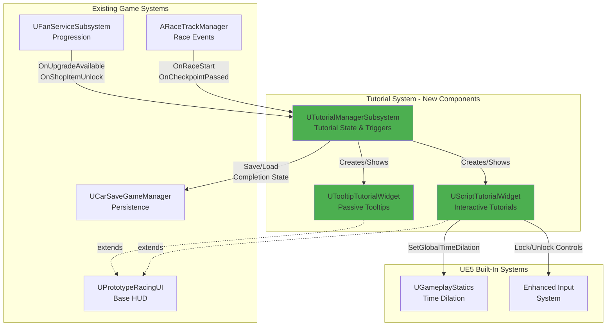
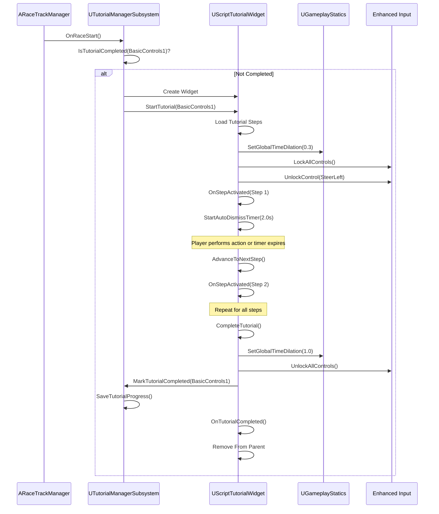
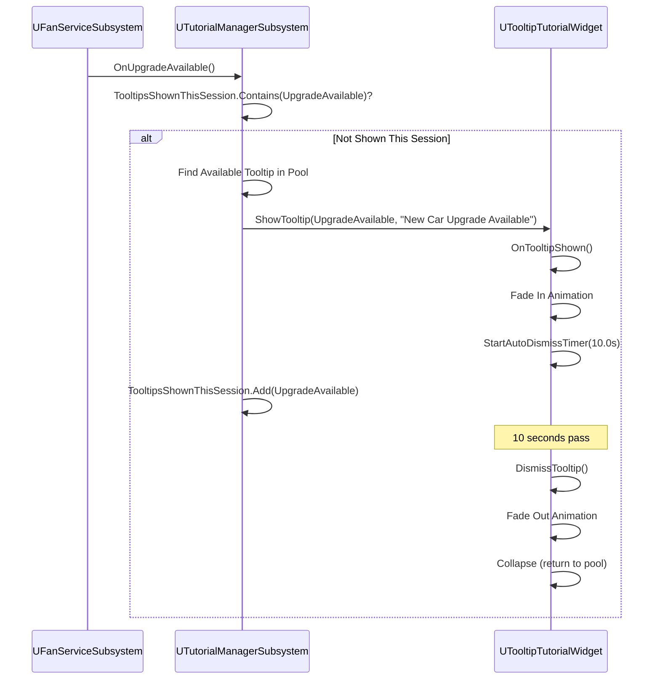
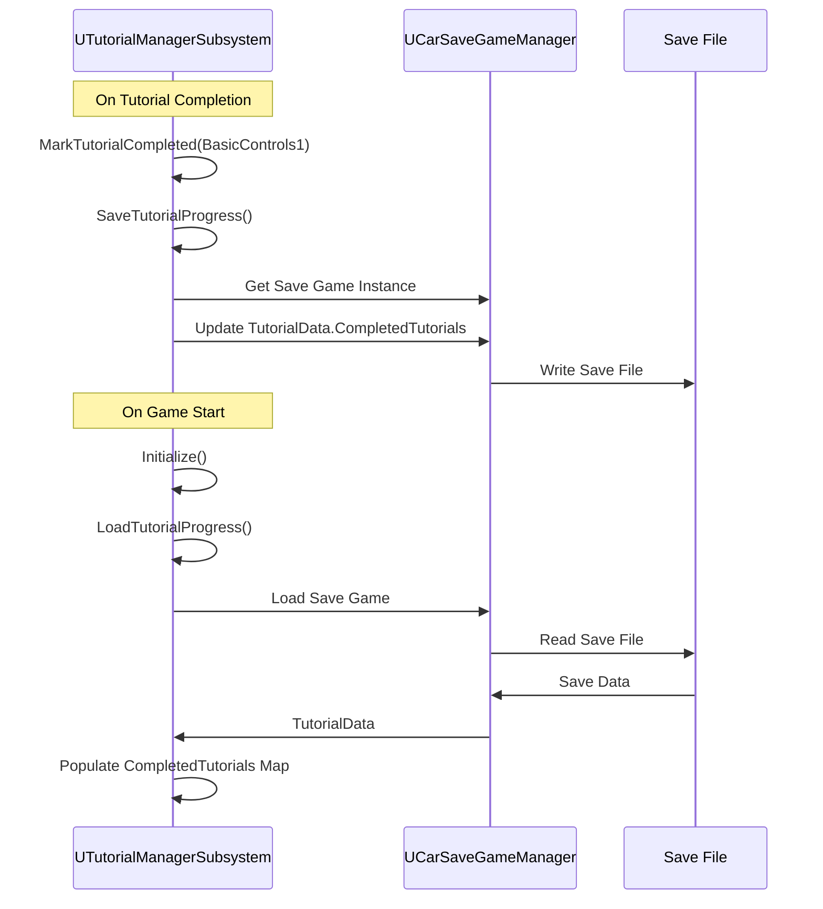

---
phase: design
title: Tutorial System Design & Architecture
description: Simple component-based architecture for interactive tutorials and contextual tooltips
---

# Tutorial System Design & Architecture

## Architecture Overview

### High-Level System Architecture

The tutorial system follows a **simple, direct component-based architecture** with minimal abstraction. It consists of three core components integrated with existing VNRacing systems.



### Key Design Principles

1. **KISS (Keep It Simple, Stupid)**: No unnecessary abstractions, interfaces, or design patterns
2. **YAGNI (You Aren't Gonna Need It)**: Only implement what's explicitly required
3. **Reuse Existing Systems**: Leverage ARaceTrackManager events, UPrototypeRacingUI patterns, existing save system
4. **Event-Driven Architecture**: Zero Tick-based updates (mobile performance requirement)
5. **Component Composition**: Simple UUserWidget inheritance, no complex class hierarchies

### Technology Stack

| Component | Technology | Rationale |
|-----------|-----------|-----------|
| **Tutorial Manager** | C++ (UGameInstanceSubsystem) | Persistent across levels, simple lifecycle |
| **Tutorial Widgets** | Blueprint (extends C++ base) | Designer-friendly, rapid iteration |
| **Data Structures** | C++ Structs (USTRUCT) | Simple data containers, no methods |
| **Time Dilation** | UE5 Built-in (UGameplayStatics) | No custom slow-motion system needed |
| **Input Locking** | Enhanced Input System | Existing project input system |
| **Save/Load** | Existing UCarSaveGameManager | Reuse proven persistence pattern |

## Component Breakdown

### 1. UTutorialManagerSubsystem (C++)

**Purpose**: Centralized tutorial state tracking and trigger management

**Responsibilities**:
- Check tutorial completion state (simple boolean flags)
- Trigger tutorials based on game events
- Save/load tutorial completion data
- Manage tooltip display queue (max 3 simultaneous)

**Implementation Strategy**: C++ for core logic, Blueprint-callable functions for designer access

**Key Interface**:
```cpp
UCLASS()
class PROTOTYPERACING_API UTutorialManagerSubsystem : public UGameInstanceSubsystem
{
    GENERATED_BODY()
    
public:
    virtual void Initialize(FSubsystemCollectionBase& Collection) override;
    virtual void Deinitialize() override;
    
    UFUNCTION(BlueprintCallable, Category = "Tutorial")
    void CheckAndTriggerTutorial(ETutorialID TutorialID);
    
    UFUNCTION(BlueprintPure, Category = "Tutorial")
    bool IsTutorialCompleted(ETutorialID TutorialID) const;
    
    UFUNCTION(BlueprintCallable, Category = "Tutorial")
    void MarkTutorialCompleted(ETutorialID TutorialID);
    
    UFUNCTION(BlueprintCallable, Category = "Tutorial")
    void ShowTooltip(ETooltipType TooltipType);
    
    void SaveTutorialProgress();
    void LoadTutorialProgress();
    
    UFUNCTION(Exec)
    void ResetTutorials();
    
    UFUNCTION(Exec)
    void TriggerTutorial(FString TutorialName);
    
private:
    UPROPERTY()
    TMap<ETutorialID, bool> CompletedTutorials;
    
    UPROPERTY()
    TSet<ETooltipType> TooltipsShownThisSession;
    
    UPROPERTY()
    UScriptTutorialWidget* ActiveScriptTutorial;
    
    UPROPERTY()
    TArray<UTooltipTutorialWidget*> TooltipPool;
};
```

**Anti-Overengineering Notes**:
-  No abstract base classes
-  No complex state machine
-  No event bus
-  No dependency injection

### 2. UScriptTutorialWidget (C++ Base, Blueprint Child)

**Purpose**: Display interactive tutorial steps with slow motion, control locking, and screen masking

**Responsibilities**:
- Display tutorial panel with text and image
- Apply time dilation (0.3x slow motion)
- Lock all controls except highlighted control
- Show screen mask with cutout for interactive area
- Auto-dismiss after configured duration
- Progress through tutorial steps
- Mark tutorial as completed

**C++ Base Class Interface**:
```cpp
UCLASS()
class PROTOTYPERACING_API UScriptTutorialWidget : public UPrototypeRacingUI
{
    GENERATED_BODY()
    
public:
    UFUNCTION(BlueprintCallable, Category = "Tutorial")
    void StartTutorial(ETutorialID TutorialID);
    
    UFUNCTION(BlueprintCallable, Category = "Tutorial")
    void AdvanceToNextStep();
    
    UFUNCTION(BlueprintCallable, Category = "Tutorial")
    void CompleteTutorial();
    
    void ApplySlowMotion(float TimeDilation = 0.3f);
    void RestoreNormalSpeed();
    
    void LockAllControls();
    void UnlockControl(EControlType ControlType);
    void UnlockAllControls();
    
    void StartAutoDismissTimer(float Duration);
    void ClearAutoDismissTimer();
    
    UFUNCTION(BlueprintImplementableEvent, Category = "Tutorial")
    void OnStepActivated(const FTutorialStepData& StepData);
    
    UFUNCTION(BlueprintImplementableEvent, Category = "Tutorial")
    void OnTutorialCompleted();
    
private:
    UPROPERTY()
    ETutorialID CurrentTutorialID;
    
    UPROPERTY()
    TArray<FTutorialStepData> TutorialSteps;
    
    UPROPERTY()
    int32 CurrentStepIndex;
    
    FTimerHandle AutoDismissTimerHandle;
};
```

**Blueprint Implementation (WBP_ScriptTutorial)**:
- UI Layout: Panel background, text, image, control highlight, screen mask
- Event `OnStepActivated`: Update UI, position highlight, update mask cutout
- Event `OnTutorialCompleted`: Fade out, remove from parent

### 3. UTooltipTutorialWidget (C++ Base, Blueprint Child)

**Purpose**: Display passive contextual tooltips with auto-dismiss

**Responsibilities**:
- Show tooltip with icon and message
- Auto-dismiss after 10 seconds
- Return to object pool when dismissed

**C++ Base Class Interface**:
```cpp
UCLASS()
class PROTOTYPERACING_API UTooltipTutorialWidget : public UPrototypeRacingUI
{
    GENERATED_BODY()
    
public:
    UFUNCTION(BlueprintCallable, Category = "Tutorial")
    void ShowTooltip(ETooltipType TooltipType, FText Message);
    
    UFUNCTION(BlueprintCallable, Category = "Tutorial")
    void DismissTooltip();
    
    UFUNCTION(BlueprintImplementableEvent, Category = "Tutorial")
    void OnTooltipShown(ETooltipType TooltipType, FText Message);
    
private:
    FTimerHandle AutoDismissTimerHandle;
};
```

**Blueprint Implementation (WBP_Tooltip)**:
- UI Layout: Background, icon, text
- Event `OnTooltipShown`: Update icon based on type, update text, fade in
- Positioning: Top-center of screen

## Data Models

### FTutorialStepData (USTRUCT)

```cpp
USTRUCT(BlueprintType)
struct FTutorialStepData : public FTableRowBase
{
    GENERATED_BODY()

    UPROPERTY(EditAnywhere, BlueprintReadWrite)
    FText PanelText;

    UPROPERTY(EditAnywhere, BlueprintReadWrite)
    TSoftObjectPtr<UTexture2D> PanelImage;

    UPROPERTY(EditAnywhere, BlueprintReadWrite)
    EControlType HighlightedControl = EControlType::None;

    UPROPERTY(EditAnywhere, BlueprintReadWrite)
    float AutoDismissTime = 2.0f;

    UPROPERTY(EditAnywhere, BlueprintReadWrite)
    FString CompletionCondition;
};
```

### FTutorialSaveData (USTRUCT)

```cpp
USTRUCT(BlueprintType)
struct FTutorialSaveData
{
    GENERATED_BODY()

    UPROPERTY(SaveGame)
    TArray<ETutorialID> CompletedTutorials;
};
```

### ETutorialID (UENUM)

```cpp
UENUM(BlueprintType)
enum class ETutorialID : uint8
{
    None,
    BasicControls1,
    BasicControls2,
    VnTourMap,
    BasicCarUpgrade,
    AdvancedCarUpgrade,
    BasicCarCustomize
};
```

### ETooltipType (UENUM)

```cpp
UENUM(BlueprintType)
enum class ETooltipType : uint8
{
    None,
    UpgradeAvailable,
    OutOfFuel,
    NewShopItems
};
```

### EControlType (UENUM)

```cpp
UENUM(BlueprintType)
enum class EControlType : uint8
{
    None,
    SteerLeft,
    SteerRight,
    Drift,
    NOS,
    Brake
};
```

## Integration Points

### 1. ARaceTrackManager Integration

**Event Hooks**:
- `OnRaceStart()` - Check if first race, prepare to trigger Basic Controls 1
- `OnCheckpointPassed()` - Detect first curve approach, trigger Basic Controls 1
- `OnRaceCompleted()` - Check if first race completion, trigger VnTourMap

**Implementation Pattern**:
```cpp
void AMyRaceTrackManager::OnRaceStart()
{
    Super::OnRaceStart();
    
    if (UTutorialManagerSubsystem* TutorialMgr = GetGameInstance()->GetSubsystem<UTutorialManagerSubsystem>())
    {
        // Check if this is player's first race
        if (IsFirstRace())
        {
            TutorialMgr->CheckAndTriggerTutorial(ETutorialID::BasicControls1);
        }
    }
}
```

### 2. UPrototypeRacingUI Extension

**Pattern**: Both `UScriptTutorialWidget` and `UTooltipTutorialWidget` extend `UPrototypeRacingUI`

**Benefits**:
- Inherit existing HUD functionality
- Consistent UI patterns
- Access to existing UI utilities

### 3. Save System Integration

**Pattern**: Add `FTutorialSaveData` to existing save game class

**Implementation**:
```cpp
// In existing save game class
UPROPERTY(SaveGame)
FTutorialSaveData TutorialData;

// In UTutorialManagerSubsystem
void UTutorialManagerSubsystem::SaveTutorialProgress()
{
    if (UCarSaveGameManager* SaveMgr = GetGameInstance()->GetSubsystem<UCarSaveGameManager>())
    {
        // Update TutorialData in save game
        // Call existing save function
    }
}
```

### 4. Progression System Integration

**Event Hooks**:
- `UFanServiceSubsystem::OnUpgradeAvailable()` - Show "Upgrade Available" tooltip
- `UFanServiceSubsystem::OnShopItemUnlocked()` - Show "New Shop Items" tooltip

### 5. Vehicle Physics Integration

**Event Hooks**:
- `ASimulatePhysicsCar::OnDriftStarted()` - Trigger Basic Controls 2 on first drift
- `ASimulatePhysicsCar::OnFuelDepleted()` - Show "Out of Fuel" tooltip

## Sequence Diagrams

### Script Tutorial Activation Flow



### Tooltip Display Flow



### Save/Load Flow



## Design Decisions

### Decision 1: UGameInstanceSubsystem vs Singleton

**Choice**: UGameInstanceSubsystem

**Rationale**:
-  Built-in UE5 pattern, no custom singleton needed
-  Automatic lifecycle management (Initialize/Deinitialize)
-  Persistent across level transitions
-  Easy access via `GetGameInstance()->GetSubsystem<>()`
-  Blueprint-friendly

**Alternatives Considered**:
-  Singleton: Requires custom implementation, not UE5 idiomatic
-  GameMode component: Not persistent across levels
-  GameInstance component: Subsystem is cleaner pattern

### Decision 2: No Abstract Base Classes

**Choice**: Direct inheritance from UPrototypeRacingUI

**Rationale**:
-  KISS principle - no unnecessary abstraction
-  Only 2 widget types (Script, Tooltip) - no need for polymorphism
-  Simpler code, easier to understand and maintain
-  Faster iteration for designers

**Alternatives Considered**:
-  ITutorialWidget interface: Overengineering for 2 types
-  UTutorialWidgetBase abstract class: Adds complexity without benefit

### Decision 3: Event-Driven Architecture (No Tick)

**Choice**: Use FTimerHandle and Event Dispatchers

**Rationale**:
-  Mobile performance requirement (no Tick overhead)
-  More efficient - only execute when needed
-  Easier to debug - explicit event flow
-  Follows existing project patterns (ARaceTrackManager events)

**Alternatives Considered**:
-  Tick-based updates: Poor mobile performance, unnecessary overhead
-  Polling: Still requires Tick or timer, less efficient

### Decision 4: Object Pooling for Tooltips

**Choice**: Pre-create 3 tooltip instances, reuse them

**Rationale**:
-  Avoid runtime allocation spikes (mobile performance)
-  Max 3 simultaneous tooltips (design requirement)
-  Simple pool implementation (array of 3 widgets)
-  Predictable resource usage

**Alternatives Considered**:
-  Create/destroy on demand: Allocation spikes, GC pressure
-  Complex pooling system: Overengineering for 3 instances

### Decision 5: Global Time Dilation vs Custom System

**Choice**: Use UGameplayStatics::SetGlobalTimeDilation

**Rationale**:
-  Built-in UE5 feature, no custom implementation needed
-  Affects all game systems consistently
-  Simple to use (one function call)
-  Well-tested and optimized by Epic

**Alternatives Considered**:
-  Custom slow-motion system: Reinventing the wheel
-  Per-actor CustomTimeDilation: More complex, inconsistent results

### Decision 6: Data Table for Tutorial Steps

**Choice**: Use UE5 Data Table with FTutorialStepData rows

**Rationale**:
-  Designer-friendly (edit in UE5 editor, no code changes)
-  Supports text formatting (FText)
-  Easy to add/modify tutorial steps
-  Soft references to images (async loading)

**Alternatives Considered**:
-  Hardcoded in C++: Requires recompile for changes
-  JSON/CSV: Less UE5-idiomatic, no FText support

## Non-Functional Requirements

### Performance Targets

| Metric | Target | Measurement Method |
|--------|--------|-------------------|
| **Frame Rate** | 60 FPS during slow motion | Unreal Insights, stat fps |
| **Widget Creation Time** | <100ms | Unreal Insights |
| **Tutorial Load Time** | <100ms | Unreal Insights |

### Scalability Considerations

- **Tooltip Pool Size**: Fixed at 3 (design requirement, no scaling needed)
- **Tutorial Steps**: Data Table supports unlimited steps (limited by design, not code)
- **Concurrent Tutorials**: Max 1 script tutorial at a time (design requirement)

### Security Requirements

- **Save Data Integrity**: Use existing save system's validation
- **Debug Commands**: Exec functions only available in development builds

### Reliability/Availability

- **Tutorial Failure Handling**: If tutorial widget fails to create, log error and continue game
- **Save Failure Handling**: If save fails, tutorial still completes (re-trigger on next session)
- **Interruption Handling**: If game paused/minimized during tutorial, restore normal speed on resume

---

**References**:
- Requirements: `Docs/features/tutorials/requirements/README.md`
- Original Spec: `Docs/features/tutorials/requirements/VN-Racing-Tutorials-V2.md`
- Figma Designs: [Link in requirements doc]
