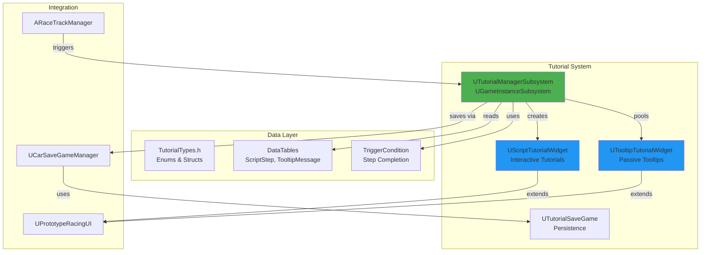
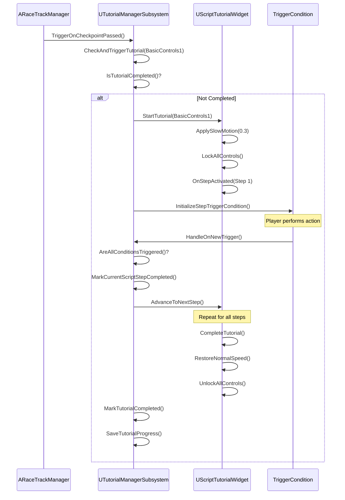
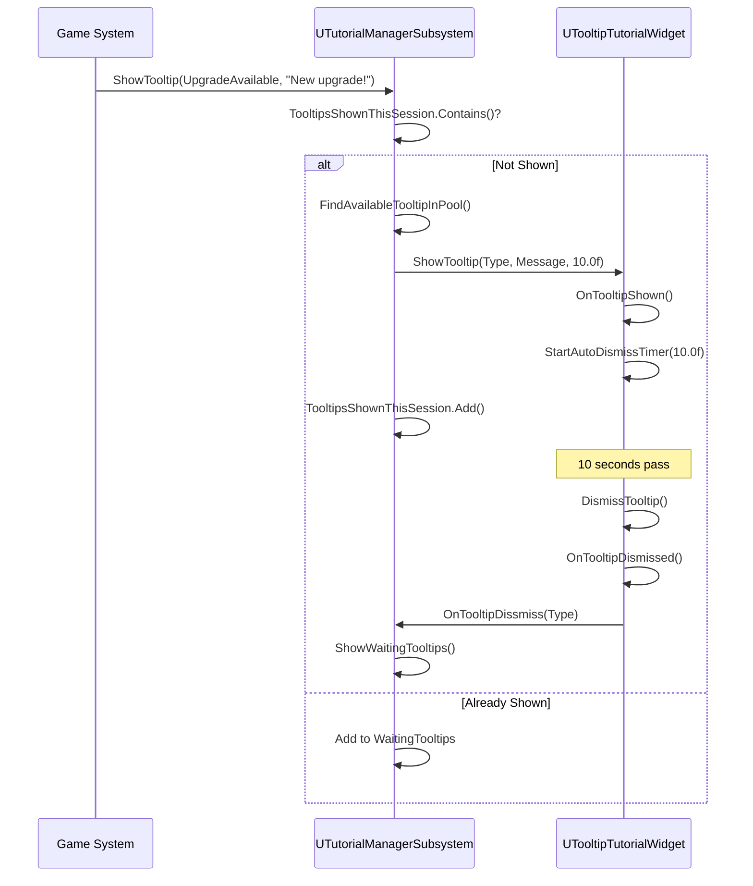

# Tutorial System Architecture - VNRacing

**Project**: PrototypeRacing - Mobile Racing Game
**Document**: Tutorial System Architecture
**Version**: 1.0.0
**Date**: 2026-01-20
**Status**: ✅ Synced with Source Code

---

## Implementation Status Overview

| Component | Status | Location |
|-----------|--------|----------|
| UTutorialManagerSubsystem | ✅ Implemented | `Source/PrototypeRacing/Public/TutorialSystem/TutorialManagerSubsystem.h` |
| UScriptTutorialWidget | ✅ Implemented | `Source/PrototypeRacing/Public/TutorialSystem/ScriptTutorialWidget.h` |
| UTooltipTutorialWidget | ✅ Implemented | `Source/PrototypeRacing/Public/TutorialSystem/TooltipTutorialWidget.h` |
| UTutorialSaveGame | ✅ Implemented | `Source/PrototypeRacing/Public/TutorialSystem/TutorialSaveGame.h` |
| TutorialTypes | ✅ Implemented | `Source/PrototypeRacing/Public/TutorialSystem/TutorialTypes.h` |
| TriggerCondition System | ✅ Implemented | `Source/PrototypeRacing/Public/TutorialSystem/TriggerCondition/` |

---

## Architecture Overview

The Tutorial System uses a subsystem-based architecture with event-driven triggers and object pooling for tooltips.

### High-Level System Architecture



---

## Core Components

### 1. UTutorialManagerSubsystem ✅

**Location**: `Source/PrototypeRacing/Public/TutorialSystem/TutorialManagerSubsystem.h`
**Type**: `UGameInstanceSubsystem`
**Purpose**: Central manager for all tutorial state and triggers

**Actual Implementation**:
```cpp
UCLASS()
class PROTOTYPERACING_API UTutorialManagerSubsystem : public UGameInstanceSubsystem
{
    GENERATED_BODY()

public:
    virtual void Initialize(FSubsystemCollectionBase& Collection) override;
    virtual void Deinitialize() override;

    // === Tutorial Management ===
    UFUNCTION(BlueprintCallable, Category = "Tutorial")
    void InitializeCompletedTutorials();

    UFUNCTION(BlueprintCallable, Category = "Tutorial")
    void CheckAndTriggerTutorial(ETutorialID TutorialID);

    UFUNCTION(BlueprintPure, Category = "Tutorial")
    bool IsTutorialCompleted(ETutorialID TutorialID);

    UFUNCTION(BlueprintCallable, Category = "Tutorial")
    void MarkTutorialCompleted(ETutorialID TutorialID);

    // === Tooltip Management ===
    UFUNCTION(BlueprintCallable, Category = "Tutorial")
    void ShowTooltip(ETooltipType TooltipType, FText Message = FText());

    UFUNCTION(BlueprintCallable, Category = "Tutorial")
    UTooltipTutorialWidget* FindAvailableTooltipInPool();

    UFUNCTION(BlueprintCallable, Category = "Tutorial")
    void InitializeToolTipWidgetInPool();

    UFUNCTION(BlueprintCallable, Category = "Tutorial")
    void ShowWaitingTooltips();

    UFUNCTION(BlueprintCallable, Category = "Tutorial")
    void OnTooltipDissmiss(ETooltipType TooltipType);

    // === Script Tutorial Management ===
    UFUNCTION(BlueprintCallable, Category = "Tutorial")
    void InitializeScriptStepTutorial();

    UFUNCTION(BlueprintCallable, Category = "Tutorial|Script Manager")
    void ActivateNextScriptStep();

    UFUNCTION(BlueprintCallable, Category = "Tutorial|Script Manager")
    void ActivateCurrentScriptStep();

    UFUNCTION(BlueprintCallable, Category = "Tutorial|Script Manager")
    void ActivateTutorialForBeginner();

    UFUNCTION(BlueprintCallable, Category = "Tutorial|Script Manager")
    void InitializeStepTriggerCondition();

    UFUNCTION(BlueprintCallable, Category = "Tutorial|Script Manager")
    void HandleOnNewTrigger(UTriggerCondition* TriggerCondition);

    UFUNCTION(BlueprintCallable, Category = "Tutorial|Script Step Manager")
    bool AreAllConditionsTriggered();

    UFUNCTION(BlueprintCallable, Category = "Tutorial|Script Step Manager")
    void MarkCurrentScriptStepCompleted();

    // === Control Locking System ===
    UFUNCTION(BlueprintCallable, Category = "Tutorial|Control Locking System")
    void LockAllControls();

    UFUNCTION(BlueprintCallable, Category = "Tutorial|Control Locking System")
    void UnlockAllControls();

    UFUNCTION(BlueprintCallable, Category = "Tutorial|Control Locking System")
    void UnlockControl(ERacingControlType Control);

    UFUNCTION(BlueprintCallable, Category = "Tutorial|Control Locking System")
    void RegisterControls(TMap<ERacingControlType, UObject*> Controls);

    UFUNCTION(BlueprintCallable, Category = "Tutorial|Control Locking System")
    void SetControlsIsLocked(bool bAllControls, bool bLock, ERacingControlType ControlType);

    // === Save/Load ===
    void SaveTutorialProgress();
    void LoadTutorialProgress();

    UFUNCTION(BlueprintCallable, Category = "Tutorial")
    void ResetTutorials();

    UFUNCTION(BlueprintCallable, Category = "Tutorial")
    void TriggerTutorial(ETutorialID Tutorial);

    // === Configuration ===
    UFUNCTION(BlueprintCallable, Category = "Tutorial")
    void SetCurrentUserIndex(int NewUserIndex);

    UFUNCTION(BlueprintCallable, Category = "Tutorial")
    void SetTutorialWidgetClass(TSubclassOf<UUserWidget> InScriptTutorialClass, 
                                 TSubclassOf<UUserWidget> InTooltipClass);

    UFUNCTION(BlueprintCallable, Category = "Tutorial")
    void SetMaxTutorialWidgetInPool(const int NewMaxWidget);

    UFUNCTION(BlueprintCallable, Category = "Tutorial")
    void SetTooltipMessageDataTable(UDataTable* NewDataTable);

    UFUNCTION(BlueprintCallable, Category = "Tutorial")
    void SetScriptStepDataTable(UDataTable* NewDataTable);

    UFUNCTION(BlueprintCallable, Category = "Tutorial")
    void SetTutorialIsEnable(bool bInEnable);

    UFUNCTION(BlueprintCallable, BlueprintPure, Category = "Tutorial")
    bool GetTutorialIsEnable();

    // === Utility ===
    UFUNCTION(BlueprintCallable, Category = "Tutorial")
    UObject* GetWidgetObjectByControlType(ERacingControlType ControlType);

    UFUNCTION(BlueprintCallable, BlueprintPure, Category = "Tutorial")
    ERacingControlType GetControlTypeByWidget(UObject* Widget);

private:
    UPROPERTY()
    UCarSaveGameManager* SaveGameManager;

    UPROPERTY()
    ARaceTrackManager* RaceTrackManager;

    UPROPERTY()
    TMap<ERacingControlType, UObject*> WidgetControls;

    FString TutorialSaveName = "Tutorial";
    int32 CurrentUserIndex = 0;

    UPROPERTY()
    TMap<ETutorialID, bool> CompletedTutorials;

    UPROPERTY()
    TSet<ETooltipType> TooltipsShownThisSession;

    UPROPERTY()
    TArray<FTooltip> WaitingTooltips;

    UPROPERTY()
    UScriptTutorialWidget* ActiveScriptTutorial;

    UPROPERTY()
    TArray<UTooltipTutorialWidget*> TooltipPool;

    int MaxTooltipInPool = 3;

    TSubclassOf<UUserWidget> ScriptTutorialClass;
    TSubclassOf<UUserWidget> TooltipClass;

    UDataTable* TooltipMessageDataTable;
    UDataTable* ScriptStepDataTable;

    UPROPERTY()
    TMap<ETutorialID, FTutorialStep> ScriptStep;

    int32 CurrentStepIndex = 0;
    ETutorialID CurrentTutorialID = ETutorialID::None;

    UPROPERTY()
    TArray<UTriggerCondition*> CurrentStepTriggerConditions;

    bool bIsEventAlreadyTriggered = false;
    bool bIsEnableTutorial = false;

public:
    UPROPERTY(BlueprintAssignable, BlueprintCallable, Category = "Tutorial")
    FOnSetLockControls OnSetLockControls;

    UPROPERTY(BlueprintAssignable, BlueprintCallable, Category = "Tutorial")
    FOnLoadWidget OnLoadWidget;
};
```

**Delegates**:
```cpp
DECLARE_DYNAMIC_MULTICAST_DELEGATE(FOnScriptTutorialNextStepActivate);
DECLARE_DYNAMIC_MULTICAST_DELEGATE_OneParam(FOnSetLockControls, bool, bLock);
DECLARE_DYNAMIC_MULTICAST_DELEGATE_OneParam(FOnLoadWidget, TSubclassOf<UUserWidget>, WidgetClass);
```

---

### 2. UScriptTutorialWidget ✅

**Location**: `Source/PrototypeRacing/Public/TutorialSystem/ScriptTutorialWidget.h`
**Type**: `UPrototypeRacingUI` (extends base HUD widget)
**Purpose**: Interactive tutorial with slow motion, control locking, and step progression

```cpp
UCLASS()
class PROTOTYPERACING_API UScriptTutorialWidget : public UPrototypeRacingUI
{
    GENERATED_BODY()

public:
    virtual void NativeConstruct() override;
    virtual void NativeTick(const FGeometry& MyGeometry, float InDeltaTime) override;

    UFUNCTION(BlueprintCallable, Category = "Tutorial|Script")
    void StartTutorial(ETutorialID TutorialID);

    UFUNCTION(BlueprintCallable, Category = "Tutorial|Script")
    void AdvanceToNextStep();

    UFUNCTION(BlueprintCallable, Category = "Tutorial|Script")
    void CompleteTutorial();

    UFUNCTION(BlueprintCallable, Category = "Tutorial|Script")
    void ApplySlowMotion(float TimeDilation = 0.3f);

    UFUNCTION(BlueprintCallable, Category = "Tutorial|Script")
    void RestoreNormalSpeed();

    void LockAllControls();
    void UnlockControl(ERacingControlType ControlType);
    void UnlockAllControls();

    UFUNCTION(BlueprintCallable, Category = "Tutorial|Script")
    void StartAutoDismissTimer(float Duration);

    UFUNCTION(BlueprintCallable, Category = "Tutorial|Script")
    void ClearAutoDismissTimer();

    void ActivateStep(const FTutorialStepData& Step);

    UFUNCTION(BlueprintCallable, Category = "Tutorial|Script")
    void PerformCurrentStep(const FTutorialStepData& InCurrentStepData);

    UFUNCTION(BlueprintCallable, Category = "Tutorial|Script")
    void OnCurrentTutorialStepDismiss();

    UFUNCTION(BlueprintCallable, Category = "Tutorial|Script")
    bool IsStepPerforming();

protected:
    UFUNCTION(BlueprintImplementableEvent, Category = "Tutorial|Script")
    void OnStepActivated(const FTutorialStepData& StepData);

    UFUNCTION(BlueprintImplementableEvent, Category = "Tutorial|Script")
    void OnTutorialCompleted();

private:
    UDataTable* TutorialDataTable;
    ETutorialID CurrentTutorialID;
    TArray<FTutorialStepData> TutorialSteps;
    int32 CurrentStepIndex;
    FTimerHandle AutoDismissTimerHandle;

public:
    UPROPERTY(BlueprintAssignable)
    FOnSetControlsIsLocked OnSetControlsIsLocked;

    UPROPERTY()
    FOnTutorialCompleted OnMarkTutorialCompleted;

    UPROPERTY()
    FOnTutorialStepDismissed OnTutorialStepDismissed;

    UPROPERTY()
    FOnWidgetLoadCalled OnWidgetLoadCalled;

    UPROPERTY()
    FTimeline DelationTimeline;

    UPROPERTY(EditAnywhere, Category = "Tutorial|Timeline")
    UCurveFloat* DelationCurveFloat;

    UPROPERTY()
    FTutorialStepData CurrentStepData;

    UFUNCTION()
    void HandleTimelineProgress(float Value);
};
```

**Delegates**:
```cpp
DECLARE_DYNAMIC_MULTICAST_DELEGATE_ThreeParams(FOnSetControlsIsLocked, bool, bAllControls, bool, bLock, ERacingControlType, ControlType);
DECLARE_DYNAMIC_MULTICAST_DELEGATE_OneParam(FOnTutorialCompleted, ETutorialID, TutorialID);
DECLARE_DYNAMIC_MULTICAST_DELEGATE(FOnTutorialStepDismissed);
DECLARE_DYNAMIC_MULTICAST_DELEGATE_OneParam(FOnWidgetLoadCalled, TSubclassOf<UUserWidget>, WidgetClass);
```

---

### 3. UTooltipTutorialWidget ✅

**Location**: `Source/PrototypeRacing/Public/TutorialSystem/TooltipTutorialWidget.h`
**Type**: `UPrototypeRacingUI`
**Purpose**: Passive tooltip display with auto-dismiss and object pooling

```cpp
UCLASS()
class PROTOTYPERACING_API UTooltipTutorialWidget : public UPrototypeRacingUI
{
    GENERATED_BODY()

public:
    UFUNCTION(BlueprintCallable, Category = "Tutorial|Tooltip")
    void ShowTooltip(ETooltipType TooltipType, FText Message, float DismissDuration = 10.f);

    UFUNCTION(BlueprintCallable, Category = "Tutorial|Tooltip")
    void DismissTooltip();

    UFUNCTION(BlueprintPure, Category = "Tutorial|Tooltip")
    bool IsActive() const { return bIsActive; }

    void StartAutoDismissTimer(float DismissDuration = 10.f);

protected:
    UFUNCTION(BlueprintImplementableEvent, Category = "Tutorial|Tooltip")
    void OnTooltipShown(ETooltipType TooltipType, const FText& Message);

    UFUNCTION(BlueprintImplementableEvent, Category = "Tutorial|Tooltip")
    void OnTooltipDismissed();

private:
    FTimerHandle AutoDismissTimerHandle;
    ETooltipType CurrentTooltipType;
    bool bIsActive;

public:
    UPROPERTY()
    FOnTooltipDismiss OnTooltipTutorialDismissed;
};
```

---

## Data Structures

### Enumerations

```cpp
// Tutorial IDs
UENUM(BlueprintType)
enum class ETutorialID : uint8
{
    None                UMETA(DisplayName = "None"),
    BasicControls1      UMETA(DisplayName = "Basic Controls 1"),
    BasicControls2      UMETA(DisplayName = "Basic Controls 2"),
    VnTourMap           UMETA(DisplayName = "VN Tour Map"),
    BasicCarUpgrade     UMETA(DisplayName = "Basic Car Upgrade"),
    AdvancedCarUpgrade  UMETA(DisplayName = "Advanced Car Upgrade"),
    BasicCarCustomize   UMETA(DisplayName = "Basic Car Customize")
};

// Tooltip Types
UENUM(BlueprintType)
enum class ETooltipType : uint8
{
    None              UMETA(DisplayName = "None"),
    UpgradeAvailable  UMETA(DisplayName = "Upgrade Available"),
    OutOfFuel         UMETA(DisplayName = "Out of Fuel"),
    NewShopItems      UMETA(DisplayName = "New Shop Items"),
    NewCityUnblock    UMETA(DisplayName = "New City Unblock"),
    NewItemRecieved   UMETA(DisplayName = "New Item Recieved"),
    NewAchievement    UMETA(DisplayName = "New Achievement")
};

// Racing Control Types (for locking/highlighting)
UENUM(BlueprintType)
enum class ERacingControlType : uint8
{
    None        UMETA(DisplayName = "None"),
    SteerLeft   UMETA(DisplayName = "Steer Left"),
    SteerRight  UMETA(DisplayName = "Steer Right"),
    Drift       UMETA(DisplayName = "Drift"),
    NOS         UMETA(DisplayName = "NOS"),
    NosBar      UMETA(DisplayName = "NosBar"),
    Brake       UMETA(DisplayName = "Brake"),
    Speed       UMETA(DisplayName = "Speed"),
    Menu        UMETA(DisplayName = "Menu"),
    CityMap     UMETA(DisplayName = "CityMap"),
    Area        UMETA(DisplayName = "Area"),
    Track       UMETA(DisplayName = "Track"),
    Next        UMETA(DisplayName = "Next"),
    Fuel        UMETA(DisplayName = "Fuel"),
    Customize   UMETA(DisplayName = "Customize"),
    Shop        UMETA(DisplayName = "Shop")
};

// Tooltip Position
UENUM(BlueprintType)
enum class ETooltipPosition : uint8
{
    Top     UMETA(DisplayName = "Top"),
    Bottom  UMETA(DisplayName = "Bottom"),
    Right   UMETA(DisplayName = "Right"),
    Left    UMETA(DisplayName = "Left")
};
```

### Structures

```cpp
// Tutorial Save Data
USTRUCT(BlueprintType)
struct FTutorialSaveData
{
    GENERATED_BODY()

    UPROPERTY(SaveGame, BlueprintReadWrite, Category = "Tutorial")
    TArray<ETutorialID> CompletedTutorials;
};

// Tutorial Step Data (DataTable Row)
USTRUCT(BlueprintType)
struct FTutorialStepData : public FTableRowBase
{
    GENERATED_BODY()

    UPROPERTY(EditAnywhere, BlueprintReadWrite, Category = "Tutorial Step")
    ETutorialID TutorialID;

    UPROPERTY(EditAnywhere, BlueprintReadWrite, Category = "Tutorial Step", meta = (ClampMin = "0"))
    int32 StepOrder;

    UPROPERTY(EditAnywhere, BlueprintReadWrite, Category = "Tutorial Step")
    bool bShouldOpenLevel;

    UPROPERTY(EditAnywhere, BlueprintReadWrite, Category = "Tutorial Step")
    TSoftObjectPtr<UWorld> Level;

    UPROPERTY(EditAnywhere, BlueprintReadWrite, Category = "Tutorial Step")
    bool bShouldLoadWidget;

    UPROPERTY(EditAnywhere, BlueprintReadWrite, Category = "Tutorial Step")
    TSubclassOf<UUserWidget> Widget;

    UPROPERTY(EditAnywhere, BlueprintReadWrite, Category = "Tutorial Step")
    float TimeDelation;

    UPROPERTY(EditAnywhere, BlueprintReadWrite, Category = "Tutorial Step")
    FText PanelText;

    UPROPERTY(EditAnywhere, BlueprintReadWrite, Category = "Tutorial Step")
    TSoftObjectPtr<UTexture2D> PanelImage;

    UPROPERTY(EditAnywhere, BlueprintReadWrite, Category = "Tutorial Step")
    ERacingControlType HighlightedControl = ERacingControlType::None;

    UPROPERTY(EditAnywhere, BlueprintReadWrite, Category = "Tutorial Step")
    float AutoDismissTime = 2.0f;

    UPROPERTY(EditAnywhere, BlueprintReadWrite, Category = "Tutorial Step")
    FString CompletionCondition;

    UPROPERTY(EditAnywhere, BlueprintReadWrite, Category = "Tutorial Step")
    TArray<TSubclassOf<UTriggerCondition>> TriggerConditions;

    UPROPERTY(EditAnywhere, BlueprintReadWrite, Category = "Tutorial Step")
    ETooltipPosition TooltipPosition;
};

// Tutorial Step Collection
USTRUCT(BlueprintType)
struct FTutorialStep
{
    GENERATED_BODY()

    UPROPERTY(EditAnywhere)
    TArray<FTutorialStepData> Steps;

    void SortSteps()
    {
        Steps.Sort([](const FTutorialStepData& A, const FTutorialStepData& B)
        {
            return A.StepOrder < B.StepOrder;
        });
    }
};

// Tooltip Data (DataTable Row)
USTRUCT(BlueprintType)
struct FTooltip : public FTableRowBase
{
    GENERATED_BODY()

    UPROPERTY(EditAnywhere, BlueprintReadWrite, Category = "Tooltip")
    ETooltipType Type;

    UPROPERTY(EditAnywhere, BlueprintReadWrite, Category = "Tooltip")
    FText Message;
};
```

---

## Save System

### UTutorialSaveGame ✅

**Location**: `Source/PrototypeRacing/Public/TutorialSystem/TutorialSaveGame.h`

```cpp
UCLASS()
class PROTOTYPERACING_API UTutorialSaveGame : public USaveGame
{
    GENERATED_BODY()

public:
    UFUNCTION()
    void SetTutorialSaveData(FTutorialSaveData NewTutorialSaveData);

    UFUNCTION()
    FTutorialSaveData GetTutorialSaveData();

private:
    UPROPERTY()
    FTutorialSaveData TutorialSaveData;
};
```

---

## Data Flow

### Script Tutorial Flow



### Tooltip Flow



---

## Integration Points

### With ARaceTrackManager

```cpp
void UTutorialManagerSubsystem::TriggerOnCheckpointPassed(const FPlayerRaceState& PlayerRaceState)
{
    // Called from RaceTrackManager when player passes checkpoint
    // Check if tutorial should trigger based on race state
}
```

### With UCarSaveGameManager

- Tutorial progress saved via existing save system
- Save slot: `"Tutorial"`
- User index support for multi-profile

### With UPrototypeRacingUI

- Both widget classes extend `UPrototypeRacingUI`
- Inherit existing HUD functionality
- Consistent UI patterns

---

## DataTables Required

| DataTable | Row Struct | Purpose |
|-----------|------------|---------|
| `DT_ScriptSteps` | `FTutorialStepData` | Tutorial step definitions |
| `DT_TooltipMessages` | `FTooltip` | Default tooltip messages |

---

## Source Files

| File | Location |
|------|----------|
| TutorialManagerSubsystem.h/cpp | `Public/TutorialSystem/`, `Private/TutorialSystem/` |
| ScriptTutorialWidget.h/cpp | `Public/TutorialSystem/`, `Private/TutorialSystem/` |
| TooltipTutorialWidget.h/cpp | `Public/TutorialSystem/`, `Private/TutorialSystem/` |
| TutorialSaveGame.h/cpp | `Public/TutorialSystem/`, `Private/TutorialSystem/` |
| TutorialTypes.h/cpp | `Public/TutorialSystem/`, `Private/TutorialSystem/` |

---

## Summary

The Tutorial System provides:

- **Centralized Management**: `UTutorialManagerSubsystem` as single point of control
- **Interactive Tutorials**: Script-based tutorials with slow motion and control locking
- **Passive Tooltips**: Object-pooled tooltips with auto-dismiss
- **Trigger Conditions**: Flexible step completion via `UTriggerCondition` classes
- **Persistent Progress**: Save/load via existing `UCarSaveGameManager`
- **Event-Driven**: No tick-based updates (mobile performance)

**Next Steps**: Consider adding tutorial skip option and analytics tracking.
