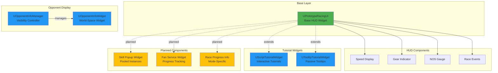

# UI/UX System

**Version:** 1.1.0 | **Created:** 2026-01-26 | **Status:** Active Development


**Breadcrumbs:** [Docs](../../) > [Features](../) > UI/UX

**Feature ID**: `ui-ux`
**Priority**: High
**Owner**: UI Team

---

## Overview

The UI/UX system provides the visual interface layer for PrototypeRacing, including HUD components, tutorial widgets, and opponent information displays. This document consolidates UI documentation scattered across feature folders.

---

## Feature Structure

```
ui-ux/
├── requirements/       # UI requirements (distributed across features)
├── design/            # Widget hierarchy, HUD components
└── implementation/    # Source code locations, key classes
```

**Source Code Location:** `Source/PrototypeRacing/`

---

## Implementation Status

| Component | Status | Location | Description |
|-----------|--------|----------|-------------|
| UPrototypeRacingUI | ✅ Done | `PrototypeRacingUI.h` | Base HUD widget (Speed, Gear, NOS, Race events) |
| UScriptTutorialWidget | ✅ Done | `Public/TutorialSystem/` | Interactive tutorials with slow motion |
| UTooltipTutorialWidget | ✅ Done | `Public/TutorialSystem/` | Passive tooltips with auto-dismiss |
| UOpponentInfoWidget | ✅ Done | `Public/OpponentinfoWidget/` | World-space opponent position/name display |
| UOpponentInfoManager | ✅ Done | `Public/OpponentinfoWidget/` | Distance-based visibility updates |
| Skill Popup System | 🔄 Planned | — | Object-pooled skill notifications |
| Fan Service Widget | 🔄 Planned | — | Mission progress tracking |
| Race Progress Widget | 🔄 Planned | — | Mode-specific progress display |

---

## Widget Hierarchy



---

## Component Details

### UPrototypeRacingUI (Base HUD)
- **Type**: `UUserWidget` (abstract)
- **Location**: `Source/PrototypeRacing/PrototypeRacingUI.h`
- **Purpose**: Root HUD widget with Speed/Gear/NOS display and event binding
- **Key Methods**: `UpdateSpeed()`, `UpdateGear()`, `UpdateNitrous()`
- **Blueprint Events**: `OnSpeedUpdate`, `OnGearUpdate`, `OnNitrousUpdate`

### UScriptTutorialWidget
- **Type**: `UPrototypeRacingUI`
- **Location**: `Source/PrototypeRacing/Public/TutorialSystem/ScriptTutorialWidget.h`
- **Purpose**: Interactive step-by-step tutorials with slow motion and control locking
- **Key Features**: Time dilation (0.3x), control locking, auto-dismiss timer

### UTooltipTutorialWidget
- **Type**: `UPrototypeRacingUI`
- **Location**: `Source/PrototypeRacing/Public/TutorialSystem/TooltipTutorialWidget.h`
- **Purpose**: Passive tooltips with auto-dismiss (10s default)
- **Key Features**: Object pooling (3 widgets), session-based display tracking

### UOpponentInfoWidget
- **Type**: `UUserWidget`
- **Location**: `Source/PrototypeRacing/Public/OpponentinfoWidget/OpponentInfoWidget.h`
- **Purpose**: World-space widget showing opponent position/name above vehicles

### UOpponentInfoManager
- **Type**: `UObject`
- **Location**: `Source/PrototypeRacing/Public/OpponentinfoWidget/OpponentInfoManager.h`
- **Purpose**: Distance-based visibility management for opponent widgets
- **Update Frequency**: 5 Hz (every 0.2s)
- **Distance Thresholds**: >20m hidden, 10-20m position only, <10m name visible

---

## Related Documentation

> UI documentation is distributed across feature folders. Key references:

| Feature | Document | Description |
|---------|----------|-------------|
| Progression | [Player Info HUD Architecture](../progression-system/design/player-info-hud-architecture.md) | Detailed HUD component specs, event system, data structures |
| Tutorials | [Tutorial System README](../tutorials/README.md) | Tutorial types, control locking, tooltips |
| Tutorials | [Tutorials Architecture](../tutorials/design/tutorials-architecture.md) | Widget technical design synced with source code |
| Shop | [Shop System TDD](../shop-system/design/TDD_Shop_System.md) | Shop UI layer components |

---

## Design Principles

1. **Event-Driven Architecture**: All UI updates triggered by events, zero tick-based updates
2. **Component Composition**: Extend `UPrototypeRacingUI` with child widget components
3. **Object Pooling**: Skill popups and tooltips use pooled instances to minimize allocations
4. **Separation of Concerns**: Game logic in C++, UI presentation in Blueprint
5. **Mobile-First Performance**: Distance-based updates, widget pooling, minimal draw calls

---

## Dependencies

| System | Integration | Data Flow |
|--------|-------------|-----------|
| ARaceTrackManager | Event subscriptions | Manager → HUD |
| ASimulatePhysicsCar | Event subscriptions | Vehicle → HUD |
| UFanServiceSubsystem | Event subscriptions | Subsystem → HUD |
| UTutorialManagerSubsystem | Widget management | Subsystem → Widgets |
| UCarSaveGameManager | UI state persistence | Bidirectional |

---

## Performance Targets

| Metric | Target | Notes |
|--------|--------|-------|
| UI Frame Time | <5ms | Samsung Galaxy S21 baseline |
| Draw Calls | <50/frame | Use texture atlases |
| Memory | <50MB | All HUD components |
| Update Frequency | Tiered | Critical 60Hz, Low 5Hz |

---

**Last Updated:** 2026-01-26

