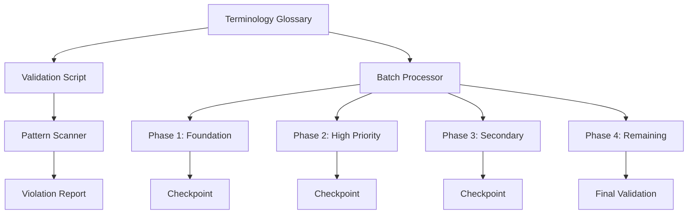
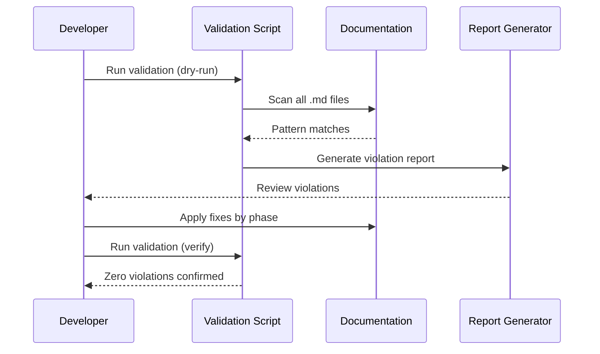

# Documentation Language Professionalization - Technical Design

## Architecture Overview

The language professionalization system uses a glossary-driven approach with automated validation:

1. **Terminology Glossary** - Central source of truth for language standards
2. **Validation Script** - Automated detection of informal patterns
3. **Batch Processing** - Phased processing by feature area priority
4. **Quality Gates** - Validation checkpoints between phases



## Design Decisions

### DD-001: Language Policy Per Document Type

| Document Type | Language Policy |
|---------------|-----------------|
| Requirements (GDDs) | Vietnamese body with English technical terms |
| Design/Architecture | English primary with Vietnamese annotations |
| README files | English with Vietnamese cultural terms preserved |
| Code comments | English for technical, Vietnamese for cultural context |

**Rationale**: Preserves original intent while maintaining accessibility for international contributors.

### DD-002: Placeholder Standardization

Use blockquote format with Owner and Target Date fields:

```markdown
> **[PENDING]** Brief description of pending content.  
> **Owner**: [Team/Role]  
> **Target Date**: [Date or TBD]
```

**Rationale**: Professional appearance, clear accountability, visually distinct from content.

### DD-003: Approximation Notation

| Context | Format | Example |
|---------|--------|---------|
| Prose/narrative | "approximately X" | approximately 50% |
| Tables/data | "≈X" | ≈50% |
| Ranges | "[X-Y]" or "X (±Y)" | 3s (±0.5s) |

**Rationale**: Context-appropriate professionalism; prose reads naturally, tables remain compact.

## Validation Script Design

### Informal Pattern Detection

```powershell
# Patterns to detect informal language
$informalPatterns = @(
    '~[0-9]+',           # Informal approximation (~50%)
    'sẽ bổ sung',        # "will add later"
    'húc văng',          # Informal collision
    'đập hộp',           # Informal loot
    'khoan dung',        # Informal tolerance
    'ít trừng phạt',     # Informal penalty
    '\.\.\.$'            # Trailing ellipsis
)
```

### Script Location

`scripts/validate-doc-language.ps1`

### Script Capabilities

1. Scan all markdown files in `Docs/` folder
2. Detect informal patterns from glossary
3. Generate violation report with file:line references
4. Return exit code for CI/CD integration
5. Support dry-run mode for preview

## Processing Flow



## File Processing Priority

### Priority 1: High Reference Count (Phase 2)
- `car-physics/` - Core physics documentation
- `racer-ai/` - AI behavior specifications
- `profiles-inventory/` - User data and items

### Priority 2: Secondary Features (Phase 3)
- `progression-system/`
- `tutorials/`
- `car-customization/`
- `shop-system/`
- `race-modes/`
- `setting-system/`

### Priority 3: Remaining (Phase 4)
- `multiplayer/`
- `minimap-system/`
- `_architecture/`
- `_cross-reference/`
- `_templates/`

## Component Responsibilities

| Component | Responsibility | Location |
|-----------|---------------|----------|
| Terminology Glossary | Define standard terms | `Docs/_standards/terminology-glossary.md` |
| Validation Script | Detect violations | `scripts/validate-doc-language.ps1` |
| Documentation Standards | Language guidelines | `Docs/_standards/documentation-standards.md` |

## Risk Mitigations

| Risk | Impact | Mitigation |
|------|--------|------------|
| Technical accuracy loss | High | Domain expert review for Priority 1 files |
| Inconsistent application | Medium | Glossary + validation script enforcement |
| Broken cross-references | Medium | Link validation after each phase |
| Cultural meaning loss | Low | Preserve Vietnamese cultural terms in context |

## Error Handling

| Error Case | Response |
|------------|----------|
| Unknown informal pattern | Log for glossary review, continue processing |
| File encoding issues | Skip file, report in summary |
| Ambiguous replacement | Flag for manual review |

## Test Strategy

- **Unit**: Validation script pattern matching accuracy
- **Integration**: Full scan of Docs/ folder
- **Manual**: Domain expert review of Priority 1 files

