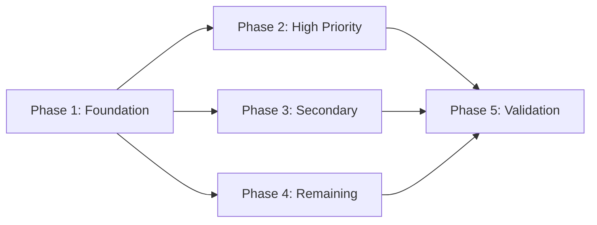

# Documentation Language Professionalization - Tasks

## Phase 1: Foundation & Glossary (2-3 days)

| Task ID | Task | File/Location | DoD | Estimate |
|---------|------|---------------|-----|----------|
| P1-001 | Add Language Professionalization section | `Docs/_standards/documentation-standards.md` | Section added with guidelines | 2h |
| P1-002 | Create terminology glossary | `Docs/_standards/terminology-glossary.md` | Complete glossary with all mappings | 4h |
| P1-003 | Create validation script | `scripts/validate-doc-language.ps1` | Script detects all informal patterns | 4h |
| P1-004 | Review and update standards files | `Docs/_standards/*.md` (4 files) | All standards files professional | 2h |

**Phase 1 Checkpoint**: Glossary approved, validation script functional

---

## Phase 2: High-Priority Features (5-7 days)

| Task ID | Task | Files | DoD | Estimate |
|---------|------|-------|-----|----------|
| P2-001 | Professionalize car-physics requirements | `car-physics/requirements/*.md` (8 files) | Zero informal patterns, glossary applied | 8h |
| P2-002 | Professionalize car-physics design | `car-physics/design/*.md` (6 files) | Zero informal patterns | 4h |
| P2-003 | Professionalize Racer_AI_V5.md | `racer-ai/requirements/Racer_AI_V5.md` | YAML added, all sections professional | 6h |
| P2-004 | Professionalize racer-ai design | `racer-ai/design/*.md` | Consistent with requirements | 3h |
| P2-005 | Professionalize Items_V5.md | `profiles-inventory/requirements/Items_V5.md` (751 lines) | YAML added, all sections professional | 8h |
| P2-006 | Professionalize UserProfile_Inventory_V5.md | `profiles-inventory/requirements/UserProfile_Inventory_V5.md` (716 lines) | YAML added, all sections professional | 8h |
| P2-007 | Professionalize profiles-inventory design | `profiles-inventory/design/*.md` | Consistent with requirements | 4h |

**Phase 2 Checkpoint**: All P2 files pass validation, cross-references verified

---

## Phase 3: Secondary Features (4-5 days)

| Task ID | Task | Files | DoD | Estimate |
|---------|------|-------|-----|----------|
| P3-001 | Professionalize progression-system | `progression-system/**/*.md` (~12 files) | All files professional | 6h |
| P3-002 | Professionalize tutorials | `tutorials/**/*.md` (~6 files) | Pending sections standardized | 4h |
| P3-003 | Professionalize car-customization | `car-customization/**/*.md` (~10 files) | All files professional | 5h |
| P3-004 | Professionalize shop-system | `shop-system/**/*.md` (~8 files) | All files professional | 4h |
| P3-005 | Professionalize race-modes | `race-modes/**/*.md` (~8 files) | All files professional | 4h |
| P3-006 | Professionalize setting-system | `setting-system/**/*.md` (~8 files) | All files professional | 4h |

**Phase 3 Checkpoint**: All P3 files pass validation

---

## Phase 4: Remaining & Foundation (3-4 days)

| Task ID | Task | Files | DoD | Estimate |
|---------|------|-------|-----|----------|
| P4-001 | Professionalize multiplayer | `multiplayer/**/*.md` (~8 files) | All files professional | 4h |
| P4-002 | Professionalize minimap-system | `minimap-system/**/*.md` (~8 files) | All files professional | 4h |
| P4-003 | Professionalize _architecture | `_architecture/*.md` (7 files) | All files professional | 4h |
| P4-004 | Professionalize _cross-reference | `_cross-reference/*.md` (4 files) | All files professional | 2h |
| P4-005 | Update _templates with guidelines | `_templates/**/*.md` (5 folders) | Templates include language guidelines | 4h |

**Phase 4 Checkpoint**: All feature and foundation docs complete

---

## Phase 5: Validation & Polish (2-3 days)

| Task ID | Task | DoD | Estimate |
|---------|------|-----|----------|
| P5-001 | Run full validation | Zero informal patterns across 640 files | 2h |
| P5-002 | Verify YAML frontmatter | All phase documents have frontmatter | 2h |
| P5-003 | Cross-reference validation | All internal links valid | 3h |
| P5-004 | Manual spot-check (10%) | 64 files reviewed, all professional | 6h |
| P5-005 | Update CHANGELOG.md | Professionalization entry added | 1h |
| P5-006 | Generate completion report | Report with metrics and summary | 2h |

**Phase 5 Checkpoint**: All success criteria met

---

## Summary

| Phase | Tasks | Estimated Hours | Days |
|-------|-------|-----------------|------|
| Phase 1 | 4 | 12h | 2-3 |
| Phase 2 | 7 | 41h | 5-7 |
| Phase 3 | 6 | 27h | 4-5 |
| Phase 4 | 5 | 18h | 3-4 |
| Phase 5 | 6 | 16h | 2-3 |
| **Total** | **28** | **114h** | **16-22** |

---

## Success Criteria

- [ ] Zero informal patterns detected by validation script
- [ ] 100% YAML frontmatter compliance for phase documents
- [ ] All terminology matches glossary
- [ ] All placeholders use standard format
- [ ] All cross-references valid
- [ ] Manual review confirms professional tone
- [ ] Domain expert sign-off on high-priority files

---

## Dependencies

**Notes**:
- Phase 1 must complete before any other phase
- Phases 2, 3, 4 can run in parallel after Phase 1
- Phase 5 requires all other phases complete

